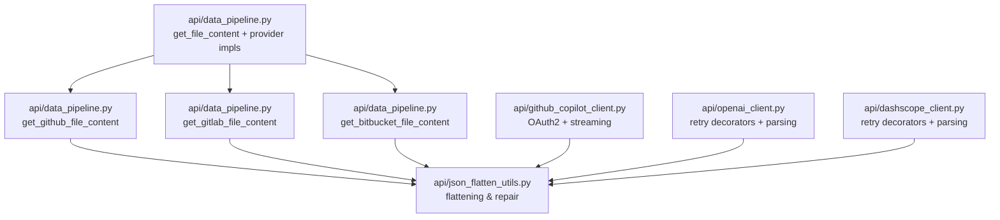
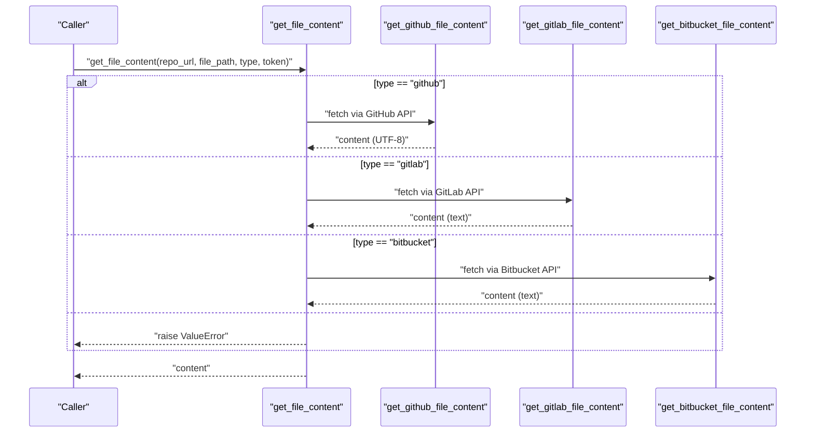
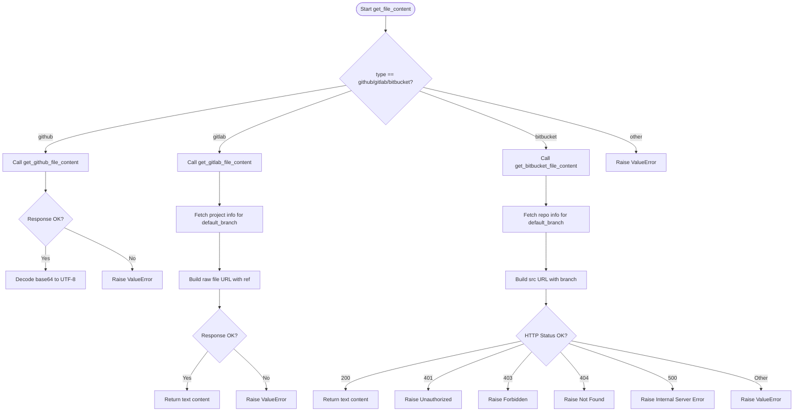
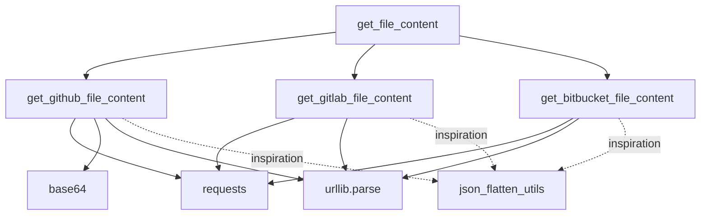

# Remote File Content Retrieval

<cite>
**Referenced Files in This Document**
- [data_pipeline.py](file://api/data_pipeline.py)
- [json_flatten_utils.py](file://api/json_flatten_utils.py)
- [github_copilot_client.py](file://api/github_copilot_client.py)
- [openai_client.py](file://api/openai_client.py)
- [dashscope_client.py](file://api/dashscope_client.py)
- [api.py](file://api/api.py)
- [main.py](file://api/main.py)
</cite>

## Table of Contents
1. [Introduction](#introduction)
2. [Project Structure](#project-structure)
3. [Core Components](#core-components)
4. [Architecture Overview](#architecture-overview)
5. [Detailed Component Analysis](#detailed-component-analysis)
6. [Dependency Analysis](#dependency-analysis)
7. [Performance Considerations](#performance-considerations)
8. [Troubleshooting Guide](#troubleshooting-guide)
9. [Conclusion](#conclusion)

## Introduction
This document explains the remote file content retrieval system implemented in the repository. It focuses on the get_file_content function and its provider-specific implementations for GitHub, GitLab, and Bitbucket. It covers API integration patterns, authentication handling with access tokens, error response processing, file content extraction, encoding handling for base64 responses, and branch resolution for default branches. Practical examples demonstrate retrieving individual files from different repository providers, handling authentication failures, and implementing retry mechanisms for failed API requests.

## Project Structure
The remote file content retrieval functionality is primarily implemented in the data pipeline module. Supporting utilities and client integrations exist for GitHub Copilot, OpenAI, and DashScope, which illustrate authentication and error handling patterns applicable to repository API integrations.

**Diagram sources**
- [data_pipeline.py](file://api/data_pipeline.py#L478-L736)
- [json_flatten_utils.py](file://api/json_flatten_utils.py#L16-L328)
- [github_copilot_client.py](file://api/github_copilot_client.py#L1-L800)
- [openai_client.py](file://api/openai_client.py#L411-L504)
- [dashscope_client.py](file://api/dashscope_client.py#L391-L504)

**Section sources**
- [data_pipeline.py](file://api/data_pipeline.py#L478-L736)

## Core Components
- get_file_content: A dispatcher that selects the appropriate provider-specific implementation based on the repository type.
- Provider-specific implementations:
  - get_github_file_content: Fetches file content from GitHub API, handles base64 decoding, and validates responses.
  - get_gitlab_file_content: Fetches file content from GitLab API, resolves default branch, and handles error responses.
  - get_bitbucket_file_content: Fetches file content from Bitbucket API, resolves default branch, and handles HTTP status codes.
- Authentication handling:
  - GitHub: Uses Authorization header with token scheme.
  - GitLab: Uses PRIVATE-TOKEN header.
  - Bitbucket: Uses Authorization: Bearer header.
- Error handling:
  - Validates response structure and raises descriptive errors for invalid URLs, API errors, and unsupported encodings.
  - Provides fallback default branch resolution when API calls fail.
- Encoding handling:
  - GitHub returns base64-encoded content; decoded to UTF-8 string.
- Branch resolution:
  - Attempts to fetch default branch via repository/project info API; falls back to "main".

**Section sources**
- [data_pipeline.py](file://api/data_pipeline.py#L478-L736)

## Architecture Overview
The retrieval flow depends on the repository type. The dispatcher delegates to provider-specific handlers that construct the appropriate API endpoint, attach authentication headers, and parse the response. For GitHub, the response is base64-decoded. For GitLab and Bitbucket, the raw text content is returned after validating error responses and status codes.

**Diagram sources**
- [data_pipeline.py](file://api/data_pipeline.py#L713-L736)
- [data_pipeline.py](file://api/data_pipeline.py#L478-L554)
- [data_pipeline.py](file://api/data_pipeline.py#L555-L635)
- [data_pipeline.py](file://api/data_pipeline.py#L637-L711)

## Detailed Component Analysis

### get_file_content and Provider-Specific Implementations
- Responsibilities:
  - Validate provider type and delegate to the correct implementation.
  - Return decoded file content as a UTF-8 string.
- GitHub:
  - Constructs API URL from owner/repo and file path.
  - Sets Authorization header with token.
  - Decodes base64 content and returns UTF-8 string.
  - Raises errors for invalid responses or unsupported encodings.
- GitLab:
  - Parses project path and encodes it for API.
  - Resolves default branch via project info API; falls back to "main".
  - Uses PRIVATE-TOKEN header; returns raw text content.
  - Detects JSON error responses and raises descriptive errors.
- Bitbucket:
  - Extracts owner/repo from URL.
  - Resolves default branch via repository info API; falls back to "main".
  - Uses Authorization: Bearer header.
  - Handles HTTP status codes (401, 403, 404, 500) with specific error messages.

**Diagram sources**
- [data_pipeline.py](file://api/data_pipeline.py#L713-L736)
- [data_pipeline.py](file://api/data_pipeline.py#L478-L554)
- [data_pipeline.py](file://api/data_pipeline.py#L555-L635)
- [data_pipeline.py](file://api/data_pipeline.py#L637-L711)

**Section sources**
- [data_pipeline.py](file://api/data_pipeline.py#L478-L736)

### Authentication Handling Patterns
- GitHub:
  - Authorization: token <access_token>
- GitLab:
  - PRIVATE-TOKEN: <access_token>
- Bitbucket:
  - Authorization: Bearer <access_token>
- Environment variables and configuration:
  - The main application loads environment variables and logs warnings for missing required keys. While not directly used for repository retrieval, it demonstrates the pattern for managing credentials.

**Section sources**
- [data_pipeline.py](file://api/data_pipeline.py#L522-L525)
- [data_pipeline.py](file://api/data_pipeline.py#L612-L615)
- [data_pipeline.py](file://api/data_pipeline.py#L686-L689)
- [main.py](file://api/main.py#L61-L86)

### Error Response Processing
- GitHub:
  - Validates JSON response and checks for error fields.
  - Ensures encoding is base64; raises errors for unexpected encodings.
- GitLab:
  - Checks for JSON error responses starting with "{" and containing "message".
  - Uses default branch "main" if project info fetch fails.
- Bitbucket:
  - Interprets HTTP status codes:
    - 401: Unauthorized
    - 403: Forbidden
    - 404: File not found
    - 500: Internal server error
  - Uses default branch "main" if repository info fetch fails.

**Section sources**
- [data_pipeline.py](file://api/data_pipeline.py#L536-L550)
- [data_pipeline.py](file://api/data_pipeline.py#L623-L632)
- [data_pipeline.py](file://api/data_pipeline.py#L694-L704)

### File Content Extraction and Encoding Handling
- GitHub:
  - Joins base64 content lines and decodes to UTF-8.
- GitLab/Bitbucket:
  - Returns raw text content directly after validation.
- Robustness:
  - The GitHub Copilot client includes utilities for flattening malformed JSON responses and repairing streaming chunks, which can inspire similar resilience strategies for API responses.

**Section sources**
- [data_pipeline.py](file://api/data_pipeline.py#L544-L546)
- [json_flatten_utils.py](file://api/json_flatten_utils.py#L16-L328)

### Branch Resolution for Default Branches
- GitLab:
  - Calls project info API to retrieve default_branch; falls back to "main" on failure.
- Bitbucket:
  - Calls repository info API to retrieve mainbranch.name; falls back to "main" on failure.
- GitHub:
  - Does not resolve default branch; file path is resolved relative to the repository root.

**Section sources**
- [data_pipeline.py](file://api/data_pipeline.py#L590-L608)
- [data_pipeline.py](file://api/data_pipeline.py#L661-L679)

### Practical Examples

#### Retrieve a file from GitHub
- Inputs:
  - repo_url: "https://github.com/owner/repo"
  - file_path: "path/to/file.py"
  - type: "github"
  - access_token: "<your_github_token>"
- Behavior:
  - Builds API URL for contents endpoint.
  - Sets Authorization header with token.
  - Decodes base64 content to UTF-8 string.
- Error handling:
  - Raises ValueError for invalid URL, API errors, or unsupported encodings.

**Section sources**
- [data_pipeline.py](file://api/data_pipeline.py#L478-L554)

#### Retrieve a file from GitLab
- Inputs:
  - repo_url: "https://gitlab.example.com/group/project"
  - file_path: "path/to/file.py"
  - type: "gitlab"
  - access_token: "<your_gitlab_token>"
- Behavior:
  - Encodes project and file paths for API.
  - Resolves default branch via project info; uses "main" if unavailable.
  - Uses PRIVATE-TOKEN header; returns raw text.
- Error handling:
  - Raises ValueError for JSON error responses or HTTP exceptions.

**Section sources**
- [data_pipeline.py](file://api/data_pipeline.py#L555-L635)

#### Retrieve a file from Bitbucket
- Inputs:
  - repo_url: "https://bitbucket.org/owner/repo"
  - file_path: "path/to/file.py"
  - type: "bitbucket"
  - access_token: "<your_bitbucket_token>"
- Behavior:
  - Resolves default branch via repository info; uses "main" if unavailable.
  - Uses Authorization: Bearer header.
  - Returns raw text content.
- Error handling:
  - Raises specific errors for 401, 403, 404, 500; generic for others.

**Section sources**
- [data_pipeline.py](file://api/data_pipeline.py#L637-L711)

#### Handling Authentication Failures
- GitHub:
  - Unauthorized responses trigger ValueError with API error message.
- GitLab:
  - Unauthorized responses trigger ValueError with API error message.
- Bitbucket:
  - 401 Unauthorized triggers explicit ValueError.
  - 403 Forbidden triggers explicit ValueError.
  - 404 File not found triggers explicit ValueError.
  - 500 Internal server error triggers explicit ValueError.

**Section sources**
- [data_pipeline.py](file://api/data_pipeline.py#L536-L550)
- [data_pipeline.py](file://api/data_pipeline.py#L623-L632)
- [data_pipeline.py](file://api/data_pipeline.py#L694-L704)

#### Implementing Retry Mechanisms for Failed API Requests
- Pattern:
  - Use exponential backoff decorators around API calls to handle transient errors (timeouts, rate limits, server errors).
- Examples in repository:
  - OpenAI client uses backoff.on_exception with APITimeoutError, InternalServerError, RateLimitError, UnprocessableEntityError, BadRequestError.
  - DashScope client uses backoff.on_exception with the same error types.
- Recommendation:
  - Apply similar decorators to provider-specific file retrieval functions to improve resilience.

**Section sources**
- [openai_client.py](file://api/openai_client.py#L411-L421)
- [openai_client.py](file://api/openai_client.py#L494-L504)
- [dashscope_client.py](file://api/dashscope_client.py#L391-L401)
- [dashscope_client.py](file://api/dashscope_client.py#L494-L504)

## Dependency Analysis
- get_file_content depends on:
  - get_github_file_content
  - get_gitlab_file_content
  - get_bitbucket_file_content
- Provider implementations depend on:
  - requests library for HTTP calls.
  - urllib.parse for URL parsing and quoting.
  - base64 for decoding GitHub content.
- Utility dependencies:
  - json_flatten_utils provides JSON flattening and repair helpers used by GitHub Copilot client; these patterns can inspire robustness for API responses.

**Diagram sources**
- [data_pipeline.py](file://api/data_pipeline.py#L478-L736)
- [json_flatten_utils.py](file://api/json_flatten_utils.py#L16-L328)

**Section sources**
- [data_pipeline.py](file://api/data_pipeline.py#L478-L736)

## Performance Considerations
- Network latency and retries:
  - Use retry decorators to mitigate transient network issues.
- Response size and decoding:
  - Base64 decoding adds CPU overhead; consider streaming or chunked processing for very large files.
- Branch resolution:
  - Project/info API calls add latency; cache default branch when feasible.
- Token usage:
  - Prefer scoped tokens and avoid unnecessary repeated requests.

## Troubleshooting Guide
- Invalid repository URL:
  - Ensure the URL follows the expected format for the provider.
- Unauthorized access:
  - Verify the access token and permissions for private repositories.
- Rate limiting:
  - Implement retry with exponential backoff and reduce request frequency.
- Unsupported encoding (GitHub):
  - Confirm the API returns base64; investigate API changes or alternative endpoints.
- Branch not found:
  - Confirm the branch name; fall back to "main" if repository info is unavailable.
- Network errors:
  - Check connectivity and proxy settings; consider retry with backoff.

**Section sources**
- [data_pipeline.py](file://api/data_pipeline.py#L496-L504)
- [data_pipeline.py](file://api/data_pipeline.py#L536-L550)
- [data_pipeline.py](file://api/data_pipeline.py#L623-L632)
- [data_pipeline.py](file://api/data_pipeline.py#L694-L704)
- [openai_client.py](file://api/openai_client.py#L411-L421)
- [dashscope_client.py](file://api/dashscope_client.py#L391-L401)

## Conclusion
The remote file content retrieval system provides a clean dispatcher and provider-specific implementations for GitHub, GitLab, and Bitbucket. It handles authentication, error responses, encoding, and branch resolution robustly. By adopting retry mechanisms and leveraging existing patterns from the codebase, the system can be further hardened for production use while maintaining simplicity and reliability.