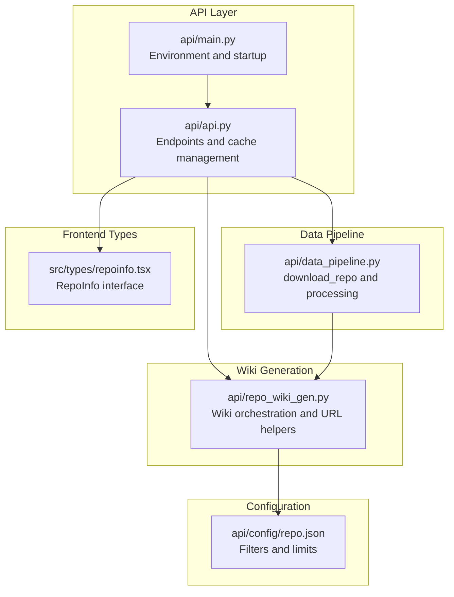
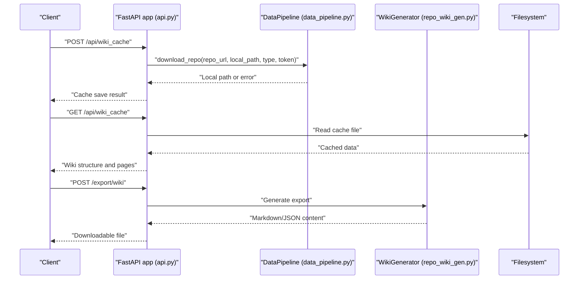
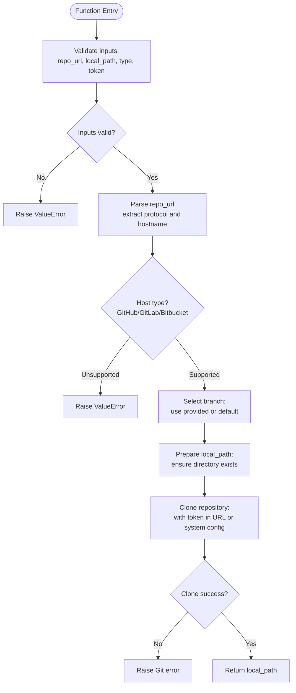
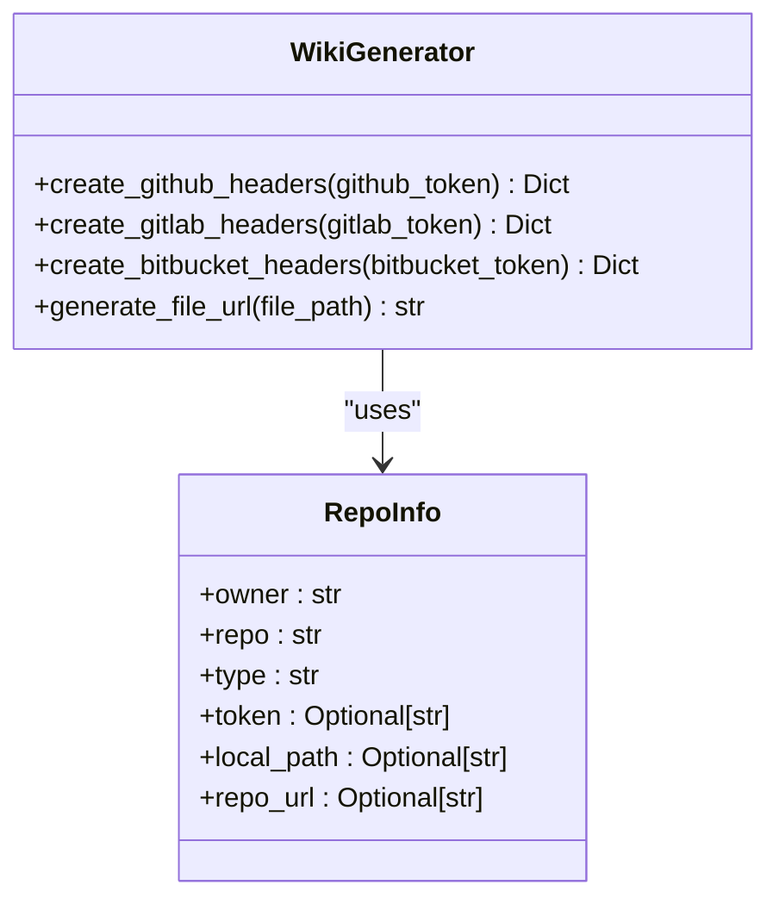
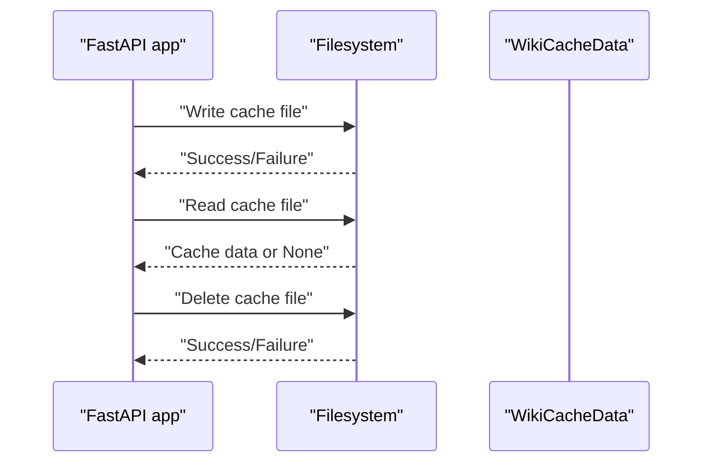
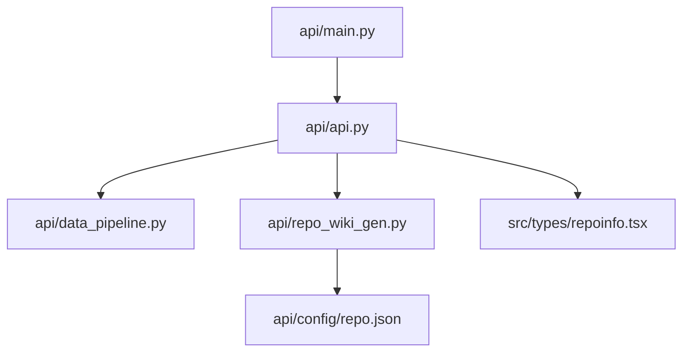

# Repository Processing and Cloning

<cite>
**Referenced Files in This Document**
- [api.py](file://api/api.py)
- [data_pipeline.py](file://api/data_pipeline.py)
- [repo_wiki_gen.py](file://api/repo_wiki_gen.py)
- [repo.json](file://api/config/repo.json)
- [repoinfo.tsx](file://src/types/repoinfo.tsx)
- [main.py](file://api/main.py)
</cite>

## Table of Contents
1. [Introduction](#introduction)
2. [Project Structure](#project-structure)
3. [Core Components](#core-components)
4. [Architecture Overview](#architecture-overview)
5. [Detailed Component Analysis](#detailed-component-analysis)
6. [Dependency Analysis](#dependency-analysis)
7. [Performance Considerations](#performance-considerations)
8. [Troubleshooting Guide](#troubleshooting-guide)
9. [Conclusion](#conclusion)

## Introduction
This document explains the repository processing and cloning system in the project, focusing on the download_repo function and its integration with the broader API and wiki generation pipeline. It covers Git repository cloning with authentication support for GitHub, GitLab, and Bitbucket, repository URL parsing, access token handling, branch selection mechanisms, repository validation, local path management, error handling strategies, and integration with the database-like cache system for repository state tracking.

## Project Structure
The repository processing and cloning functionality spans several modules:
- API entrypoint and endpoints for cache management and repository operations
- Data pipeline module implementing the core download_repo function
- Wiki generation module that orchestrates repository processing and uses the downloaded repository content
- Configuration for repository filters and limits
- TypeScript type definitions for repository information

**Diagram sources**
- [api.py](file://api/api.py#L1-L635)
- [data_pipeline.py](file://api/data_pipeline.py#L1-L900)
- [repo_wiki_gen.py](file://api/repo_wiki_gen.py#L1-L550)
- [repo.json](file://api/config/repo.json#L1-L129)
- [repoinfo.tsx](file://src/types/repoinfo.tsx#L1-L11)
- [main.py](file://api/main.py#L1-L104)

**Section sources**
- [api.py](file://api/api.py#L1-L635)
- [data_pipeline.py](file://api/data_pipeline.py#L1-L900)
- [repo_wiki_gen.py](file://api/repo_wiki_gen.py#L1-L550)
- [repo.json](file://api/config/repo.json#L1-L129)
- [repoinfo.tsx](file://src/types/repoinfo.tsx#L1-L11)
- [main.py](file://api/main.py#L1-L104)

## Core Components
- download_repo: Implements Git repository cloning with authentication for GitHub, GitLab, and Bitbucket. Handles repository URL parsing, branch selection, and local path management.
- WikiGenerator: Orchestrates wiki generation from repository content, including URL generation for hosted repositories and header creation for API requests.
- Cache subsystem: Provides server-side caching of wiki structures and pages via file-based storage, enabling repository state tracking and reuse.
- Configuration: Defines file filters and repository size limits to constrain processing scope and resource usage.
- Type definitions: Provide a consistent RepoInfo interface across the backend and frontend.

**Section sources**
- [data_pipeline.py](file://api/data_pipeline.py#L100-L180)
- [repo_wiki_gen.py](file://api/repo_wiki_gen.py#L63-L144)
- [api.py](file://api/api.py#L408-L538)
- [repo.json](file://api/config/repo.json#L1-L129)
- [repoinfo.tsx](file://src/types/repoinfo.tsx#L1-L11)

## Architecture Overview
The repository processing pipeline integrates API endpoints, the data pipeline, and the wiki generation engine. The download_repo function prepares a local copy of the repository, while WikiGenerator constructs file URLs and API headers for hosted repositories. The cache subsystem persists wiki structures and pages to disk for later retrieval.

**Diagram sources**
- [api.py](file://api/api.py#L486-L538)
- [data_pipeline.py](file://api/data_pipeline.py#L100-L180)
- [repo_wiki_gen.py](file://api/repo_wiki_gen.py#L322-L391)

## Detailed Component Analysis

### download_repo Implementation
The download_repo function performs Git repository cloning with authentication support for GitHub, GitLab, and Bitbucket. It validates inputs, parses the repository URL, selects the appropriate branch, and manages the local destination path. Authentication tokens are embedded into the repository URL for HTTPS remotes or passed to the Git client for SSH remotes.

Key behaviors:
- Repository URL parsing: Determines protocol and hostname to select authentication scheme and branch handling.
- Access token handling: Injects tokens into the URL for HTTPS remotes; for SSH, relies on system Git configuration.
- Branch selection: Defaults to a configurable branch (e.g., main) when not specified.
- Local path management: Ensures the destination directory exists and is writable.
- Error handling: Raises exceptions on invalid inputs, unsupported protocols, or Git errors.

**Diagram sources**
- [data_pipeline.py](file://api/data_pipeline.py#L100-L180)

**Section sources**
- [data_pipeline.py](file://api/data_pipeline.py#L100-L180)

### Repository URL Parsing and Authentication Headers
The system supports three hosted Git providers with distinct authentication mechanisms:
- GitHub: Uses a bearer token in the Authorization header for API requests and injects the token into the HTTPS URL for cloning.
- GitLab: Uses PRIVATE-TOKEN header for API requests and injects the token into the HTTPS URL for cloning.
- Bitbucket: Uses a bearer token in the Authorization header for API requests and injects the token into the HTTPS URL for cloning.

**Diagram sources**
- [repo_wiki_gen.py](file://api/repo_wiki_gen.py#L124-L143)
- [repo_wiki_gen.py](file://api/repo_wiki_gen.py#L145-L171)
- [repoinfo.tsx](file://src/types/repoinfo.tsx#L1-L11)

**Section sources**
- [repo_wiki_gen.py](file://api/repo_wiki_gen.py#L124-L143)
- [repo_wiki_gen.py](file://api/repo_wiki_gen.py#L145-L171)
- [repoinfo.tsx](file://src/types/repoinfo.tsx#L1-L11)

### Branch Selection Mechanisms
Branch selection defaults to a predefined branch (e.g., main) when not explicitly provided. The WikiGenerator’s default branch is configurable and used when constructing file URLs for hosted repositories.

Practical considerations:
- Ensure the branch exists on the remote repository.
- For detached HEAD scenarios, consider specifying a commit SHA or tag.

**Section sources**
- [repo_wiki_gen.py](file://api/repo_wiki_gen.py#L91-L91)
- [repo_wiki_gen.py](file://api/repo_wiki_gen.py#L150-L171)

### Repository Validation and Local Path Management
Validation steps include:
- Checking for required parameters (repository URL, local path).
- Verifying the repository type against supported providers.
- Ensuring the destination directory exists and is writable.

Local path management:
- Creates the destination directory if it does not exist.
- Uses absolute paths to avoid ambiguity during cloning.

**Section sources**
- [data_pipeline.py](file://api/data_pipeline.py#L100-L180)

### Error Handling Strategies
Common error categories and handling:
- Invalid inputs: Raised as ValueError with descriptive messages.
- Unsupported repository types: Raised as ValueError with provider-specific guidance.
- Git operation failures: Raised as Git-related exceptions with stack traces.
- Cache read/write failures: Logged with detailed error information; cache operations are resilient and do not crash the service.

**Section sources**
- [data_pipeline.py](file://api/data_pipeline.py#L100-L180)
- [api.py](file://api/api.py#L452-L457)

### Integration with Database Management and Repository State Tracking
The system uses a file-based cache to persist repository state:
- Cache keys encode repository type, owner, repository name, and language.
- Cache files store wiki structures, generated pages, provider, and model information.
- Endpoints expose operations to read, write, and delete cached data.

**Diagram sources**
- [api.py](file://api/api.py#L408-L538)

**Section sources**
- [api.py](file://api/api.py#L408-L538)

### Practical Examples

- Cloning a public GitHub repository:
  - Provide a GitHub HTTPS URL without a token.
  - Ensure the destination path is writable.
  - Verify the branch name if not main.

- Cloning a private GitHub/GitLab/Bitbucket repository:
  - Supply a personal access token or equivalent.
  - For HTTPS remotes, the token is injected into the URL.
  - For SSH remotes, configure system Git credentials.

- Handling private repositories:
  - Use environment variables for tokens.
  - Ensure the token has appropriate scopes for the repository.

- Troubleshooting common cloning issues:
  - Permission denied: Verify token permissions and repository visibility.
  - Invalid repository URL: Confirm protocol and hostname.
  - Network timeouts: Adjust proxy settings and retry.
  - Destination conflicts: Remove existing directory or choose another path.

[No sources needed since this section provides general guidance]

## Dependency Analysis
The repository processing pipeline exhibits clear separation of concerns:
- API layer exposes endpoints for cache management and repository operations.
- Data pipeline encapsulates Git operations and repository preparation.
- Wiki generation module handles URL construction and API headers for hosted repositories.
- Configuration module centralizes filtering and size limits.
- Frontend types define a consistent interface for repository information.

**Diagram sources**
- [api.py](file://api/api.py#L1-L635)
- [data_pipeline.py](file://api/data_pipeline.py#L1-L900)
- [repo_wiki_gen.py](file://api/repo_wiki_gen.py#L1-L550)
- [repo.json](file://api/config/repo.json#L1-L129)
- [repoinfo.tsx](file://src/types/repoinfo.tsx#L1-L11)
- [main.py](file://api/main.py#L1-L104)

**Section sources**
- [api.py](file://api/api.py#L1-L635)
- [data_pipeline.py](file://api/data_pipeline.py#L1-L900)
- [repo_wiki_gen.py](file://api/repo_wiki_gen.py#L1-L550)
- [repo.json](file://api/config/repo.json#L1-L129)
- [repoinfo.tsx](file://src/types/repoinfo.tsx#L1-L11)
- [main.py](file://api/main.py#L1-L104)

## Performance Considerations
- Filter configuration: Excluding large binary files and build artifacts reduces cloning time and disk usage.
- Cache utilization: Reusing cached wiki structures avoids repeated processing of the same repository.
- Concurrency: Asynchronous cache operations prevent blocking the API thread.
- Resource limits: Repository size limits protect against excessive memory usage during processing.

**Section sources**
- [repo.json](file://api/config/repo.json#L1-L129)
- [api.py](file://api/api.py#L408-L538)

## Troubleshooting Guide
Common issues and resolutions:
- Authentication failures:
  - Verify token validity and scopes.
  - For SSH, ensure Git credentials are configured.
- Network connectivity:
  - Check proxy settings and firewall rules.
  - Retry after network stabilization.
- Disk space:
  - Ensure sufficient free space for cloning and caching.
- Cache corruption:
  - Delete the cache file and regenerate the wiki structure.
- Unsupported repository type:
  - Confirm the repository URL uses a supported provider.

**Section sources**
- [data_pipeline.py](file://api/data_pipeline.py#L100-L180)
- [api.py](file://api/api.py#L452-L457)

## Conclusion
The repository processing and cloning system integrates robust Git operations with a flexible cache mechanism and provider-specific authentication. The download_repo function provides a reliable foundation for cloning repositories from GitHub, GitLab, and Bitbucket, while the WikiGenerator and cache subsystem enable efficient wiki generation and state persistence. Proper configuration of filters and tokens, combined with resilient error handling, ensures smooth operation across diverse environments.