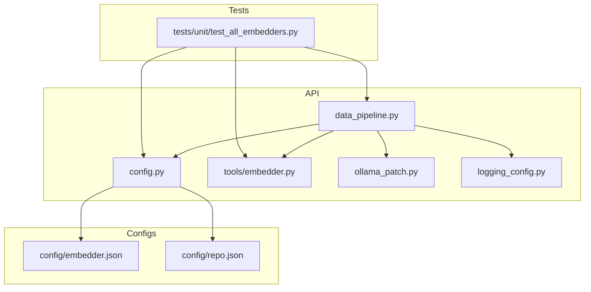
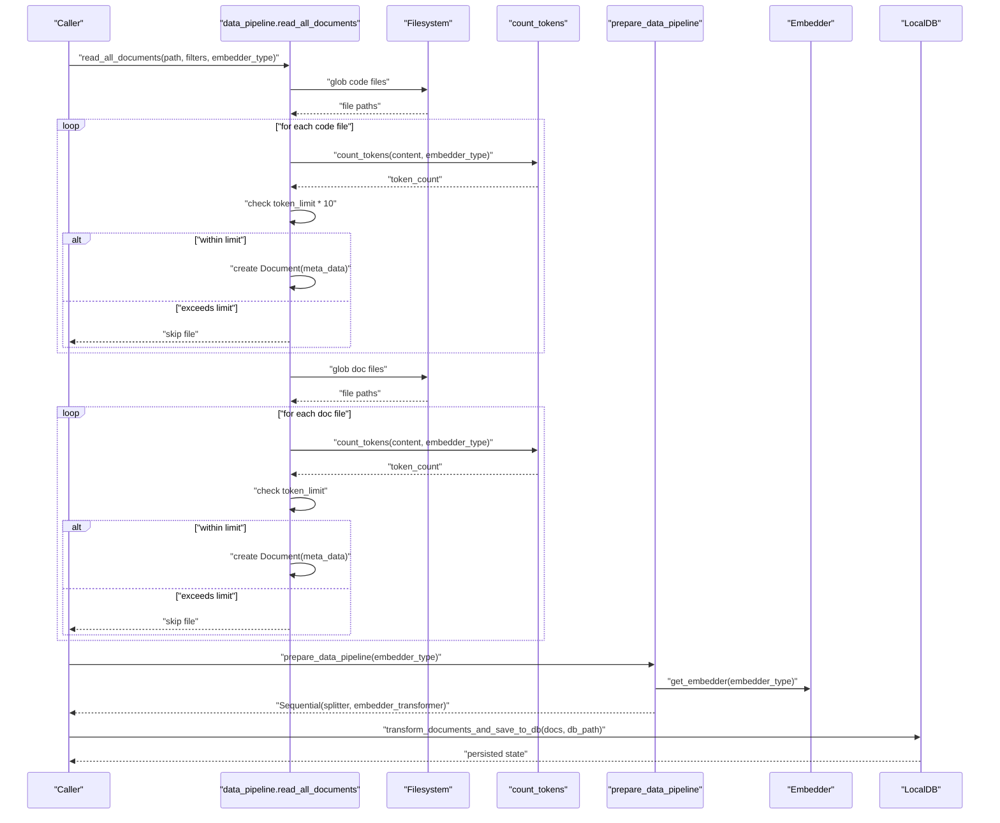
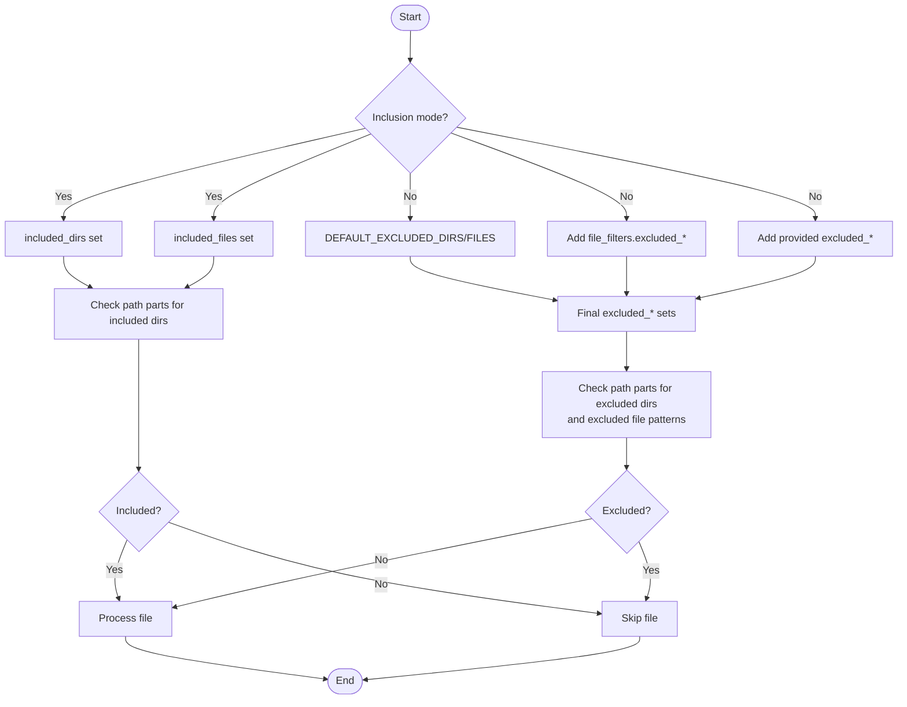
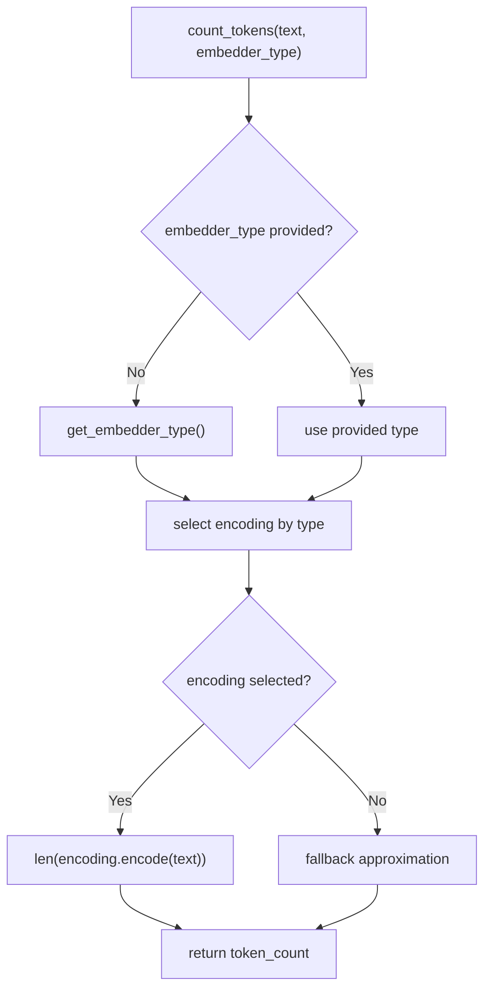
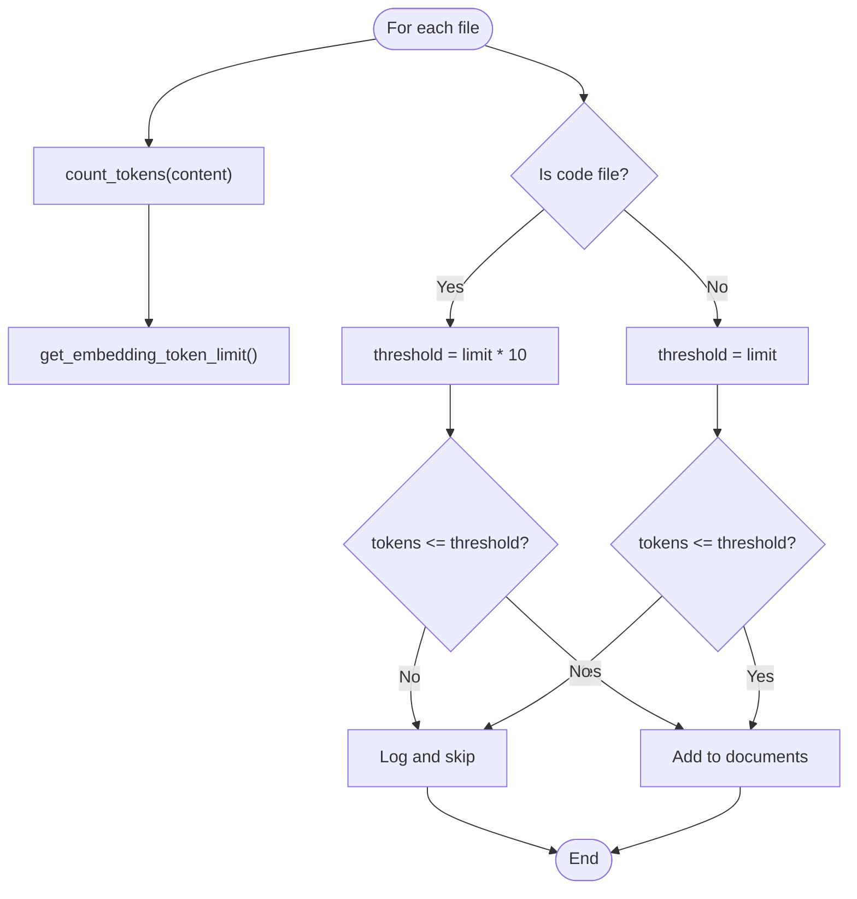
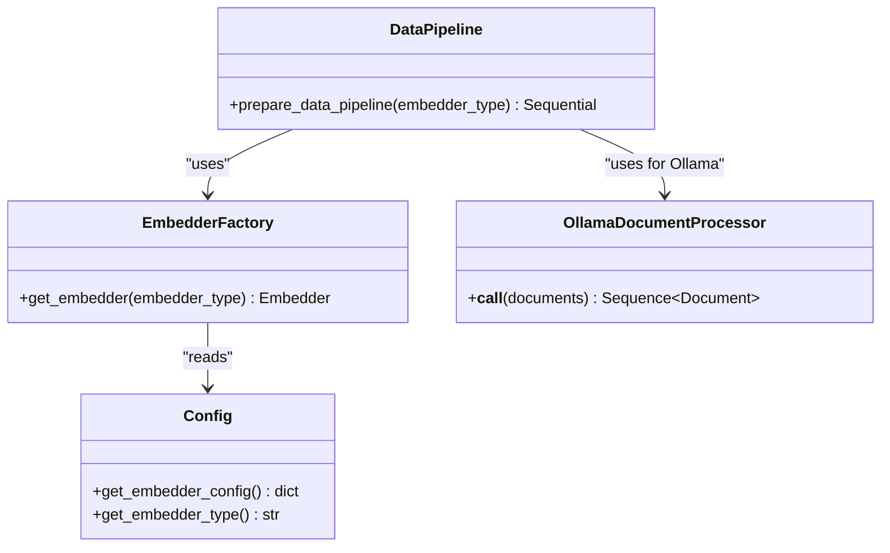
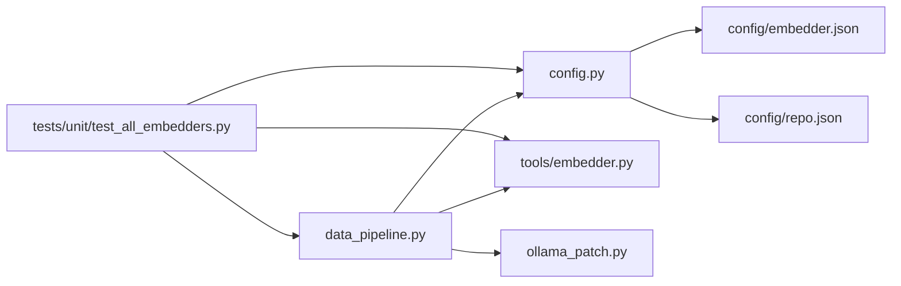

# Document Processing and Filtering

<cite>
**Referenced Files in This Document**
- [data_pipeline.py](file://api/data_pipeline.py)
- [config.py](file://api/config.py)
- [embedder.py](file://api/tools/embedder.py)
- [ollama_patch.py](file://api/ollama_patch.py)
- [embedder.json](file://api/config/embedder.json)
- [repo.json](file://api/config/repo.json)
- [logging_config.py](file://api/logging_config.py)
- [test_all_embedders.py](file://tests/unit/test_all_embedders.py)
</cite>

## Table of Contents
1. [Introduction](#introduction)
2. [Project Structure](#project-structure)
3. [Core Components](#core-components)
4. [Architecture Overview](#architecture-overview)
5. [Detailed Component Analysis](#detailed-component-analysis)
6. [Dependency Analysis](#dependency-analysis)
7. [Performance Considerations](#performance-considerations)
8. [Troubleshooting Guide](#troubleshooting-guide)
9. [Conclusion](#conclusion)
10. [Appendices](#appendices)

## Introduction
This document explains the document processing and filtering subsystem responsible for reading code and documentation files, applying inclusion/exclusion filters, counting tokens per provider, handling large files, distinguishing implementation versus test files, and transforming documents into embeddings. It covers the comprehensive file reading mechanism, filtering modes, token counting strategies, large-file handling, and error handling for robust operation.

## Project Structure
The subsystem spans several modules:
- Data pipeline and filtering logic for reading and transforming documents
- Configuration loader for embedder and repository settings
- Embedder factory for selecting providers
- Ollama-specific document processor for single-document embedding
- Logging configuration for operational visibility
- Tests validating token counting, pipeline preparation, and embedder selection

**Diagram sources**
- [data_pipeline.py](file://api/data_pipeline.py#L1-L917)
- [config.py](file://api/config.py#L1-L464)
- [embedder.py](file://api/tools/embedder.py#L1-L59)
- [ollama_patch.py](file://api/ollama_patch.py#L1-L105)
- [embedder.json](file://api/config/embedder.json#L1-L35)
- [repo.json](file://api/config/repo.json#L1-L129)
- [logging_config.py](file://api/logging_config.py#L1-L86)
- [test_all_embedders.py](file://tests/unit/test_all_embedders.py#L1-L464)

**Section sources**
- [data_pipeline.py](file://api/data_pipeline.py#L1-L917)
- [config.py](file://api/config.py#L1-L464)
- [embedder.py](file://api/tools/embedder.py#L1-L59)
- [ollama_patch.py](file://api/ollama_patch.py#L1-L105)
- [embedder.json](file://api/config/embedder.json#L1-L35)
- [repo.json](file://api/config/repo.json#L1-L129)
- [logging_config.py](file://api/logging_config.py#L1-L86)
- [test_all_embedders.py](file://tests/unit/test_all_embedders.py#L1-L464)

## Core Components
- Document reader and filter: Reads code and documentation files, applies inclusion/exclusion rules, and determines implementation/test distinction.
- Token counting: Uses tiktoken with provider-specific encodings and fallbacks.
- Embedding pipeline: Builds a sequential pipeline with text splitting and provider-specific embedding transformers.
- Large file handling: Enforces provider-specific token limits with different thresholds for code and docs.
- Error handling: Robust logging and graceful skipping of problematic files.

**Section sources**
- [data_pipeline.py](file://api/data_pipeline.py#L177-L406)
- [data_pipeline.py](file://api/data_pipeline.py#L61-L102)
- [data_pipeline.py](file://api/data_pipeline.py#L408-L450)
- [data_pipeline.py](file://api/data_pipeline.py#L348-L353)
- [data_pipeline.py](file://api/data_pipeline.py#L384-L388)
- [data_pipeline.py](file://api/data_pipeline.py#L367-L369)
- [data_pipeline.py](file://api/data_pipeline.py#L402-L403)

## Architecture Overview
The subsystem orchestrates reading, filtering, token counting, and embedding transformation. It selects the appropriate embedder based on configuration and adapts processing for Ollama’s single-document limitation.

**Diagram sources**
- [data_pipeline.py](file://api/data_pipeline.py#L177-L406)
- [data_pipeline.py](file://api/data_pipeline.py#L408-L450)
- [data_pipeline.py](file://api/data_pipeline.py#L61-L102)
- [embedder.py](file://api/tools/embedder.py#L6-L59)

## Detailed Component Analysis

### File Reading and Filtering Mechanism
- Priority ordering: Code files are scanned first, then documentation files.
- Extension lists:
  - Code extensions include Python, JavaScript, TypeScript, Java, C/C++, Go, Rust, HTML/CSS, PHP, Swift, C#.
  - Documentation extensions include Markdown, plain text, reStructuredText, JSON, YAML, and variants.
- Filtering modes:
  - Inclusion mode: Only directories and/or file patterns in included_* lists are processed.
  - Exclusion mode: Default excluded directories and files plus any additional ones from configuration and parameters are skipped.
- Directory-based filtering: Normalized path checks for presence of included/excluded directory segments.
- File pattern matching: Exact name or suffix-based matching for included/excluded files.
- Implementation vs test distinction:
  - Implementation files are marked when the relative path does not start with “test_” and does not contain “test” (case-insensitive).
  - Documentation files are not considered implementation.

**Diagram sources**
- [data_pipeline.py](file://api/data_pipeline.py#L210-L327)

**Section sources**
- [data_pipeline.py](file://api/data_pipeline.py#L205-L208)
- [data_pipeline.py](file://api/data_pipeline.py#L210-L256)
- [data_pipeline.py](file://api/data_pipeline.py#L259-L327)
- [data_pipeline.py](file://api/data_pipeline.py#L341-L347)

### Token Counting and Provider-Specific Encoding
- Provider-specific encodings:
  - OpenAI: Uses model-specific encoding for “text-embedding-3-small”.
  - Google: Uses “cl100k_base” encoding for approximate tokenization.
  - Ollama: Uses “cl100k_base” encoding.
- Fallback behavior: On tiktoken failure, falls back to a character-length approximation.
- Token limit retrieval:
  - Centralized mapping defines provider token limits.
  - Backward-compatible function returns a default maximum for legacy callers.

**Diagram sources**
- [data_pipeline.py](file://api/data_pipeline.py#L61-L102)
- [data_pipeline.py](file://api/data_pipeline.py#L37-L59)

**Section sources**
- [data_pipeline.py](file://api/data_pipeline.py#L61-L102)
- [data_pipeline.py](file://api/data_pipeline.py#L37-L59)

### Large File Handling and Thresholds
- Code files: Allowed up to 10x the provider’s token limit.
- Documentation files: Strictly bounded by the provider’s token limit.
- Skipping behavior: Files exceeding thresholds are logged and skipped.

**Diagram sources**
- [data_pipeline.py](file://api/data_pipeline.py#L348-L353)
- [data_pipeline.py](file://api/data_pipeline.py#L384-L388)

**Section sources**
- [data_pipeline.py](file://api/data_pipeline.py#L348-L353)
- [data_pipeline.py](file://api/data_pipeline.py#L384-L388)

### Implementation vs Test File Distinction Logic
- Implementation detection:
  - Relative path does not start with “test_”.
  - Relative path does not contain “test” (case-insensitive).
- Documentation files are not considered implementation.

**Section sources**
- [data_pipeline.py](file://api/data_pipeline.py#L341-L347)

### Embedding Pipeline and Provider Selection
- Embedder factory:
  - Selects configuration based on explicit type or environment-driven detection.
  - Initializes embedder with model client and model kwargs.
- Pipeline construction:
  - Text splitter from configuration.
  - Batched embeddings for OpenAI and Google.
  - Single-document processing for Ollama via dedicated processor.
- Batch sizes:
  - OpenAI/GitHub Copilot: configurable batch size.
  - Google: configurable batch size.
  - Ollama: single-document processing enforced.

**Diagram sources**
- [embedder.py](file://api/tools/embedder.py#L6-L59)
- [ollama_patch.py](file://api/ollama_patch.py#L62-L105)
- [data_pipeline.py](file://api/data_pipeline.py#L408-L450)
- [config.py](file://api/config.py#L183-L274)

**Section sources**
- [embedder.py](file://api/tools/embedder.py#L6-L59)
- [data_pipeline.py](file://api/data_pipeline.py#L408-L450)
- [config.py](file://api/config.py#L183-L274)

### Configuration and Defaults
- Default excluded directories and files:
  - Virtual environments, caches, build artifacts, logs, IDE folders, and lock files.
- Repository configuration:
  - File filters and repository size limits.
- Embedder configuration:
  - Provider-specific settings, batch sizes, and text splitter parameters.

**Section sources**
- [config.py](file://api/config.py#L309-L348)
- [repo.json](file://api/config/repo.json#L1-L129)
- [embedder.json](file://api/config/embedder.json#L1-L35)

### Error Handling for File Reading Operations
- Exceptions caught while reading files are logged and the file is skipped.
- Logging configuration supports rotating file handlers and environment-controlled levels.

**Section sources**
- [data_pipeline.py](file://api/data_pipeline.py#L367-L369)
- [data_pipeline.py](file://api/data_pipeline.py#L402-L403)
- [logging_config.py](file://api/logging_config.py#L12-L86)

## Dependency Analysis
- Coupling:
  - data_pipeline depends on config for defaults and embedder selection.
  - Embedder factory depends on config for provider-specific settings.
  - Ollama processor is isolated and only used when Ollama is selected.
- Cohesion:
  - Token counting and pipeline preparation are cohesive within data_pipeline.
  - Configuration loading centralizes provider and repository settings.

**Diagram sources**
- [data_pipeline.py](file://api/data_pipeline.py#L1-L917)
- [config.py](file://api/config.py#L1-L464)
- [embedder.py](file://api/tools/embedder.py#L1-L59)
- [ollama_patch.py](file://api/ollama_patch.py#L1-L105)
- [embedder.json](file://api/config/embedder.json#L1-L35)
- [repo.json](file://api/config/repo.json#L1-L129)
- [test_all_embedders.py](file://tests/unit/test_all_embedders.py#L1-L464)

**Section sources**
- [data_pipeline.py](file://api/data_pipeline.py#L1-L917)
- [config.py](file://api/config.py#L1-L464)
- [embedder.py](file://api/tools/embedder.py#L1-L59)
- [ollama_patch.py](file://api/ollama_patch.py#L1-L105)
- [embedder.json](file://api/config/embedder.json#L1-L35)
- [repo.json](file://api/config/repo.json#L1-L129)
- [test_all_embedders.py](file://tests/unit/test_all_embedders.py#L1-L464)

## Performance Considerations
- Token counting cost:
  - Prefer batching via the pipeline for large corpora.
  - Use provider-specific encodings to minimize overhead.
- Large file thresholds:
  - Code files allow higher thresholds to accommodate larger implementations.
  - Documentation files enforce stricter limits to reduce memory pressure.
- Batch sizes:
  - Adjust batch sizes in embedder configuration for throughput vs memory trade-offs.
- Logging:
  - Use rotating file handlers and appropriate log levels to avoid I/O overhead.

[No sources needed since this section provides general guidance]

## Troubleshooting Guide
- Token counting failures:
  - Verify provider type selection and fallback behavior.
  - Confirm encoding availability for the chosen provider.
- Large file skips:
  - Increase thresholds cautiously or split files.
  - Review provider token limits and adjust configuration.
- Embedding pipeline issues:
  - Validate embedder configuration and client class resolution.
  - For Ollama, ensure model availability and correct host configuration.
- File reading errors:
  - Inspect logs for specific file paths and exceptions.
  - Confirm encoding and file permissions.

**Section sources**
- [data_pipeline.py](file://api/data_pipeline.py#L61-L102)
- [data_pipeline.py](file://api/data_pipeline.py#L348-L353)
- [data_pipeline.py](file://api/data_pipeline.py#L384-L388)
- [embedder.py](file://api/tools/embedder.py#L6-L59)
- [ollama_patch.py](file://api/ollama_patch.py#L21-L60)
- [logging_config.py](file://api/logging_config.py#L12-L86)

## Conclusion
The document processing and filtering subsystem provides a robust, provider-aware pipeline for reading, filtering, tokenizing, and embedding code and documentation files. It supports inclusion/exclusion filtering, provider-specific encodings, large-file handling, and resilient error management. Configuration-driven behavior enables flexible customization for different providers and repository characteristics.

[No sources needed since this section summarizes without analyzing specific files]

## Appendices

### Practical Examples

- Customizing file filters
  - Inclusion mode: Provide included directories and/or file patterns to restrict processing to specific areas.
  - Exclusion mode: Extend excluded directories and files via configuration or parameters to skip unwanted content.
  - Reference: [data_pipeline.py](file://api/data_pipeline.py#L210-L256), [repo.json](file://api/config/repo.json#L2-L124)

- Optimizing processing performance
  - Adjust batch sizes in embedder configuration for throughput.
  - Use provider-specific encodings to reduce tokenization overhead.
  - Reference: [embedder.json](file://api/config/embedder.json#L4-L8), [data_pipeline.py](file://api/data_pipeline.py#L442-L445)

- Debugging file processing issues
  - Enable appropriate log levels and inspect rotating log files for skipped files and exceptions.
  - Validate token counts and thresholds for problematic files.
  - Reference: [logging_config.py](file://api/logging_config.py#L12-L86), [data_pipeline.py](file://api/data_pipeline.py#L367-L369), [data_pipeline.py](file://api/data_pipeline.py#L402-L403)

**Section sources**
- [data_pipeline.py](file://api/data_pipeline.py#L210-L256)
- [repo.json](file://api/config/repo.json#L2-L124)
- [embedder.json](file://api/config/embedder.json#L4-L8)
- [logging_config.py](file://api/logging_config.py#L12-L86)