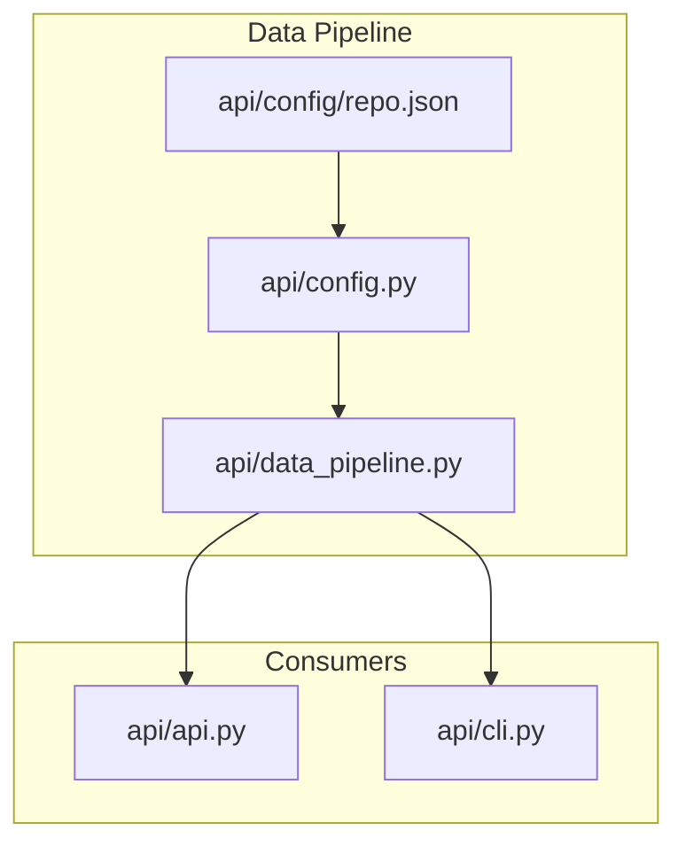
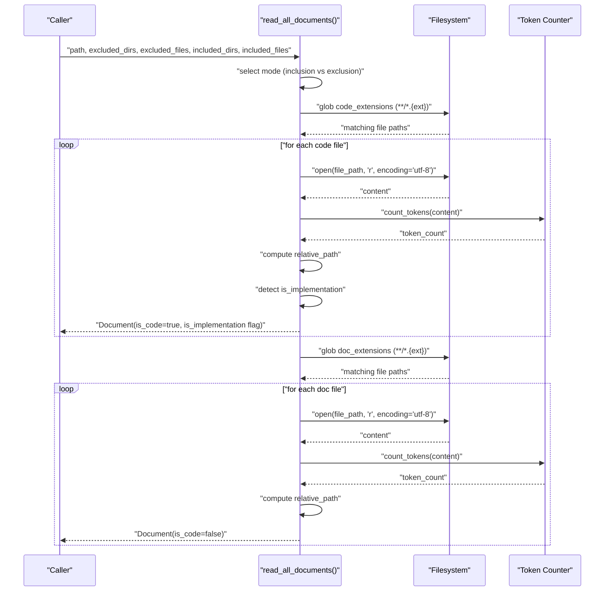
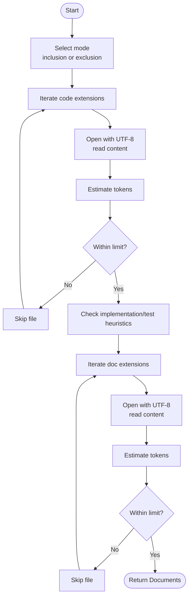
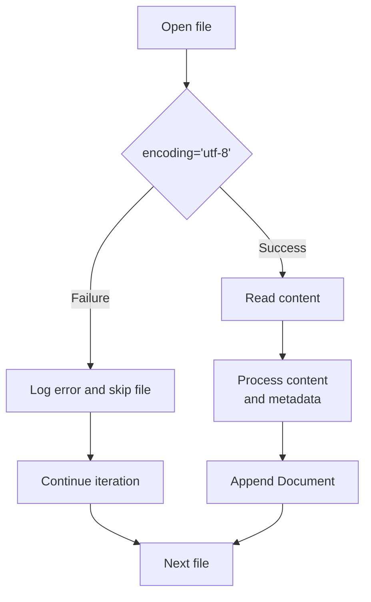
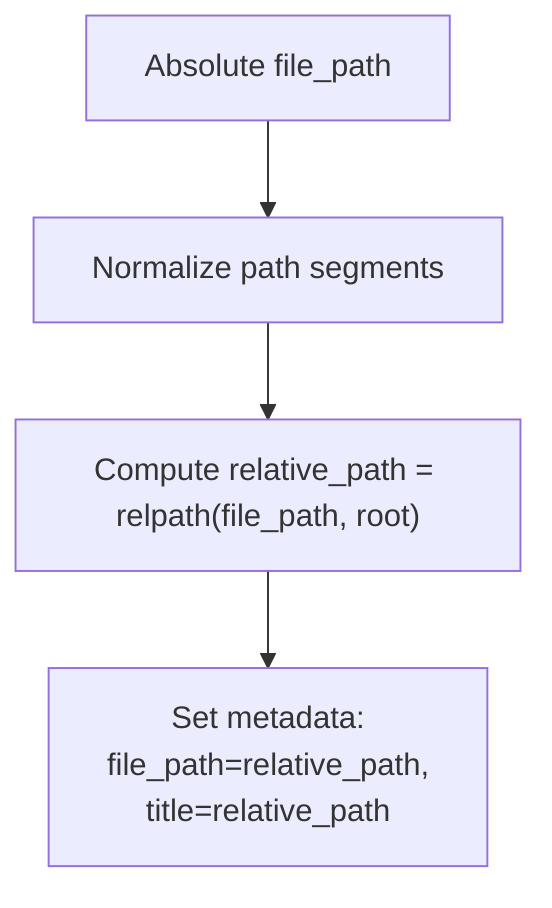
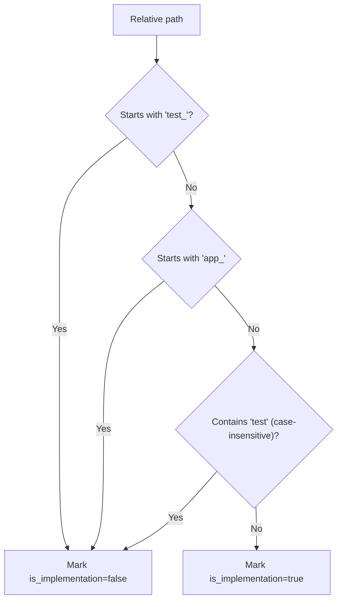
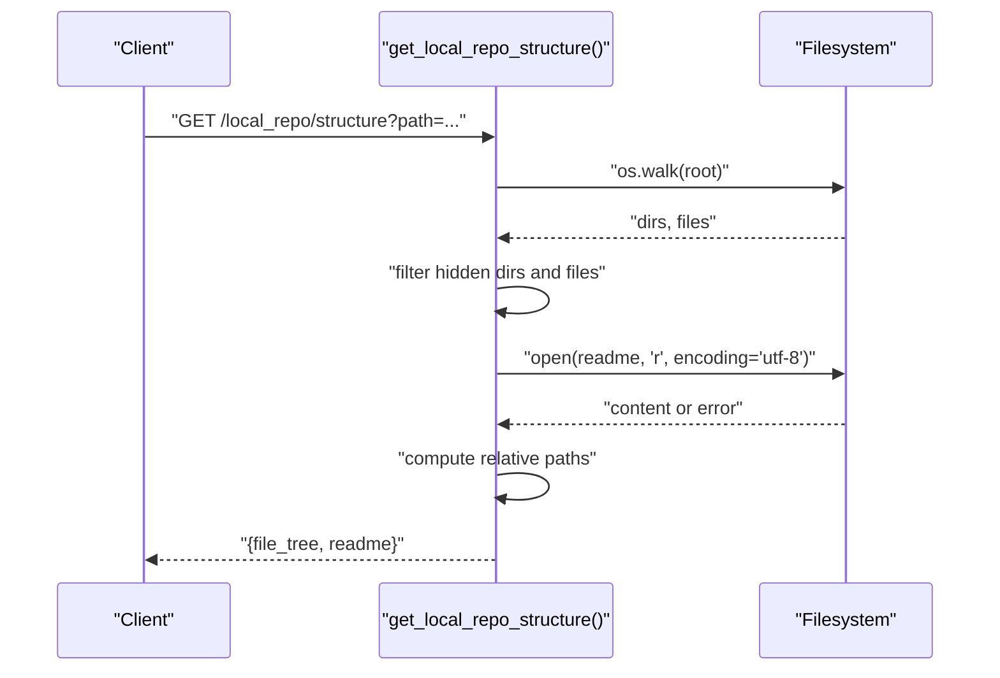
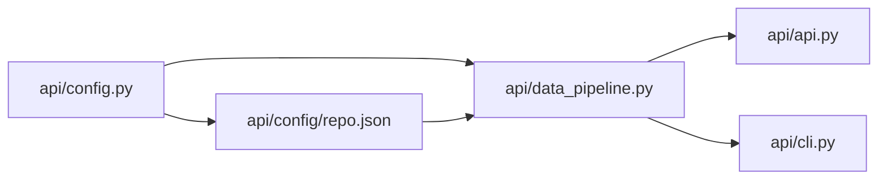

# File Reading Mechanism

<cite>
**Referenced Files in This Document**
- [api/data_pipeline.py](file://api/data_pipeline.py)
- [api/config.py](file://api/config.py)
- [api/config/repo.json](file://api/config/repo.json)
- [api/api.py](file://api/api.py)
- [api/cli.py](file://api/cli.py)
</cite>

## Table of Contents
1. [Introduction](#introduction)
2. [Project Structure](#project-structure)
3. [Core Components](#core-components)
4. [Architecture Overview](#architecture-overview)
5. [Detailed Component Analysis](#detailed-component-analysis)
6. [Dependency Analysis](#dependency-analysis)
7. [Performance Considerations](#performance-considerations)
8. [Troubleshooting Guide](#troubleshooting-guide)
9. [Conclusion](#conclusion)

## Introduction
This document explains the file reading mechanism used to process code and documentation files in the repository. It covers:
- Comprehensive file discovery via glob patterns
- Two-phase processing order: code files first, then documentation files
- UTF-8 encoding handling with robust exception management
- File path normalization and relative path calculation
- Distinction between implementation and test files
- Practical customization of file extensions and filters
- Encoding error handling and performance optimization strategies for large repositories

## Project Structure
The file reading logic spans several modules:
- Data ingestion and processing pipeline: [api/data_pipeline.py](file://api/data_pipeline.py)
- Configuration and defaults: [api/config.py](file://api/config.py), [api/config/repo.json](file://api/config/repo.json)
- API endpoints that read files locally: [api/api.py](file://api/api.py)
- CLI tool that discovers and reads files: [api/cli.py](file://api/cli.py)

**Diagram sources**
- [api/data_pipeline.py](file://api/data_pipeline.py#L177-L406)
- [api/config.py](file://api/config.py#L276-L379)
- [api/config/repo.json](file://api/config/repo.json#L1-L129)
- [api/api.py](file://api/api.py#L275-L321)
- [api/cli.py](file://api/cli.py#L40-L83)

**Section sources**
- [api/data_pipeline.py](file://api/data_pipeline.py#L177-L406)
- [api/config.py](file://api/config.py#L276-L379)
- [api/config/repo.json](file://api/config/repo.json#L1-L129)
- [api/api.py](file://api/api.py#L275-L321)
- [api/cli.py](file://api/cli.py#L40-L83)

## Core Components
- File discovery and processing:
  - Uses glob patterns to scan for code and documentation files
  - Applies inclusion or exclusion filters based on configuration and arguments
  - Reads files with UTF-8 encoding and handles exceptions gracefully
- Path handling:
  - Normalizes paths and computes relative paths from the repository root
  - Treats certain prefixes and substrings as test files
- Priority ordering:
  - Processes code files first, then documentation files
- Token-aware filtering:
  - Estimates token counts and skips oversized files according to provider limits

Key implementation locations:
- Discovery and processing loop: [api/data_pipeline.py](file://api/data_pipeline.py#L177-L406)
- Inclusion/exclusion filter logic: [api/data_pipeline.py](file://api/data_pipeline.py#L259-L327)
- Relative path computation and test-file detection: [api/data_pipeline.py](file://api/data_pipeline.py#L339-L346)
- UTF-8 read with exception handling: [api/data_pipeline.py](file://api/data_pipeline.py#L337-L338), [api/data_pipeline.py](file://api/data_pipeline.py#L379-L380)

**Section sources**
- [api/data_pipeline.py](file://api/data_pipeline.py#L177-L406)

## Architecture Overview
The file reading mechanism follows a consistent flow across consumers:

**Diagram sources**
- [api/data_pipeline.py](file://api/data_pipeline.py#L177-L406)

## Detailed Component Analysis

### File Discovery and Filtering
- Extension sets:
  - Code extensions: [api/data_pipeline.py](file://api/data_pipeline.py#L206-L207)
  - Documentation extensions: [api/data_pipeline.py](file://api/data_pipeline.py#L208)
- Mode selection:
  - Inclusion mode if any included_* is provided
  - Exclusion mode otherwise, combining defaults and config overrides
- Filter evaluation:
  - Directory membership and file pattern matching
  - Normalized path comparison for robustness
- Glob usage:
  - Recursive discovery for each extension set

Practical customization:
- Modify extension lists directly in the function for new languages or formats
- Use included_* parameters to restrict processing to specific directories or file patterns
- Extend excluded_* lists in configuration or via arguments for repository-specific ignores

**Section sources**
- [api/data_pipeline.py](file://api/data_pipeline.py#L177-L256)
- [api/data_pipeline.py](file://api/data_pipeline.py#L259-L327)

### Two-Phase Processing Order
- Phase 1: Code files
  - Iterate through code extensions in priority order
  - Read with UTF-8 and compute relative path
  - Determine implementation vs test based on path heuristics
- Phase 2: Documentation files
  - Iterate through documentation extensions
  - Read with UTF-8 and compute relative path
- Token-aware skipping:
  - Code files allowed up to 10x provider limit
  - Docs files allowed up to provider limit

**Diagram sources**
- [api/data_pipeline.py](file://api/data_pipeline.py#L328-L406)

**Section sources**
- [api/data_pipeline.py](file://api/data_pipeline.py#L328-L406)

### UTF-8 Encoding Handling and Exceptions
- All file reads use UTF-8 encoding
- Errors are caught and logged; processing continues for other files
- Large file handling:
  - Token estimation prevents oversized files from being embedded
  - Code files allowed higher thresholds than documentation files

**Diagram sources**
- [api/data_pipeline.py](file://api/data_pipeline.py#L337-L338)
- [api/data_pipeline.py](file://api/data_pipeline.py#L379-L380)

**Section sources**
- [api/data_pipeline.py](file://api/data_pipeline.py#L337-L338)
- [api/data_pipeline.py](file://api/data_pipeline.py#L379-L380)

### Path Normalization and Relative Path Calculation
- Normalize file path segments for reliable checks
- Compute relative path from repository root for metadata
- Use relative path to detect test files and app-related folders

**Diagram sources**
- [api/data_pipeline.py](file://api/data_pipeline.py#L275-L276)
- [api/data_pipeline.py](file://api/data_pipeline.py#L339)
- [api/data_pipeline.py](file://api/data_pipeline.py#L381)

**Section sources**
- [api/data_pipeline.py](file://api/data_pipeline.py#L275-L276)
- [api/data_pipeline.py](file://api/data_pipeline.py#L339)
- [api/data_pipeline.py](file://api/data_pipeline.py#L381)

### Implementation vs Test File Distinction
- Heuristic flags a file as implementation if:
  - Does not start with “test_”
  - Does not start with “app_”
  - Does not contain “test” (case-insensitive)
- Applied only to code files during phase 1

**Diagram sources**
- [api/data_pipeline.py](file://api/data_pipeline.py#L342-L346)

**Section sources**
- [api/data_pipeline.py](file://api/data_pipeline.py#L342-L346)

### Consumers That Read Files Locally
- API endpoint for local repository structure:
  - Walks directory tree, excludes common hidden and build artifacts
  - Reads README.md with UTF-8 and logs warnings on failures
  - Computes relative paths and collects file tree
- CLI tool for local repository structure:
  - Mirrors the same walk-and-read logic for README and file tree

**Diagram sources**
- [api/api.py](file://api/api.py#L275-L321)
- [api/cli.py](file://api/cli.py#L40-L83)

**Section sources**
- [api/api.py](file://api/api.py#L275-L321)
- [api/cli.py](file://api/cli.py#L40-L83)

## Dependency Analysis
- Configuration-driven filtering:
  - Defaults for excluded directories and files are defined in configuration and merged with runtime overrides
- Token limits:
  - Provider-specific limits influence skipping behavior
- Consumers:
  - API and CLI both rely on the shared data pipeline for consistent behavior

**Diagram sources**
- [api/config.py](file://api/config.py#L276-L379)
- [api/config/repo.json](file://api/config/repo.json#L1-L129)
- [api/data_pipeline.py](file://api/data_pipeline.py#L177-L406)
- [api/api.py](file://api/api.py#L275-L321)
- [api/cli.py](file://api/cli.py#L40-L83)

**Section sources**
- [api/config.py](file://api/config.py#L276-L379)
- [api/config/repo.json](file://api/config/repo.json#L1-L129)
- [api/data_pipeline.py](file://api/data_pipeline.py#L177-L406)
- [api/api.py](file://api/api.py#L275-L321)
- [api/cli.py](file://api/cli.py#L40-L83)

## Performance Considerations
- Prefer inclusion mode when targeting subsets of the repository to reduce scanning overhead
- Use included_dirs/included_files to limit scope to relevant areas
- Leverage token-aware skipping to avoid expensive embeddings for very large files
- For extremely large repositories:
  - Consider pre-filtering directories or files
  - Monitor logs for skipped files due to token limits
  - Ensure caches (where applicable) are leveraged to avoid repeated scans

[No sources needed since this section provides general guidance]

## Troubleshooting Guide
Common issues and resolutions:
- Encoding errors:
  - Symptom: Failures when opening files
  - Resolution: The mechanism uses UTF-8; if encountering non-UTF-8 files, adjust filters to exclude problematic files or fix encoding externally
- Skipped files:
  - Symptom: Files not appearing in output
  - Causes: Exclusion filters, hidden directories, or token limit exceeded
  - Resolution: Review included/excluded lists and token limits; increase limits cautiously
- Missing README content:
  - Symptom: Empty README field
  - Cause: README not found or read failure
  - Resolution: Verify path and permissions; note that the consumer reads README only once and logs warnings on failure

**Section sources**
- [api/data_pipeline.py](file://api/data_pipeline.py#L337-L338)
- [api/data_pipeline.py](file://api/data_pipeline.py#L379-L380)
- [api/api.py](file://api/api.py#L306-L311)
- [api/cli.py](file://api/cli.py#L69-L75)

## Conclusion
The file reading mechanism provides a robust, configurable, and efficient way to discover and process code and documentation files. Its two-phase approach, UTF-8 handling, and token-aware filtering ensure consistent behavior across diverse repositories. By leveraging inclusion/exclusion filters and understanding the implementation/test distinction, users can tailor the processing to their needs while maintaining performance and reliability.