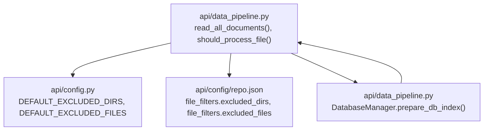
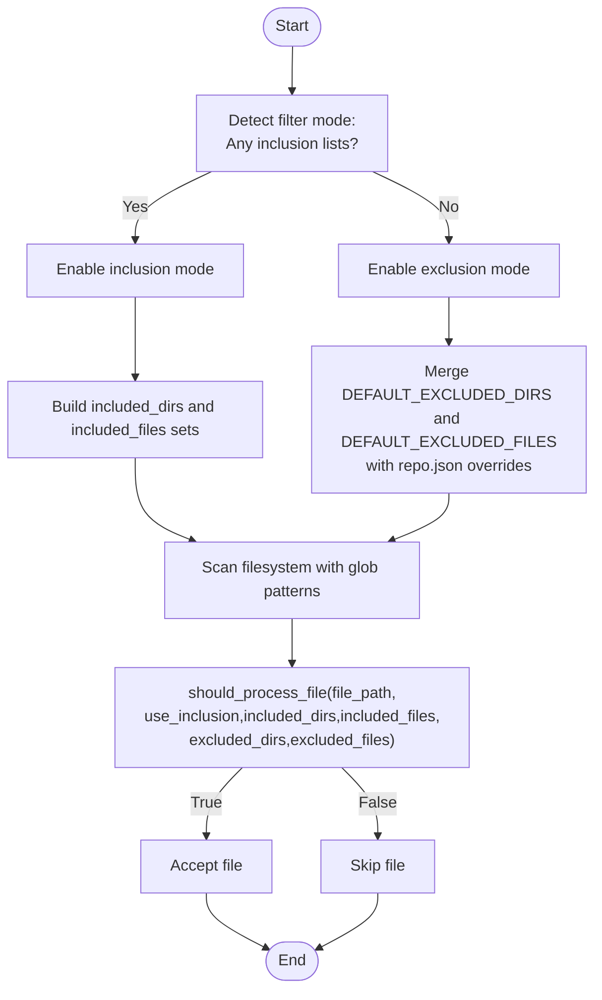
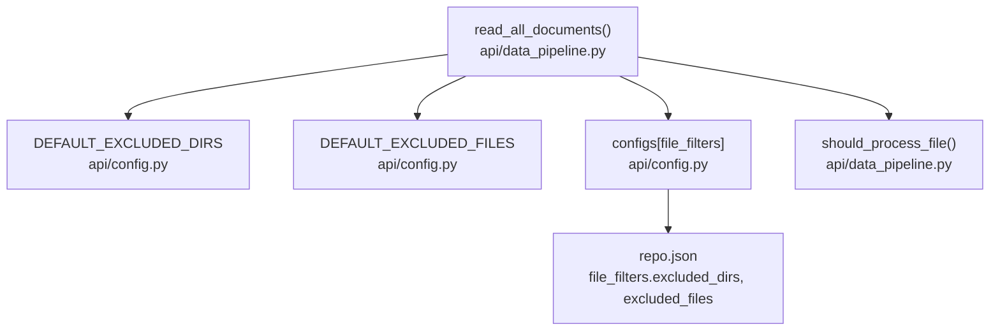

# Filtering and Selection Logic

<cite>
**Referenced Files in This Document**
- [data_pipeline.py](file://api/data_pipeline.py)
- [config.py](file://api/config.py)
- [repo.json](file://api/config/repo.json)
</cite>

## Table of Contents
1. [Introduction](#introduction)
2. [Project Structure](#project-structure)
3. [Core Components](#core-components)
4. [Architecture Overview](#architecture-overview)
5. [Detailed Component Analysis](#detailed-component-analysis)
6. [Dependency Analysis](#dependency-analysis)
7. [Performance Considerations](#performance-considerations)
8. [Troubleshooting Guide](#troubleshooting-guide)
9. [Conclusion](#conclusion)

## Introduction
This document explains the inclusion/exclusion filtering system used to select files and directories when indexing repositories for embedding and retrieval. It covers:
- How the system detects whether to operate in whitelist (inclusion) or blacklist (exclusion) mode
- Directory-based filtering using normalized path checks
- File pattern matching for both inclusion and exclusion scenarios
- Default exclusion lists for directories and files
- Configuration override mechanisms via repository configuration
- Backward compatibility handling for legacy parameters
- Practical examples and debugging guidance

## Project Structure
The filtering logic is implemented in the data pipeline module and backed by configuration files. Key elements:
- Filtering and selection logic resides in the data pipeline module
- Default exclusion lists are defined in the configuration module
- Repository-level overrides are loaded from the repository configuration file

**Diagram sources**
- [data_pipeline.py](file://api/data_pipeline.py#L177-L406)
- [config.py](file://api/config.py#L309-L348)
- [repo.json](file://api/config/repo.json#L1-L129)

**Section sources**
- [data_pipeline.py](file://api/data_pipeline.py#L177-L406)
- [config.py](file://api/config.py#L309-L348)
- [repo.json](file://api/config/repo.json#L1-L129)

## Core Components
- Mode detection: Inclusion mode is used when explicit inclusion lists are provided; otherwise, exclusion mode applies.
- Directory filtering: Uses normalized path segments to detect presence of excluded/included directory names.
- File pattern matching: Compares filenames against exclusion/inclusion patterns; supports exact matches and suffix-based matches.
- Configuration overrides: Loads additional excluded directories and files from the repository configuration file and merges them with defaults.
- Backward compatibility: Legacy parameters are handled gracefully by mapping them to modern equivalents.

Key implementation references:
- Mode detection and mode-specific logic: [data_pipeline.py](file://api/data_pipeline.py#L210-L256)
- Directory and file matching logic: [data_pipeline.py](file://api/data_pipeline.py#L259-L326)
- Default exclusion lists: [config.py](file://api/config.py#L309-L348)
- Configuration overrides: [config.py](file://api/config.py#L275-L379), [repo.json](file://api/config/repo.json#L1-L129)
- Backward compatibility handling: [data_pipeline.py](file://api/data_pipeline.py#L201-L204), [data_pipeline.py](file://api/data_pipeline.py#L769-L771)

**Section sources**
- [data_pipeline.py](file://api/data_pipeline.py#L177-L406)
- [config.py](file://api/config.py#L275-L379)
- [config.py](file://api/config.py#L309-L348)
- [repo.json](file://api/config/repo.json#L1-L129)

## Architecture Overview
The filtering pipeline operates in two passes:
1. Inclusion mode: Accept only files whose paths match inclusion criteria.
2. Exclusion mode: Accept files unless they match exclusion criteria.

**Diagram sources**
- [data_pipeline.py](file://api/data_pipeline.py#L210-L256)
- [data_pipeline.py](file://api/data_pipeline.py#L259-L326)
- [config.py](file://api/config.py#L309-L348)
- [repo.json](file://api/config/repo.json#L1-L129)

## Detailed Component Analysis

### Filter Mode Detection
- Inclusion mode is enabled when either included_dirs or included_files is provided and non-empty.
- Otherwise, exclusion mode is used, combining default exclusions with any repository overrides.

References:
- [data_pipeline.py](file://api/data_pipeline.py#L210-L214)
- [data_pipeline.py](file://api/data_pipeline.py#L227-L228)

**Section sources**
- [data_pipeline.py](file://api/data_pipeline.py#L210-L228)

### Directory-Based Filtering
- Normalized path segments are used to check if a file resides under any excluded or included directory.
- Directory names are normalized by stripping leading "./" and trailing "/" for comparison.

References:
- [data_pipeline.py](file://api/data_pipeline.py#L275-L317)

**Section sources**
- [data_pipeline.py](file://api/data_pipeline.py#L275-L317)

### File Pattern Matching
- For inclusion mode, a file is accepted if it is inside any included directory OR matches any included file pattern.
- For exclusion mode, a file is accepted unless it is inside any excluded directory OR matches any excluded file pattern.
- Pattern matching supports exact filename equality and suffix-based matching for included files.

References:
- [data_pipeline.py](file://api/data_pipeline.py#L278-L307)
- [data_pipeline.py](file://api/data_pipeline.py#L310-L326)

**Section sources**
- [data_pipeline.py](file://api/data_pipeline.py#L278-L326)

### Default Exclusions
- Default excluded directories and files are defined centrally and applied in exclusion mode.
- These defaults cover virtual environments, caches, build artifacts, logs, IDE-specific folders, and common lockfiles and configuration artifacts.

References:
- [config.py](file://api/config.py#L309-L348)

**Section sources**
- [config.py](file://api/config.py#L309-L348)

### Configuration Override System
- Repository configuration can add to or refine default exclusions via file_filters.excluded_dirs and file_filters.excluded_files.
- The configuration loader merges these overrides into the runtime configuration.

References:
- [config.py](file://api/config.py#L275-L379)
- [repo.json](file://api/config/repo.json#L1-L129)
- [data_pipeline.py](file://api/data_pipeline.py#L232-L238)

**Section sources**
- [config.py](file://api/config.py#L275-L379)
- [repo.json](file://api/config/repo.json#L1-L129)
- [data_pipeline.py](file://api/data_pipeline.py#L232-L238)

### Backward Compatibility Handling
- Legacy parameters are supported by mapping them to modern equivalents before processing.
- Examples include passing an is_ollama_embedder flag alongside embedder_type.

References:
- [data_pipeline.py](file://api/data_pipeline.py#L201-L204)
- [data_pipeline.py](file://api/data_pipeline.py#L769-L771)

**Section sources**
- [data_pipeline.py](file://api/data_pipeline.py#L201-L204)
- [data_pipeline.py](file://api/data_pipeline.py#L769-L771)

### Practical Examples

- Enable inclusion mode to process only specific directories and files:
  - Provide included_dirs and/or included_files to the document reader.
  - Reference: [data_pipeline.py](file://api/data_pipeline.py#L213-L227)

- Use exclusion mode with repository overrides:
  - Add extra excluded directories and files in repo.json under file_filters.
  - Reference: [repo.json](file://api/config/repo.json#L1-L129), [data_pipeline.py](file://api/data_pipeline.py#L232-L238)

- Combine inclusion and exclusion:
  - Supply included_dirs and included_files to restrict scope, and still rely on default exclusions for noise reduction.
  - Reference: [data_pipeline.py](file://api/data_pipeline.py#L213-L227), [config.py](file://api/config.py#L309-L348)

- Debugging filter performance:
  - Inspect logs for mode selection and effective lists.
  - Reference: [data_pipeline.py](file://api/data_pipeline.py#L218-L255)

**Section sources**
- [data_pipeline.py](file://api/data_pipeline.py#L213-L227)
- [data_pipeline.py](file://api/data_pipeline.py#L232-L238)
- [config.py](file://api/config.py#L309-L348)
- [repo.json](file://api/config/repo.json#L1-L129)

## Dependency Analysis
The filtering logic depends on:
- Centralized default exclusion lists
- Repository configuration overrides
- Runtime mode selection based on provided parameters

**Diagram sources**
- [data_pipeline.py](file://api/data_pipeline.py#L177-L406)
- [config.py](file://api/config.py#L309-L348)
- [repo.json](file://api/config/repo.json#L1-L129)

**Section sources**
- [data_pipeline.py](file://api/data_pipeline.py#L177-L406)
- [config.py](file://api/config.py#L309-L348)
- [repo.json](file://api/config/repo.json#L1-L129)

## Performance Considerations
- Inclusion mode reduces scanning overhead by limiting scope to specified directories and patterns.
- Exclusion mode relies on default lists; keep overrides minimal to avoid expensive path comparisons.
- Normalize and deduplicate inclusion/exclusion lists to reduce redundant checks.
- Prefer exact matches for included files to minimize suffix comparisons.

[No sources needed since this section provides general guidance]

## Troubleshooting Guide
Common issues and resolutions:
- Unexpectedly large scan volume in exclusion mode:
  - Verify repo.json overrides and ensure they are additive only.
  - Confirm default exclusions are effective.
  - References: [data_pipeline.py](file://api/data_pipeline.py#L227-L251), [repo.json](file://api/config/repo.json#L1-L129)

- Files not being included despite inclusion lists:
  - Ensure included_dirs and included_files are passed and non-empty.
  - Confirm directory normalization and pattern matching semantics.
  - References: [data_pipeline.py](file://api/data_pipeline.py#L213-L227), [data_pipeline.py](file://api/data_pipeline.py#L278-L307)

- Legacy parameter deprecation warnings:
  - Replace is_ollama_embedder with embedder_type.
  - References: [data_pipeline.py](file://api/data_pipeline.py#L201-L204), [data_pipeline.py](file://api/data_pipeline.py#L769-L771)

- Logging visibility:
  - Enable debug logs to inspect mode selection and effective lists.
  - References: [data_pipeline.py](file://api/data_pipeline.py#L218-L255)

**Section sources**
- [data_pipeline.py](file://api/data_pipeline.py#L213-L227)
- [data_pipeline.py](file://api/data_pipeline.py#L227-L255)
- [data_pipeline.py](file://api/data_pipeline.py#L278-L307)
- [data_pipeline.py](file://api/data_pipeline.py#L201-L204)
- [data_pipeline.py](file://api/data_pipeline.py#L769-L771)
- [repo.json](file://api/config/repo.json#L1-L129)

## Conclusion
The filtering system provides robust inclusion and exclusion capabilities with sensible defaults and flexible overrides. By understanding mode detection, directory and pattern matching, and configuration merging, users can craft precise selection rules tailored to their repositories while maintaining good performance and reliability.

[No sources needed since this section summarizes without analyzing specific files]