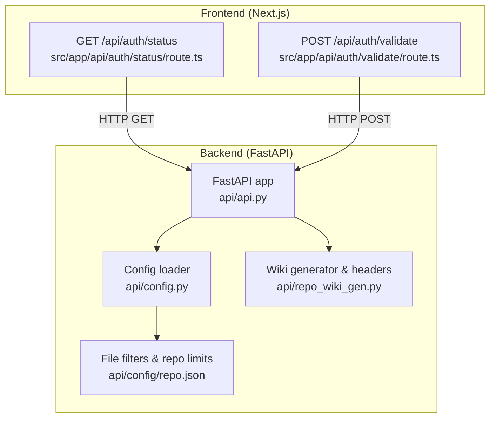
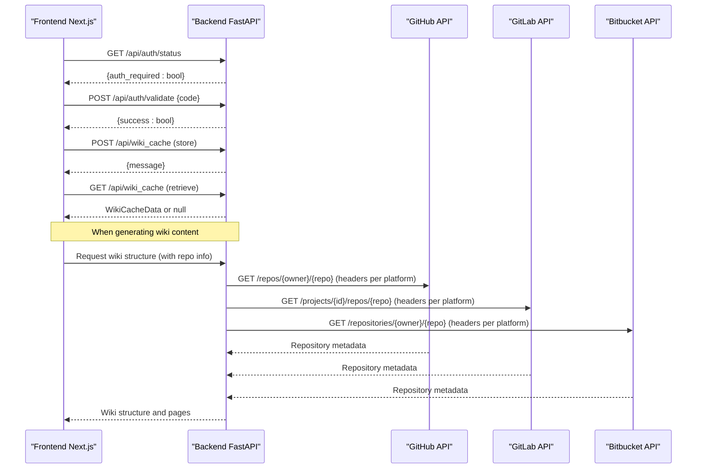
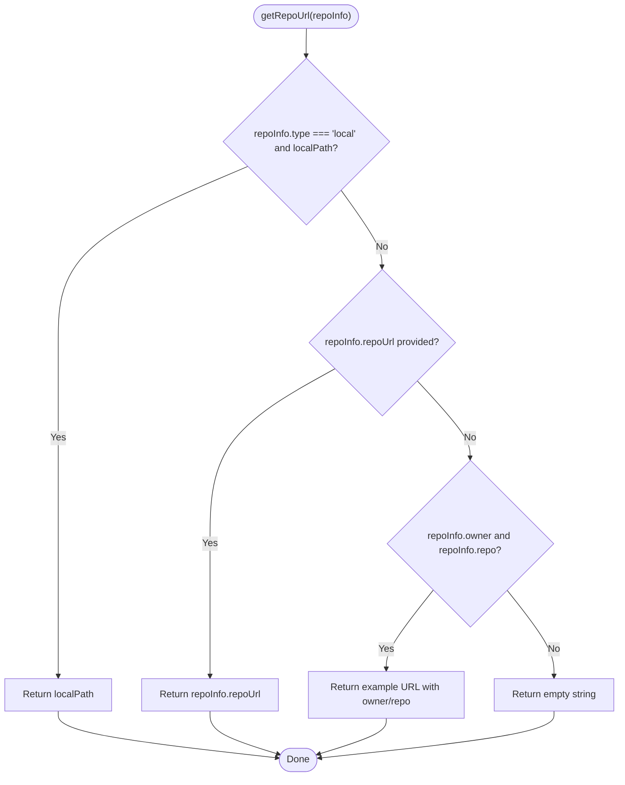
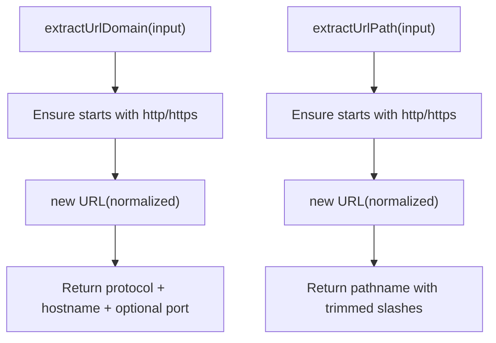
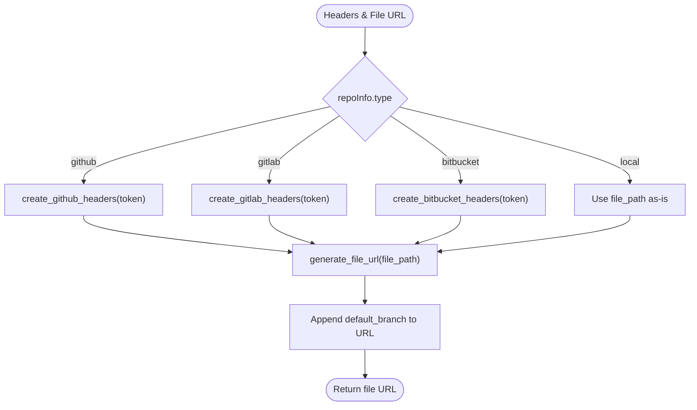
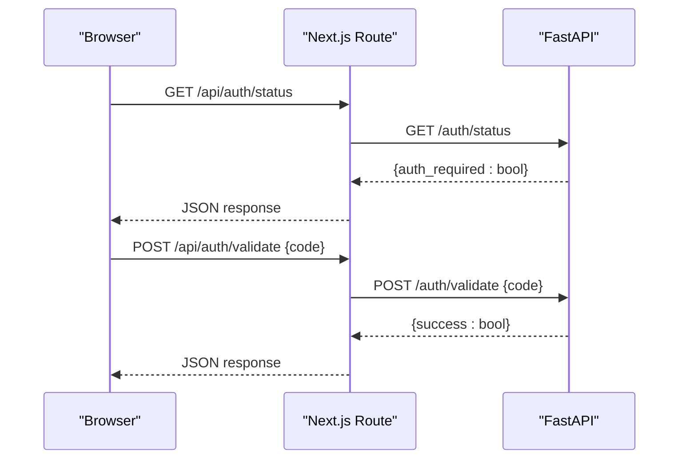
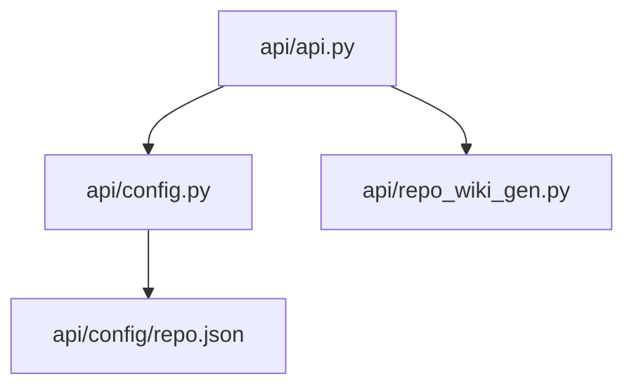

# Remote Repository Access

<cite>
**Referenced Files in This Document**
- [api/api.py](file://api/api.py)
- [api/config.py](file://api/config.py)
- [api/config/repo.json](file://api/config/repo.json)
- [api/repo_wiki_gen.py](file://api/repo_wiki_gen.py)
- [src/utils/getRepoUrl.tsx](file://src/utils/getRepoUrl.tsx)
- [src/utils/urlDecoder.tsx](file://src/utils/urlDecoder.tsx)
- [src/types/repoinfo.tsx](file://src/types/repoinfo.tsx)
- [src/app/api/auth/status/route.ts](file://src/app/api/auth/status/route.ts)
- [src/app/api/auth/validate/route.ts](file://src/app/api/auth/validate/route.ts)
</cite>

## Table of Contents
1. [Introduction](#introduction)
2. [Project Structure](#project-structure)
3. [Core Components](#core-components)
4. [Architecture Overview](#architecture-overview)
5. [Detailed Component Analysis](#detailed-component-analysis)
6. [Dependency Analysis](#dependency-analysis)
7. [Performance Considerations](#performance-considerations)
8. [Troubleshooting Guide](#troubleshooting-guide)
9. [Conclusion](#conclusion)

## Introduction
This document describes the remote repository access system supporting GitHub, GitLab, and Bitbucket repositories. It explains how repository URLs are parsed and validated, how authentication tokens are injected for each platform, and how file content retrieval is orchestrated. It also documents branch detection for cloud repositories, error handling strategies for network failures and authentication issues, and practical examples for accessing private repositories, handling rate limits, and managing credentials securely.

## Project Structure
The remote repository access system spans both the backend API and the frontend Next.js routes that proxy authentication checks to the backend. The backend exposes endpoints for:
- Authentication status and validation
- Local repository structure discovery
- Wiki cache operations
- Model configuration

The frontend Next.js API routes forward authentication-related requests to the backend, ensuring a clean separation of concerns.

**Diagram sources**
- [api/api.py](file://api/api.py#L1-L635)
- [api/config.py](file://api/config.py#L1-L464)
- [api/config/repo.json](file://api/config/repo.json#L1-L129)
- [api/repo_wiki_gen.py](file://api/repo_wiki_gen.py#L1-L550)
- [src/app/api/auth/status/route.ts](file://src/app/api/auth/status/route.ts#L1-L32)
- [src/app/api/auth/validate/route.ts](file://src/app/api/auth/validate/route.ts#L1-L35)

**Section sources**
- [api/api.py](file://api/api.py#L1-L635)
- [api/config.py](file://api/config.py#L1-L464)
- [api/config/repo.json](file://api/config/repo.json#L1-L129)
- [api/repo_wiki_gen.py](file://api/repo_wiki_gen.py#L1-L550)
- [src/app/api/auth/status/route.ts](file://src/app/api/auth/status/route.ts#L1-L32)
- [src/app/api/auth/validate/route.ts](file://src/app/api/auth/validate/route.ts#L1-L35)

## Core Components
- Repository information model and URL construction:
  - The repository info type defines owner, repo, type, optional token, local path, and optional repo URL. A helper computes a repository URL from these fields.
- URL parsing and validation helpers:
  - Utilities extract domain and path from arbitrary strings, normalizing them to a canonical form.
- Platform-specific header injection:
  - The wiki generator creates appropriate headers for GitHub, GitLab, and Bitbucket API requests using the provided token.
- File URL generation:
  - Generates proper blob/raw links for GitHub, GitLab, and Bitbucket using a default branch.
- Authentication proxy:
  - Next.js routes forward authentication status and validation to the backend FastAPI service.

**Section sources**
- [src/types/repoinfo.tsx](file://src/types/repoinfo.tsx#L1-L11)
- [src/utils/getRepoUrl.tsx](file://src/utils/getRepoUrl.tsx#L1-L17)
- [src/utils/urlDecoder.tsx](file://src/utils/urlDecoder.tsx#L1-L19)
- [api/repo_wiki_gen.py](file://api/repo_wiki_gen.py#L124-L171)
- [src/app/api/auth/status/route.ts](file://src/app/api/auth/status/route.ts#L1-L32)
- [src/app/api/auth/validate/route.ts](file://src/app/api/auth/validate/route.ts#L1-L35)

## Architecture Overview
The system separates frontend and backend responsibilities:
- Frontend Next.js routes handle authentication checks and proxy them to the backend.
- Backend FastAPI serves endpoints for authentication, local repository structure, wiki cache, and model configuration.
- The wiki generator composes platform-specific headers and constructs file URLs for cloud repositories.

**Diagram sources**
- [api/api.py](file://api/api.py#L153-L226)
- [api/repo_wiki_gen.py](file://api/repo_wiki_gen.py#L124-L171)
- [src/app/api/auth/status/route.ts](file://src/app/api/auth/status/route.ts#L1-L32)
- [src/app/api/auth/validate/route.ts](file://src/app/api/auth/validate/route.ts#L1-L35)

## Detailed Component Analysis

### Repository Information Model and URL Construction
- The repository info type encapsulates owner, repo, type, optional token, local path, and optional repo URL. An optional branch field is present in the frontend type but not used in backend logic shown here.
- URL construction prioritizes explicit repo URL, then falls back to constructing a placeholder URL when owner and repo are provided, otherwise returns empty.

**Diagram sources**
- [src/utils/getRepoUrl.tsx](file://src/utils/getRepoUrl.tsx#L1-L17)
- [src/types/repoinfo.tsx](file://src/types/repoinfo.tsx#L1-L11)

**Section sources**
- [src/utils/getRepoUrl.tsx](file://src/utils/getRepoUrl.tsx#L1-L17)
- [src/types/repoinfo.tsx](file://src/types/repoinfo.tsx#L1-L11)

### URL Parsing and Validation
- Domain extraction normalizes input to HTTPS when missing and parses hostname and port.
- Path extraction normalizes input similarly and strips leading/trailing slashes.

**Diagram sources**
- [src/utils/urlDecoder.tsx](file://src/utils/urlDecoder.tsx#L1-L19)

**Section sources**
- [src/utils/urlDecoder.tsx](file://src/utils/urlDecoder.tsx#L1-L19)

### Platform-Specific Header Injection and File URL Generation
- Headers:
  - GitHub: Accept header plus Authorization: Bearer <token>.
  - GitLab: Content-Type: application/json plus PRIVATE-TOKEN: <token>.
  - Bitbucket: Content-Type: application/json plus Authorization: Bearer <token>.
- File URL generation:
  - Uses repo URL hostname to select platform-specific blob/raw URL pattern and appends a default branch.

**Diagram sources**
- [api/repo_wiki_gen.py](file://api/repo_wiki_gen.py#L124-L171)

**Section sources**
- [api/repo_wiki_gen.py](file://api/repo_wiki_gen.py#L124-L171)

### Authentication Proxy (Frontend to Backend)
- Status endpoint: GET /api/auth/status forwards to backend /auth/status.
- Validation endpoint: POST /api/auth/validate forwards to backend /auth/validate.
- Both routes set Content-Type and forward request/response.

**Diagram sources**
- [src/app/api/auth/status/route.ts](file://src/app/api/auth/status/route.ts#L1-L32)
- [src/app/api/auth/validate/route.ts](file://src/app/api/auth/validate/route.ts#L1-L35)
- [api/api.py](file://api/api.py#L153-L165)

**Section sources**
- [src/app/api/auth/status/route.ts](file://src/app/api/auth/status/route.ts#L1-L32)
- [src/app/api/auth/validate/route.ts](file://src/app/api/auth/validate/route.ts#L1-L35)
- [api/api.py](file://api/api.py#L153-L165)

### File Filters and Repository Limits
- The repository configuration defines:
  - Excluded directories and files patterns.
  - Maximum repository size in MB.
- These filters are used during repository processing to avoid scanning unnecessary or sensitive content.

**Section sources**
- [api/config/repo.json](file://api/config/repo.json#L1-L129)

### Practical Examples

#### Accessing Private Repositories
- Provide a token in the repository info and let the wiki generator inject the appropriate Authorization header for the selected platform.
- For GitHub, use Authorization: Bearer <token>.
- For GitLab, use PRIVATE-TOKEN: <token>.
- For Bitbucket, use Authorization: Bearer <token>.

**Section sources**
- [api/repo_wiki_gen.py](file://api/repo_wiki_gen.py#L124-L143)

#### Handling Rate Limiting
- Implement retry with exponential backoff when receiving rate limit errors from platform APIs.
- Respect platform-specific rate limit headers if available.
- Cache responses locally to reduce repeated API calls.

[No sources needed since this section provides general guidance]

#### Secure Credential Management
- Store tokens in environment variables and pass them through the repository info object.
- Avoid logging tokens or including them in error reports.
- Use HTTPS endpoints and restrict access to authenticated routes.

[No sources needed since this section provides general guidance]

## Dependency Analysis
The backend FastAPI app depends on:
- Configuration loader for model providers and embedders.
- Wiki generator for platform-specific headers and file URL construction.
- Repository configuration for filtering and size limits.

**Diagram sources**
- [api/api.py](file://api/api.py#L1-L635)
- [api/config.py](file://api/config.py#L1-L464)
- [api/config/repo.json](file://api/config/repo.json#L1-L129)
- [api/repo_wiki_gen.py](file://api/repo_wiki_gen.py#L1-L550)

**Section sources**
- [api/api.py](file://api/api.py#L1-L635)
- [api/config.py](file://api/config.py#L1-L464)
- [api/config/repo.json](file://api/config/repo.json#L1-L129)
- [api/repo_wiki_gen.py](file://api/repo_wiki_gen.py#L1-L550)

## Performance Considerations
- Minimize redundant API calls by caching repository metadata and wiki structures.
- Apply file filters early to reduce traversal overhead.
- Use asynchronous processing for long-running operations and streaming responses where applicable.

[No sources needed since this section provides general guidance]

## Troubleshooting Guide
Common issues and resolutions:
- Authentication failures:
  - Verify the correct token type and header for the platform.
  - Confirm token permissions for the target repository.
- Network errors:
  - Retry transient failures with backoff.
  - Validate repository URL and branch name.
- Rate limiting:
  - Reduce request frequency or implement caching.
  - Monitor platform-specific rate limit headers if available.
- Invalid URLs:
  - Ensure the repo URL matches the platform’s hostname and path format.

**Section sources**
- [api/repo_wiki_gen.py](file://api/repo_wiki_gen.py#L124-L171)
- [api/api.py](file://api/api.py#L153-L165)

## Conclusion
The remote repository access system integrates platform-specific authentication and URL handling with a robust backend API and frontend proxy. By leveraging typed repository information, normalized URL parsing, and configurable file filters, it supports secure and efficient access to GitHub, GitLab, and Bitbucket repositories. Proper credential management, rate-limit handling, and caching strategies ensure reliable operation at scale.