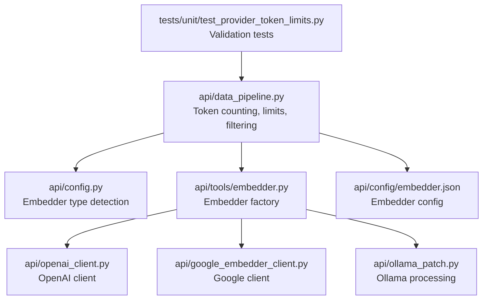
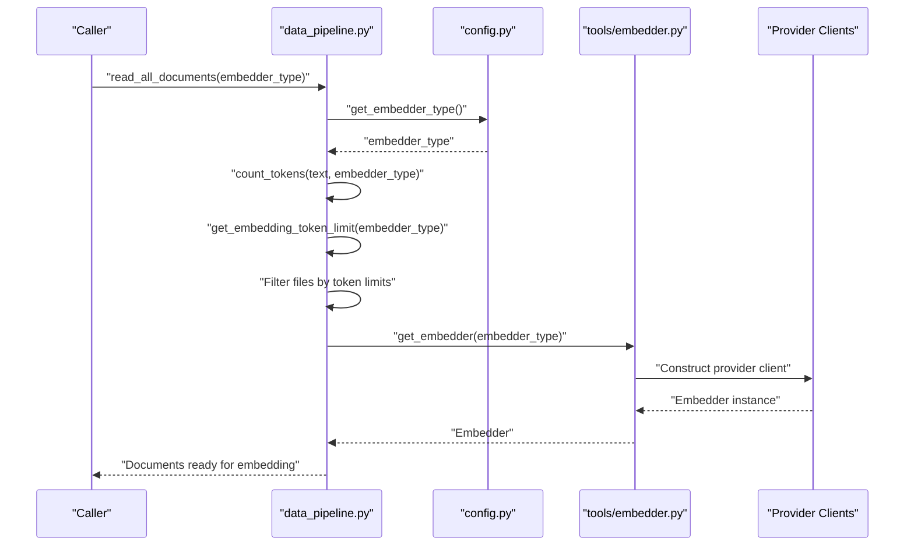
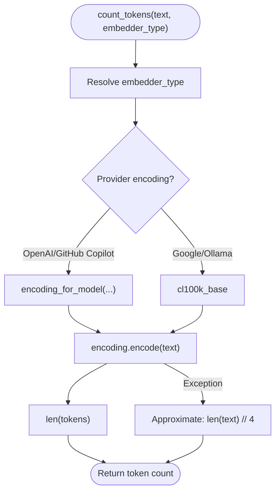
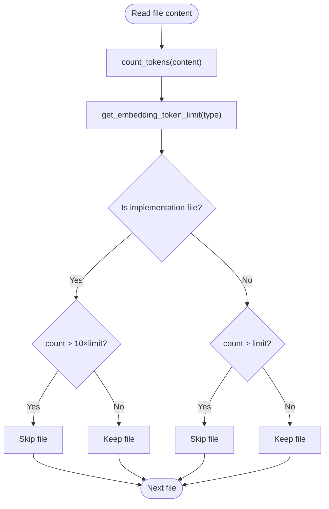
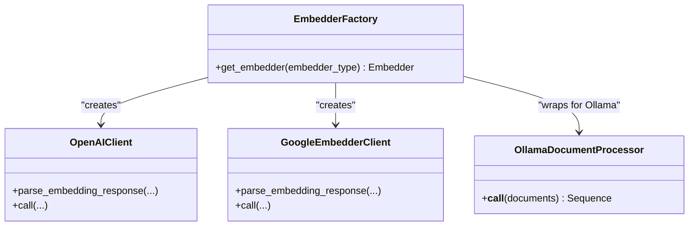
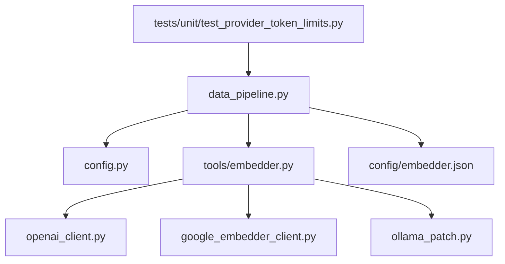

# Token Counting and Validation

<cite>
**Referenced Files in This Document**
- [data_pipeline.py](file://api/data_pipeline.py)
- [config.py](file://api/config.py)
- [embedder.py](file://api/tools/embedder.py)
- [google_embedder_client.py](file://api/google_embedder_client.py)
- [openai_client.py](file://api/openai_client.py)
- [ollama_patch.py](file://api/ollama_patch.py)
- [embedder.json](file://api/config/embedder.json)
- [test_provider_token_limits.py](file://tests/unit/test_provider_token_limits.py)
</cite>

## Table of Contents
1. [Introduction](#introduction)
2. [Project Structure](#project-structure)
3. [Core Components](#core-components)
4. [Architecture Overview](#architecture-overview)
5. [Detailed Component Analysis](#detailed-component-analysis)
6. [Dependency Analysis](#dependency-analysis)
7. [Performance Considerations](#performance-considerations)
8. [Troubleshooting Guide](#troubleshooting-guide)
9. [Conclusion](#conclusion)
10. [Appendices](#appendices)

## Introduction
This document explains the token counting and validation mechanism used across different embedder types (OpenAI, Google, Ollama, DashScope, GitHub Copilot). It covers provider-specific encoding strategies, token limit enforcement, fallback mechanisms when tokenization fails, and the conservative approach for large code files. It also documents differences in encoding strategies, accuracy considerations, and performance optimizations for repositories with mixed content types.

## Project Structure
The token counting and validation logic is primarily implemented in the data pipeline module and integrated with provider-specific embedder configurations and clients.

**Diagram sources**
- [data_pipeline.py](file://api/data_pipeline.py#L25-L102)
- [config.py](file://api/config.py#L183-L275)
- [embedder.py](file://api/tools/embedder.py#L6-L58)
- [openai_client.py](file://api/openai_client.py#L120-L136)
- [google_embedder_client.py](file://api/google_embedder_client.py#L20-L51)
- [ollama_patch.py](file://api/ollama_patch.py#L62-L105)
- [embedder.json](file://api/config/embedder.json#L1-L35)
- [test_provider_token_limits.py](file://tests/unit/test_provider_token_limits.py#L18-L51)

**Section sources**
- [data_pipeline.py](file://api/data_pipeline.py#L25-L102)
- [config.py](file://api/config.py#L183-L275)
- [embedder.py](file://api/tools/embedder.py#L6-L58)
- [embedder.json](file://api/config/embedder.json#L1-L35)

## Core Components
- Token counting and provider-specific encoding:
  - Uses tiktoken to count tokens with provider-specific encodings.
  - Provides a conservative fallback when tiktoken fails.
- Token limit enforcement:
  - Defines provider-specific token limits for embedding.
  - Applies stricter limits for code files versus documentation.
- Filtering at the data pipeline level:
  - Files exceeding limits are filtered out before embedding to avoid client-side truncation.
- Provider-specific embedder selection:
  - Determines embedder type and constructs the appropriate embedder instance.

**Section sources**
- [data_pipeline.py](file://api/data_pipeline.py#L25-L102)
- [data_pipeline.py](file://api/data_pipeline.py#L349-L388)
- [config.py](file://api/config.py#L183-L275)
- [embedder.py](file://api/tools/embedder.py#L6-L58)

## Architecture Overview
The token counting and validation pipeline integrates with the embedder selection and data processing stages.

**Diagram sources**
- [data_pipeline.py](file://api/data_pipeline.py#L177-L406)
- [config.py](file://api/config.py#L183-L275)
- [embedder.py](file://api/tools/embedder.py#L6-L58)

## Detailed Component Analysis

### Token Counting and Encoding Strategies
- Provider-specific encoding:
  - OpenAI/GitHub Copilot: Uses a model-specific encoding for accurate counts.
  - Google: Uses a widely compatible encoding suitable for token estimation.
  - Ollama: Uses a broadly compatible encoding for estimation.
- Fallback mechanism:
  - On tiktoken failure, falls back to a simple character-length approximation.
- Accuracy considerations:
  - Model-specific encodings improve accuracy for provider-specific models.
  - Approximation avoids blocking but may undercount or overcount.

**Diagram sources**
- [data_pipeline.py](file://api/data_pipeline.py#L61-L102)

**Section sources**
- [data_pipeline.py](file://api/data_pipeline.py#L61-L102)

### Token Limit Enforcement and Filtering
- Provider-specific limits:
  - OpenAI/GitHub Copilot: Higher limit suitable for general-purpose embeddings.
  - Google/DashScope/Ollama: Lower, conservative limits to prevent client-side failures.
- Filtering logic:
  - Code files: Allowed up to 10x the provider’s token limit to accommodate large implementations.
  - Documentation files: Strict adherence to the provider’s token limit.
- Data pipeline filtering:
  - Files exceeding limits are skipped at ingestion time to preserve semantic integrity and avoid truncation artifacts.

**Diagram sources**
- [data_pipeline.py](file://api/data_pipeline.py#L349-L388)

**Section sources**
- [data_pipeline.py](file://api/data_pipeline.py#L25-L32)
- [data_pipeline.py](file://api/data_pipeline.py#L349-L388)

### Provider-Specific Embedder Selection and Embedding Pipeline
- Embedder selection:
  - Resolves embedder type from configuration and constructs the appropriate client.
- Embedding pipeline:
  - For Ollama: Processes documents individually due to client limitations.
  - For others: Uses batched embedding with configurable batch size.
- Client integrations:
  - OpenAI: Provides robust parsing and usage tracking.
  - Google: Parses embeddings and supports batch operations.

**Diagram sources**
- [embedder.py](file://api/tools/embedder.py#L6-L58)
- [openai_client.py](file://api/openai_client.py#L268-L280)
- [google_embedder_client.py](file://api/google_embedder_client.py#L78-L140)
- [ollama_patch.py](file://api/ollama_patch.py#L62-L105)

**Section sources**
- [embedder.py](file://api/tools/embedder.py#L6-L58)
- [openai_client.py](file://api/openai_client.py#L268-L280)
- [google_embedder_client.py](file://api/google_embedder_client.py#L78-L140)
- [ollama_patch.py](file://api/ollama_patch.py#L62-L105)

### Practical Examples and Edge Cases
- Customizing token limits:
  - Modify provider-specific limits in the data pipeline constants to adjust strictness.
- Handling edge cases:
  - Very large code files: Allowed up to 10x the limit to reduce premature skips.
  - Mixed content repositories: Filtering occurs before batching to maintain consistency.
- Optimizing for mixed content:
  - Use inclusion/exclusion filters to focus on relevant directories and file types.
  - Adjust text splitting parameters to balance chunk size and overlap for embedding efficiency.

**Section sources**
- [data_pipeline.py](file://api/data_pipeline.py#L25-L32)
- [data_pipeline.py](file://api/data_pipeline.py#L177-L406)
- [embedder.json](file://api/config/embedder.json#L30-L34)

## Dependency Analysis
The token counting and validation logic depends on:
- Provider type resolution from configuration.
- Embedder construction via the embedder factory.
- Provider-specific clients for parsing and calling embedding APIs.
- Tests validating provider-specific limits and token counting behavior.

**Diagram sources**
- [data_pipeline.py](file://api/data_pipeline.py#L25-L102)
- [config.py](file://api/config.py#L183-L275)
- [embedder.py](file://api/tools/embedder.py#L6-L58)
- [openai_client.py](file://api/openai_client.py#L268-L280)
- [google_embedder_client.py](file://api/google_embedder_client.py#L78-L140)
- [ollama_patch.py](file://api/ollama_patch.py#L62-L105)
- [embedder.json](file://api/config/embedder.json#L1-L35)
- [test_provider_token_limits.py](file://tests/unit/test_provider_token_limits.py#L18-L51)

**Section sources**
- [data_pipeline.py](file://api/data_pipeline.py#L25-L102)
- [config.py](file://api/config.py#L183-L275)
- [embedder.py](file://api/tools/embedder.py#L6-L58)
- [openai_client.py](file://api/openai_client.py#L268-L280)
- [google_embedder_client.py](file://api/google_embedder_client.py#L78-L140)
- [ollama_patch.py](file://api/ollama_patch.py#L62-L105)
- [embedder.json](file://api/config/embedder.json#L1-L35)
- [test_provider_token_limits.py](file://tests/unit/test_provider_token_limits.py#L18-L51)

## Performance Considerations
- Encoding choice:
  - Model-specific encodings offer higher accuracy but may incur minor overhead compared to broad encodings.
- Fallback strategy:
  - Character-length approximation prevents runtime failures but reduces accuracy; use judiciously.
- Filtering at ingestion:
  - Skipping oversized files early avoids wasted compute and network calls.
- Batch processing:
  - Batch size is configurable; tune for memory and throughput constraints.
- Ollama-specific processing:
  - Individual processing avoids client limitations but increases latency; consider chunking strategies for very large files.

[No sources needed since this section provides general guidance]

## Troubleshooting Guide
- Token counting fails:
  - The system falls back to a simple approximation; verify content encoding and environment.
- Files unexpectedly skipped:
  - Check whether the file is a code file (allowed up to 10x limit) or documentation file (strict limit).
- Provider mismatch:
  - Ensure the embedder type matches the intended provider; mismatches can lead to incorrect limits or encoding.
- Ollama model issues:
  - Verify model availability and configuration; the patch handles individual processing and validates embedding sizes.

**Section sources**
- [data_pipeline.py](file://api/data_pipeline.py#L97-L102)
- [data_pipeline.py](file://api/data_pipeline.py#L349-L388)
- [config.py](file://api/config.py#L183-L275)
- [ollama_patch.py](file://api/ollama_patch.py#L21-L60)

## Conclusion
The token counting and validation system provides a robust, provider-aware mechanism for embedding repositories. By combining provider-specific encodings, strict yet configurable limits, and early-stage filtering, it ensures reliable processing while preserving semantic integrity. The fallback strategy maintains resilience, and the Ollama-specific processing accommodates provider constraints. Tuning the text splitter and filters further optimizes performance for mixed-content repositories.

[No sources needed since this section summarizes without analyzing specific files]

## Appendices

### Provider-Specific Token Limits
- OpenAI/GitHub Copilot: Higher limit for general-purpose embeddings.
- Google/DashScope/Ollama: Lower, conservative limits to prevent client-side failures.

**Section sources**
- [data_pipeline.py](file://api/data_pipeline.py#L25-L32)

### Validation Tests Overview
- Validates provider-specific token limits and token counting behavior.
- Confirms filtering logic for different embedder types and file sizes.

**Section sources**
- [test_provider_token_limits.py](file://tests/unit/test_provider_token_limits.py#L18-L51)
- [test_provider_token_limits.py](file://tests/unit/test_provider_token_limits.py#L160-L219)