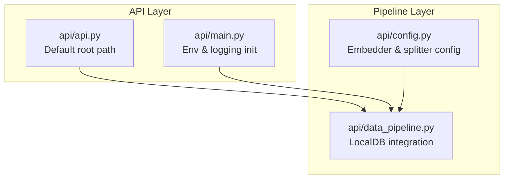
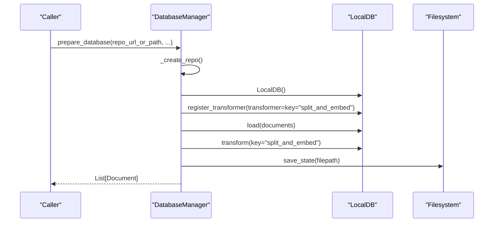
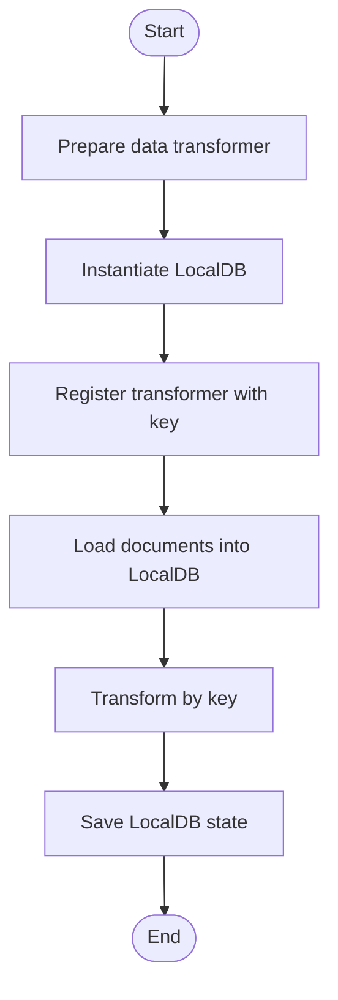
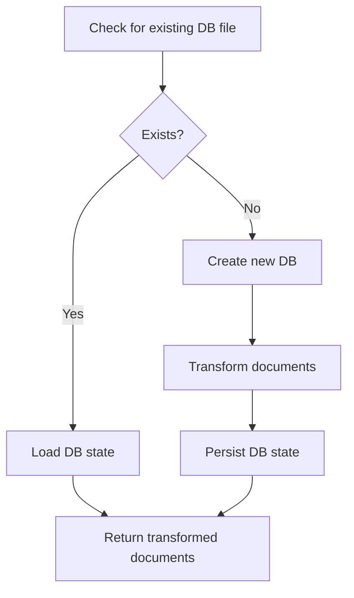
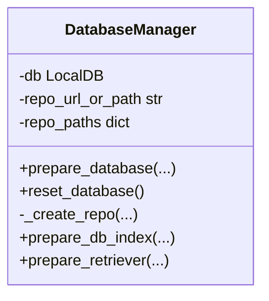
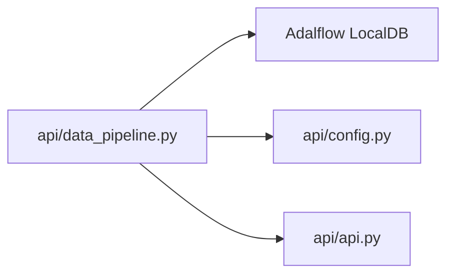

# LocalDB Integration and State Management

<cite>
**Referenced Files in This Document**
- [data_pipeline.py](file://api/data_pipeline.py)
- [config.py](file://api/config.py)
- [api.py](file://api/api.py)
- [main.py](file://api/main.py)
</cite>

## Table of Contents
1. [Introduction](#introduction)
2. [Project Structure](#project-structure)
3. [Core Components](#core-components)
4. [Architecture Overview](#architecture-overview)
5. [Detailed Component Analysis](#detailed-component-analysis)
6. [Dependency Analysis](#dependency-analysis)
7. [Performance Considerations](#performance-considerations)
8. [Troubleshooting Guide](#troubleshooting-guide)
9. [Conclusion](#conclusion)

## Introduction
This document explains how the system integrates LocalDB into the data transformation pipeline. It covers how transformers are registered with LocalDB using a key-based system, how documents are loaded, transformed, and persisted, and how the pipeline manages state across sessions. It also provides examples of initialization, transformation workflows, troubleshooting, and performance considerations for large repositories.

## Project Structure
The LocalDB integration lives primarily in the data pipeline module and coordinates with configuration and API modules:
- LocalDB registration and transformation orchestration are implemented in the data pipeline module.
- Configuration for embedders and text splitting is loaded via the configuration module.
- The API module defines the default root path used for storing databases and caches.
- The main module initializes environment variables and logging.

**Diagram sources**
- [api.py](file://api/api.py#L35-L38)
- [main.py](file://api/main.py#L1-L104)
- [data_pipeline.py](file://api/data_pipeline.py#L1-L20)
- [config.py](file://api/config.py#L1-L40)

**Section sources**
- [data_pipeline.py](file://api/data_pipeline.py#L1-L20)
- [config.py](file://api/config.py#L170-L182)
- [api.py](file://api/api.py#L35-L38)
- [main.py](file://api/main.py#L1-L104)

## Core Components
- LocalDB registration and key-based transformation: Transformers are registered under a key and later executed by key.
- Document loading and transformation: Documents are loaded into LocalDB, transformed using the registered transformer, and then persisted to disk.
- State management: LocalDB state is saved to a pickle file and can be loaded on subsequent runs to avoid recomputation.
- Database manager: Provides a high-level interface to create, load, and reuse databases for repositories.

Key responsibilities:
- Register transformer with LocalDB using a key.
- Load documents into LocalDB.
- Execute transformations by key.
- Persist and restore LocalDB state.

**Section sources**
- [data_pipeline.py](file://api/data_pipeline.py#L452-L476)
- [data_pipeline.py](file://api/data_pipeline.py#L737-L917)

## Architecture Overview
The LocalDB integration follows a straightforward pipeline:
- Prepare a data transformer based on configuration.
- Instantiate LocalDB and register the transformer with a key.
- Load documents into LocalDB.
- Transform documents using the registered key.
- Save LocalDB state to a persistent file.

**Diagram sources**
- [data_pipeline.py](file://api/data_pipeline.py#L737-L917)
- [data_pipeline.py](file://api/data_pipeline.py#L452-L476)

## Detailed Component Analysis

### LocalDB Registration and Key-Based Transformation
- Transformers are registered with LocalDB using a key. The key acts as an identifier for the transformation pipeline.
- The registration occurs before loading documents and after preparing the transformer.
- Subsequent calls to transform use the same key to apply the registered pipeline.

Implementation highlights:
- Transformer registration with a key.
- Loading documents into LocalDB.
- Executing transformation by key.
- Saving the LocalDB state to disk.

**Section sources**
- [data_pipeline.py](file://api/data_pipeline.py#L452-L476)

### Document Loading and Transformation Execution
- Documents are read from the repository path and passed to LocalDB via load().
- The registered transformer is applied to the loaded documents using transform(key).
- The transformed data can be retrieved later using the same key.

**Diagram sources**
- [data_pipeline.py](file://api/data_pipeline.py#L452-L476)

**Section sources**
- [data_pipeline.py](file://api/data_pipeline.py#L452-L476)

### Database State Management and Persistence
- State persistence: LocalDB state is saved to a pickle file located under the default root path.
- State restoration: On subsequent runs, if a database file exists, it is loaded and transformed documents are returned without reprocessing.
- Paths: Repositories and databases are organized under the default root path.

**Diagram sources**
- [data_pipeline.py](file://api/data_pipeline.py#L874-L902)
- [api.py](file://api/api.py#L35-L38)

**Section sources**
- [data_pipeline.py](file://api/data_pipeline.py#L874-L902)
- [api.py](file://api/api.py#L35-L38)

### Database Manager Workflow
- The DatabaseManager encapsulates repository preparation, database creation/loading, and retriever preparation.
- It ensures the repository is downloaded or linked, prepares the database index, and returns transformed documents.

**Diagram sources**
- [data_pipeline.py](file://api/data_pipeline.py#L737-L917)

**Section sources**
- [data_pipeline.py](file://api/data_pipeline.py#L737-L917)

### Configuration-Driven Pipeline
- Embedder selection and batch size are derived from configuration.
- Text splitter configuration is loaded from the configuration module.
- The pipeline adapts to different embedders (e.g., Ollama vs. others) by choosing single-document or batch processing.

**Section sources**
- [data_pipeline.py](file://api/data_pipeline.py#L408-L450)
- [config.py](file://api/config.py#L170-L182)

## Dependency Analysis
- LocalDB is imported from the Adalflow library and used within the data pipeline.
- The default root path for storing databases is provided by the API module.
- Configuration modules supply embedder and text splitter settings used to build the transformer.

**Diagram sources**
- [data_pipeline.py](file://api/data_pipeline.py#L12-L14)
- [config.py](file://api/config.py#L170-L182)
- [api.py](file://api/api.py#L35-L38)

**Section sources**
- [data_pipeline.py](file://api/data_pipeline.py#L12-L14)
- [config.py](file://api/config.py#L170-L182)
- [api.py](file://api/api.py#L35-L38)

## Performance Considerations
- Large repositories: The pipeline reads all matching files and applies token limits per embedder type. For very large repositories, consider narrowing inclusion/exclusion filters to reduce processing volume.
- Batch processing: For providers that support batching, the pipeline uses batch sizes to improve throughput. Adjust batch size via embedder configuration if needed.
- Caching and reuse: Reuse existing database state to avoid repeated transformations across runs.
- Disk I/O: Persisting and loading LocalDB state involves file I/O. Keep the database file on fast storage for better performance.

[No sources needed since this section provides general guidance]

## Troubleshooting Guide
Common issues and resolutions:
- Missing or invalid configuration: Ensure embedder and text splitter configurations are loaded. Verify environment variables for provider credentials.
- Authentication failures: For private repositories, ensure access tokens are provided and valid.
- Permission errors: Confirm write permissions for the default root path and database directory.
- Corrupted database state: If loading the saved state fails, delete the database file and rebuild the index.
- Large file handling: Files exceeding token limits are skipped. Reduce repository scope or adjust filters to include only necessary files.

**Section sources**
- [data_pipeline.py](file://api/data_pipeline.py#L874-L884)
- [config.py](file://api/config.py#L1-L40)

## Conclusion
The LocalDB integration provides a robust, key-based transformation pipeline that loads documents, applies a configurable transformer, and persists state for reuse. By leveraging configuration-driven settings and a structured database lifecycle, the system scales to large repositories while maintaining efficient state management across sessions.