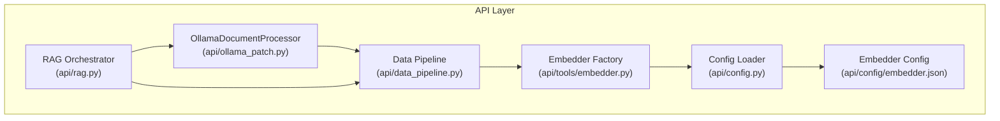
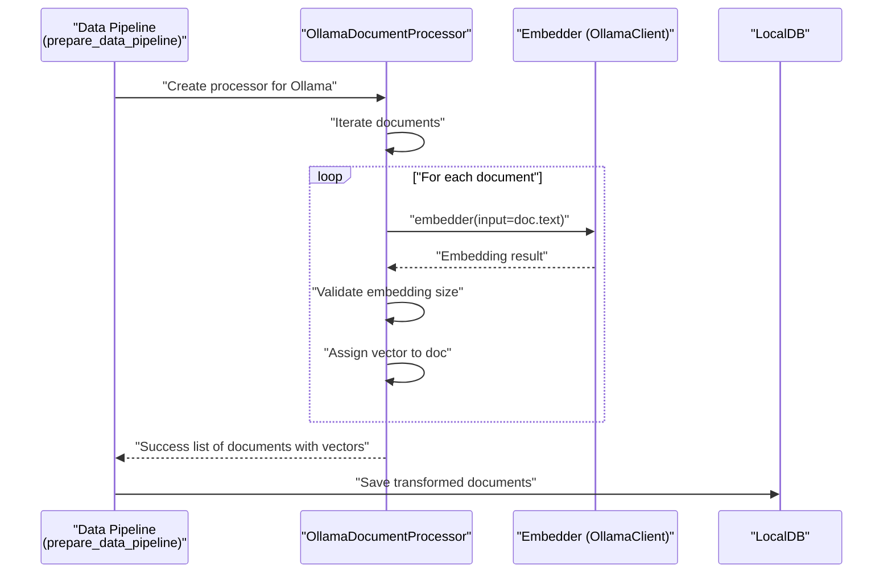
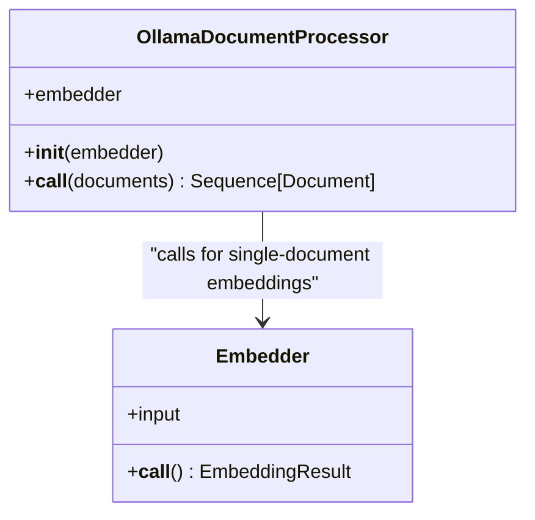
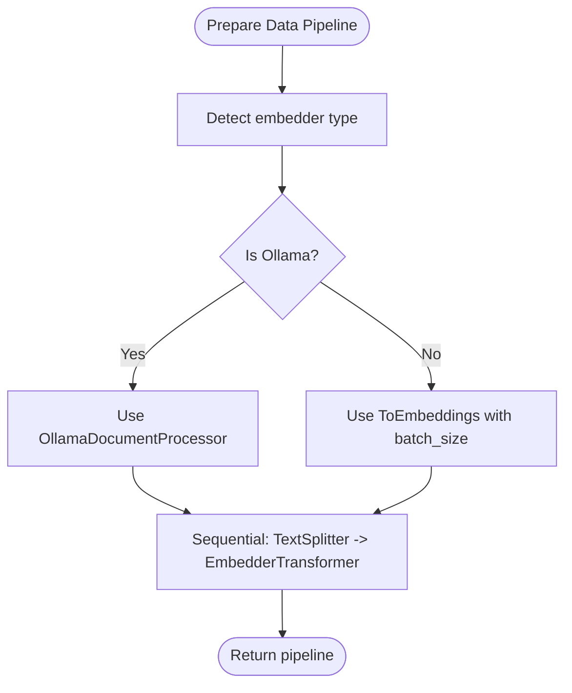
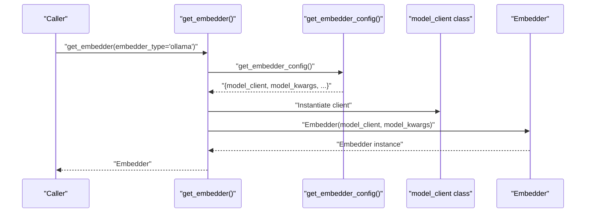
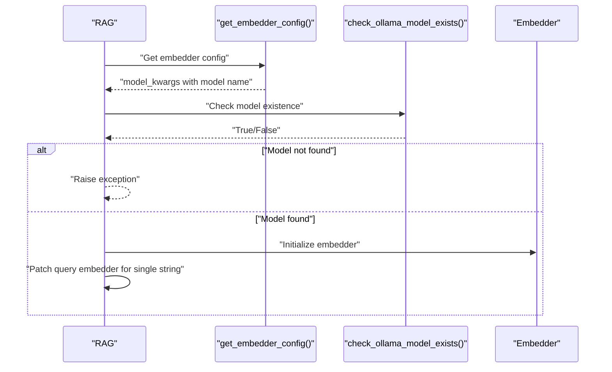
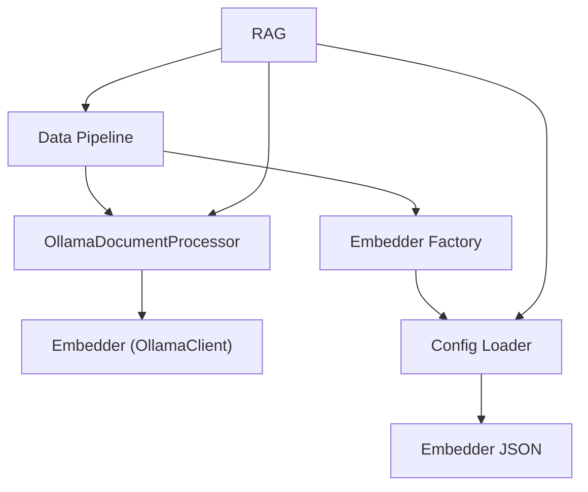

# OllamaDocumentProcessor and Single-Document Handling

<cite>
**Referenced Files in This Document**
- [ollama_patch.py](file://api/ollama_patch.py)
- [data_pipeline.py](file://api/data_pipeline.py)
- [embedder.py](file://api/tools/embedder.py)
- [config.py](file://api/config.py)
- [embedder.json](file://api/config/embedder.json)
- [rag.py](file://api/rag.py)
- [README.md](file://README.md)
</cite>

## Table of Contents
1. [Introduction](#introduction)
2. [Project Structure](#project-structure)
3. [Core Components](#core-components)
4. [Architecture Overview](#architecture-overview)
5. [Detailed Component Analysis](#detailed-component-analysis)
6. [Dependency Analysis](#dependency-analysis)
7. [Performance Considerations](#performance-considerations)
8. [Troubleshooting Guide](#troubleshooting-guide)
9. [Conclusion](#conclusion)

## Introduction
This document explains the OllamaDocumentProcessor component and its role in optimizing single-document processing for local LLM embeddings. It contrasts Ollama’s single-document processing model with batch-capable providers (such as OpenAI and Google), and demonstrates how the OllamaDocumentProcessor integrates with the broader data pipeline to ensure robust, memory-efficient embedding generation for local models.

## Project Structure
The OllamaDocumentProcessor lives in the API layer alongside the data pipeline and embedder factory. It is selected by the data pipeline when the embedder type is Ollama, ensuring that each document is embedded individually and consistently.

**Diagram sources**
- [ollama_patch.py](file://api/ollama_patch.py#L62-L105)
- [data_pipeline.py](file://api/data_pipeline.py#L408-L450)
- [embedder.py](file://api/tools/embedder.py#L6-L58)
- [config.py](file://api/config.py#L170-L181)
- [embedder.json](file://api/config/embedder.json#L1-L35)
- [rag.py](file://api/rag.py#L178-L206)

**Section sources**
- [README.md](file://README.md#L28-L29)
- [config.py](file://api/config.py#L170-L181)
- [embedder.json](file://api/config/embedder.json#L1-L35)

## Core Components
- OllamaDocumentProcessor: Processes documents one at a time, validates embedding sizes, and assigns vectors to documents. It is used when the embedder type is Ollama.
- Data Pipeline: Chooses between OllamaDocumentProcessor (single-document) and batch-based ToEmbeddings (multi-document) based on the embedder type.
- Embedder Factory: Builds the appropriate embedder instance from configuration, including OllamaClient.
- Config Loader: Loads embedder configurations and resolves client classes, including OllamaClient.
- RAG Orchestrator: Detects Ollama embedder type, validates model availability, and ensures query embeddings are handled as single strings for Ollama.

**Section sources**
- [ollama_patch.py](file://api/ollama_patch.py#L62-L105)
- [data_pipeline.py](file://api/data_pipeline.py#L408-L450)
- [embedder.py](file://api/tools/embedder.py#L6-L58)
- [config.py](file://api/config.py#L170-L181)
- [rag.py](file://api/rag.py#L178-L206)

## Architecture Overview
The OllamaDocumentProcessor is invoked by the data pipeline when the embedder type is Ollama. It iterates over documents, requests a single embedding per document, validates embedding sizes, and updates each document with its vector. This contrasts with batch providers that support multi-document embedding in a single call.

**Diagram sources**
- [data_pipeline.py](file://api/data_pipeline.py#L408-L450)
- [ollama_patch.py](file://api/ollama_patch.py#L71-L105)

## Detailed Component Analysis

### OllamaDocumentProcessor
Purpose:
- Process documents individually for Ollama embeddings because AdalFlow’s Ollama client does not support batch embedding.
- Validate embedding sizes across documents and skip inconsistent entries.
- Assign computed vectors back to documents for downstream use.

Key behaviors:
- Iterates through documents and calls the embedder with a single text input per iteration.
- Validates that all embeddings have the same dimensionality and skips documents with mismatched sizes.
- Uses a progress indicator to track processing.
- Logs warnings and errors for skipped documents and failures.

**Diagram sources**
- [ollama_patch.py](file://api/ollama_patch.py#L62-L105)

**Section sources**
- [ollama_patch.py](file://api/ollama_patch.py#L62-L105)

### Data Pipeline Integration
Behavior:
- Determines the embedder type and selects the appropriate transformer:
  - For Ollama: uses OllamaDocumentProcessor.
  - For batch providers: uses ToEmbeddings with a configurable batch size.
- Applies a text splitter followed by the chosen embedder transformer in sequence.

**Diagram sources**
- [data_pipeline.py](file://api/data_pipeline.py#L408-L450)

**Section sources**
- [data_pipeline.py](file://api/data_pipeline.py#L408-L450)

### Embedder Factory and Configuration
Behavior:
- Builds an embedder instance from configuration, selecting the appropriate client class (including OllamaClient).
- Supports explicit embedder type selection and legacy parameters.
- Allows setting batch_size on the embedder instance when available.

**Diagram sources**
- [embedder.py](file://api/tools/embedder.py#L6-L58)
- [config.py](file://api/config.py#L183-L198)

**Section sources**
- [embedder.py](file://api/tools/embedder.py#L6-L58)
- [config.py](file://api/config.py#L183-L198)
- [embedder.json](file://api/config/embedder.json#L1-L35)

### RAG Integration and Model Validation
Behavior:
- Detects the embedder type and validates that the configured Ollama model exists before proceeding.
- Patches the query embedding call to accept a single string for Ollama, ensuring compatibility with single-document processing semantics.

**Diagram sources**
- [rag.py](file://api/rag.py#L178-L206)
- [ollama_patch.py](file://api/ollama_patch.py#L21-L60)

**Section sources**
- [rag.py](file://api/rag.py#L178-L206)
- [ollama_patch.py](file://api/ollama_patch.py#L21-L60)

## Dependency Analysis
- OllamaDocumentProcessor depends on:
  - An embedder instance (OllamaClient-based) to compute embeddings.
  - Logging for progress and diagnostics.
- Data Pipeline depends on:
  - Embedder factory to construct the embedder.
  - Embedder configuration to decide between single-document and batch processing.
- RAG depends on:
  - Model existence checks for Ollama.
  - Embedder factory and configuration resolution.

**Diagram sources**
- [ollama_patch.py](file://api/ollama_patch.py#L62-L105)
- [data_pipeline.py](file://api/data_pipeline.py#L408-L450)
- [embedder.py](file://api/tools/embedder.py#L6-L58)
- [config.py](file://api/config.py#L170-L181)
- [embedder.json](file://api/config/embedder.json#L1-L35)
- [rag.py](file://api/rag.py#L178-L206)

**Section sources**
- [ollama_patch.py](file://api/ollama_patch.py#L62-L105)
- [data_pipeline.py](file://api/data_pipeline.py#L408-L450)
- [embedder.py](file://api/tools/embedder.py#L6-L58)
- [config.py](file://api/config.py#L170-L181)
- [embedder.json](file://api/config/embedder.json#L1-L35)
- [rag.py](file://api/rag.py#L178-L206)

## Performance Considerations
- Why Ollama requires single-document processing:
  - AdalFlow’s Ollama client does not support batch embedding. The OllamaDocumentProcessor processes each document individually to obtain embeddings.
- Batch vs single-document performance:
  - Batch providers (OpenAI, Google) benefit from reduced overhead per document when embedding in batches. Ollama’s single-document approach avoids batching limitations but may incur higher per-call overhead.
- Memory management:
  - Single-document processing reduces peak memory usage by avoiding large batch allocations. Each document is processed and its vector stored independently, minimizing memory spikes.
- Practical guidance:
  - Prefer OllamaDocumentProcessor when using local Ollama models to ensure compatibility and consistent embedding sizes.
  - For large repositories, consider chunking strategies and token limits to keep individual document sizes manageable.

**Section sources**
- [data_pipeline.py](file://api/data_pipeline.py#L436-L445)
- [ollama_patch.py](file://api/ollama_patch.py#L62-L70)

## Troubleshooting Guide
Common issues and resolutions:
- Ollama model not found:
  - The system checks model availability before proceeding. If the model is missing, an exception is raised with guidance to pull the model.
- Inconsistent embedding sizes:
  - Documents with mismatched embedding dimensions are skipped. Validate model configuration and ensure consistent model usage.
- Single-string requirement for Ollama queries:
  - The RAG orchestrator patches the query embedder to accept a single string, preventing batch-like inputs that are unsupported by the Ollama embedder.

**Section sources**
- [rag.py](file://api/rag.py#L178-L206)
- [ollama_patch.py](file://api/ollama_patch.py#L85-L102)

## Conclusion
The OllamaDocumentProcessor enables robust, single-document embedding generation for local Ollama models. By validating embedding sizes, processing documents individually, and integrating with the data pipeline and RAG orchestrator, it ensures reliable performance and memory efficiency for local LLMs. Choose OllamaDocumentProcessor when using local Ollama models to align with the provider’s single-document processing model and to optimize resource utilization.