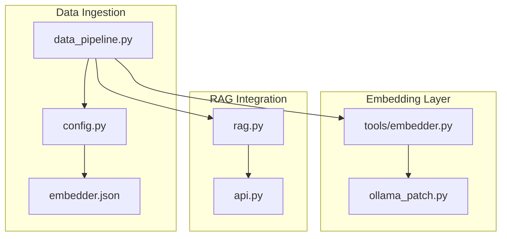
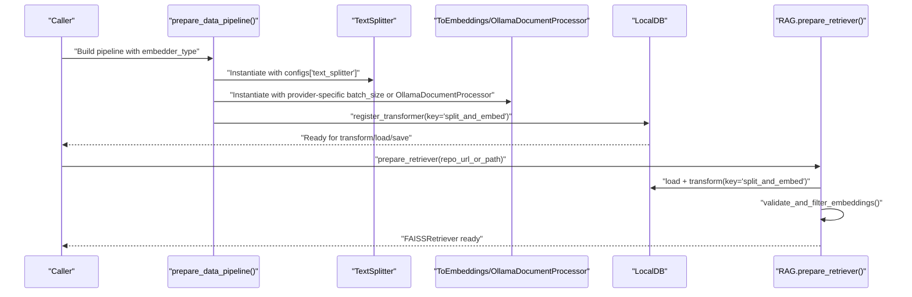
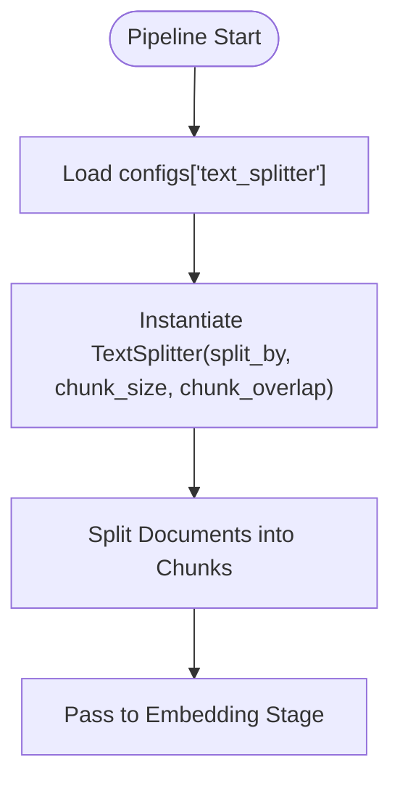
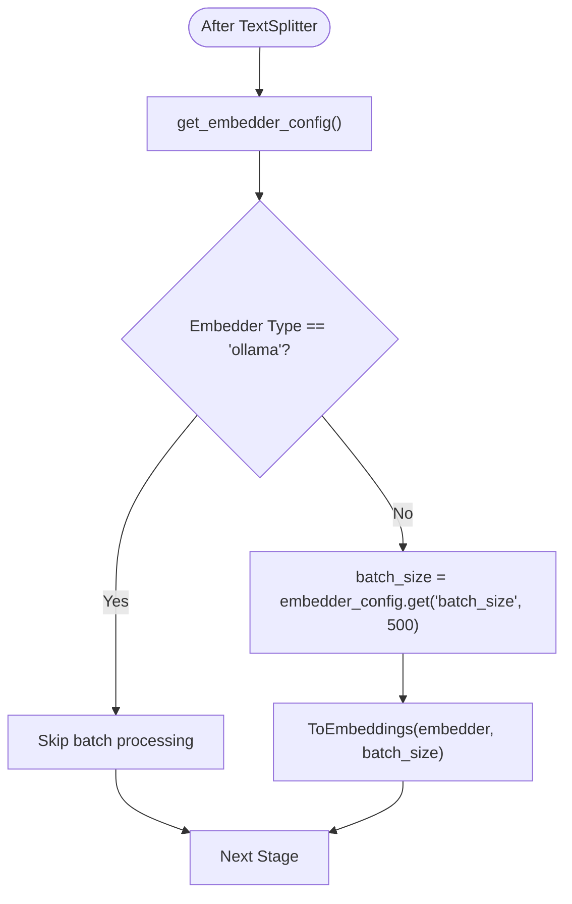
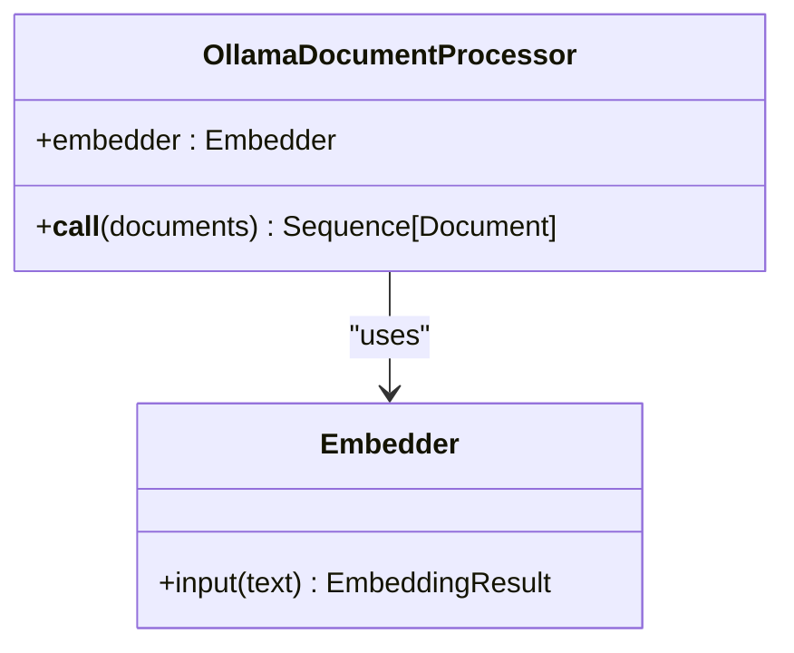
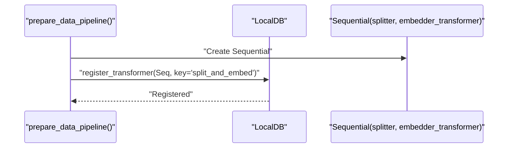
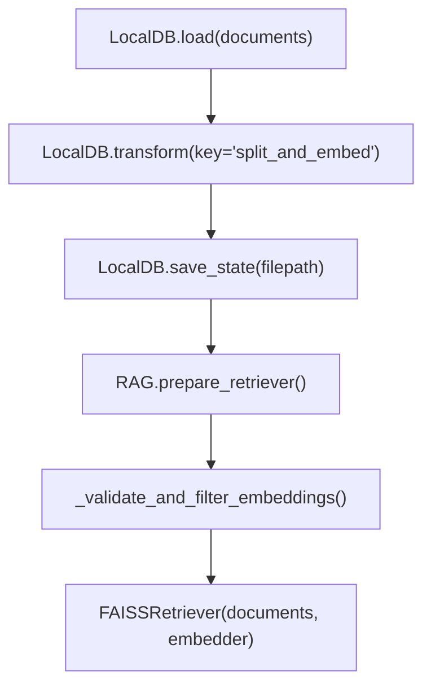
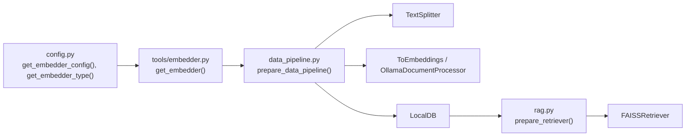

# Pipeline Architecture and Components

<cite>
**Referenced Files in This Document**
- [data_pipeline.py](file://api/data_pipeline.py)
- [rag.py](file://api/rag.py)
- [embedder.py](file://api/tools/embedder.py)
- [ollama_patch.py](file://api/ollama_patch.py)
- [config.py](file://api/config.py)
- [embedder.json](file://api/config/embedder.json)
- [api.py](file://api/api.py)
</cite>

## Table of Contents
1. [Introduction](#introduction)
2. [Project Structure](#project-structure)
3. [Core Components](#core-components)
4. [Architecture Overview](#architecture-overview)
5. [Detailed Component Analysis](#detailed-component-analysis)
6. [Dependency Analysis](#dependency-analysis)
7. [Performance Considerations](#performance-considerations)
8. [Troubleshooting Guide](#troubleshooting-guide)
9. [Conclusion](#conclusion)
10. [Appendices](#appendices)

## Introduction
This document explains the data transformation pipeline architecture built with Adalflow Sequential components. It focuses on how documents are read, chunked, embedded, and persisted for downstream Retrieval-Augmented Generation (RAG) workflows. The pipeline integrates:
- TextSplitter for configurable chunking using parameters from configs['text_splitter']
- ToEmbeddings for batch embedding with provider-specific batch sizing
- OllamaDocumentProcessor for single-document processing optimization when using Ollama
- LocalDB for stateful transformation and persistence
- RAG integration for retrieval and generation

## Project Structure
The pipeline spans several modules:
- Data ingestion and preparation: [data_pipeline.py](file://api/data_pipeline.py)
- Embedder selection and configuration: [embedder.py](file://api/tools/embedder.py), [config.py](file://api/config.py), [embedder.json](file://api/config/embedder.json)
- Ollama-specific processing: [ollama_patch.py](file://api/ollama_patch.py)
- RAG integration and retrieval: [rag.py](file://api/rag.py)
- API surface for orchestration: [api.py](file://api/api.py)

**Diagram sources**
- [data_pipeline.py](file://api/data_pipeline.py#L408-L450)
- [config.py](file://api/config.py#L170-L182)
- [embedder.json](file://api/config/embedder.json#L1-L35)
- [embedder.py](file://api/tools/embedder.py#L6-L59)
- [ollama_patch.py](file://api/ollama_patch.py#L62-L105)
- [rag.py](file://api/rag.py#L345-L391)
- [api.py](file://api/api.py#L1-L635)

**Section sources**
- [data_pipeline.py](file://api/data_pipeline.py#L408-L450)
- [config.py](file://api/config.py#L170-L182)
- [embedder.json](file://api/config/embedder.json#L1-L35)

## Core Components
- TextSplitter: Configurable chunking using parameters from configs['text_splitter'], including split_by, chunk_size, and chunk_overlap.
- ToEmbeddings: Batch embedding transformer with provider-specific batch sizing (default 500 for non-Ollama providers).
- OllamaDocumentProcessor: Single-document processing wrapper for Ollama embeddings, ensuring consistent embedding sizes and individual processing.
- LocalDB: Registers the Sequential pipeline transformer under a key and persists transformed state to disk.
- RAG: Integrates the pipeline into a broader retrieval workflow, validating embeddings and constructing a retriever.

**Section sources**
- [data_pipeline.py](file://api/data_pipeline.py#L408-L450)
- [embedder.py](file://api/tools/embedder.py#L6-L59)
- [ollama_patch.py](file://api/ollama_patch.py#L62-L105)
- [rag.py](file://api/rag.py#L345-L391)

## Architecture Overview
The pipeline is constructed as an Adalflow Sequential chain that first splits documents into chunks and then embeds them. The choice between batch and single-document processing depends on the embedder type. The resulting documents are persisted via LocalDB and later consumed by the RAG retriever.

**Diagram sources**
- [data_pipeline.py](file://api/data_pipeline.py#L408-L476)
- [rag.py](file://api/rag.py#L345-L391)

## Detailed Component Analysis

### TextSplitter Integration
- Construction: The TextSplitter is instantiated with parameters from configs['text_splitter'], enabling flexible chunking strategies.
- Parameters: split_by, chunk_size, chunk_overlap are configurable and influence chunk granularity and overlap.
- Usage: Applied as the first stage in the Sequential pipeline to produce chunked documents prior to embedding.

**Diagram sources**
- [data_pipeline.py](file://api/data_pipeline.py#L431-L431)
- [embedder.json](file://api/config/embedder.json#L30-L34)

**Section sources**
- [data_pipeline.py](file://api/data_pipeline.py#L431-L431)
- [embedder.json](file://api/config/embedder.json#L30-L34)

### ToEmbeddings Transformer (Batch Processing)
- Purpose: Applies batch embedding to chunked documents using the selected embedder.
- Batch Sizing: Defaults to 500 for non-Ollama providers; configurable via embedder_config.get("batch_size").
- Provider Selection: Determined by get_embedder_type() and get_embedder_config().

**Diagram sources**
- [data_pipeline.py](file://api/data_pipeline.py#L442-L445)
- [embedder.py](file://api/tools/embedder.py#L56-L57)

**Section sources**
- [data_pipeline.py](file://api/data_pipeline.py#L442-L445)
- [embedder.py](file://api/tools/embedder.py#L56-L57)

### OllamaDocumentProcessor (Single-Document Optimization)
- Purpose: Processes documents individually for Ollama embeddings, since the underlying client does not support batch embedding.
- Behavior: Iterates over documents, computes embeddings one by one, validates consistent embedding sizes, and assigns vectors to documents.
- Consistency: Tracks expected embedding dimension and skips documents with mismatched sizes.

**Diagram sources**
- [ollama_patch.py](file://api/ollama_patch.py#L62-L105)

**Section sources**
- [ollama_patch.py](file://api/ollama_patch.py#L62-L105)

### Pipeline Construction and Registration with LocalDB
- Construction: prepare_data_pipeline() builds the Sequential chain combining TextSplitter and the appropriate embedding transformer.
- Registration: LocalDB registers the transformer under key "split_and_embed".
- Persistence: After loading documents and transforming, the state is saved to disk for reuse.

**Diagram sources**
- [data_pipeline.py](file://api/data_pipeline.py#L447-L471)

**Section sources**
- [data_pipeline.py](file://api/data_pipeline.py#L447-L471)

### Transformation State Management and RAG Integration
- State Loading: LocalDB.load(documents) loads the input documents.
- Transformation: LocalDB.transform(key="split_and_embed") executes the registered Sequential pipeline.
- Persistence: LocalDB.save_state(filepath=...) persists the transformed state.
- RAG Retrieval: RAG.prepare_retriever(...) loads the persisted state, validates embeddings, and constructs a FAISSRetriever for retrieval.

**Diagram sources**
- [data_pipeline.py](file://api/data_pipeline.py#L466-L476)
- [rag.py](file://api/rag.py#L345-L391)

**Section sources**
- [data_pipeline.py](file://api/data_pipeline.py#L466-L476)
- [rag.py](file://api/rag.py#L345-L391)

## Dependency Analysis
- Embedder Resolution: get_embedder() selects the appropriate embedder configuration based on embedder_type or environment.
- Provider-Specific Batch Sizes: configs['embedder_*'] define batch_size for different providers.
- Ollama Availability: OllamaDocumentProcessor is chosen when embedder_type is 'ollama'.
- RAG Embedding Validation: RAG validates and filters embeddings to ensure consistent sizes before building the retriever.

**Diagram sources**
- [config.py](file://api/config.py#L183-L274)
- [embedder.py](file://api/tools/embedder.py#L6-L59)
- [data_pipeline.py](file://api/data_pipeline.py#L408-L450)
- [rag.py](file://api/rag.py#L345-L391)

**Section sources**
- [config.py](file://api/config.py#L183-L274)
- [embedder.py](file://api/tools/embedder.py#L6-L59)
- [data_pipeline.py](file://api/data_pipeline.py#L408-L450)
- [rag.py](file://api/rag.py#L345-L391)

## Performance Considerations
- Batch Size Tuning:
  - Non-Ollama providers default to a batch size of 500; adjust via embedder_config.get("batch_size", 500).
  - Lower batch sizes reduce memory pressure; higher batch sizes increase throughput.
- Chunking Strategy:
  - Tune chunk_size and chunk_overlap in configs['text_splitter'] to balance recall and cost.
- Ollama Processing:
  - Single-document processing ensures compatibility but may be slower than batch processing.
- Embedding Validation:
  - RAG performs embedding size validation to prevent retriever errors caused by inconsistent dimensions.

[No sources needed since this section provides general guidance]

## Troubleshooting Guide
- Ollama Model Not Found:
  - Use check_ollama_model_exists() to verify model availability before running the pipeline.
- Inconsistent Embedding Sizes:
  - RAG’s _validate_and_filter_embeddings() filters out documents with mismatched embedding sizes; ensure consistent model usage.
- Missing Environment Variables:
  - Some providers require API keys; ensure environment variables are set before starting the service.
- Large Files Skipped:
  - Documents exceeding provider-specific token limits are skipped; consider preprocessing or adjusting token limits.

**Section sources**
- [ollama_patch.py](file://api/ollama_patch.py#L21-L60)
- [rag.py](file://api/rag.py#L251-L343)
- [data_pipeline.py](file://api/data_pipeline.py#L348-L353)

## Conclusion
The pipeline leverages Adalflow Sequential components to transform raw documents into chunked, embedded representations. Configurable chunking, provider-aware batching, and Ollama-specific single-document processing enable robust and efficient data preparation. LocalDB facilitates stateful persistence and reuse, while RAG integrates the pipeline into a retrieval workflow with strict embedding validation.

[No sources needed since this section summarizes without analyzing specific files]

## Appendices

### Pipeline Customization Examples
- Adjusting TextSplitter Parameters:
  - Modify configs['text_splitter'] to change split_by, chunk_size, and chunk_overlap.
- Changing Batch Size:
  - Set embedder_config["batch_size"] for non-Ollama providers.
- Selecting Embedder Type:
  - Use get_embedder_type() to select among openai, google, ollama, github_copilot.

**Section sources**
- [embedder.json](file://api/config/embedder.json#L30-L34)
- [embedder.py](file://api/tools/embedder.py#L56-L57)
- [config.py](file://api/config.py#L260-L274)

### Integration with Different Embedder Types
- OpenAI/GitHub Copilot: Batch processing with default 500; suitable for large-scale embedding.
- Google: Similar batch processing with provider-specific configuration.
- Ollama: Single-document processing via OllamaDocumentProcessor; ensure model availability.

**Section sources**
- [data_pipeline.py](file://api/data_pipeline.py#L437-L445)
- [embedder.py](file://api/tools/embedder.py#L18-L42)
- [ollama_patch.py](file://api/ollama_patch.py#L62-L105)