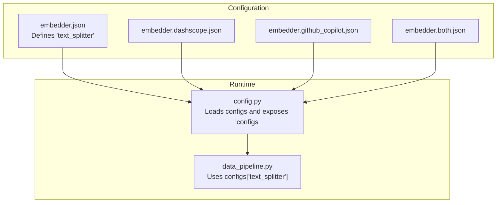
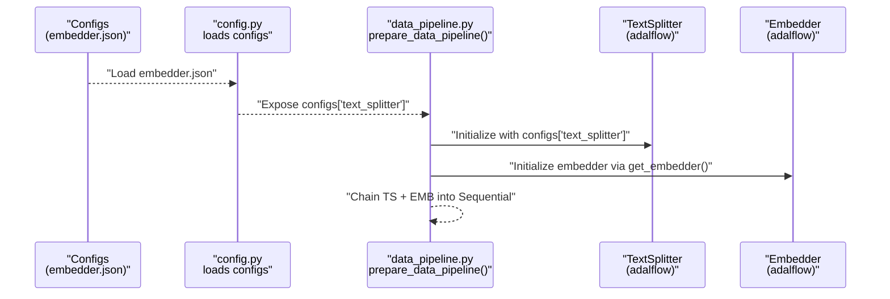
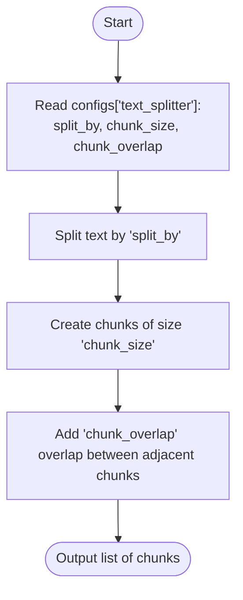
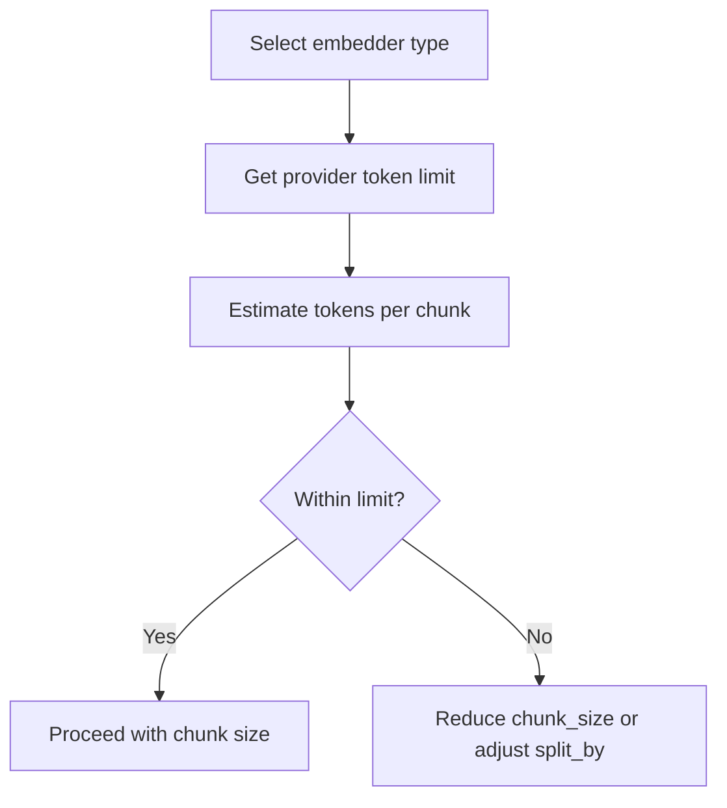
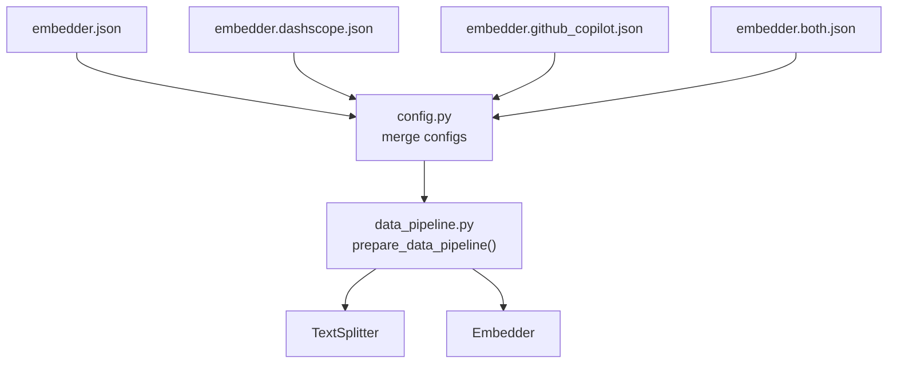

# TextSplitter Configuration and Chunking

<cite>
**Referenced Files in This Document**
- [data_pipeline.py](file://api/data_pipeline.py)
- [config.py](file://api/config.py)
- [embedder.json](file://api/config/embedder.json)
- [embedder.dashscope.json](file://api/config/embedder.dashscope.json)
- [embedder.github_copilot.json](file://api/config/embedder.github_copilot.json)
- [embedder.both.json](file://api/config/embedder.both.json)
</cite>

## Table of Contents
1. [Introduction](#introduction)
2. [Project Structure](#project-structure)
3. [Core Components](#core-components)
4. [Architecture Overview](#architecture-overview)
5. [Detailed Component Analysis](#detailed-component-analysis)
6. [Dependency Analysis](#dependency-analysis)
7. [Performance Considerations](#performance-considerations)
8. [Troubleshooting Guide](#troubleshooting-guide)
9. [Conclusion](#conclusion)

## Introduction
This document explains how the TextSplitter is configured and how it chunks documents for embedding generation. It covers initialization from configuration, the chunking algorithm, the relationship between chunk size and token limits, and how different embedder types influence optimal chunking parameters. It also provides practical guidance for customizing chunking behavior across repository types and content characteristics, along with performance and cost considerations.

## Project Structure
The TextSplitter configuration and chunking pipeline are primarily defined in the configuration files and orchestrated in the data pipeline module:
- Configuration files define the TextSplitter parameters under the "text_splitter" key.
- The data pipeline module loads these configurations and constructs the TextSplitter and embedding pipeline.

**Diagram sources**
- [embedder.json](file://api/config/embedder.json#L30-L34)
- [embedder.dashscope.json](file://api/config/embedder.dashscope.json#L14-L18)
- [embedder.github_copilot.json](file://api/config/embedder.github_copilot.json#L21-L25)
- [embedder.both.json](file://api/config/embedder.both.json#L30-L34)
- [config.py](file://api/config.py#L366-L368)
- [data_pipeline.py](file://api/data_pipeline.py#L431)

**Section sources**
- [embedder.json](file://api/config/embedder.json#L30-L34)
- [embedder.dashscope.json](file://api/config/embedder.dashscope.json#L14-L18)
- [embedder.github_copilot.json](file://api/config/embedder.github_copilot.json#L21-L25)
- [embedder.both.json](file://api/config/embedder.both.json#L30-L34)
- [config.py](file://api/config.py#L366-L368)
- [data_pipeline.py](file://api/data_pipeline.py#L431)

## Core Components
- TextSplitter configuration: The "text_splitter" object in the embedder configuration files defines:
  - split_by: The unit to split by (e.g., word).
  - chunk_size: Maximum number of units per chunk.
  - chunk_overlap: Number of units to overlap between adjacent chunks.
- Pipeline construction: The data pipeline module initializes the TextSplitter using configs["text_splitter"] and chains it with an embedding transformer.

Key implementation references:
- TextSplitter initialization: [data_pipeline.py](file://api/data_pipeline.py#L431)
- Configuration merging: [config.py](file://api/config.py#L366-L368)

**Section sources**
- [data_pipeline.py](file://api/data_pipeline.py#L431)
- [config.py](file://api/config.py#L366-L368)

## Architecture Overview
The chunking and embedding pipeline is constructed from configuration-driven components. The TextSplitter splits documents into chunks, and the embedding transformer converts chunks into vectors.

**Diagram sources**
- [embedder.json](file://api/config/embedder.json#L30-L34)
- [config.py](file://api/config.py#L366-L368)
- [data_pipeline.py](file://api/data_pipeline.py#L408-L450)

## Detailed Component Analysis

### TextSplitter Initialization and Parameters
- Initialization: The TextSplitter is instantiated with keyword arguments derived from configs["text_splitter"].
- Parameters:
  - split_by: Unit of splitting (e.g., word).
  - chunk_size: Size of each chunk.
  - chunk_overlap: Overlap between consecutive chunks.

Implementation reference:
- [data_pipeline.py](file://api/data_pipeline.py#L431)

Configuration examples:
- [embedder.json](file://api/config/embedder.json#L30-L34)
- [embedder.dashscope.json](file://api/config/embedder.dashscope.json#L14-L18)
- [embedder.github_copilot.json](file://api/config/embedder.github_copilot.json#L21-L25)
- [embedder.both.json](file://api/config/embedder.both.json#L30-L34)

**Section sources**
- [data_pipeline.py](file://api/data_pipeline.py#L431)
- [embedder.json](file://api/config/embedder.json#L30-L34)
- [embedder.dashscope.json](file://api/config/embedder.dashscope.json#L14-L18)
- [embedder.github_copilot.json](file://api/config/embedder.github_copilot.json#L21-L25)
- [embedder.both.json](file://api/config/embedder.both.json#L30-L34)

### Chunking Algorithm and Behavior
The TextSplitter uses the split_by parameter to segment text into chunks of size chunk_size with chunk_overlap overlaps. While the exact internal algorithm is provided by the underlying library, the effective behavior is:
- Split by the specified unit (e.g., word).
- Produce contiguous chunks up to chunk_size units.
- Introduce overlaps of chunk_overlap units between adjacent chunks.

This overlap helps preserve semantic continuity across chunk boundaries, which is beneficial for retrieval quality.

**Diagram sources**
- [data_pipeline.py](file://api/data_pipeline.py#L431)
- [embedder.json](file://api/config/embedder.json#L30-L34)

**Section sources**
- [data_pipeline.py](file://api/data_pipeline.py#L431)
- [embedder.json](file://api/config/embedder.json#L30-L34)

### Relationship Between Chunk Size and Token Limits
Different embedder providers have distinct token limits that influence optimal chunk sizes:
- OpenAI/GitHub Copilot: ~8192 tokens per request.
- Google: ~2048 tokens per request.
- DashScope/Qwen: ~2048 tokens per request.
- Ollama: conservative ~2048 tokens per request.

These limits guide chunk sizing to prevent exceeding provider constraints. The code includes token counting utilities and provider-specific token limits to help estimate chunk sizes safely.

Key references:
- Provider token limits: [data_pipeline.py](file://api/data_pipeline.py#L26-L32)
- Token counting function: [data_pipeline.py](file://api/data_pipeline.py#L61-L102)
- Embedder type detection: [config.py](file://api/config.py#L260-L274)

**Diagram sources**
- [data_pipeline.py](file://api/data_pipeline.py#L26-L32)
- [data_pipeline.py](file://api/data_pipeline.py#L61-L102)
- [config.py](file://api/config.py#L260-L274)

**Section sources**
- [data_pipeline.py](file://api/data_pipeline.py#L26-L32)
- [data_pipeline.py](file://api/data_pipeline.py#L61-L102)
- [config.py](file://api/config.py#L260-L274)

### How Different Embedder Types Affect Optimal Chunking
- OpenAI/GitHub Copilot: Higher token limits allow larger chunk_size with moderate overlap.
- Google/DashScope/Ollama: Lower token limits require smaller chunk_size and tighter overlap to stay within limits.
- Batch processing: Some embedders process in batches; chunk size indirectly affects throughput and memory usage.

References:
- Provider token limits: [data_pipeline.py](file://api/data_pipeline.py#L26-L32)
- Pipeline selection logic: [data_pipeline.py](file://api/data_pipeline.py#L408-L450)

**Section sources**
- [data_pipeline.py](file://api/data_pipeline.py#L26-L32)
- [data_pipeline.py](file://api/data_pipeline.py#L408-L450)

### Customizing Chunking for Different Repository Types and Content
- Code-heavy repositories:
  - Larger chunk_size may be acceptable due to higher token counts, but ensure individual files fit within provider limits.
  - Consider increased overlap to preserve function/class boundaries.
  - Reference: [data_pipeline.py](file://api/data_pipeline.py#L348-L353)
- Documentation-heavy repositories:
  - Smaller chunk_size with moderate overlap improves retrieval granularity.
  - Reference: [data_pipeline.py](file://api/data_pipeline.py#L383-L388)
- Mixed content:
  - Tune chunk_size and chunk_overlap to balance recall and precision; start from defaults and iterate.

References:
- File processing and token checks: [data_pipeline.py](file://api/data_pipeline.py#L348-L388)
- Default TextSplitter parameters: [embedder.json](file://api/config/embedder.json#L30-L34)

**Section sources**
- [data_pipeline.py](file://api/data_pipeline.py#L348-L388)
- [embedder.json](file://api/config/embedder.json#L30-L34)

### Practical Examples of Customization
- Increase chunk_size and reduce overlap for long-form documentation to minimize fragmentation.
  - Adjustments would be made in the "text_splitter" section of the embedder configuration file.
  - References: [embedder.json](file://api/config/embedder.json#L30-L34), [embedder.dashscope.json](file://api/config/embedder.dashscope.json#L14-L18)
- Reduce chunk_size and increase overlap for dense code comments or inline docstrings.
  - References: [embedder.github_copilot.json](file://api/config/embedder.github_copilot.json#L21-L25), [embedder.both.json](file://api/config/embedder.both.json#L30-L34)

**Section sources**
- [embedder.json](file://api/config/embedder.json#L30-L34)
- [embedder.dashscope.json](file://api/config/embedder.dashscope.json#L14-L18)
- [embedder.github_copilot.json](file://api/config/embedder.github_copilot.json#L21-L25)
- [embedder.both.json](file://api/config/embedder.both.json#L30-L34)

## Dependency Analysis
The TextSplitter pipeline depends on:
- Configuration loading: The embedder configuration files are merged into a single "configs" dictionary.
- Embedder selection: The pipeline selects an embedder based on the current embedder type.
- Token accounting: Token counting and provider limits inform safe chunk sizing.

**Diagram sources**
- [embedder.json](file://api/config/embedder.json#L30-L34)
- [embedder.dashscope.json](file://api/config/embedder.dashscope.json#L14-L18)
- [embedder.github_copilot.json](file://api/config/embedder.github_copilot.json#L21-L25)
- [embedder.both.json](file://api/config/embedder.both.json#L30-L34)
- [config.py](file://api/config.py#L366-L368)
- [data_pipeline.py](file://api/data_pipeline.py#L408-L450)

**Section sources**
- [config.py](file://api/config.py#L366-L368)
- [data_pipeline.py](file://api/data_pipeline.py#L408-L450)

## Performance Considerations
- Embedding costs: Larger chunk_size increases tokens per embedding request, raising costs. Smaller chunk_size increases the number of requests.
- Retrieval quality: Moderate overlap preserves context across boundaries; excessive overlap increases redundancy and storage.
- Throughput: Batch embedders process multiple chunks at once; chunk_size indirectly affects batching efficiency.
- Memory usage: Very large chunks or very small chunk_size can increase memory pressure during processing.

References:
- Provider token limits and token counting: [data_pipeline.py](file://api/data_pipeline.py#L26-L32), [data_pipeline.py](file://api/data_pipeline.py#L61-L102)
- Batch size configuration: [embedder.json](file://api/config/embedder.json#L4), [embedder.dashscope.json](file://api/config/embedder.dashscope.json#L20)

**Section sources**
- [data_pipeline.py](file://api/data_pipeline.py#L26-L32)
- [data_pipeline.py](file://api/data_pipeline.py#L61-L102)
- [embedder.json](file://api/config/embedder.json#L4)
- [embedder.dashscope.json](file://api/config/embedder.dashscope.json#L20)

## Troubleshooting Guide
- Exceeding token limits:
  - Symptom: Errors or warnings indicating token count exceeds provider limits.
  - Action: Reduce chunk_size or adjust split_by to produce shorter chunks.
  - References: [data_pipeline.py](file://api/data_pipeline.py#L348-L353), [data_pipeline.py](file://api/data_pipeline.py#L383-L388)
- Unexpectedly small chunks:
  - Symptom: Too many chunks generated.
  - Action: Increase chunk_size or decrease chunk_overlap.
  - References: [embedder.json](file://api/config/embedder.json#L30-L34)
- Poor retrieval quality:
  - Symptom: Relevant information split across chunk boundaries.
  - Action: Increase chunk_overlap moderately to preserve context.
  - References: [data_pipeline.py](file://api/data_pipeline.py#L431)

**Section sources**
- [data_pipeline.py](file://api/data_pipeline.py#L348-L353)
- [data_pipeline.py](file://api/data_pipeline.py#L383-L388)
- [embedder.json](file://api/config/embedder.json#L30-L34)
- [data_pipeline.py](file://api/data_pipeline.py#L431)

## Conclusion
The TextSplitter is configured via the "text_splitter" section in the embedder configuration files and is initialized in the data pipeline using configs["text_splitter"]. Optimal chunking balances provider token limits, retrieval quality, and cost. Start from the default parameters and iteratively adjust chunk_size and chunk_overlap based on repository content characteristics and embedder capabilities.