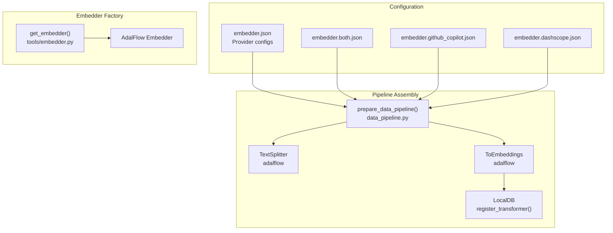
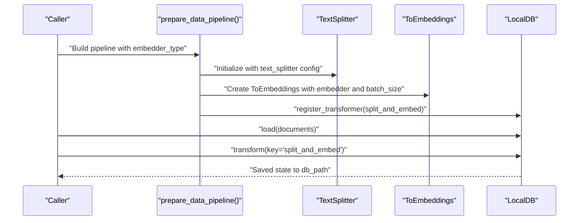
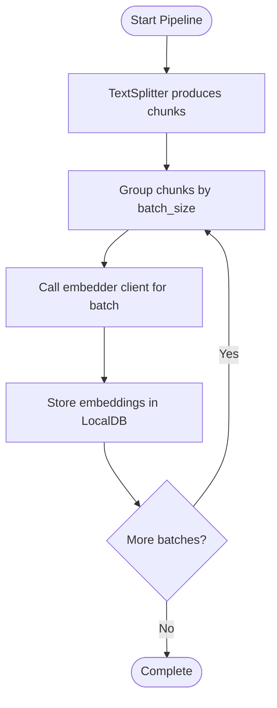
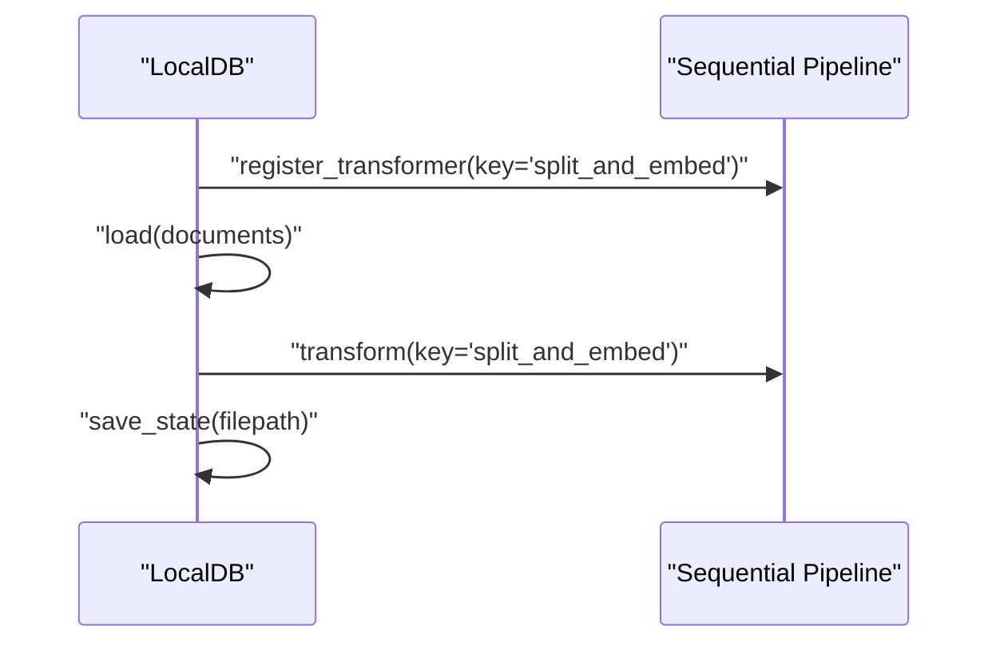
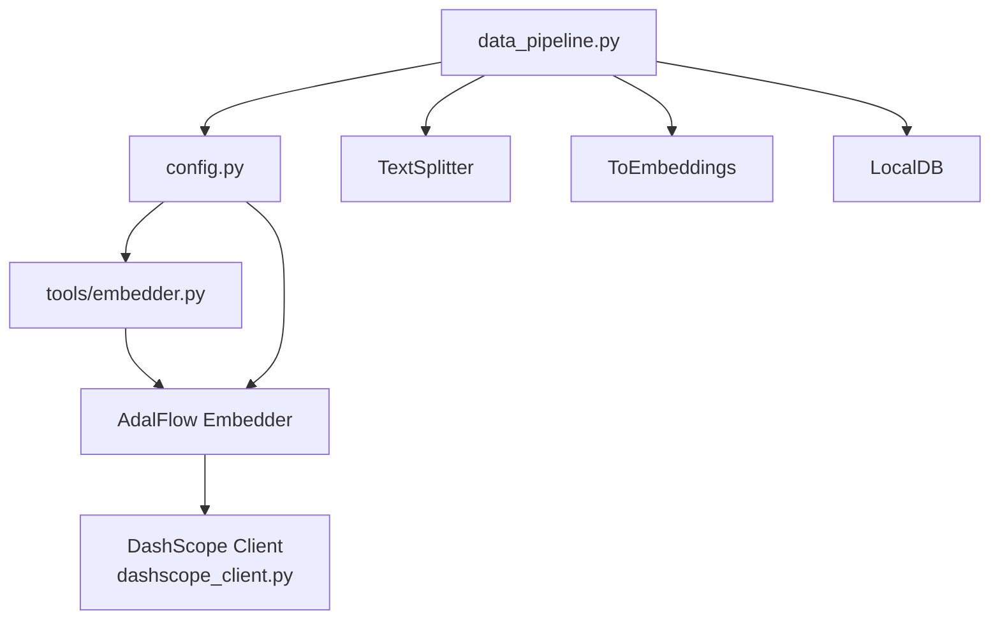

# ToEmbeddings Transformer and Batch Processing

<cite>
**Referenced Files in This Document**
- [data_pipeline.py](file://api/data_pipeline.py)
- [embedder.py](file://api/tools/embedder.py)
- [config.py](file://api/config.py)
- [embedder.json](file://api/config/embedder.json)
- [embedder.both.json](file://api/config/embedder.both.json)
- [embedder.github_copilot.json](file://api/config/embedder.github_copilot.json)
- [embedder.dashscope.json](file://api/config/embedder.dashscope.json)
- [dashscope_client.py](file://api/dashscope_client.py)
- [test_all_embedders.py](file://tests/unit/test_all_embedders.py)
</cite>

## Table of Contents
1. [Introduction](#introduction)
2. [Project Structure](#project-structure)
3. [Core Components](#core-components)
4. [Architecture Overview](#architecture-overview)
5. [Detailed Component Analysis](#detailed-component-analysis)
6. [Dependency Analysis](#dependency-analysis)
7. [Performance Considerations](#performance-considerations)
8. [Troubleshooting Guide](#troubleshooting-guide)
9. [Conclusion](#conclusion)

## Introduction
This document explains the ToEmbeddings transformer component used for batch processing embeddings in the repository. It covers how batch processing is configured and optimized for OpenAI and Google embedders, how the transformer is registered with LocalDB, and how it chains with TextSplitter. It also documents the batch processing workflow, error handling for failed embeddings, retry mechanisms, and practical guidance for customizing batch sizes based on provider limitations and memory constraints. Finally, it provides performance optimization tips and monitoring strategies for embedding generation progress.

## Project Structure
The ToEmbeddings transformer sits within the data processing pipeline that prepares documents, splits them into chunks, and generates embeddings in batches. The pipeline is assembled in the data pipeline module and uses configuration-driven embedder selection.

**Diagram sources**
- [data_pipeline.py](file://api/data_pipeline.py#L408-L450)
- [embedder.py](file://api/tools/embedder.py#L6-L58)
- [embedder.json](file://api/config/embedder.json#L1-L35)

**Section sources**
- [data_pipeline.py](file://api/data_pipeline.py#L408-L450)
- [embedder.py](file://api/tools/embedder.py#L6-L58)
- [embedder.json](file://api/config/embedder.json#L1-L35)

## Core Components
- ToEmbeddings transformer: A batch-capable transformer that applies an embedder to chunks of text produced by TextSplitter. It is constructed with a configurable batch_size and integrated into a sequential pipeline.
- TextSplitter: Splits input documents into manageable chunks before embedding. Its parameters (split_by, chunk_size, chunk_overlap) are configured centrally.
- Embedder factory: Selects and constructs the appropriate embedder client based on configuration, including provider-specific batch_size defaults.
- LocalDB registration: The assembled pipeline is registered with LocalDB under a key ("split_and_embed") for load-transform-save lifecycle.

Key behaviors:
- Batch size defaults vary by provider (e.g., OpenAI/GitHub Copilot default 100; DashScope default 25).
- For OpenAI and Google embedders, ToEmbeddings is used for batch processing; for Ollama, a specialized processor is used instead.
- The pipeline is chained: TextSplitter → ToEmbeddings → LocalDB storage.

**Section sources**
- [data_pipeline.py](file://api/data_pipeline.py#L408-L450)
- [data_pipeline.py](file://api/data_pipeline.py#L441-L445)
- [embedder.py](file://api/tools/embedder.py#L6-L58)
- [embedder.json](file://api/config/embedder.json#L4-L4)
- [embedder.dashscope.json](file://api/config/embedder.dashscope.json#L4-L4)

## Architecture Overview
The end-to-end workflow for preparing and persisting embeddings:

**Diagram sources**
- [data_pipeline.py](file://api/data_pipeline.py#L408-L450)
- [data_pipeline.py](file://api/data_pipeline.py#L452-L476)

## Detailed Component Analysis

### ToEmbeddings Transformer and Batch Processing
- Construction: The pipeline creates ToEmbeddings with an embedder instance and a batch_size taken from the selected embedder configuration. If not provided, a default of 500 is used in the pipeline assembly for non-Ollama providers.
- Operation: ToEmbeddings processes inputs in batches, delegating to the underlying embedder client. Provider-specific constraints are enforced by the client (e.g., DashScope caps batch size at 25).
- Chaining: The transformer is chained after TextSplitter in the sequential pipeline.

**Diagram sources**
- [data_pipeline.py](file://api/data_pipeline.py#L441-L445)
- [dashscope_client.py](file://api/dashscope_client.py#L726-L732)
- [dashscope_client.py](file://api/dashscope_client.py#L766-L791)

**Section sources**
- [data_pipeline.py](file://api/data_pipeline.py#L441-L445)
- [dashscope_client.py](file://api/dashscope_client.py#L726-L732)
- [dashscope_client.py](file://api/dashscope_client.py#L766-L791)

### Transformer Registration with LocalDB
- Registration: The assembled sequential transformer is registered with LocalDB using a key ("split_and_embed").
- Lifecycle: Documents are loaded, transformed, and saved to disk. This enables reuse and persistence of computed embeddings.

**Diagram sources**
- [data_pipeline.py](file://api/data_pipeline.py#L452-L476)

**Section sources**
- [data_pipeline.py](file://api/data_pipeline.py#L452-L476)

### Sequential Chaining with TextSplitter
- TextSplitter parameters are loaded from configuration and applied before embedding.
- Chunk size and overlap influence batch composition and memory usage.

**Section sources**
- [data_pipeline.py](file://api/data_pipeline.py#L431-L431)
- [embedder.json](file://api/config/embedder.json#L30-L34)

### Batch Size Defaults and Provider-Specific Constraints
- OpenAI/GitHub Copilot: Default batch_size is 100 in configuration.
- DashScope: Default batch_size is 25 in configuration; the client enforces a maximum of 25 and logs a warning if a larger value is requested.
- General fallback: The pipeline uses 500 if no batch_size is specified for non-Ollama providers.

Practical guidance:
- Adjust batch_size according to provider limits and memory headroom.
- For DashScope, keep batch_size ≤ 25.
- Monitor GPU/CPU memory usage and reduce batch_size if encountering out-of-memory conditions.

**Section sources**
- [embedder.json](file://api/config/embedder.json#L4-L4)
- [embedder.dashscope.json](file://api/config/embedder.dashscope.json#L4-L4)
- [dashscope_client.py](file://api/dashscope_client.py#L730-L732)
- [data_pipeline.py](file://api/data_pipeline.py#L442-L442)

### Error Handling and Retry Mechanisms
Observed behaviors:
- DashScope batch embedder logs failures per batch and continues processing subsequent batches. It warns when no embedding data is returned and logs exceptions encountered during batch processing.
- The pipeline itself delegates error handling to the underlying embedder client; no explicit retry loop is implemented in the pipeline assembly.

Recommendations:
- Implement retries around batch calls if your deployment requires high reliability.
- Consider exponential backoff and jitter for transient network errors.
- Separate successful and failed embeddings for auditing and targeted retries.

**Section sources**
- [dashscope_client.py](file://api/dashscope_client.py#L784-L791)

### Customizing Batch Sizes Based on Provider Limitations and Memory Constraints
Examples from configuration:
- OpenAI/GitHub Copilot: batch_size 100.
- DashScope: batch_size 25.
- General fallback in pipeline: 500 for non-Ollama providers.

Guidance:
- Start with provider defaults and adjust downward if you encounter rate limits or memory pressure.
- For constrained environments, reduce batch_size incrementally until stable.
- Validate with small datasets first to confirm throughput and stability.

**Section sources**
- [embedder.json](file://api/config/embedder.json#L4-L4)
- [embedder.dashscope.json](file://api/config/embedder.dashscope.json#L4-L4)
- [data_pipeline.py](file://api/data_pipeline.py#L442-L442)

### Monitoring Embedding Generation Progress
Observed logging patterns:
- DashScope batch embedder logs the total number of texts and the effective batch size at the start of processing.
- Per-batch logs indicate success counts and warnings for empty results or failures.

Recommendations:
- Enable INFO-level logs to track progress.
- Aggregate per-batch logs to compute throughput (embeddings per second).
- Correlate logs with memory metrics to identify bottlenecks.

**Section sources**
- [dashscope_client.py](file://api/dashscope_client.py#L766-L766)

## Dependency Analysis
The ToEmbeddings pipeline depends on configuration-driven embedder selection and provider-specific clients. The following diagram shows key dependencies:

**Diagram sources**
- [data_pipeline.py](file://api/data_pipeline.py#L408-L450)
- [config.py](file://api/config.py#L170-L181)
- [embedder.py](file://api/tools/embedder.py#L6-L58)
- [dashscope_client.py](file://api/dashscope_client.py#L726-L732)

**Section sources**
- [data_pipeline.py](file://api/data_pipeline.py#L408-L450)
- [config.py](file://api/config.py#L170-L181)
- [embedder.py](file://api/tools/embedder.py#L6-L58)
- [dashscope_client.py](file://api/dashscope_client.py#L726-L732)

## Performance Considerations
- Batch size tuning: Larger batches increase throughput but require more memory. Use provider defaults as starting points and adjust based on observed resource utilization.
- Chunk sizing: TextSplitter chunk_size and chunk_overlap impact the number of batches and memory footprint. Tune to balance recall and performance.
- Provider constraints: Respect provider-imposed limits (e.g., DashScope max 25) to avoid errors and wasted retries.
- Memory monitoring: Track GPU/CPU memory during batch processing and reduce batch_size if needed.
- Concurrency: If your embedder client supports concurrent batch calls, coordinate with thread/process pools to maximize throughput while respecting provider rate limits.

[No sources needed since this section provides general guidance]

## Troubleshooting Guide
Common issues and remedies:
- Out-of-memory errors: Reduce batch_size to fit within available memory.
- Rate limiting or provider errors: Implement retries with backoff; monitor logs for transient failures.
- Unexpected empty results: Verify input token counts and provider limits; consider splitting oversized inputs.
- Logging progress: Enable INFO logs to observe batch-level progress and outcomes.

Validation references:
- Embedder configuration loading and type detection are validated in unit tests.
- Pipeline construction and token counting are covered by tests.

**Section sources**
- [test_all_embedders.py](file://tests/unit/test_all_embedders.py#L84-L138)
- [test_all_embedders.py](file://tests/unit/test_all_embedders.py#L237-L279)

## Conclusion
The ToEmbeddings transformer provides efficient, configurable batch processing for generating embeddings across providers. By leveraging provider-specific configurations, enforcing constraints at the client level, and integrating with LocalDB, the system achieves scalable and reliable embedding generation. Tuning batch_size, monitoring progress, and implementing robust error handling are essential for production deployments.