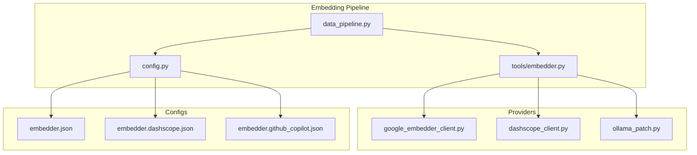
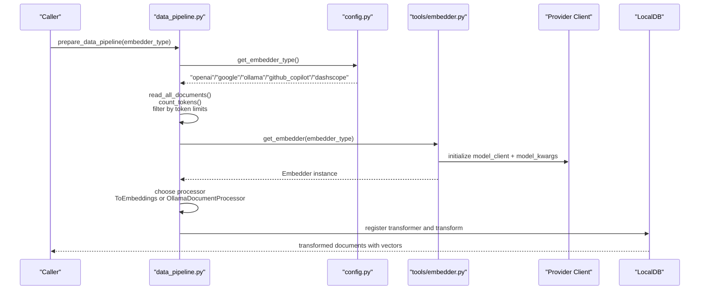
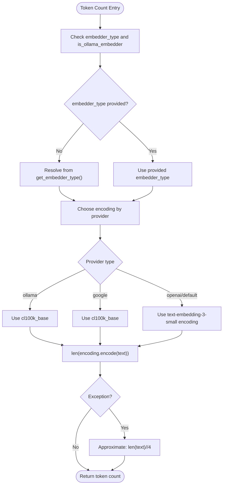
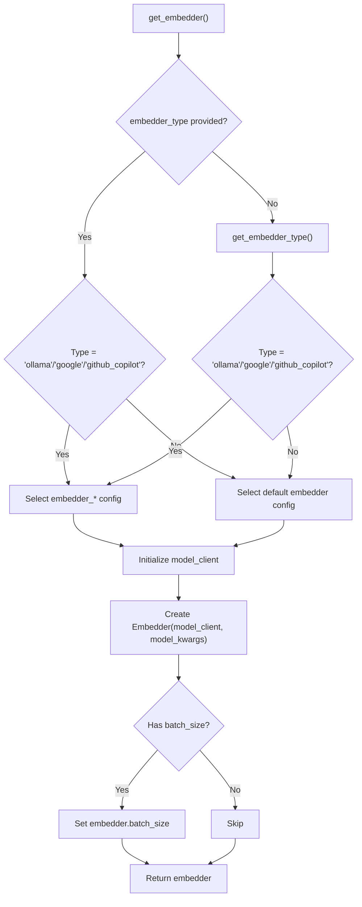
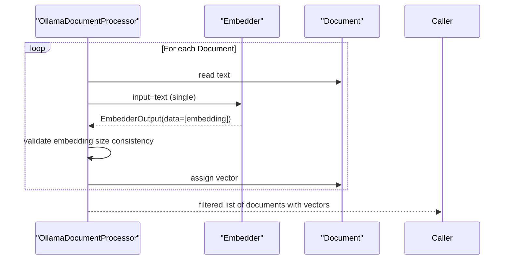
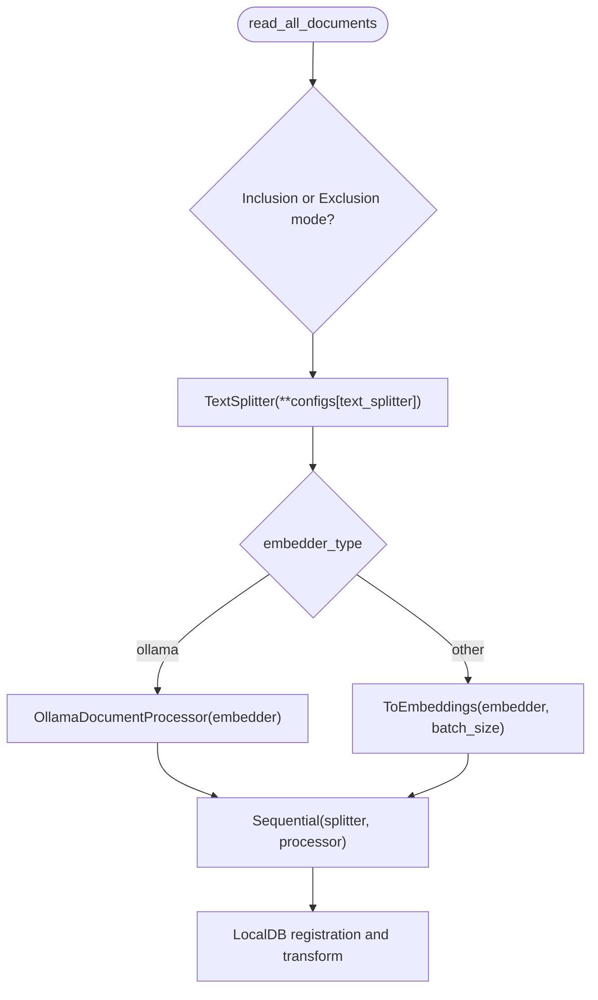
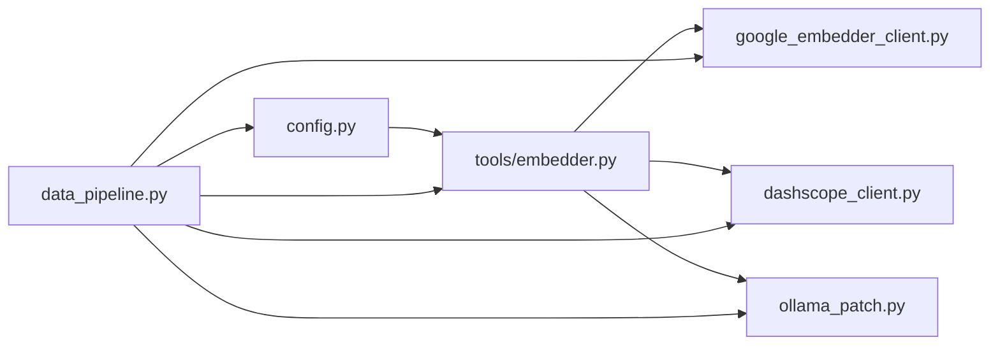

# Provider-Specific Processing

<cite>
**Referenced Files in This Document**
- [data_pipeline.py](file://api/data_pipeline.py)
- [embedder.py](file://api/tools/embedder.py)
- [config.py](file://api/config.py)
- [google_embedder_client.py](file://api/google_embedder_client.py)
- [ollama_patch.py](file://api/ollama_patch.py)
- [dashscope_client.py](file://api/dashscope_client.py)
- [embedder.json](file://api/config/embedder.json)
- [embedder.dashscope.json](file://api/config/embedder.dashscope.json)
- [embedder.github_copilot.json](file://api/config/embedder.github_copilot.json)
- [test_provider_token_limits.py](file://tests/unit/test_provider_token_limits.py)
</cite>

## Table of Contents
1. [Introduction](#introduction)
2. [Project Structure](#project-structure)
3. [Core Components](#core-components)
4. [Architecture Overview](#architecture-overview)
5. [Detailed Component Analysis](#detailed-component-analysis)
6. [Dependency Analysis](#dependency-analysis)
7. [Performance Considerations](#performance-considerations)
8. [Troubleshooting Guide](#troubleshooting-guide)
9. [Conclusion](#conclusion)

## Introduction
This document explains provider-specific optimizations for document embedding processing. It covers:
- Embedding token limit system per provider
- Token counting using tiktoken with provider-specific encodings
- Backward compatibility handling for deprecated parameters
- Automatic embedder type detection
- Provider-specific optimizations including batch sizing and single-document processing for Ollama
- Practical configuration examples and performance guidance

## Project Structure
Key modules involved in provider-specific document processing:
- Data pipeline and token handling: api/data_pipeline.py
- Embedder factory and configuration: api/tools/embedder.py, api/config.py, api/config/embedder*.json
- Provider-specific clients: api/google_embedder_client.py, api/dashscope_client.py
- Ollama-specific processing: api/ollama_patch.py

**Diagram sources**
- [data_pipeline.py](file://api/data_pipeline.py#L1-L120)
- [config.py](file://api/config.py#L1-L120)
- [embedder.py](file://api/tools/embedder.py#L1-L59)
- [google_embedder_client.py](file://api/google_embedder_client.py#L1-L60)
- [dashscope_client.py](file://api/dashscope_client.py#L1-L120)
- [ollama_patch.py](file://api/ollama_patch.py#L1-L40)
- [embedder.json](file://api/config/embedder.json#L1-L35)
- [embedder.dashscope.json](file://api/config/embedder.dashscope.json#L1-L19)
- [embedder.github_copilot.json](file://api/config/embedder.github_copilot.json#L1-L26)

**Section sources**
- [data_pipeline.py](file://api/data_pipeline.py#L1-L120)
- [config.py](file://api/config.py#L1-L120)
- [embedder.py](file://api/tools/embedder.py#L1-L59)

## Core Components
- Token limit system: provider-specific limits are centralized and enforced during document ingestion.
- Token counting: tiktoken-based counting with provider-specific encodings and fallbacks.
- Embedder factory: selects provider configuration and initializes the embedder with batch size and model parameters.
- Provider clients: Google and DashScope clients implement provider-specific embedding calls and response parsing.
- Ollama processing: single-document processing adapter due to lack of native batch support.

**Section sources**
- [data_pipeline.py](file://api/data_pipeline.py#L25-L102)
- [embedder.py](file://api/tools/embedder.py#L6-L58)
- [google_embedder_client.py](file://api/google_embedder_client.py#L20-L140)
- [dashscope_client.py](file://api/dashscope_client.py#L115-L190)
- [ollama_patch.py](file://api/ollama_patch.py#L62-L105)

## Architecture Overview
End-to-end flow for provider-aware embedding:
- Detect embedder type from configuration
- Count tokens per document using provider-specific encodings
- Filter documents exceeding provider token limits
- Build a pipeline with TextSplitter and ToEmbeddings (or OllamaDocumentProcessor)
- Apply provider-specific batch sizes and constraints

**Diagram sources**
- [data_pipeline.py](file://api/data_pipeline.py#L408-L450)
- [config.py](file://api/config.py#L260-L275)
- [embedder.py](file://api/tools/embedder.py#L6-L58)
- [google_embedder_client.py](file://api/google_embedder_client.py#L20-L140)
- [dashscope_client.py](file://api/dashscope_client.py#L115-L190)
- [ollama_patch.py](file://api/ollama_patch.py#L62-L105)

## Detailed Component Analysis

### Token Limit System and Token Counting
- Provider-specific token limits are defined centrally and enforced during document ingestion.
- Token counting uses tiktoken with provider-specific encodings and a fallback approximation.
- Backward compatibility is maintained for deprecated parameters.

**Diagram sources**
- [data_pipeline.py](file://api/data_pipeline.py#L61-L102)

**Section sources**
- [data_pipeline.py](file://api/data_pipeline.py#L25-L102)
- [test_provider_token_limits.py](file://tests/unit/test_provider_token_limits.py#L18-L86)

### Embedder Factory and Automatic Type Detection
- The embedder factory selects the correct configuration based on explicit type or auto-detection.
- Batch size is applied from configuration for non-Ollama providers.
- Deprecated parameters are handled for backward compatibility.

**Diagram sources**
- [embedder.py](file://api/tools/embedder.py#L6-L58)
- [config.py](file://api/config.py#L183-L275)

**Section sources**
- [embedder.py](file://api/tools/embedder.py#L6-L58)
- [config.py](file://api/config.py#L183-L275)

### Provider-Specific Optimizations

#### Google Embedder Client
- Supports single or batch embeddings via the Google AI API.
- Robust response parsing for multiple formats.
- Uses provider-specific encodings for token counting.

**Section sources**
- [google_embedder_client.py](file://api/google_embedder_client.py#L20-L140)
- [data_pipeline.py](file://api/data_pipeline.py#L86-L96)

#### DashScope (Alibaba Cloud) Client
- Implements OpenAI-compatible embeddings with workspace headers.
- Provides a batch embedder with a provider-imposed cap.
- Includes caching for embeddings.

**Section sources**
- [dashscope_client.py](file://api/dashscope_client.py#L115-L190)
- [dashscope_client.py](file://api/dashscope_client.py#L724-L820)
- [dashscope_client.py](file://api/dashscope_client.py#L822-L917)

#### Ollama Embedder Optimization
- Ollama does not support batch embeddings in the underlying client.
- A dedicated processor performs single-document processing with validation and progress tracking.

**Diagram sources**
- [ollama_patch.py](file://api/ollama_patch.py#L62-L105)

**Section sources**
- [ollama_patch.py](file://api/ollama_patch.py#L62-L105)

### Data Pipeline Integration
- Document ingestion counts tokens per provider and filters oversized files.
- Builds a sequential pipeline with TextSplitter and either ToEmbeddings or OllamaDocumentProcessor.
- Applies provider-specific batch sizes and constraints.

**Diagram sources**
- [data_pipeline.py](file://api/data_pipeline.py#L408-L450)
- [data_pipeline.py](file://api/data_pipeline.py#L348-L406)

**Section sources**
- [data_pipeline.py](file://api/data_pipeline.py#L348-L450)

## Dependency Analysis
- Centralized configuration mapping and environment resolution in config.py.
- Provider-specific model clients injected by the embedder factory.
- Token limits and counting are decoupled from provider clients and used at the data ingestion stage.

**Diagram sources**
- [config.py](file://api/config.py#L1-L120)
- [embedder.py](file://api/tools/embedder.py#L1-L59)
- [google_embedder_client.py](file://api/google_embedder_client.py#L1-L60)
- [dashscope_client.py](file://api/dashscope_client.py#L1-L120)
- [ollama_patch.py](file://api/ollama_patch.py#L1-L40)
- [data_pipeline.py](file://api/data_pipeline.py#L1-L120)

**Section sources**
- [config.py](file://api/config.py#L1-L120)
- [embedder.py](file://api/tools/embedder.py#L1-L59)
- [data_pipeline.py](file://api/data_pipeline.py#L1-L120)

## Performance Considerations
- Batch sizing
  - OpenAI/GitHub Copilot: batch size from configuration
  - DashScope: batch size capped at provider limit
  - Ollama: single-document processing due to client constraints
- Token limit enforcement
  - Prevents oversized inputs that would fail provider APIs
  - Reduces wasted compute and network calls
- Caching
  - DashScope batch embedder caches embeddings to disk for reuse

**Section sources**
- [embedder.json](file://api/config/embedder.json#L18-L26)
- [embedder.dashscope.json](file://api/config/embedder.dashscope.json#L1-L19)
- [dashscope_client.py](file://api/dashscope_client.py#L724-L820)
- [data_pipeline.py](file://api/data_pipeline.py#L348-L406)

## Troubleshooting Guide
- Unsupported provider type
  - Symptom: ValueError when requesting token limit for unknown provider
  - Action: Verify embedder type or configuration
- Token counting failures
  - Symptom: Fallback approximation used
  - Action: Ensure tiktoken is available; review text encoding expectations
- Ollama model availability
  - Symptom: Processing skips documents or raises model-not-found errors
  - Action: Verify model existence via model check utility; confirm host configuration
- DashScope batch constraints
  - Symptom: Batch size silently adjusted to provider limit
  - Action: Respect the enforced cap; adjust workload accordingly

**Section sources**
- [data_pipeline.py](file://api/data_pipeline.py#L55-L58)
- [data_pipeline.py](file://api/data_pipeline.py#L96-L102)
- [ollama_patch.py](file://api/ollama_patch.py#L21-L61)
- [dashscope_client.py](file://api/dashscope_client.py#L724-L734)

## Conclusion
The system provides robust, provider-aware document embedding processing:
- Centralized token limits and counting with provider-specific encodings
- Automatic embedder selection and configuration
- Provider-specific optimizations (batching, single-document processing, caching)
- Backward compatibility for legacy parameters
These mechanisms ensure reliable, efficient, and constraint-aware embedding across providers.