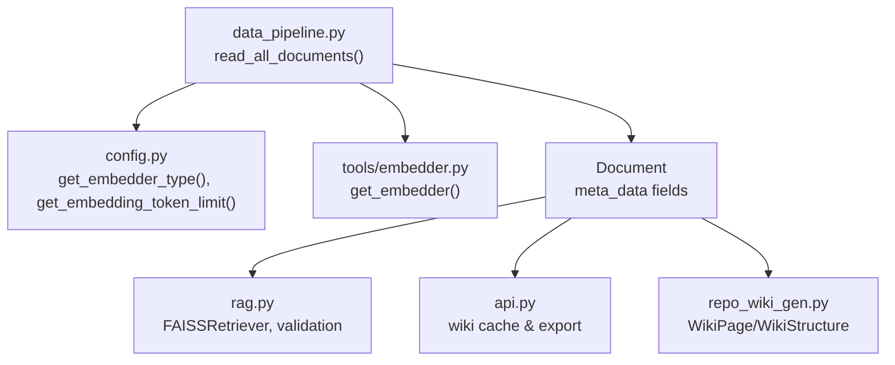
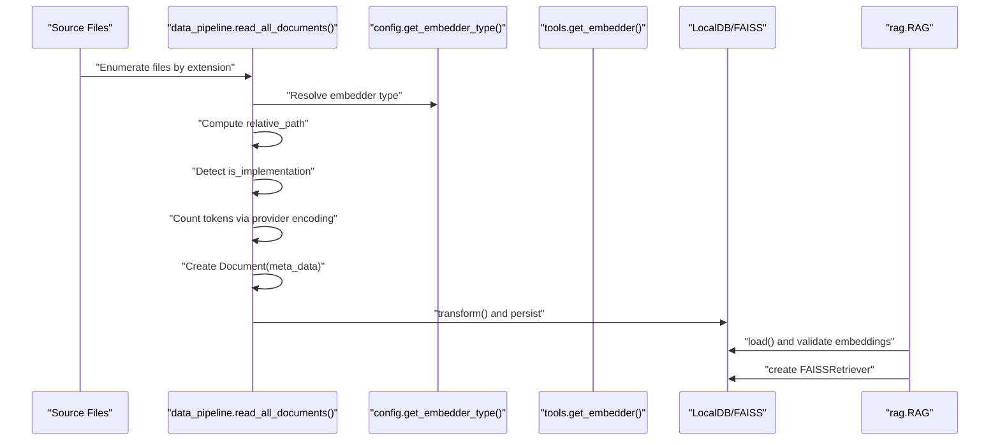
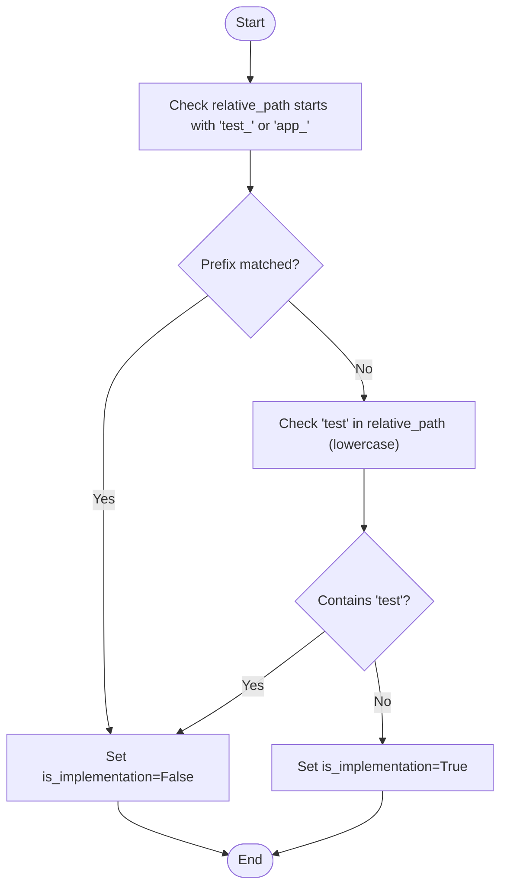
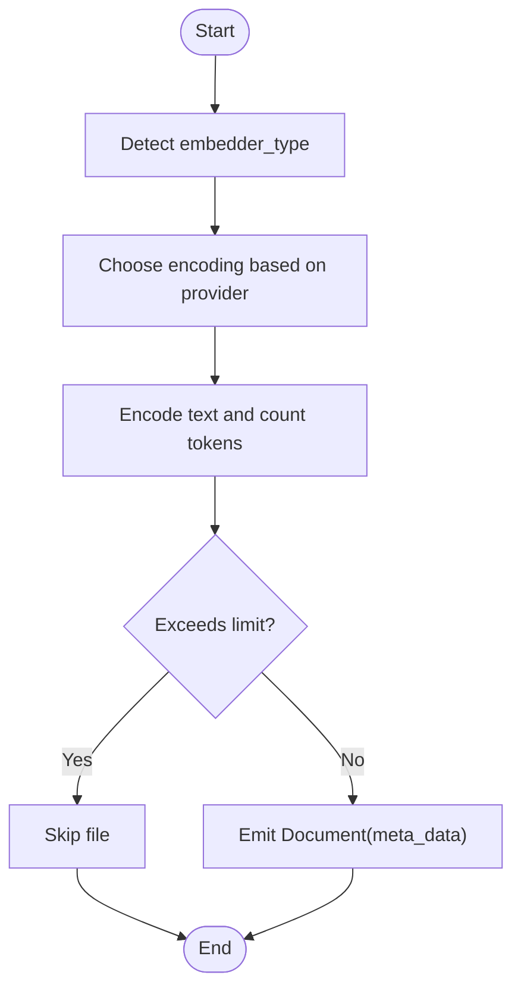
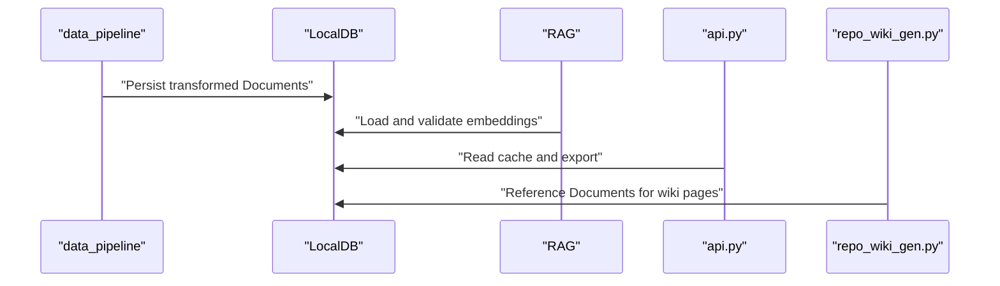
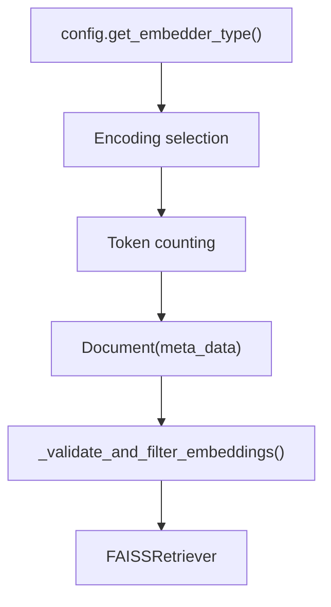

# Document Metadata Generation

<cite>
**Referenced Files in This Document**
- [data_pipeline.py](file://api/data_pipeline.py)
- [config.py](file://api/config.py)
- [tools/embedder.py](file://api/tools/embedder.py)
- [rag.py](file://api/rag.py)
- [api.py](file://api/api.py)
- [repo_wiki_gen.py](file://api/repo_wiki_gen.py)
</cite>

## Table of Contents
1. [Introduction](#introduction)
2. [Project Structure](#project-structure)
3. [Core Components](#core-components)
4. [Architecture Overview](#architecture-overview)
5. [Detailed Component Analysis](#detailed-component-analysis)
6. [Dependency Analysis](#dependency-analysis)
7. [Performance Considerations](#performance-considerations)
8. [Troubleshooting Guide](#troubleshooting-guide)
9. [Conclusion](#conclusion)

## Introduction
This document explains how document metadata is generated during file processing. It focuses on the Document object structure, the meta_data fields (including file_path, type, is_code, is_implementation, title, and token_count), the implementation detection algorithm, relative path computation, file type extraction, and metadata consistency across file types. It also covers how metadata supports downstream processing (RAG retrieval and wiki generation), validation and error handling for unreadable files, and performance considerations for metadata generation.

## Project Structure
The metadata generation pipeline is primarily implemented in the data processing module and integrates with configuration, embedding, and downstream components:
- Data ingestion and metadata assembly: api/data_pipeline.py
- Configuration and provider selection: api/config.py and api/tools/embedder.py
- Downstream consumers: api/rag.py (RAG retrieval), api/api.py (wiki cache and exports), api/repo_wiki_gen.py (wiki structure and pages)

**Diagram sources**
- [data_pipeline.py](file://api/data_pipeline.py#L177-L406)
- [config.py](file://api/config.py#L260-L275)
- [tools/embedder.py](file://api/tools/embedder.py#L6-L59)
- [rag.py](file://api/rag.py#L345-L415)
- [api.py](file://api/api.py#L405-L539)
- [repo_wiki_gen.py](file://api/repo_wiki_gen.py#L28-L50)

**Section sources**
- [data_pipeline.py](file://api/data_pipeline.py#L177-L406)
- [config.py](file://api/config.py#L260-L275)
- [tools/embedder.py](file://api/tools/embedder.py#L6-L59)
- [rag.py](file://api/rag.py#L345-L415)
- [api.py](file://api/api.py#L405-L539)
- [repo_wiki_gen.py](file://api/repo_wiki_gen.py#L28-L50)

## Core Components
- Document creation and meta_data population:
  - Reads files recursively, computes relative paths, infers types from extensions, counts tokens, and sets flags for code vs documentation and implementation detection.
- Implementation detection algorithm:
  - Flags a file as implementation if it is not a test/app-related prefix and does not contain “test” in the path.
- Relative path calculation:
  - Uses the repository root as the base to compute relative paths for deterministic, portable metadata.
- File type extraction:
  - Extracts type from extension (without the leading dot).
- Token counting:
  - Uses provider-aware tokenization to estimate token_count for downstream embedding and retrieval.
- Downstream processing:
  - RAG validation ensures consistent embedding sizes and filters invalid documents.
  - Wiki cache and export rely on metadata for navigation and presentation.

**Section sources**
- [data_pipeline.py](file://api/data_pipeline.py#L328-L406)
- [rag.py](file://api/rag.py#L251-L343)

## Architecture Overview
The metadata generation pipeline follows a staged flow: discovery, filtering, reading, metadata assembly, and downstream transformation.

**Diagram sources**
- [data_pipeline.py](file://api/data_pipeline.py#L177-L406)
- [config.py](file://api/config.py#L260-L275)
- [tools/embedder.py](file://api/tools/embedder.py#L6-L59)
- [rag.py](file://api/rag.py#L345-L415)

## Detailed Component Analysis

### Document Object and meta_data Fields
- Fields populated for each Document:
  - file_path: relative path from repository root
  - type: file extension without leading dot (e.g., py, js, ts, md)
  - is_code: True for code files, False for docs
  - is_implementation: computed heuristic excluding test/app prefixes and “test” in path
  - title: set to the relative path string
  - token_count: estimated token count using provider-aware encoding

These fields are consistently set for both code and documentation files, ensuring uniform downstream processing.

**Section sources**
- [data_pipeline.py](file://api/data_pipeline.py#L355-L366)
- [data_pipeline.py](file://api/data_pipeline.py#L390-L401)

### Implementation Detection Algorithm
- A file is considered an implementation file if:
  - Its relative path does not start with test_ or app_
  - Its relative path does not contain test (case-insensitive)
- This heuristic helps RAG and wiki generation focus on core logic rather than tests or scaffolding.

**Diagram sources**
- [data_pipeline.py](file://api/data_pipeline.py#L341-L347)

**Section sources**
- [data_pipeline.py](file://api/data_pipeline.py#L341-L347)

### Relative Path Calculation and File Type Extraction
- Relative path:
  - Computed using the repository root as the base, ensuring deterministic and portable metadata regardless of absolute paths.
- File type:
  - Extracted from the file extension by slicing off the leading dot.

These steps guarantee consistent meta_data across diverse repository layouts and file types.

**Section sources**
- [data_pipeline.py](file://api/data_pipeline.py#L339-L340)
- [data_pipeline.py](file://api/data_pipeline.py#L359)
- [data_pipeline.py](file://api/data_pipeline.py#L394)

### Token Counting and Limits
- Token counting:
  - Uses provider-aware encoding to estimate token_count.
  - Includes a fallback strategy if encoding fails.
- Provider-specific limits:
  - Enforces per-provider token limits; code files allow a higher tolerance compared to documentation files.

**Diagram sources**
- [data_pipeline.py](file://api/data_pipeline.py#L61-L102)
- [data_pipeline.py](file://api/data_pipeline.py#L348-L353)
- [data_pipeline.py](file://api/data_pipeline.py#L383-L388)

**Section sources**
- [data_pipeline.py](file://api/data_pipeline.py#L61-L102)
- [data_pipeline.py](file://api/data_pipeline.py#L348-L353)
- [data_pipeline.py](file://api/data_pipeline.py#L383-L388)

### Metadata Consistency Across File Types
- Both code and documentation files receive the same meta_data schema, differing only in is_code and is_implementation flags and token_count thresholds.
- This uniformity enables downstream components (RAG, wiki cache, and exports) to treat all Documents consistently.

**Section sources**
- [data_pipeline.py](file://api/data_pipeline.py#L355-L401)

### Examples of Generated Metadata
Below are representative examples of meta_data produced for different file types. These examples illustrate how fields vary by file type and whether the file is detected as implementation.

- Python source file (implementation)
  - file_path: src/utils/getRepoUrl.tsx
  - type: tsx
  - is_code: True
  - is_implementation: True
  - title: src/utils/getRepoUrl.tsx
  - token_count: estimated based on provider encoding

- Markdown documentation
  - file_path: README.md
  - type: md
  - is_code: False
  - is_implementation: False
  - title: README.md
  - token_count: estimated based on provider encoding

- JSON configuration
  - file_path: package.json
  - type: json
  - is_code: False
  - is_implementation: False
  - title: package.json
  - token_count: estimated based on provider encoding

- Test file (non-implementation)
  - file_path: tests/unit/test_all_embedders.py
  - type: py
  - is_code: True
  - is_implementation: False
  - title: tests/unit/test_all_embedders.py
  - token_count: estimated based on provider encoding

- App scaffolding (non-implementation)
  - file_path: app/page.tsx
  - type: tsx
  - is_code: True
  - is_implementation: False
  - title: app/page.tsx
  - token_count: estimated based on provider encoding

Note: token_count values depend on the provider’s encoding and the file content length.

**Section sources**
- [data_pipeline.py](file://api/data_pipeline.py#L341-L347)
- [data_pipeline.py](file://api/data_pipeline.py#L355-L401)

### Relationship Between file_path and title
- The title is set to the relative_path string. This ensures:
  - Deterministic and human-readable titles
  - Consistent linking and navigation in downstream outputs (e.g., wiki exports)

**Section sources**
- [data_pipeline.py](file://api/data_pipeline.py#L362)
- [data_pipeline.py](file://api/data_pipeline.py#L397)

### How Metadata Supports Downstream Processing
- RAG retrieval:
  - Validates embedding vectors and filters documents with inconsistent sizes.
  - Uses meta_data (e.g., file_path) for diagnostics and filtering.
- Wiki cache and export:
  - Uses meta_data to populate cache keys and page metadata.
  - Exports metadata alongside pages for reproducibility.

**Diagram sources**
- [data_pipeline.py](file://api/data_pipeline.py#L452-L476)
- [rag.py](file://api/rag.py#L251-L343)
- [api.py](file://api/api.py#L405-L539)
- [repo_wiki_gen.py](file://api/repo_wiki_gen.py#L28-L50)

**Section sources**
- [rag.py](file://api/rag.py#L251-L343)
- [api.py](file://api/api.py#L405-L539)
- [repo_wiki_gen.py](file://api/repo_wiki_gen.py#L28-L50)

## Dependency Analysis
- Provider selection and token limits:
  - Embedder type influences encoding and token limits.
- Embedding consistency:
  - Downstream validation ensures consistent embedding sizes across documents.

**Diagram sources**
- [config.py](file://api/config.py#L260-L275)
- [data_pipeline.py](file://api/data_pipeline.py#L61-L102)
- [rag.py](file://api/rag.py#L251-L343)

**Section sources**
- [config.py](file://api/config.py#L260-L275)
- [rag.py](file://api/rag.py#L251-L343)

## Performance Considerations
- Encoding fallback:
  - If provider-specific encoding fails, a simple approximation is used to avoid blocking processing.
- Large file handling:
  - Code files are allowed a higher token threshold compared to documentation files to accommodate larger source files.
- Batch processing:
  - Embedding transformers are configured with batch sizes for efficient processing.

Recommendations:
- Prefer provider-aware encoding for accurate token estimates.
- Monitor token_count distributions to tune thresholds per provider.
- Use inclusion/exclusion filters to reduce I/O and processing overhead.

**Section sources**
- [data_pipeline.py](file://api/data_pipeline.py#L97-L102)
- [data_pipeline.py](file://api/data_pipeline.py#L351-L353)
- [data_pipeline.py](file://api/data_pipeline.py#L442-L445)

## Troubleshooting Guide
Common issues and resolutions:
- Unreadable files:
  - Errors during file reading are caught and logged; processing continues with remaining files.
- Embedding size mismatches:
  - Validation filters out documents with inconsistent embedding sizes; investigate provider configuration and model client settings.
- Cache and export failures:
  - Verify cache directory permissions and file naming conventions; ensure language and repo identifiers are valid.

Actions:
- Review logs for file read errors and skip notices.
- Confirm embedder type and configuration alignment.
- Validate cache file paths and sizes.

**Section sources**
- [data_pipeline.py](file://api/data_pipeline.py#L367-L369)
- [data_pipeline.py](file://api/data_pipeline.py#L402-L403)
- [rag.py](file://api/rag.py#L261-L343)
- [api.py](file://api/api.py#L417-L457)

## Conclusion
The metadata generation pipeline produces consistent, provider-aware meta_data for all processed files. The implementation detection algorithm, relative path computation, and token estimation enable robust downstream processing for RAG retrieval and wiki generation. By validating embeddings and handling errors gracefully, the system maintains reliability across diverse repositories and providers.