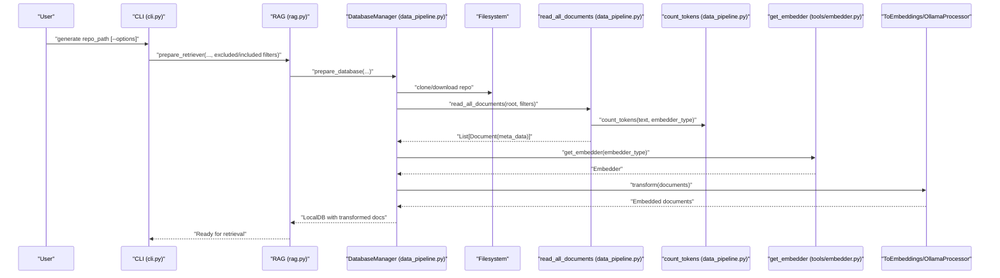
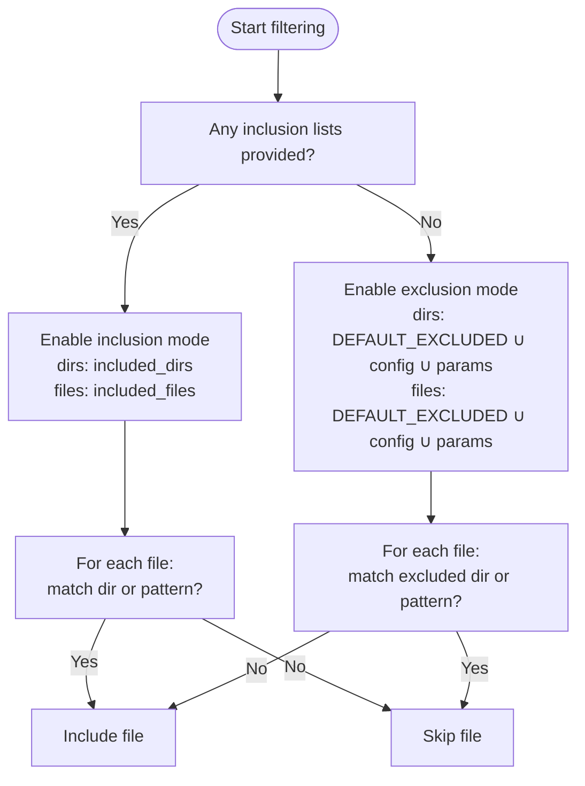
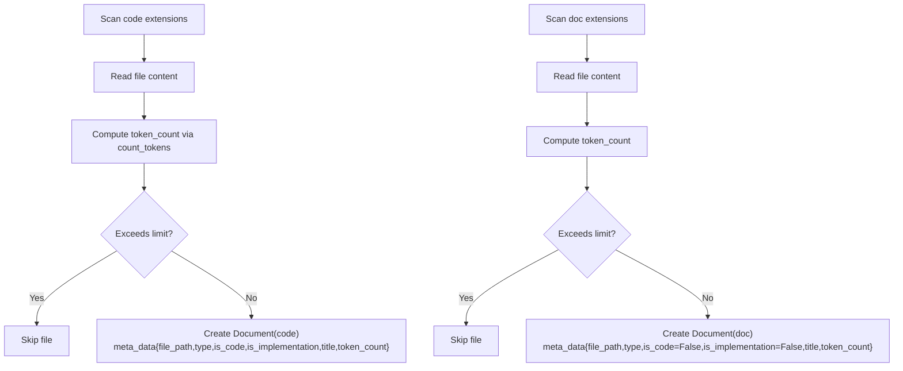
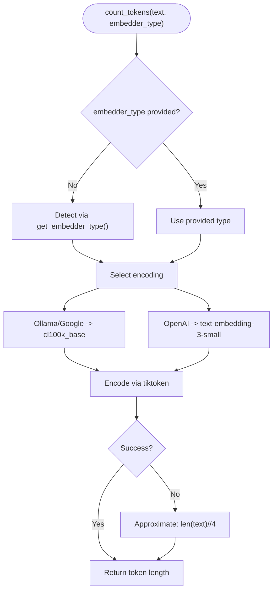
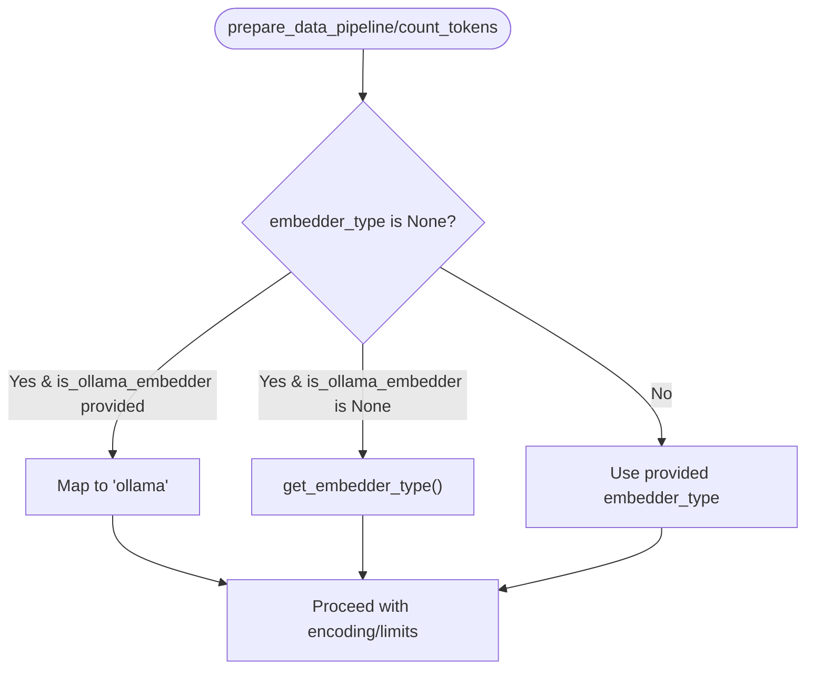
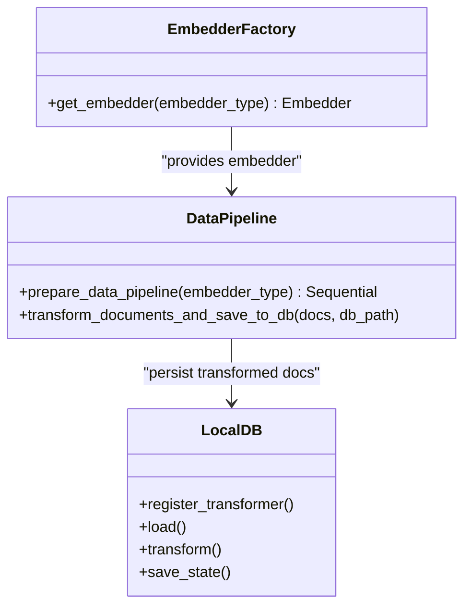
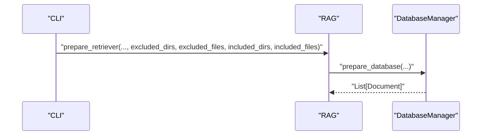
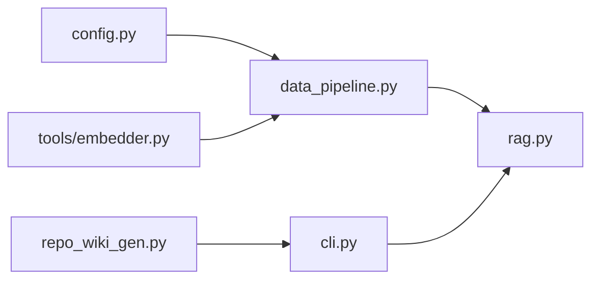

# File Filtering and Processing

<cite>
**Referenced Files in This Document**
- [config.py](file://api/config.py)
- [data_pipeline.py](file://api/data_pipeline.py)
- [embedder.py](file://api/tools/embedder.py)
- [cli.py](file://api/cli.py)
- [repo_wiki_gen.py](file://api/repo_wiki_gen.py)
- [rag.py](file://api/rag.py)
</cite>

## Table of Contents
1. [Introduction](#introduction)
2. [Project Structure](#project-structure)
3. [Core Components](#core-components)
4. [Architecture Overview](#architecture-overview)
5. [Detailed Component Analysis](#detailed-component-analysis)
6. [Dependency Analysis](#dependency-analysis)
7. [Performance Considerations](#performance-considerations)
8. [Troubleshooting Guide](#troubleshooting-guide)
9. [Conclusion](#conclusion)

## Introduction
This document explains the file filtering and processing system used to build knowledge bases from repositories for downstream retrieval and generation tasks. It covers:
- Inclusion and exclusion mode processing with examples of filter patterns and directory specifications
- File type prioritization for code files versus documentation files
- Token counting using tiktoken with provider-specific limits and validation rules
- Document metadata generation including file paths, types, implementation flags, and token counts
- Practical configuration examples, performance optimization techniques for large codebases, and troubleshooting
- Backward compatibility handling for deprecated parameters
- Integration with the broader data pipeline

## Project Structure
The filtering and processing logic spans several modules:
- Configuration and defaults for filters and embedder selection
- Data pipeline for reading, filtering, token counting, splitting, and embedding
- Embedder factory for selecting the correct embedder client
- CLI entrypoint for invoking repository processing
- Wiki generator for structure and content creation (context for filter propagation)
- RAG wrapper for preparing retrievers and validating embeddings

```mermaid
graph TB
subgraph "Config"
CFG["api/config.py"]
end
subgraph "Pipeline"
DP["api/data_pipeline.py"]
EMB["api/tools/embedder.py"]
end
subgraph "CLI"
CLI["api/cli.py"]
end
subgraph "Generation"
RWG["api/repo_wiki_gen.py"]
end
subgraph "RAG"
RAG["api/rag.py"]
end
CLI --> RAG
RAG --> DP
DP --> EMB
DP --> CFG
RWG --> CLI
```

**Diagram sources**
- [cli.py](file://api/cli.py#L119-L182)
- [rag.py](file://api/rag.py#L345-L371)
- [data_pipeline.py](file://api/data_pipeline.py#L177-L406)
- [embedder.py](file://api/tools/embedder.py#L6-L59)
- [config.py](file://api/config.py#L309-L348)

**Section sources**
- [cli.py](file://api/cli.py#L119-L182)
- [data_pipeline.py](file://api/data_pipeline.py#L177-L406)
- [embedder.py](file://api/tools/embedder.py#L6-L59)
- [config.py](file://api/config.py#L309-L348)

## Core Components
- File filtering modes:
  - Inclusion mode: only process files/directories specified via inclusion lists
  - Exclusion mode: process everything except directories/files matched by exclusion lists
- File type prioritization:
  - Code files are processed first, then documentation files
  - Implementation flags are derived heuristically from file paths
- Token counting and limits:
  - Provider-specific token limits enforced during ingestion
  - tiktoken-based counting with fallbacks
- Metadata generation:
  - Documents carry file_path, type, is_code, is_implementation, title, token_count

**Section sources**
- [data_pipeline.py](file://api/data_pipeline.py#L205-L406)
- [data_pipeline.py](file://api/data_pipeline.py#L25-L59)
- [data_pipeline.py](file://api/data_pipeline.py#L61-L102)

## Architecture Overview
End-to-end flow from CLI to embeddings and retriever preparation.



**Diagram sources**
- [cli.py](file://api/cli.py#L119-L182)
- [rag.py](file://api/rag.py#L345-L371)
- [data_pipeline.py](file://api/data_pipeline.py#L103-L173)
- [data_pipeline.py](file://api/data_pipeline.py#L177-L406)
- [data_pipeline.py](file://api/data_pipeline.py#L61-L102)
- [embedder.py](file://api/tools/embedder.py#L6-L59)

## Detailed Component Analysis

### File Filtering Modes: Inclusion vs Exclusion
- Determination:
  - If any inclusion list is provided, the system switches to inclusion mode
  - Otherwise, it uses exclusion mode with default and configured exclusions
- Inclusion mode:
  - Only files inside included directories or matching included file patterns are processed
  - If only directories are specified, all files in those directories are included
  - If only file patterns are specified, all files matching those patterns are included
- Exclusion mode:
  - Starts from defaults and merges additional exclusions from configuration and parameters
  - Applies directory and file pattern exclusions consistently



**Diagram sources**
- [data_pipeline.py](file://api/data_pipeline.py#L210-L327)

**Section sources**
- [data_pipeline.py](file://api/data_pipeline.py#L210-L327)

### File Type Prioritization and Metadata
- Prioritization order:
  - Code files are scanned first, then documentation files
- Heuristic implementation flag:
  - Derived from file path heuristics to mark implementation files
- Metadata fields:
  - file_path: relative path
  - type: extension without leading dot
  - is_code: boolean
  - is_implementation: boolean (heuristic)
  - title: alias for file_path
  - token_count: computed via tiktoken



**Diagram sources**
- [data_pipeline.py](file://api/data_pipeline.py#L328-L406)
- [data_pipeline.py](file://api/data_pipeline.py#L61-L102)

**Section sources**
- [data_pipeline.py](file://api/data_pipeline.py#L205-L406)

### Token Counting and Provider Limits
- Provider-specific token limits:
  - OpenAI/GitHub Copilot: 8192
  - Google: 2048
  - DashScope: 2048
  - Ollama: 2048 (conservative)
- Counting logic:
  - Uses tiktoken encodings:
    - Ollama and Google: cl100k_base
    - OpenAI: text-embedding-3-small
  - Fallback: character-based approximation if tiktoken fails
- Validation rules:
  - Code files allowed up to 10x the provider’s limit
  - Documentation files constrained by the provider’s limit



**Diagram sources**
- [data_pipeline.py](file://api/data_pipeline.py#L37-L59)
- [data_pipeline.py](file://api/data_pipeline.py#L61-L102)

**Section sources**
- [data_pipeline.py](file://api/data_pipeline.py#L25-L59)
- [data_pipeline.py](file://api/data_pipeline.py#L61-L102)

### Backward Compatibility and Deprecated Parameters
- Deprecated parameter handling:
  - is_ollama_embedder is deprecated; use embedder_type instead
  - When embedder_type is None and is_ollama_embedder is provided, the system maps to 'ollama'
- Embedder selection:
  - get_embedder supports direct embedder_type specification and auto-detection
- Provider detection:
  - get_embedder_type resolves current embedder type from configuration



**Diagram sources**
- [data_pipeline.py](file://api/data_pipeline.py#L408-L450)
- [data_pipeline.py](file://api/data_pipeline.py#L421-L429)
- [data_pipeline.py](file://api/data_pipeline.py#L61-L102)

**Section sources**
- [data_pipeline.py](file://api/data_pipeline.py#L408-L450)
- [data_pipeline.py](file://api/data_pipeline.py#L61-L102)

### Integration with the Broader Data Pipeline
- Embedder factory:
  - Selects embedder configuration by type and initializes the model client
- Pipeline construction:
  - TextSplitter followed by ToEmbeddings (batched) or OllamaDocumentProcessor (single)
- Database persistence:
  - LocalDB stores transformed documents for retrieval



**Diagram sources**
- [embedder.py](file://api/tools/embedder.py#L6-L59)
- [data_pipeline.py](file://api/data_pipeline.py#L408-L476)

**Section sources**
- [embedder.py](file://api/tools/embedder.py#L6-L59)
- [data_pipeline.py](file://api/data_pipeline.py#L408-L476)

### CLI Usage and Filter Propagation
- CLI generates wiki and prepares retrievers with optional inclusion/exclusion filters
- Filters are passed through to the retriever preparation routine



**Diagram sources**
- [cli.py](file://api/cli.py#L119-L182)
- [rag.py](file://api/rag.py#L345-L371)

**Section sources**
- [cli.py](file://api/cli.py#L119-L182)
- [rag.py](file://api/rag.py#L345-L371)

### Wiki Generator and Filter Parameters
- WikiGenerator accepts excluded/included filter parameters and forwards them to request bodies
- These parameters influence downstream processing and caching keys

**Section sources**
- [repo_wiki_gen.py](file://api/repo_wiki_gen.py#L74-L123)

## Dependency Analysis
Key dependencies and coupling:
- data_pipeline depends on:
  - config for defaults and embedder type resolution
  - tools.embedder for embedder instantiation
  - adalflow components for splitting and embedding
- rag depends on:
  - data_pipeline.DatabaseManager for database preparation
  - config for embedder and model configuration
  - tools.embedder for embedder selection
- cli depends on:
  - rag for retriever preparation
  - repo_wiki_gen for wiki generation orchestration



**Diagram sources**
- [config.py](file://api/config.py#L309-L348)
- [data_pipeline.py](file://api/data_pipeline.py#L14-L20)
- [embedder.py](file://api/tools/embedder.py#L3)
- [rag.py](file://api/rag.py#L42-L43)
- [cli.py](file://api/cli.py#L30-L33)

**Section sources**
- [config.py](file://api/config.py#L309-L348)
- [data_pipeline.py](file://api/data_pipeline.py#L14-L20)
- [embedder.py](file://api/tools/embedder.py#L3)
- [rag.py](file://api/rag.py#L42-L43)
- [cli.py](file://api/cli.py#L30-L33)

## Performance Considerations
- Prefer inclusion mode for large repositories to reduce I/O and scanning overhead
- Use targeted inclusion patterns to focus on relevant directories and file extensions
- Leverage provider-specific limits to skip excessively large files early (code up to 10x limit)
- Batch embedding for non-Ollama providers to minimize overhead
- Cache and reuse databases when possible to avoid repeated cloning and embedding
- Limit documentation files to essential formats to reduce tokenization cost

[No sources needed since this section provides general guidance]

## Troubleshooting Guide
Common issues and resolutions:
- Large files skipped due to token limits:
  - Verify provider limits and adjust inclusion filters to avoid overly large files
  - For code files, the system allows up to 10x the limit; ensure content is reasonable
- Embedding size mismatches:
  - The system validates and filters documents with inconsistent embedding sizes
  - Ensure the selected embedder model is consistent across runs
- Missing Ollama model:
  - The RAG component checks for the Ollama model existence before proceeding
  - Install the required model if missing
- Token counting failures:
  - The system falls back to a character-based approximation; monitor warnings
- Exclusion/inclusion confusion:
  - Confirm whether inclusion mode is active by checking provided inclusion lists
  - Review default exclusions and configured overrides

**Section sources**
- [data_pipeline.py](file://api/data_pipeline.py#L348-L353)
- [data_pipeline.py](file://api/data_pipeline.py#L328-L389)
- [rag.py](file://api/rag.py#L178-L187)
- [data_pipeline.py](file://api/data_pipeline.py#L97-L101)
- [data_pipeline.py](file://api/data_pipeline.py#L210-L327)

## Conclusion
The file filtering and processing system provides robust mechanisms to:
- Control which files are ingested via inclusion or exclusion modes
- Prioritize code files and capture documentation for richer knowledge bases
- Enforce provider-specific token limits with reliable counting and fallbacks
- Generate rich document metadata for downstream retrieval and generation
- Integrate seamlessly with the broader data pipeline and CLI for scalable repository processing

[No sources needed since this section summarizes without analyzing specific files]