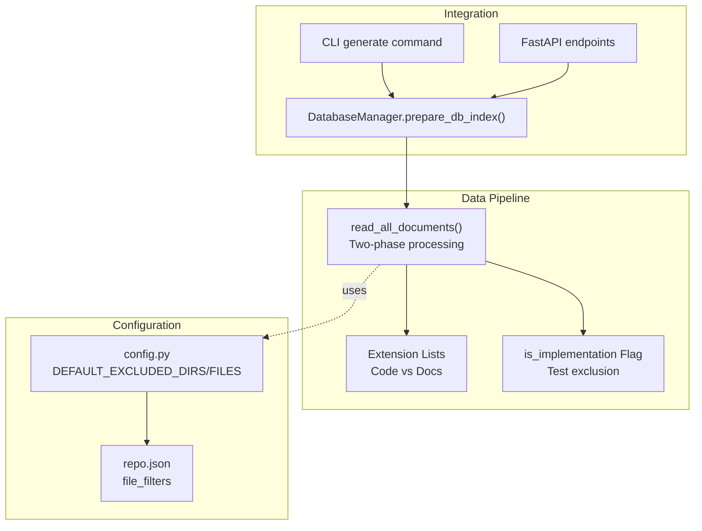
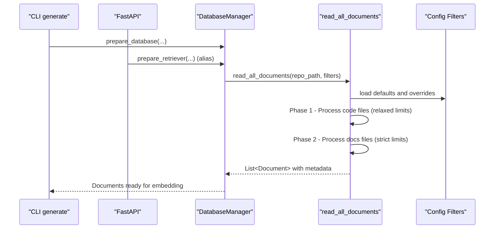
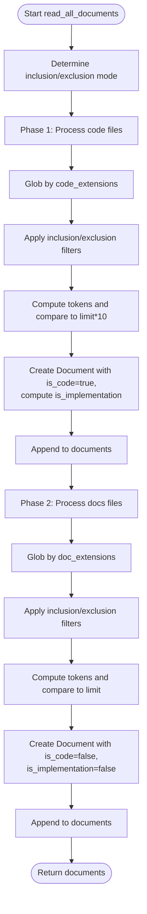
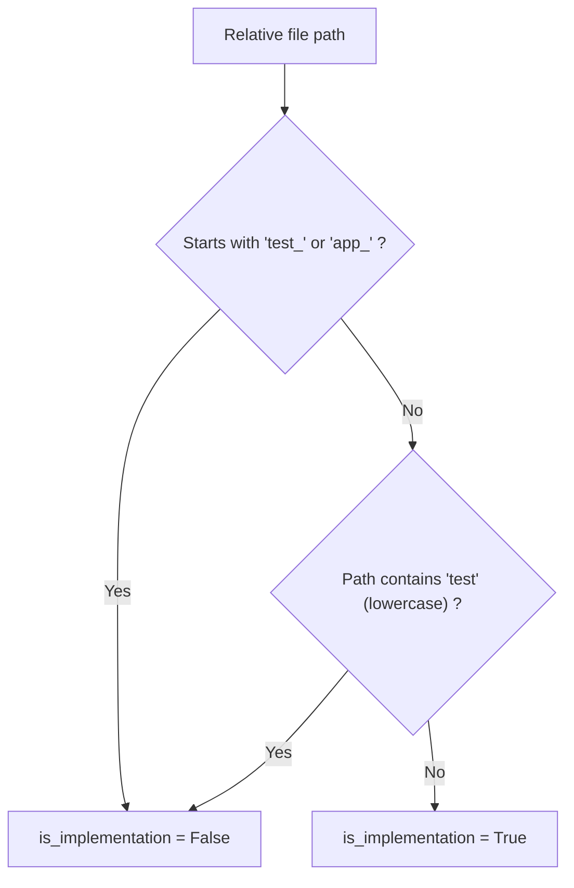
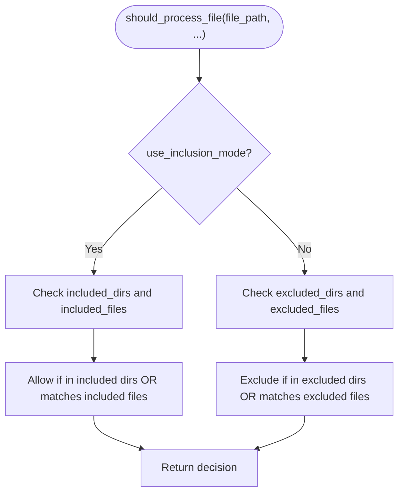
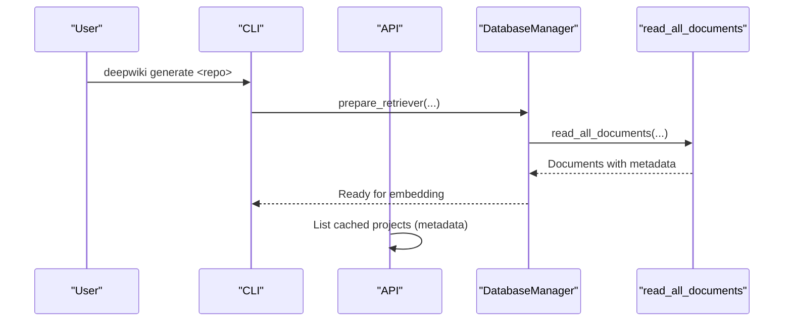
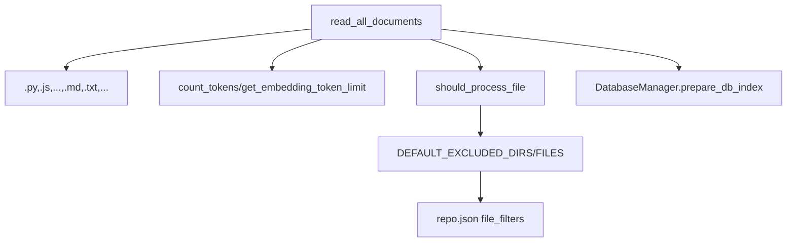

# File Type Prioritization

<cite>
**Referenced Files in This Document**
- [data_pipeline.py](file://api/data_pipeline.py)
- [config.py](file://api/config.py)
- [repo.json](file://api/config/repo.json)
- [cli.py](file://api/cli.py)
- [api.py](file://api/api.py)
</cite>

## Table of Contents
1. [Introduction](#introduction)
2. [Project Structure](#project-structure)
3. [Core Components](#core-components)
4. [Architecture Overview](#architecture-overview)
5. [Detailed Component Analysis](#detailed-component-analysis)
6. [Dependency Analysis](#dependency-analysis)
7. [Performance Considerations](#performance-considerations)
8. [Troubleshooting Guide](#troubleshooting-guide)
9. [Conclusion](#conclusion)

## Introduction
This document explains the file type prioritization system used to process repository content for documentation generation. The system employs a two-tier processing approach:
- Phase 1: Code files are processed first with relaxed token limits to preserve implementation details for better documentation quality.
- Phase 2: Documentation files are processed afterward with stricter limits.

The rationale is that code files typically contain richer semantic and structural information that improves downstream retrieval and generation quality. The system defines explicit extension lists, implements exclusion logic for test and auxiliary files, and computes an is_implementation flag to guide downstream decisions.

## Project Structure
The prioritization logic is implemented in the data pipeline module and integrated with configuration-driven filters and CLI/API entry points.

**Diagram sources**
- [data_pipeline.py](file://api/data_pipeline.py#L177-L406)
- [config.py](file://api/config.py#L309-L348)
- [repo.json](file://api/config/repo.json#L1-L129)
- [cli.py](file://api/cli.py#L119-L182)
- [api.py](file://api/api.py#L576-L635)

**Section sources**
- [data_pipeline.py](file://api/data_pipeline.py#L177-L406)
- [config.py](file://api/config.py#L309-L348)
- [repo.json](file://api/config/repo.json#L1-L129)
- [cli.py](file://api/cli.py#L119-L182)
- [api.py](file://api/api.py#L576-L635)

## Core Components
- Two-phase file reader:
  - Code-first processing with higher token limits.
  - Documentation-second processing with strict limits.
- Extension lists:
  - Code extensions include Python, JavaScript, TypeScript, Java, C/C++, Go, Rust, PHP, Swift, C#, HTML/CSS, JSX/TSX.
  - Documentation extensions include Markdown, TXT, RST, JSON, YAML/YML.
- Implementation detection:
  - Flags a file as implementation if it is not under test-related prefixes or paths and does not contain “test” in its path.
- Filtering:
  - Uses inclusion/exclusion modes with configurable defaults and overrides.

**Section sources**
- [data_pipeline.py](file://api/data_pipeline.py#L205-L208)
- [data_pipeline.py](file://api/data_pipeline.py#L328-L406)
- [data_pipeline.py](file://api/data_pipeline.py#L341-L346)
- [config.py](file://api/config.py#L309-L348)
- [repo.json](file://api/config/repo.json#L1-L129)

## Architecture Overview
The prioritization system is invoked via the DatabaseManager during retriever preparation. It reads files in two passes, applies filters, and produces a list of Documents enriched with metadata including is_code, is_implementation, and token_count.

**Diagram sources**
- [cli.py](file://api/cli.py#L119-L182)
- [api.py](file://api/api.py#L576-L635)
- [data_pipeline.py](file://api/data_pipeline.py#L850-L902)
- [data_pipeline.py](file://api/data_pipeline.py#L177-L406)
- [config.py](file://api/config.py#L309-L348)
- [repo.json](file://api/config/repo.json#L1-L129)

## Detailed Component Analysis

### Two-Phase Processing Logic
- Code files are globbed by code extensions and processed first.
- Documentation files are globbed by documentation extensions and processed second.
- Token limits differ between phases:
  - Code phase allows a larger token budget (multiplier applied).
  - Docs phase respects provider-specific limits.

**Diagram sources**
- [data_pipeline.py](file://api/data_pipeline.py#L177-L406)

**Section sources**
- [data_pipeline.py](file://api/data_pipeline.py#L177-L406)

### Extension Lists and Categories
- Code extensions: Python, JavaScript, TypeScript, Java, C/C++, Go, Rust, PHP, Swift, C#, HTML/CSS, JSX/TSX.
- Documentation extensions: Markdown, TXT, RST, JSON, YAML/YML.

These lists define the two categories and the order of processing.

**Section sources**
- [data_pipeline.py](file://api/data_pipeline.py#L205-L208)

### Implementation Detection and Test Exclusion
- A file is considered implementation if:
  - Its relative path does not start with test-related prefixes.
  - Its path does not contain “test”.
- This flag is stored in the Document’s metadata to guide downstream decisions.

**Diagram sources**
- [data_pipeline.py](file://api/data_pipeline.py#L341-L346)

**Section sources**
- [data_pipeline.py](file://api/data_pipeline.py#L341-L346)

### Filtering Modes and Overrides
- Inclusion mode:
  - Only directories/files in provided lists are processed.
- Exclusion mode:
  - Uses default excluded directories and files plus any overrides.
- Defaults come from configuration and repo.json.

**Diagram sources**
- [data_pipeline.py](file://api/data_pipeline.py#L259-L326)

**Section sources**
- [data_pipeline.py](file://api/data_pipeline.py#L210-L251)
- [data_pipeline.py](file://api/data_pipeline.py#L259-L326)
- [config.py](file://api/config.py#L309-L348)
- [repo.json](file://api/config/repo.json#L1-L129)

### Integration Points
- CLI:
  - The generate command prepares the retriever and triggers the two-phase processing.
- API:
  - The processed projects endpoint scans cached wiki outputs and relies on consistent metadata.
- DatabaseManager:
  - Orchestrates repository preparation and delegates to read_all_documents.

**Diagram sources**
- [cli.py](file://api/cli.py#L119-L182)
- [api.py](file://api/api.py#L576-L635)
- [data_pipeline.py](file://api/data_pipeline.py#L850-L902)

**Section sources**
- [cli.py](file://api/cli.py#L119-L182)
- [api.py](file://api/api.py#L576-L635)
- [data_pipeline.py](file://api/data_pipeline.py#L850-L902)

## Dependency Analysis
- read_all_documents depends on:
  - Extension lists for ordering.
  - Token limit helpers for provider-specific thresholds.
  - Filter utilities for inclusion/exclusion.
- Configuration sources:
  - Default exclusions in config.py.
  - Additional overrides in repo.json.
- Downstream consumers:
  - DatabaseManager for embedding.
  - CLI and API for user workflows.

**Diagram sources**
- [data_pipeline.py](file://api/data_pipeline.py#L177-L406)
- [config.py](file://api/config.py#L309-L348)
- [repo.json](file://api/config/repo.json#L1-L129)

**Section sources**
- [data_pipeline.py](file://api/data_pipeline.py#L177-L406)
- [config.py](file://api/config.py#L309-L348)
- [repo.json](file://api/config/repo.json#L1-L129)

## Performance Considerations
- Why code-first:
  - Code files often contain dense semantic signals and structure that improve retrieval quality. Allowing higher token budgets prevents truncation of critical implementation details.
- Cost and throughput:
  - The docs phase uses stricter limits to reduce embedding costs and avoid provider rate limits.
- Optimization strategies for repositories heavy in docs:
  - Prefer inclusion mode to restrict processing to relevant directories.
  - Use targeted included_files to focus on key documentation assets.
  - Adjust batch sizes and provider selection via configuration to balance cost and speed.
  - Consider pre-filtering large binary or lock files via excluded_files to minimize IO overhead.

[No sources needed since this section provides general guidance]

## Troubleshooting Guide
- Unexpectedly missing files:
  - Verify inclusion/exclusion lists and ensure the file path does not match excluded patterns.
- Large files skipped:
  - Confirm token counts exceed limits; consider increasing provider capacity or splitting content.
- Misclassified implementation files:
  - Review is_implementation logic; adjust directory structure or rename test files to avoid false positives.
- Performance bottlenecks:
  - Switch to inclusion mode or reduce scope; confirm repo.json excludes unnecessary directories.

**Section sources**
- [data_pipeline.py](file://api/data_pipeline.py#L348-L353)
- [data_pipeline.py](file://api/data_pipeline.py#L383-L388)
- [config.py](file://api/config.py#L309-L348)
- [repo.json](file://api/config/repo.json#L1-L129)

## Conclusion
The file type prioritization system ensures that code-centric content receives precedence and adequate token budgets, while documentation files are still processed efficiently. Together with robust filtering and implementation detection, it enables high-quality embeddings and downstream documentation generation, with practical optimization strategies for diverse repository compositions.