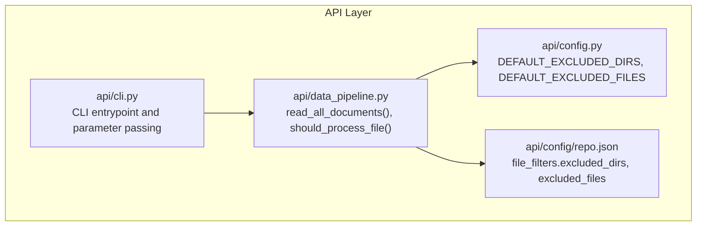
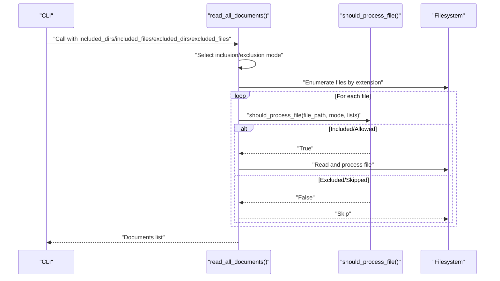
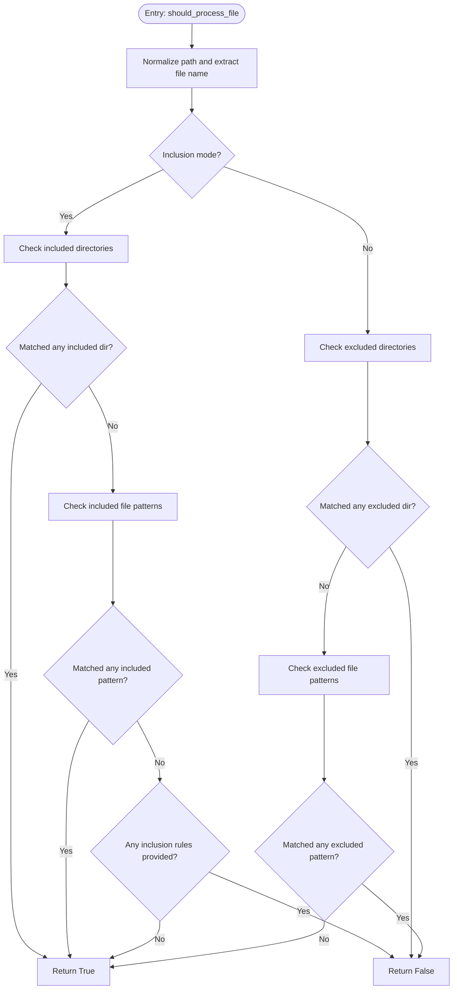
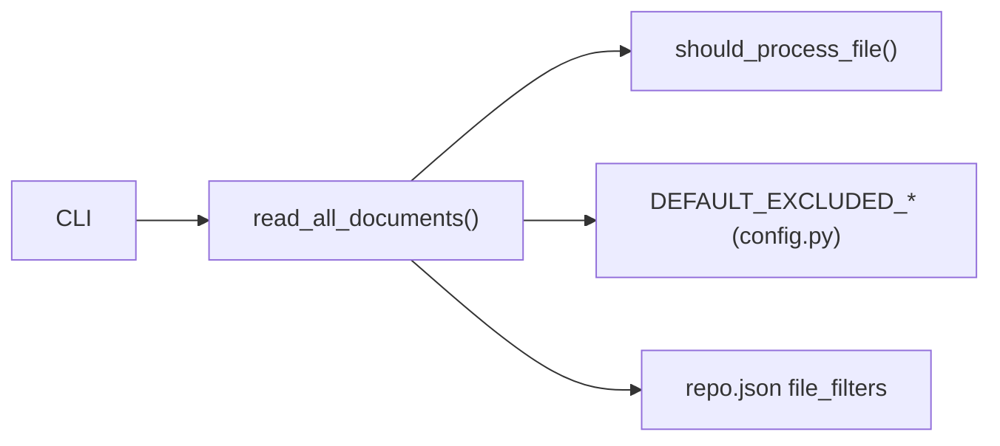

# Filtering Modes

<cite>
**Referenced Files in This Document**
- [data_pipeline.py](file://api/data_pipeline.py)
- [config.py](file://api/config.py)
- [repo.json](file://api/config/repo.json)
- [cli.py](file://api/cli.py)
</cite>

## Table of Contents
1. [Introduction](#introduction)
2. [Project Structure](#project-structure)
3. [Core Components](#core-components)
4. [Architecture Overview](#architecture-overview)
5. [Detailed Component Analysis](#detailed-component-analysis)
6. [Dependency Analysis](#dependency-analysis)
7. [Performance Considerations](#performance-considerations)
8. [Troubleshooting Guide](#troubleshooting-guide)
9. [Conclusion](#conclusion)

## Introduction
This document explains the filtering modes system used when processing files in repositories. It covers two distinct filtering approaches:
- Inclusion mode: restricts processing to specific directories and/or file patterns.
- Exclusion mode: processes everything except directories and/or file patterns explicitly excluded.

It also details how the filtering logic is implemented, how configuration is merged, and how the should_process_file function decides whether a file should be processed. Practical examples, precedence rules, and performance guidance are included.

## Project Structure
The filtering logic lives primarily in the data pipeline module and is driven by configuration files and defaults. The CLI demonstrates how filtering parameters are passed into the processing pipeline.

**Diagram sources**
- [data_pipeline.py](file://api/data_pipeline.py#L177-L406)
- [config.py](file://api/config.py#L309-L348)
- [repo.json](file://api/config/repo.json#L1-L129)
- [cli.py](file://api/cli.py#L177-L182)

**Section sources**
- [data_pipeline.py](file://api/data_pipeline.py#L177-L406)
- [config.py](file://api/config.py#L309-L348)
- [repo.json](file://api/config/repo.json#L1-L129)
- [cli.py](file://api/cli.py#L177-L182)

## Core Components
- read_all_documents: The main entry for file processing. It selects inclusion or exclusion mode based on provided parameters, merges configuration, and iterates over files.
- should_process_file: The core decision function that evaluates inclusion or exclusion rules for a given file path.
- DEFAULT_EXCLUDED_DIRS and DEFAULT_EXCLUDED_FILES: Built-in defaults for exclusion mode.
- repo.json file_filters: Additional exclusion lists loaded from configuration.

Key parameters:
- included_dirs: List of directory names/parts to include (inclusion mode).
- included_files: List of file patterns to include (inclusion mode).
- excluded_dirs: List of directory names/parts to exclude (exclusion mode).
- excluded_files: List of file patterns to exclude (exclusion mode).

Behavior summary:
- If either included_dirs or included_files is provided and non-empty, inclusion mode is used.
- Otherwise, exclusion mode is used, starting from DEFAULT_EXCLUDED_DIRS and DEFAULT_EXCLUDED_FILES, then merging any additional patterns from repo.json and any explicit excluded_* parameters.

**Section sources**
- [data_pipeline.py](file://api/data_pipeline.py#L177-L406)
- [config.py](file://api/config.py#L309-L348)
- [repo.json](file://api/config/repo.json#L1-L129)

## Architecture Overview
The filtering pipeline operates as follows:
- CLI passes filtering parameters to the data pipeline.
- The pipeline determines inclusion vs exclusion mode.
- For inclusion mode, it builds sets of included directories and files, clears excluded lists, and processes only matching items.
- For exclusion mode, it starts with built-in defaults, merges repo.json additions, and applies any explicit excluded_* parameters.
- For each file, should_process_file evaluates the chosen mode and returns whether to process it.

**Diagram sources**
- [cli.py](file://api/cli.py#L177-L182)
- [data_pipeline.py](file://api/data_pipeline.py#L177-L406)

## Detailed Component Analysis

### Inclusion Mode
Inclusion mode activates when either included_dirs or included_files is provided and non-empty. The pipeline:
- Converts provided included_* lists to sets to deduplicate.
- Logs the included lists.
- Clears excluded_* lists (they are ignored in inclusion mode).
- For each file, should_process_file checks:
  - If included_dirs is set, the file path must contain any of the included directory names/parts.
  - If included_files is set, the file name must match any of the included patterns.
  - If neither category is specified for inclusion, the file is considered included by default.

Practical example syntax:
- included_dirs: ["src", "lib", "docs"]
- included_files: ["*.py", "README.md", "package.json"]

Precedence:
- Inclusion mode takes precedence over exclusion mode. If included_* parameters are provided, exclusion lists are effectively disabled for the purpose of determining eligibility.

**Section sources**
- [data_pipeline.py](file://api/data_pipeline.py#L210-L227)
- [data_pipeline.py](file://api/data_pipeline.py#L275-L307)

### Exclusion Mode
Exclusion mode is used when no inclusion parameters are provided. The pipeline:
- Starts with DEFAULT_EXCLUDED_DIRS and DEFAULT_EXCLUDED_FILES.
- Merges additional excluded directories and files from repo.json under file_filters.
- Applies any explicitly provided excluded_dirs and excluded_files parameters.
- For each file, should_process_file checks:
  - If the file path contains any excluded directory name/part, it is excluded.
  - If the file name matches any excluded pattern, it is excluded.
  - If neither condition holds, the file is allowed.

Practical example syntax:
- excluded_dirs: [".venv", "node_modules"]
- excluded_files: ["*.log", "*.tmp", "Thumbs.db"]

Precedence:
- Explicit excluded_* parameters override defaults and repo.json entries.

**Section sources**
- [data_pipeline.py](file://api/data_pipeline.py#L228-L251)
- [data_pipeline.py](file://api/data_pipeline.py#L308-L326)
- [config.py](file://api/config.py#L309-L348)
- [repo.json](file://api/config/repo.json#L1-L129)

### Pattern Matching Rules
- Directory matching:
  - Inclusion: A file path is considered inside an included directory if any of the included directory names appears as a segment in the normalized path.
  - Exclusion: A file path is excluded if any of the excluded directory names appears as a segment in the normalized path.
- File pattern matching:
  - Inclusion: A file is included if its basename equals the pattern or ends with the pattern (supports suffix wildcards).
  - Exclusion: A file is excluded if its basename equals the pattern.

Notes:
- Patterns are treated as literal basenames or suffixes; no advanced shell-style globbing is performed beyond suffix matching for inclusion files.
- Paths are normalized and split by the OS path separator before evaluation.

**Section sources**
- [data_pipeline.py](file://api/data_pipeline.py#L275-L326)

### should_process_file Decision Logic
The function encapsulates the core decision:
- Normalize the file path and extract the file name.
- If inclusion mode:
  - Check directory membership among included directories.
  - If not yet included, check file name patterns among included files.
  - If no inclusion rules were specified for a category, treat that category as “allow all.”
  - Return whether the file is included.
- If exclusion mode:
  - Check directory membership among excluded directories.
  - If not excluded, check file name patterns among excluded files.
  - Return the negation of the exclusion decision.

**Diagram sources**
- [data_pipeline.py](file://api/data_pipeline.py#L259-L326)

**Section sources**
- [data_pipeline.py](file://api/data_pipeline.py#L259-L326)

### Configuration Merging and Defaults
- Defaults:
  - DEFAULT_EXCLUDED_DIRS and DEFAULT_EXCLUDED_FILES are defined in the config module.
- Repo configuration:
  - repo.json under file_filters contains excluded_dirs and excluded_files arrays.
- Parameter precedence:
  - Explicit excluded_dirs/excluded_files parameters override defaults and repo.json.
  - Inclusion parameters (included_dirs/included_files) switch the mode and disable the effect of excluded_* lists for eligibility decisions.

**Section sources**
- [config.py](file://api/config.py#L309-L348)
- [repo.json](file://api/config/repo.json#L1-L129)
- [data_pipeline.py](file://api/data_pipeline.py#L228-L251)

### CLI Integration and Usage
The CLI demonstrates how to pass filtering parameters to the processing pipeline. While the CLI itself does not set inclusion/exclusion parameters by default, downstream components (e.g., RAG preparation) accept these parameters and forward them to the data pipeline.

Typical invocation patterns:
- Use inclusion mode to process only specific directories and file patterns.
- Use exclusion mode to process everything except known noise directories and files.

**Section sources**
- [cli.py](file://api/cli.py#L177-L182)
- [data_pipeline.py](file://api/data_pipeline.py#L851-L902)

## Dependency Analysis
The filtering logic depends on:
- Configuration defaults and repo.json for exclusion lists.
- The normalization and splitting of file paths for directory matching.
- The decision function for inclusion/exclusion.

**Diagram sources**
- [data_pipeline.py](file://api/data_pipeline.py#L177-L406)
- [config.py](file://api/config.py#L309-L348)
- [repo.json](file://api/config/repo.json#L1-L129)
- [cli.py](file://api/cli.py#L177-L182)

**Section sources**
- [data_pipeline.py](file://api/data_pipeline.py#L177-L406)
- [config.py](file://api/config.py#L309-L348)
- [repo.json](file://api/config/repo.json#L1-L129)
- [cli.py](file://api/cli.py#L177-L182)

## Performance Considerations
- Deduplication: included_* and excluded_* lists are converted to sets early, reducing repeated checks.
- Minimal regex/globbing: Pattern matching relies on exact basename equality or suffix matching, avoiding expensive regex operations.
- Early exit: should_process_file short-circuits when a match is found.
- Large codebases:
  - Prefer inclusion mode with targeted directories to reduce filesystem traversal.
  - Keep included_files minimal and precise to avoid scanning unnecessary files.
  - Use repo.json to centralize common exclusions and avoid passing long lists via CLI.

[No sources needed since this section provides general guidance]

## Troubleshooting Guide
Common issues and resolutions:
- Unexpectedly excluded files:
  - Verify excluded_dirs and excluded_files lists. Remember that exclusion mode checks directory segments and exact file name matches.
  - Confirm repo.json file_filters entries are not unintentionally broad.
- Unexpectedly included files:
  - In inclusion mode, ensure included_dirs and included_files are restrictive enough. If no inclusion rules are provided for a category, that category is treated as “allow all.”
- Mixed modes:
  - If included_dirs or included_files are provided, exclusion lists are effectively disabled for eligibility. If you intended to exclude certain items while including others, ensure you only provide inclusion parameters.
- Path normalization:
  - Directory matching uses normalized path segments. Ensure your patterns align with the actual directory names and separators used in the repository.

**Section sources**
- [data_pipeline.py](file://api/data_pipeline.py#L210-L227)
- [data_pipeline.py](file://api/data_pipeline.py#L228-L251)
- [data_pipeline.py](file://api/data_pipeline.py#L275-L326)
- [repo.json](file://api/config/repo.json#L1-L129)

## Conclusion
The filtering modes system provides flexible control over file processing:
- Inclusion mode lets you precisely target directories and file patterns.
- Exclusion mode lets you process everything except known noise.
- The should_process_file function enforces clear, predictable rules.
- Defaults and configuration files enable consistent behavior across environments.

By understanding precedence and pattern matching, you can configure filtering to meet diverse repository structures and performance needs.