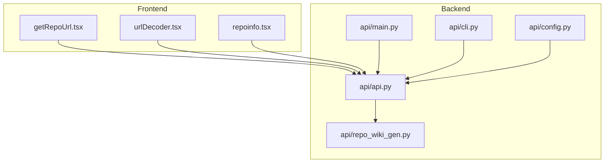
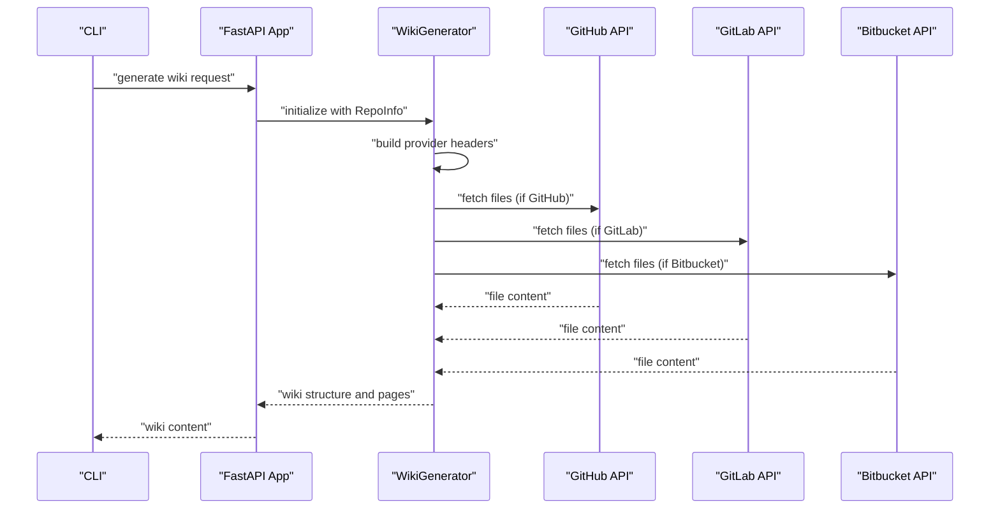
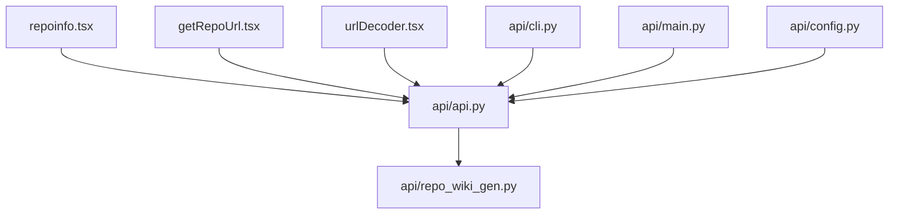

# Remote File Retrieval

<cite>
**Referenced Files in This Document**
- [api.py](file://api/api.py)
- [repo_wiki_gen.py](file://api/repo_wiki_gen.py)
- [cli.py](file://api/cli.py)
- [config.py](file://api/config.py)
- [getRepoUrl.tsx](file://src/utils/getRepoUrl.tsx)
- [urlDecoder.tsx](file://src/utils/urlDecoder.tsx)
- [repoinfo.tsx](file://src/types/repoinfo.tsx)
- [main.py](file://api/main.py)
</cite>

## Table of Contents
1. [Introduction](#introduction)
2. [Project Structure](#project-structure)
3. [Core Components](#core-components)
4. [Architecture Overview](#architecture-overview)
5. [Detailed Component Analysis](#detailed-component-analysis)
6. [Dependency Analysis](#dependency-analysis)
7. [Performance Considerations](#performance-considerations)
8. [Troubleshooting Guide](#troubleshooting-guide)
9. [Conclusion](#conclusion)
10. [Appendices](#appendices)

## Introduction
This document explains the remote file retrieval system that supports GitHub, GitLab, and Bitbucket repositories. It focuses on how file content is retrieved, parsed, and integrated into the wiki generation pipeline. It documents URL parsing, authentication via access tokens, API endpoint construction, provider-specific header handling, and error handling strategies. Practical examples demonstrate retrieving files from public and enterprise instances, and troubleshooting common issues such as rate limiting and malformed responses.

## Project Structure
The remote file retrieval capability spans backend API endpoints, a CLI for local testing, and frontend utilities for URL normalization and repository identification. The backend orchestrates repository access, authentication, and content assembly. The CLI provides a command-line interface to generate wikis against remote repositories. Frontend utilities assist in normalizing repository URLs and extracting domain/path segments.

**Diagram sources**
- [api.py](file://api/api.py#L1-L635)
- [repo_wiki_gen.py](file://api/repo_wiki_gen.py#L1-L550)
- [cli.py](file://api/cli.py#L1-L120)
- [config.py](file://api/config.py#L1-L400)
- [getRepoUrl.tsx](file://src/utils/getRepoUrl.tsx#L1-L17)
- [urlDecoder.tsx](file://src/utils/urlDecoder.tsx#L1-L19)
- [repoinfo.tsx](file://src/types/repoinfo.tsx#L1-L11)
- [main.py](file://api/main.py#L1-L104)

**Section sources**
- [api.py](file://api/api.py#L1-L635)
- [repo_wiki_gen.py](file://api/repo_wiki_gen.py#L1-L550)
- [cli.py](file://api/cli.py#L1-L120)
- [config.py](file://api/config.py#L1-L400)
- [getRepoUrl.tsx](file://src/utils/getRepoUrl.tsx#L1-L17)
- [urlDecoder.tsx](file://src/utils/urlDecoder.tsx#L1-L19)
- [repoinfo.tsx](file://src/types/repoinfo.tsx#L1-L11)
- [main.py](file://api/main.py#L1-L104)

## Core Components
- Repository info model: Defines owner, repo, type, optional token, local path, and optional repo URL. Used across frontend and backend to standardize repository inputs.
- URL utilities: Normalize inputs to protocol-aware URLs, extract domain and path segments for downstream parsing.
- Wiki generator: Orchestrates repository access, builds provider-specific headers, constructs file URLs, and generates prompts for wiki content.
- API endpoints: Provide cache operations, health checks, and project listing. They rely on the wiki generator for content retrieval.
- CLI: Provides a command-line entry point to generate wikis against remote repositories with optional access tokens and provider/model selection.

Key implementation references:
- Repository info model and cache operations: [api.py](file://api/api.py#L60-L111), [api.py](file://api/api.py#L461-L539)
- URL utilities: [getRepoUrl.tsx](file://src/utils/getRepoUrl.tsx#L1-L17), [urlDecoder.tsx](file://src/utils/urlDecoder.tsx#L1-L19)
- Wiki generator and provider-specific headers: [repo_wiki_gen.py](file://api/repo_wiki_gen.py#L52-L144)
- CLI entry points: [cli.py](file://api/cli.py#L1-L120)

**Section sources**
- [api.py](file://api/api.py#L60-L111)
- [api.py](file://api/api.py#L461-L539)
- [getRepoUrl.tsx](file://src/utils/getRepoUrl.tsx#L1-L17)
- [urlDecoder.tsx](file://src/utils/urlDecoder.tsx#L1-L19)
- [repo_wiki_gen.py](file://api/repo_wiki_gen.py#L52-L144)
- [cli.py](file://api/cli.py#L1-L120)

## Architecture Overview
The system retrieves remote repository files and integrates them into a structured wiki. The flow involves:
- Normalizing repository URLs and extracting provider-specific identifiers.
- Constructing provider-specific headers using access tokens.
- Building file URLs for blob/raw content endpoints.
- Fetching file content and assembling prompts for LLM-driven wiki generation.
- Caching generated wiki structures and pages for reuse.

**Diagram sources**
- [api.py](file://api/api.py#L1-L635)
- [repo_wiki_gen.py](file://api/repo_wiki_gen.py#L124-L144)
- [cli.py](file://api/cli.py#L1-L120)

## Detailed Component Analysis

### Repository Information Model
Defines the shape of repository inputs across the system:
- Fields: owner, repo, type, token, localPath, repoUrl.
- Optional branch parameter exists in the frontend type definition.

References:
- Backend model: [api.py](file://api/api.py#L60-L67)
- Frontend type: [repoinfo.tsx](file://src/types/repoinfo.tsx#L1-L11)

**Section sources**
- [api.py](file://api/api.py#L60-L67)
- [repoinfo.tsx](file://src/types/repoinfo.tsx#L1-L11)

### URL Parsing Utilities
- Domain extraction: Ensures inputs are treated as URLs and extracts protocol, hostname, and optional port.
- Path extraction: Normalizes paths by removing leading/trailing slashes.

References:
- Domain extraction: [urlDecoder.tsx](file://src/utils/urlDecoder.tsx#L1-L9)
- Path extraction: [urlDecoder.tsx](file://src/utils/urlDecoder.tsx#L11-L19)

**Section sources**
- [urlDecoder.tsx](file://src/utils/urlDecoder.tsx#L1-L19)

### Provider-Specific Authentication and Headers
The wiki generator creates provider-specific headers using the access token:
- GitHub: Accept header plus Authorization bearer token.
- GitLab: Content-Type plus PRIVATE-TOKEN header.
- Bitbucket: Content-Type plus Authorization bearer token.

References:
- GitHub headers: [repo_wiki_gen.py](file://api/repo_wiki_gen.py#L124-L129)
- GitLab headers: [repo_wiki_gen.py](file://api/repo_wiki_gen.py#L131-L136)
- Bitbucket headers: [repo_wiki_gen.py](file://api/repo_wiki_gen.py#L138-L143)

**Section sources**
- [repo_wiki_gen.py](file://api/repo_wiki_gen.py#L124-L143)

### File URL Construction
The generator builds provider-specific file URLs for rendering links:
- GitHub: Uses blob path pattern.
- GitLab: Uses “-” path separator and blob pattern.
- Bitbucket: Uses src path pattern.

References:
- File URL builder: [repo_wiki_gen.py](file://api/repo_wiki_gen.py#L145-L171)

**Section sources**
- [repo_wiki_gen.py](file://api/repo_wiki_gen.py#L145-L171)

### API Endpoint Integration
- Health and root endpoints expose service status and dynamic endpoint listing.
- Cache endpoints manage persisted wiki structures and pages.
- Local repository structure endpoint supports local development and testing.

References:
- Health endpoint: [api.py](file://api/api.py#L540-L547)
- Root endpoint: [api.py](file://api/api.py#L549-L574)
- Cache read/write/delete: [api.py](file://api/api.py#L461-L539)
- Local repo structure: [api.py](file://api/api.py#L275-L321)

**Section sources**
- [api.py](file://api/api.py#L540-L547)
- [api.py](file://api/api.py#L549-L574)
- [api.py](file://api/api.py#L461-L539)
- [api.py](file://api/api.py#L275-L321)

### CLI Workflow for Remote Repositories
The CLI supports:
- Specifying repository type (github, gitlab, bitbucket).
- Passing an access token for private or rate-limited scenarios.
- Selecting provider and model for LLM-backed generation.

References:
- CLI usage examples: [cli.py](file://api/cli.py#L1-L20)
- Repository type option: [cli.py](file://api/cli.py#L95-L97)

**Section sources**
- [cli.py](file://api/cli.py#L1-L20)
- [cli.py](file://api/cli.py#L95-L97)

### Environment and Authentication Notes
- Backend startup configures timeouts and logs environment variable presence.
- Optional environment variables include provider-specific keys; missing required variables are logged.

References:
- Startup and environment checks: [main.py](file://api/main.py#L60-L86)

**Section sources**
- [main.py](file://api/main.py#L60-L86)

## Dependency Analysis
The system exhibits layered dependencies:
- Frontend utilities depend on shared types for repository inputs.
- Backend API depends on the wiki generator for content orchestration.
- CLI interacts with the API to trigger generation and caching.

**Diagram sources**
- [api.py](file://api/api.py#L1-L635)
- [repo_wiki_gen.py](file://api/repo_wiki_gen.py#L1-L550)
- [cli.py](file://api/cli.py#L1-L120)
- [config.py](file://api/config.py#L1-L400)
- [getRepoUrl.tsx](file://src/utils/getRepoUrl.tsx#L1-L17)
- [urlDecoder.tsx](file://src/utils/urlDecoder.tsx#L1-L19)
- [repoinfo.tsx](file://src/types/repoinfo.tsx#L1-L11)
- [main.py](file://api/main.py#L1-L104)

**Section sources**
- [api.py](file://api/api.py#L1-L635)
- [repo_wiki_gen.py](file://api/repo_wiki_gen.py#L1-L550)
- [cli.py](file://api/cli.py#L1-L120)
- [config.py](file://api/config.py#L1-L400)
- [getRepoUrl.tsx](file://src/utils/getRepoUrl.tsx#L1-L17)
- [urlDecoder.tsx](file://src/utils/urlDecoder.tsx#L1-L19)
- [repoinfo.tsx](file://src/types/repoinfo.tsx#L1-L11)
- [main.py](file://api/main.py#L1-L104)

## Performance Considerations
- Rate limiting: Use access tokens to increase API quotas. The CLI supports passing tokens for private or rate-limited repositories.
- Timeout tuning: Backend startup adjusts HTTP client timeouts to accommodate corporate proxies.
- Caching: Server-side cache persists wiki structures and pages to avoid repeated API calls.

References:
- Access token usage in headers: [repo_wiki_gen.py](file://api/repo_wiki_gen.py#L124-L143)
- Timeout configuration: [main.py](file://api/main.py#L9-L20)
- Cache persistence: [api.py](file://api/api.py#L426-L457)

**Section sources**
- [repo_wiki_gen.py](file://api/repo_wiki_gen.py#L124-L143)
- [main.py](file://api/main.py#L9-L20)
- [api.py](file://api/api.py#L426-L457)

## Troubleshooting Guide
Common issues and resolutions:
- Invalid or missing repository URL: Ensure the URL includes protocol and is parseable by the decoder utilities.
- Authentication failures: Provide a valid access token for private repositories or enterprise instances.
- Rate limiting errors: Use a token to increase quotas; consider retry/backoff strategies.
- Malformed API responses: Validate provider-specific endpoints and headers.
- Cache inconsistencies: Delete and regenerate cache entries via the cache endpoints.

References:
- URL decoding helpers: [urlDecoder.tsx](file://src/utils/urlDecoder.tsx#L1-L19)
- Header construction: [repo_wiki_gen.py](file://api/repo_wiki_gen.py#L124-L143)
- Cache endpoints: [api.py](file://api/api.py#L461-L539)

**Section sources**
- [urlDecoder.tsx](file://src/utils/urlDecoder.tsx#L1-L19)
- [repo_wiki_gen.py](file://api/repo_wiki_gen.py#L124-L143)
- [api.py](file://api/api.py#L461-L539)

## Conclusion
The remote file retrieval system integrates frontend URL utilities, backend API endpoints, and a robust wiki generator to fetch and structure content from GitHub, GitLab, and Bitbucket repositories. By constructing provider-specific headers, building accurate file URLs, and leveraging caching, the system delivers scalable and maintainable wiki generation. Proper authentication and rate-limiting strategies ensure reliable operation across public and enterprise environments.

## Appendices

### Practical Examples

- Retrieve a file from a public GitHub repository:
  - Provide repository URL and ensure Accept header is set for JSON responses.
  - Reference: [repo_wiki_gen.py](file://api/repo_wiki_gen.py#L124-L129)

- Retrieve a file from a GitLab self-hosted instance:
  - Pass PRIVATE-TOKEN header with a valid token.
  - Reference: [repo_wiki_gen.py](file://api/repo_wiki_gen.py#L131-L136)

- Retrieve a file from a Bitbucket repository:
  - Use Authorization bearer token and build src-based file URLs.
  - Reference: [repo_wiki_gen.py](file://api/repo_wiki_gen.py#L138-L143), [repo_wiki_gen.py](file://api/repo_wiki_gen.py#L165-L167)

- Use CLI to generate a wiki with a token:
  - Pass repository type and access token to the CLI.
  - Reference: [cli.py](file://api/cli.py#L1-L20), [cli.py](file://api/cli.py#L95-L97)

- Manage cache for a repository:
  - Read, write, or delete cached wiki data via cache endpoints.
  - Reference: [api.py](file://api/api.py#L461-L539)