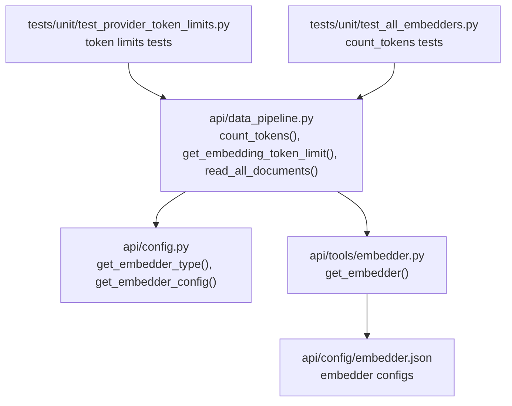
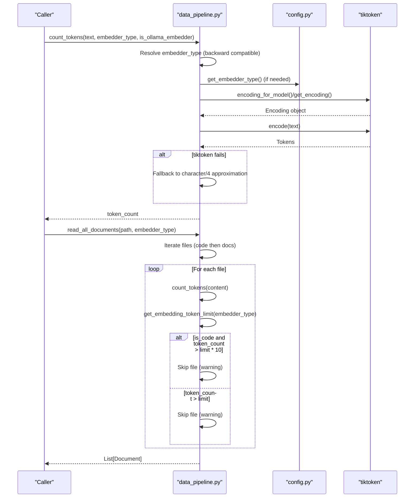
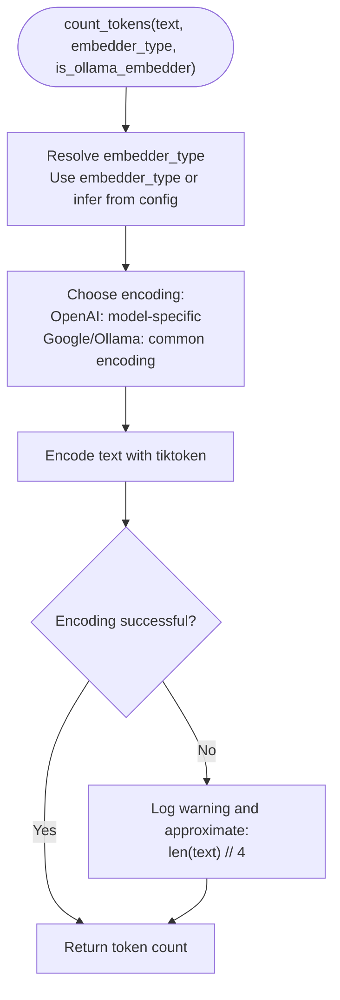
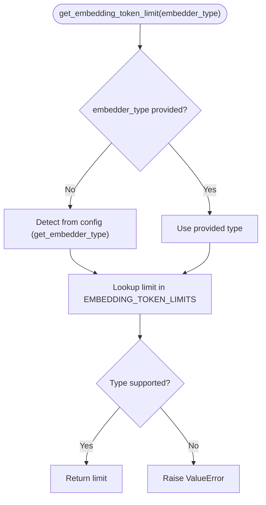
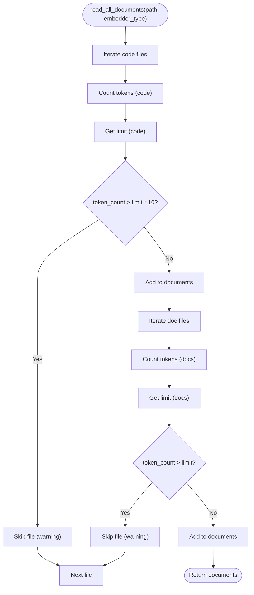
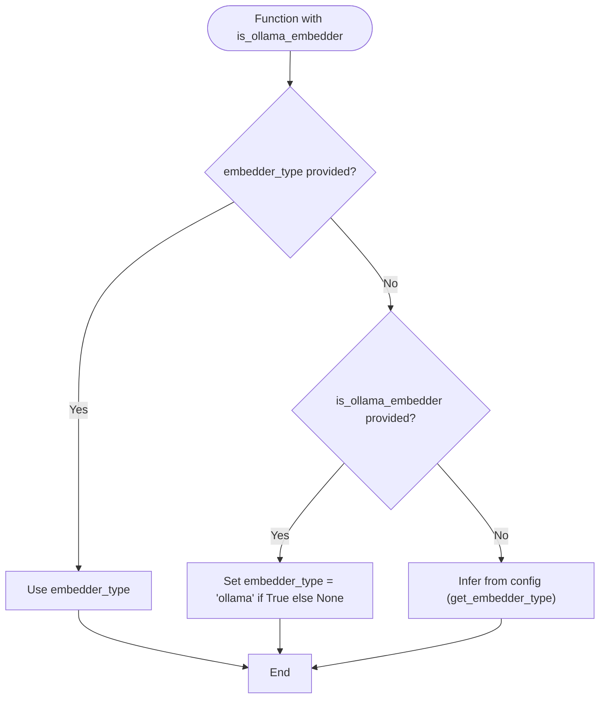
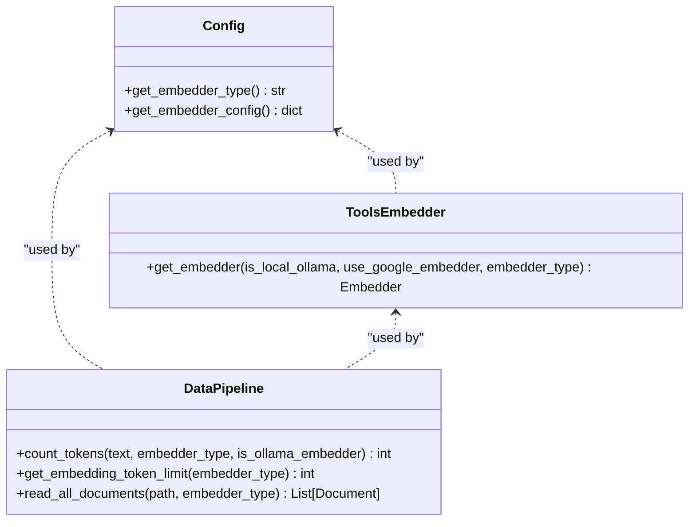
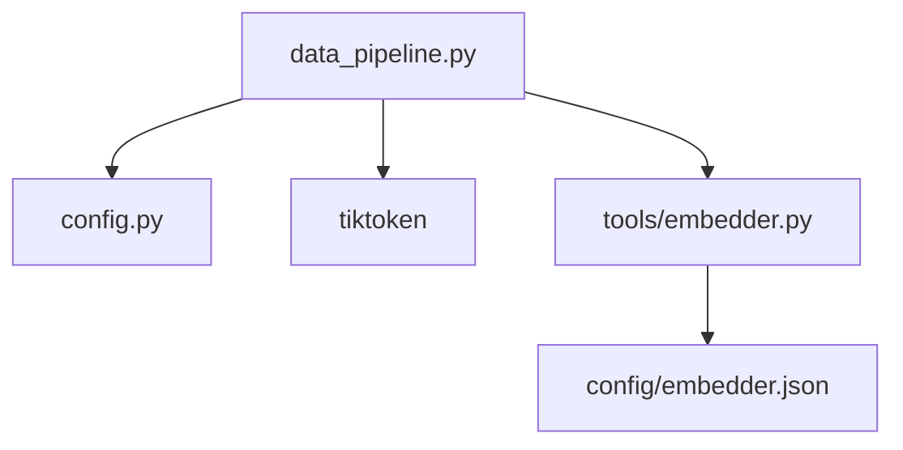

# Token Counting and Validation

<cite>
**Referenced Files in This Document**
- [data_pipeline.py](file://api/data_pipeline.py)
- [config.py](file://api/config.py)
- [embedder.py](file://api/tools/embedder.py)
- [embedder.json](file://api/config/embedder.json)
- [embedder.dashscope.json](file://api/config/embedder.dashscope.json)
- [embedder.github_copilot.json](file://api/config/embedder.github_copilot.json)
- [test_provider_token_limits.py](file://tests/unit/test_provider_token_limits.py)
- [test_all_embedders.py](file://tests/unit/test_all_embedders.py)
</cite>

## Table of Contents
1. [Introduction](#introduction)
2. [Project Structure](#project-structure)
3. [Core Components](#core-components)
4. [Architecture Overview](#architecture-overview)
5. [Detailed Component Analysis](#detailed-component-analysis)
6. [Dependency Analysis](#dependency-analysis)
7. [Performance Considerations](#performance-considerations)
8. [Troubleshooting Guide](#troubleshooting-guide)
9. [Conclusion](#conclusion)

## Introduction
This document explains the token counting and validation system used to estimate and enforce provider-specific token limits for embeddings. It covers:
- The count_tokens function implementation using tiktoken for different embedder types (OpenAI, Google, Ollama)
- Provider-specific token limits and the get_embedding_token_limit function
- Fallback mechanisms when tiktoken fails
- The conservative approach to token estimation
- Validation logic that checks file sizes against embedder limits, including the 10x multiplier for code files
- Practical examples, troubleshooting, and optimization strategies for large files
- Backward compatibility with the deprecated is_ollama_embedder parameter

## Project Structure
The token counting and validation logic is primarily implemented in the data pipeline module and integrated with configuration-driven embedder selection.

**Diagram sources**
- [data_pipeline.py](file://api/data_pipeline.py#L25-L101)
- [config.py](file://api/config.py#L190-L275)
- [embedder.py](file://api/tools/embedder.py#L6-L58)
- [embedder.json](file://api/config/embedder.json#L1-L35)
- [test_provider_token_limits.py](file://tests/unit/test_provider_token_limits.py#L18-L47)
- [test_all_embedders.py](file://tests/unit/test_all_embedders.py#L240-L257)

**Section sources**
- [data_pipeline.py](file://api/data_pipeline.py#L25-L101)
- [config.py](file://api/config.py#L190-L275)
- [embedder.py](file://api/tools/embedder.py#L6-L58)
- [embedder.json](file://api/config/embedder.json#L1-L35)

## Core Components
- Provider-specific token limits: A dictionary defines maximum tokens per provider for embedding.
- Token counting with tiktoken: A function estimates tokens per provider with a fallback approximation.
- Validation logic: Documents are filtered based on token counts versus provider limits, with special handling for code files.
- Backward compatibility: Deprecated is_ollama_embedder parameter is supported via embedder_type resolution.

Key implementation locations:
- Provider token limits and functions: [data_pipeline.py](file://api/data_pipeline.py#L25-L101)
- Backward compatibility handling: [data_pipeline.py](file://api/data_pipeline.py#L75-L83)
- File filtering and validation: [data_pipeline.py](file://api/data_pipeline.py#L348-L388)
- Embedder type detection: [config.py](file://api/config.py#L260-L275)
- Embedder factory: [tools/embedder.py](file://api/tools/embedder.py#L6-L58)

**Section sources**
- [data_pipeline.py](file://api/data_pipeline.py#L25-L101)
- [data_pipeline.py](file://api/data_pipeline.py#L348-L388)
- [config.py](file://api/config.py#L260-L275)
- [embedder.py](file://api/tools/embedder.py#L6-L58)

## Architecture Overview
The token counting and validation pipeline integrates configuration-driven embedder selection with provider-specific token limits and file filtering.

**Diagram sources**
- [data_pipeline.py](file://api/data_pipeline.py#L61-L101)
- [data_pipeline.py](file://api/data_pipeline.py#L177-L406)
- [config.py](file://api/config.py#L260-L275)

## Detailed Component Analysis

### Token Counting with tiktoken
The count_tokens function:
- Resolves embedder_type from parameters or configuration (with backward compatibility for is_ollama_embedder)
- Selects an encoding:
  - OpenAI/GitHub Copilot: Uses a model-specific encoding
  - Google/Ollama: Uses a common encoding suitable for estimation
- Counts tokens via tiktoken
- Falls back to a conservative approximation (characters divided by 4) if tiktoken fails

**Diagram sources**
- [data_pipeline.py](file://api/data_pipeline.py#L61-L101)

**Section sources**
- [data_pipeline.py](file://api/data_pipeline.py#L61-L101)

### Provider-Specific Token Limits and get_embedding_token_limit
The system defines provider-specific limits and exposes a function to retrieve them:
- Limits: OpenAI/GitHub Copilot: 8192; Google: 2048; DashScope/Qwen: 2048; Ollama: 2048
- Function: get_embedding_token_limit resolves the embedder type and returns the appropriate limit, raising an error for unsupported types

**Diagram sources**
- [data_pipeline.py](file://api/data_pipeline.py#L37-L59)
- [config.py](file://api/config.py#L260-L275)

**Section sources**
- [data_pipeline.py](file://api/data_pipeline.py#L25-L59)
- [config.py](file://api/config.py#L260-L275)

### Validation Logic: File Size Checks and Code File Multiplier
The read_all_documents function validates file sizes against provider limits:
- Code files: Allowed up to 10x the provider’s token limit (conservative override for code)
- Documentation files: Must not exceed the provider’s token limit
- Files exceeding limits are skipped with a warning

**Diagram sources**
- [data_pipeline.py](file://api/data_pipeline.py#L328-L406)

**Section sources**
- [data_pipeline.py](file://api/data_pipeline.py#L328-L406)

### Backward Compatibility: is_ollama_embedder Parameter
Deprecated is_ollama_embedder is supported by mapping it to embedder_type:
- If embedder_type is None and is_ollama_embedder is provided, set embedder_type to "ollama" when True, otherwise None
- This ensures legacy callers continue to work while encouraging direct embedder_type usage

**Diagram sources**
- [data_pipeline.py](file://api/data_pipeline.py#L75-L83)

**Section sources**
- [data_pipeline.py](file://api/data_pipeline.py#L75-L83)

### Embedder Selection and Configuration
Embedder selection is driven by configuration and environment variables:
- Embedder type detection: get_embedder_type determines whether the current configuration uses Ollama, Google, GitHub Copilot, or defaults to OpenAI
- Embedder factory: get_embedder constructs the appropriate embedder client based on embedder_type and configuration
- Configuration files define model clients and parameters for each provider

**Diagram sources**
- [config.py](file://api/config.py#L260-L275)
- [embedder.py](file://api/tools/embedder.py#L6-L58)
- [data_pipeline.py](file://api/data_pipeline.py#L61-L101)

**Section sources**
- [config.py](file://api/config.py#L260-L275)
- [embedder.py](file://api/tools/embedder.py#L6-L58)
- [embedder.json](file://api/config/embedder.json#L1-L35)
- [embedder.dashscope.json](file://api/config/embedder.dashscope.json#L1-L19)
- [embedder.github_copilot.json](file://api/config/embedder.github_copilot.json#L1-L26)

## Dependency Analysis
- data_pipeline depends on:
  - config for embedder type detection
  - tiktoken for tokenization
  - tools.embedder for constructing embedders
- Embedder configuration files supply provider-specific model parameters and batch sizes

**Diagram sources**
- [data_pipeline.py](file://api/data_pipeline.py#L1-L20)
- [config.py](file://api/config.py#L1-L20)
- [embedder.py](file://api/tools/embedder.py#L1-L20)
- [embedder.json](file://api/config/embedder.json#L1-L35)

**Section sources**
- [data_pipeline.py](file://api/data_pipeline.py#L1-L20)
- [config.py](file://api/config.py#L1-L20)
- [embedder.py](file://api/tools/embedder.py#L1-L20)
- [embedder.json](file://api/config/embedder.json#L1-L35)

## Performance Considerations
- Token estimation cost: tiktoken encoding is efficient; fallback approximation is constant-time and cheap.
- File filtering overhead: read_all_documents iterates files twice (code then docs); ensure appropriate inclusion/exclusion rules to minimize IO.
- Batch processing: For non-Ollama providers, batch_size is configurable in embedder configuration to improve throughput.
- Conservative limits: Using 10x multiplier for code files reduces risk of truncation but may skip larger files; tune text splitting and chunk sizes to keep files under limit.

[No sources needed since this section provides general guidance]

## Troubleshooting Guide
Common issues and resolutions:
- Unsupported embedder type:
  - Symptom: ValueError when calling get_embedding_token_limit with an unsupported type
  - Resolution: Use supported types: openai, github_copilot, google, dashscope, ollama
  - Reference: [data_pipeline.py](file://api/data_pipeline.py#L55-L57)
- tiktoken failures:
  - Symptom: Warning and fallback approximation
  - Resolution: Ensure tiktoken is installed; fallback approximates tokens as len(text) // 4
  - Reference: [data_pipeline.py](file://api/data_pipeline.py#L97-L101)
- Files skipped due to token limits:
  - Symptom: Warnings indicating files were skipped
  - Resolution: Reduce file size by splitting or excluding large files; note code files allow 10x the limit
  - References: [data_pipeline.py](file://api/data_pipeline.py#L348-L353), [data_pipeline.py](file://api/data_pipeline.py#L383-L388)
- Backward compatibility:
  - Symptom: Passing is_ollama_embedder still works
  - Resolution: Prefer embedder_type for clarity and future-proofing
  - Reference: [data_pipeline.py](file://api/data_pipeline.py#L75-L83)

**Section sources**
- [data_pipeline.py](file://api/data_pipeline.py#L55-L57)
- [data_pipeline.py](file://api/data_pipeline.py#L97-L101)
- [data_pipeline.py](file://api/data_pipeline.py#L348-L353)
- [data_pipeline.py](file://api/data_pipeline.py#L383-L388)
- [data_pipeline.py](file://api/data_pipeline.py#L75-L83)

## Conclusion
The token counting and validation system provides robust, provider-aware token estimation with conservative safeguards:
- Accurate estimation via tiktoken with a reliable fallback
- Clear provider-specific limits and a dedicated function to retrieve them
- Intelligent file filtering that accounts for code files’ higher tolerance
- Backward-compatible handling of deprecated parameters
- Extensible configuration enabling easy addition of new providers

[No sources needed since this section summarizes without analyzing specific files]