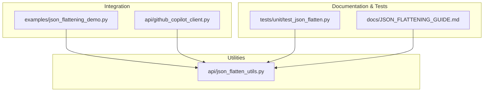
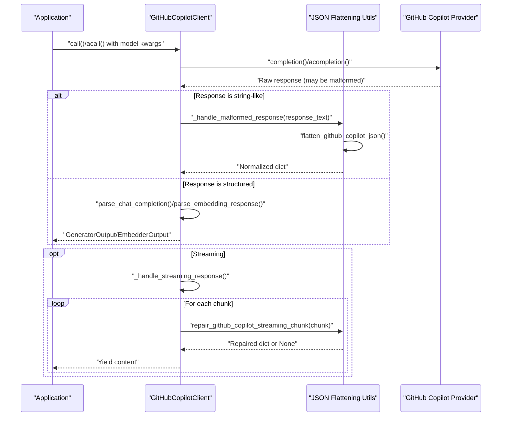
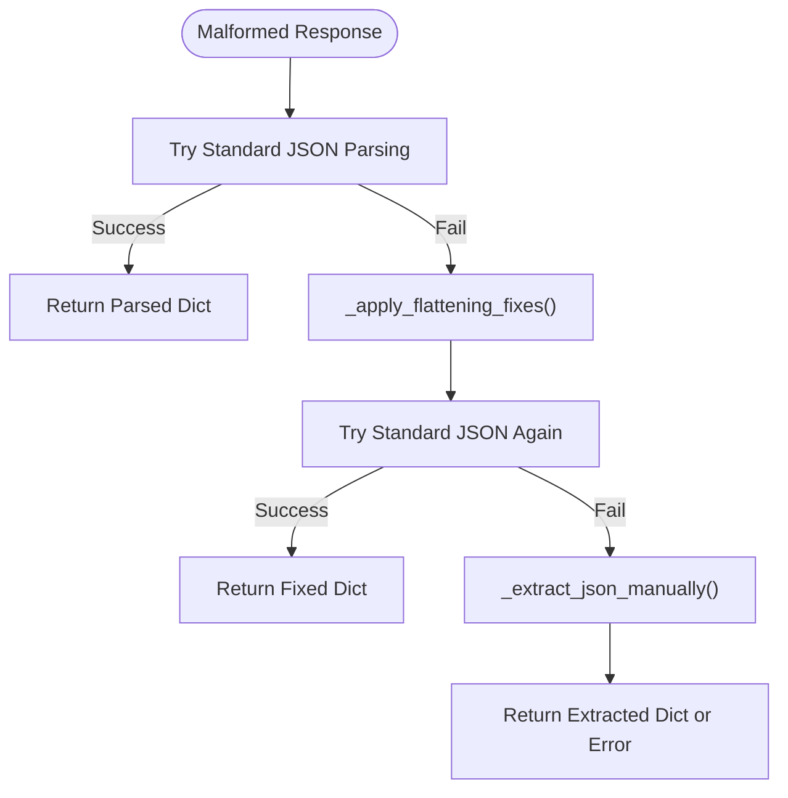
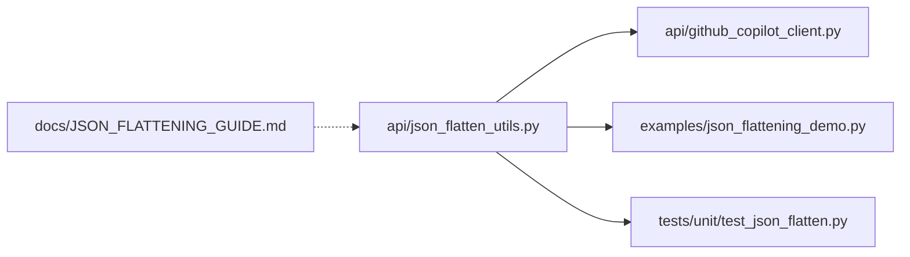

# JSON Flattening Utilities

<cite>
**Referenced Files in This Document**
- [json_flatten_utils.py](file://api/json_flatten_utils.py)
- [github_copilot_client.py](file://api/github_copilot_client.py)
- [json_flattening_demo.py](file://examples/json_flattening_demo.py)
- [JSON_FLATTENING_GUIDE.md](file://docs/JSON_FLATTENING_GUIDE.md)
- [test_json_flatten.py](file://tests/unit/test_json_flatten.py)
</cite>

## Table of Contents
1. [Introduction](#introduction)
2. [Project Structure](#project-structure)
3. [Core Components](#core-components)
4. [Architecture Overview](#architecture-overview)
5. [Detailed Component Analysis](#detailed-component-analysis)
6. [Dependency Analysis](#dependency-analysis)
7. [Performance Considerations](#performance-considerations)
8. [Troubleshooting Guide](#troubleshooting-guide)
9. [Conclusion](#conclusion)
10. [Appendices](#appendices)

## Introduction
This document explains the JSON flattening utilities and transformation system used to normalize malformed GitHub Copilot responses into valid, structured dictionaries. It covers the purpose, algorithms, transformation rules, validation, and integration patterns. Practical examples demonstrate before/after transformations, streaming chunk repair, and best practices for performance and error handling.

## Project Structure
The JSON flattening system is centered around a dedicated module that provides robust parsing and normalization logic, with integration examples and tests validating behavior across realistic scenarios.

**Diagram sources**
- [json_flatten_utils.py](file://api/json_flatten_utils.py#L1-L328)
- [github_copilot_client.py](file://api/github_copilot_client.py#L1-L898)
- [json_flattening_demo.py](file://examples/json_flattening_demo.py#L1-L223)
- [JSON_FLATTENING_GUIDE.md](file://docs/JSON_FLATTENING_GUIDE.md#L1-L319)
- [test_json_flatten.py](file://tests/unit/test_json_flatten.py#L1-L195)

**Section sources**
- [json_flatten_utils.py](file://api/json_flatten_utils.py#L1-L328)
- [github_copilot_client.py](file://api/github_copilot_client.py#L1-L898)
- [json_flattening_demo.py](file://examples/json_flattening_demo.py#L1-L223)
- [JSON_FLATTENING_GUIDE.md](file://docs/JSON_FLATTENING_GUIDE.md#L1-L319)
- [test_json_flatten.py](file://tests/unit/test_json_flatten.py#L1-L195)

## Core Components
- flatten_github_copilot_json: Top-level function that attempts standard JSON parsing, applies flattening fixes, and falls back to manual extraction when necessary.
- _apply_flattening_fixes: Applies a series of regex-based fixes to normalize malformed JSON (markdown wrappers, trailing commas, quotes, streaming artifacts, control characters).
- _extract_json_manually: Regex-driven extraction of key-value pairs when JSON is completely non-conforming.
- validate_github_copilot_response: Validates normalized response structure for chat, embeddings, and auth use cases.
- repair_github_copilot_streaming_chunk: Repairs individual streaming chunks by removing artifacts and normalizing content.
- fix_malformed_json: Backward-compatible alias for flatten_github_copilot_json.

These components work together to transform GitHub Copilot’s often malformed outputs into predictable, structured dictionaries suitable for downstream processing.

**Section sources**
- [json_flatten_utils.py](file://api/json_flatten_utils.py#L16-L302)

## Architecture Overview
The flattening utilities integrate with the GitHub Copilot client to transparently handle malformed responses during both synchronous and asynchronous operations, including streaming.

**Diagram sources**
- [github_copilot_client.py](file://api/github_copilot_client.py#L211-L235)
- [github_copilot_client.py](file://api/github_copilot_client.py#L665-L740)
- [json_flatten_utils.py](file://api/json_flatten_utils.py#L16-L302)

## Detailed Component Analysis

### flatten_github_copilot_json
Purpose:
- Normalize malformed GitHub Copilot responses into a valid dictionary.

Processing logic:
- Fast path: Attempt standard JSON parsing.
- Repair path: Apply regex-based fixes to remove markdown wrappers, trailing commas, inconsistent quotes, streaming artifacts, and control characters.
- Fallback path: Manually extract key-value pairs using targeted patterns.

Key behaviors:
- Handles empty or invalid inputs gracefully with error metadata.
- Preserves original raw text in error cases for diagnostics.
- Wraps array responses into a standardized object structure when appropriate.

Common use cases:
- Chat completions with trailing commas or markdown wrappers.
- Authentication responses with token extraction.
- Embedding responses that arrive as strings.

Integration patterns:
- Used by the GitHub Copilot client for both synchronous and asynchronous calls.
- Streaming chunks are repaired individually before aggregation.

**Section sources**
- [json_flatten_utils.py](file://api/json_flatten_utils.py#L16-L64)

### _apply_flattening_fixes
Purpose:
- Apply a sequence of regex-based transformations to normalize malformed JSON.

Transformation rules:
- Remove markdown code block markers.
- Strip streaming prefixes and artifacts.
- Eliminate trailing commas in objects and arrays.
- Normalize quote usage and fix nested escape sequences.
- Remove control characters that break parsing.
- Extract JSON from wrapped content when present.
- Wrap array responses into a standardized object when identifiable.

Complexity:
- Linear in input length due to single-pass regex substitutions.

Error handling:
- Operates on sanitized inputs and preserves original length for logging.

**Section sources**
- [json_flatten_utils.py](file://api/json_flatten_utils.py#L65-L131)

### _extract_json_manually
Purpose:
- Extract key-value pairs from completely malformed or partially structured text.

Extraction patterns:
- Tokens, model names, content, message content, choices, data, usage, and generic strings.

Post-processing:
- Structures message content into a standardized choices array.
- Wraps standalone content into a choices structure.
- Returns error metadata if nothing is extractable.

Complexity:
- Proportional to number of regex matches and patterns.

**Section sources**
- [json_flatten_utils.py](file://api/json_flatten_utils.py#L133-L222)

### validate_github_copilot_response
Purpose:
- Validate normalized response structure for expected fields and types.

Validation criteria:
- Chat completions: presence of choices with at least one element containing message.content.
- Embeddings: presence of data as a non-empty list.
- Authentication: presence of token.

Returns:
- Boolean indicating whether the response meets expected structure.

**Section sources**
- [json_flatten_utils.py](file://api/json_flatten_utils.py#L224-L267)

### repair_github_copilot_streaming_chunk
Purpose:
- Repair individual streaming chunks that lack proper JSON framing.

Processing:
- Strip streaming prefixes.
- Normalize chunk text.
- Apply flattening logic to reconstruct a valid dictionary.

Edge cases:
- Skips DONE markers and empty chunks.
- Returns None when repair is not possible.

**Section sources**
- [json_flatten_utils.py](file://api/json_flatten_utils.py#L269-L295)

### fix_malformed_json
Purpose:
- Backward-compatible alias for flatten_github_copilot_json.

**Section sources**
- [json_flatten_utils.py](file://api/json_flatten_utils.py#L297-L302)

### Integration with GitHubCopilotClient
- Malformed responses: The client detects string-like responses and routes them through the flattening utilities before parsing.
- Streaming: The client iterates over async chunks, repairs each chunk, and yields content incrementally.
- Validation: After flattening, the client validates the structure to ensure downstream consumers receive reliable data.

**Section sources**
- [github_copilot_client.py](file://api/github_copilot_client.py#L211-L235)
- [github_copilot_client.py](file://api/github_copilot_client.py#L665-L740)
- [github_copilot_client.py](file://api/github_copilot_client.py#L741-L847)

### Practical Examples and Before/After Transformations
The demo showcases typical GitHub Copilot malformations and their resolution:

- Trailing comma normalization.
- Markdown wrapper removal.
- Streaming artifact stripping.
- Mixed quote normalization.
- Line break fixes.
- Manual extraction fallback for non-JSON text containing extractable key-value pairs.
- Streaming chunk repair and content reconstruction.

**Diagram sources**
- [json_flatten_utils.py](file://api/json_flatten_utils.py#L47-L63)
- [json_flatten_utils.py](file://api/json_flatten_utils.py#L65-L131)
- [json_flatten_utils.py](file://api/json_flatten_utils.py#L133-L222)

**Section sources**
- [json_flattening_demo.py](file://examples/json_flattening_demo.py#L29-L71)
- [json_flattening_demo.py](file://examples/json_flattening_demo.py#L155-L198)

## Dependency Analysis
The JSON flattening utilities are consumed by the GitHub Copilot client and demonstrated in the example script. Tests validate correctness across multiple scenarios.

**Diagram sources**
- [json_flatten_utils.py](file://api/json_flatten_utils.py#L1-L328)
- [github_copilot_client.py](file://api/github_copilot_client.py#L12-L17)
- [json_flattening_demo.py](file://examples/json_flattening_demo.py#L17-L21)
- [test_json_flatten.py](file://tests/unit/test_json_flatten.py#L14-L19)
- [JSON_FLATTENING_GUIDE.md](file://docs/JSON_FLATTENING_GUIDE.md#L1-L319)

**Section sources**
- [github_copilot_client.py](file://api/github_copilot_client.py#L12-L17)
- [json_flattening_demo.py](file://examples/json_flattening_demo.py#L17-L21)
- [test_json_flatten.py](file://tests/unit/test_json_flatten.py#L14-L19)

## Performance Considerations
- Fast path: Valid JSON responses bypass regex processing, minimizing overhead.
- Repair path: Regex-based fixes operate in linear time relative to input length.
- Fallback path: Manual extraction is reserved for severe cases and is slower; it should be rare.
- Memory: The utilities process strings and build dictionaries; streaming chunk repair avoids accumulating large payloads by yielding incremental content.
- Logging: Enable debug logging to profile success rates and identify recurring malformed patterns.

[No sources needed since this section provides general guidance]

## Troubleshooting Guide
Common issues and resolutions:
- JSONDecodeError persists after flattening: Verify the raw response is not completely non-JSON; inspect logs for the fallback error payload.
- Flattened response lacks expected structure: Use validation to confirm presence of choices, data, or token; adjust expectations accordingly.
- Slow performance: Confirm most responses use the fast path; investigate frequent malformed patterns that trigger repair or fallback.

Debugging tips:
- Enable detailed logging for the flattening module and client to trace transformations and decisions.
- Run the included tests to validate behavior under known patterns.

**Section sources**
- [JSON_FLATTENING_GUIDE.md](file://docs/JSON_FLATTENING_GUIDE.md#L235-L256)
- [test_json_flatten.py](file://tests/unit/test_json_flatten.py#L1-L195)

## Conclusion
The JSON flattening utilities provide a robust, layered approach to handling GitHub Copilot’s malformed responses. By combining fast-path standard parsing, targeted regex fixes, and manual extraction, the system ensures reliable data for downstream consumers. Integration with the GitHub Copilot client enables seamless operation across synchronous, asynchronous, and streaming workflows.

[No sources needed since this section summarizes without analyzing specific files]

## Appendices

### Transformation Rules Reference
- Markdown wrappers removed.
- Streaming artifacts stripped.
- Trailing commas eliminated.
- Quote normalization and escape fixes.
- Control character removal.
- Wrapped content extraction.
- Array-to-object wrapping for identifiable responses.
- Manual extraction of tokens, content, choices, data, usage, and generic strings.

**Section sources**
- [json_flatten_utils.py](file://api/json_flatten_utils.py#L65-L131)
- [json_flatten_utils.py](file://api/json_flatten_utils.py#L133-L222)

### Extending the Flattening Logic
Guidelines:
- Add new regex patterns to _apply_flattening_fixes for recurring malformed patterns.
- Extend _extract_json_manually with targeted patterns for new key-value structures.
- Update tests to cover new scenarios and ensure validation remains accurate.
- Document new patterns in the guide for future maintainers.

**Section sources**
- [JSON_FLATTENING_GUIDE.md](file://docs/JSON_FLATTENING_GUIDE.md#L292-L319)
- [test_json_flatten.py](file://tests/unit/test_json_flatten.py#L131-L147)