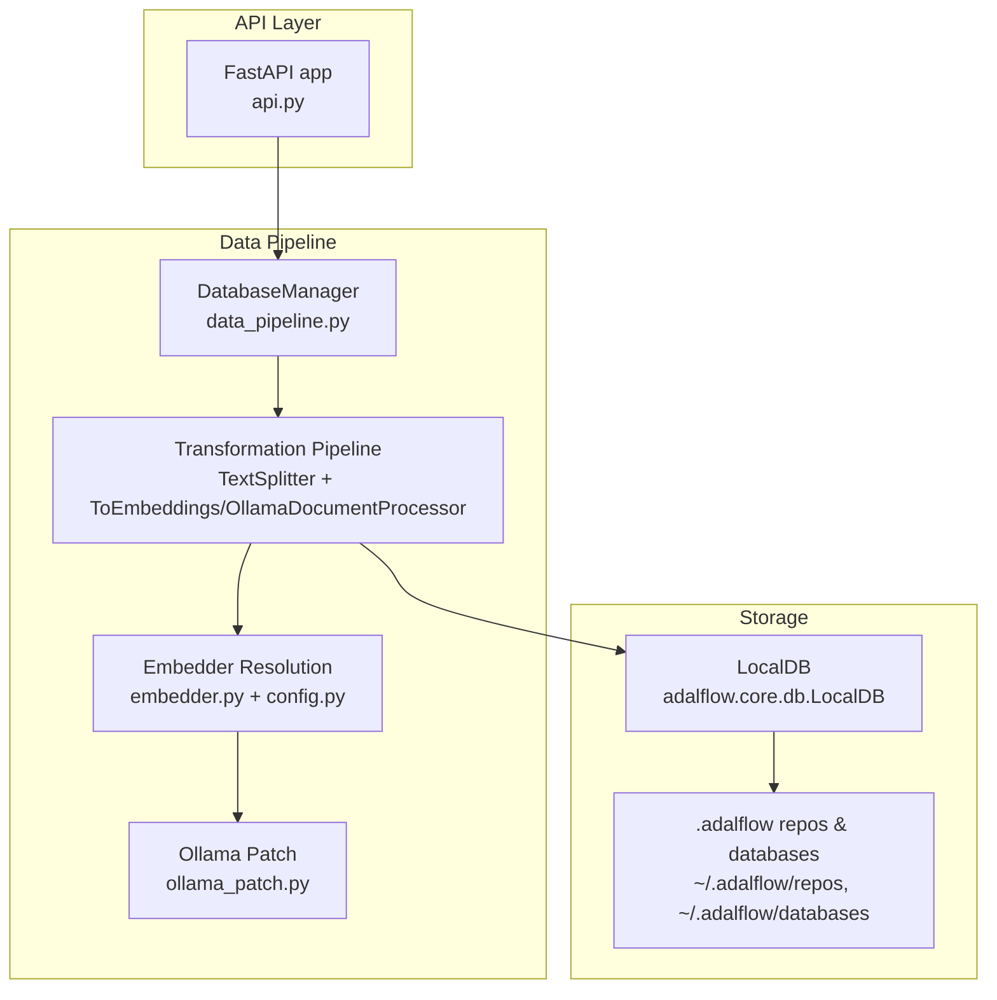
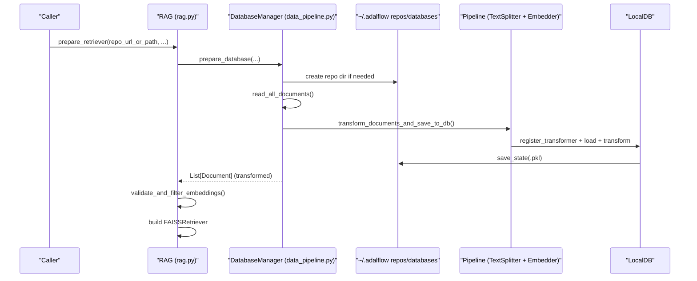
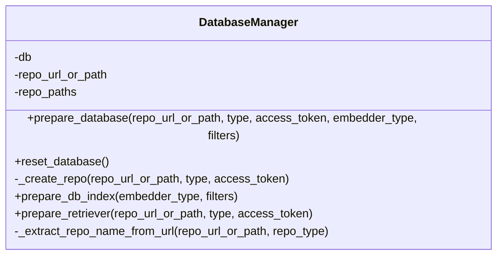
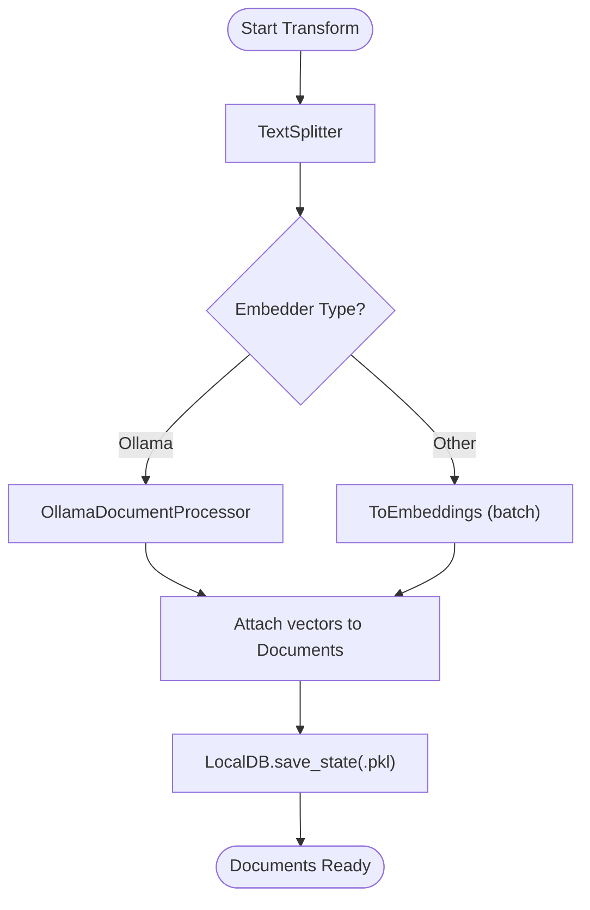
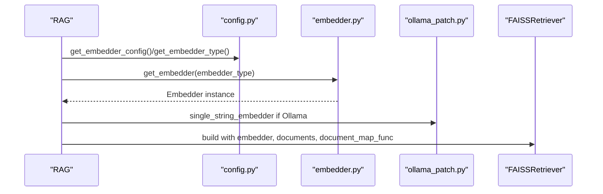
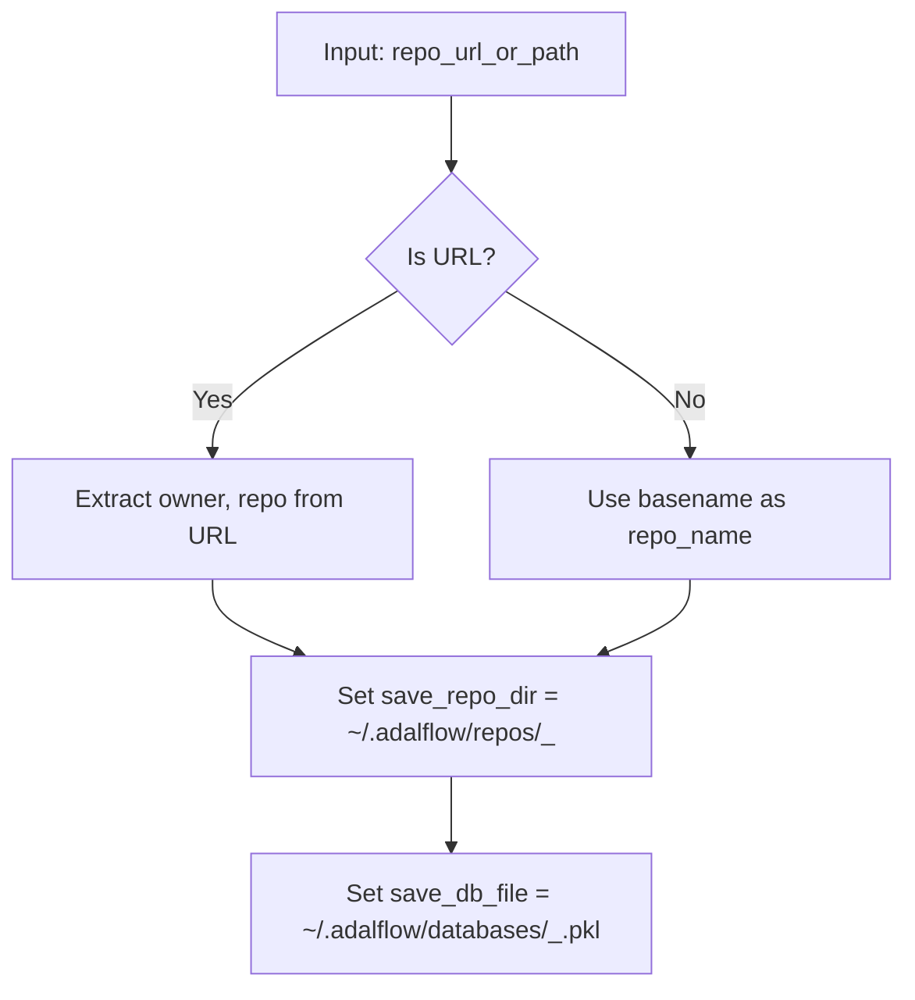
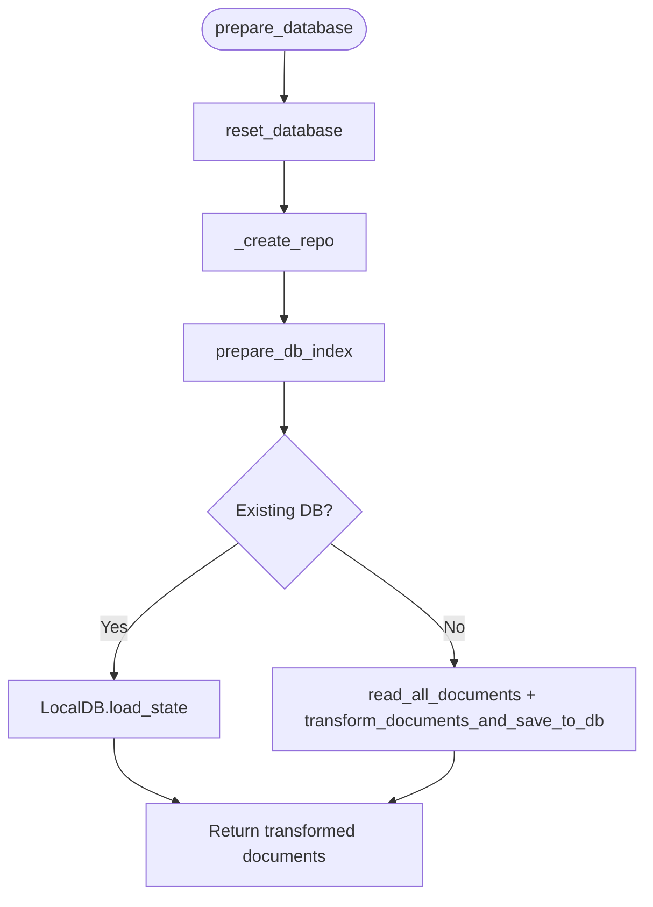
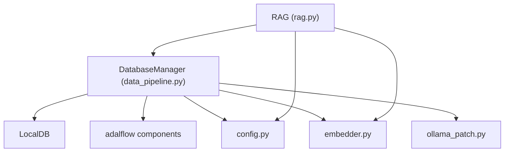

# Database Management

<cite>
**Referenced Files in This Document**
- [data_pipeline.py](file://api/data_pipeline.py)
- [rag.py](file://api/rag.py)
- [embedder.py](file://api/tools/embedder.py)
- [ollama_patch.py](file://api/ollama_patch.py)
- [config.py](file://api/config.py)
- [embedder.json](file://api/config/embedder.json)
- [repo.json](file://api/config/repo.json)
- [api.py](file://api/api.py)
</cite>

## Table of Contents
1. [Introduction](#introduction)
2. [Project Structure](#project-structure)
3. [Core Components](#core-components)
4. [Architecture Overview](#architecture-overview)
5. [Detailed Component Analysis](#detailed-component-analysis)
6. [Dependency Analysis](#dependency-analysis)
7. [Performance Considerations](#performance-considerations)
8. [Troubleshooting Guide](#troubleshooting-guide)
9. [Conclusion](#conclusion)

## Introduction
This document explains the database management system used by the application, focusing on the DatabaseManager class and its lifecycle for preparing, transforming, and indexing repository content into a LocalDB-backed vector store. It covers repository extraction, path management, transformation pipelines, embedding storage, retrieval optimization, and operational guidance for lifecycle management, cleanup, performance tuning, and troubleshooting.

## Project Structure
The database management functionality centers around:
- DatabaseManager: orchestrates repository preparation, document reading, transformation, and persistence/loading of LocalDB.
- Transformation pipeline: text splitting and embeddings via adalflow components.
- Embedding selection: provider-aware embedder resolution.
- Ollama-specific handling: single-document processing and validation.
- Configuration: embedder, retriever, and file filters.

**Diagram sources**
- [data_pipeline.py](file://api/data_pipeline.py#L737-L917)
- [embedder.py](file://api/tools/embedder.py#L6-L59)
- [config.py](file://api/config.py#L170-L278)
- [ollama_patch.py](file://api/ollama_patch.py#L62-L105)
- [api.py](file://api/api.py#L35-L38)

**Section sources**
- [data_pipeline.py](file://api/data_pipeline.py#L1-L917)
- [embedder.py](file://api/tools/embedder.py#L1-L59)
- [config.py](file://api/config.py#L1-L464)
- [api.py](file://api/api.py#L35-L38)

## Core Components
- DatabaseManager: encapsulates repository extraction, LocalDB preparation, and index creation. It manages paths under ~/.adalflow/repos and ~/.adalflow/databases and coordinates the transformation pipeline.
- Transformation pipeline: composed of TextSplitter followed by ToEmbeddings (batch) or OllamaDocumentProcessor (single-document). It produces Document objects with vectors attached.
- Embedder resolution: selects the appropriate embedder client based on configuration and provider.
- OllamaDocumentProcessor: ensures consistent single-document embedding processing and validates embedding sizes.

Key responsibilities:
- Prepare database: clone/download repo, persist to ~/.adalflow/repos, transform and save to ~/.adalflow/databases/<repo>.pkl, and return transformed documents.
- Load database: reuse existing persisted state when available.
- Validation: ensure embedding sizes are consistent before building retrievers.

**Section sources**
- [data_pipeline.py](file://api/data_pipeline.py#L737-L917)
- [embedder.py](file://api/tools/embedder.py#L6-L59)
- [ollama_patch.py](file://api/ollama_patch.py#L62-L105)

## Architecture Overview
The end-to-end flow from repository input to retriever-ready documents:

**Diagram sources**
- [rag.py](file://api/rag.py#L345-L415)
- [data_pipeline.py](file://api/data_pipeline.py#L747-L902)
- [embedder.py](file://api/tools/embedder.py#L6-L59)

## Detailed Component Analysis

### DatabaseManager
Responsibilities:
- prepare_database: orchestrates repository creation and index preparation.
- reset_database: clears internal state.
- _create_repo: resolves repo name from URL or path, creates ~/.adalflow/repos and ~/.adalflow/databases paths.
- prepare_db_index: loads existing LocalDB if available, otherwise builds from scratch, persists, and returns transformed documents.
- prepare_retriever: compatibility wrapper delegating to prepare_database.

Paths and naming:
- Repositories are stored under ~/.adalflow/repos/<owner>_<repo>/ for URLs; local paths are used directly.
- Databases are stored under ~/.adalflow/databases/<owner>_<repo>.pkl.

**Diagram sources**
- [data_pipeline.py](file://api/data_pipeline.py#L737-L917)

**Section sources**
- [data_pipeline.py](file://api/data_pipeline.py#L737-L917)

### Transformation Pipeline and Embedding Storage
- TextSplitter: chunking strategy and overlap are configured via embedder.json.
- ToEmbeddings: batch embedding for providers that support batching.
- OllamaDocumentProcessor: single-document processing with embedding size validation and consistency checks.
- LocalDB: stores transformed Documents with vectors and persists state to disk.

**Diagram sources**
- [data_pipeline.py](file://api/data_pipeline.py#L408-L476)
- [embedder.json](file://api/config/embedder.json#L27-L34)
- [ollama_patch.py](file://api/ollama_patch.py#L62-L105)

**Section sources**
- [data_pipeline.py](file://api/data_pipeline.py#L408-L476)
- [embedder.json](file://api/config/embedder.json#L27-L34)
- [ollama_patch.py](file://api/ollama_patch.py#L62-L105)

### Embedding Selection and Retrieval Optimization
- Embedder resolution: choose embedder based on configuration (openai, google, ollama, github_copilot).
- Retrieval: FAISSRetriever built with validated documents and a document_map_func that extracts vectors.

**Diagram sources**
- [rag.py](file://api/rag.py#L157-L208)
- [config.py](file://api/config.py#L183-L278)
- [embedder.py](file://api/tools/embedder.py#L6-L59)
- [ollama_patch.py](file://api/ollama_patch.py#L17-L61)

**Section sources**
- [rag.py](file://api/rag.py#L157-L208)
- [config.py](file://api/config.py#L183-L278)
- [embedder.py](file://api/tools/embedder.py#L6-L59)
- [ollama_patch.py](file://api/ollama_patch.py#L17-L61)

### Repository Naming Conventions and Path Management
- URL-based naming: owner and repo extracted from URLs to form a unique directory name.
- Local paths: repo name equals the basename of the provided path.
- Paths:
  - ~/.adalflow/repos/<owner>_<repo>/
  - ~/.adalflow/databases/<owner>_<repo>.pkl

**Diagram sources**
- [data_pipeline.py](file://api/data_pipeline.py#L801-L850)

**Section sources**
- [data_pipeline.py](file://api/data_pipeline.py#L801-L850)

### prepare_database Workflow
End-to-end steps:
1. reset_database
2. _create_repo: ensure repo directory and database file path exist
3. prepare_db_index:
   - If database exists, load and return transformed documents
   - Else, read_all_documents, transform, save to LocalDB, return transformed documents

**Diagram sources**
- [data_pipeline.py](file://api/data_pipeline.py#L747-L902)

**Section sources**
- [data_pipeline.py](file://api/data_pipeline.py#L747-L902)

## Dependency Analysis
- DatabaseManager depends on:
  - LocalDB for persistence
  - adalflow components for transformation
  - Embedder resolution and provider configuration
  - OllamaDocumentProcessor for Ollama-specific handling
- RAG integrates DatabaseManager to prepare retrievers and validates embeddings before building FAISSRetriever.

**Diagram sources**
- [data_pipeline.py](file://api/data_pipeline.py#L737-L917)
- [rag.py](file://api/rag.py#L246-L415)
- [config.py](file://api/config.py#L170-L278)
- [embedder.py](file://api/tools/embedder.py#L6-L59)
- [ollama_patch.py](file://api/ollama_patch.py#L62-L105)

**Section sources**
- [data_pipeline.py](file://api/data_pipeline.py#L737-L917)
- [rag.py](file://api/rag.py#L246-L415)
- [config.py](file://api/config.py#L170-L278)
- [embedder.py](file://api/tools/embedder.py#L6-L59)
- [ollama_patch.py](file://api/ollama_patch.py#L62-L105)

## Performance Considerations
- Chunking and overlap: configured in embedder.json; tune chunk_size and chunk_overlap to balance recall and cost.
- Batch size: controlled by embedder configuration; larger batches reduce API calls but increase memory usage.
- Token limits: provider-specific limits enforced during document reading; large files may be skipped to prevent oversized inputs.
- Ollama processing: single-document processing avoids batching limitations but increases latency; ensure consistent embedding sizes to avoid filtering.
- Persistence: LocalDB saves state to disk; ensure sufficient disk space and consider pruning old caches.

[No sources needed since this section provides general guidance]

## Troubleshooting Guide
Common issues and resolutions:
- Database load failure:
  - Symptom: errors when loading existing database state.
  - Action: catch exceptions and rebuild the database; verify file permissions and path correctness.
- Embedding size mismatch:
  - Symptom: FAISS retriever creation fails due to inconsistent embedding sizes.
  - Action: use the validation routine to filter out mismatched documents; ensure consistent embedder configuration.
- Ollama model not found:
  - Symptom: runtime errors indicating model availability.
  - Action: check model existence via the provided helper and pull the model if missing.
- Large files exceeding token limits:
  - Symptom: warnings and skipping of large files.
  - Action: adjust token limits or exclude large files via filters.
- Cleanup and lifecycle:
  - Delete stale caches and databases under ~/.adalflow to reclaim space.
  - Re-run prepare_database to regenerate indices after configuration changes.

**Section sources**
- [data_pipeline.py](file://api/data_pipeline.py#L872-L885)
- [rag.py](file://api/rag.py#L392-L414)
- [ollama_patch.py](file://api/ollama_patch.py#L21-L61)
- [config.py](file://api/config.py#L309-L348)

## Conclusion
The database management system provides a robust pipeline for transforming repository content into a retrievable vector store. DatabaseManager centralizes repository preparation, path management, and LocalDB persistence. The transformation pipeline adapts to provider capabilities, with special handling for Ollama. Proper configuration, validation, and lifecycle management ensure reliable retrieval performance and maintainable operations.