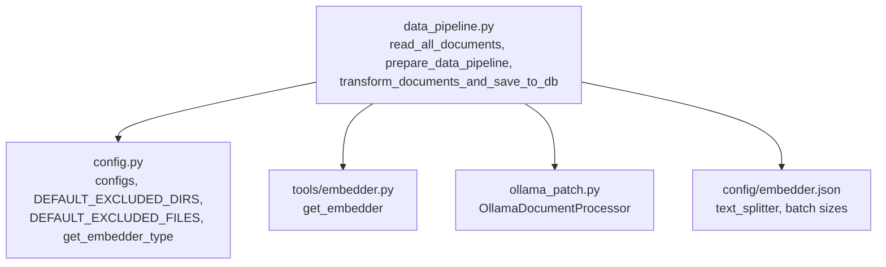
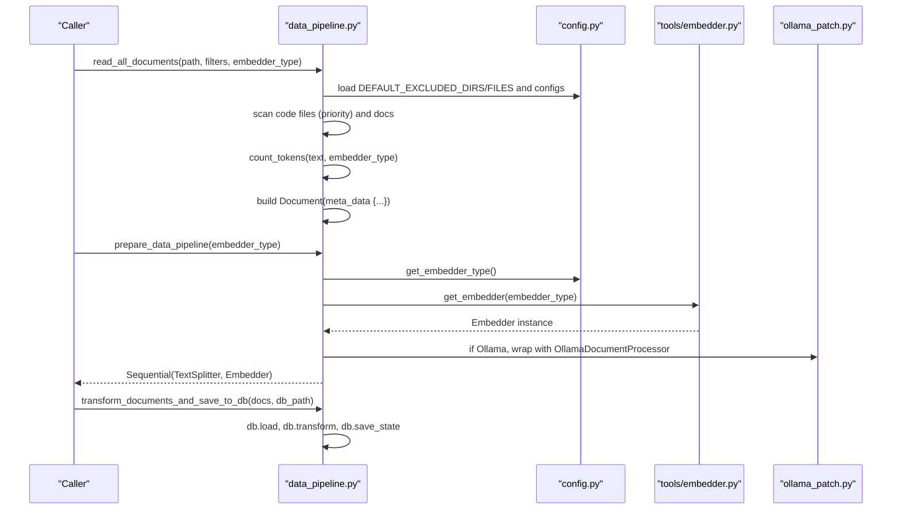
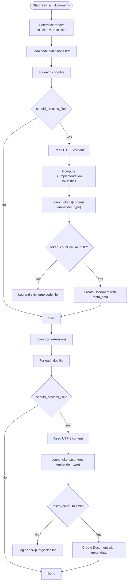
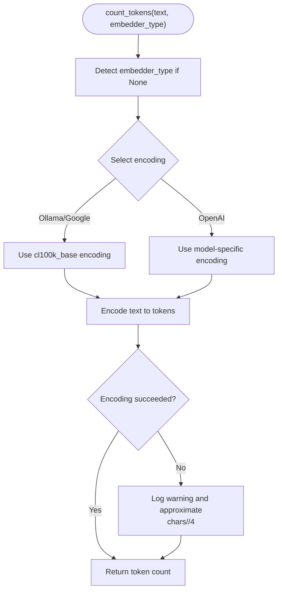
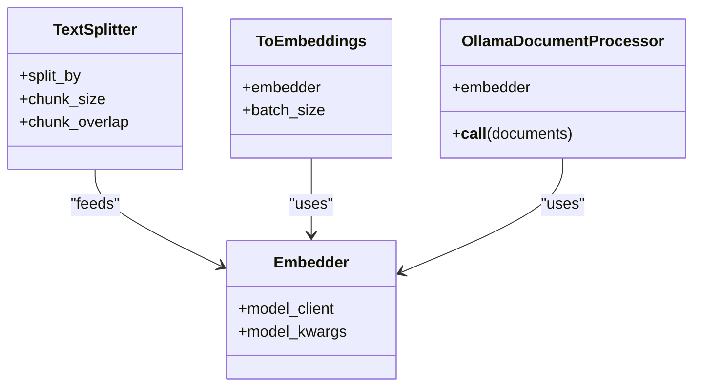
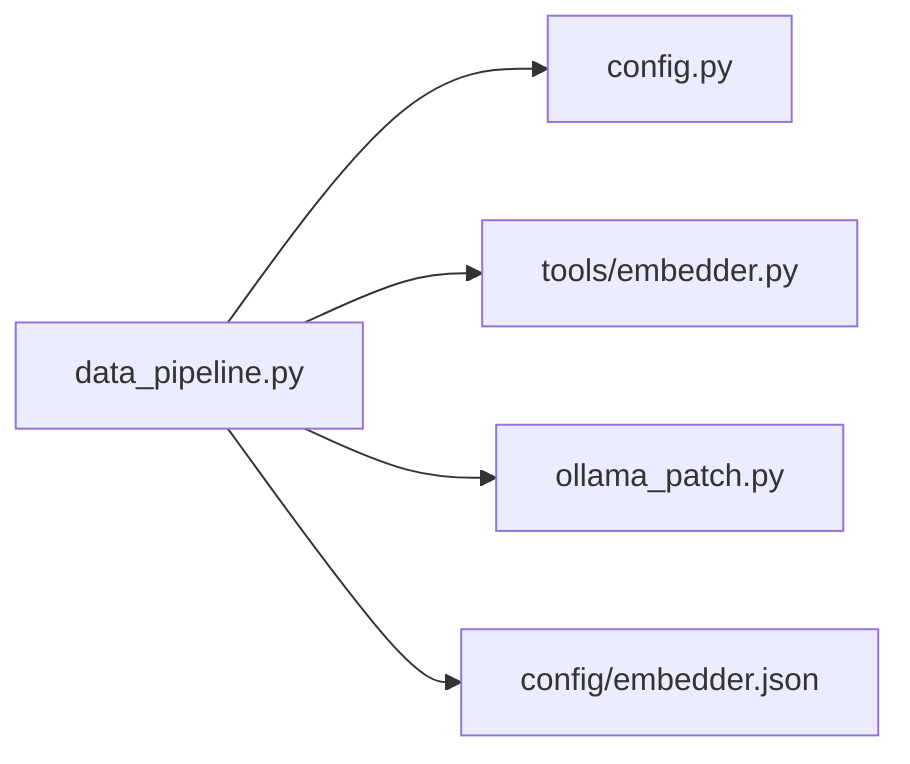

# Document Processing Pipeline

<cite>
**Referenced Files in This Document**
- [data_pipeline.py](file://api/data_pipeline.py)
- [config.py](file://api/config.py)
- [embedder.py](file://api/tools/embedder.py)
- [ollama_patch.py](file://api/ollama_patch.py)
- [embedder.json](file://api/config/embedder.json)
</cite>

## Table of Contents
1. [Introduction](#introduction)
2. [Project Structure](#project-structure)
3. [Core Components](#core-components)
4. [Architecture Overview](#architecture-overview)
5. [Detailed Component Analysis](#detailed-component-analysis)
6. [Dependency Analysis](#dependency-analysis)
7. [Performance Considerations](#performance-considerations)
8. [Troubleshooting Guide](#troubleshooting-guide)
9. [Conclusion](#conclusion)

## Introduction
This document explains the end-to-end document processing pipeline used to ingest repository files, filter them according to inclusion/exclusion rules, compute token counts with provider-specific limits, construct Document objects with rich metadata, and transform them into vector embeddings via a text splitting and embedding pipeline powered by Adalflow components. It also covers practical configuration patterns, performance optimization strategies, and troubleshooting approaches for common issues such as encoding errors, large file handling, and memory optimization.

## Project Structure
The pipeline spans several modules:
- Data ingestion and filtering: [data_pipeline.py](file://api/data_pipeline.py)
- Configuration and defaults: [config.py](file://api/config.py)
- Embedder factory and selection: [embedder.py](file://api/tools/embedder.py)
- Ollama-specific batching and validation: [ollama_patch.py](file://api/ollama_patch.py)
- Provider configuration: [embedder.json](file://api/config/embedder.json)

**Diagram sources**
- [data_pipeline.py](file://api/data_pipeline.py#L177-L406)
- [config.py](file://api/config.py#L309-L348)
- [embedder.py](file://api/tools/embedder.py#L6-L59)
- [ollama_patch.py](file://api/ollama_patch.py#L62-L105)
- [embedder.json](file://api/config/embedder.json#L1-L35)

**Section sources**
- [data_pipeline.py](file://api/data_pipeline.py#L1-L917)
- [config.py](file://api/config.py#L1-L464)
- [embedder.py](file://api/tools/embedder.py#L1-L59)
- [ollama_patch.py](file://api/ollama_patch.py#L1-L105)
- [embedder.json](file://api/config/embedder.json#L1-L35)

## Core Components
- read_all_documents: Recursively scans a directory, applies inclusion/exclusion filters, validates token counts per provider limit, and constructs Document objects with metadata.
- Token counting: Uses provider-aware encodings and falls back to a character-based approximation when tokenization fails.
- Provider-specific limits: Enforces per-provider token limits for embedding.
- Document construction: Adds file path, type, implementation flags, and token count to metadata.
- Text splitting and embeddings: Uses Adalflow TextSplitter and ToEmbeddings or OllamaDocumentProcessor depending on provider.
- Persistence: Saves transformed documents to a local database.

**Section sources**
- [data_pipeline.py](file://api/data_pipeline.py#L177-L406)
- [data_pipeline.py](file://api/data_pipeline.py#L37-L102)
- [data_pipeline.py](file://api/data_pipeline.py#L408-L476)
- [embedder.py](file://api/tools/embedder.py#L6-L59)
- [ollama_patch.py](file://api/ollama_patch.py#L62-L105)

## Architecture Overview
The pipeline follows a staged flow:
1. Filter and read files (code-first, then docs).
2. Compute token counts with provider-aware encoding.
3. Construct Document objects with metadata.
4. Build a data transformation pipeline (TextSplitter → Embedder).
5. Transform and persist to a local database.

**Diagram sources**
- [data_pipeline.py](file://api/data_pipeline.py#L177-L406)
- [data_pipeline.py](file://api/data_pipeline.py#L408-L476)
- [config.py](file://api/config.py#L260-L274)
- [embedder.py](file://api/tools/embedder.py#L6-L59)
- [ollama_patch.py](file://api/ollama_patch.py#L62-L105)

## Detailed Component Analysis

### read_all_documents: File Filtering, Priority Order, and Document Creation
- Filtering modes:
  - Inclusion mode: Only files in included directories or matching included file patterns are processed.
  - Exclusion mode: Default excludes plus any configured or passed exclusions.
- Priority order:
  - Code files are scanned first, then documentation files.
- Implementation detection:
  - Heuristics mark a file as implementation if it is not prefixed with test_ or app_, and does not contain “test”.
- Token validation:
  - Code files: allowed up to 10x provider token limit.
  - Docs files: allowed up to provider token limit.
- Document metadata:
  - file_path, type, is_code, is_implementation, title, token_count.

**Diagram sources**
- [data_pipeline.py](file://api/data_pipeline.py#L177-L406)

**Section sources**
- [data_pipeline.py](file://api/data_pipeline.py#L177-L406)

### Token Counting and Provider-Specific Limits
- Encoding selection:
  - Ollama and Google: use a cl100k_base-based encoding.
  - OpenAI: uses a model-specific encoder.
- Fallback:
  - On tokenization failure, falls back to a character-based approximation.
- Limits:
  - Provider-specific maximums enforced per configuration.
  - Code files allowed up to 10x the limit; docs files allowed up to the limit.

**Diagram sources**
- [data_pipeline.py](file://api/data_pipeline.py#L61-L102)

**Section sources**
- [data_pipeline.py](file://api/data_pipeline.py#L25-L59)
- [data_pipeline.py](file://api/data_pipeline.py#L61-L102)

### Text Splitting and Embedding Transformation Pipeline
- TextSplitter:
  - Configured via text_splitter settings in embedder configuration.
- Embedder selection:
  - get_embedder selects provider-specific embedder based on configuration or explicit type.
- Batch processing:
  - For non-Ollama providers, ToEmbeddings uses batch_size from configuration.
- Ollama handling:
  - OllamaDocumentProcessor processes documents individually, validates consistent embedding sizes, and logs failures.

**Diagram sources**
- [data_pipeline.py](file://api/data_pipeline.py#L408-L476)
- [embedder.py](file://api/tools/embedder.py#L6-L59)
- [ollama_patch.py](file://api/ollama_patch.py#L62-L105)
- [embedder.json](file://api/config/embedder.json#L30-L34)

**Section sources**
- [data_pipeline.py](file://api/data_pipeline.py#L408-L476)
- [embedder.py](file://api/tools/embedder.py#L6-L59)
- [ollama_patch.py](file://api/ollama_patch.py#L62-L105)
- [embedder.json](file://api/config/embedder.json#L1-L35)

### Practical Examples and Configuration Patterns
- Filter configuration:
  - Inclusion mode: supply included_dirs and/or included_files to restrict processing to specific paths/patterns.
  - Exclusion mode: supply excluded_dirs and/or excluded_files to skip unwanted paths/patterns; defaults are combined from configuration.
- Custom file processing rules:
  - Adjust DEFAULT_EXCLUDED_DIRS and DEFAULT_EXCLUDED_FILES in configuration to tailor filtering behavior.
  - Override per-run by passing excluded_/included_* parameters to read_all_documents.
- Provider selection:
  - Explicit embedder_type overrides auto-detection.
  - Embedding batch sizes and model parameters are taken from embedder configuration.

**Section sources**
- [data_pipeline.py](file://api/data_pipeline.py#L177-L256)
- [config.py](file://api/config.py#L309-L348)
- [embedder.py](file://api/tools/embedder.py#L6-L59)
- [embedder.json](file://api/config/embedder.json#L1-L35)

## Dependency Analysis
- read_all_documents depends on:
  - config for DEFAULT_EXCLUDED_DIRS/FILES and embedder type resolution.
  - tools.embedder for constructing the embedder.
  - ollama_patch for Ollama-specific processing.
- prepare_data_pipeline composes:
  - TextSplitter from configuration.
  - Embedder via get_embedder.
  - ToEmbeddings or OllamaDocumentProcessor depending on provider.

**Diagram sources**
- [data_pipeline.py](file://api/data_pipeline.py#L177-L476)
- [config.py](file://api/config.py#L309-L348)
- [embedder.py](file://api/tools/embedder.py#L6-L59)
- [ollama_patch.py](file://api/ollama_patch.py#L62-L105)
- [embedder.json](file://api/config/embedder.json#L1-L35)

**Section sources**
- [data_pipeline.py](file://api/data_pipeline.py#L177-L476)
- [config.py](file://api/config.py#L309-L348)
- [embedder.py](file://api/tools/embedder.py#L6-L59)
- [ollama_patch.py](file://api/ollama_patch.py#L62-L105)
- [embedder.json](file://api/config/embedder.json#L1-L35)

## Performance Considerations
- Tokenization cost:
  - Prefer model-specific encodings for accuracy; fallback to char-based approximation when tokenization fails.
- Large file handling:
  - Code files are allowed up to 10x the provider limit; docs files are constrained by the provider limit. Files exceeding limits are skipped with warnings.
- Memory optimization:
  - OllamaDocumentProcessor processes documents individually and validates consistent embedding sizes, reducing memory spikes and ensuring uniform vectors.
  - Non-Ollama providers use batched embeddings with configurable batch_size from configuration.
- I/O efficiency:
  - Reads files in two passes (code then docs) to prioritize implementation files and reduce unnecessary scanning.

[No sources needed since this section provides general guidance]

## Troubleshooting Guide
- Encoding errors:
  - Symptom: Exceptions when opening files with UTF-8 encoding.
  - Resolution: Ensure repository files are UTF-8; catch exceptions and log errors per file.
- Large file handling:
  - Symptom: Warnings about skipping files due to token count exceeding limits.
  - Resolution: Increase provider limit allowance cautiously; consider excluding large binaries or docs; adjust text_splitter chunk sizes.
- Memory optimization:
  - Symptom: Out-of-memory during embeddings.
  - Resolution: Reduce batch_size; switch to OllamaDocumentProcessor for Ollama; validate embedding sizes and skip inconsistent vectors.
- Provider mismatch:
  - Symptom: Unexpected token limits or encoding behavior.
  - Resolution: Explicitly set embedder_type or configure embedder.json appropriately; verify get_embedder_type resolves as expected.

**Section sources**
- [data_pipeline.py](file://api/data_pipeline.py#L336-L369)
- [data_pipeline.py](file://api/data_pipeline.py#L378-L403)
- [data_pipeline.py](file://api/data_pipeline.py#L348-L353)
- [data_pipeline.py](file://api/data_pipeline.py#L384-L388)
- [ollama_patch.py](file://api/ollama_patch.py#L71-L105)
- [embedder.json](file://api/config/embedder.json#L1-L35)

## Conclusion
The document processing pipeline provides a robust, provider-aware mechanism to filter, tokenize, split, embed, and persist repository content. By combining inclusion/exclusion rules, provider-specific token limits, and Adalflow components, it supports scalable ingestion of both code and documentation while maintaining performance and reliability. Proper configuration of filters, embedder settings, and text splitting parameters ensures efficient and accurate downstream retrieval and generation tasks.