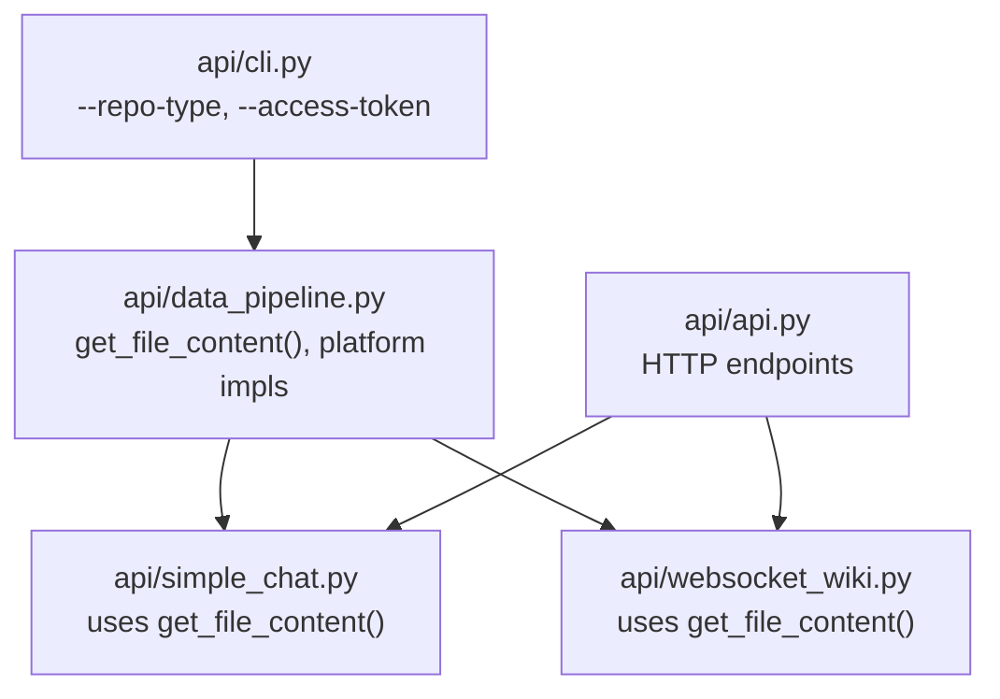
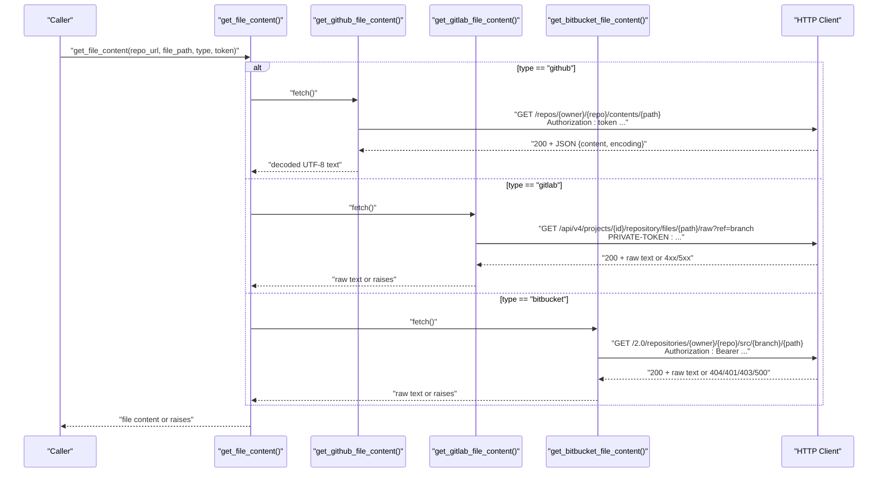
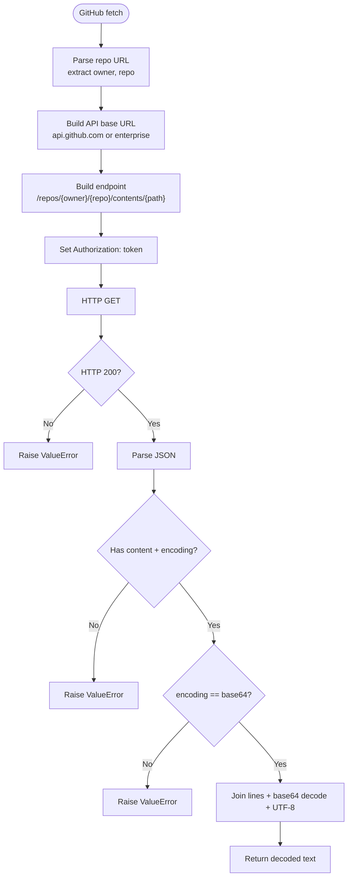
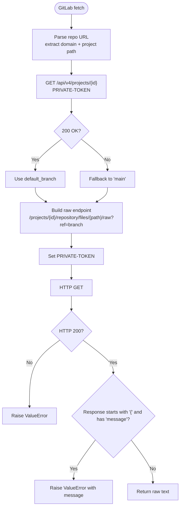
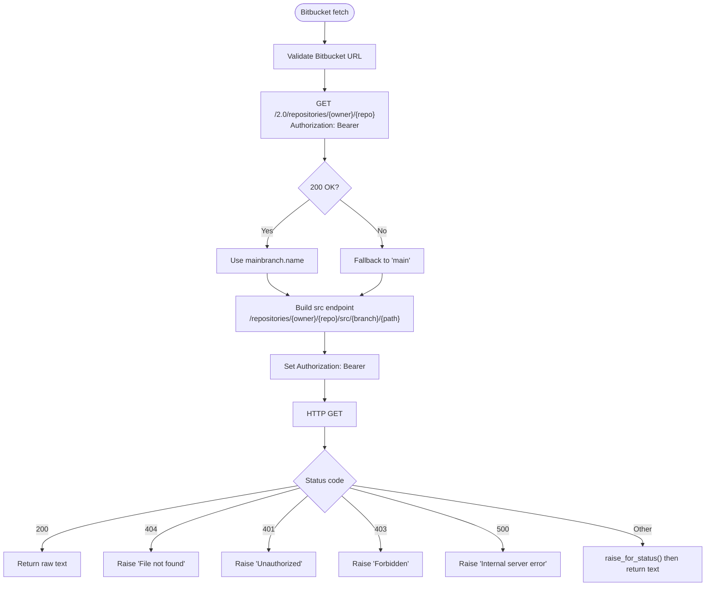
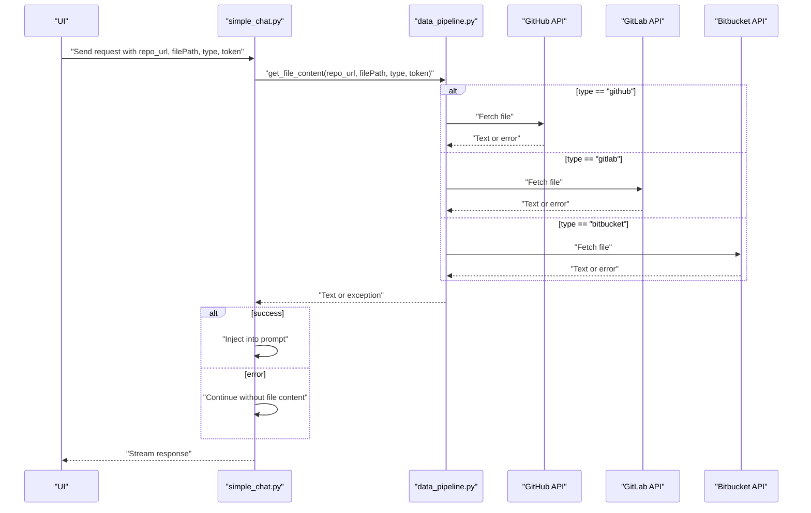
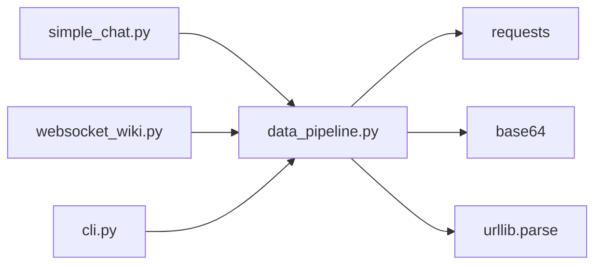

# File Content Retrieval

<cite>
**Referenced Files in This Document**
- [data_pipeline.py](file://api/data_pipeline.py)
- [simple_chat.py](file://api/simple_chat.py)
- [websocket_wiki.py](file://api/websocket_wiki.py)
- [cli.py](file://api/cli.py)
- [api.py](file://api/api.py)
</cite>

## Table of Contents
1. [Introduction](#introduction)
2. [Project Structure](#project-structure)
3. [Core Components](#core-components)
4. [Architecture Overview](#architecture-overview)
5. [Detailed Component Analysis](#detailed-component-analysis)
6. [Dependency Analysis](#dependency-analysis)
7. [Performance Considerations](#performance-considerations)
8. [Troubleshooting Guide](#troubleshooting-guide)
9. [Conclusion](#conclusion)

## Introduction
This document explains the file content retrieval system used by the application to fetch individual files from hosted Git repositories. It focuses on the get_file_content function and its platform-specific implementations for GitHub, GitLab, and Bitbucket. It covers API endpoint usage, response parsing, content decoding, authentication methods, error handling, rate-limiting considerations, and fallback strategies. Practical examples demonstrate file path resolution, branch detection for private repositories, and troubleshooting common issues such as file-not-found, permission denials, and API quota limits.

## Project Structure
The file content retrieval logic resides primarily in the data pipeline module and is consumed by higher-level services such as the interactive chat and WebSocket wiki generators. The CLI also supports specifying repository type and access tokens for private repositories.

**Diagram sources**
- [data_pipeline.py](file://api/data_pipeline.py#L712-L736)
- [simple_chat.py](file://api/simple_chat.py#L291-L316)
- [websocket_wiki.py](file://api/websocket_wiki.py#L396-L421)
- [cli.py](file://api/cli.py#L94-L103)
- [api.py](file://api/api.py#L460-L502)

**Section sources**
- [data_pipeline.py](file://api/data_pipeline.py#L712-L736)
- [simple_chat.py](file://api/simple_chat.py#L291-L316)
- [websocket_wiki.py](file://api/websocket_wiki.py#L396-L421)
- [cli.py](file://api/cli.py#L94-L103)
- [api.py](file://api/api.py#L460-L502)

## Core Components
- get_file_content: A dispatcher that selects the appropriate platform-specific implementation based on the repository type.
- get_github_file_content: Fetches a file via the GitHub API, decodes base64 content, and handles error responses.
- get_gitlab_file_content: Fetches a file via the GitLab API, detects default branch, and handles JSON error responses.
- get_bitbucket_file_content: Fetches a file via the Bitbucket API, detects default branch, and maps HTTP status codes to user-friendly errors.
- Consumers: Interactive chat and WebSocket wiki generators call get_file_content to inject current file content into prompts.

Key behaviors:
- Authentication headers differ by platform (GitHub token, GitLab PRIVATE-TOKEN, Bitbucket Bearer).
- Content decoding differs by platform (GitHub returns base64-encoded text; GitLab returns raw text; Bitbucket returns raw text).
- Branch detection attempts to infer default branches from repository metadata when possible.

**Section sources**
- [data_pipeline.py](file://api/data_pipeline.py#L477-L554)
- [data_pipeline.py](file://api/data_pipeline.py#L555-L635)
- [data_pipeline.py](file://api/data_pipeline.py#L637-L711)
- [data_pipeline.py](file://api/data_pipeline.py#L712-L736)
- [simple_chat.py](file://api/simple_chat.py#L291-L316)
- [websocket_wiki.py](file://api/websocket_wiki.py#L396-L421)

## Architecture Overview
The retrieval flow is a thin HTTP client wrapper around each platform’s official API. The system does not rely on Git LFS or local clones for single-file retrieval; instead, it uses the respective platform’s REST API.

**Diagram sources**
- [data_pipeline.py](file://api/data_pipeline.py#L477-L554)
- [data_pipeline.py](file://api/data_pipeline.py#L555-L635)
- [data_pipeline.py](file://api/data_pipeline.py#L637-L711)
- [data_pipeline.py](file://api/data_pipeline.py#L712-L736)

## Detailed Component Analysis

### get_file_content dispatcher
- Purpose: Selects the correct platform-specific function based on type.
- Supported types: github, gitlab, bitbucket.
- Behavior: Delegates to the corresponding implementation; raises if type is unsupported.

**Section sources**
- [data_pipeline.py](file://api/data_pipeline.py#L712-L736)

### GitHub implementation
- Endpoint: Repositories contents API for a specific file path.
- Base URL: Public GitHub uses api.github.com; GitHub Enterprise uses {domain}/api/v3.
- Headers: Authorization: token <access_token>.
- Response parsing:
  - Expects JSON with content and encoding.
  - If encoding is base64, decodes to UTF-8.
  - Rejects unexpected encodings.
- Error handling:
  - Raises on HTTP exceptions and JSON decode failures.
  - Raises on API error responses containing message and documentation_url.
  - Raises on missing content fields.

**Diagram sources**
- [data_pipeline.py](file://api/data_pipeline.py#L477-L554)

**Section sources**
- [data_pipeline.py](file://api/data_pipeline.py#L477-L554)

### GitLab implementation
- Endpoint: Raw file endpoint under repository/files with ref query parameter.
- Branch detection: Attempts to fetch project info to obtain default_branch; falls back to main if unavailable.
- Headers: PRIVATE-TOKEN: <access_token>.
- Response parsing:
  - Returns raw text on success.
  - Detects JSON error bodies and raises with the message.
- Error handling:
  - Raises on HTTP exceptions.
  - Raises on JSON error responses with message field.

**Diagram sources**
- [data_pipeline.py](file://api/data_pipeline.py#L555-L635)

**Section sources**
- [data_pipeline.py](file://api/data_pipeline.py#L555-L635)

### Bitbucket implementation
- Endpoint: Repository src endpoint with branch and path.
- Branch detection: Attempts to fetch repository info to get mainbranch name; falls back to main if unavailable.
- Headers: Authorization: Bearer <access_token>.
- Response parsing:
  - Returns raw text on success.
  - Maps specific HTTP status codes to user-friendly errors:
    - 404: File not found.
    - 401: Unauthorized access.
    - 403: Forbidden access.
    - 500: Internal server error.
- Error handling:
  - Raises on HTTP exceptions.
  - Raises on unexpected status codes after raising for known cases.

**Diagram sources**
- [data_pipeline.py](file://api/data_pipeline.py#L637-L711)

**Section sources**
- [data_pipeline.py](file://api/data_pipeline.py#L637-L711)

### Consumers and usage
- Interactive chat: When a file path is provided, the system retrieves the file content and injects it into the prompt template.
- WebSocket wiki: Similar pattern for streaming wiki generation.
- Error handling in consumers: Catches exceptions from get_file_content and continues without file content to avoid blocking the flow.

**Diagram sources**
- [simple_chat.py](file://api/simple_chat.py#L291-L316)
- [websocket_wiki.py](file://api/websocket_wiki.py#L396-L421)
- [data_pipeline.py](file://api/data_pipeline.py#L712-L736)

**Section sources**
- [simple_chat.py](file://api/simple_chat.py#L291-L316)
- [websocket_wiki.py](file://api/websocket_wiki.py#L396-L421)
- [data_pipeline.py](file://api/data_pipeline.py#L712-L736)

## Dependency Analysis
- External libraries:
  - requests: HTTP client for API calls.
  - base64: Used to decode GitHub base64 content.
  - urllib.parse: URL parsing and quoting for safe API paths.
- Internal dependencies:
  - Consumers depend on get_file_content for unified retrieval.
  - CLI supports passing repo type and access token to downstream consumers.

**Diagram sources**
- [data_pipeline.py](file://api/data_pipeline.py#L16-L18)
- [simple_chat.py](file://api/simple_chat.py#L14-L14)
- [websocket_wiki.py](file://api/websocket_wiki.py#L12-L12)
- [cli.py](file://api/cli.py#L94-L103)

**Section sources**
- [data_pipeline.py](file://api/data_pipeline.py#L16-L18)
- [simple_chat.py](file://api/simple_chat.py#L14-L14)
- [websocket_wiki.py](file://api/websocket_wiki.py#L12-L12)
- [cli.py](file://api/cli.py#L94-L103)

## Performance Considerations
- Single-file retrieval via HTTP is efficient and avoids cloning entire repositories.
- Branch detection for GitLab and Bitbucket adds an extra request; caching or pre-resolving branch names can reduce latency.
- Content decoding overhead is minimal; base64 decoding is linear in content length.
- Consumers should avoid repeated fetches for the same file path within a session.

## Troubleshooting Guide
Common issues and resolutions:
- File not found
  - GitHub: Verify file_path and repository slug; ensure the file exists at the requested path.
  - GitLab: Confirm the file exists and the ref corresponds to the intended branch.
  - Bitbucket: Confirm the file path and branch; Bitbucket returns a specific 404 error.
- Permission denied or unauthorized
  - GitHub: Ensure the token has sufficient scopes; private repositories require a token.
  - GitLab: Ensure the token has adequate project access; PRIVATE-TOKEN must be set.
  - Bitbucket: Ensure the token grants access to the repository; Bearer token required.
- API error responses
  - GitHub: API may return structured errors; the implementation raises with the message.
  - GitLab: JSON error bodies with message are surfaced as errors.
  - Bitbucket: Known status codes are mapped to explicit errors; investigate upstream service issues for others.
- Rate limiting
  - The implementation does not implement retries or backoff. Consider adding exponential backoff and retry logic around HTTP calls if encountering throttling.
- Branch detection failures
  - GitLab and Bitbucket attempt to detect default_branch from repository metadata. If unavailable, they fall back to main. Supply explicit branch references if needed in your workflow.
- Proxy or network timeouts
  - The application sets a longer default timeout for HTTP clients in certain environments. If you encounter timeouts, verify network connectivity and proxy configurations.

Practical examples:
- File path resolution
  - Use forward slashes in file_path; the implementation encodes paths appropriately for GitLab and Bitbucket.
- Branch detection for private repositories
  - Private repositories often require a token for metadata access. Ensure the token is passed so the system can resolve default_branch.
- Authentication tokens
  - GitHub: Provide a personal access token in the token parameter.
  - GitLab: Provide a personal access token in the token parameter; PRIVATE-TOKEN header is used.
  - Bitbucket: Provide a personal access token in the token parameter; Bearer token header is used.

**Section sources**
- [data_pipeline.py](file://api/data_pipeline.py#L536-L550)
- [data_pipeline.py](file://api/data_pipeline.py#L623-L631)
- [data_pipeline.py](file://api/data_pipeline.py#L694-L704)
- [simple_chat.py](file://api/simple_chat.py#L294-L300)
- [websocket_wiki.py](file://api/websocket_wiki.py#L399-L405)

## Conclusion
The file content retrieval system provides a unified interface to fetch individual files from GitHub, GitLab, and Bitbucket using their official APIs. It handles authentication, response parsing, and content decoding per platform, with explicit error handling and user-friendly messages. Consumers integrate seamlessly by calling get_file_content with the repository URL, file path, platform type, and optional access token. For production use, consider adding retry/backoff logic to mitigate rate limiting and improve resilience.