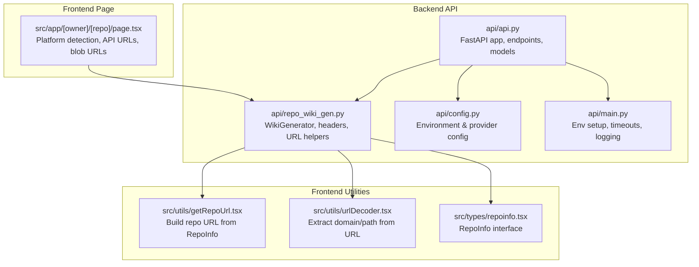
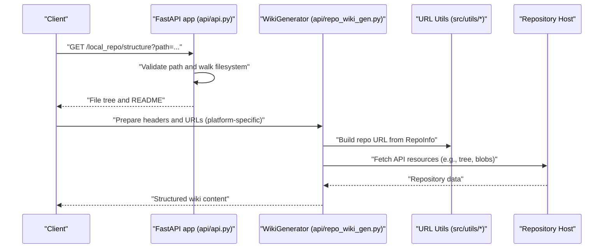
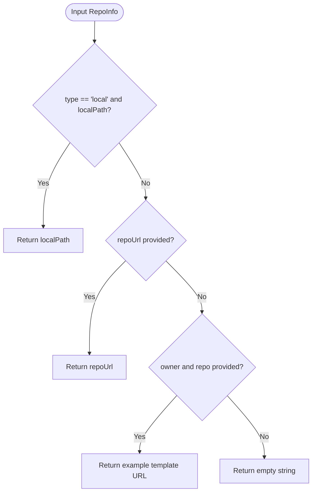
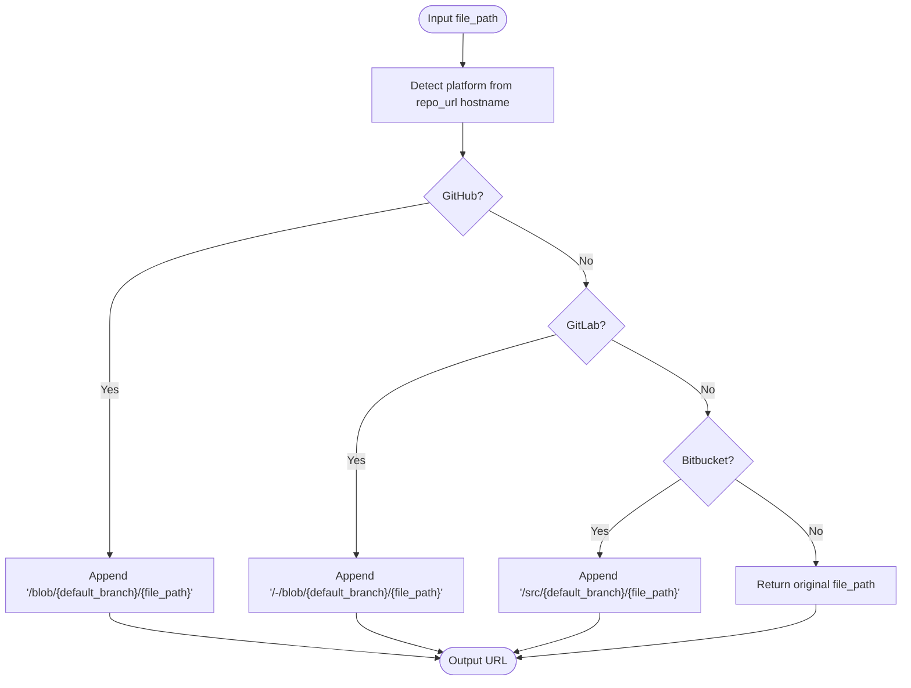
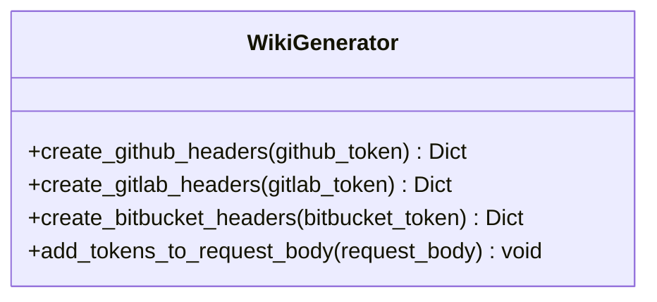
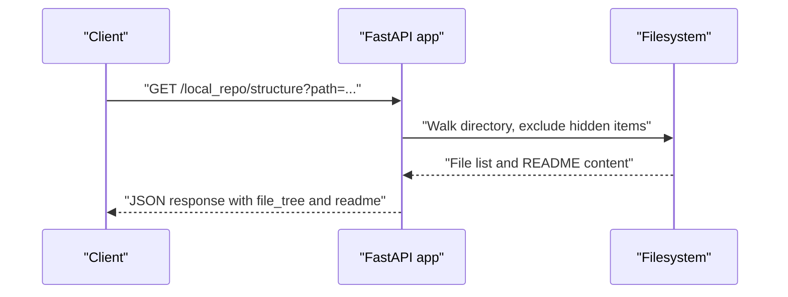
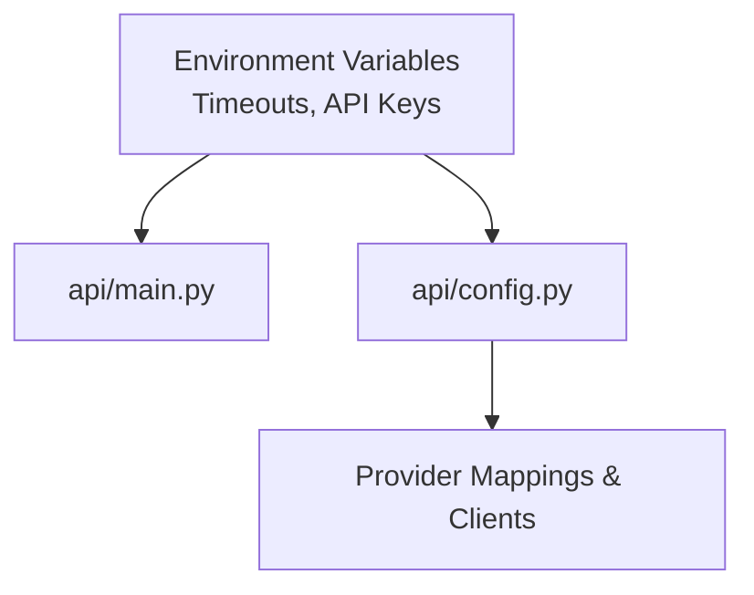
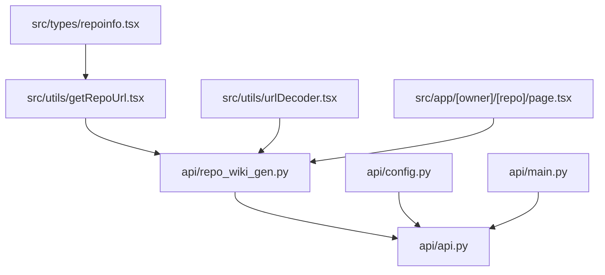

# Repository Cloning and Downloading

<cite>
**Referenced Files in This Document**
- [api/repo_wiki_gen.py](file://api/repo_wiki_gen.py)
- [api/api.py](file://api/api.py)
- [api/main.py](file://api/main.py)
- [api/config.py](file://api/config.py)
- [src/utils/getRepoUrl.tsx](file://src/utils/getRepoUrl.tsx)
- [src/utils/urlDecoder.tsx](file://src/utils/urlDecoder.tsx)
- [src/types/repoinfo.tsx](file://src/types/repoinfo.tsx)
- [src/app/[owner]/[repo]/page.tsx](file://src/app/%5Border%5D/%5Brepo%5D/page.tsx)
</cite>

## Table of Contents
1. [Introduction](#introduction)
2. [Project Structure](#project-structure)
3. [Core Components](#core-components)
4. [Architecture Overview](#architecture-overview)
5. [Detailed Component Analysis](#detailed-component-analysis)
6. [Dependency Analysis](#dependency-analysis)
7. [Performance Considerations](#performance-considerations)
8. [Troubleshooting Guide](#troubleshooting-guide)
9. [Conclusion](#conclusion)

## Introduction
This document explains the repository cloning and downloading system implemented in the project. It focuses on how repository URLs are constructed, how authentication tokens are injected for private repositories, and how the system prepares repositories for downstream wiki generation. While the repository does not implement a direct git clone operation in the backend, it provides robust URL formatting, authentication header creation, and repository metadata handling that enable secure and efficient access to GitHub, GitLab, and Bitbucket repositories.

## Project Structure
The cloning and downloading functionality spans both the backend API and the frontend utilities:
- Backend API defines repository metadata models and exposes endpoints for local repository structure retrieval and caching.
- Frontend utilities construct repository URLs and normalize input for consistent handling across platforms.
- Configuration and environment setup define authentication and provider integrations.

**Diagram sources**
- [api/api.py](file://api/api.py#L1-L120)
- [api/repo_wiki_gen.py](file://api/repo_wiki_gen.py#L52-L172)
- [api/config.py](file://api/config.py#L1-L120)
- [api/main.py](file://api/main.py#L1-L104)
- [src/utils/getRepoUrl.tsx](file://src/utils/getRepoUrl.tsx#L1-L17)
- [src/utils/urlDecoder.tsx](file://src/utils/urlDecoder.tsx#L1-L19)
- [src/types/repoinfo.tsx](file://src/types/repoinfo.tsx#L1-L11)
- [src/app/[owner]/[repo]/page.tsx](file://src/app/%5Border%5D/%5Brepo%5D/page.tsx#L140-L202)

**Section sources**
- [api/api.py](file://api/api.py#L1-L120)
- [api/repo_wiki_gen.py](file://api/repo_wiki_gen.py#L52-L172)
- [api/config.py](file://api/config.py#L1-L120)
- [api/main.py](file://api/main.py#L1-L104)
- [src/utils/getRepoUrl.tsx](file://src/utils/getRepoUrl.tsx#L1-L17)
- [src/utils/urlDecoder.tsx](file://src/utils/urlDecoder.tsx#L1-L19)
- [src/types/repoinfo.tsx](file://src/types/repoinfo.tsx#L1-L11)
- [src/app/[owner]/[repo]/page.tsx](file://src/app/%5Border%5D/%5Brepo%5D/page.tsx#L140-L202)

## Core Components
- RepoInfo model: Defines repository owner, name, platform type, optional token, optional local path, and optional explicit repository URL. It also includes an optional branch field for targeted branches.
- URL construction utilities: Build a repository URL from RepoInfo, with support for local paths and explicit URLs.
- Platform-specific URL helpers: Generate file blob URLs for GitHub, GitLab, and Bitbucket based on detected platform and default branch.
- Authentication headers: Create platform-appropriate headers for GitHub, GitLab, and Bitbucket APIs using tokens.
- Local repository structure endpoint: Retrieve file tree and README content for local repositories.

**Section sources**
- [src/types/repoinfo.tsx](file://src/types/repoinfo.tsx#L1-L11)
- [src/utils/getRepoUrl.tsx](file://src/utils/getRepoUrl.tsx#L1-L17)
- [api/repo_wiki_gen.py](file://api/repo_wiki_gen.py#L145-L172)
- [api/repo_wiki_gen.py](file://api/repo_wiki_gen.py#L124-L143)
- [api/api.py](file://api/api.py#L275-L321)

## Architecture Overview
The system separates concerns between URL normalization and repository metadata handling (frontend utilities and models) and API orchestration (backend). The WikiGenerator encapsulates platform-specific logic for headers and URL formatting, while the FastAPI app exposes endpoints for local repository inspection and caching.

**Diagram sources**
- [api/api.py](file://api/api.py#L275-L321)
- [api/repo_wiki_gen.py](file://api/repo_wiki_gen.py#L124-L172)
- [src/utils/getRepoUrl.tsx](file://src/utils/getRepoUrl.tsx#L1-L17)

## Detailed Component Analysis

### RepoInfo and URL Construction
- RepoInfo carries owner, repo, type, optional token, optional localPath, optional repoUrl, and optional branch.
- getRepoUrl resolves the effective repository URL from RepoInfo, supporting local paths and explicit URLs.
- urlDecoder extracts domain and path from arbitrary inputs, normalizing them for consistent handling.

**Diagram sources**
- [src/utils/getRepoUrl.tsx](file://src/utils/getRepoUrl.tsx#L3-L16)
- [src/types/repoinfo.tsx](file://src/types/repoinfo.tsx#L1-L11)

**Section sources**
- [src/types/repoinfo.tsx](file://src/types/repoinfo.tsx#L1-L11)
- [src/utils/getRepoUrl.tsx](file://src/utils/getRepoUrl.tsx#L1-L17)
- [src/utils/urlDecoder.tsx](file://src/utils/urlDecoder.tsx#L1-L19)

### Platform-Specific URL Formatting
- The WikiGenerator generates file blob URLs for GitHub, GitLab, and Bitbucket based on the repository’s hostname and default branch.
- It ensures correct path segments for each platform and handles exceptions gracefully.

**Diagram sources**
- [api/repo_wiki_gen.py](file://api/repo_wiki_gen.py#L145-L172)

**Section sources**
- [api/repo_wiki_gen.py](file://api/repo_wiki_gen.py#L145-L172)

### Authentication Mechanisms
- GitHub: Uses Bearer token in the Authorization header.
- GitLab: Uses PRIVATE-TOKEN header.
- Bitbucket: Uses Bearer token in the Authorization header.
- Tokens are attached to request bodies and headers for platform-specific API calls.

**Diagram sources**
- [api/repo_wiki_gen.py](file://api/repo_wiki_gen.py#L124-L143)
- [api/repo_wiki_gen.py](file://api/repo_wiki_gen.py#L102-L123)

**Section sources**
- [api/repo_wiki_gen.py](file://api/repo_wiki_gen.py#L124-L143)
- [api/repo_wiki_gen.py](file://api/repo_wiki_gen.py#L102-L123)

### Local Repository Support
- The backend provides an endpoint to enumerate a local repository’s file tree and README content, enabling offline or local-only workflows.

**Diagram sources**
- [api/api.py](file://api/api.py#L275-L321)

**Section sources**
- [api/api.py](file://api/api.py#L275-L321)

### Environment and Provider Configuration
- Environment variables configure timeouts for HTTP clients and required/optional keys for providers.
- Provider configuration maps provider IDs to client classes and model parameters.

**Diagram sources**
- [api/main.py](file://api/main.py#L9-L20)
- [api/main.py](file://api/main.py#L60-L86)
- [api/config.py](file://api/config.py#L1-L120)

**Section sources**
- [api/main.py](file://api/main.py#L9-L20)
- [api/main.py](file://api/main.py#L60-L86)
- [api/config.py](file://api/config.py#L1-L120)

## Dependency Analysis
The system exhibits clear separation of concerns:
- Frontend utilities depend on RepoInfo and URL decoding helpers to produce consistent repository URLs.
- Backend API depends on configuration and environment setup to manage provider integrations and timeouts.
- WikiGenerator depends on platform detection and URL formatting to build API and blob URLs.

**Diagram sources**
- [src/types/repoinfo.tsx](file://src/types/repoinfo.tsx#L1-L11)
- [src/utils/getRepoUrl.tsx](file://src/utils/getRepoUrl.tsx#L1-L17)
- [src/utils/urlDecoder.tsx](file://src/utils/urlDecoder.tsx#L1-L19)
- [api/repo_wiki_gen.py](file://api/repo_wiki_gen.py#L52-L172)
- [api/api.py](file://api/api.py#L1-L120)
- [api/config.py](file://api/config.py#L1-L120)
- [api/main.py](file://api/main.py#L1-L104)
- [src/app/[owner]/[repo]/page.tsx](file://src/app/%5Border%5D/%5Brepo%5D/page.tsx#L140-L202)

**Section sources**
- [src/types/repoinfo.tsx](file://src/types/repoinfo.tsx#L1-L11)
- [src/utils/getRepoUrl.tsx](file://src/utils/getRepoUrl.tsx#L1-L17)
- [src/utils/urlDecoder.tsx](file://src/utils/urlDecoder.tsx#L1-L19)
- [api/repo_wiki_gen.py](file://api/repo_wiki_gen.py#L52-L172)
- [api/api.py](file://api/api.py#L1-L120)
- [api/config.py](file://api/config.py#L1-L120)
- [api/main.py](file://api/main.py#L1-L104)
- [src/app/[owner]/[repo]/page.tsx](file://src/app/%5Border%5D/%5Brepo%5D/page.tsx#L140-L202)

## Performance Considerations
- Single-branch and shallow clone: The repository does not implement a direct git clone. To optimize performance for large repositories, downstream consumers should use single-branch and shallow clone strategies when performing local cloning outside this codebase.
- Timeout tuning: Corporate proxies may require extended timeouts. The backend initializes HTTP client timeouts to mitigate SSL and proxy-related delays.
- Caching: The backend supports server-side caching of generated wiki structures and pages to reduce repeated processing for the same repository and language.

**Section sources**
- [api/main.py](file://api/main.py#L9-L20)
- [api/api.py](file://api/api.py#L408-L458)

## Troubleshooting Guide
Common issues and resolutions:
- Network timeouts: Increase HTTP client timeouts in environments behind restrictive proxies.
- Invalid credentials: Ensure the correct token type and header are used per platform (GitHub, GitLab, Bitbucket).
- Repository access permissions: Verify repository visibility and token scopes for private repositories.
- URL formatting errors: Confirm repository URL hostname detection and blob URL construction logic.
- Local repository errors: Validate the provided path and ensure it points to a valid directory.

Operational checks:
- Health endpoint: Use the health check to confirm service availability.
- Local repository structure: Use the local repository endpoint to verify filesystem access and README extraction.

**Section sources**
- [api/main.py](file://api/main.py#L9-L20)
- [api/repo_wiki_gen.py](file://api/repo_wiki_gen.py#L124-L172)
- [api/api.py](file://api/api.py#L540-L547)
- [api/api.py](file://api/api.py#L275-L321)

## Conclusion
The repository provides a robust foundation for repository URL handling, authentication header injection, and platform-aware URL formatting for GitHub, GitLab, and Bitbucket. While a direct git clone is not implemented in this codebase, the components outlined here enable secure and efficient access to repositories and lay the groundwork for integrating with a local clone process optimized via single-branch and shallow clone strategies. The backend also offers local repository inspection and caching capabilities to streamline development and reduce repeated processing overhead.