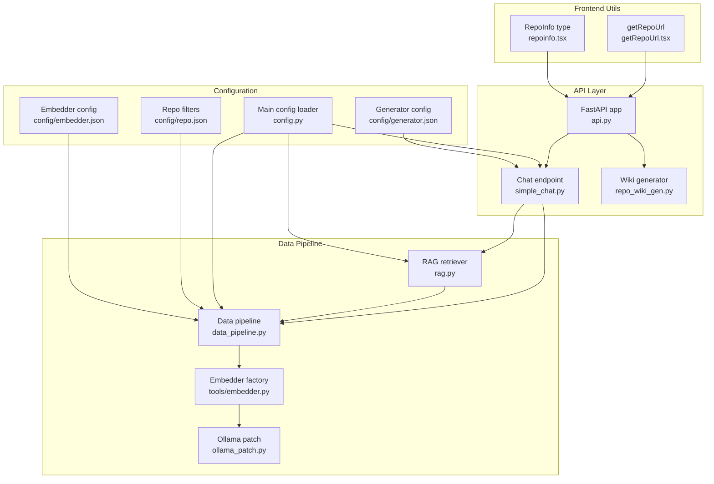
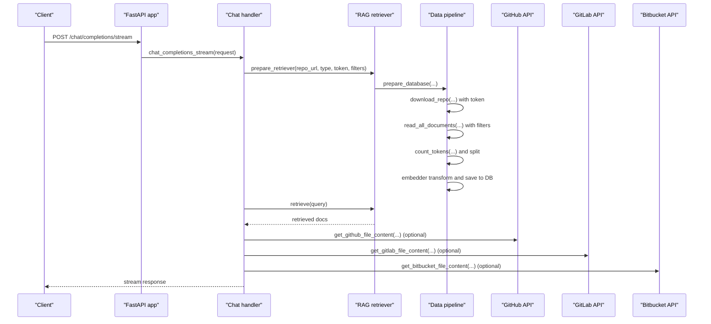
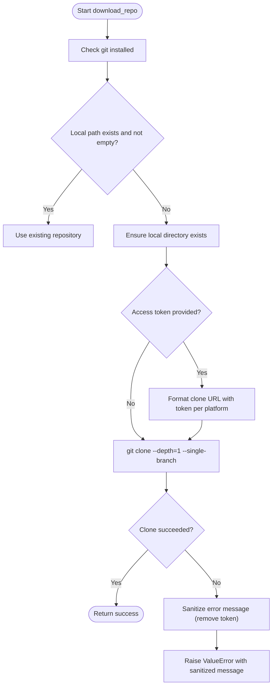
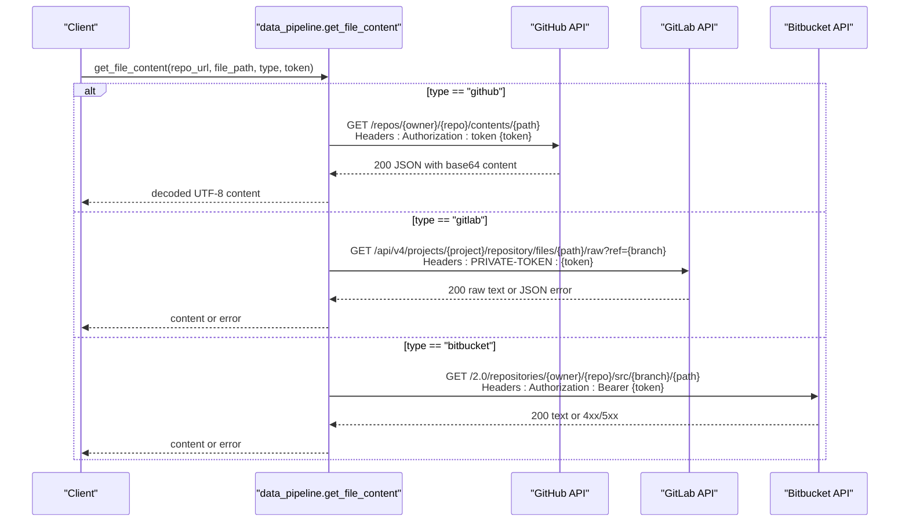
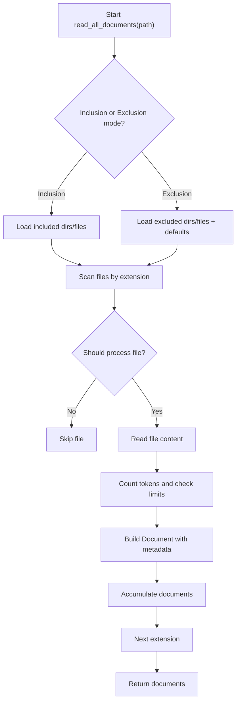
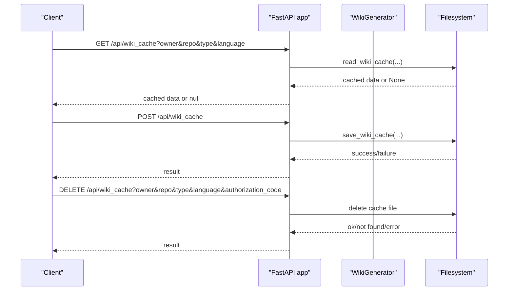
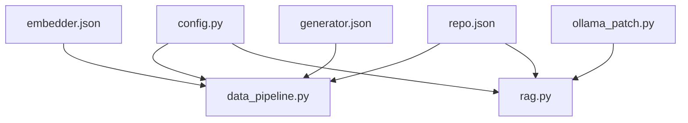

# Repository Data Extraction

<cite>
**Referenced Files in This Document**
- [data_pipeline.py](file://api/data_pipeline.py)
- [repo_wiki_gen.py](file://api/repo_wiki_gen.py)
- [simple_chat.py](file://api/simple_chat.py)
- [rag.py](file://api/rag.py)
- [api.py](file://api/api.py)
- [main.py](file://api/main.py)
- [config.py](file://api/config.py)
- [embedder.py](file://api/tools/embedder.py)
- [ollama_patch.py](file://api/ollama_patch.py)
- [repo.json](file://api/config/repo.json)
- [embedder.json](file://api/config/embedder.json)
- [generator.json](file://api/config/generator.json)
- [getRepoUrl.tsx](file://src/utils/getRepoUrl.tsx)
- [repoinfo.tsx](file://src/types/repoinfo.tsx)
</cite>

## Table of Contents
1. [Introduction](#introduction)
2. [Project Structure](#project-structure)
3. [Core Components](#core-components)
4. [Architecture Overview](#architecture-overview)
5. [Detailed Component Analysis](#detailed-component-analysis)
6. [Dependency Analysis](#dependency-analysis)
7. [Performance Considerations](#performance-considerations)
8. [Troubleshooting Guide](#troubleshooting-guide)
9. [Conclusion](#conclusion)
10. [Appendices](#appendices)

## Introduction
This document explains the repository data extraction system used to clone and download repositories from GitHub, GitLab, and Bitbucket, authenticate private repositories, retrieve file content via platform APIs, and process the extracted content into a structured pipeline for AI analysis. It also covers the repository processing pipeline from raw code extraction through document preparation, including tokenization, splitting, embedding, and database storage. Practical examples, authentication setup, and troubleshooting guidance are included, along with performance considerations for large repositories and network timeout handling.

## Project Structure
The repository data extraction system spans several modules:
- Data extraction and processing: cloning, file enumeration, content retrieval, token counting, splitting, embedding, and database persistence
- API orchestration: FastAPI endpoints for chat, wiki cache, and repository structure
- Configuration: provider-specific settings, embedder configuration, and repository filters
- Frontend utilities: helpers for constructing repository URLs and type definitions

**Diagram sources**
- [api.py](file://api/api.py#L1-L635)
- [data_pipeline.py](file://api/data_pipeline.py#L1-L917)
- [simple_chat.py](file://api/simple_chat.py#L1-L900)
- [rag.py](file://api/rag.py#L1-L446)
- [config.py](file://api/config.py#L1-L464)
- [embedder.py](file://api/tools/embedder.py#L1-L59)
- [ollama_patch.py](file://api/ollama_patch.py#L1-L105)
- [repo.json](file://api/config/repo.json#L1-L129)
- [embedder.json](file://api/config/embedder.json#L1-L35)
- [generator.json](file://api/config/generator.json#L1-L101)
- [getRepoUrl.tsx](file://src/utils/getRepoUrl.tsx#L1-L17)
- [repoinfo.tsx](file://src/types/repoinfo.tsx#L1-L11)

**Section sources**
- [api.py](file://api/api.py#L1-L635)
- [data_pipeline.py](file://api/data_pipeline.py#L1-L917)
- [simple_chat.py](file://api/simple_chat.py#L1-L900)
- [rag.py](file://api/rag.py#L1-L446)
- [config.py](file://api/config.py#L1-L464)
- [embedder.py](file://api/tools/embedder.py#L1-L59)
- [ollama_patch.py](file://api/ollama_patch.py#L1-L105)
- [repo.json](file://api/config/repo.json#L1-L129)
- [embedder.json](file://api/config/embedder.json#L1-L35)
- [generator.json](file://api/config/generator.json#L1-L101)
- [getRepoUrl.tsx](file://src/utils/getRepoUrl.tsx#L1-L17)
- [repoinfo.tsx](file://src/types/repoinfo.tsx#L1-L11)

## Core Components
- Repository downloader and file reader
  - Clones repositories from GitHub, GitLab, and Bitbucket using Git with optional access tokens
  - Reads and tokenizes files, applies inclusion/exclusion filters, and builds Document objects
- Platform-specific file content retrieval
  - GitHub: GitHub API with base64 decoding
  - GitLab: GitLab API with raw file endpoint and PRIVATE-TOKEN header
  - Bitbucket: Bitbucket API with Bearer token and default branch resolution
- Data transformation pipeline
  - Text splitting, embeddings, and database persistence for retrieval
- API orchestration
  - Chat streaming with optional RAG retrieval
  - Wiki cache management and export
- Configuration and environment
  - Provider selection, embedder configuration, repository filters, and language settings

**Section sources**
- [data_pipeline.py](file://api/data_pipeline.py#L103-L173)
- [data_pipeline.py](file://api/data_pipeline.py#L177-L406)
- [data_pipeline.py](file://api/data_pipeline.py#L478-L711)
- [simple_chat.py](file://api/simple_chat.py#L76-L330)
- [api.py](file://api/api.py#L275-L321)
- [api.py](file://api/api.py#L461-L539)
- [config.py](file://api/config.py#L1-L464)
- [embedder.py](file://api/tools/embedder.py#L1-L59)
- [repo.json](file://api/config/repo.json#L1-L129)

## Architecture Overview
The system integrates a FastAPI backend with a data extraction and retrieval pipeline. The chat endpoint optionally augments queries with repository content retrieved via RAG. The pipeline supports multiple embedders and providers, with configurable filters and token limits.

**Diagram sources**
- [api.py](file://api/api.py#L1-L635)
- [simple_chat.py](file://api/simple_chat.py#L76-L330)
- [rag.py](file://api/rag.py#L345-L391)
- [data_pipeline.py](file://api/data_pipeline.py#L103-L173)
- [data_pipeline.py](file://api/data_pipeline.py#L177-L406)
- [data_pipeline.py](file://api/data_pipeline.py#L478-L711)

## Detailed Component Analysis

### Repository Download and Authentication
- Supported platforms: GitHub, GitLab, Bitbucket
- Authentication methods:
  - GitHub: token inserted as a credential in the clone URL (supports both github.com and enterprise domains)
  - GitLab: oauth2 token in clone URL
  - Bitbucket: x-token-auth token in clone URL
- Clone options: shallow clone with single branch and depth 1 to reduce bandwidth and time
- Error handling: sanitizes logs to avoid exposing tokens; raises descriptive errors on failures

**Diagram sources**
- [data_pipeline.py](file://api/data_pipeline.py#L103-L173)

**Section sources**
- [data_pipeline.py](file://api/data_pipeline.py#L103-L173)

### File Content Retrieval by Platform
- GitHub
  - Endpoint: /repos/{owner}/{repo}/contents/{path}
  - Headers: Authorization: token {access_token}
  - Decoding: base64 to UTF-8
  - Error handling: validates JSON response and raises on API errors
- GitLab
  - Endpoint: /api/v4/projects/{project_path}/repository/files/{file_path}/raw?ref={default_branch}
  - Headers: PRIVATE-TOKEN: {access_token}
  - Branch resolution: attempts to fetch default branch from project info
  - Error handling: checks for JSON error responses
- Bitbucket
  - Endpoint: /2.0/repositories/{owner}/{repo}/src/{default_branch}/{path}
  - Headers: Authorization: Bearer {access_token}
  - Branch resolution: fetches main branch from repository info
  - Error handling: maps common HTTP status codes to meaningful messages

**Diagram sources**
- [data_pipeline.py](file://api/data_pipeline.py#L478-L711)

**Section sources**
- [data_pipeline.py](file://api/data_pipeline.py#L478-L711)

### Repository Processing Pipeline
- File enumeration and filtering
  - Inclusion mode: only specified directories/files
  - Exclusion mode: default plus configured exclusions
  - Extensions prioritized for code files, then documentation files
- Token counting and limits
  - Uses tiktoken with provider-specific encodings
  - Enforces token limits per provider; code files allowed up to 10x limit
- Transformation pipeline
  - TextSplitter followed by ToEmbeddings (batch) or OllamaDocumentProcessor (single-document)
  - LocalDB persists transformed documents
- Database management
  - DatabaseManager orchestrates cloning, reading, transforming, and saving

**Diagram sources**
- [data_pipeline.py](file://api/data_pipeline.py#L177-L406)

**Section sources**
- [data_pipeline.py](file://api/data_pipeline.py#L177-L406)
- [data_pipeline.py](file://api/data_pipeline.py#L408-L477)
- [data_pipeline.py](file://api/data_pipeline.py#L737-L800)
- [embedder.py](file://api/tools/embedder.py#L1-L59)
- [ollama_patch.py](file://api/ollama_patch.py#L62-L105)

### API Orchestration and Wiki Generation
- Chat streaming endpoint
  - Validates messages, prepares RAG retriever, retrieves context, and streams responses
  - Supports Deep Research iterations and file-focused queries
- Wiki cache management
  - Stores and retrieves wiki structures and generated pages
  - Supports deletion with optional authorization
- Local repository structure
  - Returns file tree and README content for local paths

**Diagram sources**
- [api.py](file://api/api.py#L461-L539)
- [repo_wiki_gen.py](file://api/repo_wiki_gen.py#L63-L550)

**Section sources**
- [api.py](file://api/api.py#L275-L321)
- [api.py](file://api/api.py#L461-L539)
- [repo_wiki_gen.py](file://api/repo_wiki_gen.py#L63-L550)

### Frontend Utilities
- getRepoUrl constructs repository URLs from RepoInfo
- RepoInfo defines the shape of repository metadata used across the system

**Section sources**
- [getRepoUrl.tsx](file://src/utils/getRepoUrl.tsx#L1-L17)
- [repoinfo.tsx](file://src/types/repoinfo.tsx#L1-L11)

## Dependency Analysis
- Provider and embedder configuration
  - Embedder selection and batch size come from embedder.json
  - Generator/provider configuration comes from generator.json
  - Environment variables drive API keys and timeouts
- Repository filters
  - Default exclusions and repository size limits from repo.json
- Ollama-specific handling
  - Model existence check and single-document processing for embeddings

**Diagram sources**
- [config.py](file://api/config.py#L1-L464)
- [embedder.json](file://api/config/embedder.json#L1-L35)
- [generator.json](file://api/config/generator.json#L1-L101)
- [repo.json](file://api/config/repo.json#L1-L129)
- [data_pipeline.py](file://api/data_pipeline.py#L1-L917)
- [rag.py](file://api/rag.py#L1-L446)
- [ollama_patch.py](file://api/ollama_patch.py#L1-L105)

**Section sources**
- [config.py](file://api/config.py#L1-L464)
- [embedder.json](file://api/config/embedder.json#L1-L35)
- [generator.json](file://api/config/generator.json#L1-L101)
- [repo.json](file://api/config/repo.json#L1-L129)
- [rag.py](file://api/rag.py#L1-L446)
- [ollama_patch.py](file://api/ollama_patch.py#L1-L105)

## Performance Considerations
- Shallow clones and single-branch downloads reduce bandwidth and time
- Token limits per provider prevent oversized inputs; code files allowed up to 10x limit
- Batch embedding for non-Ollama embedders improves throughput
- OllamaDocumentProcessor processes documents individually due to client limitations
- Repository size limit enforced by configuration (MB)
- Network timeouts adjusted for corporate proxies in the main entrypoint

**Section sources**
- [data_pipeline.py](file://api/data_pipeline.py#L103-L173)
- [data_pipeline.py](file://api/data_pipeline.py#L61-L102)
- [data_pipeline.py](file://api/data_pipeline.py#L408-L477)
- [ollama_patch.py](file://api/ollama_patch.py#L62-L105)
- [repo.json](file://api/config/repo.json#L125-L128)
- [main.py](file://api/main.py#L9-L21)

## Troubleshooting Guide
- Authentication failures
  - GitHub: ensure token is valid and attached to the clone URL; verify domain (public vs enterprise)
  - GitLab: confirm PRIVATE-TOKEN header and project visibility
  - Bitbucket: verify Bearer token and repository permissions
- API errors
  - GitHub: decode base64 content; check for API error messages in JSON response
  - GitLab: inspect JSON error responses and default branch resolution
  - Bitbucket: handle 401/403/404/500 appropriately
- Embedding issues
  - Inconsistent embedding sizes: pipeline filters documents with mismatched sizes
  - Ollama model not found: ensure model is pulled locally
- Large repositories
  - Use inclusion filters to narrow scope
  - Consider repository size limits and shallow clone behavior
- Network timeouts
  - Corporate proxies may require increased timeouts; handled in main entrypoint

**Section sources**
- [data_pipeline.py](file://api/data_pipeline.py#L165-L173)
- [data_pipeline.py](file://api/data_pipeline.py#L526-L554)
- [data_pipeline.py](file://api/data_pipeline.py#L617-L635)
- [data_pipeline.py](file://api/data_pipeline.py#L691-L711)
- [rag.py](file://api/rag.py#L251-L343)
- [ollama_patch.py](file://api/ollama_patch.py#L21-L61)
- [main.py](file://api/main.py#L9-L21)

## Conclusion
The repository data extraction system provides a robust pipeline for cloning repositories, authenticating private repositories, retrieving file content via platform APIs, and transforming the content into embeddings for retrieval-augmented generation. With configurable filters, provider-specific settings, and careful error handling, it supports scalable processing of diverse repositories. The API endpoints enable interactive chat with contextual retrieval and persistent wiki caching for productivity.

## Appendices

### Practical Examples

- Repository URL formats
  - GitHub: https://github.com/owner/repo or enterprise domain
  - GitLab: https://gitlab.com/owner/repo or self-hosted domain
  - Bitbucket: https://bitbucket.org/owner/repo

- Authentication setup
  - GitHub: include token in clone URL or Authorization header for API
  - GitLab: PRIVATE-TOKEN header or oauth2 token in clone URL
  - Bitbucket: Bearer token header

- Environment variables
  - Required: GOOGLE_API_KEY, OPENAI_API_KEY
  - Optional: GITHUB_TOKEN, OPENROUTER_API_KEY, IFLOW_API_KEY, AWS_ACCESS_KEY_ID, AWS_SECRET_ACCESS_KEY

- Configuration files
  - Embedder: embedder.json
  - Generator/providers: generator.json
  - Repository filters and limits: repo.json

**Section sources**
- [data_pipeline.py](file://api/data_pipeline.py#L134-L149)
- [data_pipeline.py](file://api/data_pipeline.py#L522-L524)
- [data_pipeline.py](file://api/data_pipeline.py#L613-L614)
- [data_pipeline.py](file://api/data_pipeline.py#L687-L688)
- [main.py](file://api/main.py#L60-L77)
- [embedder.json](file://api/config/embedder.json#L1-L35)
- [generator.json](file://api/config/generator.json#L1-L101)
- [repo.json](file://api/config/repo.json#L1-L129)