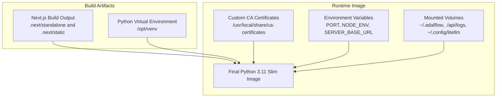
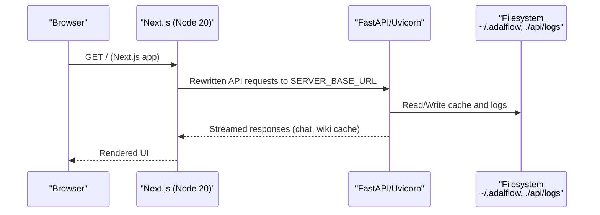
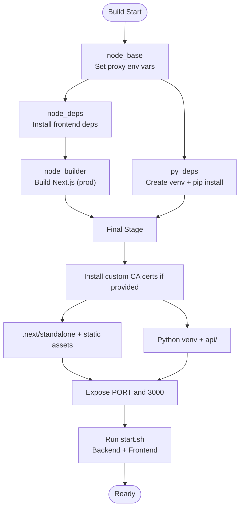
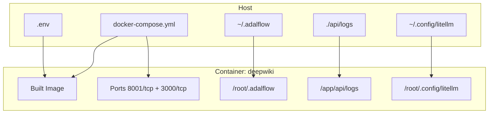
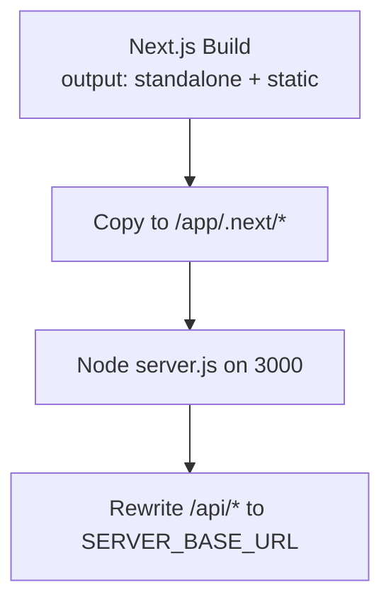
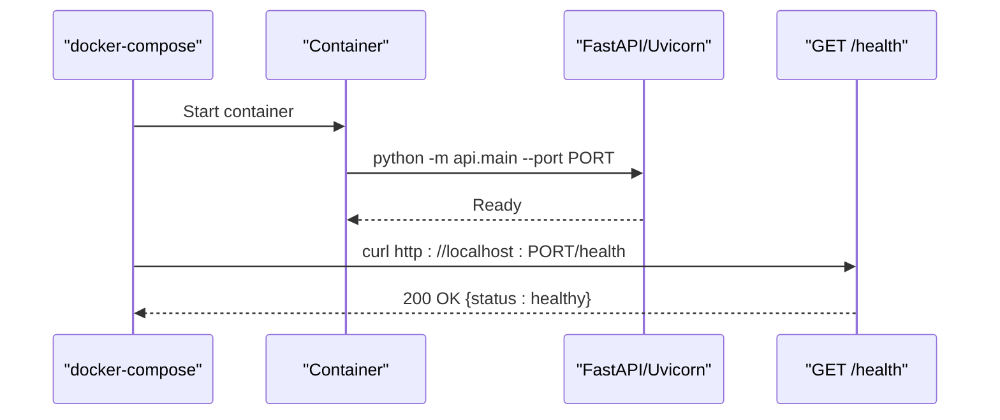
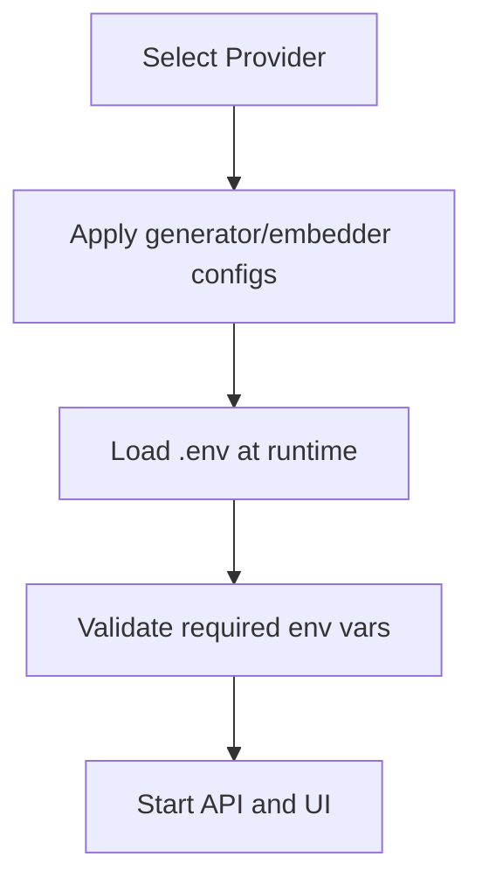
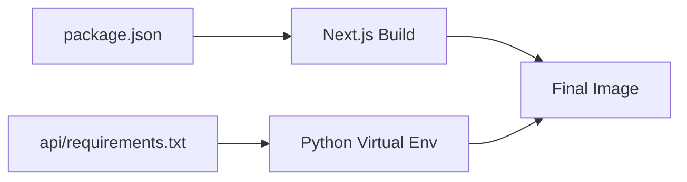

# Containerization and Docker Setup

<cite>
**Referenced Files in This Document**
- [Dockerfile](file://Dockerfile)
- [docker-compose.yml](file://docker-compose.yml)
- [.dockerignore](file://.dockerignore)
- [run.sh](file://run.sh)
- [setup_provider.sh](file://setup_provider.sh)
- [Dockerfile-ollama-local](file://Dockerfile-ollama-local)
- [package.json](file://package.json)
- [api/requirements.txt](file://api/requirements.txt)
- [api/main.py](file://api/main.py)
- [next.config.ts](file://next.config.ts)
- [api/api.py](file://api/api.py)
- [api/config.py](file://api/config.py)
- [api/logging_config.py](file://api/logging_config.py)
- [api/config/generator.json](file://api/config/generator.json)
- [api/config/embedder.json](file://api/config/embedder.json)
</cite>

## Table of Contents
1. [Introduction](#introduction)
2. [Project Structure](#project-structure)
3. [Core Components](#core-components)
4. [Architecture Overview](#architecture-overview)
5. [Detailed Component Analysis](#detailed-component-analysis)
6. [Dependency Analysis](#dependency-analysis)
7. [Performance Considerations](#performance-considerations)
8. [Troubleshooting Guide](#troubleshooting-guide)
9. [Conclusion](#conclusion)
10. [Appendices](#appendices)

## Introduction
This document explains the containerization and Docker deployment setup for DeepWiki-Open. It covers the multi-stage Dockerfile architecture that builds the Next.js frontend, installs Python backend dependencies, and produces an optimized production image. It documents build-time arguments for proxy configuration, custom certificate handling, and environment variable inheritance across stages. It also details the docker-compose orchestration, persistent volumes, and network configuration. Practical examples demonstrate building images with custom certificates, running containers with environment variables, and configuring proxy settings. Finally, it provides Docker best practices, security considerations, troubleshooting tips, and customization guidelines for different deployment environments.

## Project Structure
DeepWiki-Open’s containerization relies on:
- A primary multi-stage Dockerfile that builds the frontend and backend, then packages them into a single slim image.
- A docker-compose configuration that orchestrates the service, mounts persistent volumes, and exposes ports.
- Supporting scripts and configuration files that enable provider selection and logging configuration.

**Diagram sources**
- [Dockerfile](file://Dockerfile#L14-L171)
- [docker-compose.yml](file://docker-compose.yml#L1-L46)

**Section sources**
- [Dockerfile](file://Dockerfile#L1-L171)
- [docker-compose.yml](file://docker-compose.yml#L1-L46)

## Core Components
- Multi-stage Dockerfile:
  - Node.js base stage for frontend dependencies and build.
  - Python stage for backend virtual environment and dependencies.
  - Final stage combining both, installing Node.js runtime, applying custom certificates, exposing ports, and launching both backend and frontend.
- docker-compose:
  - Builds from the Dockerfile with proxy arguments.
  - Publishes API and Next.js ports.
  - Loads environment variables from .env and passes them to the container.
  - Mounts persistent volumes for cache, logs, and tokens.
  - Defines resource limits and a health check.
- Frontend build:
  - Next.js standalone output and static assets are copied into the final image.
  - Rewrites target backend URL from environment.
- Backend:
  - FastAPI app served by Uvicorn.
  - Logging configuration supports rotating files and environment-driven settings.
  - Health check endpoint for monitoring.

**Section sources**
- [Dockerfile](file://Dockerfile#L14-L171)
- [docker-compose.yml](file://docker-compose.yml#L1-L46)
- [next.config.ts](file://next.config.ts#L1-L71)
- [api/main.py](file://api/main.py#L1-L104)
- [api/api.py](file://api/api.py#L540-L547)
- [api/logging_config.py](file://api/logging_config.py#L1-L86)

## Architecture Overview
The system runs two services concurrently:
- Python FastAPI backend serving the API and chat endpoints.
- Next.js frontend served by Node.js on port 3000.

**Diagram sources**
- [next.config.ts](file://next.config.ts#L36-L67)
- [api/api.py](file://api/api.py#L540-L547)
- [api/main.py](file://api/main.py#L87-L103)

## Detailed Component Analysis

### Multi-Stage Dockerfile Analysis
The Dockerfile defines a multi-stage build:
- node_base: Base Node.js image with inherited proxy environment variables.
- node_deps: Installs frontend dependencies.
- node_builder: Copies minimal frontend sources and builds the Next.js app with production flags and telemetry disabled.
- py_deps: Creates a Python virtual environment and installs backend dependencies.
- Final stage: Installs Node.js runtime, applies custom certificates, copies Python virtual environment, backend code, and built frontend artifacts, sets environment variables, and starts both services.

Key behaviors:
- Proxy configuration is passed via build arguments and inherited as environment variables in each stage.
- Custom certificates are conditionally installed from a configurable directory and update the trust store.
- The startup script launches the Python backend and Next.js frontend concurrently and monitors them.

**Diagram sources**
- [Dockerfile](file://Dockerfile#L14-L171)

**Section sources**
- [Dockerfile](file://Dockerfile#L14-L171)

### docker-compose Configuration
The compose file defines:
- Build context and Dockerfile path.
- Build arguments for proxy propagation.
- Port mappings for API and frontend.
- Environment file and explicit environment variables.
- Persistent volume mounts for cache, logs, and tokens.
- Resource limits and health checks.

**Diagram sources**
- [docker-compose.yml](file://docker-compose.yml#L1-L46)

**Section sources**
- [docker-compose.yml](file://docker-compose.yml#L1-L46)

### Frontend Build and Runtime
- Next.js is configured to output a standalone server and static assets.
- Rewrites forward frontend API routes to the backend URL derived from SERVER_BASE_URL.
- The frontend runs on port 3000 inside the container.

**Diagram sources**
- [next.config.ts](file://next.config.ts#L7-L67)
- [Dockerfile](file://Dockerfile#L133-L136)

**Section sources**
- [next.config.ts](file://next.config.ts#L1-L71)
- [Dockerfile](file://Dockerfile#L133-L136)

### Backend Runtime and Health Checks
- The Python backend loads environment variables from .env and validates required keys.
- Logging is configured with rotating file handlers and environment-driven settings.
- The health endpoint responds successfully when the API is reachable.

**Diagram sources**
- [api/main.py](file://api/main.py#L87-L103)
- [api/api.py](file://api/api.py#L540-L547)
- [docker-compose.yml](file://docker-compose.yml#L40-L44)

**Section sources**
- [api/main.py](file://api/main.py#L1-L104)
- [api/logging_config.py](file://api/logging_config.py#L1-L86)
- [api/api.py](file://api/api.py#L540-L547)
- [docker-compose.yml](file://docker-compose.yml#L40-L44)

### Provider Configuration and Environment Handling
- Provider setup script selects and applies configuration files for DashScope or GitHub Copilot.
- Environment variables are loaded from .env at runtime and validated by the backend.
- Configuration files support environment variable substitution for dynamic values.

**Diagram sources**
- [setup_provider.sh](file://setup_provider.sh#L133-L189)
- [api/config.py](file://api/config.py#L104-L126)
- [api/main.py](file://api/main.py#L60-L77)

**Section sources**
- [setup_provider.sh](file://setup_provider.sh#L1-L189)
- [api/config.py](file://api/config.py#L104-L126)
- [api/main.py](file://api/main.py#L60-L77)

## Dependency Analysis
- Frontend dependencies are declared in the frontend package manifest.
- Backend dependencies are declared in the Python requirements file.
- The Dockerfile installs the Python virtual environment and copies only necessary backend files.

**Diagram sources**
- [package.json](file://package.json#L1-L40)
- [api/requirements.txt](file://api/requirements.txt#L1-L22)
- [Dockerfile](file://Dockerfile#L65-L136)

**Section sources**
- [package.json](file://package.json#L1-L40)
- [api/requirements.txt](file://api/requirements.txt#L1-L22)
- [Dockerfile](file://Dockerfile#L65-L136)

## Performance Considerations
- Memory limits are set in docker-compose to constrain resource usage.
- Frontend build optimizations reduce memory consumption during build.
- Logging rotates files to avoid excessive disk usage.
- Health checks ensure liveness and readiness for orchestration platforms.

[No sources needed since this section provides general guidance]

## Troubleshooting Guide
Common issues and resolutions:
- Missing environment variables:
  - The backend warns when required keys are not set and continues with reduced functionality.
- Proxy connectivity problems:
  - Ensure proxy build arguments are passed and environment variables are set in both build and runtime.
- Custom certificates not taking effect:
  - Verify the custom certificate directory is provided and readable at build time.
- Port conflicts:
  - Change the PORT environment variable and published port mapping in docker-compose.
- Health check failures:
  - Confirm the API is listening on the expected port and the health endpoint is reachable.

**Section sources**
- [api/main.py](file://api/main.py#L60-L77)
- [Dockerfile](file://Dockerfile#L115-L125)
- [docker-compose.yml](file://docker-compose.yml#L15-L17)
- [api/api.py](file://api/api.py#L540-L547)

## Conclusion
DeepWiki-Open’s containerization combines a robust multi-stage Dockerfile with a concise docker-compose setup. The architecture separates frontend and backend concerns while ensuring secure and efficient runtime behavior. By leveraging build arguments for proxy and certificates, environment-driven configuration, and persistent volumes, the setup supports flexible deployments across diverse environments.

[No sources needed since this section summarizes without analyzing specific files]

## Appendices

### Practical Examples

- Build with custom certificates:
  - Place your certificate files under a directory (e.g., certs/) and build with the CUSTOM_CERT_DIR argument.
  - The final stage will copy and register the certificates if the directory exists.

- Run with environment variables:
  - Provide a .env file and mount it into the container.
  - Alternatively, pass environment variables via docker-compose environment or build args.

- Configure proxy settings:
  - Pass HTTP_PROXY, HTTPS_PROXY, and NO_PROXY at build time and runtime.
  - These values propagate to both frontend and backend stages.

- Use the Ollama-enabled variant:
  - Build from the Ollama-local Dockerfile to embed Ollama binaries and pre-pull models.

**Section sources**
- [Dockerfile](file://Dockerfile#L3-L12)
- [Dockerfile-ollama-local](file://Dockerfile-ollama-local#L1-L192)
- [docker-compose.yml](file://docker-compose.yml#L8-L14)
- [docker-compose.yml](file://docker-compose.yml#L18-L31)

### Security Considerations
- Prefer passing secrets via environment variables or secret volumes rather than embedding them in images.
- Limit exposed ports to those required by the application.
- Use non-root users where feasible and minimize installed packages.
- Regularly update base images and dependencies.

[No sources needed since this section provides general guidance]

### Best Practices
- Keep the final image slim by copying only necessary artifacts.
- Use .dockerignore to exclude unnecessary files from the build context.
- Centralize environment configuration and validation in the backend.
- Monitor logs with rotating file handlers and appropriate log levels.

**Section sources**
- [.dockerignore](file://.dockerignore#L1-L61)
- [api/logging_config.py](file://api/logging_config.py#L1-L86)

### Customization Guidelines
- Adjust ports and environment variables per environment by editing docker-compose.
- Swap provider configurations using the setup script and environment variables.
- Extend the image with additional CA certificates by mounting a directory at build time.
- For offline or air-gapped environments, bake dependencies into the image or pre-provision caches.

**Section sources**
- [docker-compose.yml](file://docker-compose.yml#L1-L46)
- [setup_provider.sh](file://setup_provider.sh#L1-L189)
- [Dockerfile](file://Dockerfile#L115-L125)
- [api/config.py](file://api/config.py#L104-L126)