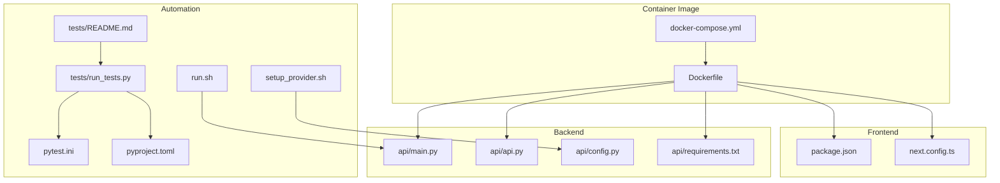
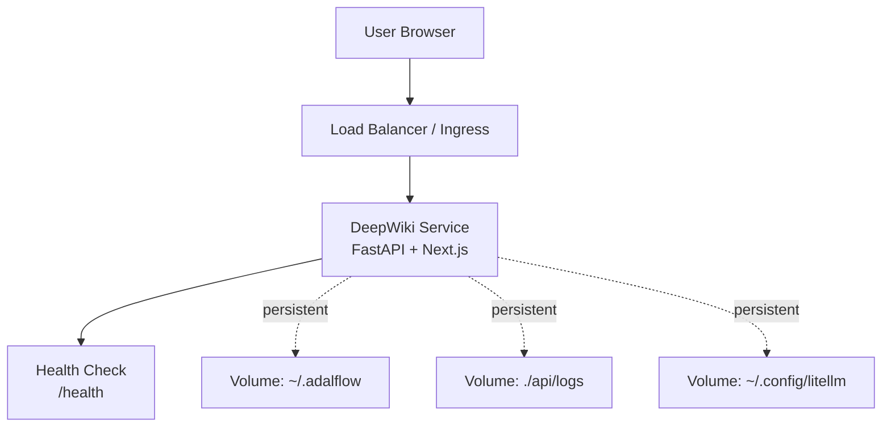
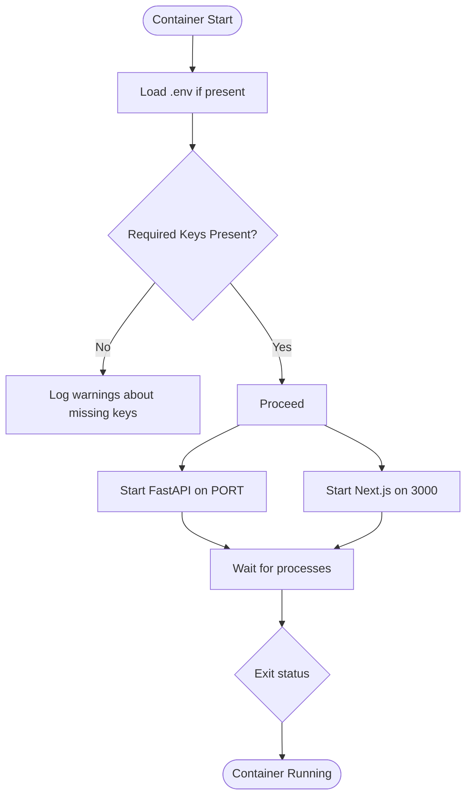
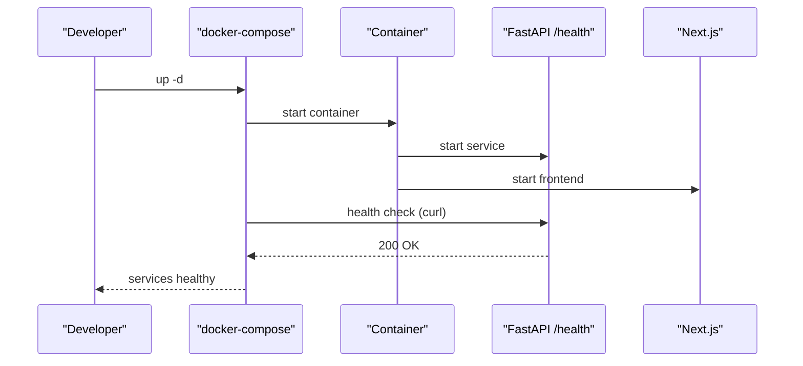
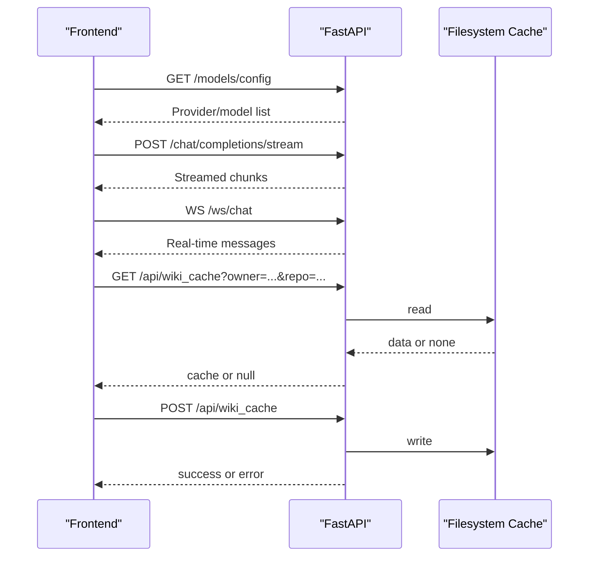
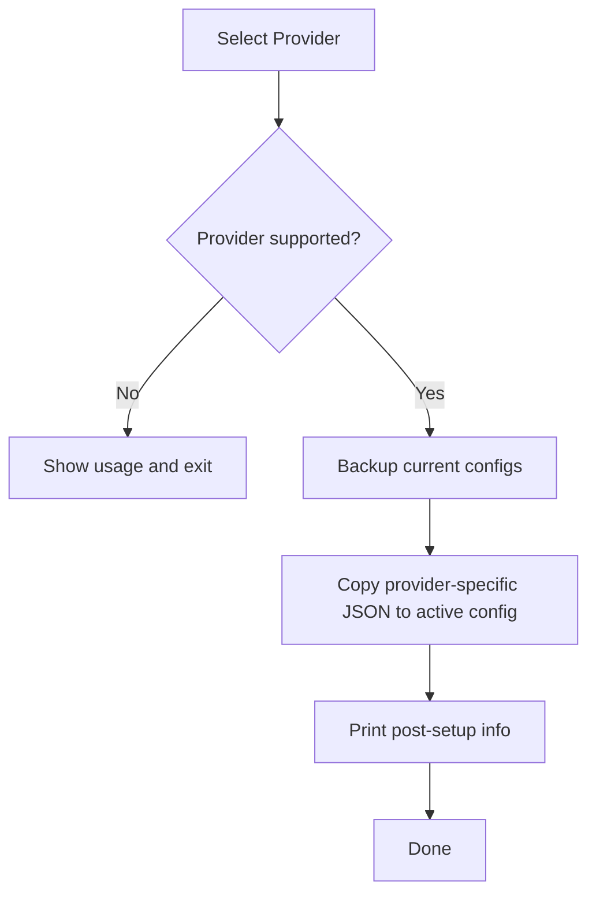
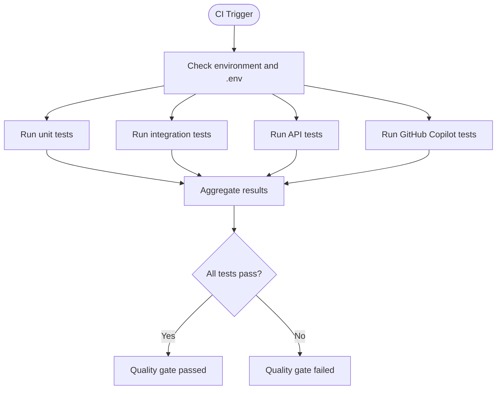
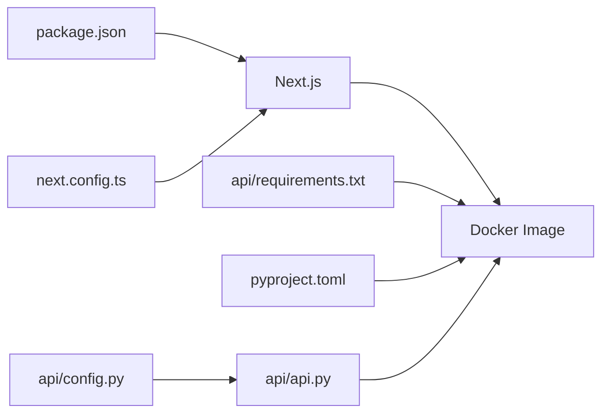

# Deployment Automation and CI/CD

<cite>
**Referenced Files in This Document**
- [Dockerfile](file://Dockerfile)
- [docker-compose.yml](file://docker-compose.yml)
- [run.sh](file://run.sh)
- [setup_provider.sh](file://setup_provider.sh)
- [package.json](file://package.json)
- [next.config.ts](file://next.config.ts)
- [pytest.ini](file://pytest.ini)
- [pyproject.toml](file://pyproject.toml)
- [api/main.py](file://api/main.py)
- [api/api.py](file://api/api.py)
- [api/config.py](file://api/config.py)
- [api/requirements.txt](file://api/requirements.txt)
- [tests/run_tests.py](file://tests/run_tests.py)
- [tests/README.md](file://tests/README.md)
</cite>

## Table of Contents
1. [Introduction](#introduction)
2. [Project Structure](#project-structure)
3. [Core Components](#core-components)
4. [Architecture Overview](#architecture-overview)
5. [Detailed Component Analysis](#detailed-component-analysis)
6. [Dependency Analysis](#dependency-analysis)
7. [Performance Considerations](#performance-considerations)
8. [Troubleshooting Guide](#troubleshooting-guide)
9. [Conclusion](#conclusion)
10. [Appendices](#appendices)

## Introduction
This document provides comprehensive guidance for automating DeepWiki-Open deployments through CI/CD pipelines and deployment scripts. It explains how to integrate with popular CI/CD platforms, automate testing, apply security scanning and quality gates, and implement deployment strategies such as blue-green deployments, rolling updates, and canary releases. Practical examples cover Docker image building and pushing to registries, automated container orchestration, infrastructure as code, configuration management, rollback procedures, and deployment validation.

## Project Structure
DeepWiki-Open consists of:
- A Python FastAPI backend serving the streaming API and caching endpoints
- A Next.js frontend built and served alongside the backend
- A Dockerfile that builds a multi-stage image with Node and Python stacks
- A docker-compose configuration for local development and basic orchestration
- A provider setup script to configure model providers and embedders
- A test suite with pytest configuration and a test runner script
- Frontend build configuration optimized for Docker deployment

**Diagram sources**
- [Dockerfile](file://Dockerfile#L1-L171)
- [docker-compose.yml](file://docker-compose.yml#L1-L46)
- [api/main.py](file://api/main.py#L1-L104)
- [api/api.py](file://api/api.py#L1-L635)
- [api/config.py](file://api/config.py#L1-L464)
- [api/requirements.txt](file://api/requirements.txt#L1-L22)
- [package.json](file://package.json#L1-L40)
- [next.config.ts](file://next.config.ts#L1-L71)
- [run.sh](file://run.sh#L1-L1)
- [setup_provider.sh](file://setup_provider.sh#L1-L189)
- [pytest.ini](file://pytest.ini#L1-L16)
- [pyproject.toml](file://pyproject.toml#L1-L52)
- [tests/run_tests.py](file://tests/run_tests.py#L1-L184)
- [tests/README.md](file://tests/README.md#L1-L126)

**Section sources**
- [Dockerfile](file://Dockerfile#L1-L171)
- [docker-compose.yml](file://docker-compose.yml#L1-L46)
- [package.json](file://package.json#L1-L40)
- [next.config.ts](file://next.config.ts#L1-L71)
- [api/main.py](file://api/main.py#L1-L104)
- [api/api.py](file://api/api.py#L1-L635)
- [api/config.py](file://api/config.py#L1-L464)
- [api/requirements.txt](file://api/requirements.txt#L1-L22)
- [run.sh](file://run.sh#L1-L1)
- [setup_provider.sh](file://setup_provider.sh#L1-L189)
- [pytest.ini](file://pytest.ini#L1-L16)
- [pyproject.toml](file://pyproject.toml#L1-L52)
- [tests/run_tests.py](file://tests/run_tests.py#L1-L184)
- [tests/README.md](file://tests/README.md#L1-L126)

## Core Components
- Container image build and runtime:
  - Multi-stage Dockerfile with Node and Python layers, exposing ports for API and Next.js, and a startup script orchestrating both services.
- Orchestration:
  - docker-compose defines service ports, environment variables, volume mounts, and a health check against the API’s health endpoint.
- Backend:
  - FastAPI application with streaming chat, WebSocket support, wiki cache endpoints, and a health check.
- Frontend:
  - Next.js configuration optimized for standalone Docker builds and rewrites to backend endpoints.
- Provider configuration:
  - A setup script to select and apply provider/embedder configurations and back up current settings.
- Testing:
  - pytest configuration and a test runner supporting unit, integration, API, and provider-specific suites.

**Section sources**
- [Dockerfile](file://Dockerfile#L1-L171)
- [docker-compose.yml](file://docker-compose.yml#L1-L46)
- [api/api.py](file://api/api.py#L540-L547)
- [next.config.ts](file://next.config.ts#L1-L71)
- [setup_provider.sh](file://setup_provider.sh#L1-L189)
- [pytest.ini](file://pytest.ini#L1-L16)
- [tests/run_tests.py](file://tests/run_tests.py#L1-L184)

## Architecture Overview
The system runs as a single container hosting:
- A Python FastAPI service listening on the configured port
- A Next.js static site served by Node.js on port 3000
- Persistent volumes for cache and logs
- Health checks for readiness and liveness

**Diagram sources**
- [docker-compose.yml](file://docker-compose.yml#L3-L46)
- [api/api.py](file://api/api.py#L540-L547)

## Detailed Component Analysis

### Container Image and Runtime
- Multi-stage build:
  - Node base stage installs Node and builds the Next.js app with a standalone output.
  - Python stage installs backend dependencies and copies the API module.
  - Final stage merges both and exposes ports for API and Next.js.
- Startup orchestration:
  - A shell script starts the Python API and Next.js server concurrently and waits for them.
- Environment and secrets:
  - The image reads .env at runtime and validates required API keys.
- Health check:
  - The compose health check probes the API’s health endpoint.

**Diagram sources**
- [Dockerfile](file://Dockerfile#L142-L171)
- [api/main.py](file://api/main.py#L87-L104)

**Section sources**
- [Dockerfile](file://Dockerfile#L1-L171)
- [api/main.py](file://api/main.py#L1-L104)

### Orchestration with docker-compose
- Ports:
  - API port mapped from the environment variable with a default.
  - Next.js port 3000 exposed.
- Environment:
  - Loads .env and forwards proxy and logging variables.
- Volumes:
  - Persists AdalFlow cache, logs, and GitHub Copilot tokens.
- Health check:
  - Probes the API health endpoint with intervals and retries.

**Diagram sources**
- [docker-compose.yml](file://docker-compose.yml#L1-L46)
- [api/api.py](file://api/api.py#L540-L547)

**Section sources**
- [docker-compose.yml](file://docker-compose.yml#L1-L46)

### Backend API Surface
- Streaming and WebSocket:
  - POST streaming chat and WebSocket chat routes are registered.
- Wiki cache:
  - Endpoints to read, write, and delete cached wiki data.
- Authentication:
  - Authorization mode and code validation endpoints.
- Model configuration:
  - Dynamic provider/model configuration retrieval.
- Health:
  - A simple health endpoint for readiness.

**Diagram sources**
- [api/api.py](file://api/api.py#L167-L226)
- [api/api.py](file://api/api.py#L394-L401)
- [api/api.py](file://api/api.py#L461-L503)
- [api/api.py](file://api/api.py#L540-L547)

**Section sources**
- [api/api.py](file://api/api.py#L1-L635)

### Provider Configuration Management
- Purpose:
  - Switch between providers and embedders by copying provider-specific JSON configs into active config files.
- Behavior:
  - Validates presence of required files, backs up current configs, applies new configs, and prints post-setup guidance.
- Supported providers:
  - DashScope and GitHub Copilot.

**Diagram sources**
- [setup_provider.sh](file://setup_provider.sh#L133-L189)

**Section sources**
- [setup_provider.sh](file://setup_provider.sh#L1-L189)

### Testing and Quality Gates
- Test categories:
  - Unit, integration, API, and provider-specific suites.
- Runner:
  - A test runner that executes test files, aggregates results, and exits with appropriate status.
- Configuration:
  - pytest.ini and pyproject.toml define markers and test discovery.

**Diagram sources**
- [tests/run_tests.py](file://tests/run_tests.py#L1-L184)
- [pytest.ini](file://pytest.ini#L1-L16)
- [pyproject.toml](file://pyproject.toml#L49-L52)

**Section sources**
- [tests/run_tests.py](file://tests/run_tests.py#L1-L184)
- [tests/README.md](file://tests/README.md#L1-L126)
- [pytest.ini](file://pytest.ini#L1-L16)
- [pyproject.toml](file://pyproject.toml#L49-L52)

## Dependency Analysis
- Python backend dependencies are declared in requirements.txt and pyproject.toml.
- Frontend dependencies are declared in package.json.
- Next.js configuration enables a standalone output and rewrites to backend endpoints.
- The API depends on configuration resolution and environment variables for providers and embedders.

**Diagram sources**
- [package.json](file://package.json#L1-L40)
- [next.config.ts](file://next.config.ts#L1-L71)
- [api/requirements.txt](file://api/requirements.txt#L1-L22)
- [pyproject.toml](file://pyproject.toml#L1-L52)
- [api/api.py](file://api/api.py#L1-L635)
- [api/config.py](file://api/config.py#L1-L464)

**Section sources**
- [api/requirements.txt](file://api/requirements.txt#L1-L22)
- [pyproject.toml](file://pyproject.toml#L1-L52)
- [package.json](file://package.json#L1-L40)
- [next.config.ts](file://next.config.ts#L1-L71)
- [api/api.py](file://api/api.py#L1-L635)
- [api/config.py](file://api/config.py#L1-L464)

## Performance Considerations
- Build-time memory:
  - Node.js memory limit increased during Next.js build to reduce OOM risks in constrained environments.
- Standalone output:
  - Next.js is built with a standalone output to minimize runtime overhead inside containers.
- Health checks:
  - Health endpoints enable quick failure detection and faster remediation in CI/CD.

[No sources needed since this section provides general guidance]

## Troubleshooting Guide
- Missing environment variables:
  - The backend logs warnings for missing required keys and continues with reduced functionality.
- Test environment:
  - The test runner checks for .env presence and required dependencies, reporting missing items.
- Provider configuration:
  - The setup script validates provider-specific files and backs up current configs before applying changes.

**Section sources**
- [api/main.py](file://api/main.py#L60-L77)
- [tests/run_tests.py](file://tests/run_tests.py#L84-L136)
- [setup_provider.sh](file://setup_provider.sh#L155-L161)

## Conclusion
DeepWiki-Open provides a cohesive foundation for CI/CD automation: a deterministic Docker build, orchestrated runtime with health checks, a robust backend API, a streamlined frontend, and a comprehensive test suite. The next sections outline platform-specific CI/CD integration patterns, deployment strategies, and operational practices.

[No sources needed since this section summarizes without analyzing specific files]

## Appendices

### CI/CD Platform Integration Patterns
- GitHub Actions:
  - Use matrix builds to test multiple Python and Node versions.
  - Steps: checkout → setup Python/Node → install dependencies → build image → run tests → push image → deploy (compose/k8s).
- GitLab CI:
  - Define stages: build, test, release, deploy.
  - Use Docker-in-Docker or Kaniko for image builds; cache dependencies; run pytest; deploy via Helm/Kubernetes manifests.
- Jenkins:
  - Pipeline-as-code with declarative Jenkinsfile.
  - Stages: checkout → build image → test → scan → publish → deploy with rollback capability.

[No sources needed since this section provides general guidance]

### Automated Testing in Pipelines
- Unit tests:
  - Fast and reliable; run in parallel jobs for different test groups.
- Integration tests:
  - Require API keys and external services; gate on secrets availability.
- API tests:
  - Require a running backend; spin up a test container or local server before running tests.
- Provider-specific tests:
  - GitHub Copilot tests rely on OAuth2; ensure environment allows browser automation if needed.

**Section sources**
- [tests/README.md](file://tests/README.md#L68-L87)
- [tests/run_tests.py](file://tests/run_tests.py#L137-L184)

### Security Scanning and Quality Gates
- Static analysis:
  - Python: mypy, ruff, bandit.
  - JavaScript: ESLint, audit.
- Secrets scanning:
  - Scan Docker images and repository for exposed secrets.
- SAST/SBOM:
  - Generate SBOMs and enforce allowlists/blacklists for dependencies.
- Quality gates:
  - Fail builds if coverage thresholds are not met, critical vulnerabilities are found, or tests fail.

[No sources needed since this section provides general guidance]

### Deployment Strategies
- Blue-Green:
  - Maintain two identical environments; switch traffic after validation.
- Rolling Updates:
  - Gradually replace instances with new versions; monitor health checks.
- Canary:
  - Route a small percentage of traffic to the new version; scale up on success.

[No sources needed since this section provides general guidance]

### Practical Examples

#### Docker Image Building and Pushing
- Build:
  - Use the Dockerfile with build args for proxy and custom certs.
- Tag and push:
  - Tag by commit SHA and semantic version; push to registry.
- Multi-platform:
  - Buildx for multi-arch images.

**Section sources**
- [Dockerfile](file://Dockerfile#L1-L171)

#### Automated Container Orchestration
- docker-compose:
  - Use environment overrides for ports and logging; mount persistent volumes; configure health checks.
- Kubernetes:
  - Deployments with readiness/liveness probes; Services; ConfigMaps/Secrets for environment; PersistentVolumes for cache/logs.

**Section sources**
- [docker-compose.yml](file://docker-compose.yml#L1-L46)

#### Infrastructure as Code and Configuration Management
- IaC:
  - Terraform or Pulumi to provision VMs/Clusters and registries.
- Config management:
  - Store secrets in vault/secret manager; inject via environment variables or mounted files.
- Templates:
  - Use Helm charts or Kustomize overlays for environment-specific settings.

[No sources needed since this section provides general guidance]

#### Rollback Procedures
- Version pinning:
  - Keep previous image tag and manifest.
- Automated rollback:
  - On failing health checks or negative canary metrics, revert to prior revision.
- Data preservation:
  - Ensure persistent volumes are retained across rollbacks.

[No sources needed since this section provides general guidance]

#### Automated Security Scanning, Vulnerability Assessment, and Compliance
- Pre-deploy:
  - Trivy/Snyk for container scans; Semgrep for policy enforcement.
- Post-deploy:
  - Runtime monitors for anomalies; periodic re-scans.
- Compliance:
  - Audit logs, SBOMs, and adherence to organizational policies.

[No sources needed since this section provides general guidance]

#### Deployment Validation, Smoke Testing, and Post-Deployment Verification
- Health checks:
  - Poll /health and key endpoints; confirm cache and logs persistence.
- Smoke tests:
  - Verify streaming chat, WebSocket, and wiki cache endpoints.
- Observability:
  - Collect logs and metrics; alert on failures.

**Section sources**
- [api/api.py](file://api/api.py#L540-L547)
- [tests/README.md](file://tests/README.md#L120-L126)