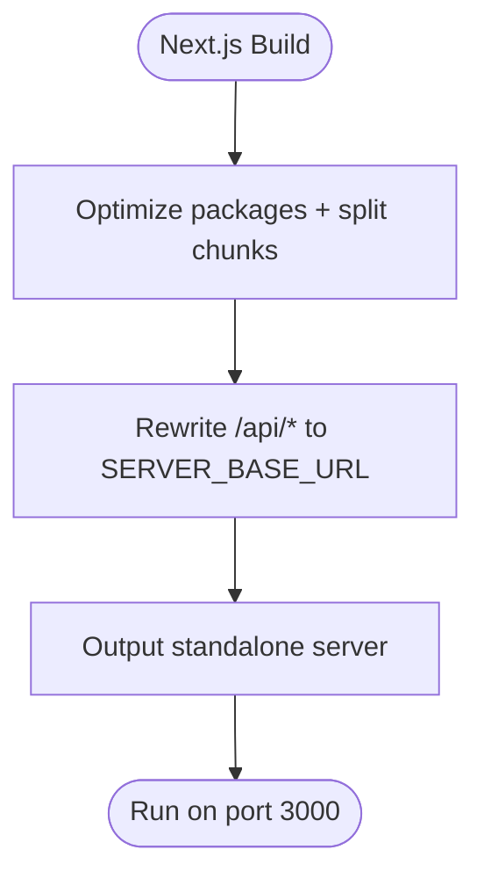

# Deployment and Operations

<cite>
**Referenced Files in This Document**
- [Dockerfile](file://Dockerfile)
- [docker-compose.yml](file://docker-compose.yml)
- [run.sh](file://run.sh)
- [setup_provider.sh](file://setup_provider.sh)
- [api/requirements.txt](file://api/requirements.txt)
- [package.json](file://package.json)
- [next.config.ts](file://next.config.ts)
- [api/logging_config.py](file://api/logging_config.py)
- [api/main.py](file://api/main.py)
- [api/config.py](file://api/config.py)
- [api/api.py](file://api/api.py)
- [Dockerfile-ollama-local](file://Dockerfile-ollama-local)
- [Ollama-instruction.md](file://Ollama-instruction.md)
- [PROVIDER_SETUP_GUIDE.md](file://PROVIDER_SETUP_GUIDE.md)
- [GITHUB_COPILOT_INTEGRATION_SUMMARY.md](file://GITHUB_COPILOT_INTEGRATION_SUMMARY.md)
- [IFLOW_INTEGRATION.md](file://IFLOW_INTEGRATION.md)
</cite>

## Table of Contents
1. [Introduction](#introduction)
2. [Project Structure](#project-structure)
3. [Core Components](#core-components)
4. [Architecture Overview](#architecture-overview)
5. [Detailed Component Analysis](#detailed-component-analysis)
6. [Dependency Analysis](#dependency-analysis)
7. [Performance Considerations](#performance-considerations)
8. [Troubleshooting Guide](#troubleshooting-guide)
9. [Conclusion](#conclusion)
10. [Appendices](#appendices)

## Introduction
This document provides comprehensive deployment and operations guidance for DeepWiki-Open. It covers containerization with Docker, orchestration via docker-compose, persistent data management, production deployment strategies, environment configuration, logging and monitoring, performance tuning, scaling, disaster recovery, security hardening, network configuration, CI/CD integration, automated testing, and operational maintenance. Practical examples and diagrams illustrate key processes and relationships.

## Project Structure
DeepWiki-Open consists of:
- A Python FastAPI backend serving streaming chat, wiki cache, and model configuration endpoints
- A Next.js frontend built as a standalone server
- Docker images for cloud and local Ollama deployments
- Operational scripts for provider setup and Ollama-based local AI

**Diagram sources**
- [Dockerfile](file://Dockerfile#L1-L171)
- [docker-compose.yml](file://docker-compose.yml#L1-L46)
- [Dockerfile-ollama-local](file://Dockerfile-ollama-local#L1-L192)
- [api/main.py](file://api/main.py#L1-L104)
- [api/api.py](file://api/api.py#L1-L635)
- [api/config.py](file://api/config.py#L1-L464)
- [api/logging_config.py](file://api/logging_config.py#L1-L86)
- [next.config.ts](file://next.config.ts#L1-L71)
- [package.json](file://package.json#L1-L40)
- [setup_provider.sh](file://setup_provider.sh#L1-L189)
- [run.sh](file://run.sh#L1-L1)
- [Ollama-instruction.md](file://Ollama-instruction.md#L1-L190)

**Section sources**
- [Dockerfile](file://Dockerfile#L1-L171)
- [docker-compose.yml](file://docker-compose.yml#L1-L46)
- [next.config.ts](file://next.config.ts#L1-L71)
- [package.json](file://package.json#L1-L40)

## Core Components
- Backend service
  - FastAPI app with streaming chat, wiki cache, export, and model configuration endpoints
  - Uvicorn server entrypoint with environment-driven configuration
- Frontend service
  - Next.js standalone server with rewrites to backend endpoints
- Containerization
  - Multi-stage Docker builds for Node and Python, exposing ports for API and frontend
  - Optional Ollama-local image for fully local AI processing
- Operational scripts
  - Provider setup script to switch between DashScope and GitHub Copilot
  - Local development runner script

Key operational environment variables:
- PORT, NODE_ENV, SERVER_BASE_URL, LOG_LEVEL, LOG_FILE_PATH, HTTP_PROXY/HTTPS_PROXY/NO_PROXY
- Provider-specific keys: OPENAI_API_KEY, GOOGLE_API_KEY, OPENROUTER_API_KEY, IFLOW_API_KEY, AWS_* for Bedrock, DASHSCOPE_API_KEY, GITHUB_TOKEN

**Section sources**
- [api/api.py](file://api/api.py#L1-L635)
- [api/main.py](file://api/main.py#L1-L104)
- [Dockerfile](file://Dockerfile#L138-L171)
- [docker-compose.yml](file://docker-compose.yml#L15-L46)
- [api/config.py](file://api/config.py#L19-L47)
- [setup_provider.sh](file://setup_provider.sh#L20-L23)

## Architecture Overview
The system runs as a dual-service container: a Python FastAPI backend and a Next.js frontend. docker-compose orchestrates networking, port mapping, volumes, and health checks. Persistent data is stored under ~/.adalflow and logs under ./api/logs.

**Diagram sources**
- [docker-compose.yml](file://docker-compose.yml#L1-L46)
- [Dockerfile](file://Dockerfile#L138-L171)
- [api/api.py](file://api/api.py#L540-L547)

**Section sources**
- [docker-compose.yml](file://docker-compose.yml#L1-L46)
- [Dockerfile](file://Dockerfile#L138-L171)
- [api/api.py](file://api/api.py#L540-L547)

## Detailed Component Analysis

### Backend Service (FastAPI + Uvicorn)
- Entrypoint loads environment, applies proxy and timeout patches for LiteLLM, configures logging, and starts Uvicorn with reload in development.
- Exposes endpoints for:
  - Model configuration discovery
  - Wiki cache read/write/delete
  - Local repository structure inspection
  - Wiki export (Markdown/JSON)
  - Health check
- Persistent cache stored under ~/.adalflow/wikicache

**Diagram sources**
- [api/api.py](file://api/api.py#L461-L503)
- [api/api.py](file://api/api.py#L413-L457)

**Section sources**
- [api/main.py](file://api/main.py#L87-L104)
- [api/api.py](file://api/api.py#L1-L635)

### Frontend Service (Next.js Standalone)
- Builds a standalone server and rewrites frontend routes to backend endpoints using SERVER_BASE_URL.
- Ports exposed: 3000 for frontend, 8001 for backend.

**Diagram sources**
- [next.config.ts](file://next.config.ts#L1-L71)
- [Dockerfile](file://Dockerfile#L60-L63)

**Section sources**
- [next.config.ts](file://next.config.ts#L1-L71)
- [Dockerfile](file://Dockerfile#L60-L63)

### Containerization and Image Building
- Multi-stage build:
  - Node base stage installs Node and builds Next.js
  - Python base stage installs dependencies and prepares runtime
  - Final stage merges artifacts, sets environment, exposes ports, and runs both services via a startup script
- Startup script validates required environment variables and launches backend and frontend concurrently
- Health check probes /health on backend port

**Diagram sources**
- [Dockerfile](file://Dockerfile#L14-L171)

**Section sources**
- [Dockerfile](file://Dockerfile#L1-L171)
- [docker-compose.yml](file://docker-compose.yml#L36-L46)

### Ollama-Local Deployment
- Dedicated Dockerfile pulls and serves Ollama, preloads models, and runs both backend and frontend
- Suitable for fully local AI processing without cloud API keys

**Diagram sources**
- [Dockerfile-ollama-local](file://Dockerfile-ollama-local#L108-L180)

**Section sources**
- [Dockerfile-ollama-local](file://Dockerfile-ollama-local#L1-L192)
- [Ollama-instruction.md](file://Ollama-instruction.md#L81-L104)

### Provider Configuration and Switching
- setup_provider.sh automates switching between DashScope and GitHub Copilot by copying provider-specific JSON configs into active generator.json and embedder.json
- Validates environment prerequisites and backs up current configs

**Diagram sources**
- [setup_provider.sh](file://setup_provider.sh#L95-L130)

**Section sources**
- [setup_provider.sh](file://setup_provider.sh#L1-L189)
- [PROVIDER_SETUP_GUIDE.md](file://PROVIDER_SETUP_GUIDE.md#L1-L156)

### Logging Configuration
- Centralized logging setup with rotating file handler and console handler
- Environment-driven configuration: LOG_LEVEL, LOG_FILE_PATH, LOG_MAX_SIZE (MB), LOG_BACKUP_COUNT
- Path safety enforced to prevent path traversal outside logs directory

**Diagram sources**
- [api/logging_config.py](file://api/logging_config.py#L12-L86)

**Section sources**
- [api/logging_config.py](file://api/logging_config.py#L1-L86)
- [docker-compose.yml](file://docker-compose.yml#L24-L25)

## Dependency Analysis
- Python runtime depends on FastAPI, Uvicorn, LiteLLM, OpenAI, Azure/AWS SDKs, FAISS, and others as defined in requirements
- Node runtime depends on Next.js and UI libraries as defined in package.json
- Next.js rewrites frontend routes to backend endpoints using SERVER_BASE_URL

**Diagram sources**
- [api/requirements.txt](file://api/requirements.txt#L1-L22)
- [package.json](file://package.json#L11-L37)

**Section sources**
- [api/requirements.txt](file://api/requirements.txt#L1-L22)
- [package.json](file://package.json#L1-L40)
- [next.config.ts](file://next.config.ts#L36-L67)

## Performance Considerations
- Memory limits and reservations in docker-compose help constrain resource usage
- Next.js build optimizations reduce memory footprint during build
- Logging rotation prevents disk growth; tune LOG_MAX_SIZE and LOG_BACKUP_COUNT per retention needs
- For local Ollama, choose appropriate models and hardware resources as outlined in the Ollama guide

**Section sources**
- [docker-compose.yml](file://docker-compose.yml#L37-L38)
- [next.config.ts](file://next.config.ts#L12-L35)
- [api/logging_config.py](file://api/logging_config.py#L47-L58)
- [Ollama-instruction.md](file://Ollama-instruction.md#L159-L176)

## Troubleshooting Guide
Common operational issues and remedies:
- Missing required environment variables
  - Symptoms: warnings at startup about OPENAI_API_KEY and GOOGLE_API_KEY
  - Action: set environment variables or mount .env
- Provider configuration problems
  - DashScope: ensure DASHSCOPE_API_KEY is set
  - GitHub Copilot: automatic OAuth2; no API key required
  - iFlow: ensure IFLOW_API_KEY is set
- Health check failures
  - docker-compose healthcheck probes /health; verify backend port and service readiness
- Logging path errors
  - LOG_FILE_PATH must resolve inside logs/ directory; adjust to avoid path traversal
- Local Ollama connectivity
  - Ensure Ollama is running and reachable; verify model downloads and OLLAMA_HOST

**Section sources**
- [api/main.py](file://api/main.py#L60-L77)
- [api/config.py](file://api/config.py#L19-L47)
- [docker-compose.yml](file://docker-compose.yml#L40-L44)
- [api/logging_config.py](file://api/logging_config.py#L38-L42)
- [Ollama-instruction.md](file://Ollama-instruction.md#L114-L128)

## Conclusion
DeepWiki-Open offers flexible deployment options via Docker and docker-compose, with robust logging, health checks, and provider configuration automation. Production readiness requires careful environment management, persistent volume configuration, and monitoring setup. The Ollama-local image enables fully offline operation. Follow the operational guidelines for scaling, security, and CI/CD integration to maintain reliable service delivery.

## Appendices

### Production Deployment Strategies
- Use docker-compose for single-host orchestration with resource limits and health checks
- Persist data via volumes for ~/.adalflow and ./api/logs
- Configure environment variables via .env and compose environment blocks
- Set LOG_LEVEL and LOG_FILE_PATH for centralized logging

**Section sources**
- [docker-compose.yml](file://docker-compose.yml#L15-L46)
- [Dockerfile](file://Dockerfile#L138-L171)

### Environment Configuration Checklist
- Required
  - OPENAI_API_KEY, GOOGLE_API_KEY
- Optional
  - OPENROUTER_API_KEY, IFLOW_API_KEY, AWS_ACCESS_KEY_ID, AWS_SECRET_ACCESS_KEY, AWS_REGION, AWS_ROLE_ARN, GITHUB_TOKEN
- Runtime
  - PORT, NODE_ENV, SERVER_BASE_URL, LOG_LEVEL, LOG_FILE_PATH, HTTP_PROXY/HTTPS_PROXY/NO_PROXY

**Section sources**
- [api/main.py](file://api/main.py#L60-L77)
- [api/config.py](file://api/config.py#L19-L47)
- [docker-compose.yml](file://docker-compose.yml#L20-L31)

### Monitoring and Observability
- Health endpoint: GET /health
- Logging: rotating files with configurable size and backups
- Metrics: extend with Prometheus/OpenTelemetry exporters as needed

**Section sources**
- [api/api.py](file://api/api.py#L540-L547)
- [api/logging_config.py](file://api/logging_config.py#L12-L86)

### Scaling Considerations
- Horizontal scaling: deploy behind a load balancer; ensure shared cache/storage if needed
- Vertical scaling: increase mem_limit and mem_reservation in docker-compose
- Stateless backend: rely on external cache and storage for session/stateless design

**Section sources**
- [docker-compose.yml](file://docker-compose.yml#L37-L38)

### Disaster Recovery Procedures
- Back up ~/.adalflow and ./api/logs volumes regularly
- Maintain provider configuration backups created by setup_provider.sh
- Restore steps:
  - Stop service, replace volumes with backups, restart

**Section sources**
- [setup_provider.sh](file://setup_provider.sh#L95-L108)

### Security Hardening
- Network
  - Restrict inbound ports to 3000 and 8001; use reverse proxy with TLS termination
- Secrets
  - Store API keys in secure secret management; avoid committing to images
- Certificates
  - Use CUSTOM_CERT_DIR in Dockerfile to inject CA certificates if required
- Least privilege
  - Run containers as non-root where feasible; restrict filesystem mounts

**Section sources**
- [Dockerfile](file://Dockerfile#L115-L125)

### CI/CD Integration and Automated Testing
- Build images with Dockerfile and Dockerfile-ollama-local
- Run tests in CI using Python test runners and provider-specific test suites
- Example test commands:
  - Python tests: python tests/run_tests.py
  - GitHub Copilot tests: python tests/test_github_copilot_all.py

**Section sources**
- [run.sh](file://run.sh#L1-L1)
- [PROVIDER_SETUP_GUIDE.md](file://PROVIDER_SETUP_GUIDE.md#L63-L81)
- [GITHUB_COPILOT_INTEGRATION_SUMMARY.md](file://GITHUB_COPILOT_INTEGRATION_SUMMARY.md#L135-L161)

### Operational Maintenance Procedures
- Rotate logs regularly; monitor disk usage
- Validate provider configurations periodically
- Update images and dependencies; test upgrades in staging

**Section sources**
- [api/logging_config.py](file://api/logging_config.py#L47-L58)
- [setup_provider.sh](file://setup_provider.sh#L110-L130)