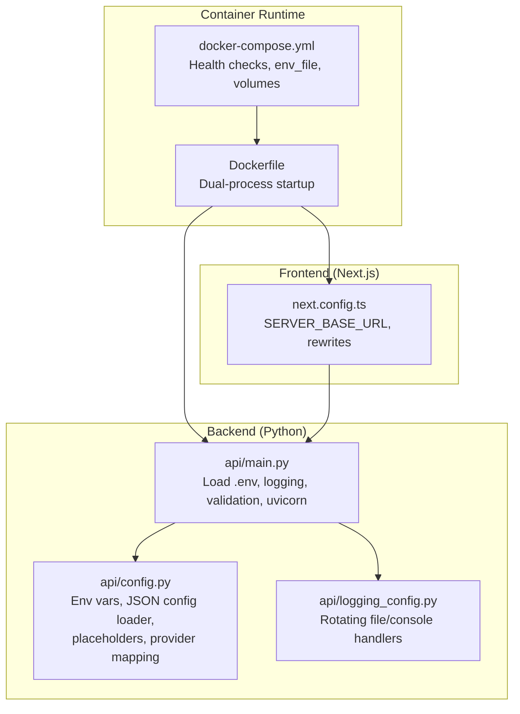
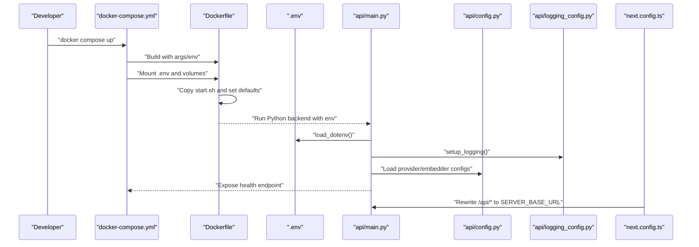
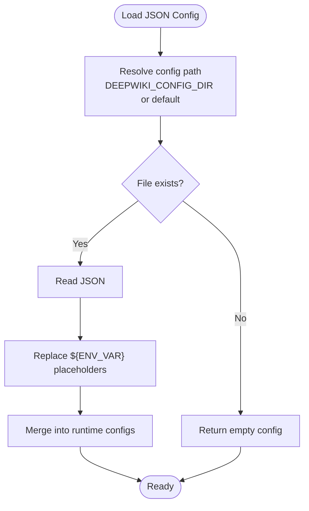
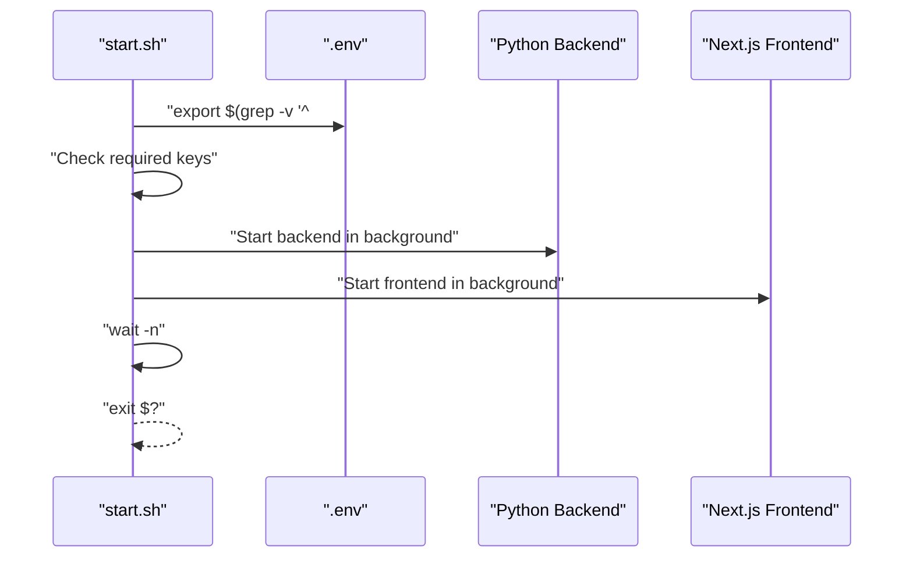
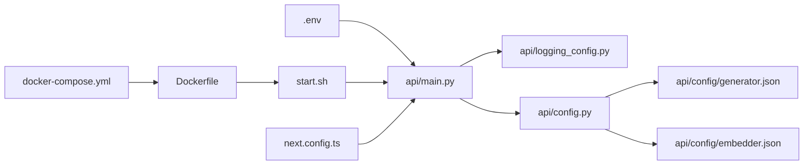

# Environment Configuration and Variables

<cite>
**Referenced Files in This Document**
- [run.sh](file://run.sh)
- [Dockerfile](file://Dockerfile)
- [docker-compose.yml](file://docker-compose.yml)
- [api/main.py](file://api/main.py)
- [api/config.py](file://api/config.py)
- [api/logging_config.py](file://api/logging_config.py)
- [next.config.ts](file://next.config.ts)
- [setup_provider.sh](file://setup_provider.sh)
- [api/config/generator.json](file://api/config/generator.json)
- [api/config/embedder.json](file://api/config/embedder.json)
</cite>

## Table of Contents
1. [Introduction](#introduction)
2. [Project Structure](#project-structure)
3. [Core Components](#core-components)
4. [Architecture Overview](#architecture-overview)
5. [Detailed Component Analysis](#detailed-component-analysis)
6. [Dependency Analysis](#dependency-analysis)
7. [Performance Considerations](#performance-considerations)
8. [Troubleshooting Guide](#troubleshooting-guide)
9. [Conclusion](#conclusion)
10. [Appendices](#appendices)

## Introduction
This document explains how DeepWiki-Open manages environment configuration and variables across development and production environments. It covers required and optional environment variables (including AI provider API keys), database-free configuration via JSON files, proxy support, logging configuration, and the startup behavior that runs both the backend API server and the frontend Next.js server. It also provides practical examples, security best practices, and troubleshooting guidance.

## Project Structure
DeepWiki-Open’s environment configuration spans:
- Backend Python service: loads environment variables, validates required keys, sets up logging, and starts the API server.
- Frontend Next.js app: configured via environment variables and rewritten routes to proxy API requests to the backend.
- Containerized runtime: Dockerfile and docker-compose orchestrate dual-process startup, proxy propagation, and health checks.
- Provider configuration: JSON files under api/config define model providers and embedders; a helper script selects provider configurations.

**Diagram sources**
- [Dockerfile](file://Dockerfile#L141-L170)
- [docker-compose.yml](file://docker-compose.yml#L1-L46)
- [api/main.py](file://api/main.py#L1-L104)
- [api/config.py](file://api/config.py#L1-L464)
- [api/logging_config.py](file://api/logging_config.py#L1-L86)
- [next.config.ts](file://next.config.ts#L1-L71)

**Section sources**
- [Dockerfile](file://Dockerfile#L1-L171)
- [docker-compose.yml](file://docker-compose.yml#L1-L46)
- [api/main.py](file://api/main.py#L1-L104)
- [api/config.py](file://api/config.py#L1-L464)
- [api/logging_config.py](file://api/logging_config.py#L1-L86)
- [next.config.ts](file://next.config.ts#L1-L71)

## Core Components
- Environment variable loading and precedence:
  - Backend loads .env automatically at startup.
  - Docker Compose mounts a .env file and passes environment variables to the container.
  - Dockerfile supports proxy variables and a .env loader at runtime.
- Validation:
  - Backend checks for required keys and logs warnings for missing ones.
  - Dockerfile warns if required keys are not set.
- Logging:
  - Centralized logging configuration supports environment-controlled log level, file path, rotation size, and backup count.
- Provider configuration:
  - JSON files define providers and models; a script copies provider-specific JSON into active configuration files.
- Frontend routing:
  - Next.js rewrites API paths to the backend server URL derived from environment.

**Section sources**
- [api/main.py](file://api/main.py#L4-L7)
- [docker-compose.yml](file://docker-compose.yml#L18-L21)
- [Dockerfile](file://Dockerfile#L142-L169)
- [api/main.py](file://api/main.py#L60-L77)
- [api/logging_config.py](file://api/logging_config.py#L12-L86)
- [setup_provider.sh](file://setup_provider.sh#L1-L189)
- [next.config.ts](file://next.config.ts#L3-L67)

## Architecture Overview
The environment configuration pipeline integrates frontend and backend services with container orchestration and configuration files.

**Diagram sources**
- [docker-compose.yml](file://docker-compose.yml#L1-L46)
- [Dockerfile](file://Dockerfile#L141-L170)
- [api/main.py](file://api/main.py#L4-L7)
- [api/logging_config.py](file://api/logging_config.py#L12-L86)
- [api/config.py](file://api/config.py#L104-L126)
- [next.config.ts](file://next.config.ts#L36-L67)

## Detailed Component Analysis

### Environment Variables and Precedence
- Loading order and precedence:
  - Python .env loading occurs early in the backend entrypoint.
  - docker-compose env_file and environment entries override Dockerfile ENV defaults.
  - Dockerfile ARG proxy values propagate to ENV for build and runtime.
- Required variables:
  - GOOGLE_API_KEY and OPENAI_API_KEY are required for basic functionality.
- Optional variables:
  - GITHUB_TOKEN, OPENROUTER_API_KEY, IFLOW_API_KEY, AWS_ACCESS_KEY_ID, AWS_SECRET_ACCESS_KEY.
- Provider-specific variables:
  - DASHSCOPE_API_KEY for DashScope.
  - GitHub Copilot uses automatic OAuth2; no API key is required.
- Logging variables:
  - LOG_LEVEL, LOG_FILE_PATH, LOG_MAX_SIZE, LOG_BACKUP_COUNT.

**Section sources**
- [api/main.py](file://api/main.py#L60-L77)
- [Dockerfile](file://Dockerfile#L142-L153)
- [docker-compose.yml](file://docker-compose.yml#L18-L31)
- [api/logging_config.py](file://api/logging_config.py#L16-L20)
- [setup_provider.sh](file://setup_provider.sh#L20-L23)

### Configuration Files and Variable Placeholders
- JSON configuration loader:
  - Loads generator.json, embedder.json, repo.json, lang.json from a configurable directory or defaults.
  - Applies environment variable placeholders in configuration strings using ${ENV_VAR} syntax.
  - Warns when placeholders are not found and leaves the literal placeholder in place.
- Provider selection:
  - DEEPWIKI_EMBEDDER_TYPE controls which embedder configuration is used.
  - Provider mapping resolves client classes for generators and embedders.
- Example configurations:
  - generator.json defines providers and models.
  - embedder.json defines batch sizes, chunking, and model parameters.

**Diagram sources**
- [api/config.py](file://api/config.py#L104-L126)
- [api/config.py](file://api/config.py#L73-L101)

**Section sources**
- [api/config.py](file://api/config.py#L57-L58)
- [api/config.py](file://api/config.py#L104-L126)
- [api/config.py](file://api/config.py#L73-L101)
- [api/config/generator.json](file://api/config/generator.json#L1-L101)
- [api/config/embedder.json](file://api/config/embedder.json#L1-L35)

### Startup Script and Dual-Process Execution
- Dockerfile start.sh:
  - Loads .env if present.
  - Validates presence of required keys and prints a warning if missing.
  - Starts the Python backend on PORT and the Next.js server on 3000 concurrently.
  - Waits for either process to exit and propagates the exit status.
- docker-compose:
  - Mounts .env and persistent volumes.
  - Sets health check against the backend /health endpoint.
  - Exposes ports 8001 (backend) and 3000 (frontend).
- run.sh:
  - Minimal wrapper that invokes the Python module entrypoint.

**Diagram sources**
- [Dockerfile](file://Dockerfile#L142-L159)
- [docker-compose.yml](file://docker-compose.yml#L39-L45)
- [run.sh](file://run.sh#L1-L1)

**Section sources**
- [Dockerfile](file://Dockerfile#L142-L159)
- [docker-compose.yml](file://docker-compose.yml#L39-L45)
- [run.sh](file://run.sh#L1-L1)

### Logging Configuration
- Controls:
  - LOG_LEVEL, LOG_FILE_PATH, LOG_MAX_SIZE (MB), LOG_BACKUP_COUNT.
- Security:
  - Validates LOG_FILE_PATH to prevent path traversal outside a trusted logs directory.
- Handlers:
  - Rotating file handler and console handler with shared formatter.
- Filters:
  - Suppresses noisy “Detected file change” messages.

**Section sources**
- [api/logging_config.py](file://api/logging_config.py#L16-L20)
- [api/logging_config.py](file://api/logging_config.py#L38-L42)
- [api/logging_config.py](file://api/logging_config.py#L64-L77)

### Frontend Proxy and Routing
- SERVER_BASE_URL determines the backend target for rewrites.
- Rewrites forward API endpoints from Next.js to the backend server.

**Section sources**
- [next.config.ts](file://next.config.ts#L3-L67)

### Provider Configuration Management
- setup_provider.sh:
  - Copies provider-specific JSON into active generator.json and embedder.json.
  - Supports DashScope and GitHub Copilot.
  - Provides usage, backup, and testing guidance.

**Section sources**
- [setup_provider.sh](file://setup_provider.sh#L1-L189)

## Dependency Analysis
The environment configuration touches several subsystems with clear dependencies.

**Diagram sources**
- [api/main.py](file://api/main.py#L4-L7)
- [docker-compose.yml](file://docker-compose.yml#L18-L21)
- [Dockerfile](file://Dockerfile#L142-L159)
- [api/logging_config.py](file://api/logging_config.py#L12-L86)
- [api/config.py](file://api/config.py#L104-L126)
- [api/config/generator.json](file://api/config/generator.json#L1-L101)
- [api/config/embedder.json](file://api/config/embedder.json#L1-L35)
- [next.config.ts](file://next.config.ts#L36-L67)

**Section sources**
- [api/main.py](file://api/main.py#L1-L104)
- [api/config.py](file://api/config.py#L1-L464)
- [api/logging_config.py](file://api/logging_config.py#L1-L86)
- [next.config.ts](file://next.config.ts#L1-L71)
- [docker-compose.yml](file://docker-compose.yml#L1-L46)
- [Dockerfile](file://Dockerfile#L1-L171)

## Performance Considerations
- Logging rotation:
  - Tune LOG_MAX_SIZE and LOG_BACKUP_COUNT to balance disk usage and retention.
- Embedding chunking:
  - Adjust chunk size and overlap in embedder.json for corpus characteristics.
- Provider throughput:
  - Batch sizes differ by provider; align with provider limits to avoid throttling.

[No sources needed since this section provides general guidance]

## Troubleshooting Guide
- Missing required keys:
  - Symptoms: Warnings at startup and degraded functionality.
  - Resolution: Set GOOGLE_API_KEY and OPENAI_API_KEY via .env or environment variables.
- Proxy timeouts with GitHub Copilot:
  - Symptom: Timeout errors behind corporate proxies.
  - Resolution: The backend patches timeouts for compatible libraries before imports.
- Health check failures:
  - Symptom: docker-compose reports unhealthy.
  - Resolution: Verify backend port and /health endpoint; adjust PORT and SERVER_BASE_URL accordingly.
- Log path errors:
  - Symptom: ValueError about LOG_FILE_PATH outside trusted directory.
  - Resolution: Use a path within the logs directory or fix permissions.
- Provider mismatch:
  - Symptom: Unexpected provider behavior after switching configurations.
  - Resolution: Use setup_provider.sh to copy the intended provider JSON into active files.

**Section sources**
- [api/main.py](file://api/main.py#L11-L20)
- [api/main.py](file://api/main.py#L60-L77)
- [docker-compose.yml](file://docker-compose.yml#L40-L45)
- [api/logging_config.py](file://api/logging_config.py#L38-L42)
- [setup_provider.sh](file://setup_provider.sh#L1-L189)

## Conclusion
DeepWiki-Open centralizes environment configuration through a combination of .env loading, Docker orchestration, and JSON-based provider configs. The backend validates required keys, configures logging, and exposes a health endpoint, while the frontend proxies API calls to the backend. By following the guidance here, you can securely manage secrets, configure providers, and troubleshoot environment-specific issues across development and production.

[No sources needed since this section summarizes without analyzing specific files]

## Appendices

### Practical Examples

- Development environment
  - Create a .env with required keys and optional variables.
  - Use docker-compose to mount .env and run the stack; health checks confirm readiness.
  - Adjust LOG_LEVEL and LOG_FILE_PATH for verbose logging during development.

- Production environment
  - Pass environment variables via docker-compose environment entries or secrets management.
  - Set SERVER_BASE_URL to the backend service address.
  - Configure proxy variables (HTTP_PROXY, HTTPS_PROXY, NO_PROXY) at build and runtime.

- Provider configuration
  - Choose a provider using setup_provider.sh; it backs up current configs and applies the selected provider JSON.
  - Verify active configuration files and run tests to validate setup.

**Section sources**
- [docker-compose.yml](file://docker-compose.yml#L18-L31)
- [Dockerfile](file://Dockerfile#L142-L159)
- [setup_provider.sh](file://setup_provider.sh#L1-L189)

### Security Best Practices
- Secrets handling
  - Store API keys in secure secret stores or CI/CD secret management; avoid committing .env files.
  - Restrict access to the logs directory and review log retention policies.
- Least privilege
  - Limit AWS credentials to required regions and roles when using Bedrock.
- Network isolation
  - Use NO_PROXY to restrict outbound traffic to trusted domains.

[No sources needed since this section provides general guidance]