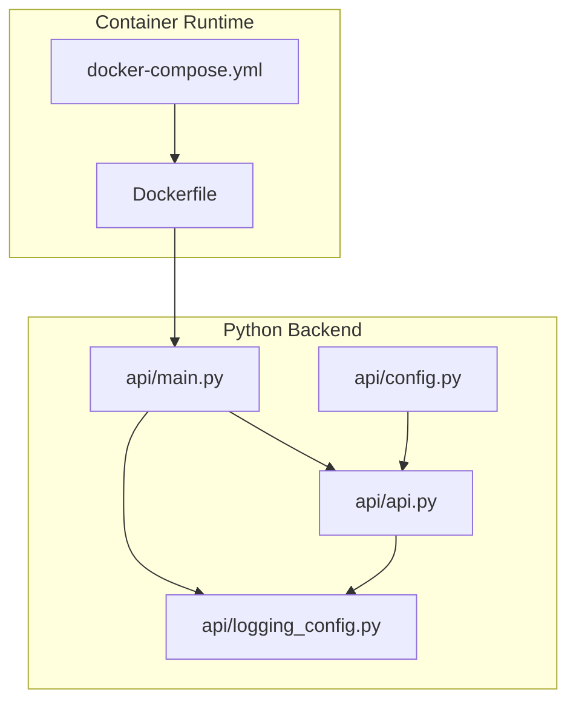
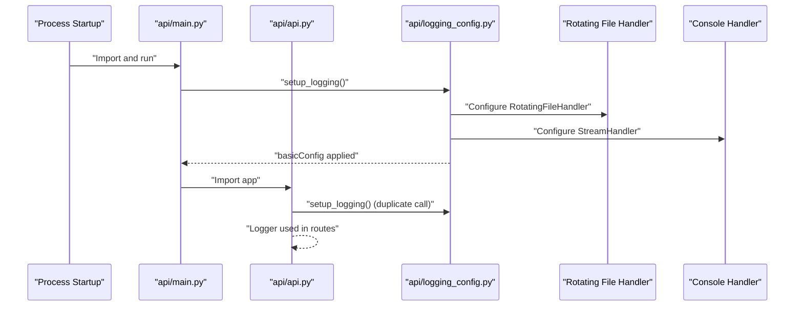
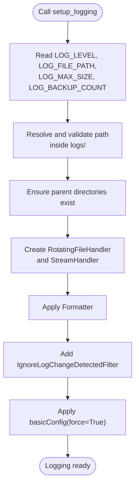
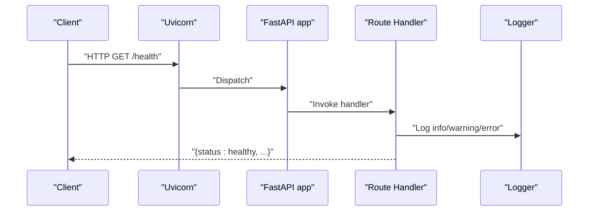
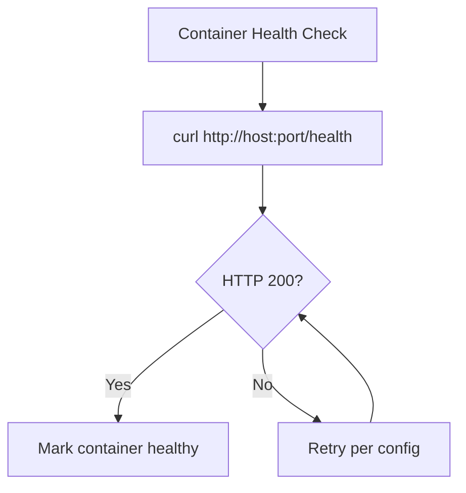
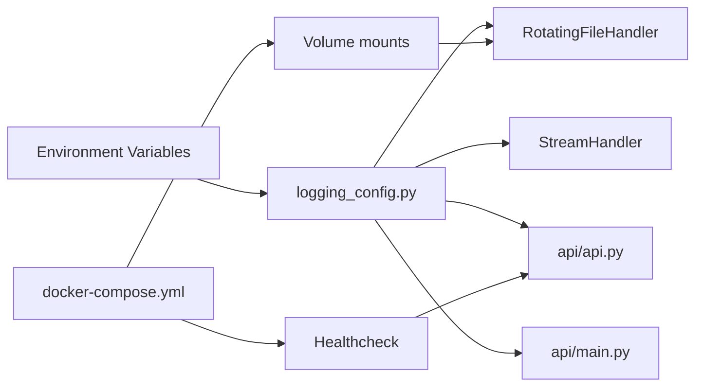

# Monitoring and Logging

<cite>
**Referenced Files in This Document**
- [logging_config.py](file://api/logging_config.py)
- [main.py](file://api/main.py)
- [api.py](file://api/api.py)
- [Dockerfile](file://Dockerfile)
- [docker-compose.yml](file://docker-compose.yml)
- [config.py](file://api/config.py)
</cite>

## Table of Contents
1. [Introduction](#introduction)
2. [Project Structure](#project-structure)
3. [Core Components](#core-components)
4. [Architecture Overview](#architecture-overview)
5. [Detailed Component Analysis](#detailed-component-analysis)
6. [Dependency Analysis](#dependency-analysis)
7. [Performance Considerations](#performance-considerations)
8. [Troubleshooting Guide](#troubleshooting-guide)
9. [Conclusion](#conclusion)
10. [Appendices](#appendices)

## Introduction
This document explains the monitoring and logging infrastructure of DeepWiki-Open. It covers logging configuration (levels, formatting, rotation, destinations), integration with FastAPI’s logging system, custom handlers, health checks, and operational guidance for containerized deployments. It also provides practical examples for centralized logging, log aggregation, alerting, and observability patterns tailored to cloud-native environments.

## Project Structure
DeepWiki-Open’s logging and monitoring spans the Python backend (FastAPI) and container orchestration. The backend initializes logging early, writes to rotating files and stdout, and exposes a health endpoint. Containerization persists logs and integrates health checks.

**Diagram sources**
- [Dockerfile](file://Dockerfile#L1-L171)
- [docker-compose.yml](file://docker-compose.yml#L1-L46)
- [main.py](file://api/main.py#L1-L104)
- [api.py](file://api/api.py#L1-L635)
- [logging_config.py](file://api/logging_config.py#L1-L86)
- [config.py](file://api/config.py#L1-L464)

**Section sources**
- [Dockerfile](file://Dockerfile#L1-L171)
- [docker-compose.yml](file://docker-compose.yml#L1-L46)
- [main.py](file://api/main.py#L1-L104)
- [api.py](file://api/api.py#L1-L635)
- [logging_config.py](file://api/logging_config.py#L1-L86)
- [config.py](file://api/config.py#L1-L464)

## Core Components
- Centralized logging initialization with environment-driven configuration and secure file handling.
- Dual-output logging to rotating files and console.
- Filter to suppress noisy filesystem change logs.
- Health endpoint for runtime checks.
- Container orchestration with persistent logs and health checks.

Key implementation references:
- Logging setup and environment variables: [setup_logging](file://api/logging_config.py#L12-L86)
- Watchfiles logger tuning and development reload exclusion: [main.py](file://api/main.py#L24-L56)
- Health endpoint: [/health](file://api/api.py#L540-L547)
- Log persistence volume mount: [docker-compose.yml](file://docker-compose.yml#L32-L36)

**Section sources**
- [logging_config.py](file://api/logging_config.py#L12-L86)
- [main.py](file://api/main.py#L24-L56)
- [api.py](file://api/api.py#L540-L547)
- [docker-compose.yml](file://docker-compose.yml#L32-L36)

## Architecture Overview
The logging pipeline is initialized at process startup, applies a shared configuration across FastAPI routes, and emits structured logs to both file and console. The container orchestrator persists logs and monitors service health.

**Diagram sources**
- [main.py](file://api/main.py#L22-L26)
- [api.py](file://api/api.py#L13-L17)
- [logging_config.py](file://api/logging_config.py#L12-L86)

## Detailed Component Analysis

### Logging Configuration and Handlers
- Environment-driven configuration:
  - Log level: LOG_LEVEL (default INFO)
  - Log file path: LOG_FILE_PATH (default under api/logs/)
  - Rotation size: LOG_MAX_SIZE in MB (default 10 MB)
  - Backup count: LOG_BACKUP_COUNT (default 5)
- Security: resolves and validates file paths to prevent path traversal outside the logs directory.
- Formatting: configurable format string; default includes timestamp, level, module, filename, line number, and message.
- Handlers:
  - RotatingFileHandler with UTF-8 encoding and maxBytes/backupCount.
  - StreamHandler to stdout.
- Filter: suppresses noisy “Detected file change” messages from watchfiles.

Operational notes:
- The logging setup is called twice (once in main and again in api) to ensure configuration regardless of import order.
- In development, watchfiles is patched to avoid watching the logs directory.

References:
- [setup_logging](file://api/logging_config.py#L12-L86)
- [main.py](file://api/main.py#L24-L56)

**Diagram sources**
- [logging_config.py](file://api/logging_config.py#L12-L86)

**Section sources**
- [logging_config.py](file://api/logging_config.py#L12-L86)
- [main.py](file://api/main.py#L24-L56)

### FastAPI Integration and Logger Usage
- FastAPI app initializes logging early and uses standard Python logging within route handlers.
- Logging statements appear across endpoints for operational visibility (info/warning/error).
- Health endpoint returns a simple JSON health status for monitoring systems.

References:
- [api.py](file://api/api.py#L13-L17)
- [api.py](file://api/api.py#L178-L225)
- [api.py](file://api/api.py#L238-L273)
- [api.py](file://api/api.py#L540-L547)

**Diagram sources**
- [api.py](file://api/api.py#L540-L547)

**Section sources**
- [api.py](file://api/api.py#L13-L17)
- [api.py](file://api/api.py#L178-L225)
- [api.py](file://api/api.py#L238-L273)
- [api.py](file://api/api.py#L540-L547)

### Health Checks and Observability Signals
- Health endpoint: returns service status, timestamp, and service identity.
- Container health check: curl-based probe against /health with tunable intervals/timeouts/retries.

References:
- [api.py](file://api/api.py#L540-L547)
- [docker-compose.yml](file://docker-compose.yml#L39-L45)

**Diagram sources**
- [docker-compose.yml](file://docker-compose.yml#L39-L45)
- [api.py](file://api/api.py#L540-L547)

**Section sources**
- [api.py](file://api/api.py#L540-L547)
- [docker-compose.yml](file://docker-compose.yml#L39-L45)

### Containerization, Persistence, and Proxies
- Multi-stage build with proxy environment propagation.
- Persistent volumes:
  - ~/.adalflow:/root/.adalflow (cache data)
  - ./api/logs:/app/api/logs (log persistence)
- Health check integration with compose.
- Ports exposed and defaults set.

References:
- [Dockerfile](file://Dockerfile#L1-L171)
- [docker-compose.yml](file://docker-compose.yml#L1-L46)

**Section sources**
- [Dockerfile](file://Dockerfile#L1-L171)
- [docker-compose.yml](file://docker-compose.yml#L1-L46)

## Dependency Analysis
Logging depends on environment variables and file system permissions. FastAPI routes depend on the shared logger configuration. Container orchestration depends on log persistence and health checks.

**Diagram sources**
- [logging_config.py](file://api/logging_config.py#L12-L86)
- [api.py](file://api/api.py#L1-L635)
- [main.py](file://api/main.py#L1-L104)
- [docker-compose.yml](file://docker-compose.yml#L1-L46)

**Section sources**
- [logging_config.py](file://api/logging_config.py#L12-L86)
- [api.py](file://api/api.py#L1-L635)
- [main.py](file://api/main.py#L1-L104)
- [docker-compose.yml](file://docker-compose.yml#L1-L46)

## Performance Considerations
- Log rotation: tune LOG_MAX_SIZE and LOG_BACKUP_COUNT to balance disk usage and retention.
- Console throughput: in high-throughput environments, consider reducing verbosity or offloading logs externally.
- File system I/O: ensure the logs directory is on a performant volume; monitor inode limits.
- Health checks: adjust compose healthcheck timing to avoid false positives during cold starts.

[No sources needed since this section provides general guidance]

## Troubleshooting Guide
Common issues and remedies:
- Permission denied writing logs:
  - Verify write permissions to the logs directory and that LOG_FILE_PATH remains within the logs folder.
  - Reference: [logging_config.py](file://api/logging_config.py#L38-L42)
- Missing or misconfigured environment variables:
  - Ensure LOG_LEVEL, LOG_FILE_PATH, LOG_MAX_SIZE, LOG_BACKUP_COUNT are set appropriately.
  - Reference: [logging_config.py](file://api/logging_config.py#L16-L20)
- Noisy watchfiles logs:
  - The IgnoreLogChangeDetectedFilter suppresses specific messages; confirm filter is applied.
  - Reference: [logging_config.py](file://api/logging_config.py#L72-L74)
- Health check failures:
  - Confirm /health responds with HTTP 200; adjust compose healthcheck settings if needed.
  - Reference: [api.py](file://api/api.py#L540-L547), [docker-compose.yml](file://docker-compose.yml#L39-L45)
- Development reload loops:
  - Logs are excluded from reload watches; confirm watchfiles patch is active.
  - Reference: [main.py](file://api/main.py#L35-L56)

**Section sources**
- [logging_config.py](file://api/logging_config.py#L16-L20)
- [logging_config.py](file://api/logging_config.py#L38-L42)
- [logging_config.py](file://api/logging_config.py#L72-L74)
- [api.py](file://api/api.py#L540-L547)
- [docker-compose.yml](file://docker-compose.yml#L39-L45)
- [main.py](file://api/main.py#L35-L56)

## Conclusion
DeepWiki-Open’s logging is robust, environment-driven, and production-ready. It provides structured logs with rotation, dual destinations, and a health endpoint for monitoring. Containerization ensures logs persist across restarts and integrates health checks. Extend this foundation with centralized log aggregation and alerting for production observability.

[No sources needed since this section summarizes without analyzing specific files]

## Appendices

### Practical Examples

- Centralized logging and log aggregation:
  - Mount logs to a shared volume or persistent storage and ship logs to a collector (e.g., Fluent Bit, Vector, Logstash).
  - Reference: [docker-compose.yml](file://docker-compose.yml#L32-L36)
- Alerting on error rates:
  - Parse logs for error-level entries and configure alerts on thresholds (e.g., rate of ERROR per minute).
  - Reference: [logging_config.py](file://api/logging_config.py#L60-L70)
- Containerized deployment best practices:
  - Set LOG_LEVEL to INFO or WARNING in production; increase to DEBUG only when needed.
  - Tune LOG_MAX_SIZE and LOG_BACKUP_COUNT for your retention policy.
  - Reference: [logging_config.py](file://api/logging_config.py#L16-L20)
- Debugging distributed systems:
  - Correlate timestamps and thread/process identifiers across services; ensure consistent log formats.
  - Reference: [logging_config.py](file://api/logging_config.py#L60-L61)
- Observability patterns:
  - Combine application logs with metrics and traces; use the health endpoint for liveness/readiness probes.
  - Reference: [api.py](file://api/api.py#L540-L547), [docker-compose.yml](file://docker-compose.yml#L39-L45)

[No sources needed since this section provides general guidance]