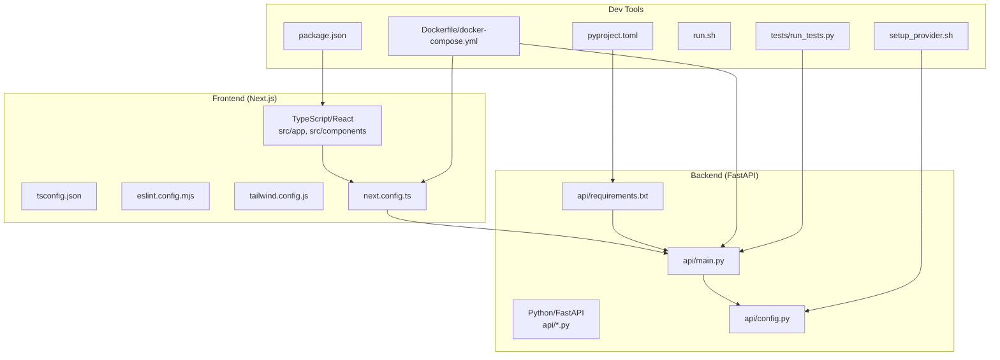
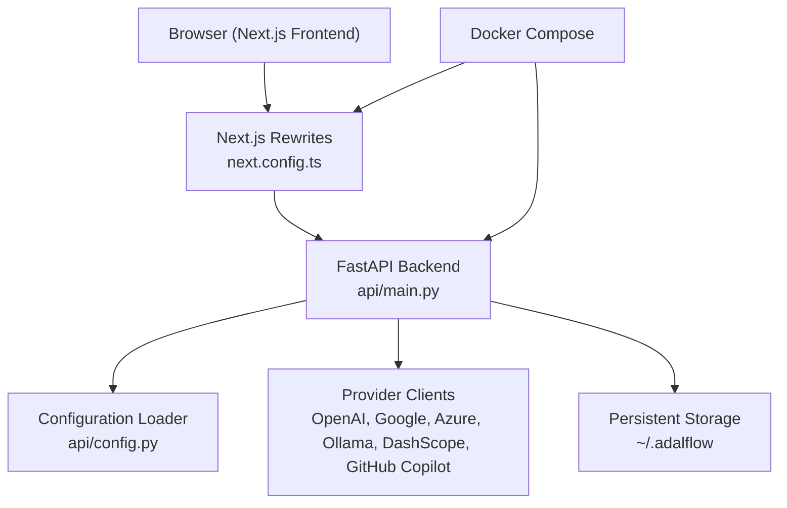

# Developer Setup Guide

<cite>
**Referenced Files in This Document**
- [README.md](file://README.md)
- [package.json](file://package.json)
- [pyproject.toml](file://pyproject.toml)
- [api/requirements.txt](file://api/requirements.txt)
- [Dockerfile](file://Dockerfile)
- [docker-compose.yml](file://docker-compose.yml)
- [eslint.config.mjs](file://eslint.config.mjs)
- [tsconfig.json](file://tsconfig.json)
- [next.config.ts](file://next.config.ts)
- [tailwind.config.js](file://tailwind.config.js)
- [run.sh](file://run.sh)
- [setup_provider.sh](file://setup_provider.sh)
- [api/config.py](file://api/config.py)
- [api/main.py](file://api/main.py)
- [src/app/layout.tsx](file://src/app/layout.tsx)
- [src/app/page.tsx](file://src/app/page.tsx)
- [pytest.ini](file://pytest.ini)
- [tests/run_tests.py](file://tests/run_tests.py)
</cite>

## Table of Contents
1. [Introduction](#introduction)
2. [Project Structure](#project-structure)
3. [Core Components](#core-components)
4. [Architecture Overview](#architecture-overview)
5. [Development Environment Setup](#development-environment-setup)
6. [Local Development Workflow](#local-development-workflow)
7. [Testing Procedures](#testing-procedures)
8. [Code Quality Tools](#code-quality-tools)
9. [Configuration Management](#configuration-management)
10. [Contribution Guidelines](#contribution-guidelines)
11. [Release Process](#release-process)
12. [Troubleshooting Guide](#troubleshooting-guide)
13. [Conclusion](#conclusion)

## Introduction
This guide provides comprehensive developer setup instructions for contributing to DeepWiki-Open. It covers environment prerequisites, IDE configuration, development workflows, testing procedures, and contribution standards. DeepWiki-Open is a dual-stack application featuring a Next.js frontend (TypeScript) and a FastAPI backend (Python), integrated with Docker for containerized deployment.

## Project Structure
The repository follows a clear separation of concerns:
- Frontend: Next.js application under `src/` with TypeScript, Tailwind CSS, and internationalization
- Backend: FastAPI server under `api/` with Python dependencies managed via pip and Poetry/Hatch
- Configuration: Shared configuration files for linting, TypeScript, and build optimization
- Testing: Python pytest-based test suites under `tests/`
- Packaging: Docker images for containerized deployment

**Diagram sources**
- [next.config.ts](file://next.config.ts#L1-L71)
- [tsconfig.json](file://tsconfig.json#L1-L28)
- [eslint.config.mjs](file://eslint.config.mjs#L1-L17)
- [tailwind.config.js](file://tailwind.config.js#L1-L8)
- [api/main.py](file://api/main.py#L1-L104)
- [api/config.py](file://api/config.py#L1-L464)
- [api/requirements.txt](file://api/requirements.txt#L1-L22)
- [pyproject.toml](file://pyproject.toml#L1-L49)
- [package.json](file://package.json#L1-L40)
- [Dockerfile](file://Dockerfile#L1-L171)
- [docker-compose.yml](file://docker-compose.yml#L1-L46)
- [run.sh](file://run.sh#L1-L1)
- [setup_provider.sh](file://setup_provider.sh#L1-L189)
- [tests/run_tests.py](file://tests/run_tests.py#L1-L184)

**Section sources**
- [README.md](file://README.md#L247-L267)
- [package.json](file://package.json#L1-L40)
- [pyproject.toml](file://pyproject.toml#L1-L49)
- [api/requirements.txt](file://api/requirements.txt#L1-L22)
- [Dockerfile](file://Dockerfile#L1-L171)
- [docker-compose.yml](file://docker-compose.yml#L1-L46)

## Core Components
- Frontend: Next.js 15 with TypeScript, Tailwind CSS, internationalization via next-intl, and Mermaid diagram rendering
- Backend: FastAPI with Uvicorn, supporting multiple AI providers (OpenAI, Google, OpenRouter, Azure, Ollama, DashScope, GitHub Copilot)
- Configuration: JSON-based provider configurations with environment variable substitution
- Testing: Unified test runner for unit, integration, API, and provider-specific tests

**Section sources**
- [src/app/layout.tsx](file://src/app/layout.tsx#L1-L32)
- [src/app/page.tsx](file://src/app/page.tsx#L1-L637)
- [api/config.py](file://api/config.py#L1-L464)
- [api/main.py](file://api/main.py#L1-L104)
- [tests/run_tests.py](file://tests/run_tests.py#L1-L184)

## Architecture Overview
The system operates as a two-tier application:
- Frontend (Next.js) communicates with the backend via API rewrites defined in Next configuration
- Backend serves FastAPI routes for wiki generation, streaming chat, authentication, and configuration
- Docker orchestrates both frontend and backend, exposing ports 8001 (API) and 3000 (frontend)

**Diagram sources**
- [next.config.ts](file://next.config.ts#L36-L67)
- [api/main.py](file://api/main.py#L87-L104)
- [api/config.py](file://api/config.py#L104-L182)
- [docker-compose.yml](file://docker-compose.yml#L4-L46)

**Section sources**
- [next.config.ts](file://next.config.ts#L1-L71)
- [api/main.py](file://api/main.py#L1-L104)
- [docker-compose.yml](file://docker-compose.yml#L1-L46)

## Development Environment Setup

### Prerequisites
- Node.js 20.x and npm/yarn for frontend
- Python 3.12+ for backend
- Docker (optional, for containerized development)
- Git for version control

**Section sources**
- [pyproject.toml](file://pyproject.toml#L6-L6)
- [package.json](file://package.json#L1-L40)

### Environment Variables
Create a `.env` file in the project root with required keys:
- `GOOGLE_API_KEY`: Required for Google Gemini and Google embeddings
- `OPENAI_API_KEY`: Required for OpenAI embeddings and models
- Optional: `OPENROUTER_API_KEY`, `AZURE_OPENAI_*`, `OLLAMA_HOST`, `DEEPWIKI_EMBEDDER_TYPE`, `PORT`, `SERVER_BASE_URL`

**Section sources**
- [README.md](file://README.md#L149-L164)
- [README.md](file://README.md#L481-L494)
- [api/main.py](file://api/main.py#L60-L77)

### Installation Methods

#### Option 1: Docker (Recommended for local development)
- Build and run with Docker Compose:
  - `docker-compose up`
  - Frontend: http://localhost:3000
  - Backend: http://localhost:8001
- Volumes persist repository data and logs under `~/.adalflow` and `./api/logs`

**Section sources**
- [README.md](file://README.md#L33-L55)
- [docker-compose.yml](file://docker-compose.yml#L1-L46)
- [Dockerfile](file://Dockerfile#L132-L171)

#### Option 2: Native Development (Manual setup)
- Backend:
  - Install Python dependencies: `pip install -r api/requirements.txt`
  - Start API server: `python -m api.main` or `uv run -m api.main`
- Frontend:
  - Install Node dependencies: `npm install` or `yarn install`
  - Start dev server: `npm run dev` or `yarn dev`
- Access:
  - Frontend: http://localhost:3000
  - Backend: http://localhost:8001

**Section sources**
- [README.md](file://README.md#L166-L196)
- [run.sh](file://run.sh#L1-L1)
- [package.json](file://package.json#L5-L10)

### IDE Configuration
- VS Code recommended extensions:
  - ESLint, Prettier, Tailwind CSS IntelliSense, Python (by ms-python), Pyright
- TypeScript strictness and path aliases configured in tsconfig.json
- ESLint flat config extends Next.js core-web-vitals and TypeScript rules

**Section sources**
- [tsconfig.json](file://tsconfig.json#L1-L28)
- [eslint.config.mjs](file://eslint.config.mjs#L12-L14)

## Local Development Workflow

### Start Both Services
- Docker: `docker-compose up`
- Native: Terminal 1: `npm run dev` (frontend), Terminal 2: `python -m api.main` (backend)

### Provider Configuration
- Use the provider setup script to configure DashScope or GitHub Copilot:
  - `./setup_provider.sh dashscope`
  - `./setup_provider.sh github_copilot`
- The script backs up current configurations and applies provider-specific JSON files

**Section sources**
- [setup_provider.sh](file://setup_provider.sh#L1-L189)
- [api/config.py](file://api/config.py#L104-L182)

### Frontend Interaction
- The home page accepts repository URLs or local paths, validates input, and opens a configuration modal
- Submissions trigger dynamic routing to `/[owner]/[repo]` with query parameters for provider/model selection

**Section sources**
- [src/app/page.tsx](file://src/app/page.tsx#L180-L401)

### Backend API
- FastAPI routes are proxied via Next.js rewrites to the backend server
- Health checks and API endpoints are exposed on port 8001 by default

**Section sources**
- [next.config.ts](file://next.config.ts#L36-L67)
- [api/main.py](file://api/main.py#L87-L104)

## Testing Procedures

### Test Categories
- Unit tests: Isolated logic tests
- Integration tests: End-to-end flows and provider integrations
- API tests: Backend endpoints validation
- Provider-specific tests: DashScope and GitHub Copilot suites

### Running Tests
- Unified test runner: `python tests/run_tests.py`
- Options:
  - `--unit`, `--integration`, `--api`, `--github-copilot`
  - `--check-env`: Verify environment and dependencies
  - `-v`: Verbose output

**Section sources**
- [pytest.ini](file://pytest.ini#L1-L16)
- [tests/run_tests.py](file://tests/run_tests.py#L137-L184)

### Environment Checks
- The test runner verifies presence of `.env`, required API keys, and optional dependencies
- GitHub Copilot uses OAuth2 (no API key required)

**Section sources**
- [tests/run_tests.py](file://tests/run_tests.py#L84-L136)

## Code Quality Tools

### Linting and Formatting
- ESLint configuration extends Next.js core-web-vitals and TypeScript rules
- Run linting: `npm run lint` or `yarn lint`

**Section sources**
- [eslint.config.mjs](file://eslint.config.mjs#L12-L14)
- [package.json](file://package.json#L9-L9)

### TypeScript Configuration
- Strict type checking, path aliases, and incremental builds
- Bundler module resolution for optimized imports

**Section sources**
- [tsconfig.json](file://tsconfig.json#L2-L24)

### Tailwind CSS
- Dark mode selector and content paths configured for efficient purging

**Section sources**
- [tailwind.config.js](file://tailwind.config.js#L1-L8)

## Configuration Management

### Provider Configuration Files
- JSON configurations define providers, models, and parameters
- Environment variable substitution supports custom endpoints and keys
- Embedder type selection via `DEEPWIKI_EMBEDDER_TYPE`

**Section sources**
- [api/config.py](file://api/config.py#L73-L126)
- [api/config.py](file://api/config.py#L183-L275)

### Environment Variables
- API keys and provider settings are loaded from `.env` and validated at startup
- Optional environment variables include GitHub token, OpenRouter, iFlow, and AWS credentials

**Section sources**
- [api/main.py](file://api/main.py#L60-L77)
- [README.md](file://README.md#L481-L494)

## Contribution Guidelines

### Coding Standards
- Follow ESLint rules and TypeScript strict mode
- Use meaningful commit messages and descriptive PR descriptions
- Keep changes focused and minimal

### Pull Request Process
- Fork the repository and create a feature branch
- Run tests locally (`python tests/run_tests.py`)
- Update documentation if applicable
- Submit PR with clear rationale and test coverage

### Code Review Expectations
- Ensure lint passes and tests succeed
- Provide context for breaking changes
- Maintain backward compatibility where possible

[No sources needed since this section provides general guidance]

## Release Process

### Versioning Strategy
- Semantic versioning (MAJOR.MINOR.PATCH)
- Increment MAJOR for breaking changes, MINOR for features, PATCH for bug fixes

### Build and Packaging
- Frontend: Next.js build with standalone output and optimized imports
- Backend: Python package built with Hatch (wheel) targeting the `api` package
- Docker: Multi-stage build with Node and Python stages, exposing ports 8001 and 3000

**Section sources**
- [next.config.ts](file://next.config.ts#L7-L7)
- [pyproject.toml](file://pyproject.toml#L39-L44)
- [Dockerfile](file://Dockerfile#L14-L63)

### Publishing
- Container images: Push to GitHub Container Registry (GHCR)
- Python package: Publish via Hatch/pip if distributing independently

**Section sources**
- [Dockerfile](file://Dockerfile#L132-L171)
- [pyproject.toml](file://pyproject.toml#L39-L44)

## Troubleshooting Guide

### Common Issues
- Missing API keys: Ensure `.env` contains required keys
- CORS errors: Run frontend and backend on the same machine
- Rate limiting: Use GitHub Personal Access Token via the UI field
- Docker certificate issues: Provide custom certificates directory during build

### Debugging Steps
- Check frontend console and backend logs
- Verify provider configuration and environment variables
- Use `docker-compose logs` for containerized logs

**Section sources**
- [README.md](file://README.md#L696-L718)
- [Dockerfile](file://Dockerfile#L115-L125)

## Conclusion
This guide outlines a complete developer setup for DeepWiki-Open, covering environment configuration, local development workflows, testing, and contribution practices. Use Docker for streamlined local development or native setup for granular control. Adhere to the established coding standards and testing procedures to maintain code quality and reliability.