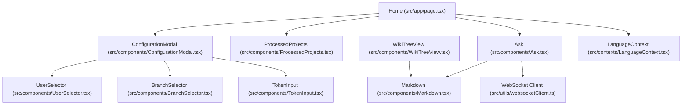
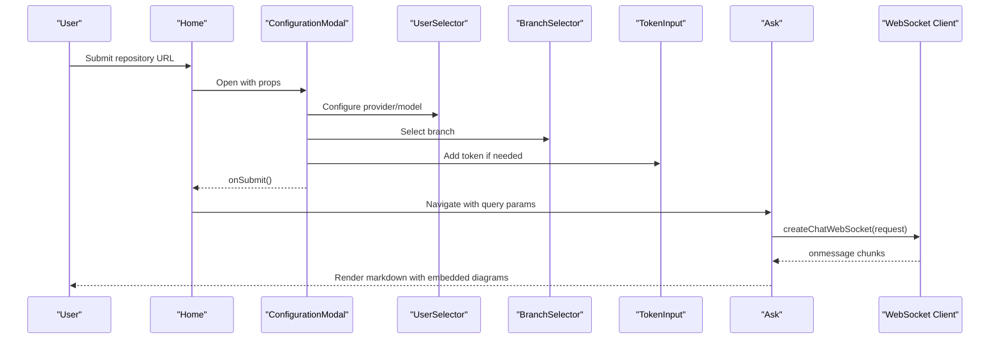
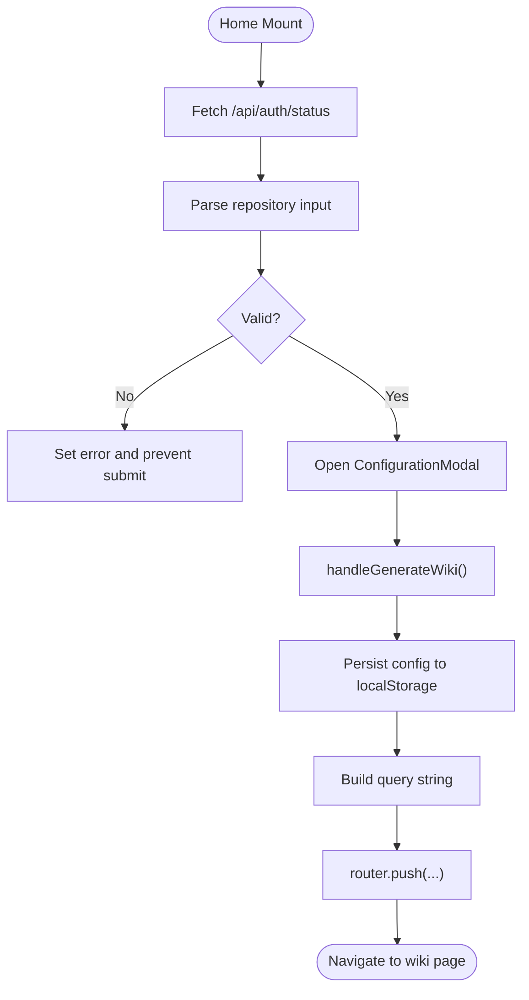
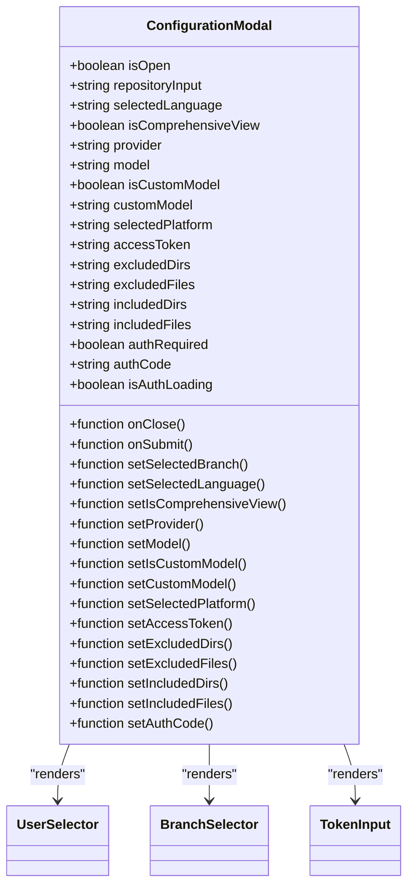
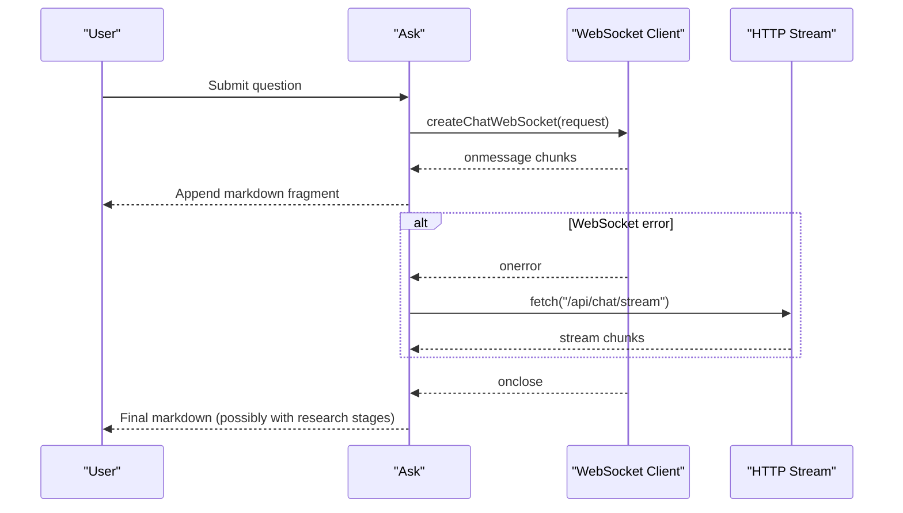
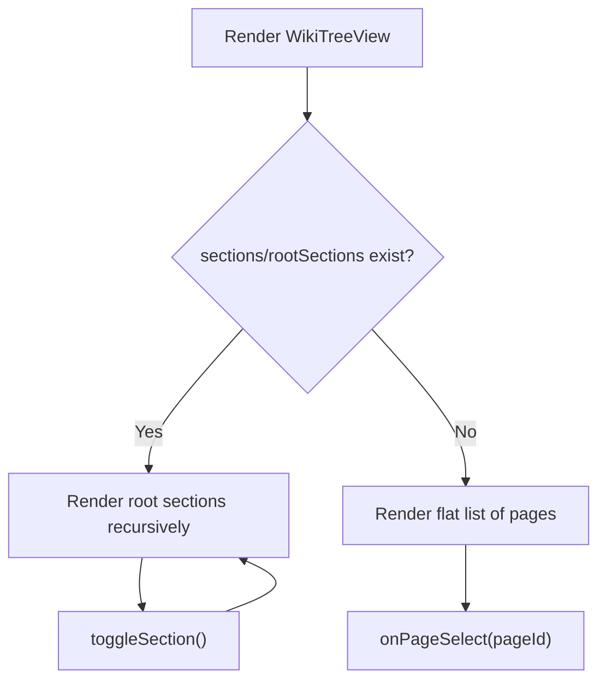
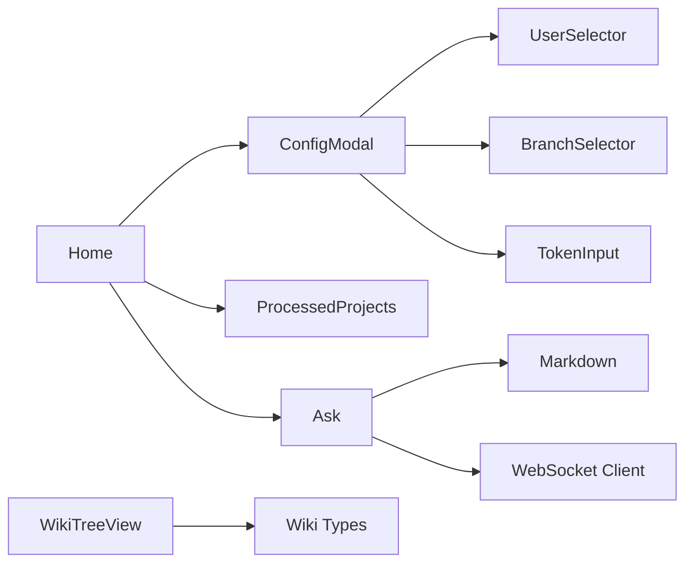

# Component Architecture

<cite>
**Referenced Files in This Document**
- [src/app/page.tsx](file://src/app/page.tsx)
- [src/components/ConfigurationModal.tsx](file://src/components/ConfigurationModal.tsx)
- [src/components/WikiTreeView.tsx](file://src/components/WikiTreeView.tsx)
- [src/components/Ask.tsx](file://src/components/Ask.tsx)
- [src/components/Markdown.tsx](file://src/components/Markdown.tsx)
- [src/components/ProcessedProjects.tsx](file://src/components/ProcessedProjects.tsx)
- [src/components/UserSelector.tsx](file://src/components/UserSelector.tsx)
- [src/components/BranchSelector.tsx](file://src/components/BranchSelector.tsx)
- [src/components/TokenInput.tsx](file://src/components/TokenInput.tsx)
- [src/hooks/useProcessedProjects.ts](file://src/hooks/useProcessedProjects.ts)
- [src/contexts/LanguageContext.tsx](file://src/contexts/LanguageContext.tsx)
- [src/utils/websocketClient.ts](file://src/utils/websocketClient.ts)
- [src/types/wiki/wikipage.tsx](file://src/types/wiki/wikipage.tsx)
- [src/types/wiki/wikistructure.tsx](file://src/types/wiki/wikistructure.tsx)
- [src/types/repoinfo.tsx](file://src/types/repoinfo.tsx)
</cite>

## Table of Contents
1. [Introduction](#introduction)
2. [Project Structure](#project-structure)
3. [Core Components](#core-components)
4. [Architecture Overview](#architecture-overview)
5. [Detailed Component Analysis](#detailed-component-analysis)
6. [Dependency Analysis](#dependency-analysis)
7. [Performance Considerations](#performance-considerations)
8. [Troubleshooting Guide](#troubleshooting-guide)
9. [Conclusion](#conclusion)
10. [Appendices](#appendices)

## Introduction
This document explains the React component architecture of DeepWiki-Open with a focus on the main Home component and its child components. It covers component composition patterns, prop drilling strategies, state management, lifecycle, rendering optimizations, and performance considerations. It also provides guidance for integrating with Next.js routing, reusing components, validating props, adding error boundaries, and extending the component library consistently.

## Project Structure
The application follows a Next.js App Router layout. The main UI surface is rendered by the Home page component, which orchestrates configuration, project listings, and interactive chat. Child components encapsulate concerns like configuration dialogs, tree navigation, markdown rendering, and model/token selection.

**Diagram sources**
- [src/app/page.tsx](file://src/app/page.tsx#L45-L637)
- [src/components/ConfigurationModal.tsx](file://src/components/ConfigurationModal.tsx#L68-L364)
- [src/components/ProcessedProjects.tsx](file://src/components/ProcessedProjects.tsx#L25-L271)
- [src/components/Ask.tsx](file://src/components/Ask.tsx#L46-L929)
- [src/components/WikiTreeView.tsx](file://src/components/WikiTreeView.tsx#L45-L184)
- [src/components/Markdown.tsx](file://src/components/Markdown.tsx#L13-L208)
- [src/components/UserSelector.tsx](file://src/components/UserSelector.tsx#L46-L540)
- [src/components/BranchSelector.tsx](file://src/components/BranchSelector.tsx#L22-L236)
- [src/components/TokenInput.tsx](file://src/components/TokenInput.tsx#L16-L108)
- [src/contexts/LanguageContext.tsx](file://src/contexts/LanguageContext.tsx#L17-L203)
- [src/utils/websocketClient.ts](file://src/utils/websocketClient.ts#L43-L86)

**Section sources**
- [src/app/page.tsx](file://src/app/page.tsx#L45-L637)

## Core Components
- Home: Central orchestrator managing repository input, configuration modal, authentication, project listing, and routing to generated wiki pages.
- ConfigurationModal: Composite dialog for selecting branch, language, wiki type, model/provider, file filters, tokens, and authorization code.
- Ask: Interactive chat component with deep research capability, streaming via WebSocket with HTTP fallback, research stage navigation, and markdown rendering.
- WikiTreeView: Hierarchical navigation for wiki pages with expandable sections and page selection.
- ProcessedProjects: List/grid view of previously processed projects with search, filtering, and deletion.
- UserSelector: Provider/model selection with optional custom model and file filter configuration.
- BranchSelector: Dynamic branch picker across GitHub, GitLab, Bitbucket with token-aware API calls.
- TokenInput: Platform selector and secure token input for private repositories.
- LanguageContext: Global i18n provider and language state.
- WebSocket Client: Unified client for chat streaming.

**Section sources**
- [src/app/page.tsx](file://src/app/page.tsx#L45-L637)
- [src/components/ConfigurationModal.tsx](file://src/components/ConfigurationModal.tsx#L68-L364)
- [src/components/Ask.tsx](file://src/components/Ask.tsx#L46-L929)
- [src/components/WikiTreeView.tsx](file://src/components/WikiTreeView.tsx#L45-L184)
- [src/components/ProcessedProjects.tsx](file://src/components/ProcessedProjects.tsx#L25-L271)
- [src/components/UserSelector.tsx](file://src/components/UserSelector.tsx#L46-L540)
- [src/components/BranchSelector.tsx](file://src/components/BranchSelector.tsx#L22-L236)
- [src/components/TokenInput.tsx](file://src/components/TokenInput.tsx#L16-L108)
- [src/contexts/LanguageContext.tsx](file://src/contexts/LanguageContext.tsx#L17-L203)
- [src/utils/websocketClient.ts](file://src/utils/websocketClient.ts#L43-L86)

## Architecture Overview
The Home component composes configuration and project UI, then delegates to Ask for interactive Q&A. ConfigurationModal composes UserSelector, BranchSelector, and TokenInput. Ask streams responses via WebSocket with HTTP fallback and renders markdown, including embedded Mermaid diagrams. LanguageContext provides global i18n state.

**Diagram sources**
- [src/app/page.tsx](file://src/app/page.tsx#L255-L401)
- [src/components/ConfigurationModal.tsx](file://src/components/ConfigurationModal.tsx#L68-L364)
- [src/components/UserSelector.tsx](file://src/components/UserSelector.tsx#L46-L540)
- [src/components/BranchSelector.tsx](file://src/components/BranchSelector.tsx#L22-L236)
- [src/components/TokenInput.tsx](file://src/components/TokenInput.tsx#L16-L108)
- [src/components/Ask.tsx](file://src/components/Ask.tsx#L532-L627)
- [src/utils/websocketClient.ts](file://src/utils/websocketClient.ts#L43-L75)

## Detailed Component Analysis

### Home Component
- Responsibilities:
  - Accept repository input and parse owner/repo/type/local path.
  - Manage configuration modal state and pass down props.
  - Handle authentication status and code validation.
  - Persist per-repo configuration to localStorage.
  - Route to generated wiki pages with query parameters.
  - Integrate ProcessedProjects for quick access to prior runs.
- State management:
  - Local state for repository input, provider/model, language, wiki type, file filters, branch, tokens, auth, and submission.
  - Uses LanguageContext for i18n.
  - Uses useProcessedProjects hook for cached project listing.
- Composition:
  - Renders ConfigurationModal and passes all configuration props.
  - Renders ProcessedProjects when available.
  - Uses Mermaid for demo diagrams.

**Diagram sources**
- [src/app/page.tsx](file://src/app/page.tsx#L158-L178)
- [src/app/page.tsx](file://src/app/page.tsx#L180-L250)
- [src/app/page.tsx](file://src/app/page.tsx#L255-L401)

**Section sources**
- [src/app/page.tsx](file://src/app/page.tsx#L45-L637)
- [src/hooks/useProcessedProjects.ts](file://src/hooks/useProcessedProjects.ts#L13-L47)
- [src/contexts/LanguageContext.tsx](file://src/contexts/LanguageContext.tsx#L17-L203)

### ConfigurationModal
- Responsibilities:
  - Aggregate configuration: branch, language, wiki type, provider/model, custom model, file filters, tokens, and auth code.
  - Compose child components: UserSelector, BranchSelector, TokenInput.
- Prop drilling:
  - Receives all state setters from Home and forwards them to child components.
  - Passes repository input to BranchSelector for owner/repo extraction.
- UX:
  - Conditional rendering for token section and auth code input.
  - Disabled states during submission.

**Diagram sources**
- [src/components/ConfigurationModal.tsx](file://src/components/ConfigurationModal.tsx#L9-L105)

**Section sources**
- [src/components/ConfigurationModal.tsx](file://src/components/ConfigurationModal.tsx#L68-L364)
- [src/components/UserSelector.tsx](file://src/components/UserSelector.tsx#L46-L540)
- [src/components/BranchSelector.tsx](file://src/components/BranchSelector.tsx#L22-L236)
- [src/components/TokenInput.tsx](file://src/components/TokenInput.tsx#L16-L108)

### Ask Component
- Responsibilities:
  - Accept user questions, optionally enable deep research.
  - Stream responses via WebSocket with HTTP fallback.
  - Track research stages and allow navigation between them.
  - Render markdown with embedded Mermaid diagrams.
  - Expose clearConversation via ref for parent control.
- State and lifecycle:
  - Initializes provider/model from API if not provided.
  - Manages conversation history and research iteration.
  - Auto-continues research until completion or max iterations.
  - Cleans up WebSocket on unmount.
- Streaming:
  - createChatWebSocket handles connection, messages, errors, and close.
  - On error, falls back to HTTP streaming.

**Diagram sources**
- [src/components/Ask.tsx](file://src/components/Ask.tsx#L532-L627)
- [src/utils/websocketClient.ts](file://src/utils/websocketClient.ts#L43-L75)

**Section sources**
- [src/components/Ask.tsx](file://src/components/Ask.tsx#L46-L929)
- [src/utils/websocketClient.ts](file://src/utils/websocketClient.ts#L43-L86)
- [src/components/Markdown.tsx](file://src/components/Markdown.tsx#L13-L208)

### WikiTreeView
- Responsibilities:
  - Render hierarchical wiki structure with expandable sections and selectable pages.
  - Fallback to flat list when sections are not defined.
- Props:
  - wikiStructure: pages, sections, rootSections.
  - onPageSelect: callback to change current page.
- Behavior:
  - Tracks expanded sections in state.
  - Highlights current page.

**Diagram sources**
- [src/components/WikiTreeView.tsx](file://src/components/WikiTreeView.tsx#L45-L184)

**Section sources**
- [src/components/WikiTreeView.tsx](file://src/components/WikiTreeView.tsx#L45-L184)
- [src/types/wiki/wikipage.tsx](file://src/types/wiki/wikipage.tsx#L1-L13)
- [src/types/wiki/wikistructure.tsx](file://src/types/wiki/wikistructure.tsx#L1-L11)

### ProcessedProjects
- Responsibilities:
  - Fetch and display previously processed projects.
  - Support search, view modes (card/list), and deletion.
- Hook usage:
  - useProcessedProjects provides projects, loading, and error states.
- Routing:
  - Links to generated wiki pages with type/language query parameters.

**Section sources**
- [src/components/ProcessedProjects.tsx](file://src/components/ProcessedProjects.tsx#L25-L271)
- [src/hooks/useProcessedProjects.ts](file://src/hooks/useProcessedProjects.ts#L13-L47)

### Supporting Components
- UserSelector: Loads provider/model config from API, supports custom model flag, and exposes file filter controls.
- BranchSelector: Fetches branches from GitHub/GitLab/Bitbucket with token support and normalized output.
- TokenInput: Platform selector and secure token input with platform-aware placeholders.
- Markdown: Renders markdown with GFM, raw HTML, syntax highlighting, and embedded Mermaid diagrams.

**Section sources**
- [src/components/UserSelector.tsx](file://src/components/UserSelector.tsx#L46-L540)
- [src/components/BranchSelector.tsx](file://src/components/BranchSelector.tsx#L22-L236)
- [src/components/TokenInput.tsx](file://src/components/TokenInput.tsx#L16-L108)
- [src/components/Markdown.tsx](file://src/components/Markdown.tsx#L13-L208)

## Dependency Analysis
- Component dependencies:
  - Home depends on ConfigurationModal, ProcessedProjects, and uses LanguageContext.
  - ConfigurationModal composes UserSelector, BranchSelector, TokenInput.
  - Ask depends on Markdown and WebSocket client.
  - WikiTreeView depends on wiki types.
- External integrations:
  - API endpoints for auth, models, chat, and project cache.
  - WebSocket endpoint for streaming chat.

**Diagram sources**
- [src/app/page.tsx](file://src/app/page.tsx#L45-L637)
- [src/components/ConfigurationModal.tsx](file://src/components/ConfigurationModal.tsx#L68-L364)
- [src/components/Ask.tsx](file://src/components/Ask.tsx#L46-L929)
- [src/components/WikiTreeView.tsx](file://src/components/WikiTreeView.tsx#L45-L184)
- [src/utils/websocketClient.ts](file://src/utils/websocketClient.ts#L43-L86)
- [src/types/wiki/wikipage.tsx](file://src/types/wiki/wikipage.tsx#L1-L13)
- [src/types/wiki/wikistructure.tsx](file://src/types/wiki/wikistructure.tsx#L1-L11)

**Section sources**
- [src/app/page.tsx](file://src/app/page.tsx#L45-L637)
- [src/components/ConfigurationModal.tsx](file://src/components/ConfigurationModal.tsx#L68-L364)
- [src/components/Ask.tsx](file://src/components/Ask.tsx#L46-L929)
- [src/components/WikiTreeView.tsx](file://src/components/WikiTreeView.tsx#L45-L184)
- [src/utils/websocketClient.ts](file://src/utils/websocketClient.ts#L43-L86)

## Performance Considerations
- Rendering optimization:
  - Memoize derived lists (e.g., filtered projects) to avoid unnecessary re-renders.
  - Use controlled components for inputs to minimize reflows.
- Network and streaming:
  - Prefer WebSocket for real-time streaming; fallback gracefully to HTTP.
  - Debounce or throttle frequent API calls (e.g., branch fetch) with appropriate caching.
- State management:
  - Keep configuration in localStorage only for user convenience; avoid heavy state in memory.
  - Limit deep state updates by splitting Ask’s research stages into smaller units.
- UI responsiveness:
  - Virtualize long lists (e.g., project cards) if the dataset grows large.
  - Lazy-load markdown diagrams only when visible.

[No sources needed since this section provides general guidance]

## Troubleshooting Guide
- Authentication issues:
  - Verify /api/auth/status and /api/auth/validate endpoints; handle missing or invalid codes.
- Model configuration:
  - Ensure /api/models/config returns expected providers and models; initialize defaults when absent.
- Branch selection:
  - Confirm token availability for private repositories; handle rate limits and 404/403 errors.
- WebSocket failures:
  - Implement robust fallback to HTTP streaming; log errors and surface user-friendly messages.
- Project listing:
  - Handle API errors and empty caches; provide clear feedback and retry mechanisms.

**Section sources**
- [src/app/page.tsx](file://src/app/page.tsx#L158-L178)
- [src/app/page.tsx](file://src/app/page.tsx#L271-L294)
- [src/components/UserSelector.tsx](file://src/components/UserSelector.tsx#L83-L123)
- [src/components/BranchSelector.tsx](file://src/components/BranchSelector.tsx#L47-L151)
- [src/components/Ask.tsx](file://src/components/Ask.tsx#L368-L403)
- [src/components/ProcessedProjects.tsx](file://src/components/ProcessedProjects.tsx#L56-L81)

## Conclusion
The component architecture centers around a cohesive Home component that composes specialized child components for configuration, project browsing, and interactive Q&A. State is managed locally where appropriate, with global i18n and reusable utilities. The Ask component demonstrates advanced streaming patterns with graceful fallbacks. Following the patterns shown here ensures consistency when extending the component library.

[No sources needed since this section summarizes without analyzing specific files]

## Appendices

### Component Composition Patterns
- Container-Presentational pattern:
  - Home acts as container for state and orchestration; child components are presentational and reusable.
- Composition over inheritance:
  - ConfigurationModal composes UserSelector, BranchSelector, and TokenInput to build a complex form.
- Controlled components:
  - Inputs are controlled by parent state, reducing duplication and enabling centralized validation.

**Section sources**
- [src/app/page.tsx](file://src/app/page.tsx#L45-L637)
- [src/components/ConfigurationModal.tsx](file://src/components/ConfigurationModal.tsx#L68-L364)

### Prop Drilling Strategies
- Minimize depth:
  - Group related props into cohesive interfaces (e.g., model selection, file filters).
- Context for cross-cutting concerns:
  - Use LanguageContext for i18n to avoid passing language props through many layers.
- Ref callbacks:
  - Use ref callbacks (e.g., Ask’s onRef) to expose imperative methods without deeply nesting handlers.

**Section sources**
- [src/contexts/LanguageContext.tsx](file://src/contexts/LanguageContext.tsx#L17-L203)
- [src/components/Ask.tsx](file://src/components/Ask.tsx#L89-L94)

### State Management Across Components
- Local component state:
  - Home manages UI state for configuration and routing.
- Shared hooks:
  - useProcessedProjects centralizes project cache fetching.
- Global context:
  - LanguageContext manages i18n state and messages.
- External storage:
  - localStorage persists per-repo configuration.

**Section sources**
- [src/app/page.tsx](file://src/app/page.tsx#L78-L145)
- [src/hooks/useProcessedProjects.ts](file://src/hooks/useProcessedProjects.ts#L13-L47)
- [src/contexts/LanguageContext.tsx](file://src/contexts/LanguageContext.tsx#L17-L203)

### Component Lifecycle and Rendering Optimization
- Lifecycle:
  - Home fetches auth status and parses repository input on mount.
  - Ask initializes provider/model from API and cleans up WebSocket on unmount.
- Optimization:
  - Memoization for filtered projects.
  - Controlled inputs and minimal re-renders.
  - Lazy diagram rendering within Markdown.

**Section sources**
- [src/app/page.tsx](file://src/app/page.tsx#L158-L178)
- [src/components/Ask.tsx](file://src/components/Ask.tsx#L110-L149)
- [src/components/Ask.tsx](file://src/components/Ask.tsx#L104-L108)
- [src/components/ProcessedProjects.tsx](file://src/components/ProcessedProjects.tsx#L84-L98)

### Practical Examples and Customization
- Customizing Ask:
  - Pass provider/model/language via props; leverage ref to clear conversations programmatically.
- Extending ConfigurationModal:
  - Add new toggles or selectors; keep them grouped and validated.
- Integrating with Next.js routing:
  - Build query strings from component state and navigate using useRouter.

**Section sources**
- [src/components/Ask.tsx](file://src/components/Ask.tsx#L46-L54)
- [src/app/page.tsx](file://src/app/page.tsx#L352-L398)

### Integration with Next.js Routing
- Dynamic routes:
  - Home navigates to /[owner]/[repo] with query parameters for type, language, branch, and filters.
- API routes:
  - Home posts to /api/chat/stream and fetches /api/models/config, /api/auth/status, /api/wiki/projects.

**Section sources**
- [src/app/page.tsx](file://src/app/page.tsx#L352-L398)

### Reusability, Prop Validation, and Error Boundaries
- Reusability:
  - Keep components self-contained with clear props and minimal side effects.
  - Encapsulate network logic behind small utilities (e.g., WebSocket client).
- Prop validation:
  - Use TypeScript interfaces for props (e.g., RepoInfo, ChatCompletionRequest).
- Error boundaries:
  - Wrap critical subtrees (e.g., Ask) with error boundaries to recover from runtime errors.

**Section sources**
- [src/types/repoinfo.tsx](file://src/types/repoinfo.tsx#L1-L11)
- [src/utils/websocketClient.ts](file://src/utils/websocketClient.ts#L22-L33)

### Guidelines for Extending the Component Library
- Follow existing patterns:
  - Use 'use client' directive, TypeScript interfaces, and consistent styling tokens.
- Maintain consistency:
  - Align with LanguageContext and theme tokens; reuse shared components (Markdown, TokenInput).
- Preserve separation of concerns:
  - Keep orchestration in containers (Home) and presentation in leaf components.
- Test and document:
  - Add unit tests for logic-heavy components; document props and behaviors.

[No sources needed since this section provides general guidance]