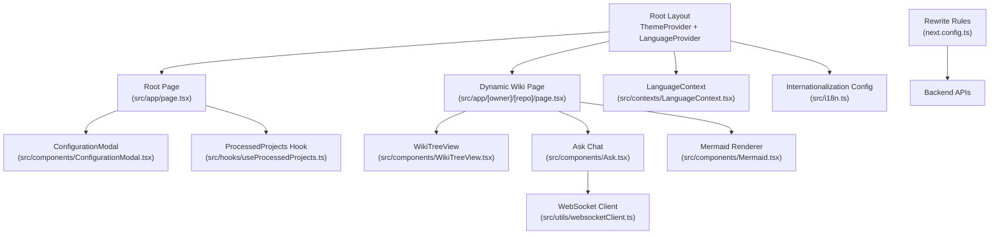
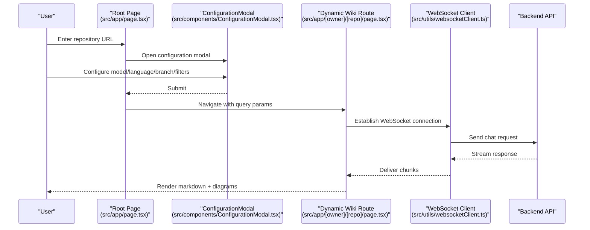
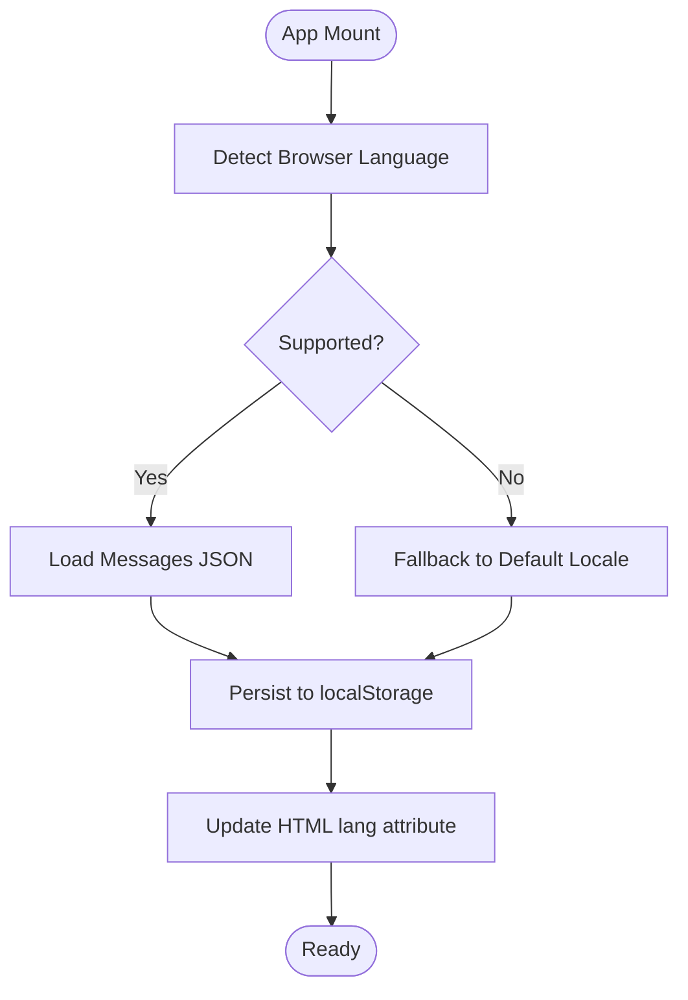
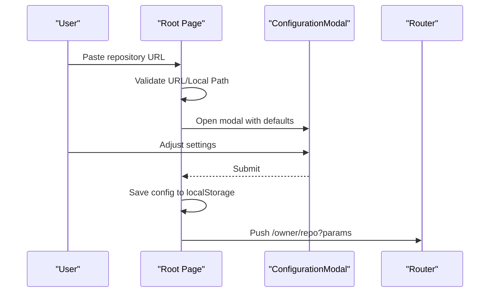
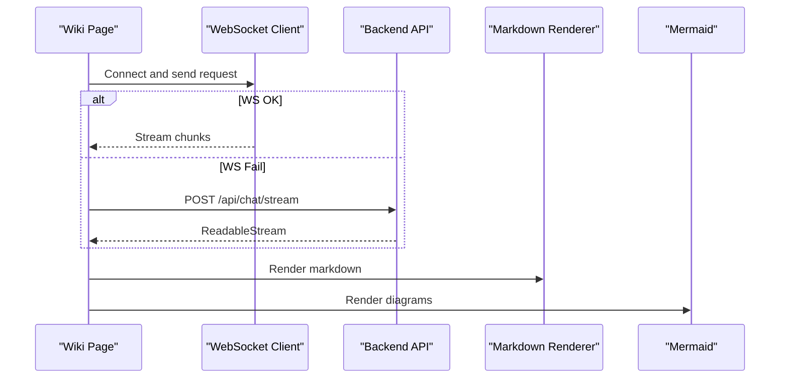
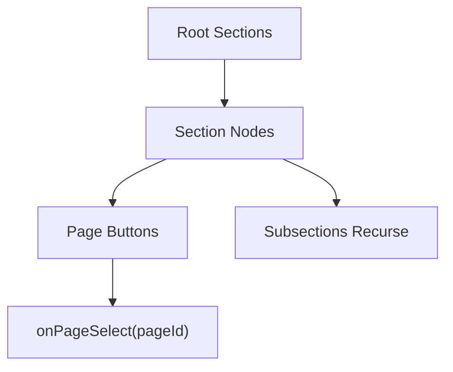
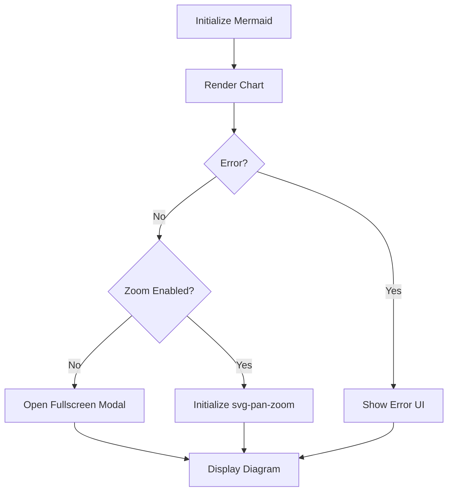
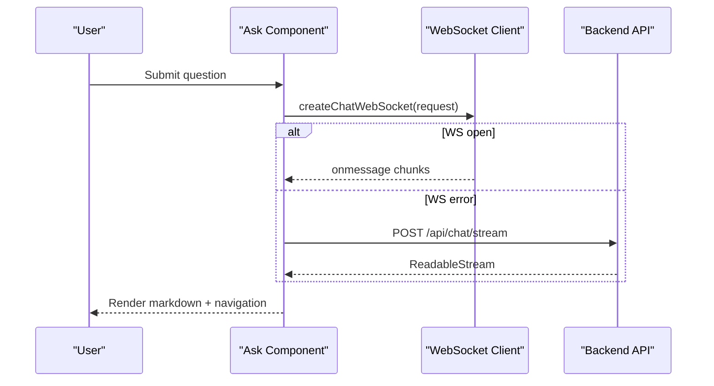
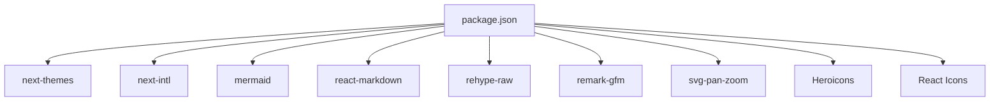
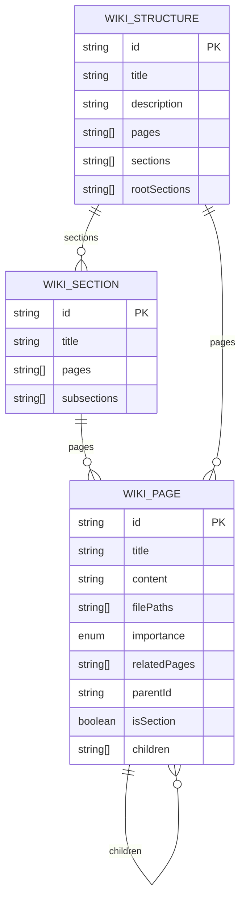

# Frontend Application

<cite>
**Referenced Files in This Document**
- [package.json](file://package.json)
- [next.config.ts](file://next.config.ts)
- [src/app/layout.tsx](file://src/app/layout.tsx)
- [src/i18n.ts](file://src/i18n.ts)
- [tailwind.config.js](file://tailwind.config.js)
- [src/app/page.tsx](file://src/app/page.tsx)
- [src/components/WikiTreeView.tsx](file://src/components/WikiTreeView.tsx)
- [src/components/Mermaid.tsx](file://src/components/Mermaid.tsx)
- [src/components/ConfigurationModal.tsx](file://src/components/ConfigurationModal.tsx)
- [src/contexts/LanguageContext.tsx](file://src/contexts/LanguageContext.tsx)
- [src/app/[owner]/[repo]/page.tsx](file://src/app/[owner]/[repo]/page.tsx)
- [src/components/Ask.tsx](file://src/components/Ask.tsx)
- [src/utils/websocketClient.ts](file://src/utils/websocketClient.ts)
- [src/hooks/useProcessedProjects.ts](file://src/hooks/useProcessedProjects.ts)
- [src/types/wiki/wikipage.tsx](file://src/types/wiki/wikipage.tsx)
</cite>

## Table of Contents
1. [Introduction](#introduction)
2. [Project Structure](#project-structure)
3. [Core Components](#core-components)
4. [Architecture Overview](#architecture-overview)
5. [Detailed Component Analysis](#detailed-component-analysis)
6. [Dependency Analysis](#dependency-analysis)
7. [Performance Considerations](#performance-considerations)
8. [Troubleshooting Guide](#troubleshooting-guide)
9. [Conclusion](#conclusion)
10. [Appendices](#appendices)

## Introduction
This document describes the Next.js frontend application for DeepWiki-Open. It covers the component architecture, state management patterns, internationalization, routing, UI components, configuration modals, wiki tree view, interactive Mermaid diagram rendering, theme management, responsive design, accessibility, real-time chat with WebSocket streaming, and guidance for extending the UI with custom components while maintaining consistent design patterns.

## Project Structure
The frontend is a Next.js 15 application configured with TypeScript, Tailwind CSS v4, and Next Themes for light/dark mode. Internationalization is handled via next-intl with a runtime loader. The app exposes a root page and a dynamic route for repository wikis, plus a set of reusable UI components and utilities.

**Diagram sources**
- [src/app/layout.tsx](file://src/app/layout.tsx#L13-L31)
- [src/app/page.tsx](file://src/app/page.tsx#L45-L637)
- [src/app/[owner]/[repo]/page.tsx](file://src/app/[owner]/[repo]/page.tsx#L178-L200)
- [src/components/ConfigurationModal.tsx](file://src/components/ConfigurationModal.tsx#L68-L364)
- [src/hooks/useProcessedProjects.ts](file://src/hooks/useProcessedProjects.ts#L13-L47)
- [src/components/WikiTreeView.tsx](file://src/components/WikiTreeView.tsx#L45-L184)
- [src/components/Ask.tsx](file://src/components/Ask.tsx#L46-L929)
- [src/components/Mermaid.tsx](file://src/components/Mermaid.tsx#L306-L491)
- [src/utils/websocketClient.ts](file://src/utils/websocketClient.ts#L43-L86)
- [src/contexts/LanguageContext.tsx](file://src/contexts/LanguageContext.tsx#L17-L203)
- [src/i18n.ts](file://src/i18n.ts#L1-L15)
- [next.config.ts](file://next.config.ts#L36-L67)

**Section sources**
- [package.json](file://package.json#L1-L40)
- [next.config.ts](file://next.config.ts#L1-L71)
- [src/app/layout.tsx](file://src/app/layout.tsx#L1-L32)
- [src/i18n.ts](file://src/i18n.ts#L1-L15)
- [tailwind.config.js](file://tailwind.config.js#L1-L8)

## Core Components
- Root layout initializes theme and language providers and sets global CSS.
- Root page orchestrates repository input, configuration modal, processed projects display, and demo Mermaid diagrams.
- Dynamic wiki page renders the wiki structure, handles page generation via WebSocket or HTTP streaming, and hosts the Ask chat component.
- WikiTreeView displays hierarchical wiki sections and pages with expand/collapse and selection.
- Mermaid renders diagrams with optional pan/zoom and fullscreen modal.
- ConfigurationModal aggregates model/provider/language/branch/token/file filters and triggers generation.
- LanguageContext manages locale detection, persistence, and message loading.
- Ask component provides a chat UI with deep research multi-turn capability and streaming via WebSocket or HTTP fallback.
- WebSocket client encapsulates connection lifecycle and message handling.

**Section sources**
- [src/app/layout.tsx](file://src/app/layout.tsx#L13-L31)
- [src/app/page.tsx](file://src/app/page.tsx#L45-L637)
- [src/app/[owner]/[repo]/page.tsx](file://src/app/[owner]/[repo]/page.tsx#L178-L200)
- [src/components/WikiTreeView.tsx](file://src/components/WikiTreeView.tsx#L45-L184)
- [src/components/Mermaid.tsx](file://src/components/Mermaid.tsx#L306-L491)
- [src/components/ConfigurationModal.tsx](file://src/components/ConfigurationModal.tsx#L68-L364)
- [src/contexts/LanguageContext.tsx](file://src/contexts/LanguageContext.tsx#L17-L203)
- [src/components/Ask.tsx](file://src/components/Ask.tsx#L46-L929)
- [src/utils/websocketClient.ts](file://src/utils/websocketClient.ts#L43-L86)

## Architecture Overview
The frontend integrates with a backend server through Next.js rewrite rules. The root page collects inputs and opens a configuration modal; on submit, it navigates to the dynamic wiki route with query parameters. The wiki page determines structure, generates pages via WebSocket or HTTP streaming, and renders content with Mermaid diagrams. The Ask component provides a real-time chat experience with optional deep research.

**Diagram sources**
- [src/app/page.tsx](file://src/app/page.tsx#L255-L401)
- [src/components/ConfigurationModal.tsx](file://src/components/ConfigurationModal.tsx#L68-L364)
- [src/app/[owner]/[repo]/page.tsx](file://src/app/[owner]/[repo]/page.tsx#L536-L636)
- [src/utils/websocketClient.ts](file://src/utils/websocketClient.ts#L43-L86)

## Detailed Component Analysis

### Root Layout and Providers
- Wraps children with ThemeProvider for theme switching and LanguageProvider for i18n.
- Applies global CSS and sets HTML lang attribute via context.

**Section sources**
- [src/app/layout.tsx](file://src/app/layout.tsx#L13-L31)
- [src/contexts/LanguageContext.tsx](file://src/contexts/LanguageContext.tsx#L17-L203)

### Internationalization (next-intl)
- Supported locales are defined and resolved at runtime.
- LanguageContext detects browser language, persists selection, loads messages, and updates document language.

**Diagram sources**
- [src/i18n.ts](file://src/i18n.ts#L1-L15)
- [src/contexts/LanguageContext.tsx](file://src/contexts/LanguageContext.tsx#L69-L150)

**Section sources**
- [src/i18n.ts](file://src/i18n.ts#L1-L15)
- [src/contexts/LanguageContext.tsx](file://src/contexts/LanguageContext.tsx#L17-L203)

### Root Page: Repository Input and Configuration Modal
- Collects repository input, validates format, and opens a configuration modal.
- Modal captures language, wiki type, provider/model, platform/token, branch, and file filters.
- On submit, persists per-repo config to localStorage and navigates to the dynamic wiki route with query parameters.

**Diagram sources**
- [src/app/page.tsx](file://src/app/page.tsx#L178-L401)
- [src/components/ConfigurationModal.tsx](file://src/components/ConfigurationModal.tsx#L68-L364)

**Section sources**
- [src/app/page.tsx](file://src/app/page.tsx#L45-L637)
- [src/components/ConfigurationModal.tsx](file://src/components/ConfigurationModal.tsx#L68-L364)

### Dynamic Wiki Page: Structure, Generation, and Rendering
- Parses route params and query params (tokens, provider/model, language, branch, filters).
- Determines wiki structure and generates pages via WebSocket or HTTP streaming.
- Renders markdown content and Mermaid diagrams; supports branch switching and URL sync.

**Diagram sources**
- [src/app/[owner]/[repo]/page.tsx](file://src/app/[owner]/[repo]/page.tsx#L536-L636)
- [src/utils/websocketClient.ts](file://src/utils/websocketClient.ts#L43-L86)

**Section sources**
- [src/app/[owner]/[repo]/page.tsx](file://src/app/[owner]/[repo]/page.tsx#L178-L200)
- [src/app/[owner]/[repo]/page.tsx](file://src/app/[owner]/[repo]/page.tsx#L384-L675)
- [src/app/[owner]/[repo]/page.tsx](file://src/app/[owner]/[repo]/page.tsx#L678-L800)

### Wiki Tree View
- Renders hierarchical wiki sections and pages with expand/collapse and selection highlighting.
- Falls back to a flat list if sections are not defined.

**Diagram sources**
- [src/components/WikiTreeView.tsx](file://src/components/WikiTreeView.tsx#L45-L184)

**Section sources**
- [src/components/WikiTreeView.tsx](file://src/components/WikiTreeView.tsx#L45-L184)

### Interactive Diagram Rendering (Mermaid)
- Initializes Mermaid with theme and Japanese aesthetic styles.
- Supports pan/zoom when enabled and fullscreen modal for diagrams.
- Handles rendering errors and dark mode overrides.

**Diagram sources**
- [src/components/Mermaid.tsx](file://src/components/Mermaid.tsx#L306-L491)

**Section sources**
- [src/components/Mermaid.tsx](file://src/components/Mermaid.tsx#L306-L491)

### Real-Time Chat Interface and Streaming
- Ask component streams responses via WebSocket with automatic fallback to HTTP streaming.
- Supports deep research with multi-stage iterations and navigation.
- Provides download and clear actions.

**Diagram sources**
- [src/components/Ask.tsx](file://src/components/Ask.tsx#L532-L627)
- [src/utils/websocketClient.ts](file://src/utils/websocketClient.ts#L43-L86)

**Section sources**
- [src/components/Ask.tsx](file://src/components/Ask.tsx#L46-L929)
- [src/utils/websocketClient.ts](file://src/utils/websocketClient.ts#L43-L86)

### State Management Patterns
- Root page maintains form state, auth status, and configuration cache.
- Dynamic wiki page tracks loading, structure, current page, in-progress pages, and export state.
- Ask component manages conversation history, research stages, and iteration state.
- LanguageContext centralizes locale and messages.
- useProcessedProjects hook fetches recent projects for quick access.

**Section sources**
- [src/app/page.tsx](file://src/app/page.tsx#L125-L155)
- [src/app/[owner]/[repo]/page.tsx](file://src/app/[owner]/[repo]/page.tsx#L218-L279)
- [src/components/Ask.tsx](file://src/components/Ask.tsx#L54-L149)
- [src/contexts/LanguageContext.tsx](file://src/contexts/LanguageContext.tsx#L17-L203)
- [src/hooks/useProcessedProjects.ts](file://src/hooks/useProcessedProjects.ts#L13-L47)

### Routing System
- Root route: static home page with repository input and demo diagrams.
- Dynamic route: /:owner/:repo with query parameters for tokens, provider/model, language, branch, and filters.
- Rewrites proxy API routes to the backend server.

**Section sources**
- [src/app/page.tsx](file://src/app/page.tsx#L398-L399)
- [next.config.ts](file://next.config.ts#L36-L67)

### Theme Management and Responsive Design
- next-themes provides theme switching with system preference support.
- Tailwind v4 is configured for dark mode via selector and content scanning across app, components, and pages.
- Responsive breakpoints and typography are applied via Tailwind utilities in components.

**Section sources**
- [src/app/layout.tsx](file://src/app/layout.tsx#L23-L27)
- [tailwind.config.js](file://tailwind.config.js#L1-L8)

### Accessibility Features
- Semantic HTML and proper labeling in forms and buttons.
- Focus management for input fields and modal interactions.
- Keyboard shortcuts (Escape) for closing modals.
- ARIA attributes and roles are minimal; ensure adding explicit roles and labels where needed for complex widgets.

**Section sources**
- [src/components/Ask.tsx](file://src/components/Ask.tsx#L342-L358)
- [src/components/Mermaid.tsx](file://src/components/Mermaid.tsx#L477-L485)

### Practical Examples and Customization
- Adding a new provider/model: extend the provider dropdown in the configuration modal and ensure the backend supports the new provider.
- Customizing Mermaid themes: adjust CSS in the Mermaid component initialization.
- Extending the Ask UI: introduce new controls in the Ask component and pass parameters to the WebSocket request.
- Custom wiki pages: define new page types in the wiki structure and render them conditionally in the wiki page.

[No sources needed since this section provides general guidance]

## Dependency Analysis
External libraries and their roles:
- next-themes: theme switching and persistence.
- next-intl: i18n runtime configuration and message loading.
- mermaid: diagram rendering with custom Japanese aesthetic styles.
- react-markdown + rehype-raw + remark-gfm: markdown rendering with raw HTML and GitHub Flavored Markdown.
- svg-pan-zoom: optional pan and zoom for Mermaid diagrams.
- Heroicons and React Icons: UI icons.

**Diagram sources**
- [package.json](file://package.json#L11-L25)

**Section sources**
- [package.json](file://package.json#L11-L25)

## Performance Considerations
- Bundle optimization: Next.js optimizePackageImports reduces bundle size for mermaid and react-syntax-highlighter.
- Webpack splitChunks groups vendor code for better caching.
- Mermaid lazy initialization and svg-pan-zoom dynamic import reduce initial payload.
- LocalStorage caching for per-repo configuration avoids repeated prompts.
- Streaming responses via WebSocket minimize perceived latency.

**Section sources**
- [next.config.ts](file://next.config.ts#L9-L35)
- [src/components/Mermaid.tsx](file://src/components/Mermaid.tsx#L331-L354)

## Troubleshooting Guide
- Authentication issues: The app checks auth status and may require an authorization code; ensure the backend auth endpoints are reachable via rewrites.
- WebSocket failures: The Ask component falls back to HTTP streaming; verify backend WebSocket endpoint availability.
- Diagram rendering errors: The Mermaid component displays a syntax error UI with the raw chart; validate Mermaid syntax and ensure theme compatibility.
- Language loading: If messages fail to load, LanguageContext falls back to English; verify /api/lang/config endpoint and locale files.

**Section sources**
- [src/app/page.tsx](file://src/app/page.tsx#L158-L178)
- [src/components/Ask.tsx](file://src/components/Ask.tsx#L597-L603)
- [src/components/Mermaid.tsx](file://src/components/Mermaid.tsx#L415-L432)
- [src/contexts/LanguageContext.tsx](file://src/contexts/LanguageContext.tsx#L137-L146)

## Conclusion
The DeepWiki-Open frontend leverages Next.js, TypeScript, and modern UI libraries to deliver a responsive, theme-aware, and internationally localized experience. It integrates seamlessly with backend APIs via rewrites, supports real-time chat with WebSocket streaming, and provides powerful diagram rendering and wiki navigation. The modular component architecture and centralized state management facilitate extensibility and maintainability.

## Appendices

### API and Route Reference
- Root page: / (with repository input and demo diagrams)
- Dynamic wiki: /:owner/:repo with query parameters for tokens, provider/model, language, branch, and filters
- Rewrites proxy:
  - /api/wiki_cache/*
  - /export/wiki/*
  - /api/auth/status
  - /api/auth/validate
  - /api/lang/config

**Section sources**
- [next.config.ts](file://next.config.ts#L36-L67)

### Data Models

**Diagram sources**
- [src/types/wiki/wikipage.tsx](file://src/types/wiki/wikipage.tsx#L1-L13)
- [src/app/[owner]/[repo]/page.tsx](file://src/app/[owner]/[repo]/page.tsx#L18-L46)