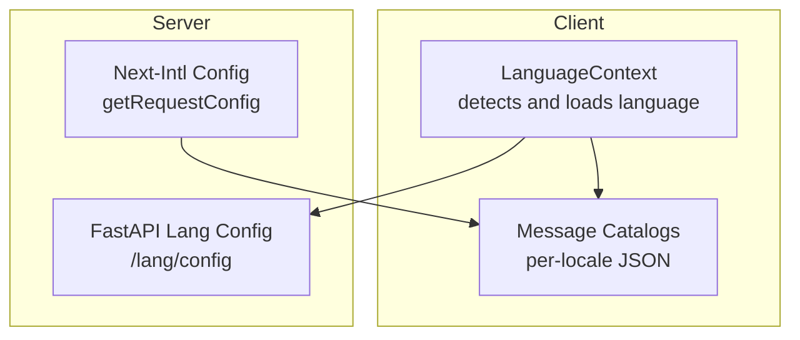
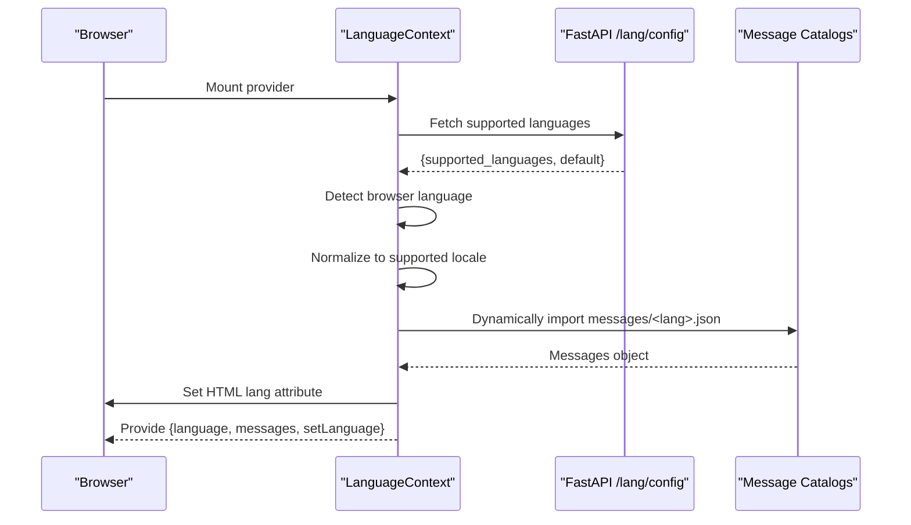
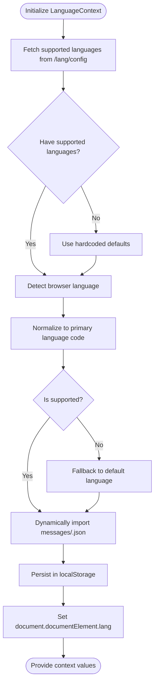
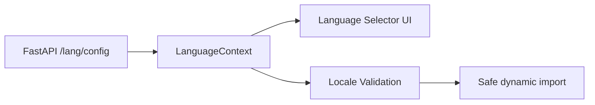
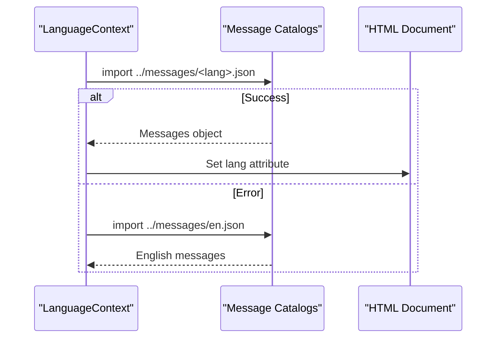
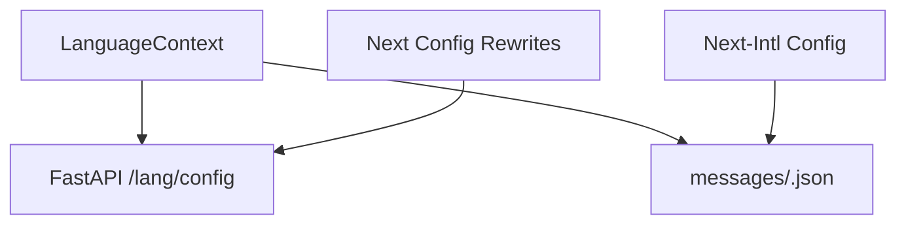

# Internationalization System

<cite>
**Referenced Files in This Document**
- [src/i18n.ts](file://src/i18n.ts)
- [src/contexts/LanguageContext.tsx](file://src/contexts/LanguageContext.tsx)
- [next.config.ts](file://next.config.ts)
- [src/messages/en.json](file://src/messages/en.json)
- [src/messages/zh.json](file://src/messages/zh.json)
- [src/messages/vi.json](file://src/messages/vi.json)
- [src/messages/pt-br.json](file://src/messages/pt-br.json)
- [api/api.py](file://api/api.py)
- [api/config/lang.json](file://api/config/lang.json)
</cite>

## Table of Contents
1. [Introduction](#introduction)
2. [Project Structure](#project-structure)
3. [Core Components](#core-components)
4. [Architecture Overview](#architecture-overview)
5. [Detailed Component Analysis](#detailed-component-analysis)
6. [Dependency Analysis](#dependency-analysis)
7. [Performance Considerations](#performance-considerations)
8. [Troubleshooting Guide](#troubleshooting-guide)
9. [Conclusion](#conclusion)
10. [Appendices](#appendices)

## Introduction
This document explains the internationalization (i18n) system of DeepWiki-Open. It covers how Next-Intl integrates with the application, how message catalogs are organized and loaded, how languages are detected and switched, and how dynamic loading works. It also documents the LanguageContext implementation, supported languages configuration, translation key organization, parameter interpolation patterns, and practical guidance for contributors and translators.

## Project Structure
The i18n system spans client-side and server-side components:
- Server-side integration via Next-Intl configuration
- Client-side language detection, persistence, and dynamic message loading
- Message catalogs organized by locale under a dedicated directory
- Backend endpoint exposing supported languages and defaults

**Diagram sources**
- [src/contexts/LanguageContext.tsx](file://src/contexts/LanguageContext.tsx#L17-L194)
- [src/i18n.ts](file://src/i18n.ts#L6-L14)
- [api/api.py](file://api/api.py#L149-L151)
- [api/config/lang.json](file://api/config/lang.json#L1-L16)

**Section sources**
- [src/i18n.ts](file://src/i18n.ts#L1-L15)
- [src/contexts/LanguageContext.tsx](file://src/contexts/LanguageContext.tsx#L1-L203)
- [next.config.ts](file://next.config.ts#L63-L65)
- [api/api.py](file://api/api.py#L149-L151)
- [api/config/lang.json](file://api/config/lang.json#L1-L16)

## Core Components
- Next-Intl server configuration defines supported locales and dynamically imports per-locale message catalogs.
- LanguageContext manages client-side language lifecycle: detection, persistence, and dynamic loading.
- Backend exposes supported languages and default language via a dedicated endpoint.
- Message catalogs are flat-key dictionaries grouped by functional domains.

Key responsibilities:
- Supported locales definition and fallback resolution
- Browser language detection and normalization
- Dynamic import of message catalogs
- Persisting user preference and updating HTML lang attribute
- Providing a typed context for consuming translations

**Section sources**
- [src/i18n.ts](file://src/i18n.ts#L3-L14)
- [src/contexts/LanguageContext.tsx](file://src/contexts/LanguageContext.tsx#L17-L194)
- [api/api.py](file://api/api.py#L149-L151)
- [api/config/lang.json](file://api/config/lang.json#L1-L16)

## Architecture Overview
The i18n pipeline combines server-side and client-side logic:
- Server-side: Next-Intl resolves the locale and imports the matching message catalog.
- Client-side: LanguageContext detects the browser’s language, validates against backend-supported locales, loads the message catalog, persists the selection, and updates the document language attribute.

**Diagram sources**
- [src/contexts/LanguageContext.tsx](file://src/contexts/LanguageContext.tsx#L69-L176)
- [api/api.py](file://api/api.py#L149-L151)
- [src/messages/en.json](file://src/messages/en.json#L1-L144)

## Detailed Component Analysis

### Next-Intl Server Integration
- Defines supported locales and ensures a safe fallback to a default locale if the requested one is unsupported.
- Dynamically imports the per-locale message catalog based on the resolved locale.

Implementation highlights:
- Locale list and fallback resolution
- Dynamic import of message JSON modules
- Return shape expected by Next-Intl runtime

**Section sources**
- [src/i18n.ts](file://src/i18n.ts#L3-L14)

### LanguageContext Implementation
Responsibilities:
- Detect browser language and normalize it to a supported code
- Fetch supported languages and default from the backend
- Persist user language preference in localStorage
- Dynamically import the selected locale’s message catalog
- Update the HTML lang attribute for accessibility and SEO
- Provide a loading state and graceful fallback to English on errors

Key behaviors:
- Browser language detection with extraction of primary language code
- Special handling for Chinese variants
- Validation against backend-supported locales
- Error boundary with English fallback
- Loading UI until initialization completes

**Diagram sources**
- [src/contexts/LanguageContext.tsx](file://src/contexts/LanguageContext.tsx#L69-L176)
- [api/api.py](file://api/api.py#L149-L151)
- [api/config/lang.json](file://api/config/lang.json#L1-L16)

**Section sources**
- [src/contexts/LanguageContext.tsx](file://src/contexts/LanguageContext.tsx#L17-L194)

### Supported Languages Configuration
- Backend endpoint returns a mapping of supported locales to human-readable names and a default locale.
- Frontend consumes this configuration to validate and present available languages.
- The server-side Next-Intl configuration maintains a separate list of supported locales.

**Diagram sources**
- [api/api.py](file://api/api.py#L149-L151)
- [api/config/lang.json](file://api/config/lang.json#L1-L16)
- [src/contexts/LanguageContext.tsx](file://src/contexts/LanguageContext.tsx#L69-L124)

**Section sources**
- [api/api.py](file://api/api.py#L149-L151)
- [api/config/lang.json](file://api/config/lang.json#L1-L16)
- [src/i18n.ts](file://src/i18n.ts#L4-L4)

### Dynamic Message Loading
- Client-side dynamic imports are used to load message catalogs for the selected locale.
- On error, the system falls back to English.
- The server-side Next-Intl also uses dynamic imports to serve the correct messages.

**Diagram sources**
- [src/contexts/LanguageContext.tsx](file://src/contexts/LanguageContext.tsx#L127-L146)
- [src/contexts/LanguageContext.tsx](file://src/contexts/LanguageContext.tsx#L158-L176)

**Section sources**
- [src/contexts/LanguageContext.tsx](file://src/contexts/LanguageContext.tsx#L127-L176)

### Translation Key Organization and Interpolation
- Keys are grouped by functional domains (e.g., common, loading, home, form, footer, ask, repoPage, nav, projects).
- Nested object structure allows logical grouping and avoids key collisions.
- Parameter interpolation follows placeholders like {platform}, {model}, etc., enabling dynamic substitution in templates.

Examples of interpolation patterns:
- Personal access token placeholders with platform name
- Model and provider identifiers
- Security notes and dynamic labels

**Section sources**
- [src/messages/en.json](file://src/messages/en.json#L60-L62)
- [src/messages/zh.json](file://src/messages/zh.json#L60-L62)
- [src/messages/vi.json](file://src/messages/vi.json#L60-L62)
- [src/messages/pt-br.json](file://src/messages/pt-br.json#L60-L62)

### Practical Examples

- Implementing a new translation
  - Add a new locale file under the message catalog directory with the same top-level keys as existing locales.
  - Keep the nested structure consistent across locales.
  - Reference the key in components using the appropriate domain and key path.

  **Section sources**
  - [src/messages/en.json](file://src/messages/en.json#L1-L144)
  - [src/messages/zh.json](file://src/messages/zh.json#L1-L134)
  - [src/messages/vi.json](file://src/messages/vi.json#L1-L133)
  - [src/messages/pt-br.json](file://src/messages/pt-br.json#L1-L143)

- Adding support for an additional language
  - Extend the backend supported languages configuration with the new locale and its display name.
  - Ensure the client-side supported locales list includes the new locale.
  - Provide a message catalog for the new locale.

  **Section sources**
  - [api/config/lang.json](file://api/config/lang.json#L2-L14)
  - [src/i18n.ts](file://src/i18n.ts#L4-L4)

- Handling right-to-left languages
  - Ensure the UI respects directionality by setting the HTML lang attribute and applying CSS direction rules.
  - Test layouts with RTL languages to confirm alignment and spacing.

  **Section sources**
  - [src/contexts/LanguageContext.tsx](file://src/contexts/LanguageContext.tsx#L133-L136)

## Dependency Analysis
- LanguageContext depends on:
  - Backend endpoint for supported languages and default
  - Dynamic imports of message catalogs
  - Browser APIs for language detection and storage
- Next-Intl server configuration depends on:
  - Static list of supported locales
  - Dynamic import of message catalogs
- Rewrites in Next config connect the frontend to the backend for language configuration.

**Diagram sources**
- [src/contexts/LanguageContext.tsx](file://src/contexts/LanguageContext.tsx#L72-L78)
- [src/i18n.ts](file://src/i18n.ts#L12-L12)
- [next.config.ts](file://next.config.ts#L63-L65)

**Section sources**
- [src/contexts/LanguageContext.tsx](file://src/contexts/LanguageContext.tsx#L72-L98)
- [src/i18n.ts](file://src/i18n.ts#L6-L14)
- [next.config.ts](file://next.config.ts#L63-L65)

## Performance Considerations
- Dynamic imports load message catalogs on demand, reducing initial bundle size.
- Keep message catalogs concise and grouped to minimize payload.
- Consider lazy-loading UI components alongside message loading to improve perceived performance.
- Monitor network requests for message imports and ensure caching is effective.
- For large catalogs, consider splitting frequently used keys into separate files if needed, while maintaining backward compatibility.

[No sources needed since this section provides general guidance]

## Troubleshooting Guide
Common issues and resolutions:
- Unsupported locale detected
  - The system normalizes the browser language and falls back to a default if unsupported. Verify the backend supported languages configuration and ensure the client-side list includes the intended locale.

  **Section sources**
  - [src/contexts/LanguageContext.tsx](file://src/contexts/LanguageContext.tsx#L123-L125)
  - [api/config/lang.json](file://api/config/lang.json#L1-L16)

- Language not persisting
  - Confirm localStorage is available and accessible in the browser context. The provider sets the language in localStorage after detection or user selection.

  **Section sources**
  - [src/contexts/LanguageContext.tsx](file://src/contexts/LanguageContext.tsx#L107-L117)
  - [src/contexts/LanguageContext.tsx](file://src/contexts/LanguageContext.tsx#L164-L167)

- Messages not loading
  - The system attempts to import the selected locale’s messages and falls back to English on error. Check network tab for failed imports and ensure the message file exists for the selected locale.

  **Section sources**
  - [src/contexts/LanguageContext.tsx](file://src/contexts/LanguageContext.tsx#L137-L146)
  - [src/contexts/LanguageContext.tsx](file://src/contexts/LanguageContext.tsx#L173-L176)

- HTML lang attribute not updating
  - The provider updates the document element’s lang attribute after successful message loading. Verify the update logic runs and that the DOM is available.

  **Section sources**
  - [src/contexts/LanguageContext.tsx](file://src/contexts/LanguageContext.tsx#L133-L136)

## Conclusion
DeepWiki-Open’s i18n system leverages Next-Intl on the server and a robust client-side LanguageContext for dynamic, user-driven localization. With a clear message catalog structure, configurable supported locales, and resilient fallbacks, the system supports scalable internationalization. Contributors and translators should focus on maintaining consistent key groups, accurate interpolation, and timely updates to the backend language configuration.

[No sources needed since this section summarizes without analyzing specific files]

## Appendices

### Supported Locales and Defaults
- Backend-supported locales and default language are defined centrally and consumed by both the client and server.

**Section sources**
- [api/config/lang.json](file://api/config/lang.json#L1-L16)
- [src/i18n.ts](file://src/i18n.ts#L4-L4)

### Message Catalog Directory
- Message catalogs are located under the message directory and imported dynamically by locale.

**Section sources**
- [src/contexts/LanguageContext.tsx](file://src/contexts/LanguageContext.tsx#L127-L129)
- [src/contexts/LanguageContext.tsx](file://src/contexts/LanguageContext.tsx#L158-L160)