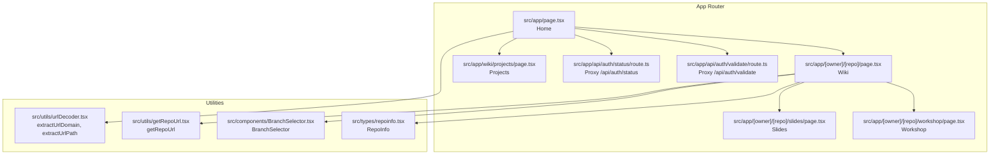
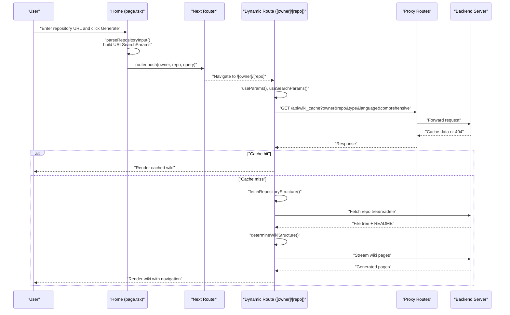
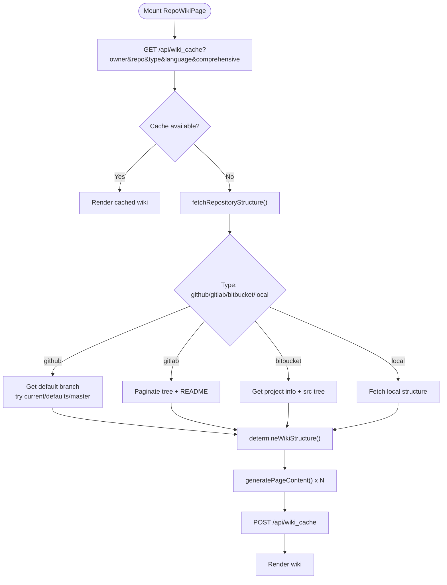
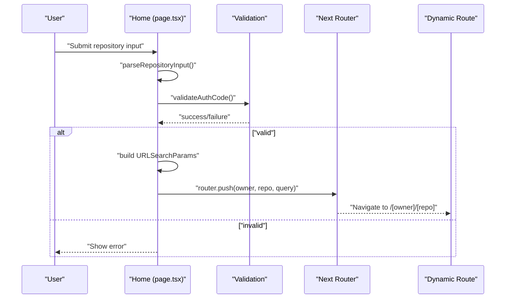
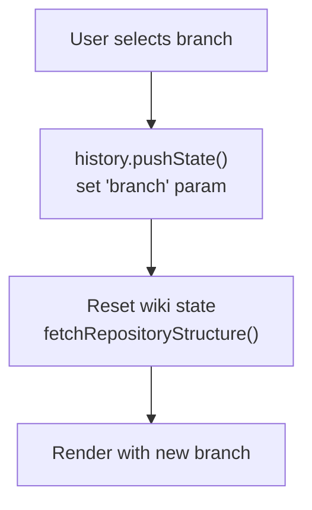
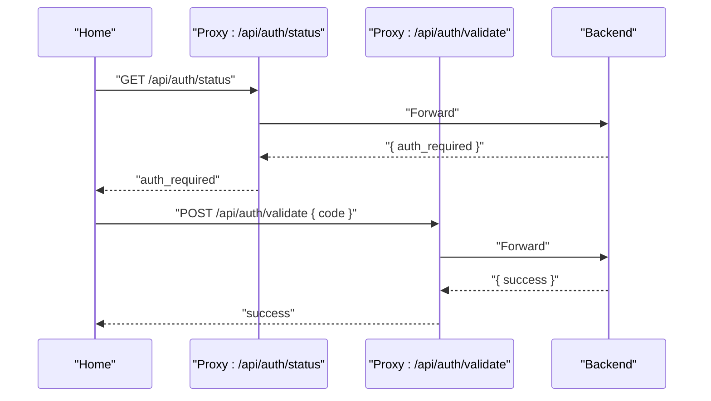
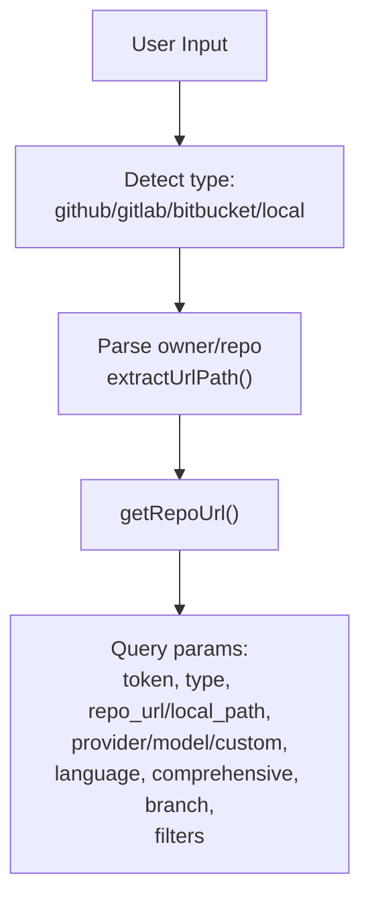
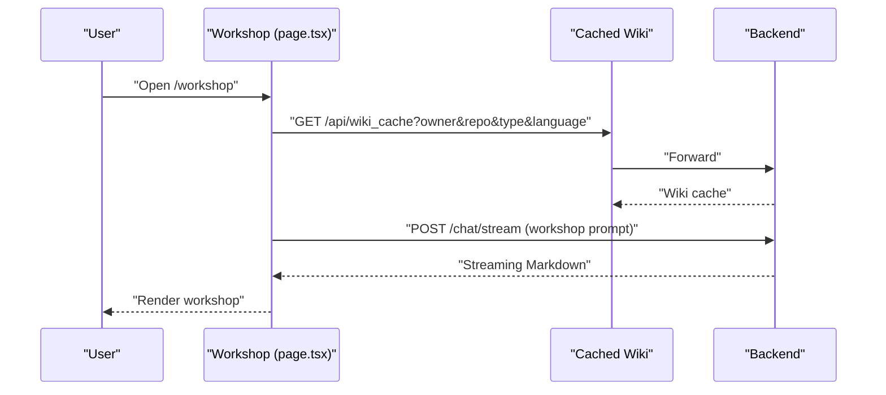
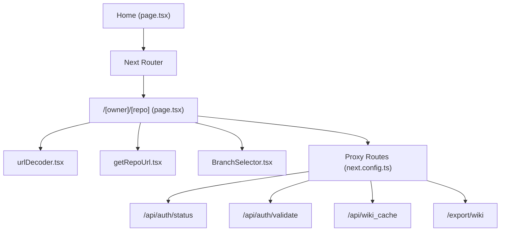

# Routing and Navigation

<cite>
**Referenced Files in This Document**
- [layout.tsx](file://src/app/layout.tsx)
- [page.tsx](file://src/app/page.tsx)
- [page.tsx](file://src/app/[owner]/[repo]/page.tsx)
- [route.ts](file://src/app/api/auth/status/route.ts)
- [route.ts](file://src/app/api/auth/validate/route.ts)
- [page.tsx](file://src/app/wiki/projects/page.tsx)
- [page.tsx](file://src/app/[owner]/[repo]/slides/page.tsx)
- [page.tsx](file://src/app/[owner]/[repo]/workshop/page.tsx)
- [BranchSelector.tsx](file://src/components/BranchSelector.tsx)
- [getRepoUrl.tsx](file://src/utils/getRepoUrl.tsx)
- [urlDecoder.tsx](file://src/utils/urlDecoder.tsx)
- [repoinfo.tsx](file://src/types/repoinfo.tsx)
- [next.config.ts](file://next.config.ts)
</cite>

## Table of Contents
1. [Introduction](#introduction)
2. [Project Structure](#project-structure)
3. [Core Components](#core-components)
4. [Architecture Overview](#architecture-overview)
5. [Detailed Component Analysis](#detailed-component-analysis)
6. [Dependency Analysis](#dependency-analysis)
7. [Performance Considerations](#performance-considerations)
8. [Troubleshooting Guide](#troubleshooting-guide)
9. [Conclusion](#conclusion)
10. [Appendices](#appendices)

## Introduction
This document explains the Next.js routing and navigation system in DeepWiki-Open, focusing on dynamic routes for repository pages, URL parameter handling, navigation patterns, and authentication checks. It covers how the application parses repository URLs, selects branches, manages query parameters, and navigates users from the home page to repository views. It also documents programmatic navigation, route parameter extraction, URL manipulation utilities, SEO considerations, meta tag management, responsive navigation patterns, and guidelines for extending the routing system.

## Project Structure
DeepWiki-Open uses Next.js App Router with dynamic routes. The primary dynamic route is `/[owner]/[repo]`, which hosts the repository wiki, slides, and workshop pages. Static pages include the home page and a projects listing page. API routes proxy authentication and caching to a backend service.

**Diagram sources**
- [page.tsx](file://src/app/page.tsx#L1-L637)
- [page.tsx](file://src/app/[owner]/[repo]/page.tsx#L1-L2292)
- [page.tsx](file://src/app/[owner]/[repo]/slides/page.tsx#L1-L1300)
- [page.tsx](file://src/app/[owner]/[repo]/workshop/page.tsx#L1-L634)
- [page.tsx](file://src/app/wiki/projects/page.tsx#L1-L19)
- [route.ts](file://src/app/api/auth/status/route.ts#L1-L32)
- [route.ts](file://src/app/api/auth/validate/route.ts#L1-L35)
- [urlDecoder.tsx](file://src/utils/urlDecoder.tsx#L1-L19)
- [getRepoUrl.tsx](file://src/utils/getRepoUrl.tsx#L1-L17)
- [BranchSelector.tsx](file://src/components/BranchSelector.tsx#L1-L236)
- [repoinfo.tsx](file://src/types/repoinfo.tsx#L1-L11)

**Section sources**
- [page.tsx](file://src/app/page.tsx#L1-L637)
- [page.tsx](file://src/app/[owner]/[repo]/page.tsx#L1-L2292)
- [page.tsx](file://src/app/[owner]/[repo]/slides/page.tsx#L1-L1300)
- [page.tsx](file://src/app/[owner]/[repo]/workshop/page.tsx#L1-L634)
- [page.tsx](file://src/app/wiki/projects/page.tsx#L1-L19)
- [route.ts](file://src/app/api/auth/status/route.ts#L1-L32)
- [route.ts](file://src/app/api/auth/validate/route.ts#L1-L35)
- [urlDecoder.tsx](file://src/utils/urlDecoder.tsx#L1-L19)
- [getRepoUrl.tsx](file://src/utils/getRepoUrl.tsx#L1-L17)
- [BranchSelector.tsx](file://src/components/BranchSelector.tsx#L1-L236)
- [repoinfo.tsx](file://src/types/repoinfo.tsx#L1-L11)

## Core Components
- Dynamic route: `/[owner]/[repo]` renders the repository wiki and supports subpaths like `/slides` and `/workshop`.
- Home page: Parses user input, validates repository URLs, collects configuration, and performs programmatic navigation to the dynamic route with query parameters.
- Wiki page: Extracts route parameters and query parameters, loads cached data, fetches repository structure, generates wiki content, and supports branch selection and export.
- Authentication proxy routes: Forward auth status and validation to the backend.
- Utilities: URL parsing helpers and repository URL builder.
- Types: Strong typing for repository information.

**Section sources**
- [page.tsx](file://src/app/[owner]/[repo]/page.tsx#L178-L2292)
- [page.tsx](file://src/app/page.tsx#L178-L401)
- [route.ts](file://src/app/api/auth/status/route.ts#L1-L32)
- [route.ts](file://src/app/api/auth/validate/route.ts#L1-L35)
- [urlDecoder.tsx](file://src/utils/urlDecoder.tsx#L1-L19)
- [getRepoUrl.tsx](file://src/utils/getRepoUrl.tsx#L1-L17)
- [repoinfo.tsx](file://src/types/repoinfo.tsx#L1-L11)

## Architecture Overview
The routing system integrates Next.js dynamic routes with a backend proxy and client-side navigation. The home page builds a query string with repository and configuration parameters and navigates to the dynamic route. The dynamic route reads parameters, optionally loads from server cache, fetches repository structure, and renders the wiki with navigation controls.

**Diagram sources**
- [page.tsx](file://src/app/page.tsx#L296-L401)
- [page.tsx](file://src/app/[owner]/[repo]/page.tsx#L1686-L1872)
- [route.ts](file://src/app/api/auth/status/route.ts#L1-L32)
- [route.ts](file://src/app/api/auth/validate/route.ts#L1-L35)
- [next.config.ts](file://next.config.ts#L36-L67)

## Detailed Component Analysis

### Dynamic Route: Repository Wiki (`/[owner]/[repo]`)
- Route parameters: `owner`, `repo` are extracted via `useParams()`.
- Query parameters: `token`, `repo_url`, `type`, `local_path`, `provider`, `model`, `is_custom_model`, `custom_model`, `language`, `branch`, `excluded_dirs`, `excluded_files`, `included_dirs`, `included_files`, `comprehensive`.
- Behavior:
  - Loads server-side cache via `/api/wiki_cache` proxy.
  - If cache is unavailable, fetches repository structure from GitHub/GitLab/Bitbucket or local path.
  - Determines wiki structure and generates pages using streaming or WebSocket fallback.
  - Supports branch selection with URL sync and refresh.
  - Provides export functionality for wiki content.

**Diagram sources**
- [page.tsx](file://src/app/[owner]/[repo]/page.tsx#L1686-L1927)
- [page.tsx](file://src/app/[owner]/[repo]/page.tsx#L1160-L1491)
- [page.tsx](file://src/app/[owner]/[repo]/page.tsx#L677-L1158)
- [next.config.ts](file://next.config.ts#L36-L67)

**Section sources**
- [page.tsx](file://src/app/[owner]/[repo]/page.tsx#L178-L2292)
- [page.tsx](file://src/app/[owner]/[repo]/page.tsx#L1160-L1491)
- [page.tsx](file://src/app/[owner]/[repo]/page.tsx#L677-L1158)
- [page.tsx](file://src/app/[owner]/[repo]/page.tsx#L1686-L1927)

### Home Page Navigation and Parameter Handling
- Programmatic navigation: Uses `router.push(owner, repo, query)` to navigate to the dynamic route.
- URL parsing: Validates and parses repository input (owner/repo, URLs, or local paths) and extracts domain/path.
- Query parameter management: Builds a query string with tokens, type, repo URL or local path, model/provider settings, language, comprehensive flag, and branch.
- Authentication checks: Fetches auth status and validates code via proxy routes.

**Diagram sources**
- [page.tsx](file://src/app/page.tsx#L180-L401)
- [route.ts](file://src/app/api/auth/status/route.ts#L1-L32)
- [route.ts](file://src/app/api/auth/validate/route.ts#L1-L35)

**Section sources**
- [page.tsx](file://src/app/page.tsx#L180-L401)
- [urlDecoder.tsx](file://src/utils/urlDecoder.tsx#L1-L19)

### Branch Selection and URL Manipulation
- Branch selector component fetches branches from GitHub/GitLab/Bitbucket APIs and displays them.
- On change, updates URL query parameter `branch` using `history.pushState()` and refreshes content.
- Generates file URLs for GitHub/GitLab/Bitbucket based on detected type and default branch.

**Diagram sources**
- [BranchSelector.tsx](file://src/components/BranchSelector.tsx#L1-L236)
- [page.tsx](file://src/app/[owner]/[repo]/page.tsx#L280-L295)
- [page.tsx](file://src/app/[owner]/[repo]/page.tsx#L297-L329)

**Section sources**
- [BranchSelector.tsx](file://src/components/BranchSelector.tsx#L1-L236)
- [page.tsx](file://src/app/[owner]/[repo]/page.tsx#L280-L329)

### Authentication Checks and Route Protection
- Authentication status is fetched from `/api/auth/status` and validated via `/api/auth/validate`.
- The home page and dynamic route both check auth requirements and may require an authorization code before proceeding.

**Diagram sources**
- [route.ts](file://src/app/api/auth/status/route.ts#L1-L32)
- [route.ts](file://src/app/api/auth/validate/route.ts#L1-L35)
- [page.tsx](file://src/app/page.tsx#L157-L178)
- [page.tsx](file://src/app/[owner]/[repo]/page.tsx#L360-L381)

**Section sources**
- [route.ts](file://src/app/api/auth/status/route.ts#L1-L32)
- [route.ts](file://src/app/api/auth/validate/route.ts#L1-L35)
- [page.tsx](file://src/app/page.tsx#L157-L178)
- [page.tsx](file://src/app/[owner]/[repo]/page.tsx#L360-L381)

### URL Parameter Handling and Repository Parsing
- Repository parsing supports:
  - Owner/repo strings
  - GitHub/GitLab/BitBucket URLs
  - Local absolute paths (Windows and Unix)
- URL utilities:
  - `extractUrlDomain`: Extracts protocol + hostname
  - `extractUrlPath`: Extracts path without leading/trailing slashes
- Repository URL builder:
  - `getRepoUrl`: Returns local path for local type, otherwise repo URL or constructed URL

**Diagram sources**
- [page.tsx](file://src/app/page.tsx#L180-L250)
- [urlDecoder.tsx](file://src/utils/urlDecoder.tsx#L1-L19)
- [getRepoUrl.tsx](file://src/utils/getRepoUrl.tsx#L1-L17)

**Section sources**
- [page.tsx](file://src/app/page.tsx#L180-L250)
- [urlDecoder.tsx](file://src/utils/urlDecoder.tsx#L1-L19)
- [getRepoUrl.tsx](file://src/utils/getRepoUrl.tsx#L1-L17)

### Subpages: Slides and Workshop
- Slides page (`/[owner]/[repo]/slides`): Generates presentation slides using cached wiki content and streaming responses.
- Workshop page (`/[owner]/[repo]/workshop`): Creates a guided learning experience from cached wiki content with progressive exercises and export capability.

**Diagram sources**
- [page.tsx](file://src/app/[owner]/[repo]/workshop/page.tsx#L112-L521)
- [page.tsx](file://src/app/[owner]/[repo]/slides/page.tsx#L121-L636)
- [next.config.ts](file://next.config.ts#L36-L67)

**Section sources**
- [page.tsx](file://src/app/[owner]/[repo]/workshop/page.tsx#L112-L521)
- [page.tsx](file://src/app/[owner]/[repo]/slides/page.tsx#L121-L636)

### SEO and Meta Tags
- Global metadata is defined in the root layout for title and description.
- Consider adding page-specific metadata (e.g., Open Graph, Twitter Cards) and canonical URLs for repository pages to improve SEO and social sharing.

**Section sources**
- [layout.tsx](file://src/app/layout.tsx#L8-L11)

### Responsive Navigation Patterns
- The wiki page uses a two-panel layout: navigation sidebar and content area, adapting to different screen sizes.
- Branch selector and model selection modals provide responsive controls for smaller screens.

**Section sources**
- [page.tsx](file://src/app/[owner]/[repo]/page.tsx#L2038-L2292)
- [BranchSelector.tsx](file://src/components/BranchSelector.tsx#L158-L236)

## Dependency Analysis
The routing system relies on Next.js App Router, client-side hooks, and backend proxies. The dynamic route depends on:
- Route parameters and query parameters
- Utility functions for URL parsing and repository URL building
- Branch selector component for branch management
- Proxy routes for authentication and caching

**Diagram sources**
- [page.tsx](file://src/app/page.tsx#L1-L637)
- [page.tsx](file://src/app/[owner]/[repo]/page.tsx#L1-L2292)
- [urlDecoder.tsx](file://src/utils/urlDecoder.tsx#L1-L19)
- [getRepoUrl.tsx](file://src/utils/getRepoUrl.tsx#L1-L17)
- [BranchSelector.tsx](file://src/components/BranchSelector.tsx#L1-L236)
- [next.config.ts](file://next.config.ts#L36-L67)
- [route.ts](file://src/app/api/auth/status/route.ts#L1-L32)
- [route.ts](file://src/app/api/auth/validate/route.ts#L1-L35)

**Section sources**
- [next.config.ts](file://next.config.ts#L36-L67)
- [page.tsx](file://src/app/[owner]/[repo]/page.tsx#L1-L2292)

## Performance Considerations
- Streaming and WebSocket fallback reduce perceived latency for content generation.
- Controlled concurrency when generating pages prevents overwhelming the backend.
- Server-side caching reduces repeated computation and improves load times.
- Bundle optimization and splitChunks minimize client payload size.

[No sources needed since this section provides general guidance]

## Troubleshooting Guide
- Authentication failures: Verify backend auth endpoints and ensure the authorization code is valid.
- Branch selection issues: Confirm repository type and token permissions; the branch selector handles rate limits and missing branches gracefully.
- Cache errors: Clear server cache via proxy and retry; the dynamic route logs cache errors and continues without cache.
- URL parsing errors: Ensure repository input matches supported formats (owner/repo, URLs, or local paths).

**Section sources**
- [route.ts](file://src/app/api/auth/status/route.ts#L1-L32)
- [route.ts](file://src/app/api/auth/validate/route.ts#L1-L35)
- [BranchSelector.tsx](file://src/components/BranchSelector.tsx#L137-L151)
- [page.tsx](file://src/app/[owner]/[repo]/page.tsx#L1605-L1636)

## Conclusion
DeepWiki-Open’s routing system leverages Next.js dynamic routes and a robust proxy layer to deliver a seamless navigation experience. The home page handles repository input and configuration, while the dynamic route orchestrates caching, repository fetching, and content generation. Authentication checks, branch selection, and query parameter management are integrated throughout. The system is extensible with new subpages and maintains consistency through shared utilities and proxy routes.

[No sources needed since this section summarizes without analyzing specific files]

## Appendices

### Guidelines for Extending the Routing System
- Add new dynamic routes under `src/app/[owner]/[repo]/[slug]` for additional views.
- Reuse parameter extraction and query parsing patterns from the existing dynamic route.
- Integrate with the proxy routes for backend interactions.
- Maintain consistent navigation patterns (sidebar, branch selector, export controls).
- Add SEO metadata and responsive layouts for new pages.

[No sources needed since this section provides general guidance]