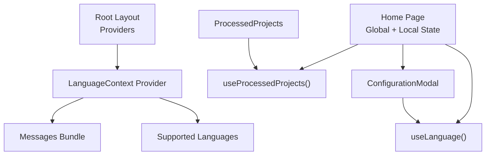
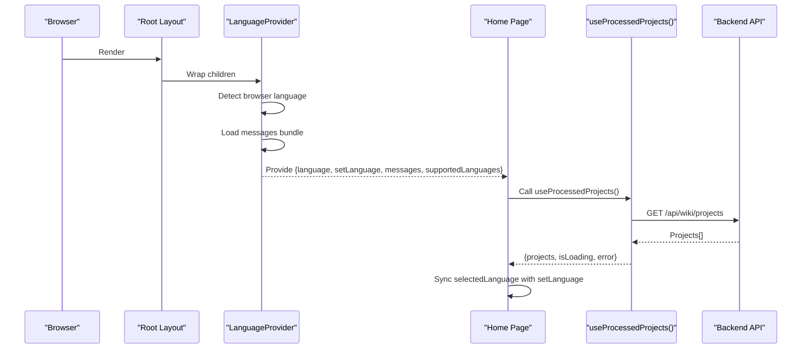
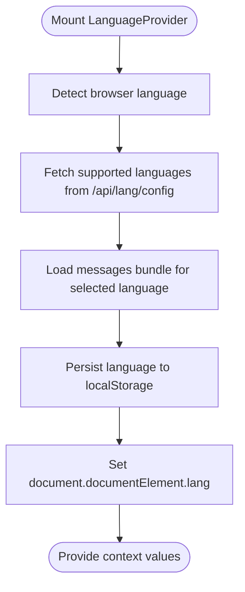
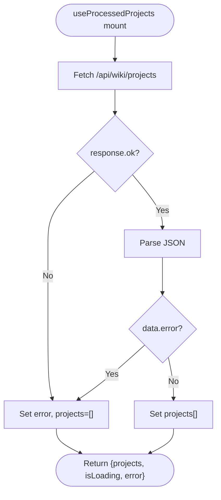
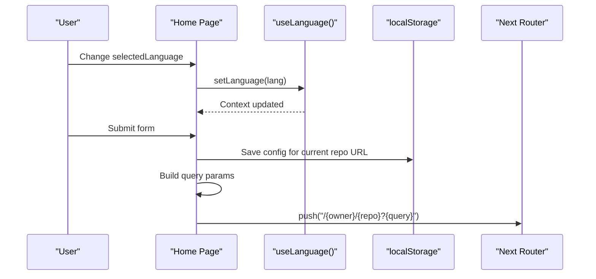
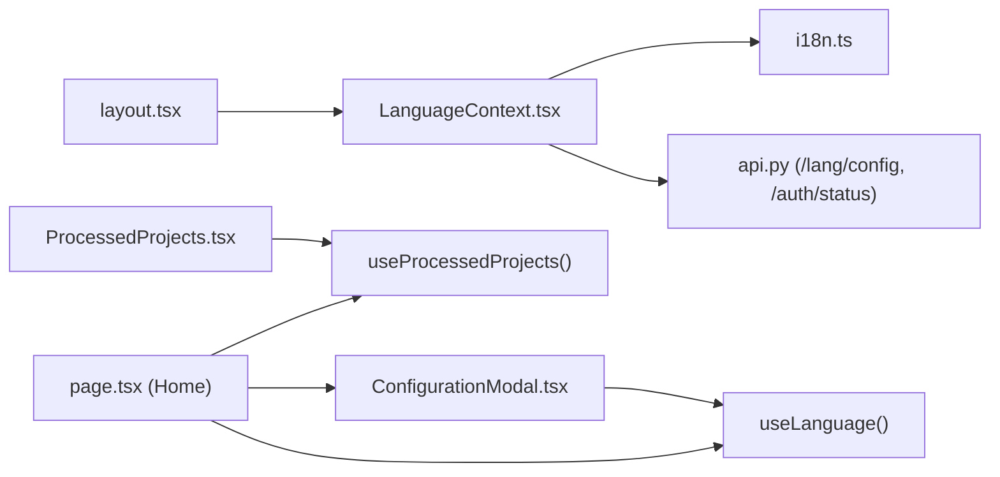

# State Management

<cite>
**Referenced Files in This Document**
- [LanguageContext.tsx](file://src/contexts/LanguageContext.tsx)
- [layout.tsx](file://src/app/layout.tsx)
- [i18n.ts](file://src/i18n.ts)
- [useProcessedProjects.ts](file://src/hooks/useProcessedProjects.ts)
- [page.tsx (Home)](file://src/app/page.tsx)
- [ConfigurationModal.tsx](file://src/components/ConfigurationModal.tsx)
- [ProcessedProjects.tsx](file://src/components/ProcessedProjects.tsx)
- [en.json](file://src/messages/en.json)
- [api.py](file://api/api.py)
</cite>

## Table of Contents
1. [Introduction](#introduction)
2. [Project Structure](#project-structure)
3. [Core Components](#core-components)
4. [Architecture Overview](#architecture-overview)
5. [Detailed Component Analysis](#detailed-component-analysis)
6. [Dependency Analysis](#dependency-analysis)
7. [Performance Considerations](#performance-considerations)
8. [Troubleshooting Guide](#troubleshooting-guide)
9. [Conclusion](#conclusion)

## Introduction
This document explains DeepWiki-Open’s state management system with a focus on:
- Global state via React Context API (language preferences)
- Custom hooks for component-specific state and data fetching
- Synchronization patterns between global and component-local state
- Hook composition strategies
- Side effects handling and persistence mechanisms
- Performance optimizations and best practices for extending state management

## Project Structure
The state management spans three layers:
- Global provider setup in the root layout
- Global language context for internationalization and UI messages
- Local component state for forms and UI interactions
- Custom hooks for data fetching and normalization-like behavior

**Diagram sources**
- [layout.tsx](file://src/app/layout.tsx#L13-L27)
- [LanguageContext.tsx](file://src/contexts/LanguageContext.tsx#L17-L194)
- [page.tsx (Home)](file://src/app/page.tsx#L45-L48)
- [useProcessedProjects.ts](file://src/hooks/useProcessedProjects.ts#L13-L46)
- [ConfigurationModal.tsx](file://src/components/ConfigurationModal.tsx#L68-L105)
- [ProcessedProjects.tsx](file://src/components/ProcessedProjects.tsx#L25-L30)

**Section sources**
- [layout.tsx](file://src/app/layout.tsx#L13-L27)

## Core Components
- LanguageContext: Provides language, messages, supported languages, and a setter to update language globally. Handles browser language detection, persistence via localStorage, and HTML lang attribute updates.
- useProcessedProjects: A custom hook that fetches processed projects from the backend and exposes loading/error state alongside normalized data.
- Home page (main page): Composes global language state with local form state, orchestrates side effects (auth status, config cache), and synchronizes language context with local selection.
- ConfigurationModal: Receives language and form props from the parent and renders configuration UI with translations.
- ProcessedProjects: Renders a paginated, searchable list of projects fetched from the backend, with view mode toggling.

**Section sources**
- [LanguageContext.tsx](file://src/contexts/LanguageContext.tsx#L8-L23)
- [useProcessedProjects.ts](file://src/hooks/useProcessedProjects.ts#L13-L46)
- [page.tsx (Home)](file://src/app/page.tsx#L45-L48)
- [ConfigurationModal.tsx](file://src/components/ConfigurationModal.tsx#L9-L66)
- [ProcessedProjects.tsx](file://src/components/ProcessedProjects.tsx#L18-L36)

## Architecture Overview
The system follows a layered pattern:
- Providers at the root supply global language state
- Components consume language via a custom hook
- Local state handles UI and form interactions
- Hooks encapsulate data fetching and normalization
- Persistence is handled via localStorage for user preferences and cached configurations

**Diagram sources**
- [layout.tsx](file://src/app/layout.tsx#L19-L27)
- [LanguageContext.tsx](file://src/contexts/LanguageContext.tsx#L69-L150)
- [page.tsx (Home)](file://src/app/page.tsx#L152-L155)
- [useProcessedProjects.ts](file://src/hooks/useProcessedProjects.ts#L18-L43)
- [api.py](file://api/api.py#L167-L178)

## Detailed Component Analysis

### LanguageContext Implementation
LanguageContext manages:
- language: currently selected language
- setLanguage: async setter that validates against supported languages, loads messages, persists to localStorage, and updates HTML lang attribute
- messages: localized strings for UI rendering
- supportedLanguages: runtime-configured list of supported locales
- Loading state: prevents rendering until messages are ready

Key behaviors:
- Browser language detection with fallback to English
- Runtime fetch of supported languages from backend
- Fallback to default supported languages if backend is unavailable
- HTML lang attribute update for accessibility
- Error handling with graceful fallback to English

**Diagram sources**
- [LanguageContext.tsx](file://src/contexts/LanguageContext.tsx#L69-L150)

**Section sources**
- [LanguageContext.tsx](file://src/contexts/LanguageContext.tsx#L17-L194)
- [i18n.ts](file://src/i18n.ts#L3-L14)
- [api.py](file://api/api.py#L149-L151)

### useProcessedProjects Hook
Purpose:
- Encapsulates fetching processed projects from the backend
- Normalizes raw API payload into a typed array
- Exposes loading, error, and data state

Behavior:
- On mount, performs a single fetch to /api/wiki/projects
- Handles HTTP errors and JSON error fields
- Resets to empty array on error
- Returns a tuple-like object with projects, isLoading, error

**Diagram sources**
- [useProcessedProjects.ts](file://src/hooks/useProcessedProjects.ts#L18-L43)

**Section sources**
- [useProcessedProjects.ts](file://src/hooks/useProcessedProjects.ts#L13-L46)

### Main Page Component State Management
Highlights:
- Global language state via useLanguage(): language, setLanguage, messages, supportedLanguages
- Local form state for repository input, provider/model selection, wiki type, platform, tokens, filters, branch, and auth code
- Synchronization between selectedLanguage and setLanguage via a useEffect
- Auth status loading via a dedicated effect that calls /api/auth/status
- Config cache persistence using localStorage keyed by repository URL
- Translation helper t(key) that navigates nested messages and supports parameter substitution

State synchronization patterns:
- Selected language sync: useEffect ensures setting the global language when the user changes the local selection
- Auth gating: validateAuthCode checks backend authorization before proceeding with generation
- Navigation: after validation and caching, the component builds a query string and navigates to the dynamic route

**Diagram sources**
- [page.tsx (Home)](file://src/app/page.tsx#L152-L155)
- [page.tsx (Home)](file://src/app/page.tsx#L296-L401)
- [LanguageContext.tsx](file://src/contexts/LanguageContext.tsx#L152-L176)

**Section sources**
- [page.tsx (Home)](file://src/app/page.tsx#L45-L48)
- [page.tsx (Home)](file://src/app/page.tsx#L78-L155)
- [page.tsx (Home)](file://src/app/page.tsx#L255-L401)
- [en.json](file://src/messages/en.json#L1-L144)

### Configuration Modal and Form State
ConfigurationModal composes:
- Language selection bound to selectedLanguage and supportedLanguages
- Wiki type toggle (comprehensive vs concise)
- Provider/model selection and custom model flag
- Platform selection and optional tokens
- File filters (included/excluded dirs/files)
- Branch selector integration
- Auth code input gated by authRequired and isAuthLoading

It receives all state setters from the parent and renders translated UI using the context-provided messages.

**Section sources**
- [ConfigurationModal.tsx](file://src/components/ConfigurationModal.tsx#L9-L66)
- [ConfigurationModal.tsx](file://src/components/ConfigurationModal.tsx#L106-L363)

### Processed Projects Rendering
ProcessedProjects:
- Owns its own loading/error state and fetches projects on mount
- Implements search and view-mode toggling
- Uses useMemo to compute filtered results efficiently
- Supports deletion via a backend DELETE endpoint

**Section sources**
- [ProcessedProjects.tsx](file://src/components/ProcessedProjects.tsx#L25-L30)
- [ProcessedProjects.tsx](file://src/components/ProcessedProjects.tsx#L56-L81)
- [ProcessedProjects.tsx](file://src/components/ProcessedProjects.tsx#L84-L98)
- [ProcessedProjects.tsx](file://src/components/ProcessedProjects.tsx#L104-L128)

## Dependency Analysis
- Root layout wraps children with LanguageProvider, ensuring all components can access language state
- Home page depends on useLanguage and useProcessedProjects
- ConfigurationModal depends on useLanguage for translations and consumes all form props from Home
- ProcessedProjects depends on useProcessedProjects internally and on backend endpoints
- LanguageContext depends on:
  - i18n.ts for supported locales
  - Backend endpoints for supported languages and auth status
  - localStorage for persistence

**Diagram sources**
- [layout.tsx](file://src/app/layout.tsx#L13-L27)
- [LanguageContext.tsx](file://src/contexts/LanguageContext.tsx#L17-L194)
- [page.tsx (Home)](file://src/app/page.tsx#L45-L48)
- [useProcessedProjects.ts](file://src/hooks/useProcessedProjects.ts#L13-L46)
- [ConfigurationModal.tsx](file://src/components/ConfigurationModal.tsx#L68-L105)
- [ProcessedProjects.tsx](file://src/components/ProcessedProjects.tsx#L25-L30)
- [i18n.ts](file://src/i18n.ts#L3-L14)
- [api.py](file://api/api.py#L149-L158)

**Section sources**
- [layout.tsx](file://src/app/layout.tsx#L13-L27)
- [LanguageContext.tsx](file://src/contexts/LanguageContext.tsx#L17-L194)
- [page.tsx (Home)](file://src/app/page.tsx#L45-L48)
- [useProcessedProjects.ts](file://src/hooks/useProcessedProjects.ts#L13-L46)
- [ConfigurationModal.tsx](file://src/components/ConfigurationModal.tsx#L68-L105)
- [ProcessedProjects.tsx](file://src/components/ProcessedProjects.tsx#L25-L30)
- [i18n.ts](file://src/i18n.ts#L3-L14)
- [api.py](file://api/api.py#L149-L158)

## Performance Considerations
- Memoization
  - useProcessedProjects computes filtered lists with useMemo in ProcessedProjects to avoid unnecessary re-renders during search
  - Consider similar memoization for derived UI state in Home when building query strings or transforming selections
- Efficient re-rendering
  - Keep language state granular; pass only required props to child components (e.g., selectedLanguage, supportedLanguages)
  - Avoid lifting unrelated state unnecessarily; keep form state local to the components that render it
- Normalization
  - useProcessedProjects normalizes backend payloads into a typed array; maintain consistent shapes across components
- Side effects
  - Debounce expensive side effects (e.g., frequent localStorage writes) when composing multiple state updates
- Persistence
  - Use localStorage sparingly; batch writes and guard against malformed data
- Accessibility
  - LanguageContext updates document.documentElement.lang; ensure this remains in sync with user actions

[No sources needed since this section provides general guidance]

## Troubleshooting Guide
Common issues and resolutions:
- Language not updating
  - Verify setLanguage is called with a supported language key and that supportedLanguages is populated before invoking setLanguage
  - Confirm localStorage persistence and HTML lang attribute updates
- Projects not loading
  - Check network tab for /api/wiki/projects; ensure backend returns a valid JSON array
  - Inspect error state returned by useProcessedProjects
- Auth validation failing
  - Confirm /api/auth/status returns auth_required and /api/auth/validate accepts the provided code
- Form state inconsistencies
  - Ensure useEffect syncing selectedLanguage with setLanguage runs after initial render
  - Validate that localStorage cache keys are consistent across Home and dynamic routes

**Section sources**
- [LanguageContext.tsx](file://src/contexts/LanguageContext.tsx#L152-L176)
- [useProcessedProjects.ts](file://src/hooks/useProcessedProjects.ts#L18-L43)
- [page.tsx (Home)](file://src/app/page.tsx#L158-L178)
- [api.py](file://api/api.py#L153-L165)

## Conclusion
DeepWiki-Open’s state management blends React Context for global language state with custom hooks for component-specific data fetching and local UI state. The system emphasizes:
- Clear separation of concerns: global provider, local components, and reusable hooks
- Robust synchronization between global and local state
- Practical persistence via localStorage and backend APIs
- Performance-conscious patterns like memoization and normalized data

Guidelines for extending state management:
- Prefer custom hooks for data fetching and normalization
- Keep global context minimal and focused (language/messaging)
- Use localStorage for user preferences and transient UI state
- Maintain strict prop contracts between parent and child components
- Add defensive guards for async operations and error boundaries
- Ensure accessibility by keeping document.lang synchronized with language context

[No sources needed since this section summarizes without analyzing specific files]