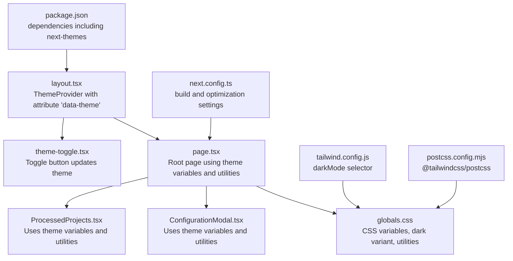
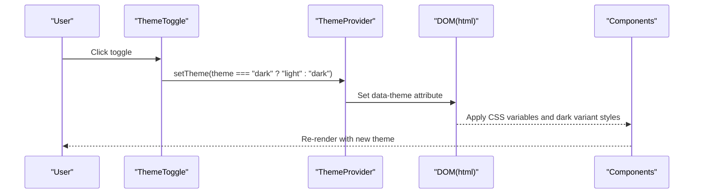
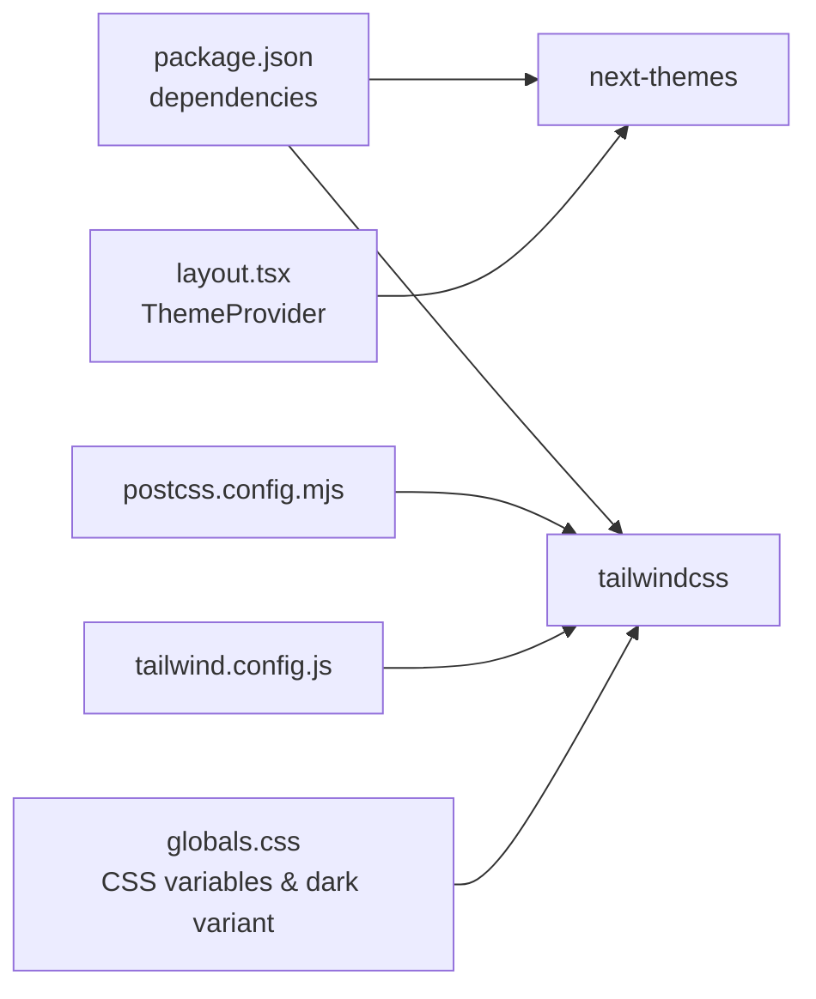

# Theme and Styling

<cite>
**Referenced Files in This Document**
- [globals.css](file://src/app/globals.css)
- [layout.tsx](file://src/app/layout.tsx)
- [page.tsx](file://src/app/page.tsx)
- [theme-toggle.tsx](file://src/components/theme-toggle.tsx)
- [ConfigurationModal.tsx](file://src/components/ConfigurationModal.tsx)
- [ProcessedProjects.tsx](file://src/components/ProcessedProjects.tsx)
- [tailwind.config.js](file://tailwind.config.js)
- [postcss.config.mjs](file://postcss.config.mjs)
- [next.config.ts](file://next.config.ts)
- [package.json](file://package.json)
</cite>

## Table of Contents
1. [Introduction](#introduction)
2. [Project Structure](#project-structure)
3. [Core Components](#core-components)
4. [Architecture Overview](#architecture-overview)
5. [Detailed Component Analysis](#detailed-component-analysis)
6. [Dependency Analysis](#dependency-analysis)
7. [Performance Considerations](#performance-considerations)
8. [Troubleshooting Guide](#troubleshooting-guide)
9. [Conclusion](#conclusion)
10. [Appendices](#appendices)

## Introduction
This document explains the theming and styling system of DeepWiki-Open. It covers CSS custom properties for theme variables, dark/light mode toggle functionality, responsive design patterns, Tailwind CSS integration, utility class usage, and custom styling approaches. It also documents the theme-toggle component, CSS variable management, persistence across sessions, examples of custom component styling, responsive breakpoints, accessibility considerations, performance optimization via CSS optimization and critical CSS extraction, and theme switching performance. Finally, it provides guidelines for adding new themes, customizing existing styles, and maintaining design system consistency.

## Project Structure
The theming system spans global styles, a theme provider, and reusable components:
- Global CSS defines CSS custom properties and theme-aware selectors.
- The Next.js layout wraps the app with a theme provider that controls the data-theme attribute.
- Components consume CSS variables and Tailwind utilities to render theme-consistent UI.
- Tailwind and PostCSS are configured to process styles and support dark mode via selectors.

**Diagram sources**
- [layout.tsx](file://src/app/layout.tsx#L13-L31)
- [page.tsx](file://src/app/page.tsx#L403-L637)
- [theme-toggle.tsx](file://src/components/theme-toggle.tsx#L5-L49)
- [globals.css](file://src/app/globals.css#L1-L149)
- [ConfigurationModal.tsx](file://src/components/ConfigurationModal.tsx#L114-L363)
- [ProcessedProjects.tsx](file://src/components/ProcessedProjects.tsx#L130-L271)
- [tailwind.config.js](file://tailwind.config.js#L1-L8)
- [postcss.config.mjs](file://postcss.config.mjs#L1-L6)
- [next.config.ts](file://next.config.ts#L1-L71)
- [package.json](file://package.json#L11-L25)

**Section sources**
- [layout.tsx](file://src/app/layout.tsx#L13-L31)
- [globals.css](file://src/app/globals.css#L1-L149)
- [tailwind.config.js](file://tailwind.config.js#L1-L8)
- [postcss.config.mjs](file://postcss.config.mjs#L1-L6)
- [next.config.ts](file://next.config.ts#L1-L71)
- [package.json](file://package.json#L11-L25)

## Core Components
- CSS custom properties: Centralized theme variables in :root and html[data-theme='dark'], consumed throughout components and utilities.
- Dark mode variant: Tailwind’s selector-based dark mode with a custom dark variant selector.
- Theme provider: next-themes sets the data-theme attribute on the html element.
- Theme toggle: A small interactive button that switches between light and dark modes.
- Utility classes: Tailwind utilities combined with CSS variables for consistent theming.
- Custom utilities: Japanese aesthetic button, input, and card styles built on CSS variables.

Key implementation references:
- CSS variables and dark variant: [globals.css](file://src/app/globals.css#L6-L44)
- Dark variant selector: [globals.css](file://src/app/globals.css#L4-L4)
- Tailwind dark mode selector: [tailwind.config.js](file://tailwind.config.js#L2-L2)
- Theme provider attribute: [layout.tsx](file://src/app/layout.tsx#L23-L27)
- Theme toggle component: [theme-toggle.tsx](file://src/components/theme-toggle.tsx#L5-L49)
- Utility usage in components: [page.tsx](file://src/app/page.tsx#L403-L637), [ConfigurationModal.tsx](file://src/components/ConfigurationModal.tsx#L114-L363), [ProcessedProjects.tsx](file://src/components/ProcessedProjects.tsx#L130-L271)

**Section sources**
- [globals.css](file://src/app/globals.css#L4-L44)
- [tailwind.config.js](file://tailwind.config.js#L2-L2)
- [layout.tsx](file://src/app/layout.tsx#L23-L27)
- [theme-toggle.tsx](file://src/components/theme-toggle.tsx#L5-L49)
- [page.tsx](file://src/app/page.tsx#L403-L637)
- [ConfigurationModal.tsx](file://src/components/ConfigurationModal.tsx#L114-L363)
- [ProcessedProjects.tsx](file://src/components/ProcessedProjects.tsx#L130-L271)

## Architecture Overview
The theming pipeline:
- The theme provider sets the data-theme attribute on the html element.
- CSS custom properties define theme tokens for light and dark modes.
- Tailwind utilities apply base styles and dark-mode variants.
- Components use CSS variables and Tailwind utilities for consistent rendering.
- The theme toggle toggles the theme via next-themes.

**Diagram sources**
- [theme-toggle.tsx](file://src/components/theme-toggle.tsx#L5-L49)
- [layout.tsx](file://src/app/layout.tsx#L23-L27)
- [globals.css](file://src/app/globals.css#L4-L44)
- [tailwind.config.js](file://tailwind.config.js#L2-L2)

## Detailed Component Analysis

### Theme Variables and Dark Mode
- CSS custom properties define theme tokens for background, foreground, accents, borders, cards, highlights, muted colors, and links.
- A dark variant selector enables Tailwind utilities to adapt to dark mode.
- The html[data-theme='dark'] block overrides variables for dark mode.
- A fix targets select option readability in dark mode.
- The @theme directive exposes CSS variables as Tailwind tokens for font families.

Implementation references:
- Variables and dark overrides: [globals.css](file://src/app/globals.css#L6-L32)
- Dark variant selector: [globals.css](file://src/app/globals.css#L4-L4)
- Theme tokens exposure: [globals.css](file://src/app/globals.css#L39-L44)
- Select option fix: [globals.css](file://src/app/globals.css#L34-L37)

**Section sources**
- [globals.css](file://src/app/globals.css#L4-L44)
- [globals.css](file://src/app/globals.css#L34-L37)

### Tailwind CSS Integration and Dark Mode
- Tailwind dark mode is enabled via selector mode and configured to scan app, components, and pages.
- The dark variant selector allows scoped dark mode within components.

Implementation references:
- Tailwind dark mode selector: [tailwind.config.js](file://tailwind.config.js#L2-L2)
- Content scanning globs: [tailwind.config.js](file://tailwind.config.js#L3-L7)

**Section sources**
- [tailwind.config.js](file://tailwind.config.js#L1-L8)

### Theme Provider and Persistence
- The ThemeProvider sets the data-theme attribute on the html element and defaults to system preference.
- The theme toggle updates the theme via next-themes, persisting the user’s choice across sessions automatically.

Implementation references:
- Theme provider and attribute: [layout.tsx](file://src/app/layout.tsx#L23-L27)
- Theme toggle logic: [theme-toggle.tsx](file://src/components/theme-toggle.tsx#L5-L49)
- next-themes dependency: [package.json](file://package.json#L16-L16)

**Section sources**
- [layout.tsx](file://src/app/layout.tsx#L23-L27)
- [theme-toggle.tsx](file://src/components/theme-toggle.tsx#L5-L49)
- [package.json](file://package.json#L16-L16)

### Theme Toggle Component
- The component reads the current theme and toggles between "light" and "dark".
- It renders distinct sun/moon icons depending on the current theme and uses CSS variables for styling.
- Accessibility attributes include title and aria-label.

Implementation references:
- Toggle button and icons: [theme-toggle.tsx](file://src/components/theme-toggle.tsx#L9-L47)
- Theme state and toggle logic: [theme-toggle.tsx](file://src/components/theme-toggle.tsx#L6-L14)

**Section sources**
- [theme-toggle.tsx](file://src/components/theme-toggle.tsx#L5-L49)

### Custom Styling Utilities
- Japanese aesthetic utilities include button, input, and card styles that rely on CSS variables for colors and transitions.
- Paper texture backgrounds are applied conditionally for light and dark modes.
- Line clamp utilities provide multi-line truncation.

Implementation references:
- Japanese button styles: [globals.css](file://src/app/globals.css#L68-L98)
- Japanese input styles: [globals.css](file://src/app/globals.css#L100-L113)
- Japanese card styles: [globals.css](file://src/app/globals.css#L115-L126)
- Paper textures: [globals.css](file://src/app/globals.css#L57-L66)
- Line clamp utilities: [globals.css](file://src/app/globals.css#L128-L149)

**Section sources**
- [globals.css](file://src/app/globals.css#L57-L149)

### Component Styling with CSS Variables and Tailwind
- Root layout applies global styles and wraps children with the theme provider.
- The home page uses paper textures, custom shadows, and Japanese-styled inputs/buttons/cards.
- Modal and project list components consistently use CSS variables and Tailwind utilities for borders, backgrounds, and typography.

Implementation references:
- Global wrapper and provider: [layout.tsx](file://src/app/layout.tsx#L18-L29)
- Page container and utilities: [page.tsx](file://src/app/page.tsx#L403-L637)
- Modal styling: [ConfigurationModal.tsx](file://src/components/ConfigurationModal.tsx#L114-L363)
- Project list styling: [ProcessedProjects.tsx](file://src/components/ProcessedProjects.tsx#L130-L271)

**Section sources**
- [layout.tsx](file://src/app/layout.tsx#L18-L29)
- [page.tsx](file://src/app/page.tsx#L403-L637)
- [ConfigurationModal.tsx](file://src/components/ConfigurationModal.tsx#L114-L363)
- [ProcessedProjects.tsx](file://src/components/ProcessedProjects.tsx#L130-L271)

### Responsive Design Patterns
- Responsive breakpoints are used via Tailwind utilities (for example, md:, sm:).
- Examples include responsive flex layouts, padding adjustments, and grid layouts that adapt to screen sizes.

Implementation references:
- Responsive flex and padding: [page.tsx](file://src/app/page.tsx#L403-L404)
- Responsive grid and spacing: [page.tsx](file://src/app/page.tsx#L496-L609)
- View toggles and responsive inputs: [ProcessedProjects.tsx](file://src/components/ProcessedProjects.tsx#L144-L189)

**Section sources**
- [page.tsx](file://src/app/page.tsx#L403-L609)
- [ProcessedProjects.tsx](file://src/components/ProcessedProjects.tsx#L144-L189)

### Accessibility Considerations
- The theme toggle includes title and aria-label attributes for assistive technologies.
- Color contrast is maintained through CSS variables for foreground/background and borders.
- Focus states and transitions improve keyboard and pointer interaction feedback.

Implementation references:
- Toggle accessibility attributes: [theme-toggle.tsx](file://src/components/theme-toggle.tsx#L12-L14)
- Focus and border emphasis: [globals.css](file://src/app/globals.css#L109-L113)
- Select option fix for dark mode readability: [globals.css](file://src/app/globals.css#L34-L37)

**Section sources**
- [theme-toggle.tsx](file://src/components/theme-toggle.tsx#L12-L14)
- [globals.css](file://src/app/globals.css#L34-L37)
- [globals.css](file://src/app/globals.css#L109-L113)

## Dependency Analysis
The theming stack integrates several packages and configurations:
- next-themes manages theme state and persistence.
- Tailwind CSS provides utility classes and dark mode variants.
- PostCSS processes Tailwind directives.
- Next.js configuration affects build-time optimizations.

**Diagram sources**
- [package.json](file://package.json#L11-L25)
- [postcss.config.mjs](file://postcss.config.mjs#L1-L6)
- [tailwind.config.js](file://tailwind.config.js#L1-L8)
- [layout.tsx](file://src/app/layout.tsx#L23-L27)
- [globals.css](file://src/app/globals.css#L4-L44)

**Section sources**
- [package.json](file://package.json#L11-L25)
- [postcss.config.mjs](file://postcss.config.mjs#L1-L6)
- [tailwind.config.js](file://tailwind.config.js#L1-L8)
- [layout.tsx](file://src/app/layout.tsx#L23-L27)
- [globals.css](file://src/app/globals.css#L4-L44)

## Performance Considerations
- CSS optimization: Use CSS variables to minimize repeated color definitions and reduce CSS size.
- Critical CSS extraction: Keep global base styles minimal and defer non-critical component styles.
- Theme switching performance: next-themes persists theme preferences efficiently; avoid unnecessary re-renders by limiting theme-dependent computations.
- Build optimizations: Next.js build settings and Webpack chunk splitting help reduce bundle size.

References:
- Global base styles and variables: [globals.css](file://src/app/globals.css#L1-L149)
- Theme provider and persistence: [layout.tsx](file://src/app/layout.tsx#L23-L27)
- Theme toggle logic: [theme-toggle.tsx](file://src/components/theme-toggle.tsx#L6-L14)
- Next.js build and optimization settings: [next.config.ts](file://next.config.ts#L9-L35)

**Section sources**
- [globals.css](file://src/app/globals.css#L1-L149)
- [layout.tsx](file://src/app/layout.tsx#L23-L27)
- [theme-toggle.tsx](file://src/components/theme-toggle.tsx#L6-L14)
- [next.config.ts](file://next.config.ts#L9-L35)

## Troubleshooting Guide
- Theme does not switch:
  - Verify the ThemeProvider is wrapping the application and the data-theme attribute is being set.
  - Confirm the theme toggle invokes setTheme correctly.
  - References: [layout.tsx](file://src/app/layout.tsx#L23-L27), [theme-toggle.tsx](file://src/components/theme-toggle.tsx#L6-L14)
- Dark mode styles not applying:
  - Ensure the dark variant selector is defined and Tailwind dark mode is configured to use the selector.
  - References: [globals.css](file://src/app/globals.css#L4-L4), [tailwind.config.js](file://tailwind.config.js#L2-L2)
- Select dropdowns unreadable in dark mode:
  - Confirm the dark mode fix for select options is present.
  - Reference: [globals.css](file://src/app/globals.css#L34-L37)
- Styling inconsistencies:
  - Ensure components use CSS variables and Tailwind utilities consistently.
  - References: [page.tsx](file://src/app/page.tsx#L403-L637), [ConfigurationModal.tsx](file://src/components/ConfigurationModal.tsx#L114-L363), [ProcessedProjects.tsx](file://src/components/ProcessedProjects.tsx#L130-L271)

**Section sources**
- [layout.tsx](file://src/app/layout.tsx#L23-L27)
- [theme-toggle.tsx](file://src/components/theme-toggle.tsx#L6-L14)
- [globals.css](file://src/app/globals.css#L4-L4)
- [tailwind.config.js](file://tailwind.config.js#L2-L2)
- [globals.css](file://src/app/globals.css#L34-L37)
- [page.tsx](file://src/app/page.tsx#L403-L637)
- [ConfigurationModal.tsx](file://src/components/ConfigurationModal.tsx#L114-L363)
- [ProcessedProjects.tsx](file://src/components/ProcessedProjects.tsx#L130-L271)

## Conclusion
DeepWiki-Open’s theming system leverages CSS custom properties, a selector-based dark mode, and Tailwind utilities to deliver a consistent, accessible, and performant design. The ThemeProvider and theme-toggle integrate seamlessly with CSS variables and component-level styling. By following the guidelines below, contributors can extend themes, maintain design system consistency, and optimize performance.

## Appendices

### Guidelines for Adding New Themes
- Define new CSS custom properties for the theme in the global stylesheet.
- Provide light and dark overrides for all tokens.
- Optionally introduce a new dark variant selector if needed.
- Update components to use the new tokens and verify responsiveness.
- References: [globals.css](file://src/app/globals.css#L6-L32), [globals.css](file://src/app/globals.css#L4-L4)

### Guidelines for Customizing Existing Styles
- Prefer CSS variables for colors, borders, and backgrounds to keep changes centralized.
- Use Tailwind utilities for layout and spacing; combine with CSS variables for colors.
- Maintain accessibility by preserving sufficient contrast and focus states.
- Test both light and dark modes after changes.
- References: [globals.css](file://src/app/globals.css#L39-L44), [page.tsx](file://src/app/page.tsx#L403-L637)

### Maintaining Design System Consistency
- Centralize theme tokens in CSS variables.
- Encourage reusable utility classes for common patterns (buttons, inputs, cards).
- Use Tailwind’s spacing and sizing utilities consistently.
- Keep component styles scoped and predictable across modes.
- References: [globals.css](file://src/app/globals.css#L68-L149), [tailwind.config.js](file://tailwind.config.js#L1-L8)