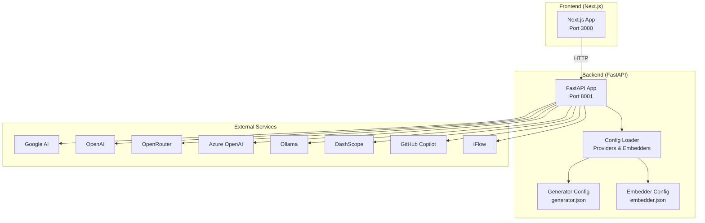
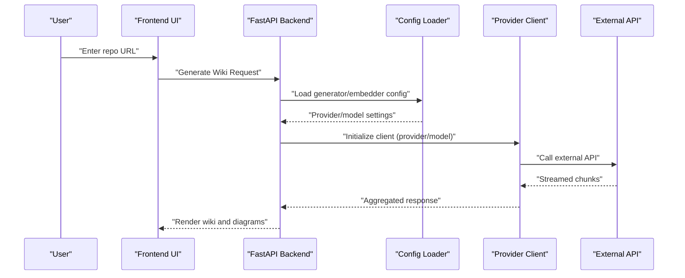
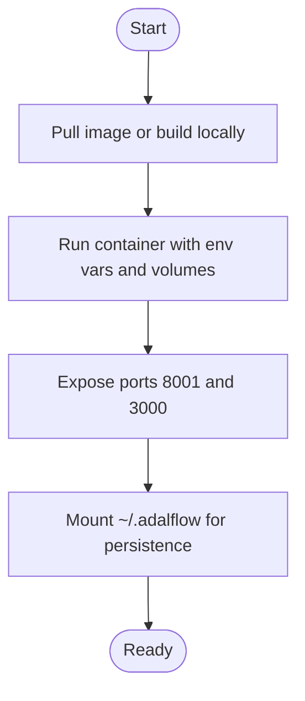
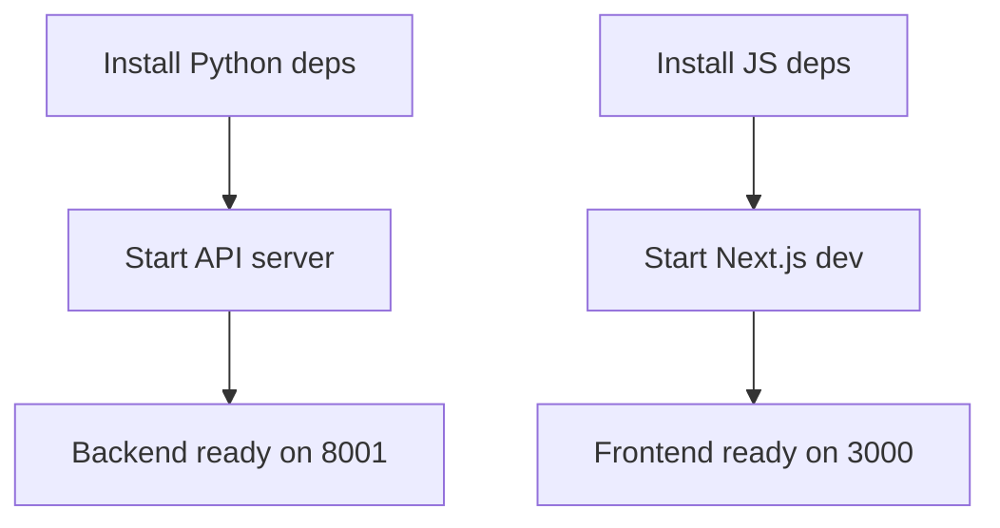
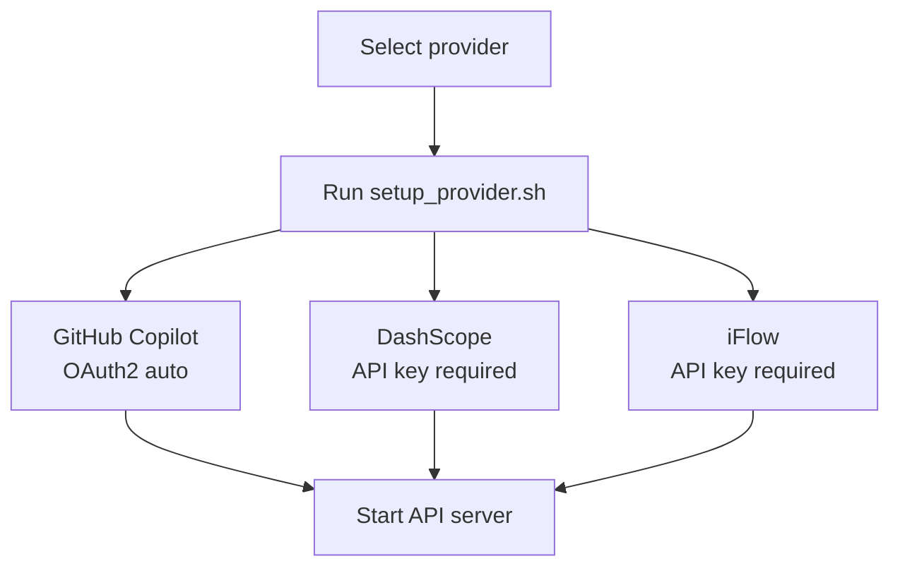
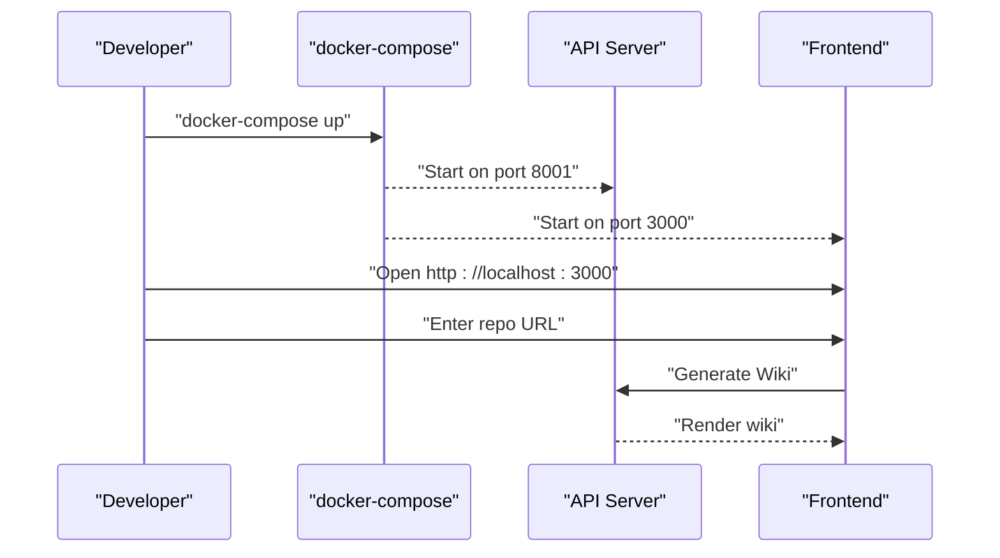

# Getting Started

<cite>
**Referenced Files in This Document**
- [README.md](file://README.md)
- [Dockerfile](file://Dockerfile)
- [docker-compose.yml](file://docker-compose.yml)
- [run.sh](file://run.sh)
- [setup_provider.sh](file://setup_provider.sh)
- [PROVIDER_SETUP_GUIDE.md](file://PROVIDER_SETUP_GUIDE.md)
- [Ollama-instruction.md](file://Ollama-instruction.md)
- [GITHUB_COPILOT_INTEGRATION_SUMMARY.md](file://GITHUB_COPILOT_INTEGRATION_SUMMARY.md)
- [IFLOW_INTEGRATION.md](file://IFLOW_INTEGRATION.md)
- [api/requirements.txt](file://api/requirements.txt)
- [api/config.py](file://api/config.py)
- [api/main.py](file://api/main.py)
- [api/config/generator.json](file://api/config/generator.json)
- [api/config/embedder.json](file://api/config/embedder.json)
- [package.json](file://package.json)
</cite>

## Table of Contents
1. [Introduction](#introduction)
2. [Project Structure](#project-structure)
3. [Core Components](#core-components)
4. [Architecture Overview](#architecture-overview)
5. [Installation Methods](#installation-methods)
6. [Environment Configuration](#environment-configuration)
7. [Quick Start](#quick-start)
8. [Troubleshooting Guide](#troubleshooting-guide)
9. [Conclusion](#conclusion)

## Introduction
DeepWiki-Open automatically generates beautiful, interactive wikis for GitHub, GitLab, and BitBucket repositories. It supports multiple AI providers (Google, OpenAI, OpenRouter, Azure OpenAI, Ollama, DashScope, GitHub Copilot, iFlow) and includes features like repository analysis, embeddings, visual diagrams, and an Ask chat powered by Retrieval Augmented Generation (RAG).

## Project Structure
The project consists of:
- Backend API server (Python/FastAPI) in the api/ directory
- Frontend Next.js application in the src/ directory
- Docker images and compose configuration for containerized deployment
- Provider configuration scripts and documentation

**Diagram sources**
- [Dockerfile](file://Dockerfile#L138-L171)
- [docker-compose.yml](file://docker-compose.yml#L15-L17)
- [api/config.py](file://api/config.py#L60-L71)
- [api/config/generator.json](file://api/config/generator.json#L1-L101)
- [api/config/embedder.json](file://api/config/embedder.json#L1-L35)

**Section sources**
- [README.md](file://README.md#L247-L267)
- [Dockerfile](file://Dockerfile#L138-L171)
- [docker-compose.yml](file://docker-compose.yml#L1-L46)

## Core Components
- Backend API server: FastAPI app exposing endpoints for repository processing, chat, and wiki generation.
- Provider configuration: Centralized configuration for models and clients, including provider-specific settings.
- Embedding configuration: Defines embedding models, batch sizes, and text splitting behavior.
- Frontend: Next.js app with React components for UI, chat, and wiki display.

Key configuration files:
- generator.json: Provider and model definitions
- embedder.json: Embedding and retriever settings
- repo.json: Repository filters and limits
- lang.json: Supported languages

**Section sources**
- [api/config.py](file://api/config.py#L104-L181)
- [api/config/generator.json](file://api/config/generator.json#L1-L101)
- [api/config/embedder.json](file://api/config/embedder.json#L1-L35)

## Architecture Overview
DeepWiki orchestrates repository analysis, embeddings, and documentation generation across multiple providers. The backend loads configuration, selects providers/models, and streams responses to the frontend.

**Diagram sources**
- [api/config.py](file://api/config.py#L381-L464)
- [api/config/generator.json](file://api/config/generator.json#L1-L101)
- [api/config/embedder.json](file://api/config/embedder.json#L1-L35)

## Installation Methods

### Option 1: Docker (Recommended)
- Pull or build the image, then run with environment variables and volume mounts for persistent data.
- Ports exposed: API server on 8001, frontend on 3000.
- Data persistence: ~/.adalflow mounted inside the container for repos, embeddings, and cached wiki content.

**Diagram sources**
- [Dockerfile](file://Dockerfile#L138-L171)
- [docker-compose.yml](file://docker-compose.yml#L15-L38)

Steps:
- Create a .env file with API keys and optional settings.
- Use docker-compose up to start both backend and frontend.
- Alternatively, run a single container with docker run and mount .env and ~/.adalflow.

**Section sources**
- [README.md](file://README.md#L33-L57)
- [README.md](file://README.md#L515-L582)
- [docker-compose.yml](file://docker-compose.yml#L1-L46)
- [Dockerfile](file://Dockerfile#L138-L171)

### Option 2: Manual Setup
- Backend (Python):
  - Install dependencies from api/requirements.txt.
  - Start the API server with python -m api.main.
- Frontend (JavaScript/Next.js):
  - Install dependencies with npm install or yarn install.
  - Start development server with npm run dev or yarn dev.

**Diagram sources**
- [api/requirements.txt](file://api/requirements.txt#L1-L22)
- [package.json](file://package.json#L5-L10)
- [README.md](file://README.md#L166-L188)

**Section sources**
- [README.md](file://README.md#L145-L188)
- [api/main.py](file://api/main.py#L87-L104)

## Environment Configuration

### API Keys and Provider Setup
- Google: GOOGLE_API_KEY (required for Google Gemini and Google embeddings)
- OpenAI: OPENAI_API_KEY (required for OpenAI embeddings or models)
- OpenRouter: OPENROUTER_API_KEY (optional)
- Azure OpenAI: AZURE_OPENAI_API_KEY, AZURE_OPENAI_ENDPOINT, AZURE_OPENAI_VERSION (optional)
- Ollama: OLLAMA_HOST (optional, default http://localhost:11434)
- DashScope: DASHSCOPE_API_KEY (via setup_provider.sh)
- GitHub Copilot: Automatic OAuth2 (no API key required)
- iFlow: IFLOW_API_KEY (via setup_provider.sh)

Embedding selection:
- DEEPWIKI_EMBEDDER_TYPE: openai (default), google, ollama, github_copilot

Additional environment variables:
- PORT, SERVER_BASE_URL, LOG_LEVEL, LOG_FILE_PATH, DEEPWIKI_AUTH_MODE, DEEPWIKI_AUTH_CODE, DEEPWIKI_CONFIG_DIR

**Section sources**
- [README.md](file://README.md#L281-L302)
- [README.md](file://README.md#L477-L501)
- [api/config.py](file://api/config.py#L19-L47)
- [api/config.py](file://api/config.py#L54-L58)
- [api/config.py](file://api/config.py#L104-L126)

### Provider Configuration Scripts
- Use setup_provider.sh to quickly switch between providers:
  - github_copilot: Zero configuration, automatic OAuth2
  - dashscope: Requires DASHSCOPE_API_KEY
  - iFlow: Requires IFLOW_API_KEY

**Diagram sources**
- [setup_provider.sh](file://setup_provider.sh#L1-L189)
- [PROVIDER_SETUP_GUIDE.md](file://PROVIDER_SETUP_GUIDE.md#L1-L156)

**Section sources**
- [setup_provider.sh](file://setup_provider.sh#L1-L189)
- [PROVIDER_SETUP_GUIDE.md](file://PROVIDER_SETUP_GUIDE.md#L1-L156)

### Optional Ollama Integration
- Local models for embeddings and generation.
- Configure embedder.json for Ollama and set OLLAMA_HOST if remote.
- Use Dockerfile-ollama-local for a containerized Ollama setup.

**Section sources**
- [Ollama-instruction.md](file://Ollama-instruction.md#L1-L190)
- [Dockerfile](file://Dockerfile#L1-L171)

### GitHub Token Setup (Required for Repositories)
- Use the frontend Personal Access Token field to avoid rate limiting.
- Recommended scopes: public_repo (for public), repo (for private).
- Higher rate limits: ~5,000/hour vs 60/hour without token.

**Section sources**
- [README.md](file://README.md#L64-L144)

## Quick Start

### Docker Compose (Recommended)
- Create .env with API keys and optional settings.
- Run docker-compose up to start backend and frontend.
- Open http://localhost:3000 in your browser.

**Diagram sources**
- [docker-compose.yml](file://docker-compose.yml#L15-L17)
- [README.md](file://README.md#L33-L57)

**Section sources**
- [README.md](file://README.md#L33-L57)
- [docker-compose.yml](file://docker-compose.yml#L1-L46)

### Manual Installation
- Backend:
  - pip install -r api/requirements.txt
  - python -m api.main
- Frontend:
  - npm install
  - npm run dev

**Section sources**
- [README.md](file://README.md#L145-L188)
- [api/main.py](file://api/main.py#L87-L104)

### Example Workflow
- Enter a repository URL (GitHub, GitLab, BitBucket).
- For private repositories, add a token in the UI.
- Select a provider/model in the UI.
- Click "Generate Wiki" and review the generated content and diagrams.

**Section sources**
- [README.md](file://README.md#L190-L196)

## Troubleshooting Guide

### Common Setup Issues
- Missing required environment variables: Ensure .env contains GOOGLE_API_KEY and OPENAI_API_KEY.
- Provider-specific errors: Verify keys for OpenRouter, Azure OpenAI, DashScope, or iFlow.
- CORS or connectivity: Confirm API server runs on 8001 and frontend on 3000.
- Rate limiting: Use the frontend Personal Access Token field to increase limits.

### Logging and Diagnostics
- Set LOG_LEVEL and LOG_FILE_PATH to capture detailed logs.
- In Docker Compose, logs persist under api/logs.

**Section sources**
- [README.md](file://README.md#L696-L718)
- [README.md](file://README.md#L441-L475)
- [docker-compose.yml](file://docker-compose.yml#L24-L35)

## Conclusion
You can deploy DeepWiki-Open quickly using Docker Compose or manually. Configure provider keys and embeddings according to your needs, and use the frontend token input to avoid rate limiting. For local models, Ollama provides a privacy-focused alternative. Refer to the provider setup scripts and configuration files for advanced customization.