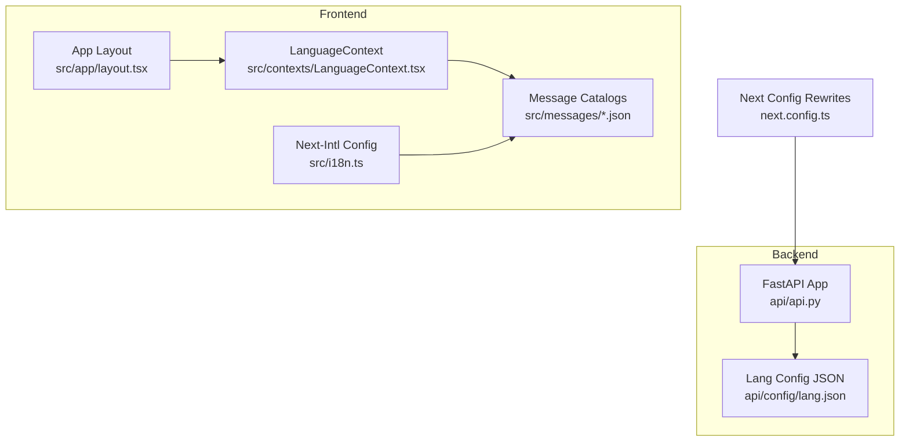
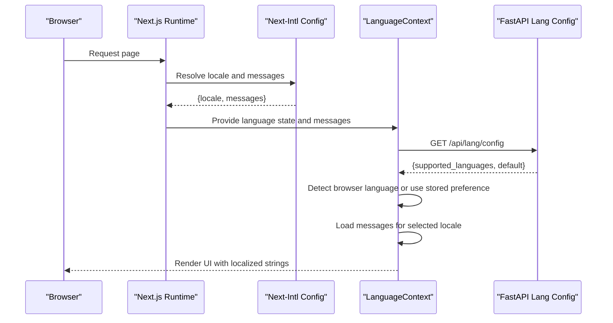
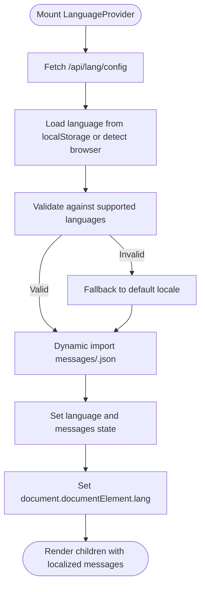
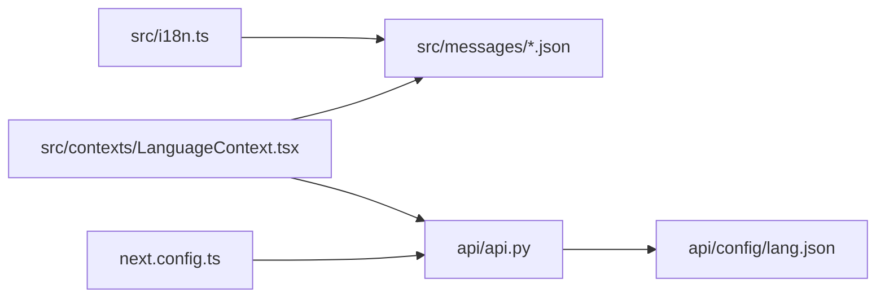

# Internationalization System

<cite>
**Referenced Files in This Document**
- [src/i18n.ts](file://src/i18n.ts)
- [src/contexts/LanguageContext.tsx](file://src/contexts/LanguageContext.tsx)
- [src/app/layout.tsx](file://src/app/layout.tsx)
- [src/messages/en.json](file://src/messages/en.json)
- [src/messages/zh.json](file://src/messages/zh.json)
- [src/messages/ja.json](file://src/messages/ja.json)
- [src/messages/pt-br.json](file://src/messages/pt-br.json)
- [next.config.ts](file://next.config.ts)
- [package.json](file://package.json)
- [api/config/lang.json](file://api/config/lang.json)
- [api/api.py](file://api/api.py)
</cite>

## Table of Contents
1. [Introduction](#introduction)
2. [Project Structure](#project-structure)
3. [Core Components](#core-components)
4. [Architecture Overview](#architecture-overview)
5. [Detailed Component Analysis](#detailed-component-analysis)
6. [Dependency Analysis](#dependency-analysis)
7. [Performance Considerations](#performance-considerations)
8. [Troubleshooting Guide](#troubleshooting-guide)
9. [Conclusion](#conclusion)
10. [Appendices](#appendices)

## Introduction
This document explains DeepWiki-Open’s internationalization (i18n) system. It covers how the frontend detects and loads locales, how message catalogs are organized and maintained, and how language switching works. It also documents the backend integration for locale configuration, the rewrite rules that connect frontend and backend, and best practices for translators and maintainers. Right-to-left (RTL) language handling, pluralization, and date/time formatting are addressed conceptually, along with practical steps to add new languages and keep translations consistent.

## Project Structure
The i18n system spans three layers:
- Frontend Next.js runtime with Next-Intl for server-side configuration and dynamic imports for message catalogs
- A React context that manages client-side language detection, persistence, and dynamic loading
- Backend FastAPI service that exposes a language configuration endpoint and validates language parameters for cached wiki operations

**Diagram sources**
- [src/app/layout.tsx](file://src/app/layout.tsx#L13-L31)
- [src/contexts/LanguageContext.tsx](file://src/contexts/LanguageContext.tsx#L17-L194)
- [src/i18n.ts](file://src/i18n.ts#L1-L15)
- [src/messages/en.json](file://src/messages/en.json#L1-L144)
- [next.config.ts](file://next.config.ts#L36-L67)
- [api/api.py](file://api/api.py#L149-L151)
- [api/config/lang.json](file://api/config/lang.json#L1-L16)

**Section sources**
- [src/i18n.ts](file://src/i18n.ts#L1-L15)
- [src/contexts/LanguageContext.tsx](file://src/contexts/LanguageContext.tsx#L1-L203)
- [src/app/layout.tsx](file://src/app/layout.tsx#L1-L32)
- [next.config.ts](file://next.config.ts#L1-L71)
- [api/api.py](file://api/api.py#L149-L151)
- [api/config/lang.json](file://api/config/lang.json#L1-L16)

## Core Components
- Next-Intl server configuration defines supported locales and dynamically imports message catalogs per-request
- A React context handles client-side language detection, persistence, and dynamic message loading
- A backend endpoint serves supported languages and default locale, and validates language parameters for cached wiki operations
- Next.js rewrites forward frontend requests to the backend for language configuration

Key responsibilities:
- Locale detection and fallback
- Dynamic message loading
- Maintaining HTML lang attribute
- Backend language validation for cached data operations

**Section sources**
- [src/i18n.ts](file://src/i18n.ts#L1-L15)
- [src/contexts/LanguageContext.tsx](file://src/contexts/LanguageContext.tsx#L17-L194)
- [api/api.py](file://api/api.py#L149-L151)
- [next.config.ts](file://next.config.ts#L36-L67)

## Architecture Overview
The i18n architecture integrates frontend and backend:
- Frontend initializes LanguageContext at the root layout and uses dynamic imports to load messages
- Next-Intl server configuration ensures only supported locales are served
- Language configuration is fetched from the backend via a rewritten route
- Backend validates language parameters for cached wiki operations and falls back to default when unsupported

**Diagram sources**
- [src/i18n.ts](file://src/i18n.ts#L6-L14)
- [src/contexts/LanguageContext.tsx](file://src/contexts/LanguageContext.tsx#L69-L150)
- [next.config.ts](file://next.config.ts#L63-L65)
- [api/api.py](file://api/api.py#L149-L151)

## Detailed Component Analysis

### Next-Intl Server Configuration
- Defines supported locales and safely maps incoming locale to a supported value
- Dynamically imports the corresponding message catalog for rendering
- Ensures server-side consistency and prevents loading unsupported locales

Implementation highlights:
- Supported locales list
- Safe locale resolution with default fallback
- Dynamic import of messages per locale

**Section sources**
- [src/i18n.ts](file://src/i18n.ts#L1-L15)

### LanguageContext (Client-Side)
Responsibilities:
- Detect browser language and normalize to supported codes
- Persist user preference in localStorage
- Fetch backend language configuration and default locale
- Dynamically load message catalogs on change or on first render
- Update HTML lang attribute for accessibility and SEO
- Provide loading state and graceful fallback to English on errors

Key behaviors:
- Browser language detection with special handling for Chinese variants
- Validation against backend-supported languages
- Dynamic import of message catalogs
- Error boundary fallback to English

**Diagram sources**
- [src/contexts/LanguageContext.tsx](file://src/contexts/LanguageContext.tsx#L69-L150)

**Section sources**
- [src/contexts/LanguageContext.tsx](file://src/contexts/LanguageContext.tsx#L17-L194)

### Message Catalogs Organization
- Located under src/messages with one JSON file per locale
- Hierarchical structure grouped by functional domains (common, loading, home, form, footer, ask, repoPage, nav, projects)
- Keys are dot-notation paths used by the frontend to resolve localized strings

Examples of structure:
- Common UI labels and actions
- Loading states and progress messages
- Page-specific content (home, ask, repoPage, projects)
- Navigation and footer text

Best practices:
- Keep keys stable across locales
- Use hierarchical grouping for maintainability
- Avoid embedding HTML inside translations; pass JSX from components

**Section sources**
- [src/messages/en.json](file://src/messages/en.json#L1-L144)
- [src/messages/zh.json](file://src/messages/zh.json#L1-L134)
- [src/messages/ja.json](file://src/messages/ja.json#L1-L134)
- [src/messages/pt-br.json](file://src/messages/pt-br.json#L1-L143)

### Backend Language Configuration and Validation
- Exposes /api/lang/config with supported languages and default locale
- Validates language parameters for cached wiki operations and falls back to default when unsupported
- Integrates with Next.js rewrites so frontend can call /api/lang/config transparently

Integration points:
- FastAPI endpoint returns supported languages and default
- Cached wiki endpoints validate language and enforce fallback

**Section sources**
- [api/api.py](file://api/api.py#L149-L151)
- [api/api.py](file://api/api.py#L461-L484)
- [api/api.py](file://api/api.py#L486-L502)
- [api/config/lang.json](file://api/config/lang.json#L1-L16)
- [next.config.ts](file://next.config.ts#L63-L65)

### Frontend Integration in Root Layout
- Wraps the application with LanguageProvider to make language state available globally
- Initializes theme provider alongside language context

**Section sources**
- [src/app/layout.tsx](file://src/app/layout.tsx#L13-L29)

## Dependency Analysis
- Frontend depends on Next-Intl for server-side locale resolution and on the LanguageContext for client-side behavior
- LanguageContext depends on:
  - Next-Intl supported locales list
  - Backend endpoint for language configuration
  - Dynamic imports of message catalogs
- Backend depends on a configuration file that defines supported languages and default locale

**Diagram sources**
- [src/i18n.ts](file://src/i18n.ts#L1-L15)
- [src/contexts/LanguageContext.tsx](file://src/contexts/LanguageContext.tsx#L1-L203)
- [api/api.py](file://api/api.py#L149-L151)
- [api/config/lang.json](file://api/config/lang.json#L1-L16)
- [next.config.ts](file://next.config.ts#L36-L67)

**Section sources**
- [src/i18n.ts](file://src/i18n.ts#L1-L15)
- [src/contexts/LanguageContext.tsx](file://src/contexts/LanguageContext.tsx#L1-L203)
- [api/api.py](file://api/api.py#L149-L151)
- [api/config/lang.json](file://api/config/lang.json#L1-L16)
- [next.config.ts](file://next.config.ts#L36-L67)

## Performance Considerations
- Dynamic imports of message catalogs are used to load only the selected locale, reducing initial bundle size
- Client-side loading uses asynchronous imports; consider preloading frequently used locales to reduce perceived latency
- Backend language configuration is fetched once and cached in state; subsequent renders reuse the configuration
- Avoid heavy computations in message catalogs; keep them flat and efficient for quick lookups

[No sources needed since this section provides general guidance]

## Troubleshooting Guide
Common issues and resolutions:
- Unsupported locale resolves to default: Verify the locale is present in both the Next-Intl supported list and the backend language configuration
- Language not sticking: Ensure localStorage is available and not blocked; the context falls back gracefully
- Missing translations: Confirm the key exists in the target locale’s message file and follows the hierarchical grouping pattern
- Backend language validation errors: Ensure the language parameter is one of the supported locales returned by the backend

**Section sources**
- [src/i18n.ts](file://src/i18n.ts#L6-L14)
- [src/contexts/LanguageContext.tsx](file://src/contexts/LanguageContext.tsx#L127-L146)
- [api/api.py](file://api/api.py#L461-L484)
- [api/api.py](file://api/api.py#L486-L502)

## Conclusion
DeepWiki-Open’s i18n system combines Next-Intl for server-side locale resolution with a React context for client-side language management and dynamic message loading. The backend provides a centralized language configuration and validates language parameters for cached operations. Together, these components deliver a robust, extensible internationalization framework that supports incremental expansion to new locales and maintains consistency across the frontend and backend.

[No sources needed since this section summarizes without analyzing specific files]

## Appendices

### Practical Workflow: Adding a New Language
Steps:
1. Add a new message catalog under src/messages/<locale>.json with the same hierarchical structure as existing files
2. Extend the supported locales list in the Next-Intl configuration
3. Update the backend language configuration to include the new locale and set a default
4. Verify the rewrite rule in Next.js forwards /api/lang/config to the backend
5. Test client-side detection and manual switching; confirm HTML lang attribute updates

Verification checklist:
- Catalog loads without runtime errors
- UI strings reflect the new locale
- Backend language validation accepts the new locale for cached wiki operations

**Section sources**
- [src/i18n.ts](file://src/i18n.ts#L3-L4)
- [api/config/lang.json](file://api/config/lang.json#L1-L16)
- [next.config.ts](file://next.config.ts#L63-L65)

### Translation Key Organization and Best Practices
- Use hierarchical grouping (common, loading, home, form, footer, ask, repoPage, nav, projects)
- Keep keys stable; avoid renaming or restructuring across locales
- Prefer plain text placeholders over embedded HTML in message catalogs
- Centralize platform-specific strings and use parameterized placeholders for dynamic values
- Maintain parity across locales; mark missing translations for review

**Section sources**
- [src/messages/en.json](file://src/messages/en.json#L1-L144)
- [src/messages/zh.json](file://src/messages/zh.json#L1-L134)
- [src/messages/ja.json](file://src/messages/ja.json#L1-L134)
- [src/messages/pt-br.json](file://src/messages/pt-br.json#L1-L143)

### Right-to-Left Languages
- Set document.documentElement.lang to the appropriate BCP 47 code for RTL locales
- Use CSS direction-aware styles and consider UI mirroring for layouts
- Test reading order and alignment in forms and navigation
- Ensure icons and arrows reflect logical directionality

[No sources needed since this section provides general guidance]

### Pluralization and Date/Time Formatting
- Use ICU-style plural rules and select constructs in message catalogs when needed
- For dates and times, use locale-aware formatting libraries in components
- Centralize formatting logic to ensure consistency across the application

[No sources needed since this section provides general guidance]

### Backend-frontend Integration Notes
- The frontend calls /api/lang/config via a rewrite to the backend
- The backend returns supported languages and default locale
- Cached wiki endpoints validate language parameters and fall back to default when unsupported

**Section sources**
- [next.config.ts](file://next.config.ts#L63-L65)
- [api/api.py](file://api/api.py#L149-L151)
- [api/api.py](file://api/api.py#L461-L484)
- [api/api.py](file://api/api.py#L486-L502)