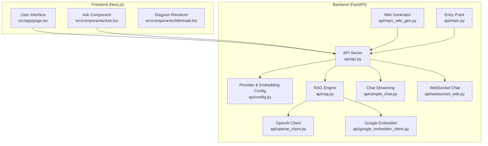
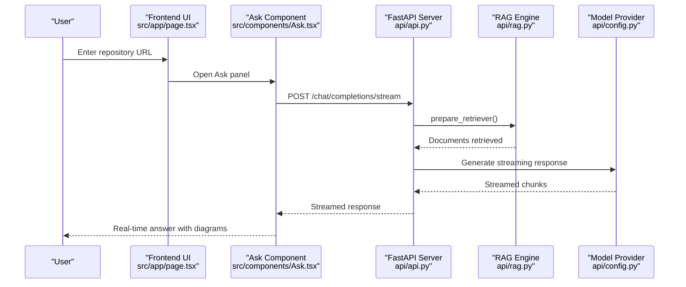
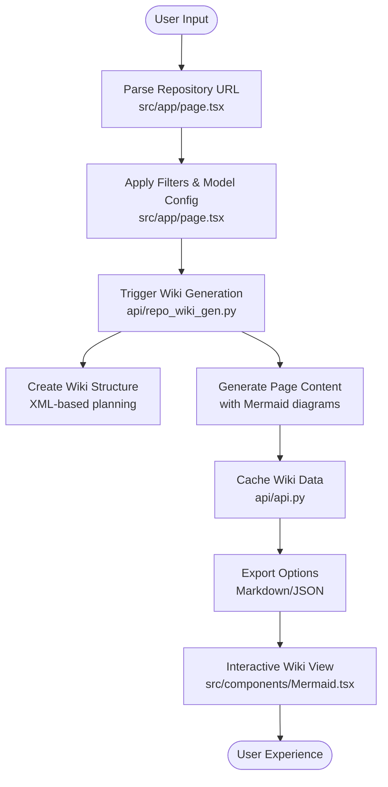
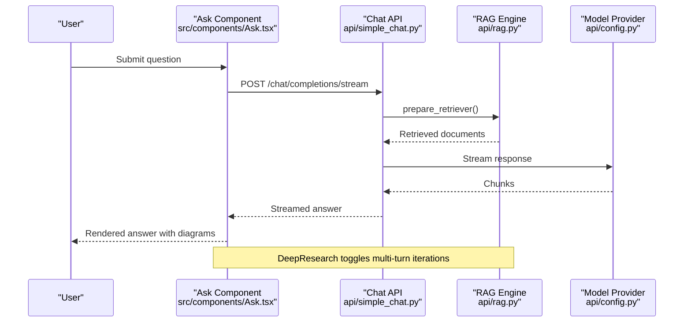
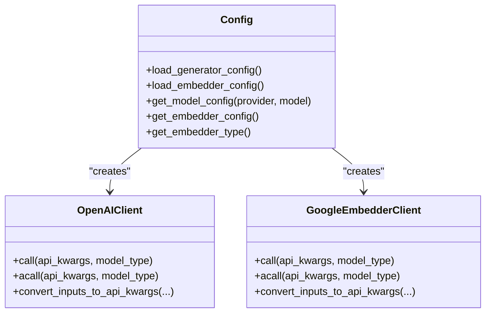
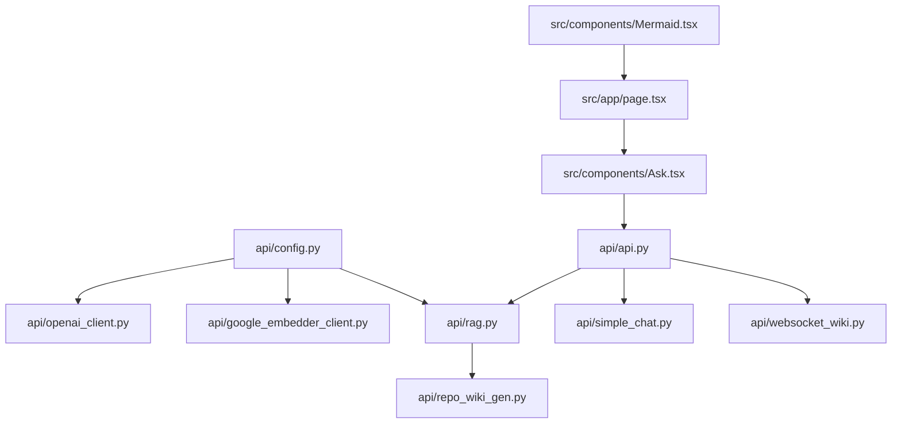

# Core Features and Capabilities

<cite>
**Referenced Files in This Document**
- [README.md](file://README.md)
- [api/main.py](file://api/main.py)
- [api/api.py](file://api/api.py)
- [api/config.py](file://api/config.py)
- [api/openai_client.py](file://api/openai_client.py)
- [api/google_embedder_client.py](file://api/google_embedder_client.py)
- [api/rag.py](file://api/rag.py)
- [api/repo_wiki_gen.py](file://api/repo_wiki_gen.py)
- [api/simple_chat.py](file://api/simple_chat.py)
- [api/websocket_wiki.py](file://api/websocket_wiki.py)
- [src/app/page.tsx](file://src/app/page.tsx)
- [src/components/Ask.tsx](file://src/components/Ask.tsx)
- [src/components/Mermaid.tsx](file://src/components/Mermaid.tsx)
- [src/types/wiki/wikipage.tsx](file://src/types/wiki/wikipage.tsx)
</cite>

## Table of Contents
1. [Introduction](#introduction)
2. [Project Structure](#project-structure)
3. [Core Value Propositions](#core-value-propositions)
4. [Architecture Overview](#architecture-overview)
5. [Detailed Component Analysis](#detailed-component-analysis)
6. [Dependency Analysis](#dependency-analysis)
7. [Performance Considerations](#performance-considerations)
8. [Troubleshooting Guide](#troubleshooting-guide)
9. [Conclusion](#conclusion)

## Introduction
DeepWiki-Open transforms any GitHub, GitLab, or BitBucket repository into a comprehensive, interactive wiki powered by AI. Its core mission is to accelerate developer onboarding and knowledge sharing through instant documentation generation, private repository support, smart AI-powered analysis, beautiful diagram creation, and easy navigation. The platform also enables advanced Q&A via RAG-powered Ask and multi-turn DeepResearch investigations, all while supporting multiple model providers and flexible embedding systems.

## Project Structure
The project follows a clear separation of concerns:
- Backend API (Python/FastAPI): Handles repository processing, RAG, model orchestration, and streaming responses.
- Frontend (Next.js/React): Provides an intuitive UI for repository input, configuration, wiki browsing, and interactive Ask features.
- Configuration-driven model and embedding selection: Enables flexible provider choices and runtime customization.

**Diagram sources**
- [api/api.py](file://api/api.py#L1-L635)
- [api/main.py](file://api/main.py#L1-L104)
- [api/config.py](file://api/config.py#L1-L464)
- [api/rag.py](file://api/rag.py#L1-L446)
- [api/repo_wiki_gen.py](file://api/repo_wiki_gen.py#L1-L550)
- [api/simple_chat.py](file://api/simple_chat.py#L1-L900)
- [api/websocket_wiki.py](file://api/websocket_wiki.py#L1-L978)
- [api/openai_client.py](file://api/openai_client.py#L1-L653)
- [api/google_embedder_client.py](file://api/google_embedder_client.py#L1-L231)
- [src/app/page.tsx](file://src/app/page.tsx#L1-L637)
- [src/components/Ask.tsx](file://src/components/Ask.tsx#L1-L929)
- [src/components/Mermaid.tsx](file://src/components/Mermaid.tsx#L1-L491)

**Section sources**
- [README.md](file://README.md#L247-L267)
- [api/main.py](file://api/main.py#L1-L104)
- [api/api.py](file://api/api.py#L1-L635)

## Core Value Propositions

### Instant Documentation Generation
DeepWiki-Open automates the creation of structured wikis from repository codebases. It analyzes file trees, extracts README content, and generates hierarchical wiki structures with related pages and diagrams. The system supports both comprehensive and concise modes, enabling quick onboarding or deep-dive documentation depending on user needs.

Practical workflow:
- Input repository URL or local path
- Select provider/model and language
- Trigger generation to produce wiki with diagrams and cross-references

**Section sources**
- [README.md](file://README.md#L19-L30)
- [api/repo_wiki_gen.py](file://api/repo_wiki_gen.py#L63-L550)
- [src/app/page.tsx](file://src/app/page.tsx#L255-L401)

### Private Repository Support
DeepWiki-Open securely handles private repositories using personal access tokens. It supports GitHub, GitLab, and BitBucket with configurable authentication, enabling users to process private codebases without exposing credentials server-side.

Implementation highlights:
- Token injection via UI or backend parameters
- Repository type detection and platform-specific headers
- Local path support for offline processing

**Section sources**
- [README.md](file://README.md#L64-L143)
- [api/repo_wiki_gen.py](file://api/repo_wiki_gen.py#L124-L143)
- [src/app/page.tsx](file://src/app/page.tsx#L351-L394)

### Smart AI-Powered Analysis
Powered by Retrieval-Augmented Generation (RAG), DeepWiki-Open retrieves relevant code snippets to ground AI responses. It maintains conversation history, supports multi-turn research, and integrates with multiple model providers for flexible deployment.

Key capabilities:
- Context-aware Q&A with repository-specific code
- Conversation memory with dialog turns
- Multi-provider model orchestration

**Section sources**
- [README.md](file://README.md#L197-L207)
- [api/rag.py](file://api/rag.py#L153-L446)
- [api/simple_chat.py](file://api/simple_chat.py#L76-L130)

### Beautiful Diagram Creation
DeepWiki-Open generates Mermaid diagrams to visualize architecture, data flow, and relationships. The frontend renders diagrams with interactive zoom and full-screen viewing, while the backend enriches wiki content with structured diagrams.

Features:
- Automatic Mermaid diagram generation in wiki pages
- Interactive zoom and fullscreen viewer
- Japanese aesthetic theming and dark mode support

**Section sources**
- [README.md](file://README.md#L23-L25)
- [src/components/Mermaid.tsx](file://src/components/Mermaid.tsx#L1-L491)
- [api/repo_wiki_gen.py](file://api/repo_wiki_gen.py#L226-L261)

### Easy Navigation
The wiki is organized into hierarchical sections and pages with related-page links, enabling seamless exploration. Users can browse generated wikis, download exports, and navigate between pages with confidence.

**Section sources**
- [src/types/wiki/wikipage.tsx](file://src/types/wiki/wikipage.tsx#L1-L13)
- [api/api.py](file://api/api/api.py#L227-L391)

### Ask Feature with RAG-Powered Q&A
The Ask feature enables real-time, context-aware Q&A with the repository. It supports streaming responses, conversation history, and optional file-focused queries. The system automatically augments prompts with relevant code snippets retrieved from the repository’s embeddings.

Capabilities:
- Real-time streaming responses
- Conversation memory across turns
- File-specific context retrieval
- Multi-provider model support

**Section sources**
- [README.md](file://README.md#L654-L678)
- [src/components/Ask.tsx](file://src/components/Ask.tsx#L1-L929)
- [api/simple_chat.py](file://api/simple_chat.py#L76-L800)
- [api/websocket_wiki.py](file://api/websocket_wiki.py#L53-L978)

### DeepResearch Multi-Turn Investigation
DeepResearch extends the Ask feature with a structured multi-turn research process. It plans investigations, iteratively explores topics, and synthesizes conclusions across multiple iterations, maintaining focus on the original query.

Process stages:
- Initial Research Plan
- Iterative Updates (1–4)
- Final Conclusion synthesis

**Section sources**
- [README.md](file://README.md#L665-L677)
- [src/components/Ask.tsx](file://src/components/Ask.tsx#L211-L530)
- [api/simple_chat.py](file://api/simple_chat.py#L23-L28)

### Multiple Model Provider Support
DeepWiki-Open supports a wide range of model providers, enabling deployment flexibility and cost optimization:
- Google Gemini (default)
- OpenAI (including custom endpoints)
- OpenRouter (multi-model access)
- Azure OpenAI
- Ollama (local inference)
- Dashscope, GitHub Copilot, Bedrock (enterprise integrations)

Provider selection is configuration-driven and exposed via the frontend.

**Section sources**
- [README.md](file://README.md#L269-L342)
- [api/config.py](file://api/config.py#L381-L464)
- [api/openai_client.py](file://api/openai_client.py#L120-L653)

### Flexible Embedding System
The embedding system adapts to different providers and use cases:
- OpenAI embeddings (default)
- Google AI embeddings (optimized for Gemini)
- Ollama embeddings (local inference)
- GitHub Copilot embeddings (enterprise)

Embedding selection is controlled via environment variables and configuration files, with automatic validation and error handling.

**Section sources**
- [README.md](file://README.md#L344-L439)
- [api/config.py](file://api/config.py#L183-L275)
- [api/google_embedder_client.py](file://api/google_embedder_client.py#L20-L231)

## Architecture Overview
The system architecture combines a React frontend with a FastAPI backend, orchestrated by a configuration-driven model and embedding subsystem. RAG retrieval augments AI responses, while streaming endpoints deliver real-time results.

**Diagram sources**
- [src/app/page.tsx](file://src/app/page.tsx#L255-L401)
- [src/components/Ask.tsx](file://src/components/Ask.tsx#L532-L627)
- [api/api.py](file://api/api.py#L394-L401)
- [api/simple_chat.py](file://api/simple_chat.py#L76-L130)
- [api/rag.py](file://api/rag.py#L345-L415)
- [api/config.py](file://api/config.py#L381-L464)

## Detailed Component Analysis

### Repository Processing Workflow
End-to-end workflow from input URL to generated wiki with interactive diagrams:

**Diagram sources**
- [src/app/page.tsx](file://src/app/page.tsx#L255-L401)
- [api/repo_wiki_gen.py](file://api/repo_wiki_gen.py#L295-L417)
- [api/api.py](file://api/api.py#L227-L391)
- [src/components/Mermaid.tsx](file://src/components/Mermaid.tsx#L306-L486)

**Section sources**
- [src/app/page.tsx](file://src/app/page.tsx#L255-L401)
- [api/repo_wiki_gen.py](file://api/repo_wiki_gen.py#L295-L417)
- [api/api.py](file://api/api.py#L227-L391)

### Ask and DeepResearch Implementation
The Ask component orchestrates RAG-powered Q&A with optional multi-turn DeepResearch:

**Diagram sources**
- [src/components/Ask.tsx](file://src/components/Ask.tsx#L532-L627)
- [api/simple_chat.py](file://api/simple_chat.py#L76-L130)
- [api/rag.py](file://api/rag.py#L345-L415)
- [api/config.py](file://api/config.py#L381-L464)

**Section sources**
- [src/components/Ask.tsx](file://src/components/Ask.tsx#L1-L929)
- [api/simple_chat.py](file://api/simple_chat.py#L76-L800)
- [api/websocket_wiki.py](file://api/websocket_wiki.py#L53-L978)

### Model Provider and Embedding Configuration
Provider and embedding selection are centralized in configuration files and runtime logic:

**Diagram sources**
- [api/config.py](file://api/config.py#L127-L464)
- [api/openai_client.py](file://api/openai_client.py#L120-L653)
- [api/google_embedder_client.py](file://api/google_embedder_client.py#L20-L231)

**Section sources**
- [api/config.py](file://api/config.py#L127-L464)
- [api/openai_client.py](file://api/openai_client.py#L120-L653)
- [api/google_embedder_client.py](file://api/google_embedder_client.py#L20-L231)

## Dependency Analysis
DeepWiki-Open employs a modular dependency graph that separates concerns across providers, embeddings, and UI components.

**Diagram sources**
- [api/config.py](file://api/config.py#L1-L464)
- [api/openai_client.py](file://api/openai_client.py#L1-L653)
- [api/google_embedder_client.py](file://api/google_embedder_client.py#L1-L231)
- [api/rag.py](file://api/rag.py#L1-L446)
- [api/repo_wiki_gen.py](file://api/repo_wiki_gen.py#L1-L550)
- [src/app/page.tsx](file://src/app/page.tsx#L1-L637)
- [src/components/Ask.tsx](file://src/components/Ask.tsx#L1-L929)
- [api/api.py](file://api/api.py#L1-L635)
- [api/simple_chat.py](file://api/simple_chat.py#L1-L900)
- [api/websocket_wiki.py](file://api/websocket_wiki.py#L1-L978)
- [src/components/Mermaid.tsx](file://src/components/Mermaid.tsx#L1-L491)

**Section sources**
- [api/config.py](file://api/config.py#L1-L464)
- [api/api.py](file://api/api.py#L1-L635)

## Performance Considerations
- Streaming responses reduce latency and improve interactivity for both chat and wiki generation.
- Embedding validation ensures consistent vector sizes, preventing retrieval failures.
- Token counting helps avoid context limit errors by falling back to non-RAG responses when needed.
- Local Ollama embeddings eliminate network latency for on-premises deployments.

[No sources needed since this section provides general guidance]

## Troubleshooting Guide
Common issues and resolutions:
- API key errors: Verify environment variables and provider-specific keys.
- Rate limiting: Use GitHub personal access tokens to increase limits.
- Embedding inconsistencies: Regenerate embeddings when switching providers.
- Token limit errors: Reduce input size or disable RAG augmentation.
- WebSocket connectivity: Ensure CORS is configured and ports are reachable.

**Section sources**
- [README.md](file://README.md#L696-L732)
- [api/main.py](file://api/main.py#L60-L86)
- [api/simple_chat.py](file://api/simple_chat.py#L661-L793)
- [api/websocket_wiki.py](file://api/websocket_wiki.py#L781-L800)

## Conclusion
DeepWiki-Open delivers a powerful, extensible platform for transforming repositories into interactive, AI-enhanced wikis. Its combination of instant documentation generation, private repository support, smart RAG-powered analysis, beautiful diagram creation, and easy navigation makes it an ideal tool for teams seeking to accelerate onboarding and knowledge sharing. With flexible provider and embedding support, robust Q&A capabilities, and comprehensive troubleshooting guidance, it provides both beginner-friendly workflows and advanced customization for experienced developers.