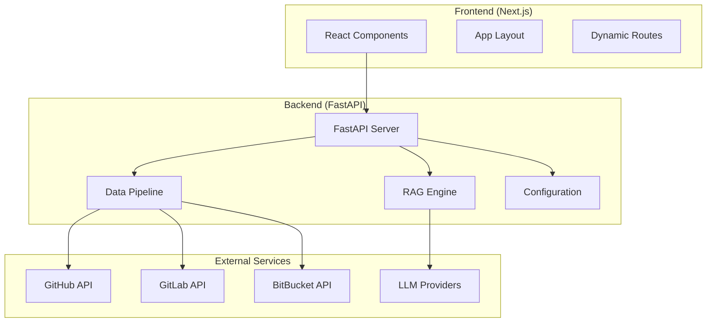
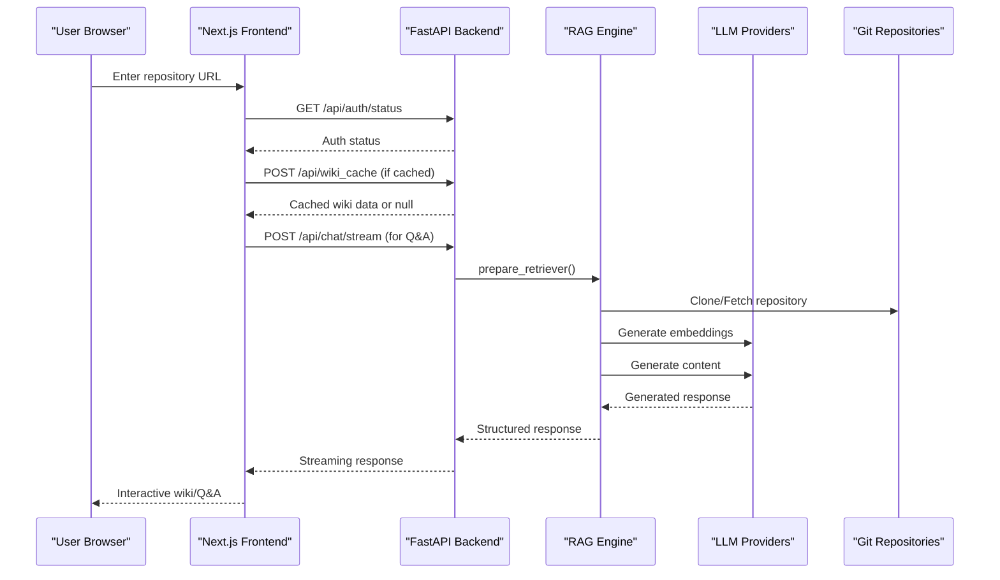
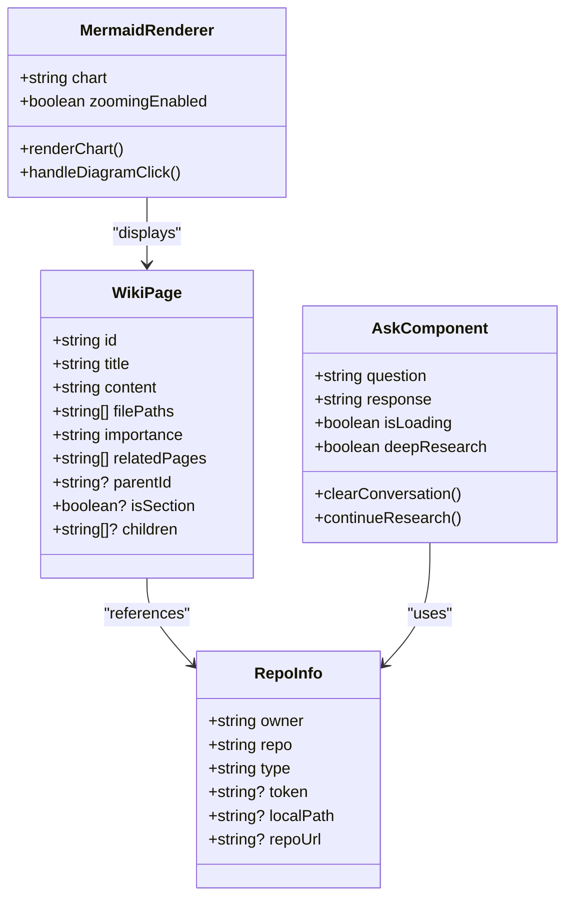
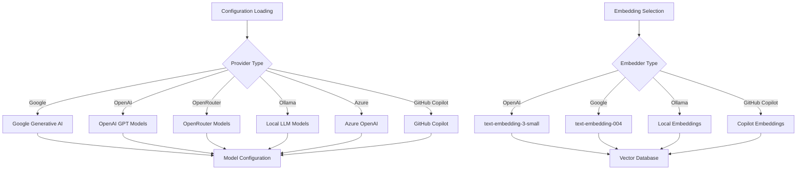
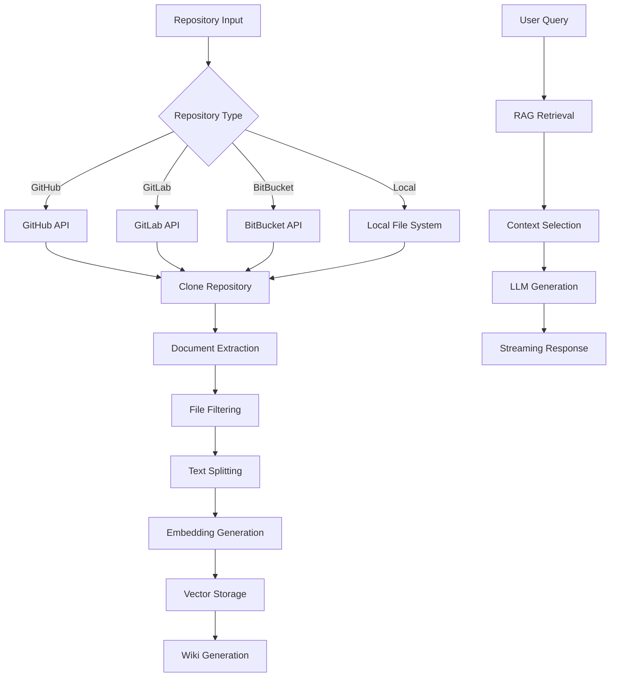

# Project Overview

<cite>
**Referenced Files in This Document**
- [README.md](file://README.md)
- [api/main.py](file://api/main.py)
- [api/api.py](file://api/api.py)
- [api/config.py](file://api/config.py)
- [api/rag.py](file://api/rag.py)
- [api/data_pipeline.py](file://api/data_pipeline.py)
- [api/simple_chat.py](file://api/simple_chat.py)
- [src/app/layout.tsx](file://src/app/layout.tsx)
- [src/app/page.tsx](file://src/app/page.tsx)
- [src/app/[owner]/[repo]/page.tsx](file://src/app/[owner]/[repo]/page.tsx)
- [src/components/Ask.tsx](file://src/components/Ask.tsx)
- [src/components/Mermaid.tsx](file://src/components/Mermaid.tsx)
- [src/types/wiki/wikipage.tsx](file://src/types/wiki/wikipage.tsx)
- [package.json](file://package.json)
</cite>

## Table of Contents
1. [Introduction](#introduction)
2. [Project Structure](#project-structure)
3. [Core Components](#core-components)
4. [Architecture Overview](#architecture-overview)
5. [Detailed Component Analysis](#detailed-component-analysis)
6. [Dependency Analysis](#dependency-analysis)
7. [Performance Considerations](#performance-considerations)
8. [Troubleshooting Guide](#troubleshooting-guide)
9. [Conclusion](#conclusion)

## Introduction
DeepWiki-Open is an AI-powered repository documentation generator that automatically creates interactive wikis for GitHub, GitLab, and BitBucket repositories. It transforms codebases into navigable, diagram-rich knowledge hubs with instant documentation generation, private repository support, smart code analysis, beautiful diagram creation, and RAG-powered Q&A capabilities.

Key value propositions:
- Instant documentation generation for any supported Git hosting platform
- Private repository support via personal access tokens
- Smart code analysis powered by AI
- Beautiful Mermaid diagram creation for architecture and workflows
- Easy navigation through organized wiki structures
- RAG-powered Ask feature for contextual Q&A
- DeepResearch multi-turn investigation process
- Flexible provider ecosystem supporting multiple LLM and embedding providers

## Project Structure
The project follows a modern full-stack architecture with a React/Next.js frontend and a FastAPI backend:



**Diagram sources**
- [src/app/layout.tsx](file://src/app/layout.tsx#L13-L31)
- [api/api.py](file://api/api.py#L20-L33)
- [api/main.py](file://api/main.py#L87-L103)

**Section sources**
- [README.md](file://README.md#L1-L30)
- [package.json](file://package.json#L1-L40)

## Core Components
DeepWiki-Open consists of several interconnected components that work together to provide seamless repository documentation generation:

### Frontend Components
- **Main Application**: Next.js app with dynamic routing for repository pages
- **Wiki Interface**: Interactive wiki viewer with tree navigation and content rendering
- **Ask Component**: Real-time Q&A interface with RAG-powered responses
- **Mermaid Renderer**: Visual diagram display with zoom and fullscreen capabilities
- **Configuration System**: Provider and model selection with persistent settings

### Backend Services
- **FastAPI Server**: RESTful API with streaming capabilities and WebSocket support
- **RAG Engine**: Retrieval-Augmented Generation for contextual Q&A
- **Data Pipeline**: Repository processing, document splitting, and embedding
- **Configuration Manager**: Provider and model configuration management
- **Cache System**: Persistent wiki cache for performance optimization

**Section sources**
- [src/app/page.tsx](file://src/app/page.tsx#L45-L637)
- [api/api.py](file://api/api.py#L167-L226)
- [api/rag.py](file://api/rag.py#L153-L243)

## Architecture Overview
The system implements a client-server architecture with real-time communication:



**Diagram sources**
- [src/app/[owner]/[repo]/page.tsx](file://src/app/[owner]/[repo]/page.tsx#L536-L675)
- [api/simple_chat.py](file://api/simple_chat.py#L76-L130)
- [api/rag.py](file://api/rag.py#L345-L415)

**Section sources**
- [README.md](file://README.md#L197-L246)
- [api/api.py](file://api/api.py#L540-L574)

## Detailed Component Analysis

### Frontend Architecture
The Next.js frontend provides a responsive, internationalized interface with the following key components:



**Diagram sources**
- [src/types/wiki/wikipage.tsx](file://src/types/wiki/wikipage.tsx#L1-L13)
- [src/app/[owner]/[repo]/page.tsx](file://src/app/[owner]/[repo]/page.tsx#L20-L46)
- [src/components/Ask.tsx](file://src/components/Ask.tsx#L36-L54)

### Backend API Design
The FastAPI backend exposes a comprehensive set of endpoints for wiki generation and Q&A:

```mermaid
graph TD
subgraph "API Endpoints"
A[/api/auth/status] --> Status[Authentication Status]
B[/api/auth/validate] --> Validate[Code Validation]
C[/api/models/config] --> Models[Model Configuration]
D[/api/wiki_cache] --> Cache[Cache Management]
E[/api/processed_projects] --> Projects[Processed Projects]
F[/export/wiki] --> Export[Wiki Export]
G[/chat/completions/stream] --> Stream[Streaming Chat]
H[/ws/chat] --> WS[WebSocket Chat]
end
subgraph "RAG Operations"
I[prepare_retriever] --> J[Document Processing]
J --> K[Embedding Generation]
K --> L[Vector Storage]
L --> M[Retrieval]
end
D --> Cache
G --> RAG[RAG Engine]
RAG --> I
```

**Diagram sources**
- [api/api.py](file://api/api.py#L153-L166)
- [api/api.py](file://api/api.py#L461-L503)
- [api/rag.py](file://api/rag.py#L345-L381)

**Section sources**
- [api/api.py](file://api/api.py#L149-L226)
- [src/app/page.tsx](file://src/app/page.tsx#L45-L637)

### Configuration System
The system supports multiple AI providers and embedding models through a flexible configuration system:



**Diagram sources**
- [api/config.py](file://api/config.py#L104-L168)
- [api/config.py](file://api/config.py#L170-L181)
- [api/config.py](file://api/config.py#L381-L463)

**Section sources**
- [api/config.py](file://api/config.py#L1-L464)

### Data Processing Pipeline
The backend implements a sophisticated data pipeline for repository analysis:



**Diagram sources**
- [api/data_pipeline.py](file://api/data_pipeline.py#L103-L173)
- [api/data_pipeline.py](file://api/data_pipeline.py#L177-L406)
- [api/rag.py](file://api/rag.py#L345-L415)

**Section sources**
- [api/data_pipeline.py](file://api/data_pipeline.py#L1-L917)
- [api/rag.py](file://api/rag.py#L1-L446)

## Dependency Analysis
The project maintains clear separation of concerns with well-defined dependencies:

```mermaid
graph TB
subgraph "Frontend Dependencies"
NextJS[next: 15.3.1]
React[react: ^19.0.0]
Mermaid[mermaid: ^11.4.1]
NextIntl[next-intl: ^4.1.0]
NextThemes[next-themes: ^0.4.6]
end
subgraph "Backend Dependencies"
FastAPI[fastapi: *]
Uvicorn[uvicorn: *]
AdalFlow[adalflow: *]
Tiktoken[tiktoken: *]
Requests[requests: *]
end
subgraph "Development Tools"
TypeScript[typescript: ^5]
TailwindCSS[tailwindcss: ^4]
ESLint[@typescript-eslint: ^7]
end
NextJS --> React
React --> Mermaid
FastAPI --> AdalFlow
AdalFlow --> Tiktoken
AdalFlow --> Requests
```

**Diagram sources**
- [package.json](file://package.json#L11-L39)
- [api/main.py](file://api/main.py#L1-L34)

**Section sources**
- [package.json](file://package.json#L1-L40)
- [api/main.py](file://api/main.py#L1-L104)

## Performance Considerations
DeepWiki-Open implements several performance optimizations:

- **Caching Strategy**: Persistent wiki cache to avoid regeneration
- **Streaming Responses**: Real-time content delivery for large repositories
- **Token Limit Management**: Provider-specific token limits for embeddings
- **Lazy Loading**: Dynamic component loading for improved startup times
- **Efficient Embeddings**: Batch processing for OpenAI embeddings, single processing for Ollama
- **Connection Pooling**: Reused connections to external APIs

## Troubleshooting Guide
Common issues and solutions:

### Authentication Problems
- **Rate Limit Errors**: Configure GitHub personal access tokens in the frontend UI
- **Private Repository Access**: Ensure proper token scopes (public_repo for public, repo for private)
- **Provider API Keys**: Verify all required API keys are properly configured

### Performance Issues
- **Slow Wiki Generation**: Check embedding provider configuration and token limits
- **Large Repository Processing**: Use file filters to exclude unnecessary directories
- **Memory Usage**: Monitor embedding batch sizes and document splitting parameters

### Technical Issues
- **WebSocket Failures**: Fall back to HTTP streaming endpoints
- **Diagram Rendering**: Check Mermaid syntax and diagram complexity
- **Cache Corruption**: Clear wiki cache and regenerate content

**Section sources**
- [README.md](file://README.md#L696-L732)
- [api/api.py](file://api/api.py#L504-L539)

## Conclusion
DeepWiki-Open provides a comprehensive solution for automated repository documentation generation. Its modular architecture, flexible provider ecosystem, and rich visualization capabilities make it an invaluable tool for teams seeking to improve codebase discoverability and knowledge sharing. The combination of AI-powered analysis, beautiful diagram generation, and intuitive navigation creates an exceptional developer experience for exploring and understanding complex codebases.

The project's strength lies in its balance between powerful AI capabilities and practical usability, supporting both individual developers and enterprise teams through its flexible configuration system and robust performance optimizations.