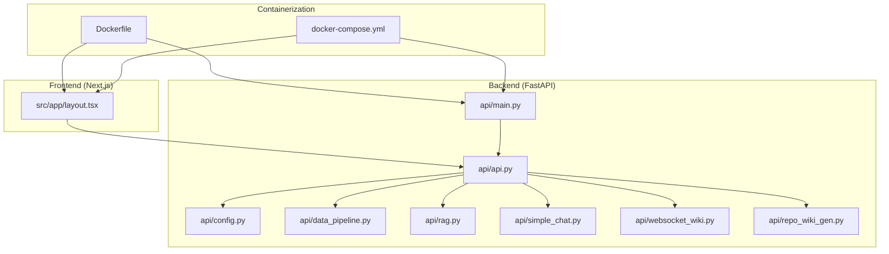
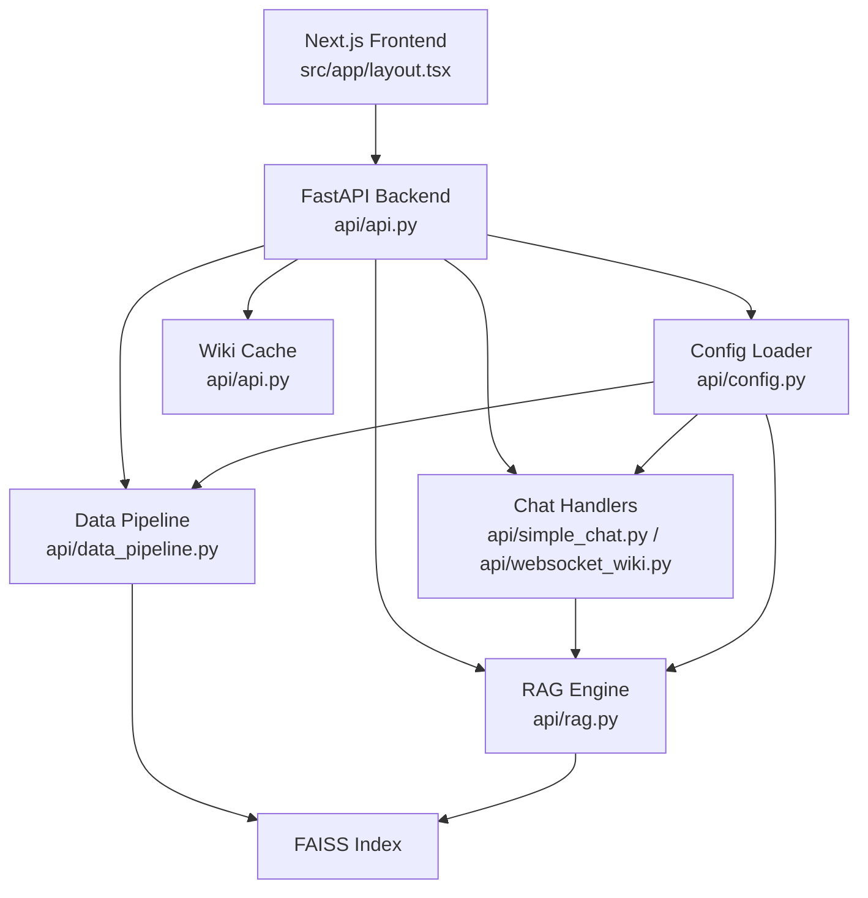
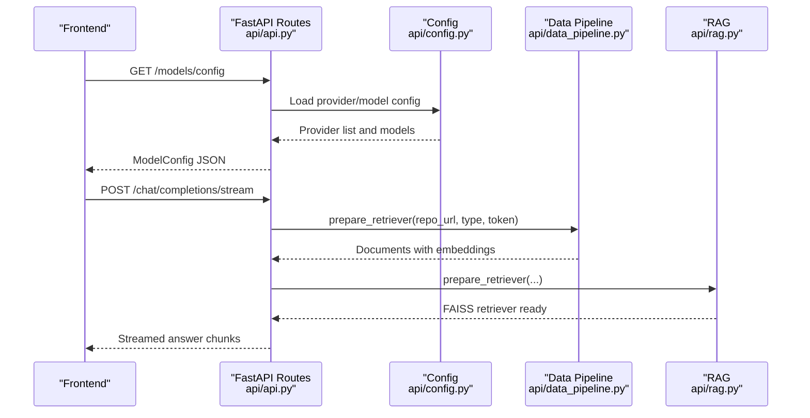
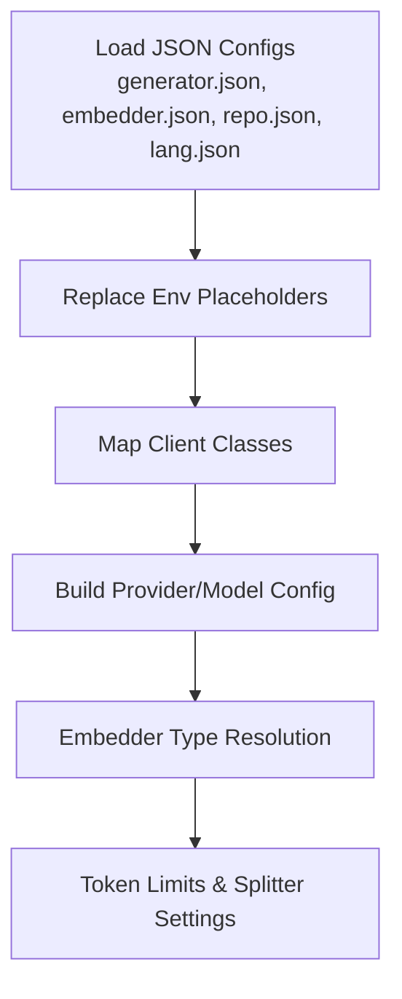
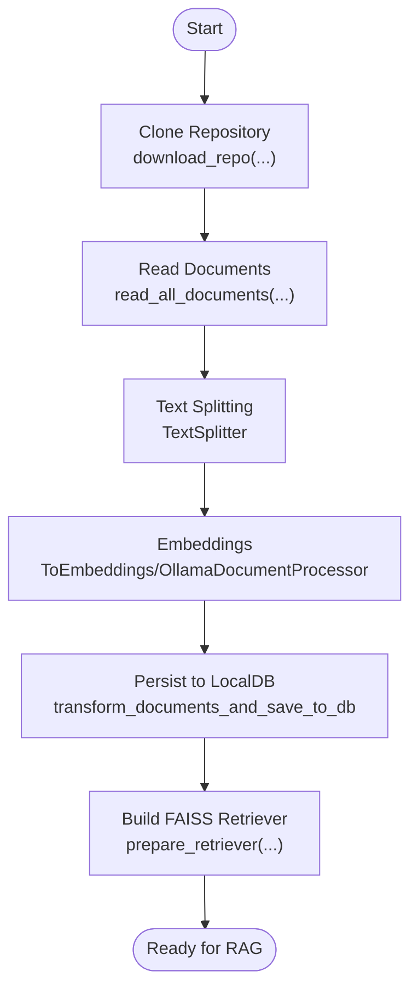
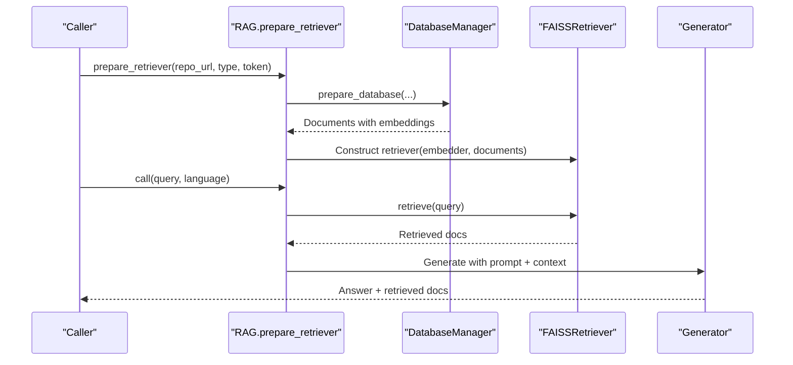
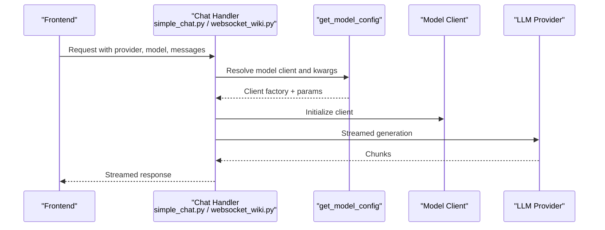
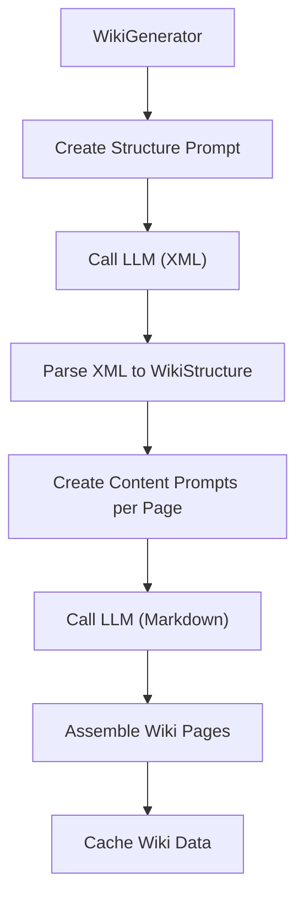
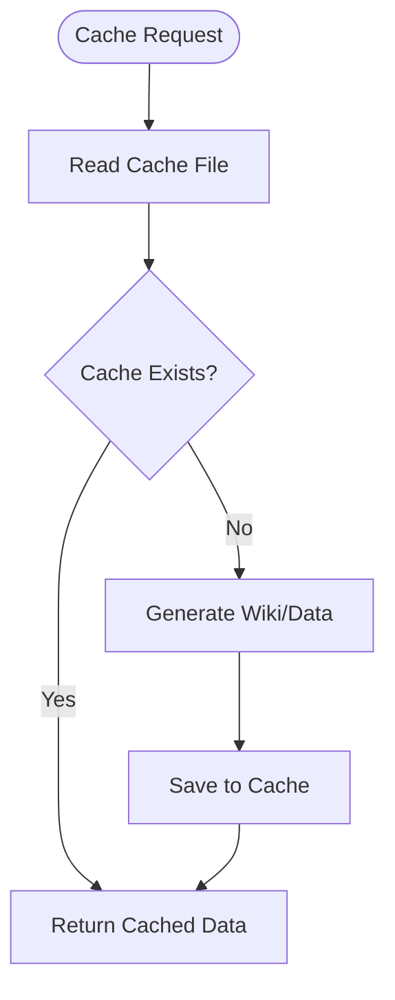
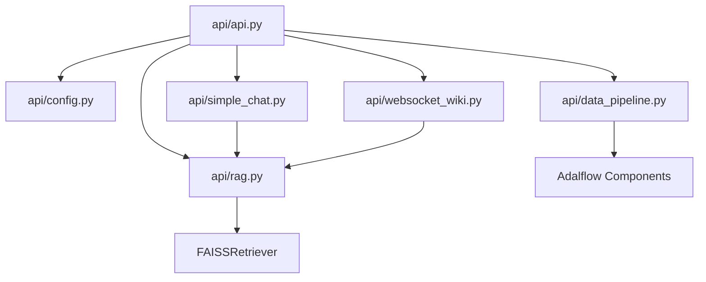

# System Architecture

<cite>
**Referenced Files in This Document**
- [README.md](file://README.md)
- [api/main.py](file://api/main.py)
- [api/api.py](file://api/api.py)
- [api/config.py](file://api/config.py)
- [api/rag.py](file://api/rag.py)
- [api/data_pipeline.py](file://api/data_pipeline.py)
- [api/repo_wiki_gen.py](file://api/repo_wiki_gen.py)
- [api/simple_chat.py](file://api/simple_chat.py)
- [api/websocket_wiki.py](file://api/websocket_wiki.py)
- [Dockerfile](file://Dockerfile)
- [docker-compose.yml](file://docker-compose.yml)
- [src/app/layout.tsx](file://src/app/layout.tsx)
</cite>

## Table of Contents
1. [Introduction](#introduction)
2. [Project Structure](#project-structure)
3. [Core Components](#core-components)
4. [Architecture Overview](#architecture-overview)
5. [Detailed Component Analysis](#detailed-component-analysis)
6. [Dependency Analysis](#dependency-analysis)
7. [Performance Considerations](#performance-considerations)
8. [Troubleshooting Guide](#troubleshooting-guide)
9. [Conclusion](#conclusion)
10. [Appendices](#appendices)

## Introduction
This document describes the system architecture of DeepWiki-Open, focusing on the integration between the React/Next.js frontend and the FastAPI backend. It explains the repository processing pipeline, RAG system integration, AI model provider communication, and cache management. It also covers data flows from repository input through analysis, embedding creation, documentation generation, and wiki organization. The document includes infrastructure requirements, containerization approach with Docker, deployment topology, and cross-cutting concerns such as authentication, authorization, logging, and error handling.

## Project Structure
DeepWiki-Open is organized into:
- api/: FastAPI backend with RAG, data pipeline, model provider clients, and configuration
- src/: Next.js frontend with pages, components, and internationalization
- Dockerfile and docker-compose.yml: Containerization and orchestration
- Top-level README.md: High-level overview, features, setup, and provider integration details

**Diagram sources**
- [src/app/layout.tsx](file://src/app/layout.tsx#L1-L32)
- [api/main.py](file://api/main.py#L1-L104)
- [api/api.py](file://api/api.py#L1-L635)
- [api/config.py](file://api/config.py#L1-L464)
- [api/data_pipeline.py](file://api/data_pipeline.py#L1-L917)
- [api/rag.py](file://api/rag.py#L1-L446)
- [api/simple_chat.py](file://api/simple_chat.py#L1-L900)
- [api/websocket_wiki.py](file://api/websocket_wiki.py#L1-L978)
- [api/repo_wiki_gen.py](file://api/repo_wiki_gen.py#L1-L550)
- [Dockerfile](file://Dockerfile#L1-L171)
- [docker-compose.yml](file://docker-compose.yml#L1-L46)

**Section sources**
- [README.md](file://README.md#L247-L267)
- [Dockerfile](file://Dockerfile#L1-L171)
- [docker-compose.yml](file://docker-compose.yml#L1-L46)

## Core Components
- FastAPI Application: Exposes endpoints for model configuration, chat streaming, wiki cache operations, export, and health checks.
- Configuration System: Centralized provider and embedder configuration loaded from JSON files and environment variables.
- Data Pipeline: Repository cloning, document ingestion, text splitting, embeddings, and FAISS-based retrieval.
- RAG Engine: Integrates retrieval with a Generator to produce grounded answers.
- Chat Services: HTTP streaming and WebSocket handlers for repository Q&A and DeepResearch.
- Wiki Generation Orchestrator: Generates wiki structure and pages using LLMs with configurable providers.
- Cache Layer: File-based cache for wiki structures and pages persisted under ~/.adalflow.
- Containerization: Single-image build serving both backend and frontend with persistent volumes.

**Section sources**
- [api/api.py](file://api/api.py#L1-L635)
- [api/config.py](file://api/config.py#L1-L464)
- [api/data_pipeline.py](file://api/data_pipeline.py#L1-L917)
- [api/rag.py](file://api/rag.py#L1-L446)
- [api/simple_chat.py](file://api/simple_chat.py#L1-L900)
- [api/websocket_wiki.py](file://api/websocket_wiki.py#L1-L978)
- [api/repo_wiki_gen.py](file://api/repo_wiki_gen.py#L1-L550)
- [Dockerfile](file://Dockerfile#L140-L171)

## Architecture Overview
The system follows a client-server pattern:
- The Next.js frontend renders the UI and communicates with the FastAPI backend via HTTP and WebSocket.
- The backend orchestrates repository processing, RAG retrieval, and LLM generation through configurable providers.
- Embeddings are computed using selected embedders and indexed with FAISS for retrieval.
- Generated wiki content is cached server-side for reuse.

**Diagram sources**
- [src/app/layout.tsx](file://src/app/layout.tsx#L1-L32)
- [api/api.py](file://api/api.py#L1-L635)
- [api/config.py](file://api/config.py#L1-L464)
- [api/data_pipeline.py](file://api/data_pipeline.py#L1-L917)
- [api/rag.py](file://api/rag.py#L1-L446)
- [api/simple_chat.py](file://api/simple_chat.py#L1-L900)
- [api/websocket_wiki.py](file://api/websocket_wiki.py#L1-L978)

## Detailed Component Analysis

### FastAPI Application and Endpoints
- Model configuration endpoint returns providers and models based on configuration.
- Chat streaming and WebSocket endpoints accept repository queries with optional file context and RAG augmentation.
- Wiki cache endpoints support listing, storing, and deleting cached wiki data.
- Export endpoint generates downloadable Markdown or JSON exports.
- Health and root endpoints provide service status and dynamic route listings.

**Diagram sources**
- [api/api.py](file://api/api.py#L167-L226)
- [api/api.py](file://api/api.py#L394-L401)
- [api/config.py](file://api/config.py#L381-L464)
- [api/data_pipeline.py](file://api/data_pipeline.py#L737-L800)
- [api/rag.py](file://api/rag.py#L345-L415)

**Section sources**
- [api/api.py](file://api/api.py#L167-L226)
- [api/api.py](file://api/api.py#L394-L401)
- [api/api.py](file://api/api.py#L461-L539)
- [api/api.py](file://api/api.py#L540-L574)

### Configuration-Driven Architecture
- Provider and embedder configurations are loaded from JSON files and environment variables.
- The configuration loader resolves client classes and model parameters per provider.
- Embedder type selection influences token limits, splitter settings, and embedding clients.
- Language configuration defines supported languages and defaults.

**Diagram sources**
- [api/config.py](file://api/config.py#L103-L126)
- [api/config.py](file://api/config.py#L127-L182)
- [api/config.py](file://api/config.py#L183-L275)
- [api/config.py](file://api/config.py#L280-L308)

**Section sources**
- [api/config.py](file://api/config.py#L1-L464)

### Repository Processing Pipeline
- Repository cloning supports GitHub, GitLab, and Bitbucket with optional tokens.
- Document ingestion reads code and documentation files, applies inclusion/exclusion filters, and validates token limits.
- Text splitting and embeddings are performed via a configurable pipeline.
- FAISS retriever is constructed from transformed documents for retrieval.

**Diagram sources**
- [api/data_pipeline.py](file://api/data_pipeline.py#L103-L173)
- [api/data_pipeline.py](file://api/data_pipeline.py#L177-L406)
- [api/data_pipeline.py](file://api/data_pipeline.py#L408-L476)
- [api/rag.py](file://api/rag.py#L345-L415)

**Section sources**
- [api/data_pipeline.py](file://api/data_pipeline.py#L1-L917)
- [api/rag.py](file://api/rag.py#L1-L446)

### RAG System Integration
- RAG integrates a memory component for conversation history, an embedder, and a FAISS retriever.
- Retrieval augments prompts with relevant documents grouped by file path.
- A Generator produces answers using the selected provider and model configuration.

**Diagram sources**
- [api/rag.py](file://api/rag.py#L153-L244)
- [api/rag.py](file://api/rag.py#L246-L415)
- [api/data_pipeline.py](file://api/data_pipeline.py#L737-L800)

**Section sources**
- [api/rag.py](file://api/rag.py#L1-L446)

### AI Model Provider Communication
- The system supports multiple providers (Google, OpenAI, OpenRouter, Azure, Ollama, DashScope, GitHub Copilot, iFlow).
- Provider selection and model parameters are resolved from configuration.
- Streaming responses are handled uniformly across providers, with special handling for large inputs and token limits.

**Diagram sources**
- [api/simple_chat.py](file://api/simple_chat.py#L76-L130)
- [api/simple_chat.py](file://api/simple_chat.py#L330-L522)
- [api/websocket_wiki.py](file://api/websocket_wiki.py#L53-L120)
- [api/websocket_wiki.py](file://api/websocket_wiki.py#L435-L556)
- [api/config.py](file://api/config.py#L381-L464)

**Section sources**
- [api/simple_chat.py](file://api/simple_chat.py#L1-L900)
- [api/websocket_wiki.py](file://api/websocket_wiki.py#L1-L978)
- [api/config.py](file://api/config.py#L1-L464)

### Wiki Generation Orchestration
- The WikiGenerator constructs prompts for structure and content, manages caching keys, and formats file URLs.
- It supports comprehensive and concise wiki modes and parses XML responses for structure.

**Diagram sources**
- [api/repo_wiki_gen.py](file://api/repo_wiki_gen.py#L295-L417)
- [api/repo_wiki_gen.py](file://api/repo_wiki_gen.py#L419-L536)

**Section sources**
- [api/repo_wiki_gen.py](file://api/repo_wiki_gen.py#L1-L550)

### Cache Management
- Wiki cache is stored as JSON files under ~/.adalflow/wikicache with keys derived from repo type, owner, repo, and language.
- Endpoints support listing, storing, and deleting cached wiki data with optional authorization checks.

**Diagram sources**
- [api/api.py](file://api/api.py#L405-L458)
- [api/api.py](file://api/api.py#L461-L539)

**Section sources**
- [api/api.py](file://api/api.py#L405-L539)

### Frontend Integration
- The Next.js app initializes theme and language providers and serves pages and components.
- The layout wraps the application with providers enabling dark/light themes and i18n.

**Section sources**
- [src/app/layout.tsx](file://src/app/layout.tsx#L1-L32)

## Dependency Analysis
- api/api.py depends on api/config.py for provider/model resolution, api/data_pipeline.py for repository processing, and api/rag.py for retrieval.
- api/simple_chat.py and api/websocket_wiki.py depend on api/rag.py and api/config.py for streaming chat and RAG augmentation.
- api/data_pipeline.py depends on adalflow components for text splitting and embeddings.
- api/rag.py depends on FAISSRetriever and adalflow components for retrieval and generation.
- Dockerfile composes the backend and frontend into a single image and exposes ports for API and Next.js.

**Diagram sources**
- [api/api.py](file://api/api.py#L1-L635)
- [api/config.py](file://api/config.py#L1-L464)
- [api/data_pipeline.py](file://api/data_pipeline.py#L1-L917)
- [api/rag.py](file://api/rag.py#L1-L446)
- [api/simple_chat.py](file://api/simple_chat.py#L1-L900)
- [api/websocket_wiki.py](file://api/websocket_wiki.py#L1-L978)

**Section sources**
- [api/api.py](file://api/api.py#L1-L635)
- [Dockerfile](file://Dockerfile#L138-L171)

## Performance Considerations
- Embedding token limits vary by provider; the pipeline enforces limits and skips oversized files to prevent errors.
- FAISS retriever construction validates embedding sizes and filters inconsistent vectors.
- Streaming responses reduce latency for chat and wiki generation.
- Container memory limits are configured in docker-compose to constrain resource usage.

[No sources needed since this section provides general guidance]

## Troubleshooting Guide
- Authentication and Authorization:
  - GitHub token setup is required to avoid rate limits; the UI token input is recommended.
  - Authorization mode can require a secret code for wiki generation.
- API Keys and Providers:
  - Ensure required environment variables are set for selected providers and embedders.
  - For OpenRouter, Azure, and iFlow, verify API keys and endpoints.
- Container and Networking:
  - Ports 8001 (API) and 3000 (Next.js) are exposed; adjust PORT and SERVER_BASE_URL accordingly.
  - Persistent volumes mount ~/.adalflow for caches and logs.
- Logging:
  - Configure LOG_LEVEL and LOG_FILE_PATH; logs are persisted under api/logs.

**Section sources**
- [README.md](file://README.md#L64-L144)
- [README.md](file://README.md#L503-L514)
- [README.md](file://README.md#L441-L476)
- [docker-compose.yml](file://docker-compose.yml#L15-L46)
- [api/main.py](file://api/main.py#L60-L77)

## Conclusion
DeepWiki-Open integrates a robust FastAPI backend with a modern Next.js frontend to deliver repository analysis, RAG-powered Q&A, and wiki generation. Its configuration-driven architecture enables flexible provider and embedder selection, while the data pipeline and FAISS-based retrieval ensure efficient context retrieval. Containerization simplifies deployment and persistence, and comprehensive logging and error handling improve operability.

[No sources needed since this section summarizes without analyzing specific files]

## Appendices

### Technology Stack
- Backend: Python, FastAPI, Uvicorn, Adalflow, FAISS
- Frontend: TypeScript, Next.js, React
- AI Providers: Google, OpenAI, OpenRouter, Azure, Ollama, DashScope, GitHub Copilot, iFlow
- Vector Database: FAISS
- Containerization: Docker, docker-compose

**Section sources**
- [README.md](file://README.md#L28-L30)
- [Dockerfile](file://Dockerfile#L1-L171)
- [docker-compose.yml](file://docker-compose.yml#L1-L46)

### Infrastructure and Deployment
- Single-container deployment serving both API and frontend.
- Persistent volumes for caches, logs, and tokens.
- Health checks and resource limits for stability.

**Section sources**
- [Dockerfile](file://Dockerfile#L140-L171)
- [docker-compose.yml](file://docker-compose.yml#L32-L46)