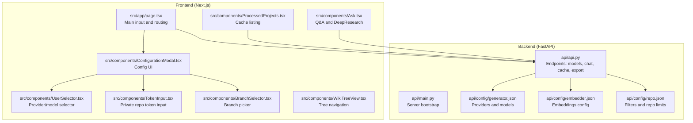
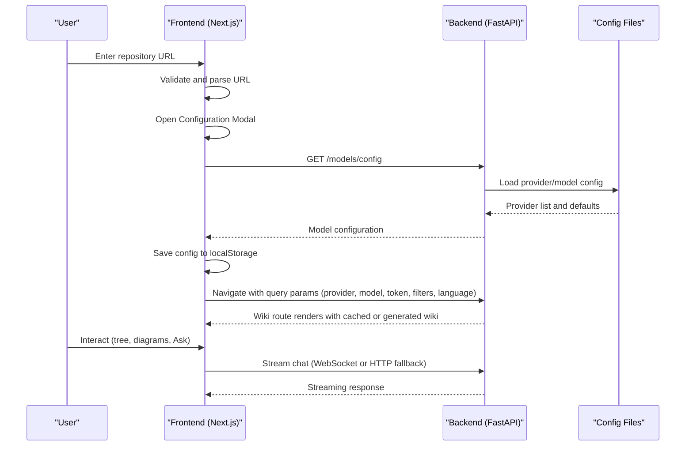
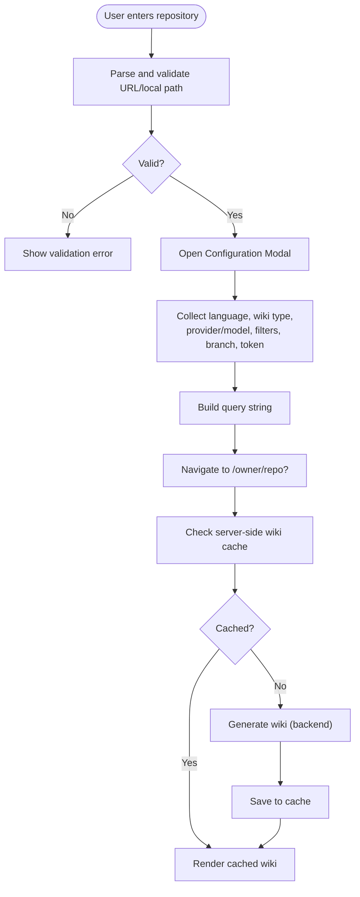
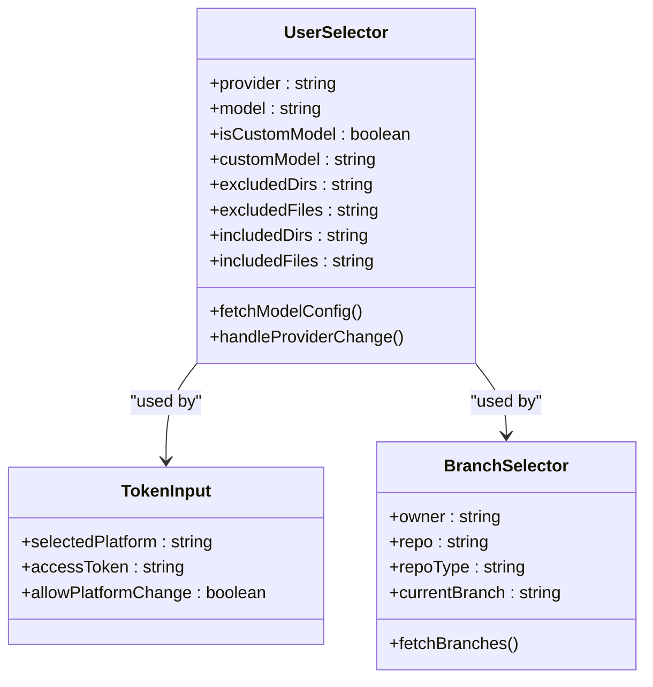
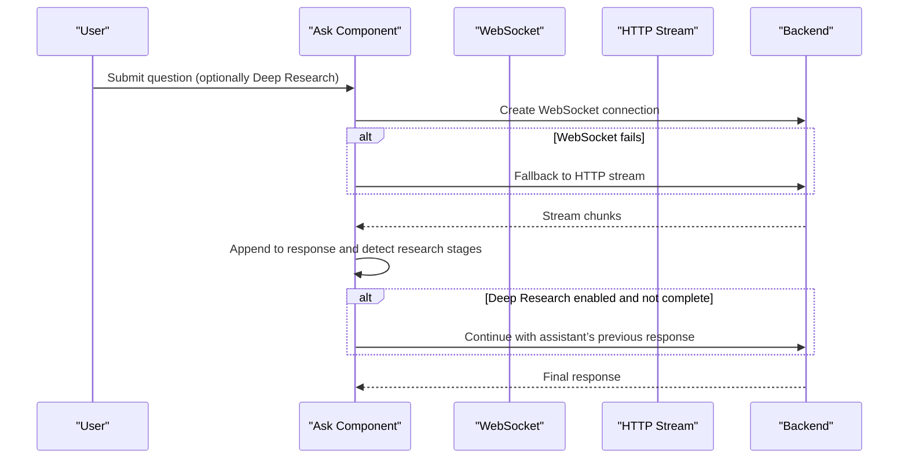
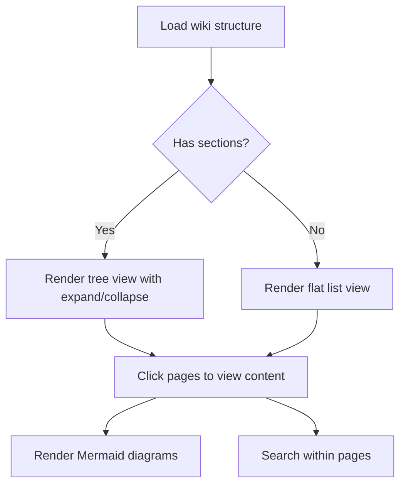
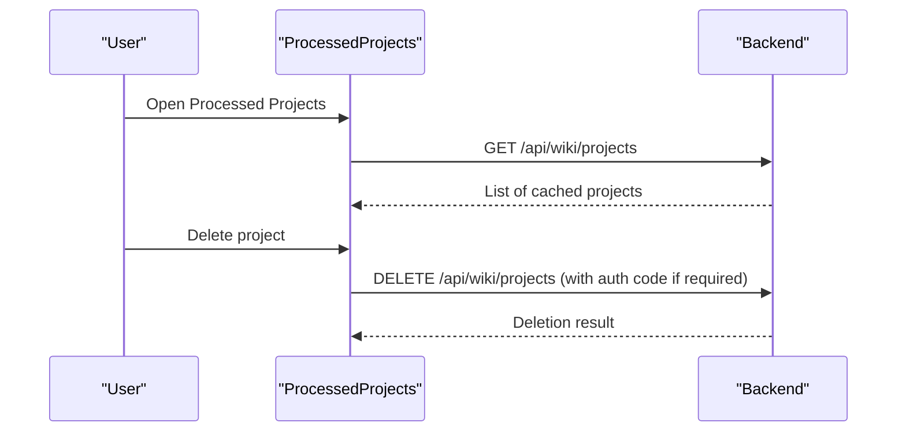
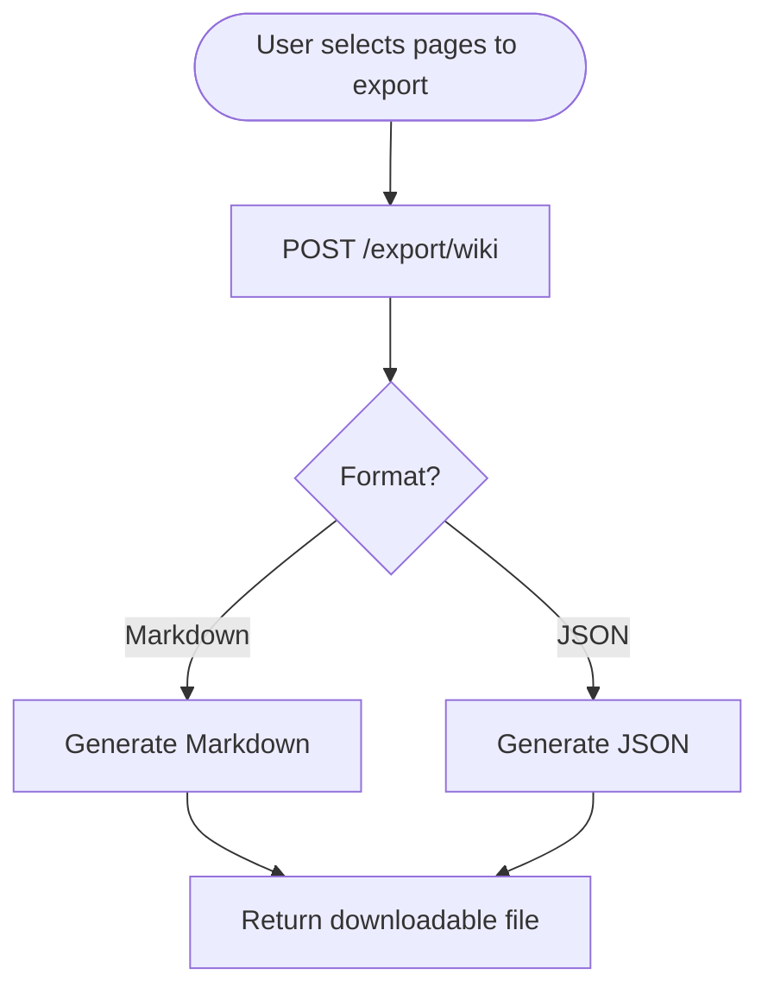
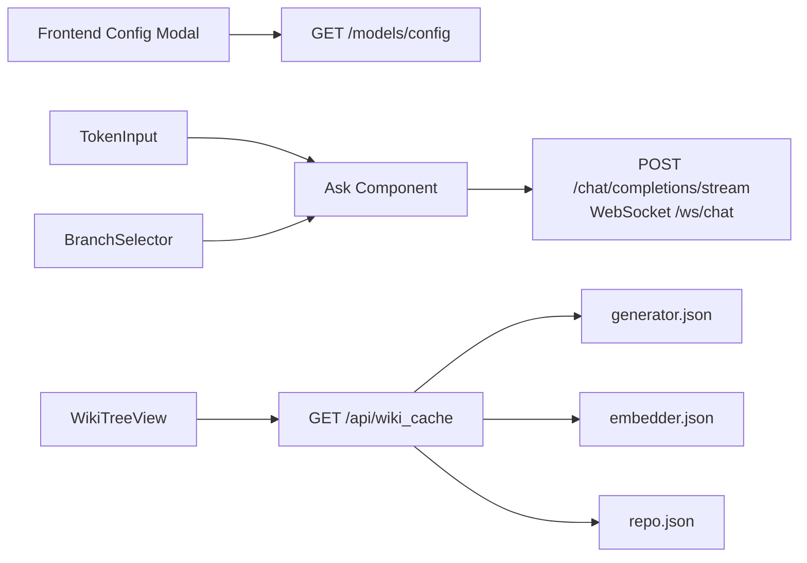

# User Workflows and Usage Patterns

<cite>
**Referenced Files in This Document**
- [README.md](file://README.md)
- [src/app/page.tsx](file://src/app/page.tsx)
- [src/components/ConfigurationModal.tsx](file://src/components/ConfigurationModal.tsx)
- [src/components/UserSelector.tsx](file://src/components/UserSelector.tsx)
- [src/components/TokenInput.tsx](file://src/components/TokenInput.tsx)
- [src/components/BranchSelector.tsx](file://src/components/BranchSelector.tsx)
- [src/components/WikiTreeView.tsx](file://src/components/WikiTreeView.tsx)
- [src/components/Ask.tsx](file://src/components/Ask.tsx)
- [src/app/wiki/projects/page.tsx](file://src/app/wiki/projects/page.tsx)
- [src/hooks/useProcessedProjects.ts](file://src/hooks/useProcessedProjects.ts)
- [src/components/ProcessedProjects.tsx](file://src/components/ProcessedProjects.tsx)
- [api/config/generator.json](file://api/config/generator.json)
- [api/config/embedder.json](file://api/config/embedder.json)
- [api/config/repo.json](file://api/config/repo.json)
- [api/api.py](file://api/api.py)
- [api/main.py](file://api/main.py)
</cite>

## Table of Contents
1. [Introduction](#introduction)
2. [Project Structure](#project-structure)
3. [Core Components](#core-components)
4. [Architecture Overview](#architecture-overview)
5. [Detailed Component Analysis](#detailed-component-analysis)
6. [Dependency Analysis](#dependency-analysis)
7. [Performance Considerations](#performance-considerations)
8. [Troubleshooting Guide](#troubleshooting-guide)
9. [Conclusion](#conclusion)
10. [Appendices](#appendices)

## Introduction
This document explains end-to-end user workflows and usage patterns for DeepWiki-Open. It covers the complete journey from repository input to wiki exploration, including:
- Basic wiki generation workflow
- Advanced configuration options (model selection, file filtering, language preferences)
- Q&A and DeepResearch interaction patterns
- Repository processing from URL entry through private repository authentication
- Wiki viewing experience (tree navigation, diagrams, search)
- Cache management and export functionality
- Troubleshooting common issues
- Guidance tailored for individual developers and enterprise teams

## Project Structure
DeepWiki-Open consists of:
- A Next.js frontend (React) for user interaction and wiki browsing
- A FastAPI backend serving endpoints for model configuration, chat, caching, and exports
- Configuration files controlling model providers, embeddings, and repository filters

**Diagram sources**
- [src/app/page.tsx](file://src/app/page.tsx#L45-L637)
- [src/components/ConfigurationModal.tsx](file://src/components/ConfigurationModal.tsx#L68-L364)
- [src/components/UserSelector.tsx](file://src/components/UserSelector.tsx#L46-L540)
- [src/components/TokenInput.tsx](file://src/components/TokenInput.tsx#L16-L108)
- [src/components/BranchSelector.tsx](file://src/components/BranchSelector.tsx#L22-L236)
- [src/components/WikiTreeView.tsx](file://src/components/WikiTreeView.tsx#L45-L184)
- [src/components/Ask.tsx](file://src/components/Ask.tsx#L46-L929)
- [src/components/ProcessedProjects.tsx](file://src/components/ProcessedProjects.tsx#L25-L271)
- [api/api.py](file://api/api.py#L21-L635)
- [api/main.py](file://api/main.py#L87-L104)
- [api/config/generator.json](file://api/config/generator.json#L1-L101)
- [api/config/embedder.json](file://api/config/embedder.json#L1-L35)
- [api/config/repo.json](file://api/config/repo.json#L1-L129)

**Section sources**
- [README.md](file://README.md#L247-L267)
- [api/main.py](file://api/main.py#L87-L104)
- [api/api.py](file://api/api.py#L21-L635)

## Core Components
- Main input and routing: Parses repository input, validates format, opens configuration modal, and navigates to the wiki route with parameters.
- Configuration modal: Aggregates model/provider selection, language, wiki type, file filters, branch, and access token.
- Provider/model selector: Loads available providers and models from backend configuration and supports custom model toggles.
- Token input: Handles platform selection and secure token entry for private repositories.
- Branch selector: Fetches and displays available branches with platform-specific authentication.
- Wiki tree view: Renders hierarchical wiki structure with expandable sections and page selection.
- Ask and DeepResearch: Real-time Q&A powered by streaming chat and optional multi-turn research.
- Processed projects: Lists cached projects, supports search and deletion, and links to wiki views.

**Section sources**
- [src/app/page.tsx](file://src/app/page.tsx#L180-L401)
- [src/components/ConfigurationModal.tsx](file://src/components/ConfigurationModal.tsx#L68-L364)
- [src/components/UserSelector.tsx](file://src/components/UserSelector.tsx#L82-L123)
- [src/components/TokenInput.tsx](file://src/components/TokenInput.tsx#L16-L108)
- [src/components/BranchSelector.tsx](file://src/components/BranchSelector.tsx#L36-L151)
- [src/components/WikiTreeView.tsx](file://src/components/WikiTreeView.tsx#L45-L184)
- [src/components/Ask.tsx](file://src/components/Ask.tsx#L532-L627)
- [src/components/ProcessedProjects.tsx](file://src/components/ProcessedProjects.tsx#L56-L128)

## Architecture Overview
End-to-end flow from user input to wiki exploration and Q&A.

**Diagram sources**
- [src/app/page.tsx](file://src/app/page.tsx#L255-L401)
- [api/api.py](file://api/api.py#L167-L226)
- [api/config/generator.json](file://api/config/generator.json#L1-L101)
- [src/components/Ask.tsx](file://src/components/Ask.tsx#L532-L627)

## Detailed Component Analysis

### Basic Wiki Generation Workflow
- Input and validation: Accepts owner/repo, URLs, or local paths; extracts owner, repo, type, and cleans .git suffix.
- Configuration modal: Opens to collect language, wiki type, provider/model, file filters, branch, and optional token.
- Parameterization: Encodes parameters into query string and navigates to dynamic route.
- Backend cache and generation: Reads/writes wiki cache; generates wiki content if not cached; returns structure and pages.

**Diagram sources**
- [src/app/page.tsx](file://src/app/page.tsx#L180-L401)
- [api/api.py](file://api/api.py#L461-L539)

**Section sources**
- [src/app/page.tsx](file://src/app/page.tsx#L180-L401)
- [api/api.py](file://api/api.py#L461-L539)

### Advanced Configuration Options
- Model selection: Loads providers and models from backend configuration; supports custom model toggle per provider.
- File filtering: Two modes (exclude/include) with default lists; supports adding custom directories/files.
- Language preference: Dropdown of supported languages; validated against backend config.
- Wiki type: Comprehensive vs concise modes.
- Branch selection: Platform-aware branch listing with retry and fallback behavior.
- Private repository authentication: Platform-specific token input with security note.

**Diagram sources**
- [src/components/UserSelector.tsx](file://src/components/UserSelector.tsx#L46-L540)
- [src/components/TokenInput.tsx](file://src/components/TokenInput.tsx#L16-L108)
- [src/components/BranchSelector.tsx](file://src/components/BranchSelector.tsx#L22-L236)

**Section sources**
- [src/components/UserSelector.tsx](file://src/components/UserSelector.tsx#L82-L123)
- [src/components/ConfigurationModal.tsx](file://src/components/ConfigurationModal.tsx#L276-L339)
- [src/components/TokenInput.tsx](file://src/components/TokenInput.tsx#L16-L108)
- [src/components/BranchSelector.tsx](file://src/components/BranchSelector.tsx#L36-L151)

### Q&A Interaction Patterns (Ask and DeepResearch)
- Ask: Streams responses via WebSocket with HTTP fallback; maintains conversation history; supports model selection.
- DeepResearch: Auto-continues multi-turn research until completion or max iterations; stages rendered with navigation controls; supports downloading responses.

**Diagram sources**
- [src/components/Ask.tsx](file://src/components/Ask.tsx#L532-L627)
- [api/api.py](file://api/api.py#L393-L401)

**Section sources**
- [src/components/Ask.tsx](file://src/components/Ask.tsx#L532-L627)
- [api/api.py](file://api/api.py#L393-L401)

### Wiki Viewing Experience
- Tree navigation: Hierarchical sections with expand/collapse; page importance indicators; selection highlights.
- Diagram rendering: Mermaid diagrams embedded in wiki pages; responsive rendering.
- Search: Within-page search and cross-project search in processed projects list.

**Diagram sources**
- [src/components/WikiTreeView.tsx](file://src/components/WikiTreeView.tsx#L67-L184)

**Section sources**
- [src/components/WikiTreeView.tsx](file://src/components/WikiTreeView.tsx#L45-L184)

### Cache Management Workflow
- Listing processed projects: Scans server-side cache directory and returns entries sorted by recency.
- Deleting caches: Requires authorization code when enabled; deletes matching cache file.
- Local configuration cache: Frontend stores per-repository configuration in localStorage for quick reuse.

**Diagram sources**
- [src/components/ProcessedProjects.tsx](file://src/components/ProcessedProjects.tsx#L56-L128)
- [api/api.py](file://api/api.py#L577-L634)

**Section sources**
- [src/components/ProcessedProjects.tsx](file://src/components/ProcessedProjects.tsx#L56-L128)
- [api/api.py](file://api/api.py#L577-L634)
- [src/hooks/useProcessedProjects.ts](file://src/hooks/useProcessedProjects.ts#L13-L46)

### Export Functionality
- Export wiki pages as Markdown or JSON; filename includes repository name and timestamp; served as downloadable attachments.

**Diagram sources**
- [api/api.py](file://api/api.py#L227-L274)

**Section sources**
- [api/api.py](file://api/api.py#L227-L274)

### Practical Usage Scenarios
- Exploring documentation: Use tree navigation to browse sections and pages; leverage diagrams for architecture understanding.
- Asking repository-specific questions: Use Ask to query code-related questions; enable DeepResearch for multi-step investigations.
- Using DeepResearch: Toggle Deep Research to initiate iterative analysis; navigate research stages; export final conclusions.
- Managing processed projects: Browse cached wikis; search and filter; delete outdated caches.

**Section sources**
- [src/components/WikiTreeView.tsx](file://src/components/WikiTreeView.tsx#L45-L184)
- [src/components/Ask.tsx](file://src/components/Ask.tsx#L532-L627)
- [src/components/ProcessedProjects.tsx](file://src/components/ProcessedProjects.tsx#L56-L128)

## Dependency Analysis
- Frontend depends on backend endpoints for model configuration, chat streaming, and cache operations.
- Backend loads configuration from JSON files to define providers, models, embeddings, and repository filters.
- Private repository access depends on platform-specific headers and tokens.

**Diagram sources**
- [src/components/ConfigurationModal.tsx](file://src/components/ConfigurationModal.tsx#L68-L364)
- [src/components/Ask.tsx](file://src/components/Ask.tsx#L532-L627)
- [api/api.py](file://api/api.py#L167-L226)
- [api/config/generator.json](file://api/config/generator.json#L1-L101)
- [api/config/embedder.json](file://api/config/embedder.json#L1-L35)
- [api/config/repo.json](file://api/config/repo.json#L1-L129)

**Section sources**
- [api/api.py](file://api/api.py#L167-L226)
- [api/config/generator.json](file://api/config/generator.json#L1-L101)
- [api/config/embedder.json](file://api/config/embedder.json#L1-L35)
- [api/config/repo.json](file://api/config/repo.json#L1-L129)

## Performance Considerations
- Streaming chat reduces latency and improves interactivity.
- Server-side caching avoids repeated generation for the same repository/language.
- Embedding and retrieval parameters influence quality and speed; adjust chunk sizes and top-k as needed.
- Large repositories benefit from targeted file filters to reduce processing time.

[No sources needed since this section provides general guidance]

## Troubleshooting Guide
- Rate limiting: Supply a GitHub personal access token via the UI to increase rate limits; verify token scopes and format.
- Authentication failures: Confirm token permissions and platform-specific headers; retry branch fetch with correct token.
- Generation failures: Validate repository URL format; ensure required environment variables are set; check backend logs.
- CORS and connectivity: Ensure API server runs on expected port and origins are allowed.
- Cache issues: Use processed projects page to list/delete caches; verify authorization code when required.

**Section sources**
- [README.md](file://README.md#L64-L143)
- [src/components/BranchSelector.tsx](file://src/components/BranchSelector.tsx#L87-L150)
- [api/api.py](file://api/api.py#L504-L539)

## Conclusion
DeepWiki-Open provides a seamless workflow from repository input to interactive wiki exploration, with robust configuration, Q&A, and research capabilities. Users can tailor model selection, filtering, and language preferences, while leveraging caching and export features for efficient knowledge management.

[No sources needed since this section summarizes without analyzing specific files]

## Appendices

### A. Provider-Based Model Selection System
- Supported providers and models are defined in configuration JSON and loaded at runtime.
- Default provider and models are used when none are specified.

**Section sources**
- [README.md](file://README.md#L269-L342)
- [api/config/generator.json](file://api/config/generator.json#L1-L101)
- [api/api.py](file://api/api.py#L167-L226)

### B. Embeddings and Repository Filters
- Embedding configuration supports multiple providers and batch sizes.
- Repository filters exclude common directories and files by default; can be customized.

**Section sources**
- [README.md](file://README.md#L344-L439)
- [api/config/embedder.json](file://api/config/embedder.json#L1-L35)
- [api/config/repo.json](file://api/config/repo.json#L1-L129)

### C. Authorization Mode
- Optional authorization code requirement for wiki generation and cache deletion; controlled by environment variables.

**Section sources**
- [README.md](file://README.md#L503-L513)
- [api/api.py](file://api/api.py#L153-L165)

### D. Docker and Data Persistence
- Docker images mount persistent volumes for repositories, embeddings, and wiki cache.

**Section sources**
- [README.md](file://README.md#L539-L581)
- [api/api.py](file://api/api.py#L405-L411)