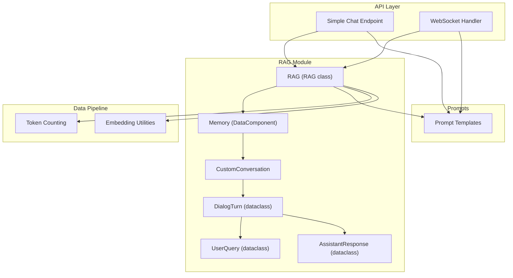
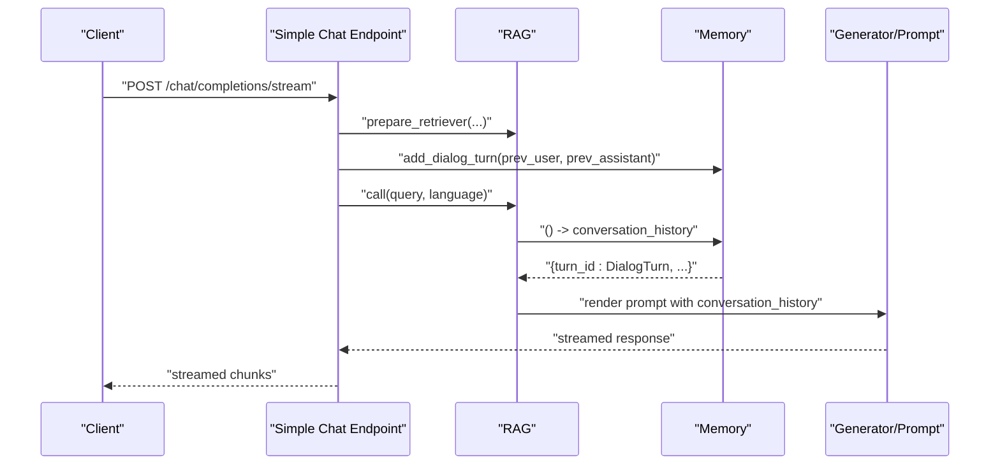
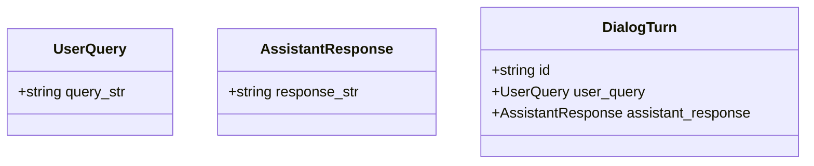
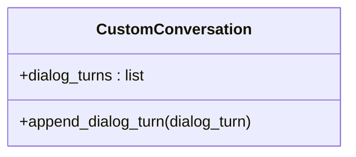
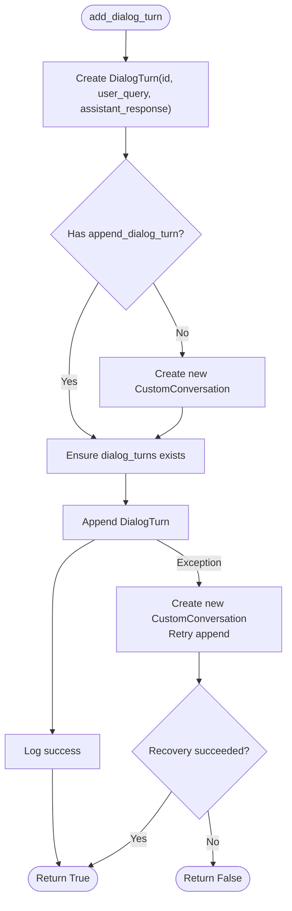
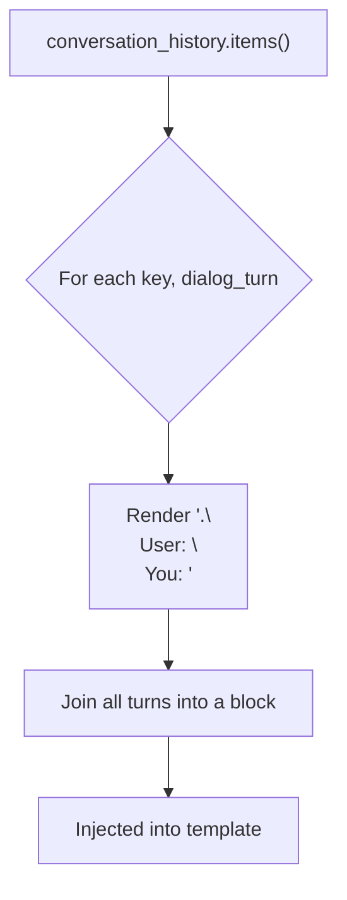
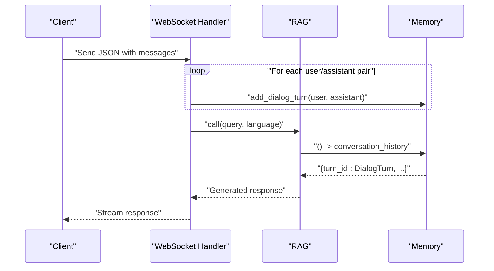
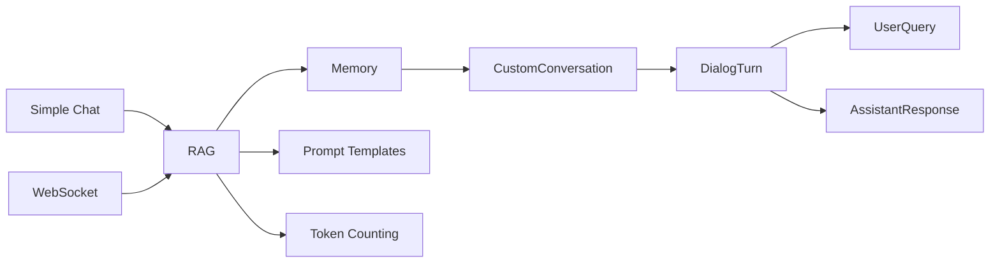

# Conversation Memory Management

<cite>
**Referenced Files in This Document**
- [api/rag.py](file://api/rag.py)
- [api/prompts.py](file://api/prompts.py)
- [api/simple_chat.py](file://api/simple_chat.py)
- [api/websocket_wiki.py](file://api/websocket_wiki.py)
- [api/data_pipeline.py](file://api/data_pipeline.py)
- [api/config.py](file://api/config.py)
</cite>

## Table of Contents
1. [Introduction](#introduction)
2. [Project Structure](#project-structure)
3. [Core Components](#core-components)
4. [Architecture Overview](#architecture-overview)
5. [Detailed Component Analysis](#detailed-component-analysis)
6. [Dependency Analysis](#dependency-analysis)
7. [Performance Considerations](#performance-considerations)
8. [Troubleshooting Guide](#troubleshooting-guide)
9. [Conclusion](#conclusion)
10. [Appendices](#appendices)

## Introduction
This document explains the conversation memory management system in DeepWiki-Open. It focuses on the replacement of the problematic original Conversation class with a robust CustomConversation implementation, the DialogTurn data structure, and the Memory class that manages conversation history. It also covers error handling for conversation state recovery, memory persistence strategies, thread-safety considerations, and practical examples for serialization, multi-turn handling, and debugging. Guidance is provided for optimizing long conversations, preventing memory leaks, and maintaining conversation context across API calls.

## Project Structure
The conversation memory system spans several modules:
- Memory and conversation data structures are defined in the RAG module.
- Prompt templates render conversation history into model inputs.
- API endpoints (HTTP streaming and WebSocket) populate and consume conversation history via the Memory component.
- Data pipeline utilities provide token counting and embedding helpers used in conversation sizing and context management.

**Diagram sources**
- [api/rag.py](file://api/rag.py#L14-L141)
- [api/prompts.py](file://api/prompts.py#L30-L57)
- [api/simple_chat.py](file://api/simple_chat.py#L76-L330)
- [api/websocket_wiki.py](file://api/websocket_wiki.py#L53-L433)
- [api/data_pipeline.py](file://api/data_pipeline.py#L61-L101)

**Section sources**
- [api/rag.py](file://api/rag.py#L14-L141)
- [api/prompts.py](file://api/prompts.py#L30-L57)
- [api/simple_chat.py](file://api/simple_chat.py#L76-L330)
- [api/websocket_wiki.py](file://api/websocket_wiki.py#L53-L433)
- [api/data_pipeline.py](file://api/data_pipeline.py#L61-L101)

## Core Components
- DialogTurn: Encapsulates a single turn with a unique id and nested UserQuery and AssistantResponse.
- UserQuery: Holds the user’s input text.
- AssistantResponse: Holds the assistant’s response text.
- CustomConversation: A minimal, resilient container for dialog turns with a safe append operation.
- Memory: A DataComponent that exposes conversation history as a dictionary keyed by turn id, and provides add_dialog_turn for appending new turns.

Key behaviors:
- DialogTurn.id is generated per turn and used as the key in Memory’s returned dictionary.
- Memory.call() returns a dictionary of turns; it recovers gracefully if the internal state is missing or corrupted.
- Memory.add_dialog_turn() creates a new DialogTurn and appends it safely, with recovery on failure.

**Section sources**
- [api/rag.py](file://api/rag.py#L14-L27)
- [api/rag.py](file://api/rag.py#L28-L39)
- [api/rag.py](file://api/rag.py#L51-L141)

## Architecture Overview
The conversation memory integrates with the RAG pipeline and API endpoints. The RAG component initializes Memory and passes it into the prompt template. API endpoints populate Memory with prior turns before invoking the LLM.

**Diagram sources**
- [api/simple_chat.py](file://api/simple_chat.py#L76-L330)
- [api/rag.py](file://api/rag.py#L190-L243)
- [api/prompts.py](file://api/prompts.py#L30-L57)

## Detailed Component Analysis

### DialogTurn and Supporting Data Structures
DialogTurn is a dataclass that holds:
- id: Unique identifier for the turn.
- user_query: Nested UserQuery containing the user’s text.
- assistant_response: Nested AssistantResponse containing the assistant’s text.

These nested structures ensure clear separation of concerns and enable straightforward serialization and templating.

**Diagram sources**
- [api/rag.py](file://api/rag.py#L14-L27)

**Section sources**
- [api/rag.py](file://api/rag.py#L14-L27)

### CustomConversation
CustomConversation is a lightweight wrapper around a list of dialog turns. Its primary responsibility is to ensure dialog_turns exists and to provide a safe append_dialog_turn method. This guards against attribute initialization issues that could cause “list assignment index out of range” errors.

**Diagram sources**
- [api/rag.py](file://api/rag.py#L28-L39)

**Section sources**
- [api/rag.py](file://api/rag.py#L28-L39)

### Memory
Memory extends a DataComponent and maintains a current_conversation instance of CustomConversation. It provides:
- call(): Returns a dictionary of turns keyed by turn id. It logs and recovers if dialog_turns is missing or empty, and ensures a fresh CustomConversation instance if needed.
- add_dialog_turn(user_query, assistant_response): Creates a new DialogTurn with a UUID id, ensures dialog_turns exists, and appends the turn. On error, it attempts recovery by recreating the conversation and retrying.

**Diagram sources**
- [api/rag.py](file://api/rag.py#L91-L141)

**Section sources**
- [api/rag.py](file://api/rag.py#L51-L141)

### Prompt Rendering of Conversation History
The prompt template iterates over conversation_history and renders each turn with a numeric prefix and alternating user/assistant roles. This enables the model to understand the conversation flow.

**Diagram sources**
- [api/prompts.py](file://api/prompts.py#L35-L44)

**Section sources**
- [api/prompts.py](file://api/prompts.py#L30-L57)

### API Integration and Multi-turn Handling
Both the HTTP streaming and WebSocket handlers:
- Preprocess prior messages to build conversation history by calling Memory.add_dialog_turn for each pair of user and assistant messages.
- Retrieve conversation history via Memory() to inject into the prompt.
- Stream responses back to clients.

**Diagram sources**
- [api/websocket_wiki.py](file://api/websocket_wiki.py#L134-L433)
- [api/simple_chat.py](file://api/simple_chat.py#L139-L330)

**Section sources**
- [api/websocket_wiki.py](file://api/websocket_wiki.py#L134-L433)
- [api/simple_chat.py](file://api/simple_chat.py#L139-L330)

## Dependency Analysis
- Memory depends on CustomConversation and DialogTurn dataclasses.
- RAG composes Memory and uses it to render conversation_history into the prompt template.
- API endpoints depend on RAG and thus indirectly on Memory.
- Token counting utilities support conversation sizing and context trimming decisions.

**Diagram sources**
- [api/rag.py](file://api/rag.py#L14-L141)
- [api/prompts.py](file://api/prompts.py#L30-L57)
- [api/simple_chat.py](file://api/simple_chat.py#L76-L330)
- [api/websocket_wiki.py](file://api/websocket_wiki.py#L53-L433)
- [api/data_pipeline.py](file://api/data_pipeline.py#L61-L101)

**Section sources**
- [api/rag.py](file://api/rag.py#L14-L141)
- [api/prompts.py](file://api/prompts.py#L30-L57)
- [api/simple_chat.py](file://api/simple_chat.py#L76-L330)
- [api/websocket_wiki.py](file://api/websocket_wiki.py#L53-L433)
- [api/data_pipeline.py](file://api/data_pipeline.py#L61-L101)

## Performance Considerations
- Turn storage overhead: Each DialogTurn stores two strings and a UUID. For long conversations, consider limiting the number of stored turns or periodically pruning older turns.
- Token budgeting: Use token counting to estimate prompt size before adding context. If approaching provider limits, truncate or skip older turns.
- Streaming vs. batching: Streaming responses reduce latency and memory pressure compared to buffering entire responses.
- Embedding consistency: Ensure consistent embedding sizes to avoid expensive retries and reprocessing.

Practical tips:
- Periodically trim conversation_history to keep the most recent N turns.
- Monitor token counts and warn when approaching thresholds.
- Use provider-specific token limits to guide context selection.

[No sources needed since this section provides general guidance]

## Troubleshooting Guide
Common issues and recovery strategies:
- Missing dialog_turns attribute: Memory.call() detects absence and initializes an empty list, then logs and continues.
- Empty dialog_turns list: Memory logs that the list exists but is empty and proceeds.
- Invalid turn objects: Memory skips turns without ids and logs warnings.
- Runtime errors during add_dialog_turn: Memory attempts to recreate CustomConversation and retry; if both fail, it returns False.

Debugging steps:
- Enable logging to inspect Memory logs for recovery actions.
- Verify that each turn has a non-null id before rendering prompts.
- Confirm that API endpoints call Memory.add_dialog_turn for every prior user/assistant pair.

**Section sources**
- [api/rag.py](file://api/rag.py#L59-L89)
- [api/rag.py](file://api/rag.py#L126-L141)

## Conclusion
The conversation memory system replaces a fragile Conversation class with a resilient CustomConversation and a robust Memory component. Together with clear data structures (DialogTurn, UserQuery, AssistantResponse) and careful prompt rendering, they enable reliable multi-turn conversations. The system includes built-in error recovery, graceful degradation, and straightforward integration with HTTP and WebSocket endpoints. By combining these components with token-aware context management, teams can maintain coherent, efficient, and scalable conversational experiences.

[No sources needed since this section summarizes without analyzing specific files]

## Appendices

### Practical Examples

- Serialization of conversation state:
  - Memory.call() returns a dictionary keyed by turn id. This structure is suitable for JSON serialization and can be persisted or transmitted as needed.
  - Example path: [Memory.call()](file://api/rag.py#L59-L89)

- Multi-turn conversation handling:
  - API endpoints iterate over prior messages and call Memory.add_dialog_turn for each user/assistant pair before generating a response.
  - Example paths:
    - [Simple Chat preprocessing](file://api/simple_chat.py#L139-L150)
    - [WebSocket preprocessing](file://api/websocket_wiki.py#L134-L144)

- Debugging conversation-related issues:
  - Inspect Memory logs for recovery actions and warnings about invalid turns.
  - Validate that each turn has a non-null id before rendering prompts.
  - Example paths:
    - [Memory.call() logging and recovery](file://api/rag.py#L59-L89)
    - [Prompt rendering loop](file://api/prompts.py#L35-L44)

- Thread-safety considerations:
  - Memory is used per-request within endpoint handlers. Since each request constructs its own RAG instance and uses its own Memory, there is no cross-request sharing by default. If you introduce shared Memory across threads, synchronize access or use thread-local instances.

- Persistence strategies:
  - Persist Memory.call() output (dictionary of turns) to external storage (e.g., JSON files, databases) keyed by session or user identifiers. Restore by reconstructing CustomConversation and repopulating dialog_turns from persisted data.

- Maintaining context across API calls:
  - For stateless APIs, pass conversation_history with each request payload and rebuild Memory on each call.
  - For stateful APIs, maintain Memory per session and reuse across calls within that session.

[No sources needed since this section aggregates guidance without quoting specific code]