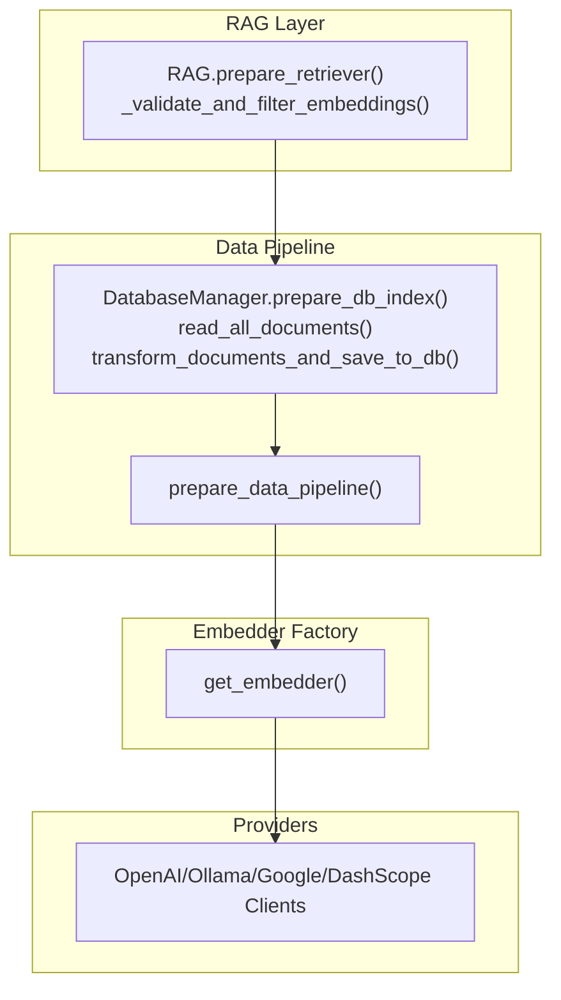
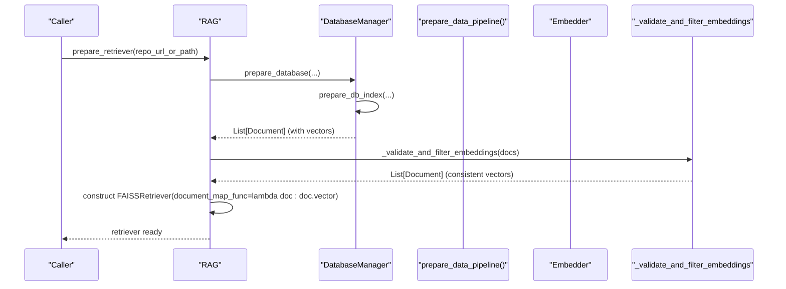
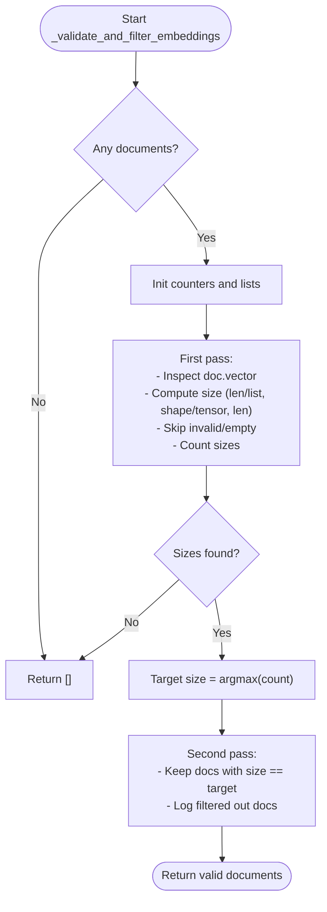
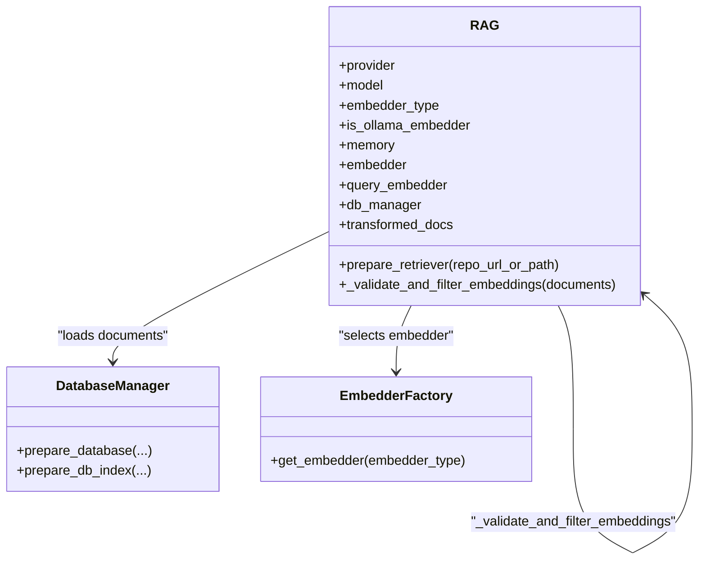
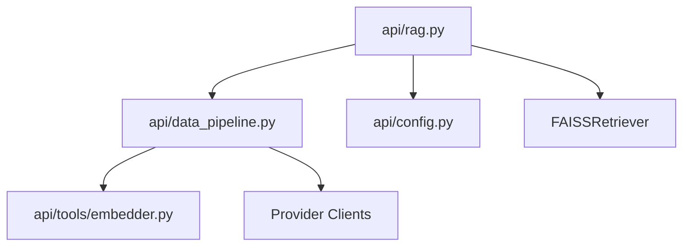

# Embedding Validation and Filtering

<cite>
**Referenced Files in This Document**
- [rag.py](file://api/rag.py)
- [data_pipeline.py](file://api/data_pipeline.py)
- [embedder.py](file://api/tools/embedder.py)
- [config.py](file://api/config.py)
- [dashscope_client.py](file://api/dashscope_client.py)
- [ollama_patch.py](file://api/ollama_patch.py)
- [test_all_embedders.py](file://tests/unit/test_all_embedders.py)
</cite>

## Table of Contents
1. [Introduction](#introduction)
2. [Project Structure](#project-structure)
3. [Core Components](#core-components)
4. [Architecture Overview](#architecture-overview)
5. [Detailed Component Analysis](#detailed-component-analysis)
6. [Dependency Analysis](#dependency-analysis)
7. [Performance Considerations](#performance-considerations)
8. [Troubleshooting Guide](#troubleshooting-guide)
9. [Conclusion](#conclusion)

## Introduction
This document explains the embedding validation and filtering system used by DeepWiki-Open’s Retrieval-Augmented Generation (RAG) pipeline. It focuses on the _validate_and_filter_embeddings method that ensures consistent embedding dimensions across all documents, details the two-pass validation algorithm, and describes error handling and recovery mechanisms for malformed or mismatched vectors. Practical examples, troubleshooting steps, and performance considerations for large-scale deployments are included, along with best practices for maintaining embedding consistency in distributed environments.

## Project Structure
The embedding validation and filtering logic is primarily implemented in the RAG module and integrated with the data pipeline and embedder factory. Supporting components include configuration resolution, provider-specific embedder clients, and Ollama-specific validation.

**Diagram sources**
- [rag.py](file://api/rag.py#L345-L415)
- [data_pipeline.py](file://api/data_pipeline.py#L851-L902)
- [embedder.py](file://api/tools/embedder.py#L6-L58)

**Section sources**
- [rag.py](file://api/rag.py#L345-L415)
- [data_pipeline.py](file://api/data_pipeline.py#L851-L902)
- [embedder.py](file://api/tools/embedder.py#L6-L58)

## Core Components
- RAG._validate_and_filter_embeddings: Validates and filters documents to ensure all embeddings have consistent dimensions. Implements a two-pass algorithm to identify the dominant embedding size and filter out mismatches.
- DatabaseManager.prepare_db_index: Loads or builds a LocalDB of transformed documents, then delegates to RAG for validation.
- prepare_data_pipeline: Builds a sequential pipeline that splits text and generates embeddings, with provider-specific batching and processing.
- get_embedder: Factory that selects and constructs the appropriate embedder client based on configuration and environment.

Key responsibilities:
- Validate embedding shapes and types
- Detect and recover from malformed vectors
- Filter out inconsistent embeddings
- Support multiple providers with distinct tokenization and batch semantics

**Section sources**
- [rag.py](file://api/rag.py#L251-L343)
- [rag.py](file://api/rag.py#L345-L415)
- [data_pipeline.py](file://api/data_pipeline.py#L408-L450)
- [embedder.py](file://api/tools/embedder.py#L6-L58)

## Architecture Overview
The embedding validation sits at the boundary between data ingestion and retrieval. After documents are embedded and persisted, the RAG component validates that all vectors share the same dimensionality before constructing the retriever.

**Diagram sources**
- [rag.py](file://api/rag.py#L345-L415)
- [data_pipeline.py](file://api/data_pipeline.py#L851-L902)

## Detailed Component Analysis

### Two-Pass Validation Algorithm
The _validate_and_filter_embeddings method performs:
- Pass 1: Scan all documents to collect embedding sizes and their counts, logging warnings for invalid or empty vectors.
- Pass 2: Select the most frequent size as the target and keep only documents whose vectors match the target size.

**Diagram sources**
- [rag.py](file://api/rag.py#L251-L343)

**Section sources**
- [rag.py](file://api/rag.py#L251-L343)

### Embedding Size Analysis and Recovery
- Vector shape detection supports:
  - Python lists: length as size
  - NumPy arrays/tensors: last dimension or first dimension for 1-D arrays
  - Objects with __len__: length fallback
- Invalid or empty vectors are skipped with warnings.
- If no valid vectors remain, the method returns an empty list and logs an error.
- On retriever construction failure due to inconsistent sizes, the code logs sample sizes for debugging.

Practical recovery mechanisms:
- Skip malformed entries
- Filter to the dominant size
- Raise a clear ValueError if no valid documents remain after filtering

**Section sources**
- [rag.py](file://api/rag.py#L251-L343)
- [rag.py](file://api/rag.py#L382-L414)

### Provider-Specific Embedding Behavior
- OpenAI/Google embedders: Batch processing via ToEmbeddings with configurable batch_size.
- Ollama embedder: Single-string processing enforced for queries; separate OllamaDocumentProcessor used for document embedding.
- DashScope: Batch size constrained to 25; empty vectors are generated for missing results.

These differences influence how embeddings are produced and validated, particularly around batch sizes and vector shapes.

**Section sources**
- [data_pipeline.py](file://api/data_pipeline.py#L436-L450)
- [dashscope_client.py](file://api/dashscope_client.py#L726-L800)
- [ollama_patch.py](file://api/ollama_patch.py#L75-L90)

### Integration with RAG Initialization and Retrieval
- RAG initializes the embedder based on configuration and provider.
- For Ollama, a single-string query embedder wrapper is used to ensure consistent input handling.
- After preparing documents, RAG validates embeddings and constructs a FAISSRetriever using document_map_func=lambda doc: doc.vector.

**Diagram sources**
- [rag.py](file://api/rag.py#L153-L243)
- [rag.py](file://api/rag.py#L251-L343)
- [data_pipeline.py](file://api/data_pipeline.py#L737-L902)
- [embedder.py](file://api/tools/embedder.py#L6-L58)

**Section sources**
- [rag.py](file://api/rag.py#L153-L243)
- [rag.py](file://api/rag.py#L251-L343)
- [data_pipeline.py](file://api/data_pipeline.py#L737-L902)
- [embedder.py](file://api/tools/embedder.py#L6-L58)

## Dependency Analysis
- RAG depends on:
  - DatabaseManager for document loading and transformation
  - Embedder factory for provider-specific clients
  - FAISSRetriever for similarity search
- Data pipeline depends on:
  - TextSplitter and ToEmbeddings/DocumentProcessor
  - Provider clients for actual embedding generation
- Configuration drives embedder selection and model parameters.

**Diagram sources**
- [rag.py](file://api/rag.py#L10-L43)
- [data_pipeline.py](file://api/data_pipeline.py#L1-L25)
- [config.py](file://api/config.py#L1-L40)

**Section sources**
- [rag.py](file://api/rag.py#L10-L43)
- [data_pipeline.py](file://api/data_pipeline.py#L1-L25)
- [config.py](file://api/config.py#L1-L40)

## Performance Considerations
- Two-pass validation cost scales linearly with the number of documents. For very large corpora, consider:
  - Early termination if a majority consensus is reached quickly
  - Parallel size extraction with bounded concurrency
  - Pre-filtering documents with clearly invalid vectors
- Batch embedding sizes vary by provider:
  - DashScope caps batch size at 25
  - OpenAI/Google defaults often allow larger batches
  - Ollama uses single-string processing for queries
- Tokenization thresholds differ by provider; ensure pre-splitting respects provider limits to avoid partial or truncated embeddings.

[No sources needed since this section provides general guidance]

## Troubleshooting Guide
Common embedding validation failures and resolutions:
- No valid embeddings found:
  - Cause: All documents have None, empty, or invalid vector types.
  - Action: Verify embedder configuration and client availability; re-run embedding pipeline.
- Mixed embedding sizes:
  - Symptom: Warning about incorrect sizes; filtered documents.
  - Action: Confirm consistent model and parameters across the corpus; re-embed with fixed settings.
- Empty or malformed vectors:
  - Symptom: Warnings for invalid vector type or zero-length vectors.
  - Action: Inspect preprocessing and splitting logic; ensure Document.text is populated and token limits are respected.
- Retriever creation error mentioning inconsistent sizes:
  - Symptom: Error indicating all embeddings should be the same size.
  - Action: Review logs from the validation step; confirm target size and examine sample sizes for discrepancies.

Recovery mechanisms:
- The validation method returns an empty list when no valid documents remain; the caller raises a ValueError to prevent silent failure.
- During retriever construction, the code logs sample sizes to aid debugging.

**Section sources**
- [rag.py](file://api/rag.py#L251-L343)
- [rag.py](file://api/rag.py#L382-L414)

## Conclusion
DeepWiki-Open’s embedding validation system enforces consistent vector dimensions through a robust two-pass algorithm, resilient error handling, and provider-aware processing. By validating early and filtering out mismatched vectors, the system maintains retriever integrity and improves downstream retrieval quality. For large-scale deployments, tune batch sizes per provider, monitor tokenization thresholds, and leverage the logging signals to diagnose and resolve embedding inconsistencies efficiently.