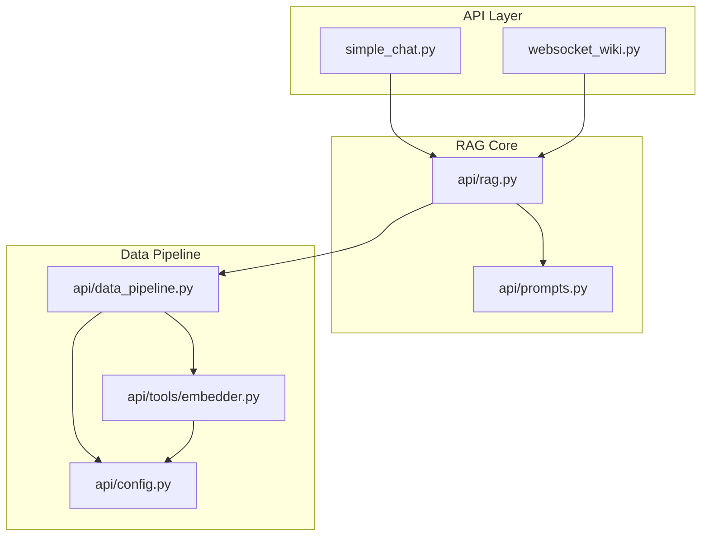
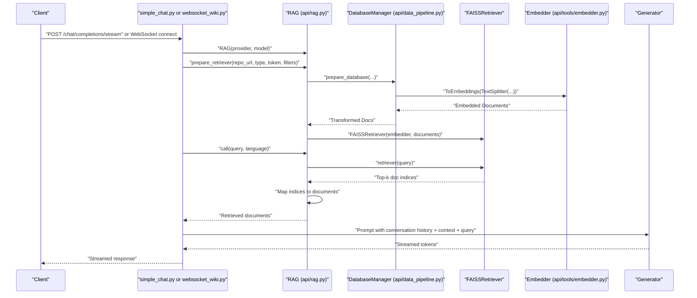
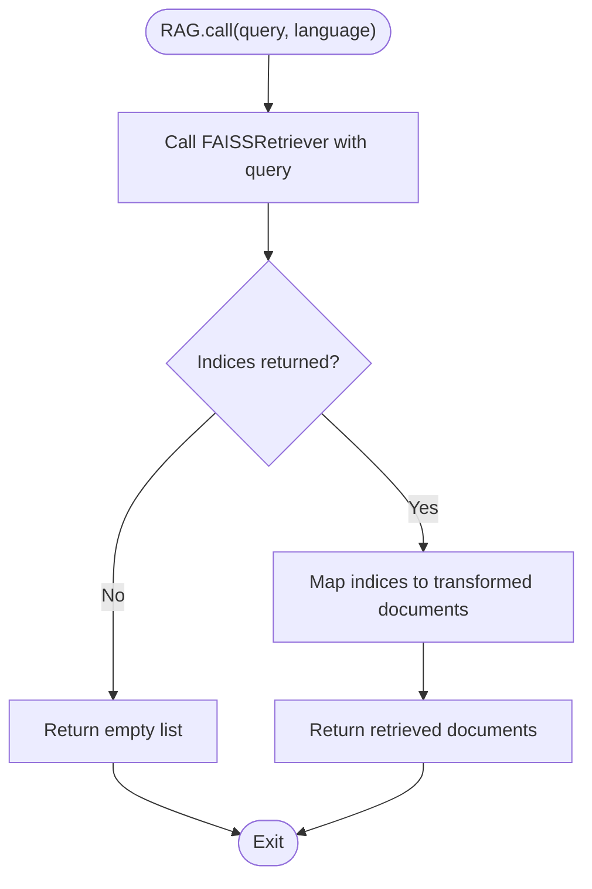
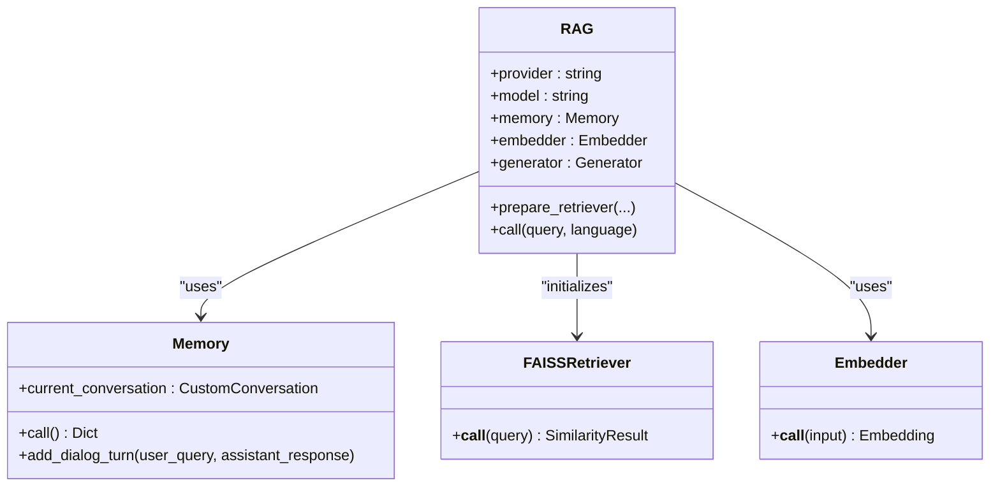
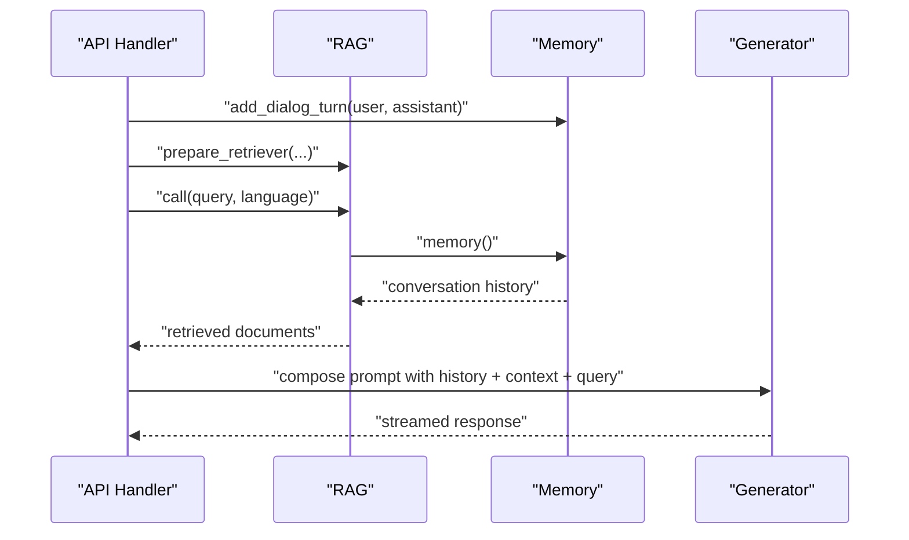
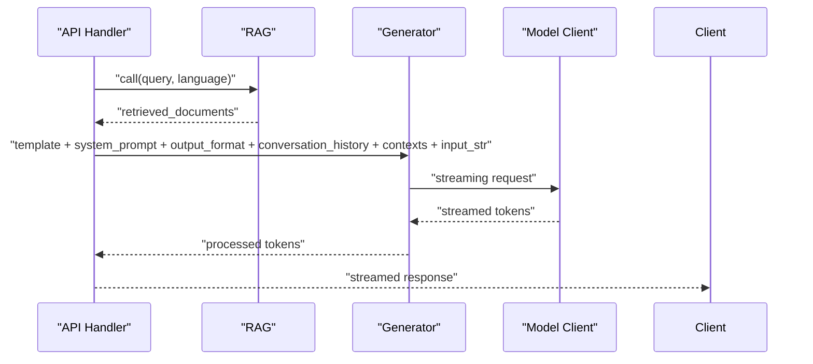
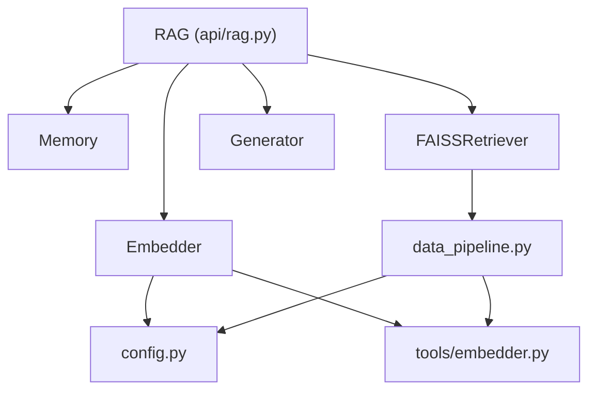

# Query Processing and Retrieval

<cite>
**Referenced Files in This Document**
- [api/rag.py](file://api/rag.py)
- [api/prompts.py](file://api/prompts.py)
- [api/data_pipeline.py](file://api/data_pipeline.py)
- [api/config.py](file://api/config.py)
- [api/tools/embedder.py](file://api/tools/embedder.py)
- [api/simple_chat.py](file://api/simple_chat.py)
- [api/websocket_wiki.py](file://api/websocket_wiki.py)
</cite>

## Table of Contents
1. [Introduction](#introduction)
2. [Project Structure](#project-structure)
3. [Core Components](#core-components)
4. [Architecture Overview](#architecture-overview)
5. [Detailed Component Analysis](#detailed-component-analysis)
6. [Dependency Analysis](#dependency-analysis)
7. [Performance Considerations](#performance-considerations)
8. [Troubleshooting Guide](#troubleshooting-guide)
9. [Conclusion](#conclusion)

## Introduction
This document explains the query processing and retrieval system in DeepWiki-Open, focusing on the RAG.call method, embedding generation, FAISS similarity search, and document retrieval. It also covers integration with the Generator component for context-aware response generation, including prompt formatting and output processing. The document details conversation-aware query processing that incorporates previous dialogue history into retrieval queries, and provides practical guidance on query optimization, context window management, and performance tuning. Common retrieval issues such as poor query formulation and irrelevant document ranking are addressed along with strategies for improving accuracy via query expansion and paraphrasing.

## Project Structure
The query processing pipeline spans several modules:
- RAG orchestration and retrieval: api/rag.py
- Prompt templates and formatting: api/prompts.py
- Data ingestion, splitting, embedding, and FAISS indexing: api/data_pipeline.py
- Embedder selection and configuration: api/tools/embedder.py and api/config.py
- API entry points for streaming and WebSocket chat: api/simple_chat.py and api/websocket_wiki.py

**Diagram sources**
- [api/simple_chat.py](file://api/simple_chat.py#L76-L130)
- [api/websocket_wiki.py](file://api/websocket_wiki.py#L53-L120)
- [api/rag.py](file://api/rag.py#L153-L243)
- [api/prompts.py](file://api/prompts.py#L3-L57)
- [api/data_pipeline.py](file://api/data_pipeline.py#L408-L476)
- [api/config.py](file://api/config.py#L183-L274)
- [api/tools/embedder.py](file://api/tools/embedder.py#L6-L58)

**Section sources**
- [api/rag.py](file://api/rag.py#L153-L243)
- [api/prompts.py](file://api/prompts.py#L3-L57)
- [api/data_pipeline.py](file://api/data_pipeline.py#L408-L476)
- [api/config.py](file://api/config.py#L183-L274)
- [api/tools/embedder.py](file://api/tools/embedder.py#L6-L58)
- [api/simple_chat.py](file://api/simple_chat.py#L76-L130)
- [api/websocket_wiki.py](file://api/websocket_wiki.py#L53-L120)

## Core Components
- RAG: Orchestrates retrieval, conversation memory, and integrates with the Generator for response generation. It prepares the FAISS retriever, validates embeddings, and executes retrieval.
- Memory: Maintains conversation history as dialog turns for context-aware prompting.
- FAISSRetriever: Performs similarity search over embedded documents.
- Embedder: Provides embeddings for queries and documents; selection depends on configuration.
- Generator: Renders prompts with conversation history, context, and system instructions, then streams model outputs.
- Data Pipeline: Reads repository content, splits text, generates embeddings, and persists FAISS indices.

Key responsibilities:
- Query embedding generation: Uses the configured embedder to embed the query string.
- FAISS similarity search: Retrieves top-k documents based on cosine similarity between query and document vectors.
- Document retrieval: Maps FAISS indices back to transformed documents and formats them for the prompt.
- Context-aware generation: The Generator composes a structured prompt that includes conversation history, retrieved context, and the user’s query.

**Section sources**
- [api/rag.py](file://api/rag.py#L153-L243)
- [api/rag.py](file://api/rag.py#L416-L446)
- [api/data_pipeline.py](file://api/data_pipeline.py#L408-L476)
- [api/tools/embedder.py](file://api/tools/embedder.py#L6-L58)
- [api/prompts.py](file://api/prompts.py#L3-L57)

## Architecture Overview
The end-to-end flow from HTTP/WebSocket request to streamed response:

**Diagram sources**
- [api/simple_chat.py](file://api/simple_chat.py#L76-L130)
- [api/websocket_wiki.py](file://api/websocket_wiki.py#L53-L120)
- [api/rag.py](file://api/rag.py#L345-L415)
- [api/data_pipeline.py](file://api/data_pipeline.py#L408-L476)
- [api/tools/embedder.py](file://api/tools/embedder.py#L6-L58)

## Detailed Component Analysis

### RAG.call Method Implementation
- Purpose: Execute a retrieval-augmented query and return retrieved documents.
- Steps:
  1. Invoke the FAISSRetriever with the user query.
  2. Map returned document indices to the stored transformed documents.
  3. Return the retrieved documents for downstream prompt composition.
- Error handling: On failure, returns a structured error response with a rationale and a friendly message.

**Diagram sources**
- [api/rag.py](file://api/rag.py#L416-L446)

**Section sources**
- [api/rag.py](file://api/rag.py#L416-L446)

### Embedding Generation and FAISS Retrieval
- Embedding generation:
  - Embedder selection is driven by configuration (OpenAI, Google, Ollama, GitHub Copilot).
  - The embedder is used to embed both query strings and document chunks.
- FAISS similarity search:
  - FAISSRetriever is initialized with the embedder and the list of transformed documents.
  - The retriever returns top-k matches based on similarity to the query embedding.
- Document retrieval:
  - The retriever returns indices; the RAG component maps these to full documents.

**Diagram sources**
- [api/rag.py](file://api/rag.py#L153-L243)
- [api/rag.py](file://api/rag.py#L416-L446)
- [api/data_pipeline.py](file://api/data_pipeline.py#L408-L476)
- [api/tools/embedder.py](file://api/tools/embedder.py#L6-L58)

**Section sources**
- [api/rag.py](file://api/rag.py#L153-L243)
- [api/rag.py](file://api/rag.py#L345-L415)
- [api/data_pipeline.py](file://api/data_pipeline.py#L408-L476)
- [api/tools/embedder.py](file://api/tools/embedder.py#L6-L58)

### Conversation-Aware Query Processing
- Memory stores dialog turns with user queries and assistant responses.
- The Generator composes prompts that include conversation history, enabling coherent multi-turn interactions.
- The API layers populate Memory from prior messages before invoking RAG.

**Diagram sources**
- [api/simple_chat.py](file://api/simple_chat.py#L139-L150)
- [api/websocket_wiki.py](file://api/websocket_wiki.py#L134-L144)
- [api/rag.py](file://api/rag.py#L59-L89)
- [api/prompts.py](file://api/prompts.py#L35-L56)

**Section sources**
- [api/simple_chat.py](file://api/simple_chat.py#L139-L150)
- [api/websocket_wiki.py](file://api/websocket_wiki.py#L134-L144)
- [api/rag.py](file://api/rag.py#L59-L89)
- [api/prompts.py](file://api/prompts.py#L35-L56)

### Integration with the Generator Component
- Prompt formatting:
  - System prompt and output format instructions are injected into the template.
  - Conversation history and retrieved context are inserted into the template.
- Output processing:
  - The Generator uses a DataClassParser to enforce a structured output format.
- Streaming:
  - The API handlers stream model tokens back to clients.

**Diagram sources**
- [api/rag.py](file://api/rag.py#L232-L243)
- [api/prompts.py](file://api/prompts.py#L3-L57)
- [api/simple_chat.py](file://api/simple_chat.py#L534-L660)
- [api/websocket_wiki.py](file://api/websocket_wiki.py#L568-L779)

**Section sources**
- [api/rag.py](file://api/rag.py#L232-L243)
- [api/prompts.py](file://api/prompts.py#L3-L57)
- [api/simple_chat.py](file://api/simple_chat.py#L534-L660)
- [api/websocket_wiki.py](file://api/websocket_wiki.py#L568-L779)

### Practical Examples and Strategies

- Query optimization:
  - Use concise, specific phrasing aligned with repository content.
  - For file-focused queries, adjust the query to emphasize the file path or topic.
- Context window management:
  - Monitor token counts for long queries and skip retrieval if input is too large.
  - Group retrieved documents by file path to reduce redundancy and improve readability.
- Performance tuning:
  - Tune FAISS parameters (e.g., top-k) and embedding model batch size.
  - Prefer smaller, targeted repositories or use inclusion filters to reduce index size.
- Improving retrieval accuracy:
  - Expand queries with synonyms or related terms.
  - Paraphrase to align with code comments and documentation styles.
  - Use conversation history to refine subsequent queries.

**Section sources**
- [api/simple_chat.py](file://api/simple_chat.py#L80-L90)
- [api/simple_chat.py](file://api/simple_chat.py#L191-L239)
- [api/websocket_wiki.py](file://api/websocket_wiki.py#L182-L239)
- [api/data_pipeline.py](file://api/data_pipeline.py#L25-L59)

## Dependency Analysis
- RAG depends on:
  - Memory for conversation history
  - FAISSRetriever for similarity search
  - Embedder for query/document embeddings
  - Generator for prompt composition and streaming
- Embedder selection depends on configuration and environment variables.
- Data pipeline manages text splitting, embedding, and FAISS index creation.

**Diagram sources**
- [api/rag.py](file://api/rag.py#L153-L243)
- [api/data_pipeline.py](file://api/data_pipeline.py#L408-L476)
- [api/config.py](file://api/config.py#L183-L274)
- [api/tools/embedder.py](file://api/tools/embedder.py#L6-L58)

**Section sources**
- [api/rag.py](file://api/rag.py#L153-L243)
- [api/data_pipeline.py](file://api/data_pipeline.py#L408-L476)
- [api/config.py](file://api/config.py#L183-L274)
- [api/tools/embedder.py](file://api/tools/embedder.py#L6-L58)

## Performance Considerations
- Embedding token limits:
  - Provider-specific limits are enforced to prevent oversized inputs.
- Batch embedding:
  - Batch size is configurable for non-Ollama embedders to improve throughput.
- Index size and retrieval cost:
  - Use inclusion filters to limit the corpus and reduce index size.
- Streaming:
  - Streaming responses reduce latency and improve user experience.

[No sources needed since this section provides general guidance]

## Troubleshooting Guide
Common retrieval issues and remedies:
- No valid embeddings found:
  - Indicates inconsistent embedding sizes or API errors during processing. Re-run preparation or check repository content.
- Inconsistent embedding sizes:
  - The system validates and filters documents to ensure uniform embedding dimensions.
- Token limit exceeded:
  - For very long queries, skip retrieval and answer without context augmentation.
- Poor query formulation:
  - Reframe queries to be more specific and aligned with repository content.
- Irrelevant document ranking:
  - Improve query wording, expand with synonyms, or refine filters.

**Section sources**
- [api/simple_chat.py](file://api/simple_chat.py#L116-L129)
- [api/websocket_wiki.py](file://api/websocket_wiki.py#L112-L120)
- [api/rag.py](file://api/rag.py#L395-L414)
- [api/simple_chat.py](file://api/simple_chat.py#L665-L680)
- [api/websocket_wiki.py](file://api/websocket_wiki.py#L785-L800)

## Conclusion
DeepWiki-Open’s query processing and retrieval system combines a robust RAG pipeline with conversation-aware prompting and streaming generation. The RAG.call method orchestrates FAISS similarity search and document retrieval, while the Generator composes context-aware prompts enriched by conversation history. Practical strategies for query optimization, context window management, and performance tuning help ensure accurate and responsive retrieval across diverse repository types and query patterns.