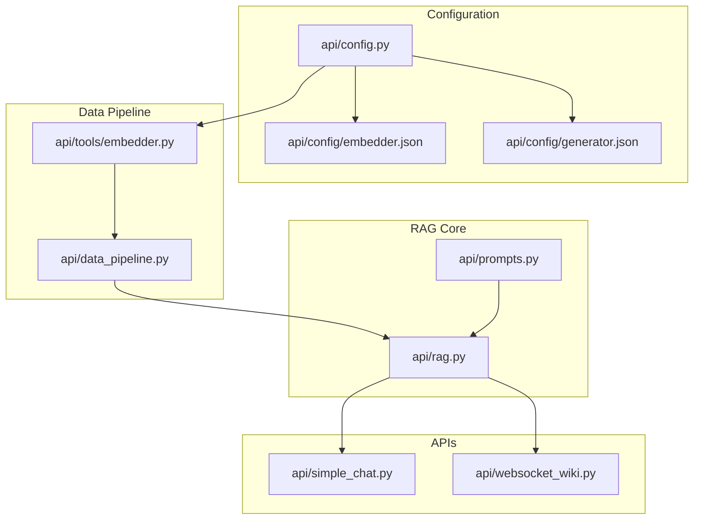
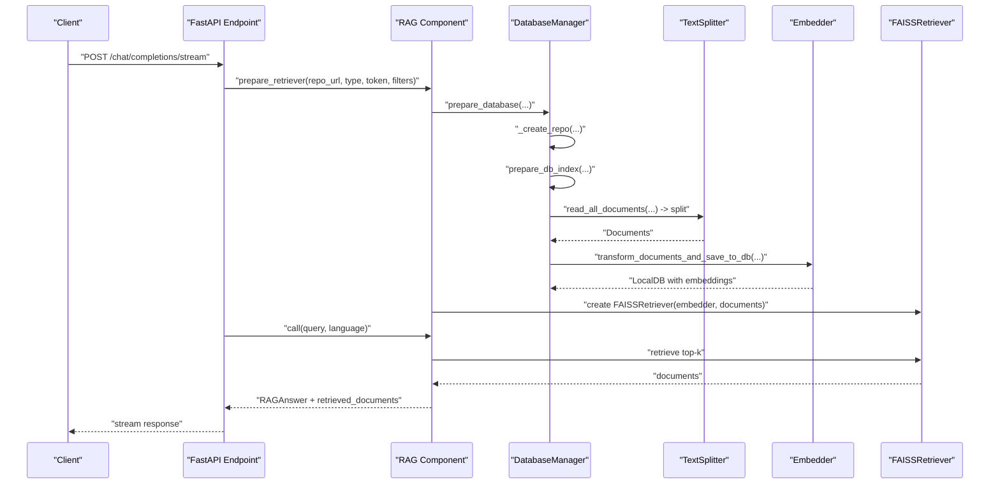
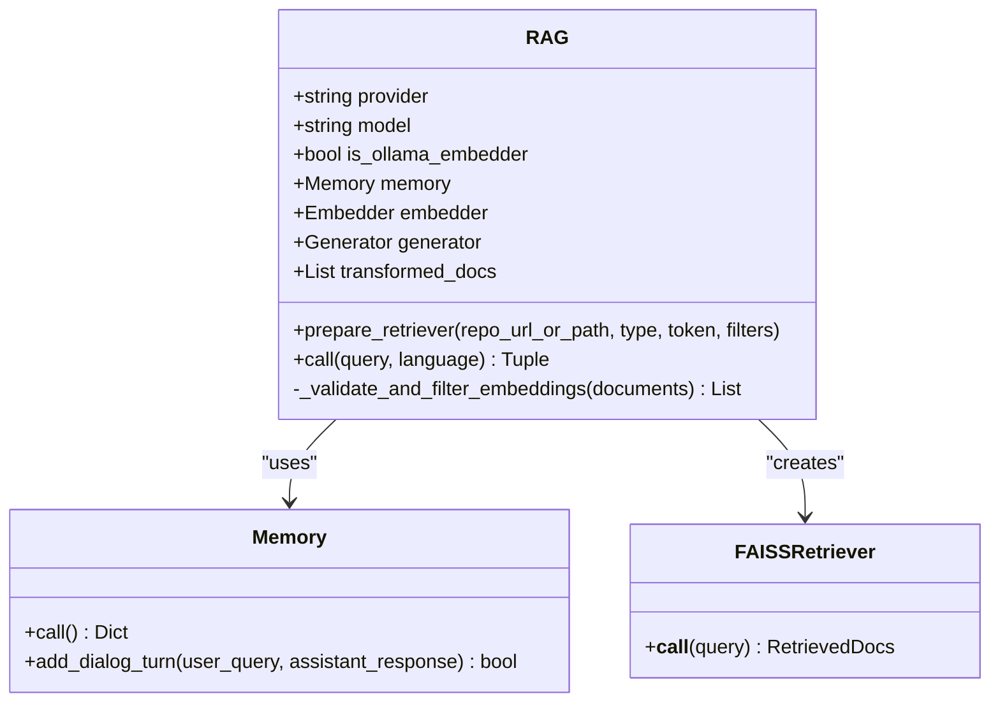
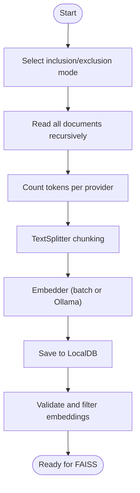
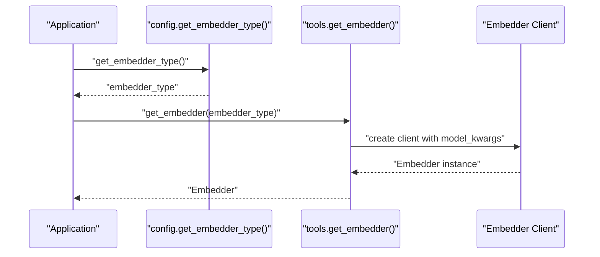
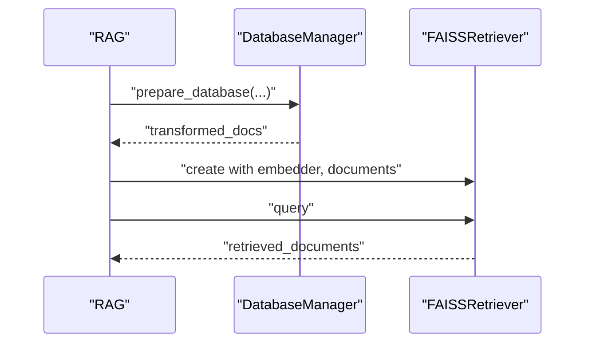
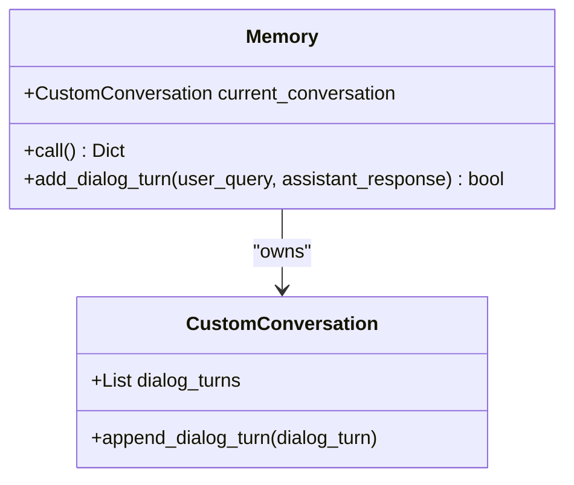
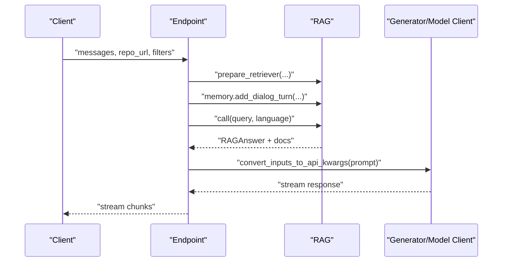
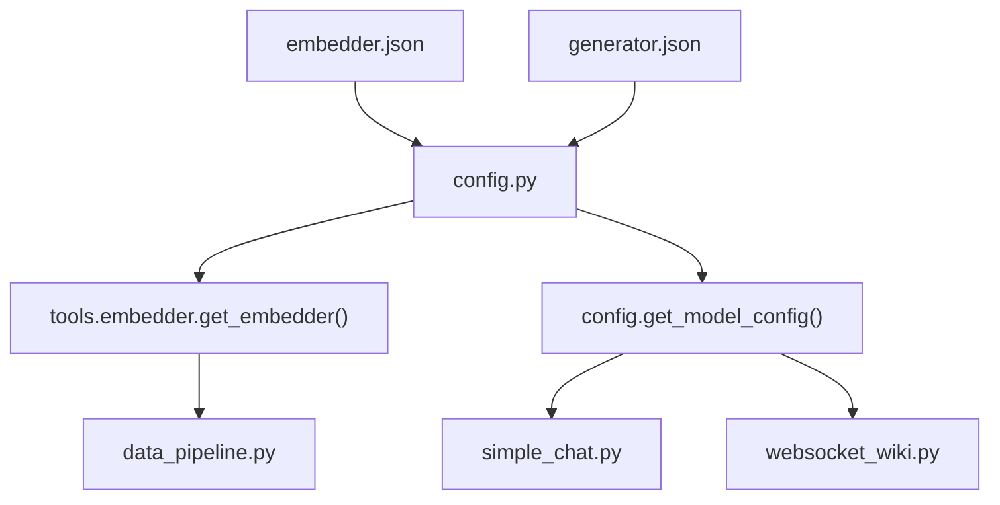

# RAG System Implementation

<cite>
**Referenced Files in This Document**
- [api/rag.py](file://api/rag.py)
- [api/data_pipeline.py](file://api/data_pipeline.py)
- [api/config.py](file://api/config.py)
- [api/tools/embedder.py](file://api/tools/embedder.py)
- [api/config/embedder.json](file://api/config/embedder.json)
- [api/config/generator.json](file://api/config/generator.json)
- [api/prompts.py](file://api/prompts.py)
- [api/simple_chat.py](file://api/simple_chat.py)
- [api/websocket_wiki.py](file://api/websocket_wiki.py)
- [tests/unit/test_all_embedders.py](file://tests/unit/test_all_embedders.py)
- [tests/integration/test_full_integration.py](file://tests/integration/test_full_integration.py)
- [README.md](file://README.md)
</cite>

## Table of Contents
1. [Introduction](#introduction)
2. [Project Structure](#project-structure)
3. [Core Components](#core-components)
4. [Architecture Overview](#architecture-overview)
5. [Detailed Component Analysis](#detailed-component-analysis)
6. [Dependency Analysis](#dependency-analysis)
7. [Performance Considerations](#performance-considerations)
8. [Troubleshooting Guide](#troubleshooting-guide)
9. [Conclusion](#conclusion)
10. [Appendices](#appendices)

## Introduction
This document explains the Retrieval Augmented Generation (RAG) system in DeepWiki-Open. It covers the end-to-end architecture integrating repository processing, document chunking, embedding generation, FAISS vector storage, and context-aware conversational AI with streaming responses. It also provides configuration guidance, performance tuning, and troubleshooting strategies for retrieval issues.

## Project Structure
The RAG system spans several modules:
- Configuration and provider selection
- Data pipeline for repository ingestion, chunking, and embedding
- FAISS-based retriever and conversation memory
- Streaming chat APIs for HTTP and WebSocket

**Diagram sources**
- [api/config.py](file://api/config.py#L1-L464)
- [api/config/embedder.json](file://api/config/embedder.json#L1-L35)
- [api/config/generator.json](file://api/config/generator.json#L1-L101)
- [api/data_pipeline.py](file://api/data_pipeline.py#L1-L917)
- [api/tools/embedder.py](file://api/tools/embedder.py#L1-L59)
- [api/rag.py](file://api/rag.py#L1-L446)
- [api/prompts.py](file://api/prompts.py#L1-L192)
- [api/simple_chat.py](file://api/simple_chat.py#L1-L900)
- [api/websocket_wiki.py](file://api/websocket_wiki.py#L1-L978)

**Section sources**
- [README.md](file://README.md#L197-L246)
- [api/config.py](file://api/config.py#L1-L464)
- [api/data_pipeline.py](file://api/data_pipeline.py#L1-L917)
- [api/rag.py](file://api/rag.py#L1-L446)

## Core Components
- Configuration loader and provider mapping
- Embedder factory and selection
- Data pipeline for chunking and embeddings
- FAISS retriever and validation/filtering
- Conversation memory and streaming generators
- HTTP and WebSocket chat endpoints

Key responsibilities:
- Provider selection and model configuration
- Repository ingestion, token counting, and filtering
- Embedding generation with batch processing and Ollama-specific handling
- FAISS retriever creation and retrieval with validated embeddings
- Conversation memory management for multi-turn chat
- Streaming responses across providers

**Section sources**
- [api/config.py](file://api/config.py#L1-L464)
- [api/tools/embedder.py](file://api/tools/embedder.py#L1-L59)
- [api/data_pipeline.py](file://api/data_pipeline.py#L1-L917)
- [api/rag.py](file://api/rag.py#L1-L446)
- [api/prompts.py](file://api/prompts.py#L1-L192)
- [api/simple_chat.py](file://api/simple_chat.py#L1-L900)
- [api/websocket_wiki.py](file://api/websocket_wiki.py#L1-L978)

## Architecture Overview
The RAG pipeline integrates repository processing, embedding, FAISS indexing, and retrieval-augmented generation with streaming.

**Diagram sources**
- [api/simple_chat.py](file://api/simple_chat.py#L76-L130)
- [api/rag.py](file://api/rag.py#L345-L416)
- [api/data_pipeline.py](file://api/data_pipeline.py#L737-L917)

## Detailed Component Analysis

### RAG Component
The RAG class orchestrates retrieval and generation:
- Initializes memory, embedder, and generator
- Validates and filters embeddings consistently
- Prepares FAISS retriever with validated documents
- Executes retrieval and returns structured answers

**Diagram sources**
- [api/rag.py](file://api/rag.py#L153-L416)

**Section sources**
- [api/rag.py](file://api/rag.py#L153-L416)

### Data Pipeline and Embedding Validation
The data pipeline handles repository ingestion, chunking, and embedding:
- Repository cloning and filtering (inclusion/exclusion modes)
- Token counting per provider
- Chunking with configurable parameters
- Embedding generation with batch processing or Ollama-specific handling
- LocalDB persistence and retrieval
- Embedding validation and filtering for consistent sizes

**Diagram sources**
- [api/data_pipeline.py](file://api/data_pipeline.py#L177-L406)
- [api/data_pipeline.py](file://api/data_pipeline.py#L408-L476)
- [api/data_pipeline.py](file://api/data_pipeline.py#L851-L902)

**Section sources**
- [api/data_pipeline.py](file://api/data_pipeline.py#L177-L406)
- [api/data_pipeline.py](file://api/data_pipeline.py#L408-L476)
- [api/data_pipeline.py](file://api/data_pipeline.py#L851-L902)

### Embedder Factory and Provider Configuration
Embedder selection is driven by configuration and environment variables:
- Auto-detection of embedder type
- Provider-specific client mapping
- Batch size and model parameters
- Ollama-specific single-string embedding handling

**Diagram sources**
- [api/tools/embedder.py](file://api/tools/embedder.py#L6-L59)
- [api/config.py](file://api/config.py#L260-L275)

**Section sources**
- [api/tools/embedder.py](file://api/tools/embedder.py#L1-L59)
- [api/config.py](file://api/config.py#L170-L275)
- [api/config/embedder.json](file://api/config/embedder.json#L1-L35)

### FAISS Retriever and Retrieval
FAISS integration:
- Embedder selection (provider-specific or Ollama)
- Document embedding map function
- Top-k retrieval configuration

**Diagram sources**
- [api/rag.py](file://api/rag.py#L345-L416)
- [api/data_pipeline.py](file://api/data_pipeline.py#L851-L902)

**Section sources**
- [api/rag.py](file://api/rag.py#L345-L416)
- [api/data_pipeline.py](file://api/data_pipeline.py#L851-L902)

### Conversation Memory Management
Memory stores dialog turns with UUIDs and supports recovery:
- Append dialog turns safely
- Recover from corrupted state
- Provide conversation history to prompts

**Diagram sources**
- [api/rag.py](file://api/rag.py#L28-L142)

**Section sources**
- [api/rag.py](file://api/rag.py#L28-L142)

### Streaming Conversational AI
HTTP and WebSocket endpoints:
- Build system prompts and conversation history
- Optionally include file content
- Stream responses per provider with fallbacks
- Handle token limit errors gracefully

**Diagram sources**
- [api/simple_chat.py](file://api/simple_chat.py#L76-L339)
- [api/websocket_wiki.py](file://api/websocket_wiki.py#L53-L780)

**Section sources**
- [api/simple_chat.py](file://api/simple_chat.py#L76-L339)
- [api/websocket_wiki.py](file://api/websocket_wiki.py#L53-L780)

## Dependency Analysis
Provider and configuration dependencies:
- Embedder configuration selects model client and parameters
- Generator configuration defines provider mapping and model parameters
- Environment variables control embedder type and API keys

**Diagram sources**
- [api/config/embedder.json](file://api/config/embedder.json#L1-L35)
- [api/config/generator.json](file://api/config/generator.json#L1-L101)
- [api/config.py](file://api/config.py#L1-L464)
- [api/tools/embedder.py](file://api/tools/embedder.py#L1-L59)
- [api/data_pipeline.py](file://api/data_pipeline.py#L1-L917)
- [api/simple_chat.py](file://api/simple_chat.py#L1-L900)
- [api/websocket_wiki.py](file://api/websocket_wiki.py#L1-L978)

**Section sources**
- [api/config.py](file://api/config.py#L1-L464)
- [api/config/embedder.json](file://api/config/embedder.json#L1-L35)
- [api/config/generator.json](file://api/config/generator.json#L1-L101)

## Performance Considerations
- Embedding model selection
  - OpenAI: text-embedding-3-small
  - Google: text-embedding-004
  - Ollama: local model; single-string embedding enforced
- Chunking parameters
  - chunk_size and chunk_overlap tuned for retrieval quality
- Batch processing
  - Batch size configured per provider
- Token limits
  - Provider-specific token limits enforced during ingestion
- FAISS top-k
  - Adjust top_k for precision/recall trade-offs

Practical tips:
- For large repositories, increase chunk_size moderately and adjust overlap to reduce fragmentation
- Tune top_k based on repository size and query specificity
- Prefer Google embeddings when using Google Gemini for generation to align vector semantics
- Monitor token counts and skip oversized files to avoid embedding failures

**Section sources**
- [api/config/embedder.json](file://api/config/embedder.json#L27-L34)
- [api/data_pipeline.py](file://api/data_pipeline.py#L25-L60)
- [api/data_pipeline.py](file://api/data_pipeline.py#L408-L450)
- [api/rag.py](file://api/rag.py#L48-L49)

## Troubleshooting Guide
Common issues and resolutions:
- No valid embeddings found
  - Symptom: Error indicating no valid documents with embeddings
  - Cause: Inconsistent embedding sizes or API errors
  - Resolution: Regenerate embeddings; ensure consistent embedder type
- Inconsistent embedding sizes
  - Symptom: FAISS error about uniform embedding sizes
  - Cause: Mixed or failed embeddings
  - Resolution: Use embedding validation and filtering; verify embedder configuration
- Token limit exceeded
  - Symptom: Provider returns token limit errors
  - Resolution: Reduce input size; fallback without context; adjust model parameters
- Repository access issues
  - Symptom: Rate limiting or authentication errors
  - Resolution: Provide personal access token; verify scopes and format
- Streaming errors
  - Symptom: Disconnections or partial responses
  - Resolution: Check network stability; verify provider credentials; handle exceptions in endpoints

**Section sources**
- [api/rag.py](file://api/rag.py#L374-L415)
- [api/simple_chat.py](file://api/simple_chat.py#L114-L130)
- [api/simple_chat.py](file://api/simple_chat.py#L661-L735)
- [README.md](file://README.md#L64-L143)

## Conclusion
DeepWiki-Open’s RAG system integrates robust repository processing, provider-aware embeddings, FAISS retrieval, and streaming conversational AI. By leveraging configurable embedders, validated embeddings, and conversation memory, it delivers accurate, context-aware responses. Proper configuration and tuning of chunking, batching, and retrieval parameters enable reliable performance across diverse repository sizes and use cases.

## Appendices

### Practical Configuration Examples
- Embedder selection
  - Set embedder type via environment variable to choose among OpenAI, Google, or Ollama
- Model provider configuration
  - Adjust provider-specific parameters in generator configuration
- Retrieval parameters
  - Tune chunk_size, chunk_overlap, and top_k in embedder configuration

**Section sources**
- [README.md](file://README.md#L370-L440)
- [api/config/embedder.json](file://api/config/embedder.json#L27-L34)
- [api/config/generator.json](file://api/config/generator.json#L1-L101)

### Embedding Model Selection Guidance
- Use Google embeddings with Google Gemini for semantic alignment
- Use OpenAI embeddings for broader compatibility
- Use Ollama for local deployments without external API keys

**Section sources**
- [README.md](file://README.md#L358-L440)
- [api/tools/embedder.py](file://api/tools/embedder.py#L6-L59)

### Vector Similarity Search and Cache Strategies
- FAISS top-k retrieval
  - Controlled by retriever configuration
- Local caching
  - LocalDB persists transformed documents and embeddings
  - Reuse cached databases to avoid recomputation

**Section sources**
- [api/config/embedder.json](file://api/config/embedder.json#L27-L29)
- [api/data_pipeline.py](file://api/data_pipeline.py#L851-L902)

### Customizing RAG Parameters by Repository Size
- Small repositories
  - Larger chunk_size and higher top_k for broader context
- Medium repositories
  - Balanced chunk_size and moderate top_k
- Large repositories
  - Smaller chunk_size with higher overlap; lower top_k for precision

**Section sources**
- [api/config/embedder.json](file://api/config/embedder.json#L30-L34)
- [api/data_pipeline.py](file://api/data_pipeline.py#L408-L450)