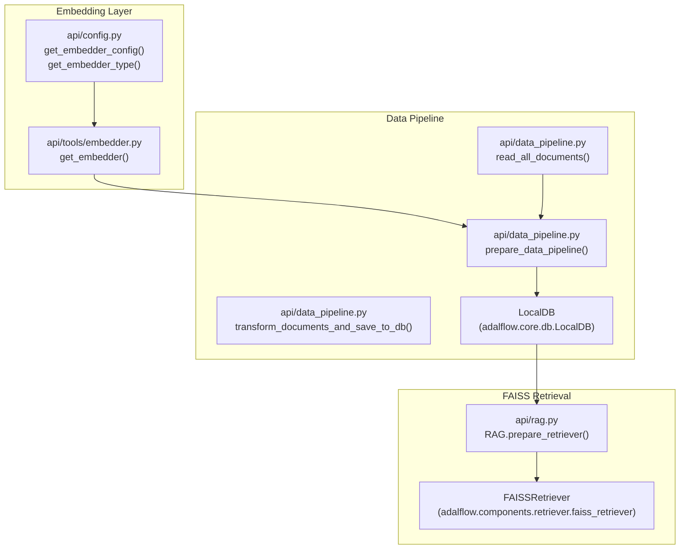
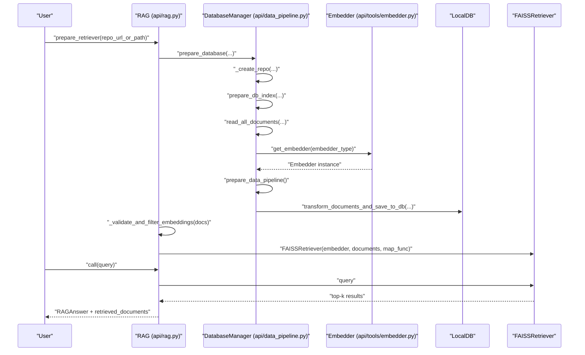
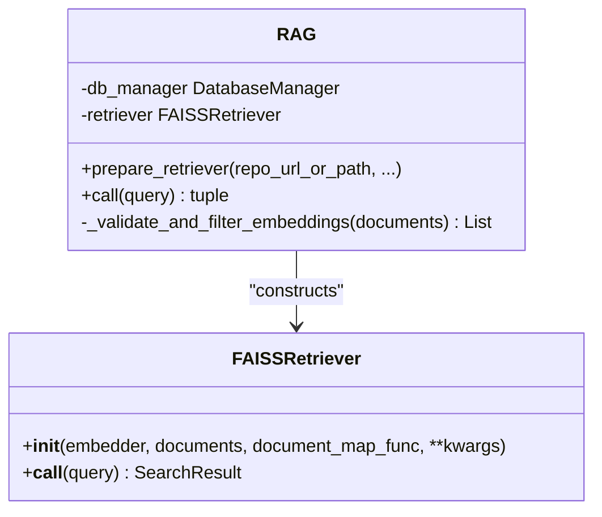
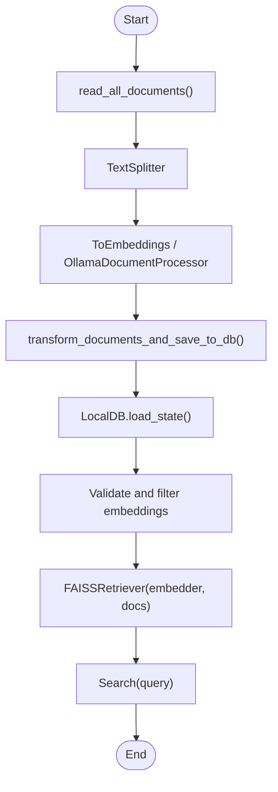
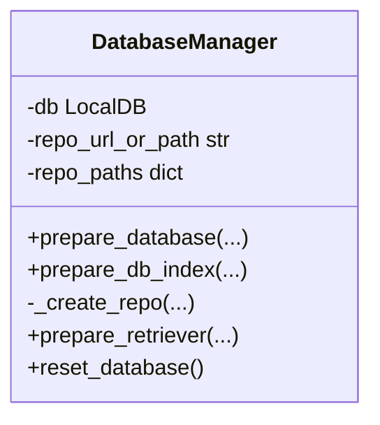
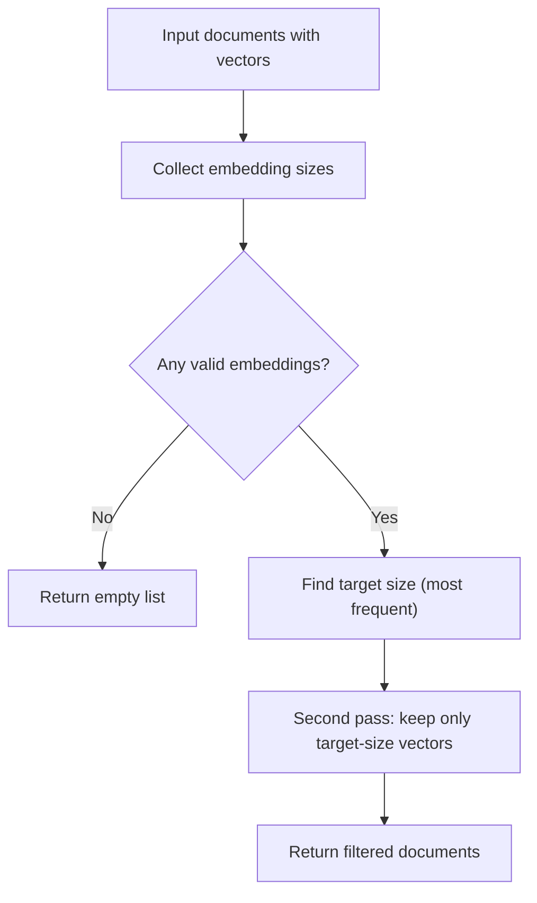

# Vector Database Integration

<cite>
**Referenced Files in This Document**
- [api/rag.py](file://api/rag.py)
- [api/data_pipeline.py](file://api/data_pipeline.py)
- [api/tools/embedder.py](file://api/tools/embedder.py)
- [api/config.py](file://api/config.py)
- [api/config/repo.json](file://api/config/repo.json)
- [tests/unit/test_faiss_fix.py](file://tests/unit/test_faiss_fix.py)
</cite>

## Table of Contents
1. [Introduction](#introduction)
2. [Project Structure](#project-structure)
3. [Core Components](#core-components)
4. [Architecture Overview](#architecture-overview)
5. [Detailed Component Analysis](#detailed-component-analysis)
6. [Dependency Analysis](#dependency-analysis)
7. [Performance Considerations](#performance-considerations)
8. [Troubleshooting Guide](#troubleshooting-guide)
9. [Conclusion](#conclusion)

## Introduction
This document explains DeepWiki-Open’s vector database integration with FAISS. It covers how embeddings are created, validated, and stored; how FAISS is initialized for retrieval; and how the DatabaseManager manages local persistence, caching, and indexing strategies. It also documents the embedding validation and filtering system that ensures consistent vector dimensions, and provides practical guidance for performance optimization, troubleshooting, and recovery from common issues such as embedding dimension mismatches and database corruption.

## Project Structure
The vector database integration spans several modules:
- Embedding creation and selection via the embedder factory
- Data ingestion, splitting, and embedding transformation
- Local database persistence and retrieval index preparation
- FAISSRetriever initialization and query-time retrieval
- Configuration-driven behavior for different providers and token limits

**Diagram sources**
- [api/tools/embedder.py](file://api/tools/embedder.py#L6-L59)
- [api/config.py](file://api/config.py#L183-L275)
- [api/data_pipeline.py](file://api/data_pipeline.py#L177-L476)
- [api/rag.py](file://api/rag.py#L345-L415)

**Section sources**
- [api/rag.py](file://api/rag.py#L1-L446)
- [api/data_pipeline.py](file://api/data_pipeline.py#L1-L917)
- [api/tools/embedder.py](file://api/tools/embedder.py#L1-L59)
- [api/config.py](file://api/config.py#L1-L464)
- [api/config/repo.json](file://api/config/repo.json#L1-L129)

## Core Components
- Embedder factory: Selects and configures the embedding client based on environment and configuration.
- Data pipeline: Reads files, splits text, computes embeddings, and persists transformed documents to a local database.
- DatabaseManager: Orchestrates repository preparation, local storage paths, and index loading/persistence.
- FAISSRetriever: Initializes FAISS with validated embeddings and performs similarity search.
- Validation and filtering: Ensures consistent embedding dimensions across all stored documents.

**Section sources**
- [api/tools/embedder.py](file://api/tools/embedder.py#L6-L59)
- [api/data_pipeline.py](file://api/data_pipeline.py#L177-L476)
- [api/data_pipeline.py](file://api/data_pipeline.py#L737-L917)
- [api/rag.py](file://api/rag.py#L251-L415)

## Architecture Overview
The system integrates FAISS into a configurable RAG pipeline:
- Embedder selection resolves provider-specific clients and parameters.
- Documents are read from disk or remote repositories, split, embedded, and saved to a LocalDB state file.
- On retrieval, FAISS is constructed from validated documents and used to answer queries.

**Diagram sources**
- [api/rag.py](file://api/rag.py#L345-L415)
- [api/data_pipeline.py](file://api/data_pipeline.py#L747-L902)
- [api/tools/embedder.py](file://api/tools/embedder.py#L6-L59)

## Detailed Component Analysis

### FAISSRetriever Implementation
FAISSRetriever is initialized with:
- An embedder instance
- A list of documents
- A document map function that extracts vectors from documents

Key behaviors:
- Validates that all embeddings have consistent dimensions before constructing the index.
- Performs similarity search and returns top-k results with document indices and scores.
- The RAG component wraps retrieval with robust error handling and fallback responses.

**Diagram sources**
- [api/rag.py](file://api/rag.py#L345-L415)

**Section sources**
- [api/rag.py](file://api/rag.py#L384-L415)
- [tests/unit/test_faiss_fix.py](file://tests/unit/test_faiss_fix.py#L71-L92)

### Embedding Storage and Retrieval Mechanisms
- Embedding creation: The embedder factory selects the appropriate client and model parameters based on configuration.
- Transformation pipeline: TextSplitter followed by ToEmbeddings (or OllamaDocumentProcessor) produces embedded documents.
- Persistence: LocalDB stores the transformed documents and saves the state to a .pkl file.
- Retrieval: FAISSRetriever loads vectors via the provided map function and executes similarity search.

**Diagram sources**
- [api/data_pipeline.py](file://api/data_pipeline.py#L177-L476)
- [api/data_pipeline.py](file://api/data_pipeline.py#L851-L902)
- [api/rag.py](file://api/rag.py#L251-L415)

**Section sources**
- [api/data_pipeline.py](file://api/data_pipeline.py#L408-L476)
- [api/data_pipeline.py](file://api/data_pipeline.py#L851-L902)
- [api/rag.py](file://api/rag.py#L384-L415)

### DatabaseManager Functionality
Responsibilities:
- Repository preparation: Creates local paths for repos and databases under the default root path.
- Index lifecycle: Loads an existing database if available; otherwise builds a new one from source documents.
- Persistence: Uses LocalDB to register a transformer and save/load state to disk.
- Compatibility: Provides a simplified interface for external callers.

**Diagram sources**
- [api/data_pipeline.py](file://api/data_pipeline.py#L737-L917)

**Section sources**
- [api/data_pipeline.py](file://api/data_pipeline.py#L737-L917)

### Embedding Validation and Filtering System
Purpose: Ensure all documents have embeddings of the same dimension before building the FAISS index.

Algorithm highlights:
- First pass: Inspect all documents and record the frequency of each embedding size.
- Determine the most frequent size as the target.
- Filter out documents whose embeddings differ from the target size.
- Log warnings for skipped or filtered documents and summarize counts.

**Diagram sources**
- [api/rag.py](file://api/rag.py#L251-L343)

**Section sources**
- [api/rag.py](file://api/rag.py#L251-L343)

### Practical Examples

- Creating embeddings:
  - Use the embedder factory to obtain an embedder instance based on configuration.
  - Apply the data pipeline to split and embed documents.
  - Persist the transformed documents to a LocalDB state file.

  Example paths:
  - [api/tools/embedder.py](file://api/tools/embedder.py#L6-L59)
  - [api/data_pipeline.py](file://api/data_pipeline.py#L408-L476)

- Vector similarity search:
  - Initialize FAISSRetriever with the embedder and validated documents.
  - Call the retriever with a query string to obtain top-k results.

  Example paths:
  - [api/rag.py](file://api/rag.py#L384-L415)
  - [tests/unit/test_faiss_fix.py](file://tests/unit/test_faiss_fix.py#L71-L92)

- Performance optimization for large repositories:
  - Adjust batch size for non-Ollama embedders to balance throughput and resource usage.
  - Tune text splitting chunk size and overlap to improve retrieval quality.
  - Limit token counts per segment using provider-specific token limits to reduce embedding cost and latency.

  Example paths:
  - [api/data_pipeline.py](file://api/data_pipeline.py#L442-L445)
  - [api/data_pipeline.py](file://api/data_pipeline.py#L37-L59)
  - [api/data_pipeline.py](file://api/data_pipeline.py#L348-L353)

## Dependency Analysis
- Embedder selection depends on configuration resolution and environment variables.
- Data pipeline depends on the embedder and text splitting configuration.
- FAISSRetriever depends on validated documents and a compatible embedder.
- DatabaseManager coordinates repository paths, LocalDB persistence, and index loading.

**Diagram sources**
- [api/config.py](file://api/config.py#L183-L275)
- [api/tools/embedder.py](file://api/tools/embedder.py#L6-L59)
- [api/data_pipeline.py](file://api/data_pipeline.py#L408-L476)
- [api/data_pipeline.py](file://api/data_pipeline.py#L737-L917)
- [api/rag.py](file://api/rag.py#L345-L415)

**Section sources**
- [api/config.py](file://api/config.py#L183-L275)
- [api/tools/embedder.py](file://api/tools/embedder.py#L6-L59)
- [api/data_pipeline.py](file://api/data_pipeline.py#L408-L476)
- [api/data_pipeline.py](file://api/data_pipeline.py#L737-L917)
- [api/rag.py](file://api/rag.py#L345-L415)

## Performance Considerations
- Batch processing: For providers other than Ollama, batching improves throughput. Adjust batch size in the embedder configuration.
- Token limits: Respect provider-specific token limits to avoid truncation and costly retries.
- Splitting strategy: Tune chunk size and overlap to balance recall and latency.
- Index construction: Ensure embedding dimensions are consistent to prevent FAISS errors and re-indexing overhead.
- Persistence: Reuse LocalDB state files to avoid recomputation on subsequent runs.

[No sources needed since this section provides general guidance]

## Troubleshooting Guide

Common issues and resolutions:
- Embedding dimension mismatch during FAISS index creation:
  - Symptom: Error indicating inconsistent embedding sizes.
  - Action: Run the validation and filtering step to remove mismatched documents, then rebuild the retriever.
  - Evidence: The retrieval preparation logs sample embedding sizes to aid diagnosis.

  Section sources
  - [api/rag.py](file://api/rag.py#L395-L414)

- Database corruption or load failure:
  - Symptom: Failure to load the existing database state.
  - Action: Delete or move the corrupted .pkl file; the system will rebuild the index on next run.
  - Evidence: The index preparation routine attempts to load and falls back to regeneration upon error.

  Section sources
  - [api/data_pipeline.py](file://api/data_pipeline.py#L874-L884)

- Empty or insufficient documents after filtering:
  - Symptom: No valid documents remain after validation.
  - Action: Verify embedding correctness, adjust filters, or increase tolerance for larger files.

  Section sources
  - [api/rag.py](file://api/rag.py#L295-L343)

- Query-time retrieval failures:
  - Symptom: Exceptions during retrieval.
  - Action: Catch exceptions, log diagnostics, and return a graceful error response.

  Section sources
  - [api/rag.py](file://api/rag.py#L437-L445)

- FAISS retriever validation tests:
  - Use the provided test to validate retriever behavior end-to-end with real embeddings.

  Section sources
  - [tests/unit/test_faiss_fix.py](file://tests/unit/test_faiss_fix.py#L17-L98)

## Conclusion
DeepWiki-Open’s vector database integration leverages a configuration-driven embedder, a robust data pipeline with LocalDB persistence, and a validated FAISSRetriever for efficient similarity search. The embedding validation and filtering system prevents dimension mismatches, while the DatabaseManager streamlines local storage and index lifecycle. By tuning batching, splitting, and token limits, and following the troubleshooting steps, you can maintain reliable and performant vector search across large repositories.