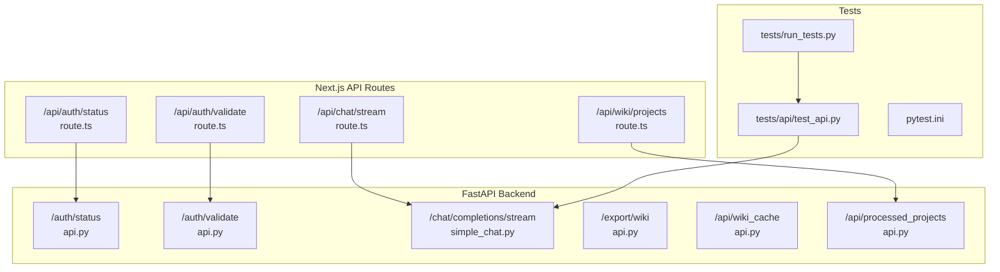
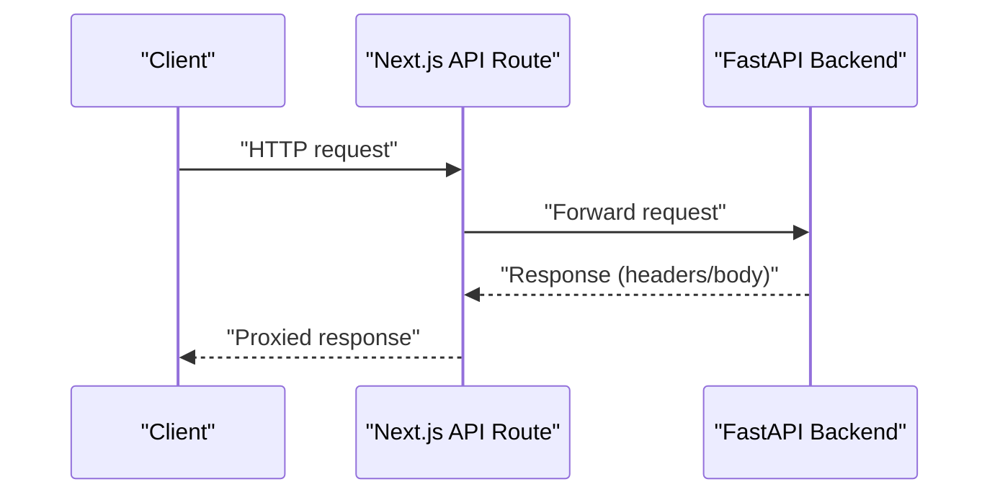
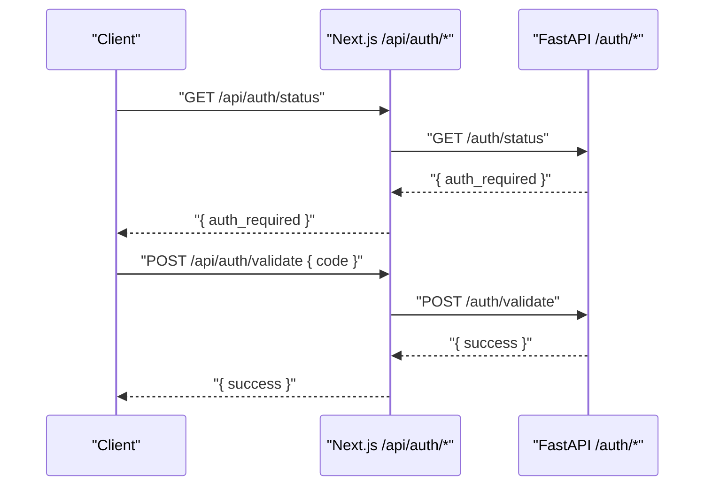
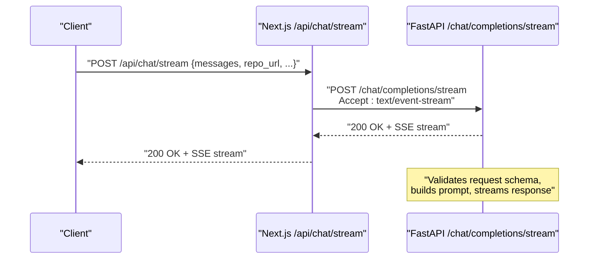
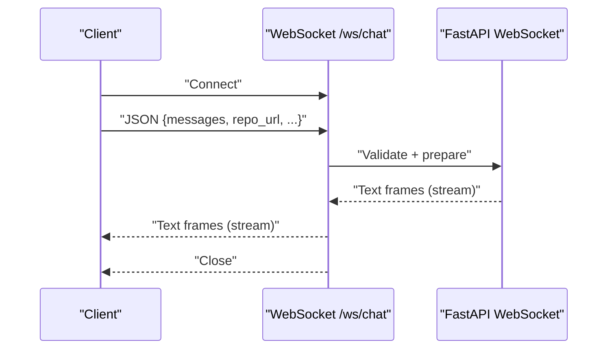
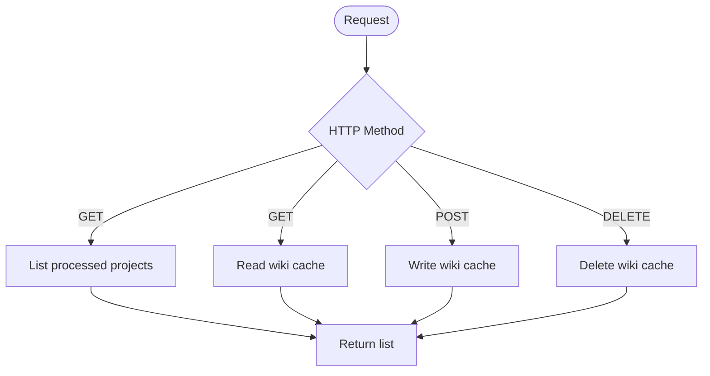
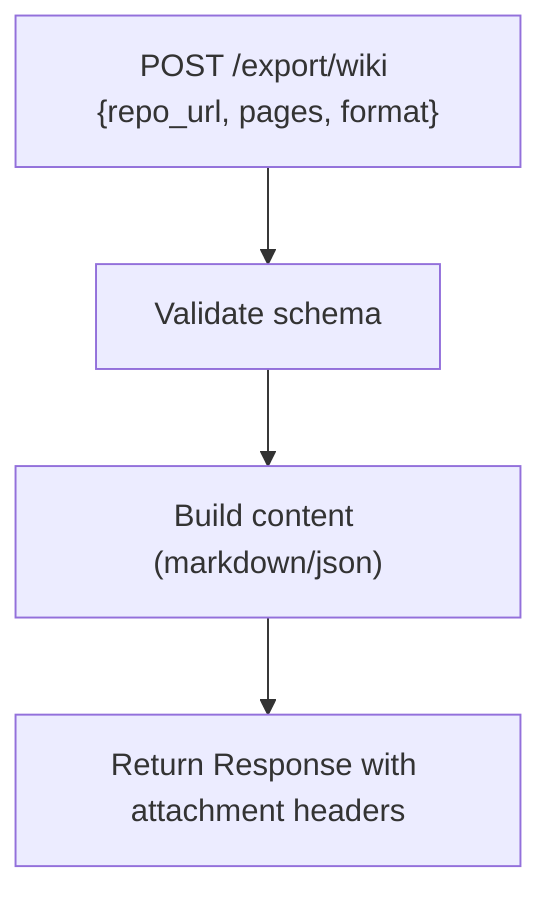
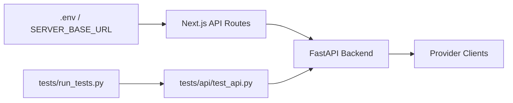

# API Testing

<cite>
**Referenced Files in This Document**
- [api.py](file://api/api.py)
- [simple_chat.py](file://api/simple_chat.py)
- [websocket_wiki.py](file://api/websocket_wiki.py)
- [test_api.py](file://tests/api/test_api.py)
- [run_tests.py](file://tests/run_tests.py)
- [pytest.ini](file://pytest.ini)
- [route.ts (auth/status)](file://src/app/api/auth/status/route.ts)
- [route.ts (auth/validate)](file://src/app/api/auth/validate/route.ts)
- [route.ts (chat/stream)](file://src/app/api/chat/stream/route.ts)
- [route.ts (wiki/projects)](file://src/app/api/wiki/projects/route.ts)
- [tests README](file://tests/README.md)
</cite>

## Table of Contents
1. [Introduction](#introduction)
2. [Project Structure](#project-structure)
3. [Core Components](#core-components)
4. [Architecture Overview](#architecture-overview)
5. [Detailed Component Analysis](#detailed-component-analysis)
6. [Dependency Analysis](#dependency-analysis)
7. [Performance Considerations](#performance-considerations)
8. [Troubleshooting Guide](#troubleshooting-guide)
9. [Conclusion](#conclusion)
10. [Appendices](#appendices)

## Introduction
This document provides comprehensive API testing guidance for DeepWiki-Open’s REST endpoints. It focuses on validating FastAPI endpoints, including authentication routes, streaming chat completions, and wiki management APIs. The guide explains how to validate request/response schemas, HTTP status codes, error conditions, and streaming/WebSocket behaviors. It also covers the test execution framework, how to simulate error conditions, and how to extend tests as the API evolves.

## Project Structure
The API surface spans both the FastAPI backend and Next.js API routes that proxy to the backend. The tests reside under the tests/ directory and are orchestrated by a test runner.

**Diagram sources**
- [route.ts (auth/status)](file://src/app/api/auth/status/route.ts#L1-L32)
- [route.ts (auth/validate)](file://src/app/api/auth/validate/route.ts#L1-L35)
- [route.ts (chat/stream)](file://src/app/api/chat/stream/route.ts#L1-L113)
- [route.ts (wiki/projects)](file://src/app/api/wiki/projects/route.ts#L1-L104)
- [api.py](file://api/api.py#L153-L165)
- [simple_chat.py](file://api/simple_chat.py#L76-L138)
- [test_api.py](file://tests/api/test_api.py#L1-L71)
- [run_tests.py](file://tests/run_tests.py#L1-L184)
- [pytest.ini](file://pytest.ini#L1-L16)

**Section sources**
- [api.py](file://api/api.py#L153-L165)
- [simple_chat.py](file://api/simple_chat.py#L76-L138)
- [websocket_wiki.py](file://api/websocket_wiki.py#L53-L132)
- [test_api.py](file://tests/api/test_api.py#L1-L71)
- [run_tests.py](file://tests/run_tests.py#L1-L184)
- [pytest.ini](file://pytest.ini#L1-L16)
- [route.ts (auth/status)](file://src/app/api/auth/status/route.ts#L1-L32)
- [route.ts (auth/validate)](file://src/app/api/auth/validate/route.ts#L1-L35)
- [route.ts (chat/stream)](file://src/app/api/chat/stream/route.ts#L1-L113)
- [route.ts (wiki/projects)](file://src/app/api/wiki/projects/route.ts#L1-L104)

## Core Components
- Authentication routes
  - GET /auth/status: returns whether authentication is required.
  - POST /auth/validate: validates an authorization code against configured mode/code.
- Chat completion endpoints
  - POST /chat/completions/stream: streaming chat completion via HTTP fallback or WebSocket.
  - WebSocket /ws/chat: real-time streaming chat.
- Wiki management APIs
  - GET /api/processed_projects: lists processed projects in cache.
  - GET/POST/DELETE /api/wiki_cache: CRUD operations for cached wiki data.
  - POST /export/wiki: exports wiki content in markdown or JSON.

These endpoints are validated by:
- Request schema validation via Pydantic models.
- HTTP status code assertions.
- Error condition simulation (invalid inputs, missing/invalid auth, server errors).
- Streaming/WebSocket behavior verification.

**Section sources**
- [api.py](file://api/api.py#L153-L165)
- [api.py](file://api/api.py#L227-L274)
- [api.py](file://api/api.py#L461-L502)
- [api.py](file://api/api.py#L577-L634)
- [simple_chat.py](file://api/simple_chat.py#L56-L65)
- [simple_chat.py](file://api/simple_chat.py#L76-L138)
- [websocket_wiki.py](file://api/websocket_wiki.py#L33-L52)
- [websocket_wiki.py](file://api/websocket_wiki.py#L53-L132)

## Architecture Overview
The Next.js API routes act as proxies to the FastAPI backend. They forward requests and responses, preserving headers and status codes. The FastAPI backend implements the core endpoints, including streaming and caching.

**Diagram sources**
- [route.ts (auth/status)](file://src/app/api/auth/status/route.ts#L5-L23)
- [route.ts (auth/validate)](file://src/app/api/auth/validate/route.ts#L5-L26)
- [route.ts (chat/stream)](file://src/app/api/chat/stream/route.ts#L18-L42)
- [route.ts (wiki/projects)](file://src/app/api/wiki/projects/route.ts#L38-L63)
- [api.py](file://api/api.py#L153-L165)

## Detailed Component Analysis

### Authentication Routes Testing
- GET /auth/status
  - Validates response shape and values based on configuration.
  - Tests: success path and proxy error propagation.
- POST /auth/validate
  - Validates request body schema and compares with configured code.
  - Tests: success/failure scenarios and proxy error propagation.

**Diagram sources**
- [route.ts (auth/status)](file://src/app/api/auth/status/route.ts#L5-L23)
- [route.ts (auth/validate)](file://src/app/api/auth/validate/route.ts#L5-L26)
- [api.py](file://api/api.py#L153-L165)

**Section sources**
- [route.ts (auth/status)](file://src/app/api/auth/status/route.ts#L1-L32)
- [route.ts (auth/validate)](file://src/app/api/auth/validate/route.ts#L1-L35)
- [api.py](file://api/api.py#L153-L165)

### Streaming Chat Completion Testing
- HTTP fallback endpoint
  - Next.js route forwards POST to FastAPI /chat/completions/stream with Accept: text/event-stream.
  - Validates streaming headers, status, and chunk delivery.
- FastAPI endpoint
  - Validates request schema, performs RAG retrieval (when applicable), selects provider, and streams responses.
  - Handles token limit fallback and error propagation.

**Diagram sources**
- [route.ts (chat/stream)](file://src/app/api/chat/stream/route.ts#L9-L87)
- [simple_chat.py](file://api/simple_chat.py#L76-L138)

**Section sources**
- [route.ts (chat/stream)](file://src/app/api/chat/stream/route.ts#L1-L113)
- [simple_chat.py](file://api/simple_chat.py#L76-L138)
- [test_api.py](file://tests/api/test_api.py#L5-L71)

### WebSocket Chat Completion Testing
- WebSocket endpoint
  - Accepts JSON payload, validates request schema, prepares RAG, selects provider, and streams text frames.
  - Supports special handling for GitHub Copilot wiki structure requests (non-streaming).

**Diagram sources**
- [websocket_wiki.py](file://api/websocket_wiki.py#L53-L132)
- [websocket_wiki.py](file://api/websocket_wiki.py#L569-L780)

**Section sources**
- [websocket_wiki.py](file://api/websocket_wiki.py#L53-L132)
- [websocket_wiki.py](file://api/websocket_wiki.py#L569-L780)

### Wiki Management APIs Testing
- GET /api/processed_projects
  - Lists processed projects from cache directory; validates response shape and pagination-like ordering.
- GET/POST/DELETE /api/wiki_cache
  - Reads/writes/deletes cached wiki data; validates language normalization, authorization checks, and error responses.

**Diagram sources**
- [api.py](file://api/api.py#L577-L634)
- [api.py](file://api/api.py#L461-L502)
- [route.ts (wiki/projects)](file://src/app/api/wiki/projects/route.ts#L38-L73)

**Section sources**
- [api.py](file://api/api.py#L461-L502)
- [api.py](file://api/api.py#L577-L634)
- [route.ts (wiki/projects)](file://src/app/api/wiki/projects/route.ts#L1-L104)

### Export Wiki API Testing
- POST /export/wiki
  - Validates request schema, generates markdown or JSON, and returns a downloadable file with appropriate headers.

**Diagram sources**
- [api.py](file://api/api.py#L227-L274)

**Section sources**
- [api.py](file://api/api.py#L227-L274)

## Dependency Analysis
- Next.js routes depend on environment variables for backend base URLs.
- FastAPI endpoints depend on configuration and clients for providers.
- Tests depend on the test runner and environment variables.

**Diagram sources**
- [route.ts (auth/status)](file://src/app/api/auth/status/route.ts#L3)
- [route.ts (auth/validate)](file://src/app/api/auth/validate/route.ts#L3)
- [route.ts (chat/stream)](file://src/app/api/chat/stream/route.ts#L5)
- [route.ts (wiki/projects)](file://src/app/api/wiki/projects/route.ts#L34)
- [run_tests.py](file://tests/run_tests.py#L1-L184)
- [test_api.py](file://tests/api/test_api.py#L1-L71)

**Section sources**
- [route.ts (auth/status)](file://src/app/api/auth/status/route.ts#L1-L32)
- [route.ts (auth/validate)](file://src/app/api/auth/validate/route.ts#L1-L35)
- [route.ts (chat/stream)](file://src/app/api/chat/stream/route.ts#L1-L113)
- [route.ts (wiki/projects)](file://src/app/api/wiki/projects/route.ts#L1-L104)
- [run_tests.py](file://tests/run_tests.py#L1-L184)
- [test_api.py](file://tests/api/test_api.py#L1-L71)

## Performance Considerations
- Streaming endpoints should preserve headers and avoid buffering to minimize latency.
- Cache operations should be efficient; consider async I/O and minimal serialization overhead.
- Proxy routes should forward headers and status codes without modification to reduce overhead.

## Troubleshooting Guide
Common issues and remedies:
- Proxy failures
  - Verify SERVER_BASE_URL and backend reachability.
  - Inspect error responses forwarded from backend.
- Authentication failures
  - Confirm WIKI_AUTH_MODE and WIKI_AUTH_CODE alignment with requests.
- Streaming interruptions
  - Ensure Accept: text/event-stream is set for HTTP fallback.
  - For WebSocket, confirm connection lifecycle and error frames.
- Cache errors
  - Validate language normalization and authorization code for deletion.
- Environment variables
  - Ensure .env presence and required keys for integrations.

**Section sources**
- [route.ts (auth/status)](file://src/app/api/auth/status/route.ts#L5-L31)
- [route.ts (auth/validate)](file://src/app/api/auth/validate/route.ts#L5-L33)
- [route.ts (chat/stream)](file://src/app/api/chat/stream/route.ts#L18-L98)
- [api.py](file://api/api.py#L520-L538)
- [tests README](file://tests/README.md#L97-L126)

## Conclusion
The testing framework validates FastAPI endpoints through Next.js proxies, ensuring schema correctness, status code fidelity, and robust error handling. Streaming and WebSocket endpoints are covered by both HTTP fallback and native WebSocket flows. The test runner and configuration enable scalable, repeatable validation as the API evolves.

## Appendices

### Test Execution Framework
- Run all tests or specific categories using the test runner.
- Environment checks and dependency verification are performed automatically.
- API tests require a running FastAPI server on the expected port.

**Section sources**
- [run_tests.py](file://tests/run_tests.py#L137-L184)
- [tests README](file://tests/README.md#L19-L52)
- [pytest.ini](file://pytest.ini#L1-L16)

### Practical Examples Index
- Streaming endpoint test harness: [test_api.py](file://tests/api/test_api.py#L5-L71)
- HTTP fallback streaming proxy: [route.ts (chat/stream)](file://src/app/api/chat/stream/route.ts#L9-L87)
- WebSocket streaming handler: [websocket_wiki.py](file://api/websocket_wiki.py#L53-L132)
- Authentication proxy routes: [route.ts (auth/status)](file://src/app/api/auth/status/route.ts#L5-L23), [route.ts (auth/validate)](file://src/app/api/auth/validate/route.ts#L5-L26)
- Wiki cache endpoints: [api.py](file://api/api.py#L461-L502), [api.py](file://api/api.py#L577-L634)
- Export wiki endpoint: [api.py](file://api/api.py#L227-L274)