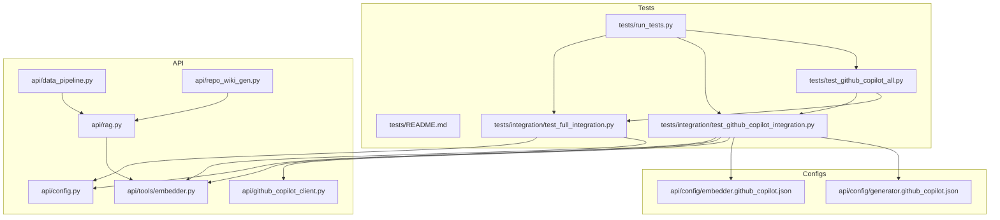
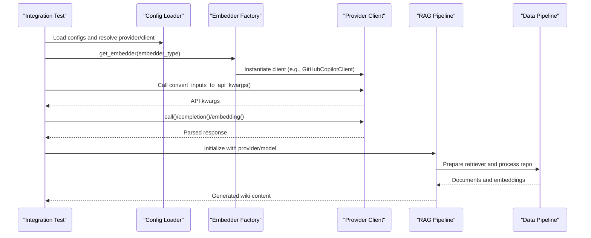
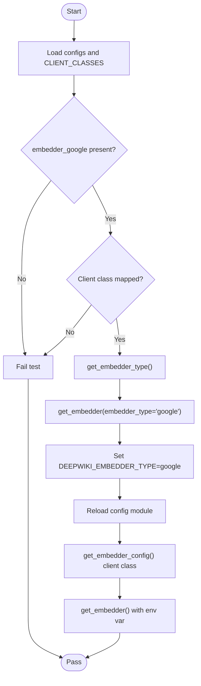
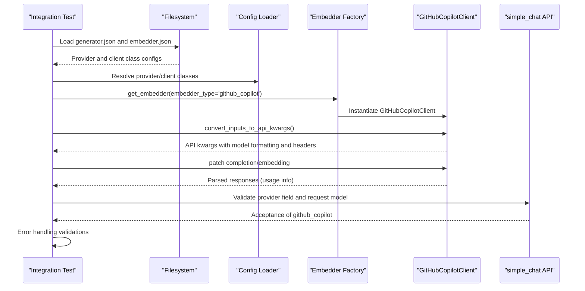
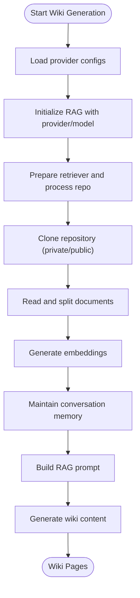
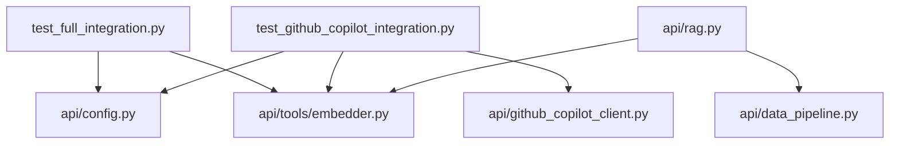

# Integration Testing

<cite>
**Referenced Files in This Document**
- [tests/integration/test_full_integration.py](file://tests/integration/test_full_integration.py)
- [tests/integration/test_github_copilot_integration.py](file://tests/integration/test_github_copilot_integration.py)
- [tests/README.md](file://tests/README.md)
- [tests/README_GITHUB_COPILOT_TESTS.md](file://tests/README_GITHUB_COPILOT_TESTS.md)
- [tests/run_tests.py](file://tests/run_tests.py)
- [tests/test_github_copilot_all.py](file://tests/test_github_copilot_all.py)
- [api/config.py](file://api/config.py)
- [api/tools/embedder.py](file://api/tools/embedder.py)
- [api/github_copilot_client.py](file://api/github_copilot_client.py)
- [api/rag.py](file://api/rag.py)
- [api/data_pipeline.py](file://api/data_pipeline.py)
- [api/repo_wiki_gen.py](file://api/repo_wiki_gen.py)
- [api/config/embedder.github_copilot.json](file://api/config/embedder.github_copilot.json)
- [api/config/generator.github_copilot.json](file://api/config/generator.github_copilot.json)
- [pytest.ini](file://pytest.ini)
</cite>

## Table of Contents
1. [Introduction](#introduction)
2. [Project Structure](#project-structure)
3. [Core Components](#core-components)
4. [Architecture Overview](#architecture-overview)
5. [Detailed Component Analysis](#detailed-component-analysis)
6. [Dependency Analysis](#dependency-analysis)
7. [Performance Considerations](#performance-considerations)
8. [Troubleshooting Guide](#troubleshooting-guide)
9. [Conclusion](#conclusion)
10. [Appendices](#appendices)

## Introduction
This document describes the integration testing approach for DeepWiki-Open, focusing on end-to-end validation of complete system workflows. It covers:
- Repository processing pipelines and RAG system integration
- Multi-provider AI model coordination via configuration-driven selection
- Full wiki generation process from repository input to documentation output
- GitHub Copilot integration testing, including provider-specific functionality and authentication flows
- Test setup for external dependencies, mock service configurations, and environment preparation
- Examples of testing complex workflows, error handling scenarios, and performance benchmarks
- Test data management, cleanup procedures, and continuous integration practices

## Project Structure
The integration tests are organized under the tests directory with dedicated suites for Google AI embeddings and GitHub Copilot. The test runner supports selective execution and environment checks.

**Diagram sources**
- [tests/run_tests.py](file://tests/run_tests.py#L1-L184)
- [tests/integration/test_full_integration.py](file://tests/integration/test_full_integration.py#L1-L152)
- [tests/integration/test_github_copilot_integration.py](file://tests/integration/test_github_copilot_integration.py#L1-L502)
- [tests/test_github_copilot_all.py](file://tests/test_github_copilot_all.py#L1-L273)
- [api/config.py](file://api/config.py#L1-L200)
- [api/tools/embedder.py](file://api/tools/embedder.py#L1-L59)
- [api/github_copilot_client.py](file://api/github_copilot_client.py#L1-L200)
- [api/rag.py](file://api/rag.py#L1-L200)
- [api/data_pipeline.py](file://api/data_pipeline.py#L1-L200)
- [api/repo_wiki_gen.py](file://api/repo_wiki_gen.py#L1-L200)
- [api/config/embedder.github_copilot.json](file://api/config/embedder.github_copilot.json#L1-L26)
- [api/config/generator.github_copilot.json](file://api/config/generator.github_copilot.json#L1-L35)

**Section sources**
- [tests/README.md](file://tests/README.md#L1-L126)
- [tests/run_tests.py](file://tests/run_tests.py#L1-L184)

## Core Components
- Configuration loader and provider selection: Centralized configuration loading and client class mapping enable dynamic provider selection and environment-driven overrides.
- Embedder factory: Builds embedders based on explicit type or auto-detected configuration, resolving client classes and model parameters.
- GitHub Copilot client: LiteLLM-backed client with automatic OAuth2 authentication, model name formatting, and input conversion for chat and embeddings.
- RAG pipeline: Integrates repository processing, embedding retrieval, memory, and prompt orchestration for wiki generation.
- Data pipeline: Repository cloning, token counting, and document processing utilities supporting multiple providers and token limits.
- Wiki generator: Orchestrates wiki structure creation and page content generation with provider/model parameters.

**Section sources**
- [api/config.py](file://api/config.py#L1-L200)
- [api/tools/embedder.py](file://api/tools/embedder.py#L1-L59)
- [api/github_copilot_client.py](file://api/github_copilot_client.py#L1-L200)
- [api/rag.py](file://api/rag.py#L1-L200)
- [api/data_pipeline.py](file://api/data_pipeline.py#L1-L200)
- [api/repo_wiki_gen.py](file://api/repo_wiki_gen.py#L1-L200)

## Architecture Overview
The integration tests validate end-to-end flows across configuration, embedder selection, provider clients, and RAG pipelines. The following diagram maps the primary integration test components and their interactions.

**Diagram sources**
- [tests/integration/test_full_integration.py](file://tests/integration/test_full_integration.py#L13-L115)
- [tests/integration/test_github_copilot_integration.py](file://tests/integration/test_github_copilot_integration.py#L15-L152)
- [api/config.py](file://api/config.py#L183-L200)
- [api/tools/embedder.py](file://api/tools/embedder.py#L6-L59)
- [api/github_copilot_client.py](file://api/github_copilot_client.py#L114-L200)
- [api/rag.py](file://api/rag.py#L153-L200)
- [api/data_pipeline.py](file://api/data_pipeline.py#L103-L200)

## Detailed Component Analysis

### Google AI Embeddings Integration Test
This suite validates configuration loading, embedder selection, and environment-driven configuration for Google AI embeddings.

- Configuration loading: Verifies presence of embedder_google configuration and client class mapping.
- Embedder selection: Confirms get_embedder_type and is_google_embedder behavior and creates a Google embedder instance.
- Environment override: Sets DEEPWIKI_EMBEDDER_TYPE to google, reloads config, and validates client selection and instantiation.

**Diagram sources**
- [tests/integration/test_full_integration.py](file://tests/integration/test_full_integration.py#L13-L115)
- [api/config.py](file://api/config.py#L61-L71)
- [api/tools/embedder.py](file://api/tools/embedder.py#L6-L59)

**Section sources**
- [tests/integration/test_full_integration.py](file://tests/integration/test_full_integration.py#L1-L152)
- [api/config.py](file://api/config.py#L1-L200)
- [api/tools/embedder.py](file://api/tools/embedder.py#L1-L59)

### GitHub Copilot Integration Test Suite
This suite comprehensively validates GitHub Copilot configuration, embedder selection, environment handling, and end-to-end workflows for embeddings and chat.

- Configuration loading: Loads generator.json and embedder.json to verify github_copilot provider and client class consistency.
- Embedder selection: Creates GitHubCopilotClient via get_embedder with embedder_type='github_copilot'.
- Environment override: Sets DEEPWIKI_EMBEDDER_TYPE=github_copilot and validates client class resolution.
- Workflow testing: Uses @patch decorators to mock embedding and completion calls, verifying input conversion, API kwargs, and response parsing.
- API integration: Validates provider acceptance in ChatCompletionRequest and field descriptions.
- Configuration consistency: Ensures generator.json and embedder.json align on client classes and supported models.
- Error handling: Tests invalid model types, invalid inputs, and empty responses.

**Diagram sources**
- [tests/integration/test_github_copilot_integration.py](file://tests/integration/test_github_copilot_integration.py#L15-L408)
- [api/config.py](file://api/config.py#L128-L181)
- [api/tools/embedder.py](file://api/tools/embedder.py#L6-L59)
- [api/github_copilot_client.py](file://api/github_copilot_client.py#L114-L200)
- [api/config/embedder.github_copilot.json](file://api/config/embedder.github_copilot.json#L1-L26)
- [api/config/generator.github_copilot.json](file://api/config/generator.github_copilot.json#L1-L35)

**Section sources**
- [tests/integration/test_github_copilot_integration.py](file://tests/integration/test_github_copilot_integration.py#L1-L502)
- [tests/README_GITHUB_COPILOT_TESTS.md](file://tests/README_GITHUB_COPILOT_TESTS.md#L1-L231)
- [api/config/embedder.github_copilot.json](file://api/config/embedder.github_copilot.json#L1-L26)
- [api/config/generator.github_copilot.json](file://api/config/generator.github_copilot.json#L1-L35)

### End-to-End Wiki Generation Integration
The wiki generation pipeline integrates repository processing, RAG retrieval, and content generation. Integration tests validate:
- Provider/model selection and configuration consistency
- Repository cloning and document processing
- Embedding retrieval and memory management
- Prompt orchestration and content generation

**Diagram sources**
- [api/rag.py](file://api/rag.py#L153-L200)
- [api/data_pipeline.py](file://api/data_pipeline.py#L103-L200)
- [api/repo_wiki_gen.py](file://api/repo_wiki_gen.py#L63-L200)

**Section sources**
- [api/rag.py](file://api/rag.py#L1-L200)
- [api/data_pipeline.py](file://api/data_pipeline.py#L1-L200)
- [api/repo_wiki_gen.py](file://api/repo_wiki_gen.py#L1-L200)

## Dependency Analysis
The integration tests rely on:
- Configuration-driven provider selection and client class mapping
- Embedder factory for dynamic client instantiation
- GitHubCopilotClient for model name formatting and API kwargs conversion
- RAG pipeline integrating repository processing and memory
- Data pipeline utilities for token counting and repository cloning

**Diagram sources**
- [tests/integration/test_full_integration.py](file://tests/integration/test_full_integration.py#L1-L152)
- [tests/integration/test_github_copilot_integration.py](file://tests/integration/test_github_copilot_integration.py#L1-L502)
- [api/config.py](file://api/config.py#L1-L200)
- [api/tools/embedder.py](file://api/tools/embedder.py#L1-L59)
- [api/github_copilot_client.py](file://api/github_copilot_client.py#L1-L200)
- [api/rag.py](file://api/rag.py#L1-L200)
- [api/data_pipeline.py](file://api/data_pipeline.py#L1-L200)

**Section sources**
- [api/config.py](file://api/config.py#L1-L200)
- [api/tools/embedder.py](file://api/tools/embedder.py#L1-L59)
- [api/github_copilot_client.py](file://api/github_copilot_client.py#L1-L200)
- [api/rag.py](file://api/rag.py#L1-L200)
- [api/data_pipeline.py](file://api/data_pipeline.py#L1-L200)

## Performance Considerations
- Token counting and limits: The data pipeline defines provider-specific token limits and fallbacks to approximate tokenization when libraries are unavailable.
- Embedding throughput: Batch size and chunking parameters influence processing time; adjust via embedder configuration.
- Repository cloning depth: Shallow clones reduce initial download time for large repositories.
- Streaming responses: API endpoints support streaming to improve perceived latency.

**Section sources**
- [api/data_pipeline.py](file://api/data_pipeline.py#L25-L102)
- [api/config/embedder.github_copilot.json](file://api/config/embedder.github_copilot.json#L18-L25)

## Troubleshooting Guide
Common issues and resolutions:
- Missing environment variables: Ensure .env is present and contains required keys; the test runner checks for GOOGLE_API_KEY, OPENAI_API_KEY, and DEEPWIKI_EMBEDDER_TYPE.
- Missing dependencies: Install adalflow, google-generativeai, requests, and litellm as needed.
- GitHub Copilot OAuth2: Tests are designed to handle missing OAuth2 gracefully; live API calls may fail without authentication.
- Configuration mismatches: Verify generator.json and embedder.json client classes and model availability for github_copilot.

**Section sources**
- [tests/README.md](file://tests/README.md#L54-L126)
- [tests/run_tests.py](file://tests/run_tests.py#L84-L136)
- [tests/README_GITHUB_COPILOT_TESTS.md](file://tests/README_GITHUB_COPILOT_TESTS.md#L157-L181)

## Conclusion
The integration testing approach for DeepWiki-Open validates end-to-end workflows across configuration, embedder selection, provider clients, and RAG pipelines. The GitHub Copilot suite demonstrates provider-specific functionality and authentication handling, while the Google AI embeddings suite verifies environment-driven configuration. The test runner and CI-friendly design enable reliable continuous integration practices.

## Appendices

### Test Execution and Environment Setup
- Run all tests: python tests/run_tests.py
- Run specific categories: --unit, --integration, --api, --github-copilot
- Environment checks: The runner verifies .env presence, API keys, and required dependencies.
- Pytest markers: Unit, integration, slow, network markers are defined for granular test selection.

**Section sources**
- [tests/README.md](file://tests/README.md#L19-L52)
- [tests/run_tests.py](file://tests/run_tests.py#L137-L184)
- [pytest.ini](file://pytest.ini#L1-L16)

### GitHub Copilot Test Suite Details
- Unit tests: Embedder and chat model functionality with mocked responses and zero-configuration OAuth2.
- Integration tests: Configuration consistency, environment variable handling, and complete workflow testing.
- Master runner: Executes all GitHub Copilot tests with detailed reporting and graceful handling of expected OAuth2 failures.

**Section sources**
- [tests/README_GITHUB_COPILOT_TESTS.md](file://tests/README_GITHUB_COPILOT_TESTS.md#L1-L231)
- [tests/test_github_copilot_all.py](file://tests/test_github_copilot_all.py#L1-L273)